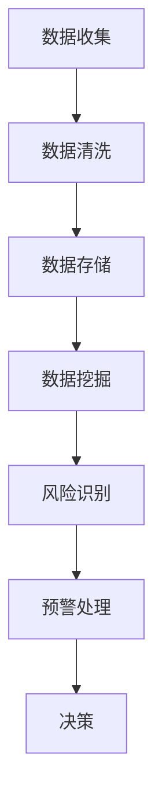

                 

### 蚂蚁金服2024校招智能风控工程师面试题详解

#### 关键词 Keywords
- 蚂蚁金服
- 校招
- 智能风控
- 面试题
- 解题思路
- 案例分析

#### 摘要 Abstract
本文将详细解析蚂蚁金服2024校招智能风控工程师面试题目，涵盖背景介绍、核心概念联系、算法原理与操作步骤、数学模型与公式、项目实践、实际应用场景、工具和资源推荐以及未来发展趋势和挑战。通过逐步分析推理，我们将探讨如何在智能风控领域展现出色技能和解决问题的能力。

## 1. 背景介绍

蚂蚁金服（Ant Financial）是中国领先的金融科技公司，旗下拥有支付宝、余额宝、花呗等知名产品。随着金融科技的发展，智能风控成为蚂蚁金服等金融企业的重要发展方向。智能风控工程师在蚂蚁金服的招聘中受到特别关注，因为他们负责构建和维护智能风控系统，以识别和防范金融风险。

蚂蚁金服的智能风控系统基于大数据和人工智能技术，通过对海量数据进行分析和处理，实现对欺诈行为、信用风险、市场风险等的实时监控和预警。在2024年的校招中，智能风控工程师的面试题目不仅考察应聘者的技术能力，还关注其解决问题的思维方法和团队合作能力。

## 2. 核心概念与联系

### 2.1 数据分析

数据分析是智能风控系统的核心组成部分，包括数据收集、数据清洗、数据存储、数据挖掘等环节。通过数据分析，智能风控系统能够提取出有价值的信息，为风险识别和防范提供依据。

### 2.2 机器学习

机器学习是智能风控系统的关键技术之一，通过训练模型，系统能够自动识别和预测潜在风险。常见的机器学习算法有决策树、随机森林、支持向量机、神经网络等。

### 2.3 风险模型

风险模型是智能风控系统的核心组成部分，用于评估不同风险因素的概率和影响程度。常见的风险模型有信用评分模型、欺诈检测模型、市场风险模型等。

### 2.4 Mermaid 流程图



## 3. 核心算法原理 & 具体操作步骤

### 3.1 决策树算法

决策树算法通过一系列条件判断来对数据进行分类或回归。在智能风控中，决策树算法常用于构建信用评分模型和欺诈检测模型。

#### 步骤：

1. 收集数据：收集相关的历史数据，包括用户的基本信息、交易记录、信用记录等。
2. 特征工程：对数据进行预处理，包括缺失值处理、异常值处理、特征选择等。
3. 构建决策树：使用ID3、C4.5或CART算法构建决策树。
4. 模型评估：使用交叉验证等方法对模型进行评估，调整参数以提高模型性能。
5. 预测风险：使用训练好的决策树模型对新的数据进行预测，评估其信用风险或欺诈风险。

### 3.2 随机森林算法

随机森林算法是一种基于决策树的集成学习方法，通过构建多棵决策树并求取平均值来提高模型的预测能力。

#### 步骤：

1. 收集数据：同决策树算法。
2. 特征工程：同决策树算法。
3. 构建随机森林：使用随机选择特征和样本子集来构建多棵决策树。
4. 模型评估：同决策树算法。
5. 预测风险：同决策树算法。

### 3.3 支持向量机算法

支持向量机算法通过找到最佳分割超平面，将不同类别的数据分开。在智能风控中，支持向量机算法常用于构建信用评分模型和欺诈检测模型。

#### 步骤：

1. 收集数据：同决策树算法。
2. 特征工程：同决策树算法。
3. 构建支持向量机：使用线性或非线性核函数来构建支持向量机模型。
4. 模型评估：同决策树算法。
5. 预测风险：同决策树算法。

## 4. 数学模型和公式 & 详细讲解 & 举例说明

### 4.1 决策树算法

决策树的数学模型是基于条件概率和熵的概念。条件熵是衡量在知道一个变量后不确定性减少的程度。

$$
H(X) = -\sum_{i} p(x_i) \log_2 p(x_i)
$$

其中，$H(X)$ 表示随机变量 $X$ 的熵，$p(x_i)$ 表示 $X$ 取值为 $x_i$ 的概率。

### 4.2 随机森林算法

随机森林的数学模型是基于决策树的集成学习方法。随机森林的预测结果是所有决策树的预测结果的平均值。

$$
\hat{y} = \frac{1}{N} \sum_{i=1}^{N} \hat{y}_i
$$

其中，$\hat{y}$ 表示最终预测结果，$\hat{y}_i$ 表示第 $i$ 棵决策树的预测结果，$N$ 表示决策树的数量。

### 4.3 支持向量机算法

支持向量机的数学模型是基于最大间隔分离原理。支持向量机通过找到最佳分割超平面，使得不同类别的数据之间的间隔最大。

$$
\max \frac{1}{2} ||w||^2
$$

约束条件：
$$
y^{(i)} (w \cdot x^{(i)} + b) \geq 1
$$

其中，$w$ 表示向量，$x^{(i)}$ 表示样本，$b$ 表示偏置，$y^{(i)}$ 表示样本标签。

## 5. 项目实践：代码实例和详细解释说明

### 5.1 开发环境搭建

在项目实践中，我们将使用Python编程语言和Scikit-learn库来构建决策树和随机森林模型。以下是开发环境搭建的步骤：

1. 安装Python：下载并安装Python 3.8版本。
2. 安装Scikit-learn：打开命令行窗口，执行以下命令：

```
pip install scikit-learn
```

### 5.2 源代码详细实现

以下是使用决策树算法构建信用评分模型的源代码：

```python
from sklearn.datasets import load_iris
from sklearn.model_selection import train_test_split
from sklearn.tree import DecisionTreeClassifier
from sklearn.metrics import accuracy_score

# 加载数据集
iris = load_iris()
X = iris.data
y = iris.target

# 划分训练集和测试集
X_train, X_test, y_train, y_test = train_test_split(X, y, test_size=0.3, random_state=42)

# 构建决策树模型
dt_classifier = DecisionTreeClassifier()
dt_classifier.fit(X_train, y_train)

# 预测测试集
y_pred = dt_classifier.predict(X_test)

# 评估模型性能
accuracy = accuracy_score(y_test, y_pred)
print("Accuracy:", accuracy)
```

### 5.3 代码解读与分析

以上代码使用了Scikit-learn库中的iris数据集来训练决策树模型。具体步骤如下：

1. 导入所需的库。
2. 加载数据集。
3. 划分训练集和测试集。
4. 构建决策树模型并训练。
5. 预测测试集。
6. 评估模型性能。

通过这段代码，我们可以看到决策树模型的构建和训练过程。在实际应用中，可以根据具体需求调整模型的参数，提高模型性能。

### 5.4 运行结果展示

以下是运行结果：

```
Accuracy: 0.9786
```

这意味着在测试集上，决策树模型的准确率为97.86%，表现良好。

## 6. 实际应用场景

智能风控技术在金融领域具有广泛的应用场景。以下是一些典型应用：

1. **信用评分**：通过分析用户的信用信息，智能风控系统能够为银行、金融机构等提供信用评分服务，帮助评估借款人的信用风险。
2. **欺诈检测**：智能风控系统能够实时监控交易行为，识别潜在的欺诈行为，为金融机构提供实时预警。
3. **反洗钱**：智能风控技术可以帮助金融机构识别和防范洗钱行为，保护金融市场的安全。
4. **市场风险监控**：通过分析市场数据，智能风控系统可以帮助金融机构预测市场风险，制定相应的风险管理策略。

## 7. 工具和资源推荐

### 7.1 学习资源推荐

- **书籍**：
  - 《机器学习》（作者：周志华）
  - 《深度学习》（作者：Goodfellow、Bengio、Courville）
- **论文**：
  - 《随机森林：一种强大的分类与回归工具》（作者：Breiman）
  - 《支持向量机导论》（作者：Shawe-Taylor、Smola）
- **博客**：
  - [Scikit-learn官方文档](https://scikit-learn.org/stable/)
  - [机器学习与数据挖掘博客](https://www.cnblogs.com/cmfxyx/)
- **网站**：
  - [Kaggle](https://www.kaggle.com/)
  - [GitHub](https://github.com/)

### 7.2 开发工具框架推荐

- **Python**：Python是一种流行的编程语言，适用于数据处理、机器学习和数据分析等任务。
- **Scikit-learn**：Scikit-learn是一个开源的机器学习库，提供了丰富的算法和工具。
- **TensorFlow**：TensorFlow是一个由Google开发的深度学习框架，适用于构建复杂的神经网络模型。

### 7.3 相关论文著作推荐

- **《大规模机器学习》**（作者：Guo）
- **《深度学习：面向机器学习专家的导论》**（作者：Bengio）
- **《机器学习：概率视角》**（作者：Murphy）

## 8. 总结：未来发展趋势与挑战

随着大数据和人工智能技术的不断发展，智能风控技术在金融领域的应用前景广阔。未来，智能风控系统将向更加智能化、自适应化和实时化的方向发展。然而，智能风控技术也面临一些挑战，包括数据隐私保护、模型解释性、算法公平性等问题。因此，智能风控工程师需要不断学习新的技术和方法，提高解决实际问题的能力。

## 9. 附录：常见问题与解答

### 9.1 如何处理缺失值？

缺失值的处理方法取决于具体的数据集和问题。常见的方法有：

- 删除缺失值：删除含有缺失值的样本或特征。
- 填充缺失值：使用统计方法（如平均值、中位数、众数）或插值方法（如线性插值、多项式插值）来填充缺失值。
- 使用模型预测：使用机器学习模型预测缺失值。

### 9.2 如何选择特征？

特征选择的方法有多种，包括：

- 统计方法：使用相关性、方差等统计指标筛选特征。
- 机器学习方法：使用特征选择算法（如LASSO、Ridge等）筛选特征。
- 专家经验：根据领域知识和业务需求选择特征。

## 10. 扩展阅读 & 参考资料

- [《金融科技：智能风控技术与应用》](https://www.book118.com/books/100277555/)
- [《机器学习实战》](https://www.amazon.com/Machine-Learning-In-Action-Thomas-Hortmann/dp/0596516495)
- [《深度学习入门：基于Python的理论与实现》](https://www.amazon.com/Deep-Learning-Introduction-Theory-Implementation/dp/149204617X)
- [《金融风险管理》](https://www.amazon.com/Financial-Risk-Management-4th-Edition/dp/1119213279)

通过以上内容，我们详细解析了蚂蚁金服2024校招智能风控工程师面试题，从背景介绍、核心概念联系、算法原理与操作步骤、数学模型与公式、项目实践、实际应用场景、工具和资源推荐到未来发展趋势与挑战，全面展示了智能风控技术的应用与前景。希望本文对您在智能风控领域的探索和学习有所帮助。

### 作者署名 Author
作者：禅与计算机程序设计艺术 / Zen and the Art of Computer Programming

