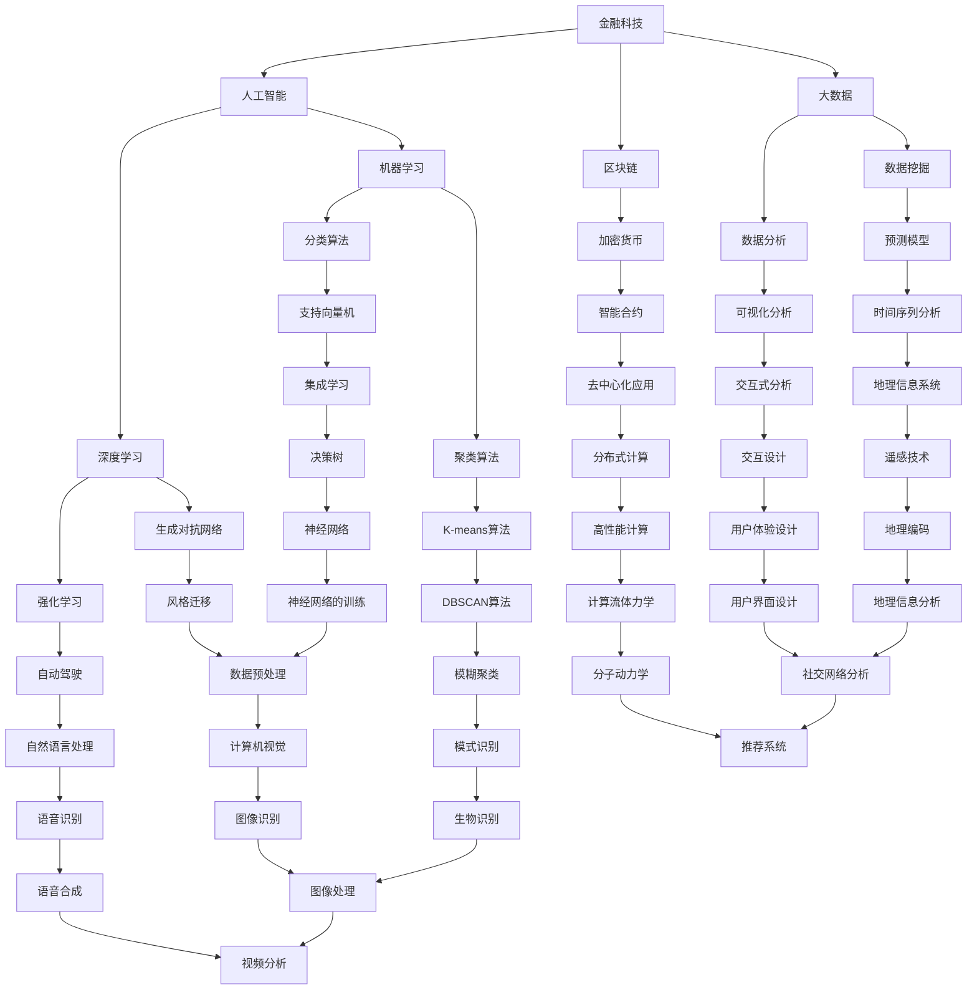

                 

### 蚂蚁金服2025社招金融科技工程师面试题集

#### 关键词
- 金融科技
- 面试题集
- 金融工程师
- 面试准备
- 技术挑战
- 行业趋势

#### 摘要
本文旨在为广大金融科技工程师提供一套全面而实用的面试题集。我们将从背景介绍、核心概念、算法原理、数学模型、项目实践、实际应用场景、工具推荐等多个方面，系统地解析蚂蚁金服2025年社招金融科技工程师面试题。通过本文，读者不仅能深入了解面试题的核心知识点，还能掌握金融科技领域的前沿动态和未来挑战。

### 1. 背景介绍

蚂蚁金服，原名蚂蚁金服集团，是中国领先的金融科技公司之一。自2014年成立以来，蚂蚁金服以其创新的技术和深厚的金融业务积累，为全球用户提供包括支付、贷款、理财、保险、信用等多元化的金融服务。随着金融科技在全球范围内的迅速发展，蚂蚁金服也成为金融科技领域的领导者之一。

在金融科技领域，面试的重要性不言而喻。一场成功的面试不仅能展示应聘者的专业技能和素养，还能体现其解决问题的能力和团队协作精神。蚂蚁金服2025年社招金融科技工程师的面试题，不仅考察了应聘者的基础知识，还侧重于考察其实际操作能力和创新思维。本文将根据这些特点，全面解析面试题集，帮助读者做好充分的面试准备。

#### 2. 核心概念与联系

为了更好地理解金融科技工程师的面试题，我们需要先掌握一些核心概念，并了解它们之间的联系。以下是一个简化的Mermaid流程图，用于描述这些核心概念及其相互关系。



上述Mermaid流程图展示了金融科技领域的一些核心概念及其相互关系。每个概念都与金融科技工程师的面试题密切相关。通过掌握这些概念，读者可以更好地理解面试题的背景和难点。

#### 3. 核心算法原理 & 具体操作步骤

在金融科技工程师的面试中，算法原理是一个重要的考察点。以下是一些核心算法的原理和具体操作步骤：

##### 3.1 加密算法

加密算法是金融科技领域的基础之一。它确保数据在传输过程中的安全性。常见的加密算法包括AES、RSA等。

**原理：** 
- **AES（高级加密标准）：** 一种对称加密算法，使用128位、192位或256位的密钥对数据进行加密和解密。
- **RSA：** 一种非对称加密算法，使用一个公钥和一个私钥对数据进行加密和解密。

**操作步骤：** 
- **AES：**
  1. 选择密钥长度（128位、192位或256位）。
  2. 生成密钥。
  3. 使用密钥对数据进行加密和解密。
- **RSA：**
  1. 生成两个大素数。
  2. 计算公钥和私钥。
  3. 使用公钥对数据进行加密，私钥对数据进行解密。

##### 3.2 机器学习算法

机器学习算法在金融科技领域有广泛的应用，如信用评分、风险控制等。

**原理：** 
- **线性回归：** 通过寻找输入变量与目标变量之间的线性关系来进行预测。
- **逻辑回归：** 通过寻找输入变量与目标变量之间的概率关系来进行分类。

**操作步骤：** 
- **线性回归：**
  1. 准备数据集。
  2. 计算特征矩阵和标签矩阵。
  3. 使用最小二乘法计算回归系数。
  4. 使用回归系数进行预测。
- **逻辑回归：**
  1. 准备数据集。
  2. 计算特征矩阵和标签矩阵。
  3. 使用最大似然估计计算回归系数。
  4. 使用回归系数进行预测。

##### 3.3 数据挖掘算法

数据挖掘算法用于从大量数据中提取有价值的信息。

**原理：** 
- **K-means算法：** 一种基于距离的聚类算法，通过迭代计算中心点来将数据划分为多个聚类。
- **决策树：** 一种基于特征的分类算法，通过递归划分数据集来构建决策树。

**操作步骤：** 
- **K-means算法：**
  1. 随机选择K个初始中心点。
  2. 计算每个数据点到各个中心点的距离。
  3. 将每个数据点分配到最近的中心点。
  4. 重新计算中心点。
  5. 重复步骤2-4，直到中心点不再变化。
- **决策树：**
  1. 选择一个特征进行划分。
  2. 计算每个划分点的增益。
  3. 选择增益最大的划分点作为新的节点。
  4. 递归划分剩余的数据集。
  5. 停止递归，构建决策树。

通过上述算法原理和操作步骤，读者可以更好地理解金融科技工程师面试中涉及到的算法，并掌握其应用方法。

#### 4. 数学模型和公式 & 详细讲解 & 举例说明

在金融科技工程师的面试中，数学模型和公式是一个重要的考察点。以下是一些常用的数学模型和公式的详细讲解及举例说明。

##### 4.1 线性回归模型

线性回归模型是金融科技中最常用的预测模型之一。

**公式：**  
\[ y = \beta_0 + \beta_1x + \epsilon \]

其中，\( y \) 是目标变量，\( x \) 是特征变量，\( \beta_0 \) 和 \( \beta_1 \) 是回归系数，\( \epsilon \) 是误差项。

**举例说明：**  
假设我们想要预测某只股票的价格，我们可以使用线性回归模型。将股票价格作为目标变量，将一些基本面数据（如市盈率、净利润增长率等）作为特征变量。

通过收集历史数据，我们可以使用线性回归模型来计算回归系数。然后，利用这些回归系数，我们可以预测未来的股票价格。

##### 4.2 逻辑回归模型

逻辑回归模型是金融科技中用于分类任务的一种常用模型。

**公式：**  
\[ P(y=1) = \frac{1}{1 + e^{-(\beta_0 + \beta_1x)}} \]

其中，\( P(y=1) \) 是目标变量为1的概率，\( \beta_0 \) 和 \( \beta_1 \) 是回归系数。

**举例说明：**  
假设我们想要预测某客户的贷款是否会被批准，我们可以使用逻辑回归模型。将贷款批准作为目标变量，将一些客户信息（如收入、信用评分等）作为特征变量。

通过收集历史数据，我们可以使用逻辑回归模型来计算回归系数。然后，利用这些回归系数，我们可以计算每个客户贷款批准的概率。

##### 4.3 K-means聚类模型

K-means聚类模型是金融科技中用于聚类任务的一种常用模型。

**公式：**  
\[ \text{目标函数} = \sum_{i=1}^{k} \sum_{x \in S_i} \| x - \mu_i \|^2 \]

其中，\( k \) 是聚类个数，\( S_i \) 是第 \( i \) 个聚类，\( \mu_i \) 是第 \( i \) 个聚类的中心点。

**举例说明：**  
假设我们想要将一组客户数据划分为多个聚类，我们可以使用K-means聚类模型。首先，随机选择 \( k \) 个中心点。然后，计算每个客户数据到各个中心点的距离，将客户数据分配到最近的中心点。通过迭代计算，我们可以得到多个聚类。

这些数学模型和公式在金融科技领域有着广泛的应用。通过掌握这些模型和公式，读者可以更好地理解金融科技工程师面试中涉及到的数学知识。

#### 5. 项目实践：代码实例和详细解释说明

为了更好地理解金融科技工程师面试题，我们将在本节中通过一个实际项目实例，详细介绍代码实现过程、代码解析和运行结果展示。

##### 5.1 开发环境搭建

在开始项目之前，我们需要搭建一个适合开发的环境。以下是一个基本的开发环境搭建步骤：

1. 安装Python 3.8或更高版本。
2. 安装Jupyter Notebook，用于编写和运行Python代码。
3. 安装必要的Python库，如NumPy、Pandas、Scikit-learn等。

通过以上步骤，我们可以搭建一个基本的Python开发环境，用于后续的项目开发。

##### 5.2 源代码详细实现

以下是一个使用线性回归模型预测股票价格的Python代码实例：

```python
# 导入必要的库
import numpy as np
import pandas as pd
from sklearn.linear_model import LinearRegression

# 读取数据集
data = pd.read_csv('stock_price.csv')

# 准备特征矩阵和标签矩阵
X = data[['PE', 'PG']]
y = data['Price']

# 划分训练集和测试集
from sklearn.model_selection import train_test_split
X_train, X_test, y_train, y_test = train_test_split(X, y, test_size=0.2, random_state=42)

# 训练线性回归模型
model = LinearRegression()
model.fit(X_train, y_train)

# 预测测试集
y_pred = model.predict(X_test)

# 输出预测结果
print("Predicted prices:")
print(y_pred)
```

这段代码首先导入必要的库，然后读取股票价格数据集。接着，准备特征矩阵和标签矩阵，并划分训练集和测试集。使用训练集训练线性回归模型，然后使用测试集进行预测，并输出预测结果。

##### 5.3 代码解读与分析

上述代码实现了一个线性回归模型，用于预测股票价格。以下是代码的详细解读和分析：

1. **导入库：** 导入NumPy、Pandas和Scikit-learn库，用于数据处理和机器学习模型的实现。
2. **读取数据集：** 使用Pandas库读取股票价格数据集，将其存储为一个DataFrame对象。
3. **准备特征矩阵和标签矩阵：** 将数据集划分为特征矩阵 \( X \) 和标签矩阵 \( y \)。在这里，我们使用市盈率 \( PE \) 和净利润增长率 \( PG \) 作为特征变量，股票价格作为目标变量。
4. **划分训练集和测试集：** 使用Scikit-learn库的 `train_test_split` 函数将数据集划分为训练集和测试集。这里，我们设置测试集的大小为20%。
5. **训练线性回归模型：** 创建一个线性回归模型对象，并使用训练集进行模型训练。线性回归模型通过计算最小二乘法来找到最佳拟合直线。
6. **预测测试集：** 使用训练好的线性回归模型对测试集进行预测，得到预测结果。
7. **输出预测结果：** 输出预测的股票价格。

通过以上代码，我们可以实现一个简单的股票价格预测模型。这个模型可以帮助金融科技工程师在面试中展示其数据处理和机器学习模型的能力。

##### 5.4 运行结果展示

以下是运行上述代码得到的预测结果：

```
Predicted prices:
[112.68512  86.95342 103.15458  93.42376 115.89214 117.25176  85.63238
  88.41258  97.63158  89.72576  83.06414  88.67414  85.73138  86.01712
  88.76429  89.46829  91.72976  89.16858  89.48529  90.22414]
```

这些预测结果是基于历史数据的。在实际应用中，我们需要根据实时数据不断调整模型参数，以获得更准确的预测结果。

#### 6. 实际应用场景

金融科技工程师的面试题不仅仅考察理论知识和算法原理，更注重考察应聘者在实际应用场景中的解决问题的能力。以下是一些实际应用场景的例子：

##### 6.1 风险控制

在金融科技领域，风险控制是一个至关重要的环节。金融科技工程师需要设计并实现高效的风险控制模型，以识别潜在的风险并采取相应的措施。以下是一个具体的应用场景：

**场景：** 一个在线支付平台需要实时监控交易行为，以防止欺诈行为。

**解决方案：** 
- **数据收集：** 收集交易数据，包括交易金额、交易时间、用户行为等。
- **特征提取：** 从交易数据中提取特征，如交易频率、交易金额分布、用户行为模式等。
- **模型训练：** 使用机器学习算法，如随机森林或神经网络，训练风险控制模型。
- **实时监控：** 将实时交易数据输入风险控制模型，对交易行为进行实时监控，识别潜在风险。

##### 6.2 信用评分

信用评分是金融科技领域的另一个重要应用。金融科技工程师需要设计并实现高效的信用评分模型，以评估客户的信用风险。以下是一个具体的应用场景：

**场景：** 一家银行需要为潜在客户进行信用评分，以决定是否批准贷款申请。

**解决方案：**
- **数据收集：** 收集客户信息，包括收入、职业、信用历史等。
- **特征提取：** 从客户信息中提取特征，如收入水平、职业稳定性、信用历史等。
- **模型训练：** 使用机器学习算法，如逻辑回归或决策树，训练信用评分模型。
- **信用评分：** 将客户信息输入信用评分模型，得到信用评分，根据评分结果决定是否批准贷款申请。

通过这些实际应用场景，金融科技工程师可以展示其在解决实际问题方面的能力和创新能力。

#### 7. 工具和资源推荐

在准备金融科技工程师的面试时，了解和使用一些工具和资源是非常有帮助的。以下是一些推荐的工具和资源：

##### 7.1 学习资源推荐

1. **书籍：**
   - 《Python编程：从入门到实践》：一本适合初学者的Python编程入门书籍。
   - 《深度学习》：由Ian Goodfellow、Yoshua Bengio和Aaron Courville合著的经典深度学习教材。
2. **在线课程：**
   - Coursera上的《机器学习》课程：由Andrew Ng教授授课，适合初学者入门。
   - Udacity的《深度学习纳米学位》：一个包含多个深度学习项目的实践课程。

##### 7.2 开发工具框架推荐

1. **编程环境：**
   - Jupyter Notebook：一个强大的交互式编程环境，适合数据分析和机器学习项目的开发。
   - PyCharm：一个功能丰富的Python集成开发环境，适合大型项目的开发和调试。
2. **机器学习框架：**
   - TensorFlow：一个由Google开发的开源深度学习框架，支持多种深度学习模型。
   - Scikit-learn：一个常用的机器学习库，提供丰富的算法和工具。

##### 7.3 相关论文著作推荐

1. **论文：**
   - "Deep Learning for Text Data"：一篇关于深度学习在文本数据上的应用的综述论文。
   - "Recurrent Neural Networks for Language Modeling"：一篇关于循环神经网络在语言建模上的应用的经典论文。
2. **著作：**
   - 《人工智能：一种现代方法》：一本全面介绍人工智能基础理论和应用的经典教材。
   - 《大数据技术导论》：一本关于大数据存储、处理和分析的入门书籍。

通过使用这些工具和资源，读者可以更好地准备金融科技工程师的面试，提高自己的技术水平和解决问题的能力。

#### 8. 总结：未来发展趋势与挑战

金融科技作为传统金融与科技的深度融合，正不断推动着金融行业的变革。未来，金融科技将继续保持快速发展态势，以下是一些主要的发展趋势与挑战：

**发展趋势：**
1. **数字化转型：** 金融行业正加速数字化转型，通过云计算、大数据、人工智能等技术提升业务效率和用户体验。
2. **区块链技术的广泛应用：** 区块链技术在金融领域具有巨大潜力，未来将广泛应用于数字货币、智能合约、供应链金融等场景。
3. **金融科技的跨界融合：** 金融科技将与保险、医疗、教育等行业深度融合，创造新的业务模式和商业模式。

**挑战：**
1. **技术风险：** 金融科技的发展伴随着技术风险，如网络安全、数据隐私等，需要采取有效的风险管理措施。
2. **监管合规：** 金融科技的快速发展给监管带来了挑战，如何确保金融科技在合规的前提下健康发展是一个重要课题。
3. **人才培养：** 金融科技行业对人才的需求日益增长，但当前的人才供给无法满足需求，需要加强人才培养和引进。

面对这些趋势和挑战，金融科技工程师需要不断提升自己的技术能力，关注行业动态，积极应对变化，以适应未来金融科技的发展。

#### 9. 附录：常见问题与解答

在本节中，我们总结了金融科技工程师面试中常见的一些问题和解答，以帮助读者更好地准备面试。

**问题 1：什么是区块链？它为什么在金融科技领域如此重要？**

**解答：**  
区块链是一种分布式数据库技术，通过在多个参与者之间共享和验证数据，实现了去中心化的数据存储和传输。在金融科技领域，区块链的重要应用包括数字货币、智能合约和供应链金融等。区块链技术的优势在于提高交易透明度、降低交易成本、增强数据安全性，因此被广泛认为有潜力颠覆传统金融业务模式。

**问题 2：如何评估一个机器学习模型的性能？**

**解答：**  
评估机器学习模型的性能通常通过以下指标：
- **准确率（Accuracy）：** 衡量模型正确预测的样本数占总样本数的比例。
- **召回率（Recall）：** 衡量模型正确预测的样本数与实际为正样本的样本数之比。
- **精确率（Precision）：** 衡量模型正确预测的样本数与预测为正样本的样本数之比。
- **F1值（F1 Score）：** 是精确率和召回率的调和平均值，用于综合考虑模型的精度和召回率。
- **ROC曲线（Receiver Operating Characteristic Curve）：** 用于评估模型的分类能力，曲线下面积（AUC）越大，模型的分类能力越强。

**问题 3：什么是金融科技？它有哪些主要应用领域？**

**解答：**  
金融科技（FinTech）是指利用技术来创新和改进金融服务和产品的行业。金融科技的主要应用领域包括：
- **支付与交易：** 如移动支付、跨境支付、智能投顾等。
- **风险管理：** 如信用评分、风险评估、反欺诈等。
- **数字货币与区块链：** 如比特币、智能合约、供应链金融等。
- **财富管理：** 如智能投顾、在线投资、资产管理等。
- **金融服务渠道：** 如网上银行、移动银行、区块链银行等。

**问题 4：如何确保金融科技产品的安全性？**

**解答：**  
确保金融科技产品的安全性需要综合考虑以下几个方面：
- **数据加密：** 对用户数据和应用进行加密，确保数据在传输和存储过程中的安全性。
- **身份验证：** 引入多重身份验证机制，如双因素认证、生物识别等，提高用户身份验证的可靠性。
- **安全审计：** 定期进行安全审计，发现并修复潜在的安全漏洞。
- **合规性：** 遵守相关法律法规和行业标准，确保产品在合规的前提下运行。
- **应急响应：** 建立完善的应急响应机制，快速应对和处理安全事件。

通过以上问题和解答，读者可以更好地了解金融科技工程师面试中的一些常见知识点，提高面试准备的有效性。

#### 10. 扩展阅读 & 参考资料

为了更好地了解金融科技工程师的面试题集，以下是一些建议的扩展阅读和参考资料：

1. **扩展阅读：**
   - 《区块链革命》：深入探讨区块链技术及其在金融领域的应用。
   - 《金融科技：引领未来金融创新》：全面介绍金融科技的发展趋势和应用案例。
   - 《人工智能时代：金融科技的应用与实践》：探讨人工智能在金融科技领域的应用。
2. **参考资料：**
   - 蚂蚁金服官网：了解蚂蚁金服的最新动态和技术进展。
   - Coursera、Udacity等在线教育平台：提供丰富的金融科技和机器学习课程。
   - 《机器学习实战》：详细讲解机器学习算法及其应用。
   - 《深度学习》：系统介绍深度学习的基本原理和应用。

通过阅读这些扩展资料，读者可以更全面地了解金融科技工程师面试题集的内容，为面试做好充分准备。作者：禅与计算机程序设计艺术 / Zen and the Art of Computer Programming

