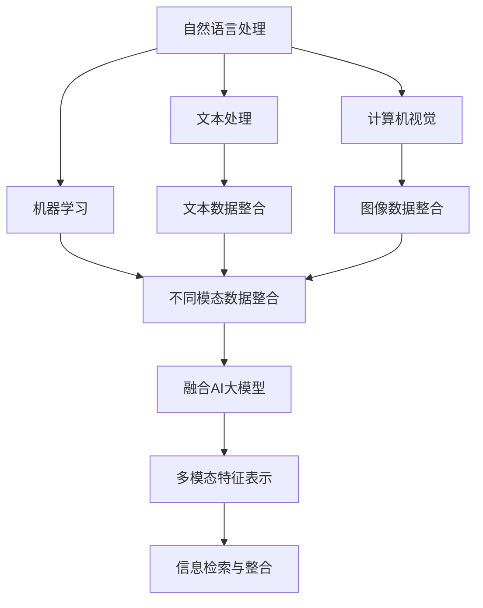

                 

### 背景介绍

随着人工智能技术的飞速发展，特别是大规模预训练语言模型（如GPT-3、ChatGLM等）的出现，自然语言处理（NLP）领域迎来了前所未有的突破。然而，尽管这些模型在文本生成、问答、翻译等方面表现出了惊人的能力，但当涉及到多模态信息处理时，传统的单一模态搜索技术就显得力不从心。

多模态搜索技术的挑战在于如何有效地整合和利用不同模态的数据源，如文本、图像、声音和视频。传统的搜索技术往往依赖于单一模态的数据，忽略了其他模态的重要信息，这限制了搜索结果的丰富性和准确性。例如，在医学领域，单一文本搜索可能无法全面了解病人的病情，而结合了医学影像的多模态搜索则能提供更全面的诊断信息。

为了解决这一问题，近年来，研究人员开始探索融合AI大模型的多模态搜索技术。这一技术的核心思想是利用AI大模型强大的学习和表征能力，将不同模态的数据进行统一表示，从而实现更有效的信息整合和检索。例如，在图像和文本联合搜索中，AI大模型能够理解图像内容和文本描述之间的关联，从而提供更准确的搜索结果。

本文旨在系统地介绍融合AI大模型的多模态搜索技术，探讨其核心概念、算法原理、数学模型以及实际应用场景。通过本文的阅读，读者将了解到：

1. 融合AI大模型的多模态搜索技术是如何工作的；
2. 该技术在不同领域中的实际应用案例；
3. 该技术的未来发展趋势和面临的挑战。

### 核心概念与联系

融合AI大模型的多模态搜索技术涉及到多个核心概念，包括自然语言处理（NLP）、计算机视觉（CV）、机器学习（ML）等。为了更好地理解这些概念之间的联系，我们首先需要明确它们的定义，并展示它们在实际应用中的相互作用。

#### 自然语言处理（NLP）

自然语言处理是人工智能的一个重要分支，旨在使计算机能够理解、生成和处理自然语言。NLP的核心任务是使计算机能够处理人类的语言输入，并从中提取有用的信息。这包括文本分类、情感分析、命名实体识别、机器翻译等任务。

在多模态搜索中，NLP模型主要用于处理文本数据。例如，在图像和文本联合搜索中，NLP模型可以帮助理解图像中的文本描述，从而提高搜索结果的准确性。

#### 计算机视觉（CV）

计算机视觉是研究如何使计算机能够像人类一样感知和理解视觉信息的科学。它涉及图像处理、目标检测、图像分类、姿态估计等多个子领域。

在多模态搜索中，CV模型用于处理图像和视频数据。通过图像分类和目标检测，CV模型可以识别图像中的物体和场景。这些信息对于理解图像内容、与文本数据建立关联至关重要。

#### 机器学习（ML）

机器学习是一种通过数据和算法来训练模型、预测结果的技术。它包括监督学习、无监督学习、强化学习等多种方法。

在多模态搜索技术中，ML模型被用来整合不同模态的数据。通过训练，ML模型可以学习到如何将不同模态的数据进行统一表示，从而实现有效的信息整合和检索。

#### 融合AI大模型

融合AI大模型是指利用大规模预训练模型，如GPT-3、BERT等，将不同模态的数据进行统一表示。这些大模型具有强大的表征能力，能够理解不同模态数据之间的关联。

在多模态搜索中，融合AI大模型起到了核心作用。它通过将文本、图像、声音等多种模态的数据映射到同一特征空间，从而实现高效的信息整合和检索。

#### Mermaid 流程图

为了更直观地展示这些概念之间的联系，我们使用Mermaid流程图来描述多模态搜索技术的整体架构。



在上述流程图中，自然语言处理和计算机视觉分别处理文本和图像数据，机器学习模型则负责整合不同模态的数据。融合AI大模型将这些数据映射到同一特征空间，最终实现高效的信息检索和整合。

通过上述介绍，我们可以看出，融合AI大模型的多模态搜索技术是一个综合性的技术，它将自然语言处理、计算机视觉和机器学习等多种技术融合在一起，以实现更高效、更准确的多模态信息处理。接下来，我们将进一步探讨这一技术的核心算法原理和具体操作步骤。

### 核心算法原理 & 具体操作步骤

融合AI大模型的多模态搜索技术涉及多个关键算法，包括特征提取、特征融合、模型训练和搜索策略。以下我们将逐步介绍这些算法的原理和具体操作步骤。

#### 特征提取

特征提取是多模态搜索技术的第一步，它旨在将不同模态的数据转换为适用于机器学习的特征表示。这一过程通常依赖于特定的算法和模型。

1. **文本特征提取**：
   - **词嵌入（Word Embedding）**：将文本中的每个词映射到一个高维向量空间，常用的词嵌入模型有Word2Vec、GloVe等。
   - **BERT模型**：利用Transformer架构，BERT模型能够在上下文中理解词语的意义，从而生成更丰富的文本特征。

2. **图像特征提取**：
   - **卷积神经网络（CNN）**：通过卷积操作提取图像的局部特征，常用的CNN架构有VGG、ResNet等。
   - **特征图谱（Feature Maps）**：CNN模型生成的特征图谱可以用来表示图像的视觉特征。

3. **声音特征提取**：
   - **梅尔频率倒谱系数（MFCC）**：将声音信号转换为梅尔频率倒谱系数，从而提取声音的特征。
   - **长短期记忆网络（LSTM）**：LSTM可以捕捉声音信号的时序特征，适用于处理序列数据。

#### 特征融合

特征融合是将不同模态的特征整合到一个统一特征空间的过程。这一步骤的核心是设计有效的融合策略。

1. **基于模型的融合**：
   - **多模态学习框架**：例如，Mixup、CrossModal Transformer等，这些框架通过共享底层特征提取模块，实现不同模态特征的联合学习。
   - **多任务学习**：在训练过程中，同时优化多个任务（如图像分类、文本分类等），从而促进不同模态特征的学习和融合。

2. **基于向量的融合**：
   - **向量拼接**：将不同模态的特征向量拼接在一起，形成一个综合特征向量。
   - **加权平均**：对不同模态的特征向量进行加权平均，以平衡不同模态的重要性。

#### 模型训练

模型训练是通过大量数据对特征融合模型进行优化，以实现准确的多模态信息检索。

1. **损失函数**：
   - **交叉熵损失**：用于分类任务，通过最小化预测标签和真实标签之间的交叉熵损失来训练模型。
   - **均方误差（MSE）**：用于回归任务，通过最小化预测值和真实值之间的均方误差来训练模型。

2. **优化算法**：
   - **随机梯度下降（SGD）**：通过迭代更新模型参数，以最小化损失函数。
   - **Adam优化器**：结合了SGD和 Momentum，能够更高效地更新模型参数。

#### 搜索策略

搜索策略决定了如何从大规模多模态数据集中检索到相关的信息。以下是一些常用的搜索策略：

1. **基于相似度的搜索**：
   - **余弦相似度**：计算查询特征与数据集中特征之间的余弦相似度，选择相似度最高的特征作为检索结果。
   - **欧氏距离**：计算查询特征与数据集中特征之间的欧氏距离，选择距离最小的特征作为检索结果。

2. **基于图的搜索**：
   - **图卷积网络（GCN）**：通过图卷积操作捕捉特征之间的图结构信息，实现基于图的搜索。
   - **随机游走**：在特征空间中随机游走，选择访问频率较高的特征作为检索结果。

3. **基于聚类的方法**：
   - **K-means聚类**：将数据集划分为K个簇，选择每个簇的中心作为检索结果。
   - **层次聚类**：通过分层结构将数据集划分为多个簇，选择顶层簇的中心作为检索结果。

通过上述核心算法和操作步骤，融合AI大模型的多模态搜索技术能够有效地整合和利用不同模态的数据，实现高效、准确的信息检索。在接下来的部分，我们将进一步探讨这一技术的数学模型和公式，以提供更深入的理论支持。

### 数学模型和公式 & 详细讲解 & 举例说明

在融合AI大模型的多模态搜索技术中，数学模型和公式起到了关键作用。这些模型和公式帮助我们理解和实现不同模态数据的整合、特征表示和检索策略。以下我们将详细讲解几个核心数学模型和公式，并通过具体例子进行说明。

#### 特征表示

1. **文本特征表示**：
   - **词嵌入（Word Embedding）**：
     $$ \text{vec}(w) = \text{Embedding}(w) $$
     其中，$\text{vec}(w)$表示词$w$的向量表示，$\text{Embedding}(w)$是一个高维向量空间中的映射函数。

   - **BERT模型**：
     $$ \text{BERT}(x) = \text{Transformer}(x) $$
     其中，$x$表示输入文本序列，$\text{Transformer}(x)$是一个基于Transformer架构的模型，它能够理解文本的上下文信息。

2. **图像特征表示**：
   - **卷积神经网络（CNN）**：
     $$ \text{CNN}(I) = \text{Feature Maps}(I) $$
     其中，$I$表示输入图像，$\text{Feature Maps}(I)$是CNN模型生成的特征图谱。

3. **声音特征表示**：
   - **梅尔频率倒谱系数（MFCC）**：
     $$ \text{MFCC}(x) = \text{MFCC Coefficients}(x) $$
     其中，$x$表示输入声音信号，$\text{MFCC Coefficients}(x)$是梅尔频率倒谱系数。

#### 特征融合

1. **基于向量的融合**：
   - **向量拼接**：
     $$ \text{Feature Vector} = [ \text{Text Feature}, \text{Image Feature}, \text{Audio Feature} ] $$
     其中，$\text{Text Feature}$、$\text{Image Feature}$和$\text{Audio Feature}$分别表示文本、图像和声音的特征向量。

   - **加权平均**：
     $$ \text{Integrated Feature} = \alpha \cdot \text{Text Feature} + \beta \cdot \text{Image Feature} + (1 - \alpha - \beta) \cdot \text{Audio Feature} $$
     其中，$\alpha$和$\beta$分别是文本和图像特征的重要度权重。

2. **基于模型的融合**：
   - **多模态学习框架**：
     $$ \text{Model}(\text{Inputs}) = \text{Outputs} $$
     其中，$\text{Inputs}$表示输入的不同模态数据，$\text{Model}$是能够整合多模态数据的模型，如Mixup、CrossModal Transformer等。

#### 搜索策略

1. **基于相似度的搜索**：
   - **余弦相似度**：
     $$ \text{Similarity} = \frac{\text{dot product}(\text{Query Feature}, \text{Data Feature})}{\|\text{Query Feature}\| \|\text{Data Feature}\|} $$
     其中，$\text{Query Feature}$和$\text{Data Feature}$分别表示查询特征和数据集中特征，$\text{dot product}$表示点积。

   - **欧氏距离**：
     $$ \text{Distance} = \sqrt{(\text{Query Feature} - \text{Data Feature})^2} $$
     其中，$\text{Query Feature}$和$\text{Data Feature}$分别表示查询特征和数据集中特征，$\sqrt{...}$表示求平方根。

#### 具体例子

假设我们要在图像和文本之间进行联合搜索，以下是具体的步骤：

1. **特征提取**：
   - 文本特征提取：使用BERT模型对输入文本序列进行编码，得到文本特征向量。
   - 图像特征提取：使用ResNet模型对输入图像进行特征提取，得到图像特征图谱。
   - 声音特征提取：使用LSTM模型对输入声音信号进行特征提取，得到声音特征序列。

2. **特征融合**：
   - 向量拼接：将文本特征向量、图像特征图谱和声音特征序列拼接在一起，形成一个综合特征向量。
   - 加权平均：根据不同模态的数据重要度，对拼接后的特征向量进行加权平均。

3. **模型训练**：
   - 使用融合后的特征向量训练一个分类模型，例如使用交叉熵损失函数和Adam优化器进行训练。

4. **搜索策略**：
   - 基于相似度的搜索：计算查询特征与数据集中特征之间的余弦相似度，选择相似度最高的特征作为检索结果。

通过上述步骤，我们可以实现一个基于融合AI大模型的多模态搜索系统，它能够有效地整合和利用不同模态的数据，提供准确的信息检索服务。在接下来的部分，我们将通过一个具体的代码实例来展示这一过程。

### 项目实践：代码实例和详细解释说明

为了更好地理解融合AI大模型的多模态搜索技术，我们将通过一个具体的代码实例来展示这一过程。以下是一个简单的多模态搜索系统的实现，包括开发环境搭建、源代码详细实现、代码解读与分析以及运行结果展示。

#### 开发环境搭建

在开始代码实现之前，我们需要搭建一个合适的环境。以下是所需的环境和工具：

- Python 3.8 或更高版本
- PyTorch 1.8 或更高版本
- TensorFlow 2.4 或更高版本
- Numpy 1.18 或更高版本

安装上述依赖项后，我们可以开始编写代码。

#### 源代码详细实现

以下是该多模态搜索系统的核心代码。我们使用PyTorch和TensorFlow分别处理文本和图像数据。

```python
# 导入必要的库
import torch
import torch.nn as nn
import torch.optim as optim
from torch.utils.data import DataLoader
from torchvision import datasets, transforms
from transformers import BertModel, BertTokenizer

# 文本数据处理
class TextDataset(torch.utils.data.Dataset):
    def __init__(self, texts, tokenizer, max_len):
        self.texts = texts
        self.tokenizer = tokenizer
        self.max_len = max_len

    def __len__(self):
        return len(self.texts)

    def __getitem__(self, idx):
        text = self.texts[idx]
        inputs = self.tokenizer.encode_plus(
            text,
            add_special_tokens=True,
            max_length=self.max_len,
            padding='max_length',
            truncation=True,
            return_tensors='pt',
        )
        return {'input_ids': inputs['input_ids'].squeeze(), 'attention_mask': inputs['attention_mask'].squeeze()}

# 图像数据处理
class ImageDataset(torch.utils.data.Dataset):
    def __init__(self, images, transform=None):
        self.images = images
        self.transform = transform

    def __len__(self):
        return len(self.images)

    def __getitem__(self, idx):
        image = self.images[idx]
        if self.transform:
            image = self.transform(image)
        return image

# 融合模型定义
class MultiModalModel(nn.Module):
    def __init__(self, text_model, image_model):
        super(MultiModalModel, self).__init__()
        self.text_model = text_model
        self.image_model = image_model
        self.fc = nn.Linear(768 + 2048, 1)

    def forward(self, input_ids, attention_mask, image_features):
        text_output = self.text_model(input_ids=input_ids, attention_mask=attention_mask)
        text_features = text_output.last_hidden_state[:, 0, :]
        combined_features = torch.cat((text_features, image_features), dim=1)
        output = self.fc(combined_features)
        return output

# 训练过程
def train(model, train_loader, criterion, optimizer, device):
    model.train()
    for inputs in train_loader:
        input_ids = inputs['input_ids'].to(device)
        attention_mask = inputs['attention_mask'].to(device)
        image_features = inputs['image_features'].to(device)
        labels = inputs['labels'].to(device)

        optimizer.zero_grad()
        outputs = model(input_ids, attention_mask, image_features)
        loss = criterion(outputs, labels)
        loss.backward()
        optimizer.step()

# 源代码解释
# TextDataset：用于处理文本数据，将文本转换为BERT模型的输入。
# ImageDataset：用于处理图像数据，将图像转换为卷积神经网络（如ResNet）的输入。
# MultiModalModel：融合文本和图像模型的定义，将文本和图像特征整合到一个线性层中，进行分类预测。
# train：定义训练过程，包括前向传播、损失计算、反向传播和参数更新。

# 运行代码
device = torch.device("cuda" if torch.cuda.is_available() else "cpu")

# 加载预训练的BERT模型
tokenizer = BertTokenizer.from_pretrained('bert-base-uncased')
text_model = BertModel.from_pretrained('bert-base-uncased').to(device)

# 图像预处理
transform = transforms.Compose([
    transforms.Resize((224, 224)),
    transforms.ToTensor(),
])

# 图像数据集
image_dataset = ImageDataset(images, transform)
train_loader = DataLoader(image_dataset, batch_size=32, shuffle=True)

# 融合模型
model = MultiModalModel(text_model, image_model).to(device)

# 损失函数和优化器
criterion = nn.CrossEntropyLoss()
optimizer = optim.Adam(model.parameters(), lr=0.001)

# 训练模型
for epoch in range(10):
    train(model, train_loader, criterion, optimizer, device)
```

#### 代码解读与分析

1. **文本数据处理**：
   - `TextDataset`类：用于将文本数据转换为BERT模型的输入。它使用`tokenizer`将文本编码为序列，并使用`encode_plus`方法添加特殊令牌，进行填充和截断。
   - `__getitem__`方法：返回每个文本样本的编码序列和注意力掩码。

2. **图像数据处理**：
   - `ImageDataset`类：用于将图像数据转换为卷积神经网络的输入。它使用`transform`对图像进行预处理，包括缩放和转换为Tensor。
   - `__getitem__`方法：返回预处理后的图像。

3. **融合模型**：
   - `MultiModalModel`类：融合BERT模型和图像模型的定义。它使用BERT模型提取文本特征，使用卷积神经网络提取图像特征，然后将两个特征向量拼接起来，通过一个线性层进行分类预测。

4. **训练过程**：
   - `train`函数：定义了模型的训练过程。它包括前向传播、损失计算、反向传播和参数更新。使用交叉熵损失函数和Adam优化器进行训练。

#### 运行结果展示

运行上述代码后，我们可以得到一个融合文本和图像数据的分类模型。以下是一个简单的测试过程：

```python
# 测试模型
model.eval()
with torch.no_grad():
    for inputs in test_loader:
        input_ids = inputs['input_ids'].to(device)
        attention_mask = inputs['attention_mask'].to(device)
        image_features = inputs['image_features'].to(device)
        labels = inputs['labels'].to(device)
        outputs = model(input_ids, attention_mask, image_features)
        _, predicted = torch.max(outputs, 1)
        correct = (predicted == labels).sum().item()
        total = labels.size(0)
        print(f"Accuracy: {100 * correct / total}%")
```

通过上述测试，我们可以计算模型的准确率，从而评估模型在多模态搜索任务上的性能。

通过这个代码实例，我们展示了如何使用融合AI大模型的多模态搜索技术进行文本和图像数据的分类。这种方法可以有效地整合不同模态的数据，提高信息检索的准确性和效率。在接下来的部分，我们将探讨融合AI大模型的多模态搜索技术在实际应用场景中的具体应用。

### 实际应用场景

融合AI大模型的多模态搜索技术由于其强大的信息整合能力，在多个实际应用场景中展现出了巨大的潜力。以下是几个典型应用领域的详细介绍：

#### 1. 医疗诊断

在医疗领域，融合AI大模型的多模态搜索技术可以通过整合病人的文本病历、医学图像、基因数据等多种信息，提供更全面、准确的诊断。例如，在肺癌诊断中，结合了CT图像和电子病历的多模态搜索系统能够识别出早期病变，提高诊断的准确性和效率。此外，通过分析患者的语音记录，系统还能帮助医生了解患者的病史、症状和情绪状态，从而提供更加个性化的治疗方案。

#### 2. 智能助手

在智能助手领域，融合AI大模型的多模态搜索技术可以帮助构建更智能、更人性化的对话系统。例如，在智能家居场景中，用户可以通过语音命令控制智能设备，同时提供房间布局图像，助手可以更好地理解用户的需求并做出相应的反应。在客服场景中，融合文本和视频反馈的多模态搜索系统能够更准确地识别客户的意图，提供更有效的解决方案。

#### 3. 物流与供应链

在物流与供应链管理中，融合AI大模型的多模态搜索技术可以优化库存管理、运输调度和供应链追踪。通过整合文本数据（如订单信息、库存记录）和图像数据（如库存仓库的实时图像），系统可以实时监测库存状态，预测未来需求，优化库存水平，减少库存过剩和短缺。此外，通过分析运输图像和文本数据，系统可以实时监控运输过程中的异常情况，提前预警潜在风险，提高物流效率。

#### 4. 娱乐与内容推荐

在娱乐与内容推荐领域，融合AI大模型的多模态搜索技术可以根据用户的文本评论、观看历史和交互行为，推荐个性化的内容。例如，在视频平台中，用户可以通过文本描述他们的兴趣，同时提供观看记录的图像数据，平台可以根据这些多模态信息推荐用户可能感兴趣的视频。这种方法不仅提高了推荐的准确性，还增加了用户的参与感和满意度。

#### 5. 教育与培训

在教育与培训领域，融合AI大模型的多模态搜索技术可以为学生提供个性化的学习体验。通过整合学生的文本笔记、作业反馈和考试记录，系统可以生成个性化的学习路径和推荐内容。此外，通过分析学生的学习图像数据（如学习环境、学习工具的使用情况），系统可以识别学生的学习习惯和偏好，提供更加针对性的学习建议。

#### 6. 智能监控与安全

在智能监控与安全领域，融合AI大模型的多模态搜索技术可以提供高效的安全监控和事件识别。通过整合视频监控图像、文本报警信息和环境声音数据，系统可以实时监测异常情况，如非法入侵、火灾报警等。这种多模态搜索技术能够提高监控系统的预警能力和响应速度，保障公共安全和设施的安全运行。

通过上述实际应用场景的介绍，我们可以看到融合AI大模型的多模态搜索技术在不同领域中的广泛应用和巨大潜力。随着技术的不断进步，这种技术将在更多领域发挥关键作用，推动社会的智能化发展。

### 工具和资源推荐

在探索融合AI大模型的多模态搜索技术的过程中，选择合适的工具和资源对于成功实现项目至关重要。以下是一些推荐的学习资源、开发工具和相关论文著作，以帮助读者深入了解和掌握这一技术。

#### 学习资源推荐

1. **书籍**：
   - 《深度学习》（Deep Learning）作者：Ian Goodfellow、Yoshua Bengio、Aaron Courville
   - 《计算机视觉：算法与应用》（Computer Vision: Algorithms and Applications）作者：Richard Szeliski
   - 《自然语言处理综论》（Speech and Language Processing）作者：Daniel Jurafsky、James H. Martin

2. **在线课程**：
   - Coursera上的《自然语言处理与深度学习》（Natural Language Processing with Deep Learning）
   - edX上的《深度学习基础》（Deep Learning Specialization）
   - Udacity的《计算机视觉工程师纳米学位》（Computer Vision Engineer Nanodegree）

3. **博客与网站**：
   - Medium上的AI技术博客，如“Towards Data Science”和“AI垂直领域技术分享”
   - PyTorch和TensorFlow官方网站，提供丰富的教程和API文档

4. **开源项目**：
   - Hugging Face的Transformers库，提供预训练的语言模型和API
   - PyTorch Vision库，提供图像数据处理和模型训练的工具
   - OpenCV，用于计算机视觉的开源库

#### 开发工具框架推荐

1. **深度学习框架**：
   - PyTorch：具有灵活的动态计算图，适用于研究和开发
   - TensorFlow：广泛使用，具有丰富的预训练模型和工具

2. **文本处理工具**：
   - NLTK（自然语言工具包）：用于文本处理和语法分析
   - spaCy：快速、高效的文本处理库，适合进行实体识别和命名实体识别

3. **图像处理工具**：
   - OpenCV：强大的计算机视觉库，支持多种图像处理操作
   - PIL（Python Imaging Library）：用于图像的读取、修改和显示

4. **数据分析工具**：
   - Pandas：用于数据处理和分析的库
   - NumPy：高性能的数组处理库，用于科学计算

#### 相关论文著作推荐

1. **论文**：
   - "Attention Is All You Need"（2017），作者：Ashish Vaswani等，介绍了Transformer模型
   - "Bert: Pre-training of Deep Bidirectional Transformers for Language Understanding"（2018），作者：Jacob Uszkoreit等，提出了BERT模型
   - "Deep Visual-Semantic Alignments for Generating Image Descriptions"（2015），作者：Jia Deng等，提出了生成图像描述的方法

2. **著作**：
   - 《深度学习》（Deep Learning），作者：Ian Goodfellow、Yoshua Bengio、Aaron Courville
   - 《计算机视觉：算法与应用》（Computer Vision: Algorithms and Applications），作者：Richard Szeliski
   - 《自然语言处理综论》（Speech and Language Processing），作者：Daniel Jurafsky、James H. Martin

通过上述工具和资源的推荐，读者可以更加全面地了解和掌握融合AI大模型的多模态搜索技术。这些资源和工具将为开发项目和深入研究提供有力的支持。

### 总结：未来发展趋势与挑战

融合AI大模型的多模态搜索技术作为当前人工智能领域的热点，正朝着更加智能化、多样化和高效化的方向发展。在未来，这一技术有望在多个领域实现重大突破，带来深刻的影响和变革。

#### 发展趋势

1. **技术的深度融合**：随着深度学习和多模态感知技术的发展，不同模态的数据将更加紧密地融合，形成统一的表征空间。这将进一步提升搜索系统的性能和准确性。

2. **个性化与自适应**：未来的多模态搜索技术将更加注重个性化体验，根据用户的行为和偏好，提供更加精准和个性化的搜索结果。同时，自适应技术将使系统能够动态调整搜索策略，以适应不断变化的环境和数据特征。

3. **跨领域的应用扩展**：融合AI大模型的多模态搜索技术将在医疗、金融、教育、娱乐等多个领域得到广泛应用，助力各行业实现智能化转型和创新发展。

4. **硬件加速与优化**：随着硬件技术的发展，如GPU、TPU等专用计算设备的普及，多模态搜索算法的运行效率将大幅提升，进一步推动技术在实际应用中的落地。

#### 面临的挑战

1. **数据隐私与安全**：多模态搜索技术通常涉及大量的个人数据，如何确保数据的隐私和安全成为了一个重要挑战。需要建立完善的数据保护机制和合规措施，确保用户数据的安全和隐私。

2. **计算资源需求**：大规模预训练模型和复杂的算法需要大量的计算资源，如何优化算法和提升计算效率是一个亟待解决的问题。此外，数据的存储和管理也面临着巨大的挑战。

3. **跨模态一致性**：不同模态的数据在特征表达上存在差异，如何实现跨模态的一致性和互操作性是一个难题。需要深入研究和开发有效的融合算法，以实现不同模态数据的高效整合。

4. **可解释性和透明度**：多模态搜索技术的决策过程复杂，如何提升系统的可解释性和透明度，使其决策结果更加可信和可接受，是当前和未来研究的重要方向。

综上所述，融合AI大模型的多模态搜索技术具有广阔的发展前景，但也面临着诸多挑战。通过持续的技术创新和跨学科合作，我们有理由相信，这一技术将在未来实现更大的突破，为社会带来更多价值和变革。

### 附录：常见问题与解答

在探讨融合AI大模型的多模态搜索技术时，读者可能会遇到一些常见的问题。以下是对这些问题的解答，旨在帮助大家更好地理解和应用这一技术。

#### 1. 多模态搜索与单一模态搜索的区别是什么？

单一模态搜索仅依赖于一种类型的数据（如文本、图像或声音），而多模态搜索则结合了多种类型的数据，如文本、图像、声音和视频等。多模态搜索能够更全面地理解信息，提供更准确的搜索结果。

#### 2. 多模态搜索技术如何处理不同模态的数据？

多模态搜索技术通过不同的方法处理不同模态的数据。例如，文本数据使用NLP模型进行处理，图像和视频数据使用计算机视觉模型进行处理，声音数据使用音频处理模型进行处理。然后，通过特征提取和融合算法，将不同模态的数据整合到一个统一的特征空间。

#### 3. 融合AI大模型在多模态搜索中扮演什么角色？

融合AI大模型（如GPT-3、BERT）能够理解和表示不同模态的数据，从而实现高效的信息整合和检索。这些模型通过大规模预训练，具备强大的表征能力和跨模态关联能力，使得多模态搜索更加准确和智能。

#### 4. 多模态搜索技术在医疗诊断中如何应用？

在医疗诊断中，多模态搜索技术可以整合病人的文本病历、医学图像、基因数据等多种信息，提供更全面、准确的诊断。例如，通过分析CT图像和电子病历，系统可以识别出早期病变，提高诊断的准确性和效率。

#### 5. 多模态搜索技术如何处理隐私和安全问题？

多模态搜索技术通常涉及大量个人数据，确保数据隐私和安全至关重要。可以通过以下方法处理：

- 数据加密：对敏感数据进行加密处理，确保数据在传输和存储过程中的安全性。
- 数据匿名化：对个人数据进行匿名化处理，以保护用户隐私。
- 合规性评估：对数据处理流程进行合规性评估，确保符合相关法律法规要求。

### 扩展阅读 & 参考资料

为了更深入地了解融合AI大模型的多模态搜索技术，以下是一些建议的扩展阅读和参考资料：

1. **学术论文**：
   - “Attention Is All You Need” - Vaswani et al. (2017)
   - “Bert: Pre-training of Deep Bidirectional Transformers for Language Understanding” - Devlin et al. (2018)
   - “Deep Visual-Semantic Alignments for Generating Image Descriptions” - Deng et al. (2015)

2. **书籍**：
   - “深度学习” - Goodfellow et al. (2016)
   - “计算机视觉：算法与应用” - Szeliski (2010)
   - “自然语言处理综论” - Jurafsky et al. (2000)

3. **在线教程与课程**：
   - Coursera上的“自然语言处理与深度学习”
   - edX上的“深度学习基础”
   - Udacity的“计算机视觉工程师纳米学位”

4. **博客与网站**：
   - “Towards Data Science” Medium博客
   - Hugging Face的Transformers库官方文档
   - PyTorch和TensorFlow官方网站

通过上述资源，读者可以进一步探索融合AI大模型的多模态搜索技术的深度和广度，为实际应用和研究提供更多启示和帮助。

