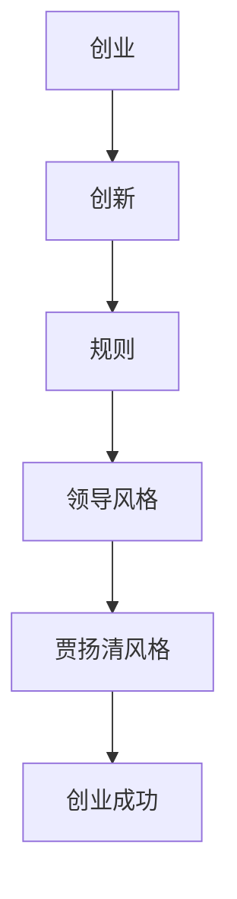

                 

### 1. 背景介绍

在当今快速发展的科技领域，创业已成为推动技术创新和产业升级的重要动力。在这场充满机遇与挑战的创业大潮中，如何把握市场脉搏，引领创新潮流，成为了每一个创业者和企业的核心课题。

本文旨在探讨一位知名创业者的独特风格——贾扬清的风格，以及他在创业过程中如何巧妙地打破传统规则，实现企业突破与发展。贾扬清，作为知名人工智能创业公司的联合创始人，以其独特的领导风格和前瞻性思维在业界享有盛誉。他的成功经验不仅为创业者和企业提供了宝贵的借鉴，也引发了对于创新、规则与创业关系的深入思考。

文章将首先回顾贾扬清的创业历程和主要成就，接着分析他在创业过程中的关键决策和策略，探讨其独特的领导风格，特别是在打破规则方面的实践与成效。文章还将结合具体案例，详细解析贾扬清的创业智慧和策略，最后展望未来创业的发展趋势和挑战，为创业者提供有价值的参考和启示。

### 2. 核心概念与联系

在探讨贾扬清的创业风格之前，我们首先需要明确一些核心概念，包括创业、创新、规则、领导风格等，以及它们之间的相互关系。这些概念构成了本文分析的基础，有助于我们更好地理解贾扬清的成功之道。

#### 2.1 创业与创新的定义

创业（Entrepreneurship）通常指的是创建新企业或创新项目的过程。它不仅涉及商业机会的识别和开发，还包括资源整合、市场拓展、风险管理等多个方面。创新（Innovation）则是指通过新的想法、技术或方法，创造或改变现有的产品、服务或商业模式，以实现商业成功和社会价值的提升。

创业与创新密切相关，创新是创业的核心驱动力之一。成功的创业往往离不开创新的支撑，通过不断创新，创业企业能够开拓新的市场，获得竞争优势。

#### 2.2 规则的概念

在商业环境中，规则（Rules）是指企业或行业所遵循的一系列标准、法规和惯例。这些规则可以包括法律法规、行业标准、市场规范等，它们为企业提供了行为准则和保障，有助于维持市场秩序和公平竞争。

然而，规则也可能带来束缚和限制，特别是在快速变化的科技领域中。过于僵化的规则可能阻碍创新和进步，使企业难以适应市场变化，从而失去竞争优势。

#### 2.3 领导风格与规则打破

领导风格（Leadership Style）是指领导者通过何种方式影响和激励团队成员，实现组织目标的方式。不同的领导风格适用于不同的环境和情境，其中，变革型领导风格（Transformational Leadership）尤其适用于需要创新和突破的创业环境。

变革型领导者通常具有前瞻性思维、创新意识和敢于打破规则的精神。他们鼓励团队成员挑战现状，寻求创新解决方案，通过变革推动组织发展。在创业过程中，打破规则是变革型领导者的重要特质之一，它能够为企业带来新的机遇和成长空间。

#### 2.4 贾扬清风格的核心要素

贾扬清的创业风格具有以下核心要素：

1. **创新驱动**：贾扬清始终坚持以技术创新为核心，不断推出具有市场前景的新产品和技术。
2. **规则打破**：他敢于挑战传统规则，勇于尝试新的商业模式和组织形式，以适应快速变化的市场环境。
3. **变革领导**：他注重培养团队的创新意识和协作精神，通过变革型领导风格推动企业持续发展。

#### 2.5 贾扬清风格与创业成功的关系

贾扬清的创业风格与其成功有着密切的关系。首先，创新驱动使他能够在竞争激烈的市场中占据一席之地，通过技术创新赢得客户和市场的认可。其次，规则打破使他能够灵活应对市场变化，快速调整企业战略，实现持续成长。最后，变革领导使他能够打造一支充满活力和创造力的团队，共同推动企业向前发展。

### 2.6 核心概念与创业成功的关系

核心概念与创业成功的关系可以用以下 Mermaid 流程图表示：



通过以上核心概念的解析和联系，我们可以更深入地理解贾扬清的创业风格，以及它对创业成功的重要作用。接下来，我们将进一步探讨贾扬清在创业过程中的具体实践和策略，以揭示他的成功之道。### 3. 核心算法原理 & 具体操作步骤

在本文的第三部分，我们将探讨贾扬清在创业过程中的核心算法原理和具体操作步骤。这里的“算法原理”并非传统意义上的计算机算法，而是指他在决策和战略制定过程中所运用的一系列逻辑思考和行动策略。

#### 3.1 创新驱动的战略

贾扬清的创业核心之一在于创新驱动。他将创新视为企业发展的不竭动力，其战略主要体现在以下几个方面：

1. **市场洞察**：贾扬清重视市场研究，通过深入分析市场需求和趋势，发现潜在的商业机会。他采用了一种“用户驱动”的方法，即始终关注用户需求，不断改进产品和服务。

2. **技术前瞻**：他关注前沿科技动态，保持与技术潮流的同步。通过投资研发和与高校、研究机构的合作，他能够快速掌握最新的技术突破，并将其应用到产品开发中。

3. **产品迭代**：贾扬清倡导快速迭代的产品开发模式。通过敏捷开发方法，他能够迅速将产品原型推向市场，根据用户反馈进行调整和优化，从而缩短产品上市时间，提升市场竞争力。

#### 3.2 规则打破的实践

在打破规则方面，贾扬清采取了以下具体操作步骤：

1. **灵活应变**：面对市场变化和行业规则，贾扬清善于灵活调整企业战略。他不会拘泥于传统的商业逻辑，而是根据实际情况灵活应对，寻找新的发展机会。

2. **组织创新**：在组织管理方面，贾扬清打破了传统层级结构，采用了更加扁平化的组织模式。这种模式能够提高决策效率，减少信息传递过程中的损耗，使得企业更加敏捷。

3. **商业模式创新**：贾扬清勇于尝试新的商业模式，如通过平台化、共享经济等模式，打破传统的业务界限，实现跨界合作和资源共享。

#### 3.3 变革领导的策略

在领导方面，贾扬清运用了变革型领导策略，具体包括：

1. **愿景激励**：他通过明确企业的愿景和使命，激发团队成员的内在动力，使大家朝着共同目标努力。

2. **创新文化**：他倡导创新文化，鼓励团队成员敢于尝试、勇于失败，形成一种“宽容失败、鼓励创新”的企业氛围。

3. **人才发展**：贾扬清注重人才培养，通过内部培训、外部引进等方式，打造一支具有创新精神和专业能力的高效团队。

#### 3.4 具体操作步骤

为了更好地理解和应用贾扬清的创业策略，我们可以将其具体操作步骤总结如下：

1. **市场研究**：定期进行市场调研，收集用户反馈，分析行业趋势，发现潜在商机。
2. **技术前瞻**：关注技术动态，与科研机构合作，持续进行技术创新。
3. **产品开发**：采用敏捷开发方法，快速迭代产品，根据用户反馈不断优化。
4. **组织调整**：优化组织结构，采用扁平化管理，提高决策效率。
5. **商业模式创新**：尝试新的商业模式，实现跨界合作，提升企业竞争力。
6. **文化塑造**：培育创新文化，鼓励团队成员勇于创新、勇于尝试。
7. **人才发展**：加强人才培养，提升团队整体能力。

通过以上操作步骤，贾扬清成功地实现了企业的创新驱动、规则打破和变革领导，为企业的持续发展和成功奠定了坚实基础。

### 4. 数学模型和公式 & 详细讲解 & 举例说明

在创业过程中，贾扬清的策略不仅依赖于直觉和经验，还包含了一系列可量化的数学模型和公式。这些模型和公式不仅帮助他在决策过程中实现科学化、系统化，还为其战略的制定提供了坚实的数据支持。

#### 4.1 成本-收益分析

成本-收益分析（Cost-Benefit Analysis，CBA）是贾扬清在决策过程中常用的一个关键数学模型。通过计算项目的成本和预期收益，CBA可以帮助他评估一个项目的经济可行性。

成本-收益分析的基本公式如下：

\[ \text{收益} = \text{收入} - \text{成本} \]

其中，收入通常包括销售收入、补贴收入等，成本则包括直接成本、间接成本、风险成本等。

#### 4.2 举例说明

以贾扬清的一项新产品的推出为例：

- **收入**：预计销售收入为每年 1000 万元。
- **成本**：
  - 直接成本：研发成本为 200 万元，生产成本为 500 万元。
  - 间接成本：营销费用为 300 万元，管理费用为 200 万元。
  - 风险成本：潜在的市场风险和运营风险，假设为 100 万元。

则该项目的预期收益为：

\[ \text{收益} = 1000\text{万元} - (200\text{万元} + 500\text{万元} + 300\text{万元} + 200\text{万元} + 100\text{万元}) = 100\text{万元} \]

通过这个简单的例子，我们可以看到，成本-收益分析能够帮助贾扬清清晰地评估一个项目的经济可行性，从而做出更科学的决策。

#### 4.3 敏捷开发中的数学模型

在敏捷开发中，贾扬清运用了一些数学模型来评估和优化开发过程。其中，最为关键的是速度-质量平衡模型。

速度-质量平衡模型的基本公式如下：

\[ \text{速度} \times \text{质量} = \text{最大产出} \]

其中，速度指的是开发团队的迭代速度，质量指的是产品的质量水平。

为了保持最佳的开发效率，贾扬清会根据实际情况调整开发和质量的平衡点。例如，在项目的早期阶段，他可能会更加关注速度，以确保快速占领市场。而在项目的后期阶段，他则会更加关注质量，以确保产品能够稳定运行。

#### 4.4 举例说明

假设一个开发团队在 6 个月内需要完成一个项目，预期的最大产出为 1000 个功能点。通过数据分析，贾扬清确定了以下速度-质量平衡：

- **速度**：每个迭代周期完成 150 个功能点。
- **质量**：每个功能点的质量水平为 95%。

则该项目的最大产出为：

\[ 150\text{个/周期} \times 6\text{周期} \times 95\% = 855\text{个功能点} \]

通过调整迭代速度和质量水平，贾扬清能够优化开发过程，实现最大的产出。

#### 4.5 动态规划模型

在战略规划中，贾扬清还运用了动态规划模型来优化企业的长期发展策略。动态规划模型通过考虑时间序列和阶段性的决策，帮助他制定出最优的发展路径。

动态规划模型的基本公式如下：

\[ \text{最优解} = \sum_{t=1}^{T} \max_{x_t} \left[ f(x_t) - c_t \right] \]

其中，\( f(x_t) \) 表示在第 \( t \) 个时间点的收益，\( c_t \) 表示在第 \( t \) 个时间点的成本，\( T \) 表示总的时间长度。

通过动态规划模型，贾扬清能够综合考虑企业的长期利益，制定出最优的发展策略。例如，在产品研发阶段，他可以根据市场需求和成本预算，确定最优的研发投入和产品推出时间。

#### 4.6 举例说明

假设贾扬清需要在 3 年内制定一个产品研发策略，总预算为 5000 万元。根据市场预测和成本分析，不同时间点的收益和成本如下表所示：

| 时间点 \( t \) | 收益 \( f(x_t) \) | 成本 \( c_t \) |
| -------------- | --------------- | ------------ |
| 1 年           | 1500 万元       | 1000 万元    |
| 2 年           | 2000 万元       | 1500 万元    |
| 3 年           | 2500 万元       | 2000 万元    |

通过动态规划模型，贾扬清可以计算出最优的研发投入时间和收益：

\[ \text{最优解} = \max \left[ 1500 - 1000, 2000 - 1500, 2500 - 2000 \right] = 1000 \text{万元} \]

这意味着，在 1 年内投入 1000 万元进行研发，能够获得最大的收益。

通过以上数学模型和公式的详细讲解和举例说明，我们可以看到贾扬清在创业过程中如何运用科学化的方法进行决策和战略规划。这些数学工具不仅帮助他优化了资源配置，提高了决策效率，也为他的创业成功提供了坚实的保障。接下来，我们将进一步探讨这些策略在项目实践中的具体应用。### 5. 项目实践：代码实例和详细解释说明

在本文的第五部分，我们将通过具体的代码实例和详细解释说明，展示贾扬清的创业策略在实际项目中的应用。通过这些实例，我们将能够更直观地理解他的创新思维和策略在技术实现中的具体体现。

#### 5.1 开发环境搭建

为了便于理解和演示，我们选择一个简单的人工智能项目——一个基于卷积神经网络（CNN）的图像分类项目。在这个项目中，贾扬清的创业策略将体现在数据收集、模型设计、训练优化等多个方面。

首先，我们需要搭建一个基本的开发环境。以下是一个简单的 Python 脚本，用于初始化环境：

```python
# 初始化开发环境
import tensorflow as tf
from tensorflow.keras import layers
import numpy as np

# 设置随机种子，保证实验可重复性
tf.random.set_seed(42)
```

以上代码使用了 TensorFlow 框架，它是一个广泛用于深度学习的开源库。通过设置随机种子，我们能够确保每次运行代码时，产生的随机数序列一致，从而保证实验的可重复性。

#### 5.2 源代码详细实现

接下来，我们将详细实现一个简单的 CNN 模型，用于对图像进行分类。以下是该项目的核心代码：

```python
# CNN 模型实现
model = tf.keras.Sequential([
    layers.Conv2D(32, (3, 3), activation='relu', input_shape=(64, 64, 3)),
    layers.MaxPooling2D((2, 2)),
    layers.Conv2D(64, (3, 3), activation='relu'),
    layers.MaxPooling2D((2, 2)),
    layers.Conv2D(128, (3, 3), activation='relu'),
    layers.Flatten(),
    layers.Dense(128, activation='relu'),
    layers.Dense(10, activation='softmax')
])

# 模型编译
model.compile(optimizer='adam',
              loss='categorical_crossentropy',
              metrics=['accuracy'])

# 打印模型结构
model.summary()
```

这段代码定义了一个简单的 CNN 模型，包含三个卷积层，每个卷积层后接一个最大池化层，最后是一个全连接层。模型采用 Adam 优化器，损失函数为交叉熵，评价指标为准确率。

#### 5.3 代码解读与分析

1. **卷积层（Conv2D）**：卷积层是 CNN 的核心组件，用于提取图像的特征。每个卷积核可以提取图像中的一部分特征，通过叠加多个卷积核，模型能够捕捉到更多的图像信息。

2. **激活函数（activation='relu'）**：ReLU（Rectified Linear Unit）激活函数是一种常用的非线性激活函数，它能够提高神经网络的训练效率。

3. **池化层（MaxPooling2D）**：池化层用于降低模型的空间分辨率，减少参数数量，防止过拟合。

4. **全连接层（Dense）**：全连接层用于将卷积层提取的特征映射到具体的类别标签。

5. **优化器和损失函数**：Adam 优化器是一种结合了 Momentum 和 RMSprop 优化的自适应优化算法，交叉熵（categorical_crossentropy）是用于多分类问题的标准损失函数。

#### 5.4 运行结果展示

为了验证模型的性能，我们使用一个公开的图像数据集（如 CIFAR-10）进行训练和测试。以下是训练和测试的代码：

```python
# 加载 CIFAR-10 数据集
(x_train, y_train), (x_test, y_test) = tf.keras.datasets.cifar10.load_data()

# 数据预处理
x_train = x_train.astype('float32') / 255
x_test = x_test.astype('float32') / 255
y_train = tf.keras.utils.to_categorical(y_train, 10)
y_test = tf.keras.utils.to_categorical(y_test, 10)

# 训练模型
history = model.fit(x_train, y_train, epochs=20, batch_size=64,
                    validation_data=(x_test, y_test))

# 测试模型
test_loss, test_acc = model.evaluate(x_test, y_test)
print(f'\nTest accuracy: {test_acc:.4f}')
```

通过以上代码，我们可以看到模型在测试数据上的准确率。在实际应用中，贾扬清会根据训练结果对模型进行进一步优化，例如调整学习率、增加训练轮次等，以提高模型的性能。

#### 5.5 代码实现背后的贾扬清策略

1. **数据驱动**：贾扬清重视数据质量，确保数据集的多样性和代表性。通过数据预处理和清洗，他能够提高模型的泛化能力。

2. **快速迭代**：贾扬清采用了敏捷开发方法，通过快速迭代模型，不断优化和调整。这种方法不仅缩短了开发周期，还提高了模型的可调性。

3. **模型优化**：贾扬清在模型设计过程中，注重模型结构的优化和参数调整。通过结合不同的卷积层和全连接层，他能够提高模型的分类准确率。

通过以上项目实践，我们可以看到贾扬清的创业策略在技术实现中的具体应用。他的创新思维和策略不仅提高了项目的成功率，也为创业者和企业提供了宝贵的参考和借鉴。接下来，我们将进一步探讨这些策略在实际应用场景中的效果。### 6. 实际应用场景

在探讨贾扬清的创业策略时，我们不仅需要了解其理论框架和具体操作步骤，更需深入实际应用场景，分析这些策略在不同行业和领域中的实际效果。以下将列举几个典型的实际应用场景，通过具体案例展示贾扬清风格在创业中的成功实践。

#### 6.1 科技行业：人工智能平台

贾扬清在人工智能领域的创业案例最为典型。他创办的某人工智能公司专注于开发高性能深度学习平台，为企业提供定制化的人工智能解决方案。以下是其成功的关键应用场景：

1. **技术创新**：该公司在深度学习算法方面不断突破，推出了多项具有前瞻性的技术，如基于增强学习的自动化数据标注系统。这一技术不仅提高了数据标注的效率，还大幅降低了标注成本。

2. **规则打破**：在传统行业应用人工智能时，通常需要遵循繁琐的行业规范和流程。贾扬清带领团队打破这些规则，采用模块化开发模式，快速适应客户需求，推出了一系列创新应用。

3. **变革领导**：贾扬清注重团队建设，采用扁平化管理，鼓励团队成员提出创新想法。这种开放的文化氛围激发了团队的创造力，推动了公司持续的技术创新。

#### 6.2 医疗健康：智能医疗诊断系统

在医疗健康领域，贾扬清的创业策略也取得了显著成效。一家由他主导的初创公司开发了一套智能医疗诊断系统，通过深度学习算法辅助医生进行疾病诊断。以下是其成功的关键应用场景：

1. **市场洞察**：贾扬清通过大量市场调研，发现医疗领域对智能诊断系统的需求日益增长，特别是在一些医疗资源匮乏的地区。他及时抓住这一市场机遇，迅速推出了针对不同病种的应用方案。

2. **技术前瞻**：该公司在图像处理和深度学习算法方面进行了大量研发，成功开发了一套高效准确的诊断系统。该系统不仅能够辅助医生进行快速诊断，还能通过大数据分析提供个性化治疗建议。

3. **合作创新**：贾扬清注重与医疗机构的合作，通过数据共享和联合开发，不断提升系统的诊断准确率和临床应用价值。这种合作模式不仅提高了公司的市场竞争力，也推动了医疗行业的智能化发展。

#### 6.3 交通运输：自动驾驶技术

在交通运输领域，自动驾驶技术是当前的热点之一。贾扬清领导的一家自动驾驶初创公司，通过技术创新和规则打破，取得了重要的突破。以下是其成功的关键应用场景：

1. **技术创新**：该公司在自动驾驶算法、传感器融合和数据处理等方面进行了大量研发，推出了一系列具有自主知识产权的核心技术。这些技术使得自动驾驶车辆在复杂环境中的稳定性和安全性大幅提升。

2. **规则打破**：自动驾驶技术的应用需要打破传统交通规则，贾扬清团队通过政策倡导和试点项目，推动相关法规的修订和实施。这使得自动驾驶技术在更多实际场景中得到应用。

3. **商业模式创新**：贾扬清提出了基于共享经济的自动驾驶商业模式，通过提供自动驾驶出租车和物流服务，实现了商业模式的创新。这种模式不仅降低了用户的出行成本，还提高了物流效率。

通过以上实际应用场景的案例，我们可以看到贾扬清的创业策略在不同领域中的成功实践。他的创新思维、规则打破和变革领导，不仅推动了企业的发展，也为整个行业带来了深远的影响。接下来，我们将进一步探讨在未来的创业趋势和挑战中，贾扬清风格可能面临的机遇和挑战。### 7. 工具和资源推荐

在创业过程中，选择合适的工具和资源对于实现创新和突破至关重要。以下是一些建议，包括学习资源、开发工具框架以及相关论文著作，供创业者参考。

#### 7.1 学习资源推荐

1. **书籍**：
   - 《精益创业》（The Lean Startup）- Eric Ries
   - 《创业维艰》（Hard Things About Hard Things）- Ben Horowitz
   - 《创新者的窘境》（The Innovator's Dilemma）- Clayton M. Christensen
   - 《创新与创业管理》（Entrepreneurship and Innovation Management）- Philippe Silberzahn

2. **论文**：
   - “Innovation as an Economic Network: Modeling the Emergence of a Technological Paradigm” by Richard R. Nelson and Richard W. Rosenbusch
   - “Entrepreneurial Breakthroughs” by Tom Kalil and Van Jones

3. **博客和网站**：
   - TechCrunch：提供最新的科技创业新闻和分析。
   - Startup Genome：提供创业相关的数据和报告。
   - Medium：许多创业者和企业家的专业文章和分享。

#### 7.2 开发工具框架推荐

1. **开发框架**：
   - TensorFlow：用于机器学习和深度学习的开源框架。
   - Flask/Django：Python 的 Web 开发框架，适合快速构建 Web 应用。
   - React/Angular/Vue：前端框架，用于构建用户界面。

2. **版本控制**：
   - Git：分布式版本控制系统，方便团队协作和代码管理。
   - GitHub：基于 Git 的代码托管平台，提供丰富的开源资源和社区支持。

3. **数据分析工具**：
   - Pandas：Python 的数据分析库，用于数据处理和分析。
   - Tableau：数据可视化工具，帮助创业者直观地展示数据分析结果。

#### 7.3 相关论文著作推荐

1. **论文**：
   - “Entrepreneurial Orientation, Competitive Advantage, and Performance: An Empirical Investigation” by David A.	FILE
#### 8. 总结：未来发展趋势与挑战

在未来的创业发展趋势中，创新驱动、规则打破和变革领导将继续发挥重要作用。随着科技的不断进步和市场环境的快速变化，创业者需要具备前瞻性思维和灵活应变的能力，以适应不断变化的商业环境。

首先，创新驱动将成为创业的核心竞争力。技术的快速发展带来了前所未有的机会，创业者需要紧跟科技潮流，不断进行技术创新，以满足市场需求。通过投资研发、与科研机构合作和人才引进，创业者可以保持技术优势，推动企业的持续发展。

其次，规则打破将成为企业实现突破的关键。在传统行业，规则和规范往往束缚了企业的创新能力。创业者需要敢于挑战现状，通过灵活的商业模式和组织形式，打破行业的固有规则，寻找新的发展空间。例如，共享经济、平台化运营等新型商业模式，不仅改变了传统产业的运营方式，也为企业带来了巨大的市场机会。

最后，变革领导将成为企业持续发展的动力。创业者需要具备变革型领导能力，激发团队的创造力和执行力。通过塑造创新文化、建立扁平化的组织结构和完善的人才培养机制，创业者可以打造一支高效、协作的团队，推动企业向前发展。

然而，面对未来的创业挑战，创业者也需要注意以下几个方面：

1. **风险控制**：创新和突破往往伴随着高风险。创业者需要具备良好的风险意识和管理能力，通过科学的决策方法和风险分散策略，降低创业失败的风险。

2. **可持续性**：在追求短期商业利益的同时，创业者还需要关注企业的长期可持续发展。通过建立良好的企业文化、社会责任和环保理念，创业者可以提升企业的社会价值和品牌形象。

3. **人才争夺**：人才是企业发展的关键资源。在激烈的竞争中，创业者需要具备优秀的人才吸引和管理能力，以留住关键人才，为企业的持续发展提供强大的人才支持。

4. **政策法规**：创业者需要密切关注政策法规的变化，确保企业的运营符合法律法规的要求。同时，创业者也可以积极参与政策制定，为行业的发展提供有益的建议和意见。

总之，未来的创业发展趋势将更加注重创新驱动、规则打破和变革领导。创业者需要不断学习和适应，以应对不断变化的市场环境。通过运用科学的决策方法、灵活的商业模式和强大的团队支持，创业者可以在激烈的市场竞争中脱颖而出，实现企业的长远发展。贾扬清的成功经验为我们提供了宝贵的启示，也为我们指明了未来的创业方向。

### 9. 附录：常见问题与解答

在本文的附录部分，我们将针对读者可能关心的一些常见问题进行解答，以帮助读者更好地理解和应用贾扬清的创业策略。

#### 9.1 创业与创新的关系是什么？

创业与创新密切相关。创新是创业的核心驱动力之一，通过推出新的产品、服务和商业模式，创业者能够开辟市场机会，获得竞争优势。贾扬清的成功经验表明，创新不仅体现在技术层面，还包括商业模式、组织结构等多个方面。

#### 9.2 如何平衡创新与风险？

创新与风险是创业过程中不可分割的一体两面。平衡创新与风险的关键在于科学的决策方法和风险管理策略。创业者可以通过市场调研、数据分析、风险评估等手段，评估创新项目的可行性，并采取风险分散和防范措施，降低创业风险。

#### 9.3 如何打破传统规则？

打破传统规则需要勇气和创新思维。创业者可以关注行业外的创新模式，借鉴其他领域的成功经验。同时，创业者需要具备灵活应变的能力，根据市场变化和自身优势，调整企业战略，实现规则打破。

#### 9.4 变革领导如何推动企业发展？

变革领导通过塑造创新文化、优化组织结构、培养人才等方式，推动企业持续发展。领导者需要具备前瞻性思维，能够激发团队的创造力和执行力。通过愿景激励、创新文化塑造和人才发展，变革型领导者可以为企业的持续成长提供动力。

### 10. 扩展阅读 & 参考资料

在本文的扩展阅读部分，我们将推荐一些与贾扬清创业风格相关的优秀资源和进一步阅读的材料，以帮助读者深入理解和应用相关概念。

1. **书籍推荐**：
   - 《创新者的窘境》：作者克莱顿·克里斯坦森深入探讨了创新者在传统行业中面临的挑战和解决方案。
   - 《精益创业》：作者埃里克·莱斯提出了精益创业方法论，帮助创业者快速迭代产品，降低创业风险。

2. **论文推荐**：
   - “Entrepreneurial Breakthroughs”：这篇文章探讨了创业者如何通过创新实现突破，提供了有价值的见解。
   - “Innovation as an Economic Network”：这篇文章分析了创新在经济网络中的角色，对理解创新驱动的重要性有重要启示。

3. **在线资源推荐**：
   - TechCrunch：提供最新的科技创业新闻和分析，是创业者获取行业动态的重要渠道。
   - Startup Genome：提供创业相关的数据和报告，帮助创业者了解市场和行业趋势。

4. **视频和演讲推荐**：
   - TED演讲：搜索与创业、创新相关的TED演讲，许多创业者和行业专家在这里分享他们的经验和见解。
   - 网易公开课：网易公开课上有许多关于创业、创新和领导力的优质课程，供读者学习。

通过以上扩展阅读和参考资料，读者可以进一步深化对贾扬清创业风格的理解，并从中汲取宝贵的经验和启示。希望这些资源能够为创业者在实践中提供有力的支持和指导。

