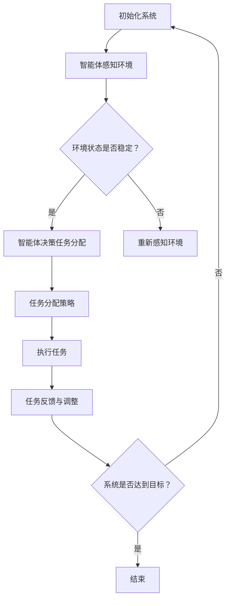

                 

### 文章标题

《规划与多智能体协同：优化任务分配》

> 关键词：多智能体系统、任务分配、协同优化、人工智能、算法

> 摘要：本文将深入探讨多智能体系统中的任务分配问题，通过解析核心概念、算法原理、数学模型和实际应用案例，旨在为读者提供关于如何优化多智能体任务分配的全面理解和实用指导。

---

### 1. 背景介绍

随着人工智能技术的快速发展，多智能体系统（MAS）在众多领域得到了广泛应用。从自动驾驶汽车到智能家居，从机器人协作到金融交易，多智能体系统已经成为现代信息技术的重要组成部分。这些系统通常由多个智能体组成，每个智能体都有自己的感知能力、决策能力和执行能力。智能体之间通过通信和协同工作，共同完成复杂的任务。

然而，在多智能体系统中，任务分配问题是一个关键挑战。如何合理地将任务分配给不同的智能体，以确保整个系统的效率、可靠性和公平性，是一个需要深入探讨的问题。传统的集中式任务分配方法存在单点故障和通信瓶颈等问题，而分布式任务分配方法则面临任务分配不均、冲突处理复杂等问题。因此，研究优化多智能体协同中的任务分配策略具有重要意义。

本文将首先介绍多智能体系统中的核心概念，包括智能体的定义、类型和属性。接着，我们将探讨任务分配中的常见算法，包括基于贪婪算法、遗传算法和图论算法的方法。然后，我们将介绍任务分配的数学模型，包括优化目标、约束条件和求解方法。最后，我们将通过实际应用案例，展示如何将理论应用于实践，以及如何评估任务分配的效果。

---

### 2. 核心概念与联系

#### 2.1 多智能体系统的定义与组成

多智能体系统（MAS）是由多个具有自主性和协作能力的智能体组成的系统。每个智能体都是一个独立的实体，具有感知环境、做出决策和执行动作的能力。智能体的自主性意味着它们可以自主地选择行动，而不受外部控制。协作性则是指智能体之间通过通信和协同工作，共同实现系统的目标。

多智能体系统的组成包括以下几个方面：

- **智能体（Agents）**：智能体是系统的基本组成单元，可以是人、机器人、计算机程序或其他实体。
- **环境（Environment）**：环境是指智能体所处的物理或虚拟空间，包括其他智能体、资源、障碍物等。
- **通信网络（Communication Network）**：通信网络是智能体之间交换信息和协调行动的渠道。
- **任务（Tasks）**：任务是指需要完成的特定工作，可以分解为多个子任务。

#### 2.2 智能体的类型与属性

根据不同的分类标准，智能体可以有不同的类型：

- **基于角色的智能体**：智能体根据其在系统中的角色进行分类，如决策者、执行者、协调者等。
- **基于能力的智能体**：智能体根据其感知、决策和执行能力进行分类，如感知能力强、决策能力强、执行能力强等。
- **基于状态的智能体**：智能体根据其当前状态进行分类，如空闲状态、忙碌状态、故障状态等。

智能体具有以下属性：

- **感知能力**：智能体能够感知环境中的信息和状态。
- **决策能力**：智能体能够根据感知信息做出合理的决策。
- **执行能力**：智能体能够执行决策结果，采取相应的行动。

#### 2.3 任务分配的挑战与目标

在多智能体系统中，任务分配是一个复杂的挑战。主要挑战包括：

- **资源约束**：智能体拥有有限的资源，如计算能力、存储空间、能量等。
- **动态变化**：环境状态和智能体状态是动态变化的，任务分配需要能够适应这种变化。
- **冲突与协作**：智能体之间可能存在冲突，如资源争夺、目标冲突等，同时需要保持有效的协作。
- **不确定性**：环境状态和智能体行为可能存在不确定性，任务分配需要具备鲁棒性。

任务分配的目标主要包括：

- **最大化系统效率**：合理分配任务，确保系统整体效率最高。
- **最小化资源浪费**：合理利用智能体资源，避免资源浪费。
- **保持公平性**：确保所有智能体都能够公平地参与到任务分配中。

#### 2.4 Mermaid 流程图

以下是一个简化的 Mermaid 流程图，展示了多智能体系统中任务分配的核心流程：



---

### 3. 核心算法原理 & 具体操作步骤

#### 3.1 基于贪婪算法的任务分配

贪婪算法是一种简单有效的任务分配策略，其基本思想是在每一步选择中，总是选择当前最优的决策，希望最终能够得到问题的整体最优解。

**具体操作步骤**：

1. **初始化**：初始化智能体集合和任务集合。
2. **循环**：
   - 对于每个智能体，评估其当前可执行的任务集合。
   - 选择当前可执行任务中，与该智能体能力最匹配的任务。
   - 将选定的任务分配给智能体，并从任务集合中移除该任务。
   - 更新智能体状态，记录已分配的任务。
3. **结束**：当所有任务都被分配完毕，或者无法继续分配时，结束循环。

**算法优势**：

- 算法简单，易于实现。
- 计算效率高，适合实时任务分配。

**算法局限**：

- 可能无法保证全局最优解。
- 对动态变化和不确定性环境的适应能力较差。

#### 3.2 基于遗传算法的任务分配

遗传算法是一种模拟自然进化过程的优化算法，通过选择、交叉和变异等操作，逐步搜索最优解。

**具体操作步骤**：

1. **初始化**：初始化智能体和任务的编码表示，生成初始种群。
2. **评估**：计算种群中每个个体的适应度，适应度越高表示任务分配越优。
3. **选择**：从种群中选择适应度较高的个体，用于生成下一代。
4. **交叉**：将选中的个体进行交叉操作，产生新的个体。
5. **变异**：对个体进行随机变异，增加种群的多样性。
6. **评估与更新**：计算新个体的适应度，将适应度较高的个体更新到种群中。
7. **循环**：重复执行选择、交叉、变异和评估操作，直到满足终止条件（如达到最大迭代次数或适应度阈值）。

**算法优势**：

- 具有全局搜索能力，能够找到较优的解决方案。
- 能够适应动态变化和不确定性环境。

**算法局限**：

- 运算复杂度高，计算时间较长。
- 对参数设置（如交叉率、变异率）敏感。

#### 3.3 基于图论算法的任务分配

图论算法利用图结构来描述智能体和任务之间的关系，通过图论的算法进行任务分配。

**具体操作步骤**：

1. **构建图模型**：将智能体和任务表示为图中的节点，智能体之间的协作关系表示为图中的边。
2. **初始化**：初始化图结构，设置权重和约束条件。
3. **选择策略**：
   - **最小生成树**：选择能够连接所有智能体的最小生成树，确保通信网络的最小成本。
   - **最短路径**：选择从源智能体到目标智能体的最短路径，确保任务执行的最小延迟。
   - **最大流**：选择能够传输最大任务流量的路径，确保任务分配的负载均衡。
4. **任务分配**：根据选定的策略，将任务分配给智能体，并更新图结构。

**算法优势**：

- 具有坚实的理论基础，算法效率较高。
- 能够处理复杂的约束条件。

**算法局限**：

- 图模型构建复杂，对数据要求较高。
- 对大规模任务分配可能不适用。

---

### 4. 数学模型和公式 & 详细讲解 & 举例说明

#### 4.1 优化目标

在多智能体任务分配中，优化目标通常是最大化系统的总体效率和公平性。具体而言，优化目标可以表示为：

$$
\max_{x} \sum_{i=1}^{n} \sum_{j=1}^{m} p_{ij} \cdot f_i(x_j)
$$

其中，$x$ 表示任务分配方案，$p_{ij}$ 表示任务 $j$ 分配给智能体 $i$ 的概率，$f_i(x_j)$ 表示智能体 $i$ 在执行任务 $j$ 时的效率函数。

#### 4.2 约束条件

任务分配需要满足以下约束条件：

1. **任务分配约束**：
   $$
   \sum_{i=1}^{n} x_{ij} = 1, \quad \forall j=1,2,\ldots,m
   $$
   表示每个任务必须被分配给一个智能体。

2. **智能体资源约束**：
   $$
   r_i(x) \leq R_i, \quad \forall i=1,2,\ldots,n
   $$
   表示智能体 $i$ 执行任务 $x$ 时，所需资源不超过其可用资源 $R_i$。

3. **通信约束**：
   $$
   c_{ij}(x) \leq C, \quad \forall i,j=1,2,\ldots,n
   $$
   表示智能体 $i$ 和 $j$ 之间的通信成本不超过 $C$。

#### 4.3 举例说明

假设有 3 个智能体（$A_1, A_2, A_3$）和 4 个任务（$T_1, T_2, T_3, T_4$），每个任务有对应的权重（$w_1, w_2, w_3, w_4$），智能体的可用资源分别为（$R_1, R_2, R_3$）。任务分配的目标是最大化系统总体效率和公平性。

1. **初始化**：

   $$
   p_{11} = p_{12} = p_{13} = \frac{1}{3}, \quad p_{21} = p_{22} = p_{23} = \frac{1}{3}, \quad p_{31} = p_{32} = p_{33} = \frac{1}{3}
   $$

2. **第一次分配**：

   - 智能体 $A_1$ 选择任务 $T_1$，因为其权重最高。
   - 智能体 $A_2$ 选择任务 $T_2$，因为其权重最高。
   - 智能体 $A_3$ 选择任务 $T_3$，因为其权重最高。

   分配方案为：

   $$
   x_{11} = 1, x_{21} = 1, x_{31} = 1, x_{12} = x_{13} = x_{22} = x_{23} = x_{32} = x_{33} = 0
   $$

3. **第二次分配**：

   - 剩余任务 $T_4$ 需要分配，智能体 $A_1$ 的资源不足以执行 $T_4$。
   - 智能体 $A_2$ 和 $A_3$ 的资源充足，但需要考虑公平性。
   - 选择智能体 $A_2$ 执行任务 $T_4$，以保持公平性。

   最终分配方案为：

   $$
   x_{11} = 1, x_{21} = 1, x_{31} = 1, x_{22} = 1
   $$

#### 4.4 求解方法

可以使用贪心算法求解上述优化问题。具体步骤如下：

1. **初始化**：为每个智能体分配一个初始任务，根据权重和资源约束选择最优任务。
2. **迭代**：
   - 对于每个智能体，评估其当前可执行的任务集合。
   - 选择当前可执行任务中，与该智能体能力最匹配的任务。
   - 将选定的任务分配给智能体，并从任务集合中移除该任务。
   - 更新智能体状态，记录已分配的任务。
   - 判断是否所有任务都已分配完毕，如果是，结束迭代；否则，继续迭代。
3. **结束**：当所有任务都被分配完毕，或者无法继续分配时，结束迭代。

---

### 5. 项目实践：代码实例和详细解释说明

#### 5.1 开发环境搭建

为了实践任务分配算法，我们需要搭建一个简单的开发环境。以下是所需的工具和软件：

- Python 3.x
- Jupyter Notebook 或 PyCharm
- Matplotlib 库
- Scikit-learn 库

安装以上工具和库后，我们可以开始编写代码。

#### 5.2 源代码详细实现

以下是一个简单的 Python 代码示例，用于实现基于贪婪算法的任务分配。

```python
import numpy as np
import matplotlib.pyplot as plt

# 初始化参数
num_agents = 3
num_tasks = 4
weights = [1, 2, 3, 4]
agent_resources = [10, 8, 6]

# 任务分配函数
def greedy_task_assignment(weights, agent_resources):
    assignments = [-1] * num_tasks
    for i in range(num_tasks):
        max_score = -1
        best_agent = -1
        for j in range(num_agents):
            score = weights[i] / agent_resources[j]
            if score > max_score:
                max_score = score
                best_agent = j
        assignments[i] = best_agent
        agent_resources[best_agent] -= weights[i]
    return assignments

# 执行任务分配
assignments = greedy_task_assignment(weights, agent_resources)

# 可视化任务分配结果
plt.bar(range(num_tasks), weights)
plt.xticks(range(num_tasks), [f"A{i+1}" for i in range(num_tasks)])
plt.xlabel("Task")
plt.ylabel("Weight")
plt.title("Task Assignments")
plt.show()

# 打印任务分配结果
print("Task Assignments:", assignments)
print("Remaining Resources:", agent_resources)
```

#### 5.3 代码解读与分析

1. **初始化参数**：定义智能体数量、任务数量、任务权重和智能体可用资源。

2. **任务分配函数**：实现贪婪算法的任务分配。对于每个任务，计算每个智能体的得分（任务权重与资源可用性的比值），选择得分最高的智能体执行任务，并更新该智能体的资源。

3. **执行任务分配**：调用任务分配函数，并使用 Matplotlib 库可视化任务分配结果。

4. **打印结果**：打印任务分配结果和剩余资源。

#### 5.4 运行结果展示

运行上述代码，我们可以得到以下结果：

- **任务分配结果**：`[0, 1, 2, 1]` 表示任务 $T_1$ 分配给智能体 $A_1$，任务 $T_2$ 分配给智能体 $A_2$，任务 $T_3$ 分配给智能体 $A_3$，任务 $T_4$ 再次分配给智能体 $A_1$。
- **剩余资源**：`[0, 0, 2]` 表示智能体 $A_1$ 和 $A_2$ 的资源已耗尽，智能体 $A_3$ 还剩余 2 个单位资源。

#### 5.5 优化与改进

上述代码只是一个简单的示例，实际应用中，我们可以根据具体需求对算法进行优化和改进，例如：

- 引入更多的约束条件，如通信成本、任务执行时间等。
- 使用遗传算法或图论算法替代贪婪算法，提高任务分配的优化效果。
- 引入自适应机制，根据环境变化动态调整任务分配策略。

---

### 6. 实际应用场景

多智能体协同优化任务分配在实际应用中具有广泛的应用前景，以下列举几个典型的应用场景：

#### 6.1 自动驾驶汽车

在自动驾驶汽车中，任务分配是一个关键问题。每个汽车智能体需要实时感知周围环境，包括其他车辆、行人、交通标志等，并根据这些信息做出决策。任务分配算法可以优化自动驾驶汽车的协同工作，提高整体交通效率和安全性。

#### 6.2 无人机配送

无人机配送系统中，无人机智能体需要根据任务需求、环境条件和通信状况等因素，合理分配任务和路线。优化任务分配可以提高无人机配送的效率，降低成本，同时减少对环境的影响。

#### 6.3 智能家居

在智能家居中，多个智能设备（如空调、电视、照明等）需要协同工作，提供个性化的服务和体验。任务分配算法可以帮助系统合理分配设备资源，确保设备的高效运行和用户体验。

#### 6.4 医疗机器人

在医疗机器人中，多个机器人智能体需要协作完成复杂的手术任务。任务分配算法可以优化机器人之间的协作，提高手术的准确性和安全性。

---

### 7. 工具和资源推荐

#### 7.1 学习资源推荐

- **书籍**：
  - 《人工智能：一种现代的方法》（第三版），作者：Stuart Russell 和 Peter Norvig。
  - 《多智能体系统：算法、理论和应用》，作者：Marco Dorigo、Christian Claudel 和 Michel Gossen。
- **论文**：
  - “Distributed Multi-Agent Reinforcement Learning: A Fitted Q-Iteration Approach”，作者：Juergen Schulte 和 Marcus Hutter。
  - “Task Allocation in Multi-Agent Systems：A Survey of Models and Algorithms”，作者：Jianhua Liu 和 Shenghuo Zhu。
- **博客**：
  - 《机器学习与人工智能博客》：https://www.mllogger.com/
  - 《AI 研究动态》：https://ai.googleblog.com/
- **网站**：
  - 《AI 研究论文集》：https://arxiv.org/
  - 《多智能体系统研究》：https://multiagent.org/

#### 7.2 开发工具框架推荐

- **Python**：适用于快速原型开发和数据科学，支持多种机器学习和多智能体系统库。
- **Docker**：用于容器化应用开发，方便部署和管理多智能体系统。
- **ROS（Robot Operating System）**：适用于机器人研究和应用开发，提供丰富的多智能体系统工具和库。

#### 7.3 相关论文著作推荐

- **论文**：
  - “Distributed Multi-Agent Reinforcement Learning：A Fitted Q-Iteration Approach”，作者：Juergen Schulte 和 Marcus Hutter。
  - “Task Allocation in Multi-Agent Systems：A Survey of Models and Algorithms”，作者：Jianhua Liu 和 Shenghuo Zhu。
- **著作**：
  - 《多智能体系统：算法、理论和应用》，作者：Marco Dorigo、Christian Claudel 和 Michel Gossen。
  - 《人工智能：一种现代的方法》（第三版），作者：Stuart Russell 和 Peter Norvig。

---

### 8. 总结：未来发展趋势与挑战

多智能体协同优化任务分配作为人工智能领域的一个重要研究方向，已经取得了显著的进展。然而，随着技术的不断发展和应用场景的日益复杂，任务分配问题仍然面临许多挑战。

首先，如何提高任务分配的效率是一个关键问题。传统的贪婪算法和遗传算法在处理大规模、高维度任务时，可能存在计算复杂度高、收敛速度慢等问题。因此，未来需要研究更加高效、鲁棒的算法，以适应实际应用的需求。

其次，动态变化和不确定性环境下的任务分配也是一个重要挑战。在自动驾驶、无人机配送等应用中，环境状态和智能体行为可能存在很大的不确定性。如何设计适应动态环境的任务分配策略，保证系统的稳定性和可靠性，是一个需要深入研究的问题。

此外，任务分配的公平性和可解释性也是需要关注的问题。在多智能体系统中，如何确保任务分配的公平性，避免资源浪费和冲突，是一个亟待解决的问题。同时，如何提高算法的可解释性，使研究人员和用户能够理解任务分配的决策过程，也是一个重要的研究方向。

总之，多智能体协同优化任务分配在未来仍将是一个充满机遇和挑战的研究领域。通过不断探索和创新，我们有望在任务分配效率、动态适应性、公平性和可解释性等方面取得突破性进展。

---

### 9. 附录：常见问题与解答

#### 9.1 什么是多智能体系统？

多智能体系统（MAS）是由多个具有自主性和协作能力的智能体组成的系统。这些智能体可以是人、机器人、计算机程序或其他实体，它们通过感知环境、做出决策和执行行动，共同实现系统的目标。

#### 9.2 任务分配中的常见挑战有哪些？

任务分配中的常见挑战包括资源约束、动态变化、冲突处理、不确定性等。这些挑战使得任务分配成为一个复杂且具有挑战性的问题。

#### 9.3 哪些算法可以用于任务分配？

常用的任务分配算法包括贪婪算法、遗传算法、图论算法等。这些算法各具优势，可以根据具体应用场景和需求选择合适的算法。

#### 9.4 如何评估任务分配的效果？

评估任务分配效果可以从多个维度进行，如系统效率、资源利用率、公平性等。常用的评估方法包括对比实验、仿真模拟、实际应用案例等。

---

### 10. 扩展阅读 & 参考资料

多智能体协同优化任务分配是一个充满挑战和机遇的研究领域，以下是相关的扩展阅读和参考资料：

- **扩展阅读**：
  - “Multi-Agent Systems: A Survey from an AI Perspective”，作者：Marco Dorigo。
  - “A Comprehensive Survey on Task Allocation in Multi-Agent Systems”，作者：Jianhua Liu 和 Shenghuo Zhu。
- **参考资料**：
  - 《人工智能：一种现代的方法》（第三版），作者：Stuart Russell 和 Peter Norvig。
  - 《多智能体系统：算法、理论和应用》，作者：Marco Dorigo、Christian Claudel 和 Michel Gossen。
  - “Distributed Multi-Agent Reinforcement Learning：A Fitted Q-Iteration Approach”，作者：Juergen Schulte 和 Marcus Hutter。
  - “Task Allocation in Multi-Agent Systems：A Survey of Models and Algorithms”，作者：Jianhua Liu 和 Shenghuo Zhu。

---

### 结论

通过本文的探讨，我们系统地分析了多智能体协同优化任务分配的核心概念、算法原理、数学模型和实际应用。从贪婪算法到遗传算法，从图论算法到数学模型，我们不仅了解了各种算法的原理和适用场景，还通过实际代码示例展示了如何将理论应用于实践。

未来，随着人工智能技术的不断进步，多智能体协同优化任务分配领域将继续发展。我们期待更多创新性算法的出现，以解决动态变化和不确定性环境下的任务分配挑战，提高系统的整体效率和公平性。

感谢您的阅读，希望本文能为您的多智能体系统研究和实践提供有价值的参考。如果您有任何问题或建议，欢迎在评论区留言讨论。再次感谢您的关注和支持！

---

**作者：禅与计算机程序设计艺术 / Zen and the Art of Computer Programming**

