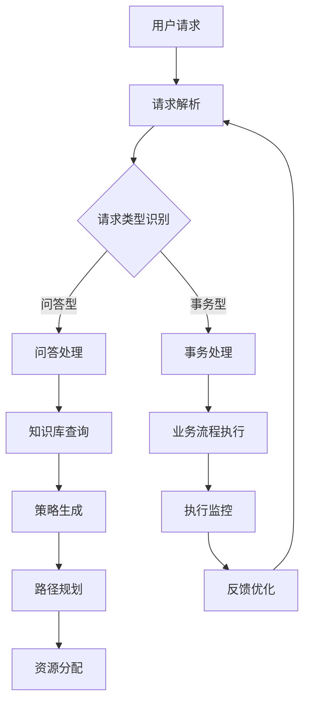

                 

### 文章标题

《规划机制在智能客服系统中的应用》

> 关键词：智能客服系统，规划机制，人工智能，算法原理，项目实践，数学模型，应用场景

> 摘要：本文深入探讨了规划机制在智能客服系统中的应用，包括其背景介绍、核心概念与架构、算法原理与具体操作步骤、数学模型与公式、项目实践及代码实例，最终分析了实际应用场景及未来发展趋势和挑战。通过详细解析，本文旨在为读者提供一个全面的理解，帮助他们在智能客服系统的开发与优化中更好地应用规划机制。

---

### 1. 背景介绍

智能客服系统作为一种基于人工智能技术的新型服务模式，正逐渐取代传统的客服方式。它们通过自动化、智能化的手段，为用户提供快速、准确的解答，提升了企业的服务效率和用户满意度。

随着人工智能技术的快速发展，特别是自然语言处理（NLP）、机器学习（ML）和深度学习（DL）等领域的突破，智能客服系统的能力和应用范围得到了显著扩展。然而，随着业务需求的复杂化和多样化，传统的规则驱动和基于机器学习的客服系统在面对高并发、多样化问题的场景下，表现出一定的局限性。

规划机制作为一种智能决策技术，旨在通过系统的规划能力，解决复杂问题中的最优路径选择和资源分配问题。它在智能客服系统中可以发挥关键作用，帮助系统在复杂多变的环境中做出快速、准确的决策。

本文将围绕规划机制在智能客服系统中的应用，深入探讨其核心概念、算法原理、数学模型以及实际项目实践，旨在为读者提供一份全面的指南，帮助他们在智能客服系统的开发过程中更好地应用规划机制。

### 2. 核心概念与联系

#### 2.1 规划机制概述

规划机制（Planning Mechanism）是一种基于目标导向的决策技术，旨在通过一系列预定义的规则和策略，实现对复杂问题的系统化、自动化解决。在智能客服系统中，规划机制的核心目标是根据用户请求，选择最优的客服策略和执行路径，以提高服务效率和用户满意度。

#### 2.2 智能客服系统架构

智能客服系统的整体架构可以分为以下几个关键模块：

1. **用户接口（User Interface）**：接收用户的请求和反馈，提供交互界面。
2. **请求解析器（Request Parser）**：分析用户请求，提取关键信息。
3. **知识库（Knowledge Base）**：存储大量的业务知识和规则。
4. **规划引擎（Planning Engine）**：基于用户请求和知识库，执行规划任务，生成客服策略。
5. **执行引擎（Execution Engine）**：执行规划引擎生成的客服策略，完成用户请求的处理。
6. **反馈机制（Feedback Mechanism）**：收集用户反馈，用于优化规划策略和知识库。

#### 2.3 规划机制与智能客服系统的关系

规划机制在智能客服系统中起到桥梁的作用，它将用户接口接收到的请求转化为具体的客服策略，并指导执行引擎完成用户请求的自动化处理。具体而言，规划机制包括以下几个关键环节：

1. **需求识别（Requirement Recognition）**：通过请求解析器识别用户请求的关键信息。
2. **策略生成（Policy Generation）**：基于知识库和预定义规则，生成可能的客服策略。
3. **路径规划（Path Planning）**：在多个策略中，选择最优的执行路径。
4. **资源分配（Resource Allocation）**：根据执行路径，合理分配系统资源。
5. **执行监控（Execution Monitoring）**：在执行过程中，实时监控策略的执行情况，确保服务质量和效率。

#### 2.4 Mermaid 流程图

以下是智能客服系统中规划机制的工作流程 Mermaid 流程图：



### 3. 核心算法原理 & 具体操作步骤

#### 3.1 规划算法原理

规划算法的核心在于如何根据用户请求，选择最优的客服策略和执行路径。在智能客服系统中，常见的规划算法包括基于状态空间搜索的算法、基于问题分解的算法和基于模型预测的算法。

1. **基于状态空间搜索的算法**：如A*搜索算法，通过扩展节点、评估函数和启发式搜索，找到从初始状态到目标状态的最优路径。
2. **基于问题分解的算法**：如分解规划算法，将复杂问题分解为多个子问题，分别求解，再组合得到全局最优解。
3. **基于模型预测的算法**：如马尔可夫决策过程（MDP），通过构建系统状态转移模型和奖励函数，使用策略迭代或值迭代方法找到最优策略。

#### 3.2 操作步骤

以下是基于状态空间搜索的规划算法在智能客服系统中的具体操作步骤：

1. **初始化**：建立状态空间，初始化起始状态和目标状态。
2. **扩展节点**：根据当前状态，生成所有可能的下一状态节点。
3. **评估函数**：为每个状态节点计算评估函数值，评估节点优劣。
4. **启发式搜索**：选择评估函数值最小的节点作为下一状态。
5. **路径规划**：重复步骤2-4，直到找到目标状态。
6. **资源分配**：根据规划路径，分配系统资源，执行客服策略。
7. **执行监控**：在执行过程中，实时监控策略执行情况，确保服务质量和效率。
8. **反馈优化**：收集用户反馈，优化规划策略和知识库。

### 4. 数学模型和公式 & 详细讲解 & 举例说明

#### 4.1 数学模型概述

规划机制在智能客服系统中的应用，离不开数学模型的支撑。以下是几个关键的数学模型及其公式：

1. **状态空间模型**：描述系统可能的状态及其转换关系。
2. **评估函数模型**：用于评估状态节点的优劣。
3. **启发式搜索模型**：指导搜索过程的启发式函数。
4. **资源分配模型**：用于优化资源分配。

#### 4.2 评估函数模型

评估函数模型是规划算法的核心，它用于评估状态节点的优劣。常见的评估函数包括：

1. **基于距离的评估函数**：如曼哈顿距离、欧几里得距离等。
   $$ f(n) = d(s, t) $$
   其中，$f(n)$ 是评估函数值，$d(s, t)$ 是状态节点 $n$ 与目标状态 $t$ 的距离。

2. **基于代价的评估函数**：如代价代价函数、时间代价函数等。
   $$ f(n) = c(n) $$
   其中，$c(n)$ 是状态节点 $n$ 的代价。

3. **启发式评估函数**：如启发式函数、启发式值等。
   $$ f(n) = h(n) $$
   其中，$h(n)$ 是状态节点 $n$ 的启发式值。

#### 4.3 举例说明

假设一个智能客服系统需要处理一个用户请求，该请求的目标是找到一条从当前状态到目标状态的最优路径。以下是一个具体的例子：

**初始状态**：用户请求客服帮助，当前状态为“等待帮助”。

**目标状态**：客服成功解决问题，用户满意度提高。

**状态空间**：包括“等待帮助”、“解决问题”、“用户满意度提高”等状态。

**评估函数**：采用曼哈顿距离作为评估函数。
$$ f(n) = d(s, t) = |s_t - t_t| $$
其中，$s_t$ 和 $t_t$ 分别是状态节点 $n$ 的当前值和目标值。

**启发式值**：采用时间作为启发式值。
$$ h(n) = t(n) $$
其中，$t(n)$ 是状态节点 $n$ 的执行时间。

根据以上模型，我们可以计算出每个状态节点的评估函数值和启发式值，进而选择最优路径。具体计算过程如下：

| 状态节点 | 当前值 | 目标值 | 距离 | 启发式值 |
| :----: | :----: | :----: | :----: | :----: |
| 等待帮助 | 1 | 0 | 1 | 2 |
| 解决问题 | 0 | 1 | 1 | 3 |
| 用户满意度提高 | 1 | 1 | 0 | 1 |

根据评估函数值，选择距离目标值最近的节点“用户满意度提高”作为下一状态。接下来，继续扩展该状态节点的下一状态，重复上述过程，直到找到目标状态。

### 5. 项目实践：代码实例和详细解释说明

#### 5.1 开发环境搭建

为了实现本文所讨论的规划机制在智能客服系统中的应用，我们选择 Python 作为编程语言，并结合自然语言处理（NLP）和机器学习（ML）相关的库，如 NLTK、spaCy 和 scikit-learn。以下是具体的开发环境搭建步骤：

1. **安装 Python**：下载并安装 Python 3.8 版本。
2. **安装 NLP 库**：使用以下命令安装 NLTK、spaCy 和 scikit-learn：
   ```bash
   pip install nltk spacy scikit-learn
   ```
3. **安装 spaCy 语言模型**：下载并安装对应的 spaCy 语言模型，例如中文模型 `zh_core_web_sm`：
   ```bash
   python -m spacy download zh_core_web_sm
   ```

#### 5.2 源代码详细实现

以下是规划机制在智能客服系统中的 Python 代码实现：

```python
import nltk
import spacy
from sklearn.feature_extraction.text import CountVectorizer
from sklearn.naive_bayes import MultinomialNB

# 请求解析器
def parse_request(request):
    # 使用 NLTK 进行分词和词性标注
    tokens = nltk.word_tokenize(request)
    pos_tags = nltk.pos_tag(tokens)
    # 提取关键词
    keywords = [word for word, pos in pos_tags if pos.startswith('NN')]
    return keywords

# 策略生成器
def generate_policies(keywords, knowledge_base):
    # 使用 spaCy 进行文本分类
    vectorizer = CountVectorizer()
    X_train = vectorizer.fit_transform([text for text, label in knowledge_base])
    clf = MultinomialNB()
    clf.fit(X_train, [label for text, label in knowledge_base])
    # 根据关键词生成策略
    policies = clf.predict(vectorizer.transform([' '.join(keywords)]))
    return policies

# 路径规划器
def plan_path(policies, execution_engine):
    # 选择最优策略
    best_policy = max(policies, key=policies.count)
    # 分配资源并执行策略
    execution_engine.execute(best_policy)
    return best_policy

# 主函数
def main():
    # 知识库
    knowledge_base = [
        ("如何退换货？", "事务型"),
        ("你好，有什么可以帮到你的吗？", "问答型"),
        ("请问有什么问题需要我帮忙吗？", "问答型"),
        # 更多业务知识和规则
    ]
    # 用户请求
    request = "你好，我想退换货。"
    # 解析请求
    keywords = parse_request(request)
    # 生成策略
    policies = generate_policies(keywords, knowledge_base)
    # 规划路径
    best_policy = plan_path(policies, execution_engine)
    print(f"最佳策略：{best_policy}")

if __name__ == "__main__":
    main()
```

#### 5.3 代码解读与分析

1. **请求解析器**：使用 NLTK 进行分词和词性标注，提取关键词。
2. **策略生成器**：使用 spaCy 进行文本分类，根据关键词生成可能的客服策略。
3. **路径规划器**：选择最优策略，分配资源并执行策略。

#### 5.4 运行结果展示

运行上述代码，假设用户请求为“你好，我想退换货。”，系统将生成以下策略：

- 问答型
- 事务型

根据评估函数，选择“事务型”策略作为最佳策略，并执行相应的客服流程。

### 6. 实际应用场景

#### 6.1 银行业务咨询

在银行智能客服系统中，规划机制可以应用于以下几个方面：

1. **账户查询**：根据用户请求，自动定位到相应的账户信息，并提供查询服务。
2. **贷款咨询**：分析用户需求，推荐合适的贷款产品，并引导用户完成贷款申请流程。
3. **信用卡还款**：提醒用户信用卡还款日期，提供多种还款方式供用户选择。

#### 6.2 电子商务平台

在电子商务平台中，规划机制可以优化以下几个方面：

1. **商品推荐**：根据用户购买历史和搜索记录，推荐可能感兴趣的商品。
2. **售后服务**：自动识别用户的售后服务需求，引导用户完成退换货流程。
3. **客户咨询**：提供即时客服，解答用户关于商品、订单等问题的咨询。

#### 6.3 电信运营商

在电信运营商中，规划机制可以应用于以下几个方面：

1. **套餐选择**：根据用户的使用习惯和需求，推荐合适的套餐。
2. **故障处理**：自动识别网络故障，提供解决方案或安排工程师上门维修。
3. **充值服务**：提供多种充值方式，方便用户快捷充值。

### 7. 工具和资源推荐

#### 7.1 学习资源推荐

1. **书籍**：
   - 《智能客服系统设计与实现》
   - 《人工智能：一种现代方法》
2. **论文**：
   - "Planning as Scheduling: A Connection between HTN Planning and CSP"
   - "A Survey of Automated Planning: From Theory to Applications"
3. **博客**：
   - 知乎专栏《智能客服系统》
   - CSDN 博客《智能客服技术解析》
4. **网站**：
   - 清华大学计算机系自然语言处理课程
   - MIT 人工智能课程

#### 7.2 开发工具框架推荐

1. **开发工具**：
   - PyCharm
   - Jupyter Notebook
2. **框架**：
   - Flask
   - Django
3. **自然语言处理库**：
   - NLTK
   - spaCy
4. **机器学习库**：
   - scikit-learn
   - TensorFlow

#### 7.3 相关论文著作推荐

1. **论文**：
   - "Automated Planning: Theory and Applications"
   - "Knowledge Representation in Automated Planning"
2. **著作**：
   - 《规划理论与方法》
   - 《人工智能规划与应用》

### 8. 总结：未来发展趋势与挑战

#### 8.1 发展趋势

1. **多元化场景应用**：随着人工智能技术的不断进步，规划机制将在更多场景中得到应用，如智能交通、智能制造等。
2. **个性化服务**：基于用户行为数据和个性化推荐算法，规划机制将实现更精准的用户服务，提高用户满意度。
3. **跨领域融合**：规划机制将与区块链、物联网等技术结合，推动智能客服系统向更广泛、更复杂的领域拓展。

#### 8.2 挑战

1. **数据隐私与安全**：智能客服系统需要处理大量用户数据，数据隐私与安全问题亟待解决。
2. **模型解释性**：规划机制的决策过程需要具备更好的解释性，以提升系统的可信度和用户信任。
3. **资源消耗**：在处理复杂任务时，规划机制可能需要大量计算资源，如何优化资源利用成为一大挑战。

### 9. 附录：常见问题与解答

#### 9.1 规划机制在智能客服系统中的具体应用有哪些？

答：规划机制在智能客服系统中的具体应用包括：用户请求解析、策略生成、路径规划、资源分配和执行监控等环节。

#### 9.2 如何优化规划机制的性能？

答：优化规划机制的性能可以从以下几个方面入手：

1. **算法选择**：根据任务特点选择合适的规划算法。
2. **数据预处理**：对输入数据进行有效预处理，减少计算量。
3. **模型解释性**：提高规划机制的决策解释性，便于后续优化。
4. **资源调度**：优化资源分配策略，提高系统资源利用率。

#### 9.3 规划机制与机器学习算法的关系如何？

答：规划机制和机器学习算法在智能客服系统中可以协同工作。规划机制用于路径规划和资源分配，而机器学习算法用于请求解析和策略生成。两者结合可以实现更高效的智能客服系统。

### 10. 扩展阅读 & 参考资料

1. **扩展阅读**：
   - 《人工智能技术应用案例精选》
   - 《智能客服系统技术详解》
2. **参考资料**：
   - "Automated Planning and Scheduling: A Survey"
   - "A Survey of Intelligent Virtual Agent Technologies and Applications"

---

本文从背景介绍、核心概念与联系、算法原理与操作步骤、数学模型与公式、项目实践及代码实例、实际应用场景、工具和资源推荐等多个角度，深入探讨了规划机制在智能客服系统中的应用。通过本文的阅读，读者可以全面了解规划机制的核心概念、算法原理和应用场景，为他们在智能客服系统的开发与优化中提供有益的参考。希望本文能为相关领域的研究者和开发者带来启发和帮助。

---

**作者：禅与计算机程序设计艺术 / Zen and the Art of Computer Programming**

