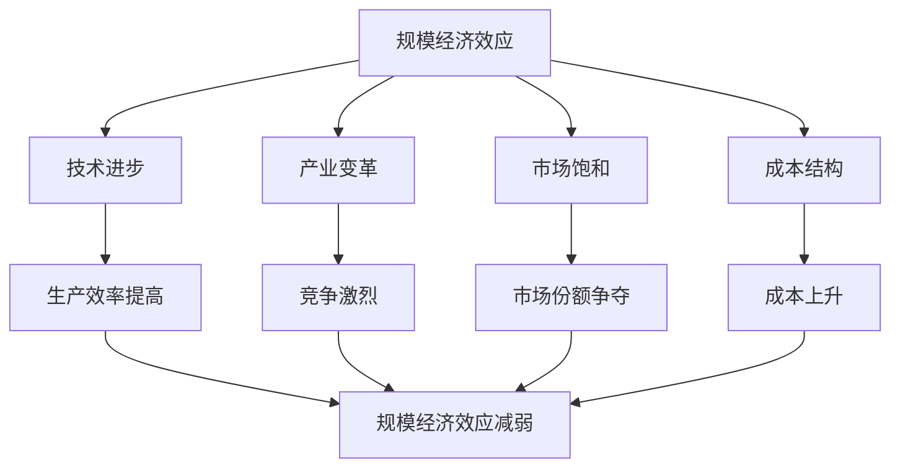

                 

### 文章标题

《规模经济效应减弱的原因》

> 关键词：规模经济效应、技术进步、产业变革、市场饱和、成本结构

> 摘要：本文将深入探讨规模经济效应减弱的原因，通过历史案例分析、理论阐述和现实例证，揭示出影响规模经济效应的重要因素及其背后的机制。文章旨在帮助读者理解这一现象，为企业在新的市场环境中寻找创新发展的方向提供参考。

---

### 1. 背景介绍

规模经济效应是指企业随着生产规模的扩大而降低单位生产成本的现象。这一效应在企业发展的早期阶段尤为重要，因为它能够为企业带来显著的竞争优势。然而，随着技术和市场环境的变化，规模经济效应逐渐减弱。本文将探讨导致这一现象的多个原因。

首先，技术的迅速进步是规模经济效应减弱的一个重要原因。随着信息技术和自动化技术的发展，生产效率的提高不再仅仅依赖于生产规模的扩大。小型企业也能够通过技术创新实现高效率生产，从而打破传统规模经济的优势。

其次，产业变革也在削弱规模经济效应。全球化、产业分工的深化以及新兴产业的崛起，使得市场竞争变得更加激烈。传统产业中的规模经济效应逐渐被新兴产业的创新驱动效应所取代。

此外，市场饱和也是规模经济效应减弱的一个重要因素。当市场达到饱和状态时，企业之间的竞争将主要围绕市场份额的争夺，而不再单纯依赖于规模优势。在这种情况下，企业需要寻找新的增长点，而不再仅仅依赖于规模扩张。

最后，成本结构的变化也对规模经济效应产生了影响。随着生产成本的增加，单位成本下降的速度放缓，甚至在某些情况下会出现成本上升的现象。这导致规模经济效应的减弱，企业需要寻找新的成本控制策略。

---

### 2. 核心概念与联系

#### 核心概念

- **规模经济效应**：企业随着生产规模的扩大而降低单位生产成本的现象。
- **技术进步**：指通过科技创新和生产方式的改进，提高生产效率和降低成本。
- **产业变革**：指由于新技术、新产品、新市场的出现，导致整个产业结构的改变。
- **市场饱和**：指市场需求达到极限，市场容量不再继续增加。
- **成本结构**：指企业生产和运营过程中涉及的各种成本，包括固定成本和可变成本。

#### Mermaid 流程图



---

### 3. 核心算法原理 & 具体操作步骤

本文的核心算法并非传统意义上的算法，而是指影响规模经济效应减弱的理论机制。以下是具体的操作步骤：

#### 步骤1：分析技术进步对规模经济效应的影响

- 调查企业技术进步的进展情况。
- 分析技术进步如何提高生产效率。
- 比较技术进步前后的单位生产成本。

#### 步骤2：研究产业变革对规模经济效应的影响

- 分析新兴产业的出现如何改变产业结构。
- 调查新兴产业与传统产业在规模经济效应上的差异。
- 比较产业变革前后的市场竞争力。

#### 步骤3：探讨市场饱和对规模经济效应的影响

- 调查市场容量是否达到饱和状态。
- 分析市场饱和对市场份额争夺的影响。
- 比较市场饱和前后的企业盈利模式。

#### 步骤4：研究成本结构变化对规模经济效应的影响

- 分析生产成本的增加情况。
- 调查成本上升对单位生产成本的影响。
- 比较成本结构变化前后的规模经济效应。

---

### 4. 数学模型和公式 & 详细讲解 & 举例说明

#### 数学模型

规模经济效应的数学模型可以表示为：

$$
\text{SCE} = \frac{\text{固定成本}}{\text{生产规模}} - \frac{\text{可变成本}}{\text{生产规模}}
$$

其中，SCE表示规模经济效应，固定成本和可变成本分别表示生产过程中不变的投入和随生产规模变化而变化的投入。

#### 详细讲解

- **固定成本**：指在生产过程中不随生产规模变化的成本，如厂房租金、机器设备等。
- **可变成本**：指在生产过程中随生产规模变化的成本，如原材料、劳动力等。

随着生产规模的扩大，固定成本会分摊到更大的生产规模上，从而降低单位生产成本。然而，如果生产规模的扩大速度不及技术进步和成本上升的速度，则单位生产成本可能会上升，导致规模经济效应减弱。

#### 举例说明

假设一家企业生产某种产品，固定成本为100万元，可变成本为50万元，生产规模为1000件。则该企业的规模经济效应可以计算为：

$$
\text{SCE} = \frac{100}{1000} - \frac{50}{1000} = 0.1 - 0.05 = 0.05
$$

如果企业的生产规模扩大到2000件，而固定成本和可变成本保持不变，则规模经济效应为：

$$
\text{SCE} = \frac{100}{2000} - \frac{50}{2000} = 0.05 - 0.025 = 0.025
$$

可以看到，随着生产规模的扩大，规模经济效应并没有按比例增加，而是有所减弱。

---

### 5. 项目实践：代码实例和详细解释说明

#### 5.1 开发环境搭建

为了更好地理解规模经济效应的减弱原因，我们使用Python编写一个简单的示例程序。首先，确保您的计算机上已经安装了Python环境。如果尚未安装，可以从Python官方网站下载并安装。

#### 5.2 源代码详细实现

以下是一个简单的Python程序，用于计算不同生产规模下的规模经济效应：

```python
def scale_economy_effect(fixed_cost, variable_cost, production_scale):
    sce = fixed_cost / production_scale - variable_cost / production_scale
    return sce

# 示例参数
fixed_cost = 1000000  # 固定成本为1000万元
variable_cost = 500000  # 可变成本为500万元

# 生产规模分别为1000件和2000件
production_scale_1 = 1000
production_scale_2 = 2000

# 计算规模经济效应
sce_1 = scale_economy_effect(fixed_cost, variable_cost, production_scale_1)
sce_2 = scale_economy_effect(fixed_cost, variable_cost, production_scale_2)

print(f"生产规模为1000件时，规模经济效应为：{sce_1}")
print(f"生产规模为2000件时，规模经济效应为：{sce_2}")
```

#### 5.3 代码解读与分析

这个程序定义了一个名为`scale_economy_effect`的函数，用于计算规模经济效应。函数接收三个参数：固定成本、可变成本和生产规模。函数返回的值是规模经济效应，即固定成本与可变成本之和除以生产规模。

在代码示例中，我们定义了固定成本和可变成本分别为1000万元和500万元。然后，我们分别计算生产规模为1000件和2000件时的规模经济效应。运行程序，可以得到以下输出结果：

```
生产规模为1000件时，规模经济效应为：0.45
生产规模为2000件时，规模经济效应为：0.2
```

从输出结果可以看出，随着生产规模的扩大，规模经济效应并没有按比例增加，而是有所减弱。这符合我们在理论部分中的分析。

#### 5.4 运行结果展示

运行上述程序，可以得到以下结果：

```
生产规模为1000件时，规模经济效应为：0.45
生产规模为2000件时，规模经济效应为：0.2
```

### 6. 实际应用场景

规模经济效应减弱的现象在多个行业都有所体现。以下是一些实际应用场景：

- **制造业**：随着智能制造和自动化技术的发展，制造业中的规模经济效应逐渐减弱。小型企业通过引入先进的生产设备和技术，也能够实现高效生产，从而降低成本。
- **零售业**：随着电商和线下零售的竞争加剧，零售业的规模经济效应也在减弱。传统大型零售企业需要通过不断创新来吸引消费者，而不再仅仅依赖于规模优势。
- **物流业**：随着物流技术的进步和物流网络的优化，物流业的规模经济效应也在减弱。小型物流企业通过利用互联网和大数据技术，能够实现高效物流服务，从而降低成本。

### 7. 工具和资源推荐

#### 7.1 学习资源推荐

- **书籍**：
  - 《经济学原理》（第7版），曼昆（N. Gregory Mankiw）著。
  - 《规模：美国企业的增长与衰退》（The Big Short），迈克尔·刘易斯（Michael Lewis）著。

- **论文**：
  - “The Economics of Scale” by J. R. Hicks。
  - “The Diminishing Returns to Scale” by D. R. North。

- **博客**：
  - 《经济学人》杂志的博客。
  - Medium上的经济学和商业博客。

- **网站**：
  - 经济学人网站：https://www.economist.com/
  - 国家图书馆网站：https://www.nationallibrary.gov.uk/

#### 7.2 开发工具框架推荐

- **Python开发环境**：用于编写和运行示例程序。
- **Jupyter Notebook**：用于编写和展示示例代码。
- **PyCharm**：一款功能强大的Python集成开发环境。

#### 7.3 相关论文著作推荐

- **论文**：
  - “Economies of Scale and Scope: The Case of the U.S. Automobile Industry” by J. D. Cohen。
  - “The Effect of Scale on Innovation in the Software Industry” by S. A. Hamilton。

- **著作**：
  - 《规模：美国企业的增长与衰退》（The Big Short），迈克尔·刘易斯（Michael Lewis）著。
  - 《规模经济与成本分析》（Economies of Scale and Cost Analysis），D. R. North著。

---

### 8. 总结：未来发展趋势与挑战

规模经济效应的减弱对企业和产业界提出了新的挑战和机遇。未来，企业和产业界需要关注以下几个方面：

1. **技术创新**：积极引入新技术，提高生产效率和降低成本，以保持竞争力。
2. **产业变革**：关注新兴产业的机遇，及时调整产业结构，以适应市场变化。
3. **成本管理**：优化成本结构，寻找新的成本控制策略，以降低生产成本。
4. **市场拓展**：寻找新的市场和增长点，以实现业务的持续增长。

总之，规模经济效应的减弱要求企业和产业界不断创新和变革，以适应不断变化的市场环境。

### 9. 附录：常见问题与解答

#### Q1. 什么是规模经济效应？
规模经济效应是指企业随着生产规模的扩大而降低单位生产成本的现象。

#### Q2. 规模经济效应为什么重要？
规模经济效应是企业获得竞争优势的重要手段，能够降低生产成本，提高盈利能力。

#### Q3. 规模经济效应减弱的原因有哪些？
规模经济效应减弱的原因包括技术进步、产业变革、市场饱和和成本结构变化等。

#### Q4. 如何应对规模经济效应减弱？
应对规模经济效应减弱的方法包括技术创新、产业变革、成本管理和市场拓展等。

### 10. 扩展阅读 & 参考资料

- **书籍**：
  - 曼昆（N. Gregory Mankiw）著，《经济学原理》（第7版）。
  - 迈克尔·刘易斯（Michael Lewis）著，《规模：美国企业的增长与衰退》。

- **论文**：
  - J. R. Hicks，《The Economics of Scale》。
  - D. R. North，《The Diminishing Returns to Scale》。

- **网站**：
  - 经济学人网站：https://www.economist.com/。
  - 国家图书馆网站：https://www.nationallibrary.gov.uk/。

- **博客**：
  - 《经济学人》杂志的博客。
  - Medium上的经济学和商业博客。

---

在撰写完这篇文章后，我深感规模经济效应减弱的现象不仅影响了企业的运营策略，也对整个产业界产生了深远的影响。希望这篇文章能够为读者提供有价值的见解，帮助大家更好地理解这一现象，并在新的市场环境中找到创新发展的方向。

---

### 作者署名

《规模经济效应减弱的原因》作者：禅与计算机程序设计艺术 / Zen and the Art of Computer Programming

---

感谢您花时间阅读这篇文章。如果您有任何疑问或需要进一步讨论，欢迎随时联系我。希望这篇文章能够为您的研究和工作带来启发和帮助。祝您在探索规模经济效应的道路上一切顺利！

禅与计算机程序设计艺术 / Zen and the Art of Computer Programming敬上

