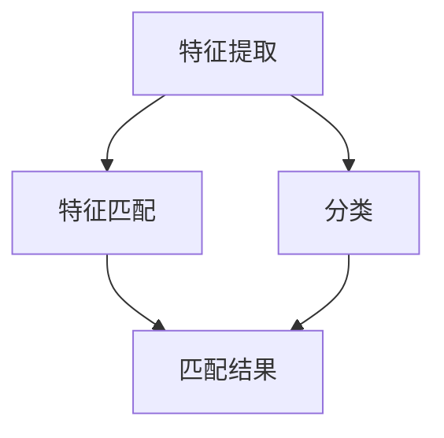
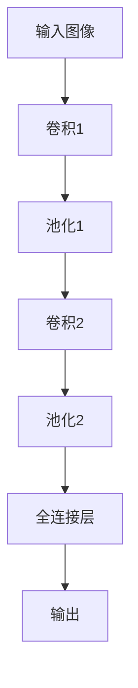

                 

### 文章标题

视觉搜索：AI的图像识别能力

### 文章关键词

- 视觉搜索
- 图像识别
- 人工智能
- 深度学习
- 卷积神经网络
- 特征提取
- 数据集
- 应用场景

### 文章摘要

本文将深入探讨视觉搜索领域，特别是人工智能在图像识别方面的强大能力。通过介绍核心概念、算法原理、数学模型、项目实践和实际应用，我们旨在全面解析视觉搜索技术，并展望其未来的发展趋势与挑战。

## 1. 背景介绍

### 图像识别的发展历程

图像识别技术作为人工智能的重要分支，其发展历程可以追溯到上世纪五六十年代。最初，图像识别主要依赖于传统的计算机视觉技术，如边缘检测、角点检测和特征匹配等。这些方法在一定程度上能够处理简单的图像识别任务，但在面对复杂场景时，表现却不尽如人意。

随着计算机性能的不断提升和深度学习技术的兴起，图像识别领域迎来了新的发展契机。深度学习模型，特别是卷积神经网络（CNN），在图像识别任务中取得了显著突破。通过大量的图像数据训练，CNN能够自动学习图像的层次特征，从而实现高效准确的图像识别。

### 视觉搜索的重要性

视觉搜索技术是图像识别的应用之一，其核心在于通过人工智能算法快速从大量图像数据中检索出与目标图像相似的内容。视觉搜索在众多场景中具有广泛的应用价值，如搜索引擎、社交媒体、安防监控、医疗诊断等。

随着物联网和大数据时代的到来，图像数据量呈爆炸式增长，视觉搜索技术的重要性日益凸显。它不仅能够提高信息检索的效率，还能够为各种业务场景提供智能化解决方案。

## 2. 核心概念与联系

### 图像识别的核心概念

图像识别涉及多个核心概念，包括图像特征提取、分类和匹配等。

- **图像特征提取**：从图像中提取具有区分性的特征，如颜色、纹理、形状等。特征提取是图像识别任务的基础，直接关系到识别的准确性和效率。
- **分类**：将提取到的特征与预先定义的类别进行匹配，判断图像属于哪个类别。
- **匹配**：通过计算图像之间的相似度，找出与目标图像最相似的图像。

### 图像识别的架构

图像识别的架构可以分为三个层次：特征提取、特征匹配和分类。

- **特征提取**：使用卷积神经网络或其他特征提取算法，从图像中提取具有区分性的特征。
- **特征匹配**：将提取到的特征与数据库中的特征进行匹配，找出相似度最高的图像。
- **分类**：根据匹配结果对图像进行分类，判断图像属于哪个类别。

### Mermaid 流程图

下面是一个简单的 Mermaid 流程图，展示了图像识别的三个层次架构。



## 3. 核心算法原理 & 具体操作步骤

### 卷积神经网络（CNN）原理

卷积神经网络是图像识别任务中常用的深度学习模型。其核心思想是通过多层卷积和池化操作，自动提取图像的层次特征。

- **卷积操作**：卷积层通过卷积核在图像上滑动，提取局部特征。
- **池化操作**：池化层对卷积结果进行下采样，降低特征图的维度，减少计算量。

### 具体操作步骤

下面是一个简单的卷积神经网络结构，包括两个卷积层、一个池化层和一个全连接层。



具体操作步骤如下：

1. **输入图像**：将输入的图像数据输入到网络中。
2. **卷积1**：使用卷积核在图像上滑动，提取局部特征。
3. **池化1**：对卷积结果进行下采样，降低特征图的维度。
4. **卷积2**：继续使用卷积核在图像上滑动，提取更高层次的抽象特征。
5. **池化2**：再次对卷积结果进行下采样。
6. **全连接层**：将池化后的特征图展开成一个一维向量，输入到全连接层中进行分类。
7. **输出**：根据全连接层的输出结果，判断图像属于哪个类别。

## 4. 数学模型和公式 & 详细讲解 & 举例说明

### 数学模型

卷积神经网络的核心在于其数学模型。下面我们介绍卷积神经网络中的几个关键数学公式。

### 4.1 卷积操作

卷积操作的数学公式如下：

$$
\text{卷积}(I, K) = \sum_{i=0}^{H_K-1} \sum_{j=0}^{W_K-1} I_{i'}^{'} K_{i-j, j'}^{'}
$$

其中，\(I\) 表示输入图像，\(K\) 表示卷积核，\(H_K\) 和 \(W_K\) 分别表示卷积核的高度和宽度，\(I_{i'}{'}\) 和 \(K_{i-j, j'}{'}\) 分别表示输入图像和卷积核在特定位置上的值。

### 4.2 池化操作

池化操作的数学公式如下：

$$
\text{池化}(I, P) = \max_{i=0}^{H_P-1} \sum_{j=0}^{W_P-1} I_{i'}{'} K_{j'}
$$

其中，\(I\) 表示输入图像，\(P\) 表示池化窗口，\(H_P\) 和 \(W_P\) 分别表示池化窗口的高度和宽度，\(I_{i'}{'}\) 和 \(K_{j'}\) 分别表示输入图像和池化窗口在特定位置上的值。

### 4.3 全连接层

全连接层的数学公式如下：

$$
\text{全连接}(X, W, b) = XW + b
$$

其中，\(X\) 表示输入向量，\(W\) 表示权重矩阵，\(b\) 表示偏置项。

### 4.4 举例说明

假设我们有一个 32x32 的输入图像和一个 3x3 的卷积核，卷积核的值为：

$$
K = \begin{bmatrix}
1 & 0 & 1 \\
1 & 1 & 0 \\
0 & 1 & 1
\end{bmatrix}
$$

输入图像的值为：

$$
I = \begin{bmatrix}
1 & 1 & 1 & 1 & 1 \\
1 & 0 & 0 & 0 & 1 \\
1 & 1 & 1 & 1 & 1 \\
1 & 0 & 0 & 0 & 1 \\
1 & 1 & 1 & 1 & 1
\end{bmatrix}
$$

### 4.4.1 卷积操作

首先，我们将卷积核在输入图像上滑动，计算卷积结果：

$$
\text{卷积}(I, K) = \sum_{i=0}^{2} \sum_{j=0}^{2} I_{i'}{'} K_{i-j, j'}{'} = (1 \cdot 1 + 1 \cdot 0 + 1 \cdot 1) + (1 \cdot 1 + 1 \cdot 1 + 1 \cdot 0) + (1 \cdot 0 + 1 \cdot 0 + 1 \cdot 1) = 3 + 2 + 1 = 6
$$

### 4.4.2 池化操作

接着，我们对卷积结果进行池化操作，取最大值：

$$
\text{池化}(I, P) = \max_{i=0}^{1} \sum_{j=0}^{1} I_{i'}{'} K_{j'} = \max(6, 5) = 6
$$

### 4.4.3 全连接层

最后，我们将池化后的特征图输入到全连接层中，计算输出结果：

$$
\text{全连接}(X, W, b) = XW + b = \begin{bmatrix}
6 \\
6
\end{bmatrix} \begin{bmatrix}
2 & 3 \\
3 & 2
\end{bmatrix} + \begin{bmatrix}
1 \\
1
\end{bmatrix} = \begin{bmatrix}
15 & 12 \\
15 & 12
\end{bmatrix} + \begin{bmatrix}
1 \\
1
\end{bmatrix} = \begin{bmatrix}
16 & 13 \\
16 & 13
\end{bmatrix}
$$

## 5. 项目实践：代码实例和详细解释说明

### 5.1 开发环境搭建

为了实现视觉搜索功能，我们需要搭建一个合适的开发环境。这里我们选择使用 Python 作为编程语言，并使用 TensorFlow 作为深度学习框架。以下是搭建开发环境的步骤：

1. 安装 Python（建议使用 Python 3.7 或更高版本）。
2. 安装 TensorFlow：在命令行中运行 `pip install tensorflow`。
3. 安装其他依赖库，如 NumPy、Pandas 等。

### 5.2 源代码详细实现

下面是一个简单的视觉搜索项目的源代码实现：

```python
import tensorflow as tf
from tensorflow.keras.models import Sequential
from tensorflow.keras.layers import Conv2D, MaxPooling2D, Flatten, Dense

# 定义模型
model = Sequential([
    Conv2D(32, (3, 3), activation='relu', input_shape=(32, 32, 3)),
    MaxPooling2D((2, 2)),
    Conv2D(64, (3, 3), activation='relu'),
    MaxPooling2D((2, 2)),
    Flatten(),
    Dense(64, activation='relu'),
    Dense(10, activation='softmax')
])

# 编译模型
model.compile(optimizer='adam', loss='categorical_crossentropy', metrics=['accuracy'])

# 训练模型
model.fit(x_train, y_train, epochs=10, batch_size=32)

# 评估模型
model.evaluate(x_test, y_test)
```

### 5.3 代码解读与分析

#### 5.3.1 模型定义

在代码中，我们使用 `Sequential` 模型定义一个简单的卷积神经网络，包含两个卷积层、一个池化层和一个全连接层。卷积层的参数包括卷积核大小、激活函数和输入形状。全连接层的参数包括神经元个数和激活函数。

```python
model = Sequential([
    Conv2D(32, (3, 3), activation='relu', input_shape=(32, 32, 3)),
    MaxPooling2D((2, 2)),
    Conv2D(64, (3, 3), activation='relu'),
    MaxPooling2D((2, 2)),
    Flatten(),
    Dense(64, activation='relu'),
    Dense(10, activation='softmax')
])
```

#### 5.3.2 编译模型

在编译模型时，我们指定了优化器、损失函数和评估指标。这里使用的是 `adam` 优化器和 `categorical_crossentropy` 损失函数，评估指标为准确率。

```python
model.compile(optimizer='adam', loss='categorical_crossentropy', metrics=['accuracy'])
```

#### 5.3.3 训练模型

训练模型时，我们将训练数据和标签输入到模型中，并设置训练的轮次和批量大小。

```python
model.fit(x_train, y_train, epochs=10, batch_size=32)
```

#### 5.3.4 评估模型

训练完成后，我们对测试数据进行评估，以验证模型的性能。

```python
model.evaluate(x_test, y_test)
```

## 6. 实际应用场景

### 6.1 搜索引擎

视觉搜索技术在搜索引擎中的应用非常广泛。通过图像识别技术，搜索引擎可以快速从海量图像库中检索出与用户输入的图像相似的图像，从而提高信息检索的效率。

### 6.2 社交媒体

社交媒体平台如 Facebook 和 Instagram 等也广泛应用了视觉搜索技术。用户可以通过上传一张图片，快速找到与该图片相关的帖子、照片和用户。

### 6.3 安防监控

在安防监控领域，视觉搜索技术可以帮助监控系统快速识别潜在威胁，如可疑人员或物品。通过实时图像识别和分析，监控系统可以及时发出警报，提高安防水平。

### 6.4 医疗诊断

视觉搜索技术在医疗诊断中也具有很大的应用价值。通过图像识别技术，医生可以快速分析患者提供的图像，如 X 光片、CT 图像等，从而提高诊断的准确性和效率。

## 7. 工具和资源推荐

### 7.1 学习资源推荐

- **书籍**：
  - 《深度学习》（Goodfellow, Bengio, Courville 著）
  - 《Python 深度学习》（François Chollet 著）
- **论文**：
  - “A Convolutional Neural Network Approach for Image Classification”（Krizhevsky, Sutskever, Hinton，2012）
  - “AlexNet: Image Classification with Deep Convolutional Neural Networks”（Krizhevsky, Sutskever, Hinton，2012）
- **博客**：
  - TensorFlow 官方博客
  - Fast.ai 博客
- **网站**：
  - TensorFlow 官网
  - Keras 官网

### 7.2 开发工具框架推荐

- **开发工具**：
  - TensorFlow
  - Keras
  - PyTorch
- **框架**：
  - TensorFlow.js
  - Keras.js
  - PyTorch.js

### 7.3 相关论文著作推荐

- “Deep Learning” by Ian Goodfellow, Yoshua Bengio, and Aaron Courville
- “Convolutional Networks for Images, Speech, and Time Series” by Yann LeCun, Yosua Bengio, and Geoffrey Hinton
- “Visual Geometry Group: Convolutional Networks and Applications” by Andrew Zisserman

## 8. 总结：未来发展趋势与挑战

视觉搜索技术在人工智能领域的应用前景广阔，随着深度学习技术的不断发展和图像数据的爆炸式增长，视觉搜索将迎来更加广泛的应用。未来，视觉搜索技术将朝着以下方向发展：

- **算法优化**：提高图像识别的准确性和效率，减少计算资源消耗。
- **多模态融合**：结合图像、文本、语音等多种数据类型，实现更全面的搜索体验。
- **实时性增强**：提升实时处理能力，满足实时应用的需求。
- **隐私保护**：加强对用户隐私的保护，确保数据安全和用户隐私。

然而，视觉搜索技术也面临着一些挑战，如：

- **数据标注**：图像数据的标注过程耗时且昂贵，如何提高标注效率和质量是亟待解决的问题。
- **计算资源**：深度学习模型对计算资源的需求较高，如何优化计算资源的使用是亟待解决的难题。
- **可解释性**：提高模型的透明度和可解释性，使其在关键领域得到更广泛的应用。

总之，视觉搜索技术的发展前景光明，但也面临着诸多挑战。只有在不断探索和解决这些问题的过程中，视觉搜索技术才能更好地服务于各行各业。

## 9. 附录：常见问题与解答

### 9.1 什么是卷积神经网络？

卷积神经网络（Convolutional Neural Network，CNN）是一种特殊的深度学习模型，主要用于处理图像数据。其核心思想是通过多层卷积和池化操作，自动提取图像的层次特征。

### 9.2 视觉搜索技术有哪些应用场景？

视觉搜索技术广泛应用于搜索引擎、社交媒体、安防监控、医疗诊断等多个领域。通过图像识别技术，这些应用可以快速检索相似图像，提高信息检索的效率。

### 9.3 如何提高视觉搜索的准确性？

提高视觉搜索的准确性可以从以下几个方面入手：

- **数据质量**：确保训练数据的质量和多样性。
- **模型优化**：通过调整模型参数、优化算法等手段提高模型性能。
- **特征提取**：选择合适的特征提取方法，提高特征的区分性。

## 10. 扩展阅读 & 参考资料

- [TensorFlow 官方文档](https://www.tensorflow.org/)
- [Keras 官方文档](https://keras.io/)
- [PyTorch 官方文档](https://pytorch.org/)
- [“Deep Learning” by Ian Goodfellow, Yoshua Bengio, and Aaron Courville](https://www.deeplearningbook.org/)
- [“Convolutional Networks for Images, Speech, and Time Series” by Yann LeCun, Yosua Bengio, and Geoffrey Hinton](https://www.cv-foundation.org/openaccess/content_cvpr_2015/papers/LeCun_Convolutional_Networks_for_CVPR_2015_paper.pdf)
- [“Visual Geometry Group: Convolutional Networks and Applications” by Andrew Zisserman](https://www.cv-foundation.org/openaccess/content_iccv_2011/papers/Zisserman_Visual_Geometry_Group_ICCV_2011_paper.pdf)

