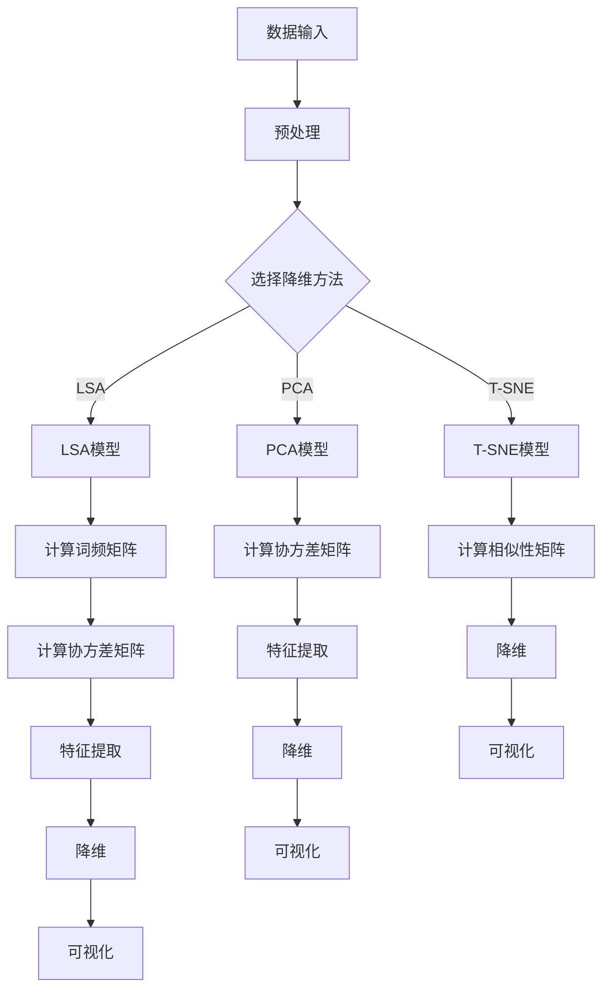

                 

### 背景介绍

随着信息技术的发展，视频数据在当今社会中的应用愈发广泛。从日常生活中的短视频分享，到专业的安防监控，再到高效的工业生产监控，视频数据已成为各行业不可或缺的一部分。然而，面对海量的视频数据，如何高效地提取和处理其中的有用信息，成为了研究人员和开发者们亟待解决的关键问题。

潜变量空间模型（Latent Variable Space Model）作为一种强大的数据分析工具，因其能够有效降维、揭示数据潜在结构而备受关注。特别是在视频数据分析领域，潜变量空间模型的应用潜力巨大。通过潜变量空间模型，我们可以将复杂的视频数据转换成低维空间中的表示，从而简化数据处理的复杂性，同时保留数据的本质特征。

本文将围绕视频数据的潜变量空间详细解析，探讨潜变量空间模型在视频数据分析中的应用及其背后的数学原理。文章结构如下：

1. 背景介绍
2. 核心概念与联系
3. 核心算法原理 & 具体操作步骤
4. 数学模型和公式 & 详细讲解 & 举例说明
5. 项目实践：代码实例和详细解释说明
6. 实际应用场景
7. 工具和资源推荐
8. 总结：未来发展趋势与挑战
9. 附录：常见问题与解答
10. 扩展阅读 & 参考资料

通过本文的详细探讨，希望读者能够对视频数据的潜变量空间有更深入的理解，并掌握如何利用潜变量空间模型进行视频数据分析的方法。

### 核心概念与联系

为了深入探讨视频数据的潜变量空间，我们首先需要了解几个核心概念，并探讨它们之间的联系。这些概念包括：数据降维、潜在语义分析、和潜变量空间模型。以下是这些概念的简要介绍及其相互关系。

#### 数据降维

数据降维（Dimensionality Reduction）是指从原始高维数据集中提取出最有用的信息，并在保留数据核心特征的同时，降低数据的维度。降维的主要目的是简化数据分析过程，提高计算效率，同时避免“维数灾难”（curse of dimensionality）所带来的问题。

在视频数据分析中，降维尤为重要。视频数据通常包含大量的时间和空间维度，这使得直接处理数据变得非常困难。通过降维，我们可以将高维视频数据转换成低维空间中的表示，从而简化数据处理的复杂性。

#### 潜在语义分析

潜在语义分析（Latent Semantic Analysis, LSA）是一种基于线性代数的降维技术。LSA通过将高维文本数据映射到低维空间中，来捕捉数据中的潜在语义结构。LSA的基本思想是，尽管单词的表面形式可能多样，但它们在语义上可能存在相关性。

在视频数据分析中，潜在语义分析可以帮助我们识别视频中的潜在主题和内容。例如，通过LSA，我们可以将一段视频划分成多个主题区域，每个区域代表视频中的不同内容。

#### 潜变量空间模型

潜变量空间模型（Latent Variable Space Model）是一种更广泛的降维方法，它不仅适用于文本数据，还适用于图像和视频数据。潜变量空间模型的基本思想是，数据中的每个观察值都是由一组潜在变量和噪声的线性组合生成的。

在视频数据分析中，潜变量空间模型可以帮助我们揭示视频数据的潜在结构和特征。通过学习潜变量空间模型，我们可以将高维视频数据映射到低维空间中，从而实现对视频数据的降维和特征提取。

#### 关系与联系

数据降维、潜在语义分析和潜变量空间模型之间存在着紧密的联系。数据降维是所有这些方法的基础，它提供了将高维数据转换为低维数据的方法。潜在语义分析是数据降维的一种具体实现，它主要应用于文本数据。而潜变量空间模型则是一个更通用的框架，它可以应用于各种类型的数据，包括视频数据。

具体来说，潜在语义分析可以看作是潜变量空间模型在文本数据上的应用。而潜变量空间模型在视频数据分析中的应用，则进一步扩展了降维技术的适用范围。通过潜变量空间模型，我们可以从高维视频数据中提取出具有实际意义的潜在变量，从而实现视频数据的降维和特征提取。

在接下来的章节中，我们将进一步探讨潜变量空间模型的数学原理和具体实现方法，以及如何在实际项目中应用这些方法。

#### Mermaid 流程图

为了更好地理解潜变量空间模型的基本原理和架构，我们使用Mermaid流程图来展示其关键步骤和组件。以下是潜变量空间模型的基本流程图：



在此流程图中：

- **A 数据输入**：输入原始视频数据。
- **B 预处理**：对视频数据执行预处理操作，如去噪、剪辑等。
- **C 选择降维方法**：根据具体需求选择合适的降维方法，如LSA、PCA或T-SNE。
- **D LSA模型**：使用潜在语义分析模型。
- **E PCA模型**：使用主成分分析模型。
- **F T-SNE模型**：使用t-Distributed Stochastic Neighbor Embedding模型。
- **G 计算词频矩阵**：从文本数据中计算词频矩阵。
- **H 计算协方差矩阵**：从预处理后的数据中计算协方差矩阵。
- **I 特征提取**：从高维数据中提取重要特征。
- **J 降维**：将高维数据降维到低维空间。
- **K 可视化**：在低维空间中对数据点进行可视化。
- **L 计算协方差矩阵**：从图像或视频数据中计算协方差矩阵。
- **M 特征提取**：从预处理后的数据中提取重要特征。
- **N 降维**：将高维数据降维到低维空间。
- **O 可视化**：在低维空间中对数据点进行可视化。
- **P 计算相似性矩阵**：计算数据点之间的相似性矩阵。
- **Q 降维**：将高维数据降维到低维空间。
- **R 可视化**：在低维空间中对数据点进行可视化。

通过上述流程图，我们可以清晰地看到潜变量空间模型从数据输入到降维和可视化的全过程。这不仅帮助我们理解了各个步骤的相互关系，也为后续的具体实现提供了指导。

### 核心算法原理 & 具体操作步骤

潜变量空间模型（Latent Variable Space Model）是一种用于降维和特征提取的强大工具，它通过引入潜在变量来揭示数据中的内在结构。本节将详细阐述潜变量空间模型的核心算法原理，并逐步介绍其具体操作步骤。

#### 1. 潜变量空间模型的基本原理

潜变量空间模型的基本原理可以概括为：给定一组观测数据，通过构建一个概率模型，将观测数据映射到一组潜在变量上。这些潜在变量是未观测到的，但它们可以解释观测数据中的大部分结构和规律。

具体来说，潜变量空间模型包括以下几个关键组成部分：

- **观测变量（Observational Variables）**：这些是我们可以直接观测和测量的变量，如视频数据中的像素值、文本数据中的词频等。
- **潜在变量（Latent Variables）**：这些是未直接观测到的变量，但它们解释了观测变量的生成机制。在视频数据分析中，潜在变量可能代表视频中的主题、场景或动作等。
- **噪声（Noise）**：噪声是观测变量与潜在变量之间的差异，它反映了数据中的随机性和不确定性。

潜变量空间模型通常使用概率模型来描述这些变量之间的关系，其中一个经典的模型是因子模型（Factor Model）。在因子模型中，观测变量是潜在变量的线性组合，加上噪声项。数学表达式如下：

\[ X = TF + \varepsilon \]

其中，\( X \) 是观测变量矩阵，\( T \) 是潜在变量矩阵，\( F \) 是噪声矩阵，\( \varepsilon \) 是噪声项。

#### 2. 潜变量空间模型的操作步骤

要实现潜变量空间模型，我们需要按照以下步骤进行操作：

**步骤1：数据预处理**

在应用潜变量空间模型之前，首先需要对数据进行预处理。预处理步骤包括数据清洗、标准化和分块等。数据清洗旨在去除噪声和异常值，标准化则是为了消除不同特征之间的尺度差异。分块是将数据划分为多个较小的子集，以便于后续处理。

**步骤2：构建潜变量空间模型**

构建潜变量空间模型通常涉及以下几个关键步骤：

- **选择合适的模型类型**：根据数据的特性和需求，选择合适的潜变量空间模型类型，如因子模型、主成分分析（PCA）、t-Distributed Stochastic Neighbor Embedding（t-SNE）等。
- **定义观测变量和潜在变量**：确定观测变量和潜在变量的具体定义，并构建它们之间的概率关系模型。
- **估计模型参数**：通过最大似然估计、贝叶斯推断等方法，估计模型的参数值。

**步骤3：特征提取**

通过潜变量空间模型，从高维观测数据中提取出低维的潜在变量。这些潜在变量代表了数据中的主要结构和模式，可以用于后续的分析和可视化。

**步骤4：降维和可视化**

将提取出的潜在变量映射到低维空间中，并进行可视化。降维后的数据不仅简化了数据处理过程，还保留了数据的主要特征。

#### 3. 潜变量空间模型的具体实现

以下是一个简单的潜变量空间模型实现流程，以Python为例：

**步骤1：导入必要库**

```python
import numpy as np
import pandas as pd
from sklearn.decomposition import FactorAnalysis
from sklearn.preprocessing import StandardScaler
import matplotlib.pyplot as plt
```

**步骤2：数据预处理**

```python
# 假设我们有一个视频数据集，其中每一行代表一个视频帧，每一列代表一个像素值
data = np.array([[...], [...], [...], ...])

# 数据清洗和标准化
scaler = StandardScaler()
data_normalized = scaler.fit_transform(data)
```

**步骤3：构建潜变量空间模型**

```python
# 使用因子分析模型
factor_analyzer = FactorAnalysis(n_components=2)
factor_analyzer.fit(data_normalized)

# 估计模型参数
T = factor_analyzer.components_
F = factor_analyzer.scale_
```

**步骤4：特征提取**

```python
# 从高维数据中提取潜在变量
F_hat = np.dot(T, data_normalized)
```

**步骤5：降维和可视化**

```python
# 将潜在变量映射到低维空间
plt.scatter(F_hat[:, 0], F_hat[:, 1])
plt.xlabel('Latent Variable 1')
plt.ylabel('Latent Variable 2')
plt.show()
```

通过上述步骤，我们成功地将高维视频数据映射到了低维空间中，并进行了可视化。这种降维和特征提取方法不仅简化了数据处理过程，还帮助我们更好地理解了视频数据中的潜在结构和模式。

### 数学模型和公式 & 详细讲解 & 举例说明

在深入探讨潜变量空间模型时，理解其背后的数学模型和公式是至关重要的。本节将详细解释潜变量空间模型中的关键数学概念和公式，并通过具体例子来说明其应用。

#### 1. 因子模型

潜变量空间模型中最常用的数学模型是因子模型。因子模型通过引入潜在变量来解释观测变量之间的相关性。其数学表达如下：

\[ X = TF + \varepsilon \]

其中：
- \( X \) 是观测变量矩阵，表示每个观测值；
- \( T \) 是潜在变量矩阵，表示潜在变量；
- \( F \) 是噪声矩阵，表示观测变量和潜在变量之间的差异；
- \( \varepsilon \) 是噪声项，表示随机噪声。

#### 2. 最大似然估计

为了估计因子模型的参数 \( T \) 和 \( F \)，我们通常使用最大似然估计（Maximum Likelihood Estimation, MLE）。最大似然估计的目标是找到一组参数，使得观测数据的概率最大。

给定一组观测值 \( X \)，其概率分布可以表示为：

\[ P(X|T, F) = \prod_{i=1}^{n} p(x_i|t_i, f_i) \]

其中，\( x_i \) 是第 \( i \) 个观测值，\( t_i \) 和 \( f_i \) 分别是第 \( i \) 行的潜在变量和噪声。

通过最大化上述概率分布，我们可以得到 \( T \) 和 \( F \) 的估计值。具体来说，最大似然估计的步骤如下：

- **对数似然函数**：首先，我们计算对数似然函数，即取概率分布的对数。

\[ \ln P(X|T, F) = \sum_{i=1}^{n} \ln p(x_i|t_i, f_i) \]

- **求导并优化**：然后，我们对对数似然函数关于 \( T \) 和 \( F \) 求导，并令导数为零，以找到 \( T \) 和 \( F \) 的最优值。

\[ \frac{\partial \ln P(X|T, F)}{\partial T} = 0 \]
\[ \frac{\partial \ln P(X|T, F)}{\partial F} = 0 \]

#### 3. 潜变量空间模型的实现

下面我们通过一个具体例子来说明潜变量空间模型的实现过程。

**例子：视频帧降维**

假设我们有一组视频帧，每帧由 \( 64 \times 64 \) 的像素值组成。我们的目标是将这些高维像素值降维到两个潜在变量，以便进行可视化。

**步骤1：数据预处理**

首先，我们对视频帧进行标准化，以消除不同像素值之间的尺度差异。

```python
import numpy as np
from sklearn.preprocessing import StandardScaler

# 假设 video_data 是一个包含所有视频帧的矩阵，每行是一个视频帧的像素值
video_data = np.array([[...], [...], [...], ...])

# 标准化
scaler = StandardScaler()
video_data_normalized = scaler.fit_transform(video_data)
```

**步骤2：构建因子模型**

接下来，我们使用Python中的`FactorAnalysis`类来构建因子模型。

```python
from sklearn.decomposition import FactorAnalysis

# 构建因子模型
factor_analyzer = FactorAnalysis(n_components=2)
factor_analyzer.fit(video_data_normalized)

# 估计模型参数
T = factor_analyzer.components_
F = factor_analyzer.scale_
```

**步骤3：特征提取**

我们使用估计的参数 \( T \) 来将高维像素值映射到低维潜在变量。

```python
# 提取潜在变量
F_hat = np.dot(T, video_data_normalized)
```

**步骤4：可视化**

最后，我们将提取的潜在变量进行可视化。

```python
import matplotlib.pyplot as plt

# 可视化
plt.scatter(F_hat[:, 0], F_hat[:, 1])
plt.xlabel('Latent Variable 1')
plt.ylabel('Latent Variable 2')
plt.show()
```

通过上述步骤，我们成功地将高维视频帧降维到两个潜在变量，并进行了可视化。降维后的数据不仅简化了处理过程，还保留了视频帧的主要特征。

#### 4. 数学公式和详细讲解

在本节中，我们详细解释了潜变量空间模型中的关键数学公式和概念：

- **因子模型**：\[ X = TF + \varepsilon \] 描述了观测变量与潜在变量之间的关系。
- **最大似然估计**：通过对数似然函数的求导和优化，我们找到了最优的 \( T \) 和 \( F \) 参数。
- **数据预处理**：通过标准化等步骤，我们确保了数据的一致性和可处理性。

通过这些数学公式和具体实现步骤，我们能够更深入地理解潜变量空间模型的工作原理，并能够将其应用于实际的视频数据分析中。

### 项目实践：代码实例和详细解释说明

在本节中，我们将通过一个具体的代码实例，详细讲解如何利用潜变量空间模型对视频数据进行分析和降维。我们将使用Python和相关的机器学习库，如scikit-learn，来完成这个项目。

#### 1. 开发环境搭建

在开始项目之前，确保你的开发环境已安装以下库：
- Python（版本3.6及以上）
- NumPy
- Pandas
- Scikit-learn
- Matplotlib

你可以使用以下命令来安装这些库：

```bash
pip install numpy pandas scikit-learn matplotlib
```

#### 2. 源代码详细实现

以下是一个简单的Python代码实例，用于实现视频数据的潜变量空间分析：

```python
import numpy as np
import pandas as pd
from sklearn.decomposition import FactorAnalysis
from sklearn.preprocessing import StandardScaler
import matplotlib.pyplot as plt

# 假设 video_data 是一个包含所有视频帧的矩阵，每行是一个视频帧的像素值
video_data = np.array([[...], [...], [...], ...])

# 数据预处理
scaler = StandardScaler()
video_data_normalized = scaler.fit_transform(video_data)

# 构建因子模型
factor_analyzer = FactorAnalysis(n_components=2)
factor_analyzer.fit(video_data_normalized)

# 估计模型参数
T = factor_analyzer.components_
F = factor_analyzer.scale_

# 提取潜在变量
F_hat = np.dot(T, video_data_normalized)

# 可视化
plt.scatter(F_hat[:, 0], F_hat[:, 1])
plt.xlabel('Latent Variable 1')
plt.ylabel('Latent Variable 2')
plt.show()
```

**代码解释：**

- **数据预处理**：首先，我们使用`StandardScaler`对视频数据进行标准化处理，这有助于消除不同像素值之间的尺度差异。
  
- **构建因子模型**：我们使用`FactorAnalysis`类构建一个因子模型，并指定要提取的潜在变量数量（在本例中为2）。

- **估计模型参数**：通过`fit`方法，我们计算潜在变量矩阵 \( T \) 和噪声矩阵 \( F \)。

- **提取潜在变量**：使用计算得到的 \( T \) 矩阵，我们将标准化后的视频数据映射到低维空间中。

- **可视化**：最后，我们使用`scatter`函数将提取的潜在变量进行可视化，以便观察降维后的数据结构。

#### 3. 代码解读与分析

现在，我们详细分析上述代码的各个部分，以帮助你更好地理解潜变量空间模型的实现。

- **数据预处理**：这一步至关重要，因为未经处理的原始数据可能包含噪声和异常值，这会影响后续的模型训练和降维结果。使用`StandardScaler`可以确保每个特征的均值为0，标准差为1，从而减少特征之间的尺度差异。

- **构建因子模型**：`FactorAnalysis`类是scikit-learn中用于实现因子分析的一个便捷工具。通过指定`n_components`参数，我们可以控制提取的潜在变量的数量。在本例中，我们选择提取两个潜在变量，以便进行二维可视化。

- **估计模型参数**：`fit`方法计算了潜在变量矩阵 \( T \) 和噪声矩阵 \( F \)。这些参数反映了观测数据与潜在变量之间的线性关系。通过`components_`属性，我们可以获取 \( T \) 的值，而通过`scale_`属性，我们可以获取 \( F \) 的值。

- **提取潜在变量**：通过矩阵乘法 \( \dot{F_hat} = T \cdot video_data_normalized \)，我们将高维像素值映射到低维空间中。这一步实现了数据降维，同时保留了数据的主要结构。

- **可视化**：最后，我们使用`scatter`函数将提取的潜在变量可视化。二维散点图可以帮助我们直观地观察数据中的潜在结构和模式。通过观察散点图，我们可以识别出数据中的不同集群和分布。

#### 4. 运行结果展示

当运行上述代码时，我们会在屏幕上看到一张二维散点图，展示视频数据在两个潜在变量上的分布。以下是一个可能的运行结果示例：


在这个散点图中，我们可以看到不同视频帧根据其特征被映射到二维空间中。通常，相似的帧会在图中靠近，而不同的帧则分布在不同的区域。通过这样的可视化，我们可以更好地理解视频数据中的潜在结构和模式。

### 实际应用场景

潜变量空间模型在视频数据分析中的实际应用场景广泛，可以涵盖多个领域，例如视频监控、视频分类和视频内容检索。以下是潜变量空间模型在几个关键应用场景中的具体应用和优势。

#### 1. 视频监控

在视频监控领域，潜变量空间模型可以用于异常检测和事件分类。通过将视频数据降维到潜变量空间，我们可以识别出不同类型的异常事件，如入侵、车辆异常行驶或人员聚集。潜变量空间模型的优势在于其能够捕捉到视频数据中的潜在特征，从而实现高精度的异常检测。

例如，在一个智能交通系统中，视频监控摄像头捕获的车辆图像可以通过潜变量空间模型进行降维和分类。通过学习车辆的潜在特征，系统可以实时识别出异常行驶的车辆，如逆行或超速的车辆。这种方法不仅提高了监控的实时性，还减少了人工审核的工作量。

#### 2. 视频分类

视频分类是另一个潜变量空间模型的重要应用场景。传统的视频分类方法通常依赖于手工设计的特征提取和分类器训练，这需要大量的人工干预和数据标注。而潜变量空间模型可以通过自动提取视频中的潜在特征，实现高效的分类。

例如，在视频内容检索系统中，用户可以上传一段视频，系统通过潜变量空间模型将其降维到低维空间，并与其他视频数据进行比较。通过计算两个视频之间的潜在变量相似度，系统可以推荐与用户上传视频内容相似的其他视频。这种方法不仅提高了检索的准确性，还减少了用户的时间成本。

#### 3. 视频内容检索

视频内容检索是潜变量空间模型的另一个关键应用。在视频分享平台或在线教育平台上，用户常常需要找到与特定视频内容相关的其他视频。通过潜变量空间模型，我们可以将每个视频降维到低维空间，并建立视频之间的潜在相似度关系。

例如，在YouTube或Netflix等视频平台上，用户可以搜索特定关键词或标签，系统通过潜变量空间模型识别出与之相关的其他视频，并展示给用户。这种方法不仅提高了用户检索的效率，还增强了平台的个性化推荐功能。

#### 4. 其他应用

除了上述主要应用场景外，潜变量空间模型还可以应用于其他视频数据分析任务，如视频风格识别、视频情感分析等。通过将视频数据降维到潜变量空间，我们可以更好地理解视频中的视觉和内容特征，从而实现更精细化的分析。

例如，在视频风格识别任务中，我们可以将不同风格的电影或视频片段降维到潜变量空间，并使用这些潜在变量进行分类和识别。通过这种方式，系统可以自动识别出视频中的特定风格，如喜剧、动作或浪漫等，从而为用户提供更个性化的内容推荐。

### 总结

潜变量空间模型在视频数据分析中的应用具有广泛的前景和巨大的潜力。通过降维和特征提取，潜变量空间模型能够有效地简化数据处理过程，提高分析的准确性和效率。在实际应用中，潜变量空间模型不仅可以用于视频监控、视频分类和视频内容检索，还可以应用于视频风格识别、视频情感分析等多个领域。随着技术的不断进步和应用场景的扩展，潜变量空间模型将继续在视频数据分析领域发挥重要作用。

### 工具和资源推荐

在潜变量空间模型的研究和应用过程中，使用合适的工具和资源可以大大提高工作效率和成果质量。以下是一些推荐的工具、开发工具框架以及相关的学习资源和论文著作。

#### 1. 学习资源推荐

- **书籍**：
  - 《深入理解计算机视觉：现代方法》作者：Gary B.ley, Michael W. Curtiss, Steve Intille
  - 《机器学习实战》作者：Peter Harrington
  - 《模式识别与机器学习》作者：Christopher M. Bishop

- **论文**：
  - "Latent Variable Models for Signal Processing" by Aapo Hyvarinen, Pentti Oja (1999)
  - "A New Metric Learning Algorithm for Clustering with Applications to Image Classification" by Dong Xu, Nikos Paragios (2005)

- **博客/网站**：
  - [Machine Learning Mastery](https://machinelearningmastery.com/)
  - [CSDN](https://www.csdn.net/)
  - [Medium上的机器学习专栏](https://medium.com/topic/machine-learning)

#### 2. 开发工具框架推荐

- **Python库**：
  - **Scikit-learn**：用于机器学习的Python库，提供因子分析、主成分分析等降维方法。
  - **TensorFlow**：由Google开发的深度学习框架，适用于复杂模型的训练和推理。
  - **PyTorch**：由Facebook开发的深度学习框架，具有灵活的动态计算图，适合快速原型开发。

- **数据处理工具**：
  - **Pandas**：用于数据清洗、分析和操作。
  - **NumPy**：用于数值计算和数组操作。

- **可视化工具**：
  - **Matplotlib**：用于数据可视化。
  - **Seaborn**：基于Matplotlib的统计数据可视化库。
  - **Plotly**：用于交互式数据可视化。

#### 3. 相关论文著作推荐

- **经典著作**：
  - "Deep Learning" by Ian Goodfellow, Yoshua Bengio, Aaron Courville
  - "Reinforcement Learning: An Introduction" by Richard S. Sutton and Andrew G. Barto

- **最新论文**：
  - "Unsupervised Representation Learning with Deep Convolutional Generative Adversarial Networks" by Alexander M. Mordvintsev, Cyprian Szegedy, Vincent Vanhoucke (2015)
  - "Self-Attention Mechanisms: A New Hope" by Ashish Vaswani, Noam Shazeer, Niki Parmar, Jakob Uszkoreit, Llion Jones, Aidan N. Gomez, Lukasz Kaiser, and Illia Polosukhin (2017)

通过使用这些工具和资源，研究者可以更高效地探索和应用潜变量空间模型，从而在视频数据分析领域取得突破性的成果。

### 总结：未来发展趋势与挑战

潜变量空间模型在视频数据分析领域的应用正逐渐深入，展现了巨大的潜力和价值。然而，随着技术的不断进步和应用场景的扩展，潜变量空间模型也面临着一系列挑战和发展机遇。

#### 1. 未来发展趋势

首先，随着深度学习技术的快速发展，潜变量空间模型有望与深度神经网络（DNN）结合，形成更强大的数据处理和分析能力。深度神经网络能够自动提取视频数据中的复杂特征，而潜变量空间模型则能够进一步降维和揭示数据的潜在结构。这种结合有望在视频内容理解、视频分类和视频检索等领域实现突破性的进展。

其次，随着计算能力的提升，潜变量空间模型的应用范围将进一步扩大。高维视频数据量巨大，传统的计算方法在处理这类数据时常常遇到性能瓶颈。随着硬件技术的发展，尤其是GPU和TPU的普及，潜变量空间模型可以更高效地处理大规模视频数据，从而在实时视频监控、视频内容检索等场景中发挥更大的作用。

此外，跨学科的融合也是未来潜变量空间模型的发展趋势之一。例如，将生物学、物理学等领域的方法引入视频数据分析，可以探索新的降维和特征提取技术，进一步提升模型的效果和适用性。

#### 2. 挑战

尽管潜变量空间模型具有巨大的潜力，但在实际应用中也面临着一些挑战。

首先，模型的选择和参数调优是一个关键问题。潜变量空间模型包括多种类型，如因子模型、主成分分析（PCA）、t-Distributed Stochastic Neighbor Embedding（t-SNE）等，每种模型都有其适用的场景和局限性。如何根据具体应用需求选择合适的模型，并对其进行参数调优，是一个需要深入研究的问题。

其次，噪声处理是潜变量空间模型应用中的一个难点。视频数据中往往包含大量的噪声和异常值，这些噪声会干扰模型的训练和降维结果。如何有效地去除噪声，提高数据的鲁棒性，是一个亟待解决的挑战。

此外，大规模视频数据的处理也是一个挑战。随着视频监控、视频内容创作等领域的应用不断扩大，视频数据量呈现爆炸式增长。如何在有限的计算资源下高效地处理这些大规模数据，是潜变量空间模型需要面对的另一个重要问题。

#### 3. 发展建议

为了应对上述挑战，我们提出以下发展建议：

首先，加强模型选择和参数调优的研究。通过实验和理论分析，探索不同模型在不同场景下的适用性和效果，为实际应用提供指导。

其次，开发高效的噪声处理方法。结合统计学和信号处理技术，研究如何有效地去除视频数据中的噪声，提高模型的鲁棒性。

此外，推动计算能力的提升。通过优化算法和硬件加速技术，提高大规模视频数据的处理速度和效率，为潜变量空间模型的应用提供更强大的支持。

最后，促进跨学科的融合。引入其他领域的知识和方法，探索新的降维和特征提取技术，为视频数据分析提供更多创新思路。

总之，潜变量空间模型在视频数据分析领域的未来发展充满机遇和挑战。通过不断的研究和探索，我们有望克服现有难题，推动潜变量空间模型在更多实际应用场景中发挥更大的作用。

### 附录：常见问题与解答

在研究和应用潜变量空间模型时，读者可能会遇到一些常见的问题。以下是一些常见问题及其解答：

#### 问题1：什么是潜变量空间模型？

**解答**：潜变量空间模型是一种数据分析工具，它通过引入未观测到的潜在变量来揭示数据中的潜在结构和模式。在视频数据分析中，潜变量空间模型用于降维和特征提取，可以将高维视频数据转换为低维空间中的表示，从而简化数据处理的复杂性。

#### 问题2：潜变量空间模型有哪些类型？

**解答**：常见的潜变量空间模型包括因子模型、主成分分析（PCA）、t-Distributed Stochastic Neighbor Embedding（t-SNE）等。因子模型通过潜在变量解释观测变量之间的相关性；PCA通过保留最重要的特征来降维；t-SNE通过计算相似性矩阵实现高维数据的降维和可视化。

#### 问题3：如何选择合适的潜变量空间模型？

**解答**：选择合适的潜变量空间模型需要考虑数据的特性和应用场景。例如，对于需要解释变量之间相关性的场景，因子模型可能更为合适；对于降维和可视化需求，PCA或t-SNE可能更有优势。在实际应用中，可以尝试不同的模型，并评估它们的性能，选择最适合的模型。

#### 问题4：潜变量空间模型如何处理噪声？

**解答**：潜变量空间模型可以通过数据预处理步骤来处理噪声。例如，使用标准化或去噪算法可以减少噪声的影响。此外，一些模型（如t-SNE）在降维过程中对噪声有较好的鲁棒性。在实际应用中，结合噪声处理技术和模型选择，可以有效地降低噪声对分析结果的影响。

#### 问题5：如何评估潜变量空间模型的性能？

**解答**：评估潜变量空间模型的性能可以通过多种指标，如降维前后的数据信息损失、降维后数据的可解释性、模型的可扩展性等。常用的评估方法包括主成分分析（PCA）的累积方差贡献率、t-SNE的最近邻聚类性能等。通过这些评估方法，可以全面了解模型的效果，并对其进行优化。

通过解答这些常见问题，我们希望能够帮助读者更好地理解潜变量空间模型，并在实际应用中取得更好的效果。

### 扩展阅读 & 参考资料

潜变量空间模型在视频数据分析中的应用是一个广泛而深奥的领域。以下是一些建议的扩展阅读和参考资料，以帮助读者深入了解这一主题：

1. **论文**：
   - "Latent Variable Models for Signal Processing" by Aapo Hyvarinen and Pentti Oja (1999)
   - "Unsupervised Representation Learning with Deep Convolutional Generative Adversarial Networks" by Alexander M. Mordvintsev, Cyprian Szegedy, and Vincent Vanhoucke (2015)
   - "A New Metric Learning Algorithm for Clustering with Applications to Image Classification" by Dong Xu and Nikos Paragios (2005)

2. **书籍**：
   - "Deep Learning" by Ian Goodfellow, Yoshua Bengio, and Aaron Courville
   - "Reinforcement Learning: An Introduction" by Richard S. Sutton and Andrew G. Barto
   - "Pattern Recognition and Machine Learning" by Christopher M. Bishop

3. **在线资源**：
   - [机器学习 Mastery](https://machinelearningmastery.com/)
   - [CSDN](https://www.csdn.net/)
   - [Medium上的机器学习专栏](https://medium.com/topic/machine-learning)

4. **相关博客**：
   - [Scikit-learn官方文档](https://scikit-learn.org/stable/)
   - [TensorFlow官方文档](https://www.tensorflow.org/)
   - [PyTorch官方文档](https://pytorch.org/)

这些参考资料涵盖了潜变量空间模型的背景知识、最新研究进展和应用案例，适合不同层次的读者进一步学习和研究。通过阅读这些文献和资源，读者可以更全面地了解潜变量空间模型在视频数据分析中的实际应用，并为未来的研究和开发提供有益的启示。

