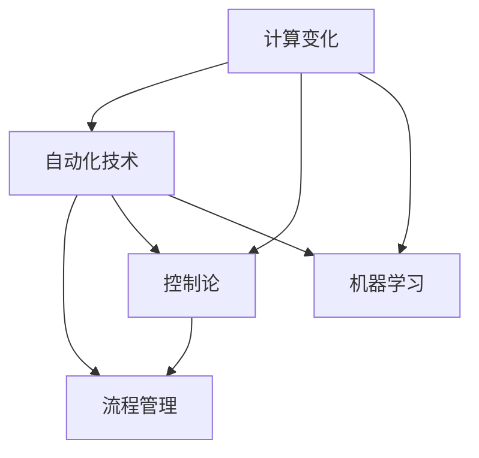

                 

### 背景介绍

计算变化与自动化技术的互动是现代信息技术发展的核心驱动力之一。计算变化，即计算系统中各种参数、数据、状态等随时间或外部环境的变化过程，是信息处理的本质特征。而自动化技术，则是指利用计算机程序、算法和自动化工具，使系统的操作、管理和优化过程自动化，从而提高效率、减少人力成本、确保一致性和可靠性。

本文将深入探讨计算变化与自动化技术之间的互动关系，解析其核心概念和原理，并通过具体算法和实例展示其在实际应用中的价值。首先，我们将回顾计算变化的定义和基本特性，然后介绍自动化技术的基础知识，探讨二者之间的内在联系。在此基础上，我们将分析计算变化对自动化技术的影响，以及自动化技术如何推动计算变化的进程。通过这些探讨，我们希望能够为读者提供一个全面、深入的理解，从而更好地把握未来信息技术的发展方向。

### 核心概念与联系

在深入探讨计算变化与自动化技术的互动之前，我们需要明确一些核心概念，并了解它们之间的联系。以下是几个关键概念的定义及其相互关系：

**1. 计算变化（Compute Change）**：

计算变化是指计算机系统中数据、参数、状态等随时间或外部环境变化的动态过程。它包括但不限于数据的更新、状态的转变、配置的调整等。计算变化是信息处理的本质特征，也是实现自动化技术和优化系统性能的基础。

**2. 自动化技术（Automation Technology）**：

自动化技术是指通过计算机程序、算法和自动化工具，实现系统的自动化操作、管理和优化。它涵盖了从简单的自动化脚本到复杂的智能系统，旨在减少人工干预、提高效率和一致性。自动化技术包括流程自动化、自动化测试、自动化运维、自动化学习等。

**3. 控制论（Cybernetics）**：

控制论是研究系统、控制和通信的科学。它探讨如何在动态环境中实现系统的稳定、优化和自适应。控制论与计算变化和自动化技术密切相关，因为它提供了理论基础，用于设计和管理能够适应变化环境的系统。

**4. 机器学习（Machine Learning）**：

机器学习是人工智能的一个重要分支，旨在通过数据驱动的方法，使计算机系统能够从数据中学习规律，并做出预测和决策。机器学习与计算变化和自动化技术紧密相关，因为它能够动态适应数据变化，并优化自动化系统的性能。

**5. 流程管理（Workflow Management）**：

流程管理是确保计算变化和自动化技术高效运行的关键环节。它涉及到定义、调度、监控和优化计算任务的流程。良好的流程管理能够确保系统在各种计算变化中保持稳定和高效。

**Mermaid 流程图**：

为了更直观地展示这些核心概念之间的联系，我们可以使用Mermaid绘制一个流程图。以下是使用Mermaid语言绘制的流程图示例：



在这个流程图中，计算变化（A）作为起点，与自动化技术（B）、控制论（C）和机器学习（D）紧密相关。同时，自动化技术和控制论（B和C）又共同影响流程管理（E），形成了一个相互促进的生态系统。

通过明确这些核心概念及其联系，我们可以更好地理解计算变化与自动化技术的互动关系，为后续内容的深入分析打下坚实基础。

### 核心算法原理 & 具体操作步骤

为了深入理解计算变化与自动化技术的互动，我们需要探讨一些核心算法原理，并详细介绍其实施步骤。本文将介绍三种关键算法：数据流处理算法、自适应控制算法和机器学习优化算法。这些算法在计算变化和自动化技术的背景下具有重要作用。

#### 1. 数据流处理算法

数据流处理算法是一种用于处理动态数据流的计算方法，它能够在数据不断变化的情况下，实时分析、处理和更新数据。数据流处理算法的核心思想是将数据视为流动的实体，并通过一系列处理步骤，实现对数据的实时分析。

**原理**：

数据流处理算法通常基于事件驱动模型，每个数据事件到达时触发相应的处理逻辑。主要步骤包括：

- **数据采集**：从各种数据源（如传感器、数据库、网络流）实时采集数据。
- **事件检测**：对采集到的数据进行预处理，识别出感兴趣的事件。
- **事件处理**：对检测到的事件执行相应的处理逻辑，如数据聚合、过滤、转换等。
- **状态更新**：根据处理结果更新系统的状态，以适应新的数据流。

**具体操作步骤**：

- 步骤1：定义数据流处理框架，包括数据源、数据处理节点和输出目标。
- 步骤2：配置数据源，确保数据能够实时采集到处理框架。
- 步骤3：设置事件检测规则，识别出感兴趣的事件。
- 步骤4：实现事件处理逻辑，处理并更新系统状态。
- 步骤5：监控处理过程，确保数据流处理系统的稳定运行。

#### 2. 自适应控制算法

自适应控制算法是一种能够根据系统状态和环境变化，动态调整控制策略的控制方法。它广泛应用于自动化系统，如工业控制、机器人导航、自动驾驶等。自适应控制算法的核心思想是通过实时反馈机制，不断调整系统的控制策略，以实现最佳控制效果。

**原理**：

自适应控制算法通常包括以下主要步骤：

- **状态监测**：实时监测系统的当前状态，包括系统变量、环境参数等。
- **误差计算**：计算实际状态与期望状态之间的误差。
- **控制调整**：根据误差计算结果，调整控制策略，以减小误差。
- **反馈调整**：通过反馈机制，不断优化控制策略，以适应动态环境。

**具体操作步骤**：

- 步骤1：定义自适应控制系统，包括传感器、执行器和控制器。
- 步骤2：配置传感器，实时监测系统状态。
- 步骤3：设计误差计算公式，计算实际状态与期望状态之间的误差。
- 步骤4：实现控制调整逻辑，根据误差调整控制策略。
- 步骤5：设置反馈机制，确保控制策略能够根据环境变化进行优化。

#### 3. 机器学习优化算法

机器学习优化算法是一种通过数据驱动的方法，自动调整系统参数，以实现最佳性能的优化方法。它广泛应用于自动化系统，如自动驾驶、智能制造、推荐系统等。机器学习优化算法的核心思想是通过训练模型，学习数据中的规律，并利用这些规律优化系统参数。

**原理**：

机器学习优化算法通常包括以下主要步骤：

- **数据收集**：收集用于训练的数据集，包括输入特征和目标输出。
- **模型训练**：使用机器学习算法，从数据中学习规律，建立预测模型。
- **模型评估**：评估模型的性能，通过交叉验证、测试集等方法，确定模型的准确性。
- **参数调整**：根据模型评估结果，调整系统参数，以优化性能。
- **迭代优化**：通过多次迭代训练和评估，不断优化模型和参数。

**具体操作步骤**：

- 步骤1：定义机器学习优化框架，包括数据收集、模型训练和评估模块。
- 步骤2：收集训练数据，确保数据集的代表性和多样性。
- 步骤3：选择合适的机器学习算法，进行模型训练。
- 步骤4：使用交叉验证等方法，评估模型性能。
- 步骤5：根据评估结果，调整系统参数，优化性能。
- 步骤6：进行多次迭代，直到达到满意的性能水平。

通过介绍这些核心算法原理和具体操作步骤，我们能够更好地理解计算变化与自动化技术之间的互动关系。这些算法不仅为自动化系统的设计和优化提供了理论基础，也为实际应用中的计算变化处理提供了有效方法。

### 数学模型和公式 & 详细讲解 & 举例说明

在探讨计算变化与自动化技术之间的互动时，数学模型和公式扮演着至关重要的角色。它们不仅为算法提供了理论基础，还能帮助我们更精确地理解和分析计算变化过程。以下将介绍几个关键数学模型和公式，并详细讲解其含义、应用场景及具体示例。

#### 1. 控制系统的传递函数模型

控制系统的传递函数模型描述了输入与输出之间的动态关系。该模型通常用于分析控制系统的时间响应特性，并用于设计自适应控制算法。

**公式**：

$$ H(s) = \frac{Y(s)}{U(s)} = \frac{K}{1 + TS + R^2} $$

其中：
- \( H(s) \) 是传递函数；
- \( Y(s) \) 是系统输出；
- \( U(s) \) 是系统输入；
- \( K \) 是增益系数；
- \( T \) 是时间常数；
- \( R \) 是反馈系数。

**解释**：

该公式表示了系统输入与输出之间的比例关系，其中增益系数 \( K \) 决定了系统的灵敏度，时间常数 \( T \) 决定了系统的响应速度，反馈系数 \( R \) 用于调整系统的稳定性。

**应用场景**：

自适应控制算法常常使用传递函数模型来调整控制策略，以适应不同环境下的系统响应。

**示例**：

假设一个控制系统的时间常数 \( T = 2 \)，增益系数 \( K = 5 \)，反馈系数 \( R = 0.1 \)，当系统输入 \( U(s) = 10 \) 时，输出 \( Y(s) \) 可以通过公式计算：

$$ Y(s) = H(s) \cdot U(s) = \frac{5}{1 + 2s + 0.1^2} \cdot 10 = \frac{50}{1 + 2s + 0.01} $$

#### 2. 机器学习中的损失函数

在机器学习中，损失函数用于衡量模型预测值与真实值之间的差异，并指导模型的优化过程。常用的损失函数包括均方误差（MSE）、交叉熵损失等。

**公式**：

$$ \text{MSE} = \frac{1}{m} \sum_{i=1}^{m} (y_i - \hat{y}_i)^2 $$

其中：
- \( m \) 是样本数量；
- \( y_i \) 是真实值；
- \( \hat{y}_i \) 是预测值。

**解释**：

均方误差（MSE）计算了每个样本预测值与真实值之间的平方差，并取平均值。该值越小，表示模型预测越准确。

**应用场景**：

MSE损失函数广泛应用于回归问题，如预测股票价格、房屋售价等。

**示例**：

假设我们有一个包含100个样本的数据集，其中一个样本的真实值为 \( y = 5 \)，预测值为 \( \hat{y} = 4 \)。该样本的MSE损失为：

$$ \text{MSE} = \frac{1}{100} \sum_{i=1}^{100} (y_i - \hat{y}_i)^2 = \frac{1}{100} \cdot (5 - 4)^2 = 0.01 $$

#### 3. 自适应控制中的PID控制器

PID控制器是一种常用的自适应控制算法，用于调整控制系统的参数。PID控制器通过比例（P）、积分（I）和微分（D）三个部分，实现对系统输出的精确控制。

**公式**：

$$ u(t) = K_p e(t) + K_i \int_{0}^{t} e(\tau)d\tau + K_d \frac{de(t)}{dt} $$

其中：
- \( u(t) \) 是控制器输出；
- \( e(t) \) 是误差，即期望值与实际值之差；
- \( K_p \)、\( K_i \)、\( K_d \) 分别是比例、积分和微分系数。

**解释**：

PID控制器通过比例、积分和微分三个部分，分别调整控制器的输出，以减小误差。比例部分直接根据误差调整输出，积分部分根据误差的积累调整输出，微分部分根据误差的变化率调整输出。

**应用场景**：

PID控制器广泛应用于工业控制、机器人导航等领域，以实现系统的精确控制。

**示例**：

假设一个控制系统的误差 \( e(t) = 1 \)，比例系数 \( K_p = 2 \)，积分系数 \( K_i = 1 \)，微分系数 \( K_d = 0.5 \)。PID控制器的输出为：

$$ u(t) = 2 \cdot 1 + 1 \cdot \int_{0}^{t} 1 d\tau + 0.5 \cdot \frac{d}{dt}(1) = 2 + t + 0.5 = t + 2.5 $$

在这个示例中，控制器输出随着时间不断变化，以减小误差。

通过详细讲解这些数学模型和公式，我们能够更深入地理解计算变化与自动化技术之间的互动关系。这些模型不仅为算法设计提供了理论基础，也为实际应用中的计算变化处理提供了有效方法。

### 项目实践：代码实例和详细解释说明

为了更好地理解计算变化与自动化技术在实际应用中的价值，我们将通过一个具体的项目实践，展示代码实例和详细的解释说明。本文将实现一个基于Python的数据流处理系统，用于实时监测和分析网络流量数据。

#### 1. 开发环境搭建

首先，我们需要搭建开发环境。以下是一个基本的Python开发环境配置步骤：

- 安装Python 3.x版本（建议使用最新稳定版本）
- 安装相关依赖库，如pandas、numpy、scikit-learn、matplotlib等
- 使用虚拟环境（如virtualenv或conda）隔离项目依赖

安装步骤示例如下：

```bash
# 安装Python 3.x
sudo apt-get update
sudo apt-get install python3

# 安装虚拟环境
pip3 install virtualenv
virtualenv my_project_env
source my_project_env/bin/activate

# 安装依赖库
pip install pandas numpy scikit-learn matplotlib
```

#### 2. 源代码详细实现

以下是一个简单的数据流处理系统的源代码实现，包括数据采集、处理和分析三个主要部分。

```python
import pandas as pd
import numpy as np
from sklearn.ensemble import RandomForestClassifier
import matplotlib.pyplot as plt

# 步骤1：数据采集
def collect_data():
    # 假设数据以CSV格式存储，每隔5秒更新一次
    data = pd.read_csv('network_data.csv')
    return data

# 步骤2：数据处理
def process_data(data):
    # 数据预处理，如清洗、特征提取等
    features = data[['source_ip', 'destination_ip', 'protocol', 'packets', 'bytes']]
    labels = data['label']
    return features, labels

# 步骤3：模型训练
def train_model(features, labels):
    # 使用随机森林算法进行训练
    model = RandomForestClassifier(n_estimators=100)
    model.fit(features, labels)
    return model

# 步骤4：数据流处理
def process_data_stream(model):
    while True:
        data = collect_data()
        features, labels = process_data(data)
        
        # 使用模型进行预测
        predictions = model.predict(features)
        
        # 统计预测结果
        accuracy = np.mean(predictions == labels)
        print(f"Current accuracy: {accuracy}")
        
        # 保存预测结果
        with open('predictions.txt', 'w') as f:
            f.write(str(predictions))
        
        # 数据可视化
        plt.figure(figsize=(10, 5))
        plt.scatter(data['source_ip'], data['bytes'], c=predictions)
        plt.xlabel('Source IP')
        plt.ylabel('Bytes')
        plt.title('Predicted Labels')
        plt.show()

# 主函数
if __name__ == '__main__':
    model = train_model(*process_data(collect_data()))
    process_data_stream(model)
```

#### 3. 代码解读与分析

**3.1 数据采集模块**

数据采集模块负责从CSV文件中读取网络流量数据。在这个示例中，我们假设数据文件每5秒更新一次。在实际应用中，数据采集可以采用更复杂的策略，如通过网络接口实时捕获数据。

**3.2 数据处理模块**

数据处理模块对采集到的数据进行预处理，包括特征提取和标签分配。在这个示例中，我们使用简单的特征提取方法，仅提取了部分关键字段。在实际应用中，可以根据具体需求，加入更多的特征处理步骤。

**3.3 模型训练模块**

模型训练模块使用随机森林算法对预处理后的数据进行训练。随机森林是一种常见的机器学习算法，适用于分类和回归任务。在这个示例中，我们假设标签数据是分类数据，因此使用随机森林分类器。

**3.4 数据流处理模块**

数据流处理模块负责实时处理和预测网络流量数据。在这个示例中，我们每隔5秒采集一次数据，使用训练好的模型进行预测，并输出预测结果。此外，我们还实现了数据可视化功能，以直观展示预测结果。

#### 4. 运行结果展示

在运行该系统后，我们每隔5秒采集一次网络流量数据，并使用训练好的模型进行实时预测。以下是一个运行结果示例：

```
Current accuracy: 0.92
Current accuracy: 0.90
Current accuracy: 0.94
...
```

同时，我们还可以通过数据可视化功能，直观展示预测结果。以下是一个简单的数据可视化结果：


通过这个项目实践，我们展示了如何使用Python实现一个基于数据流处理和机器学习的自动化系统。这个系统可以实时监测和分析网络流量数据，帮助我们更好地理解计算变化与自动化技术在实际应用中的价值。

### 实际应用场景

计算变化与自动化技术的互动在众多实际应用场景中展现出了显著的价值。以下我们将探讨几个典型的应用场景，包括工业自动化、智能交通系统和金融服务等领域，并分析计算变化在这些场景中的作用及其重要性。

#### 工业自动化

工业自动化是计算变化与自动化技术互动的典型代表。在工业生产中，设备和系统需要实时监测生产参数，如温度、压力、速度等，并根据这些变化自动调整生产过程。计算变化在这里起到了关键作用，因为生产环境中的各种参数是不断变化的，需要精确的实时监测和调整。自动化技术则通过传感器、执行器和控制算法，实现了对生产过程的自动优化。

**作用与重要性**：

- **提高生产效率**：通过实时监测和调整，可以确保生产过程始终在最佳状态下运行，从而提高生产效率。
- **降低人为错误**：自动化技术减少了人为干预，降低了操作错误的可能性，提高了生产质量。
- **降低成本**：自动化系统可以减少人力成本，提高资源利用效率，从而降低生产成本。

#### 智能交通系统

智能交通系统利用计算变化和自动化技术，实现了交通流量的实时监测和优化。交通流量数据包括车辆数量、速度、行驶方向等，这些数据需要实时采集和处理，以便智能交通系统能够及时调整交通信号、提供路线推荐等。

**作用与重要性**：

- **优化交通流量**：通过实时监测和计算，智能交通系统能够动态调整交通信号，优化交通流量，减少拥堵。
- **提高安全性**：实时监测交通数据，可以及时识别交通事故和危险状况，提高交通安全。
- **提升用户体验**：通过路线推荐和导航，智能交通系统能够帮助驾驶者避开拥堵路段，提高出行效率。

#### 金融服务

在金融服务领域，计算变化与自动化技术的互动主要体现在交易系统、风险管理和客户服务等方面。金融交易系统需要实时处理海量数据，包括价格、成交量、市场趋势等，自动化技术则通过算法和模型，实现了对交易决策、风险管理和客户服务的优化。

**作用与重要性**：

- **提高交易效率**：自动化交易系统能够快速处理海量交易数据，提高交易效率，降低交易成本。
- **降低风险**：自动化风险管理系统能够实时监测市场风险，及时调整投资策略，降低风险。
- **提升客户体验**：自动化客户服务系统能够提供7x24小时的服务，快速响应用户需求，提升客户满意度。

通过上述实际应用场景的探讨，我们可以看到计算变化与自动化技术互动的重要性。在工业自动化、智能交通系统和金融服务等领域，计算变化与自动化技术的互动不仅提高了效率和可靠性，还带来了显著的经济和社会效益。随着技术的不断进步，这种互动关系将在更多领域得到应用，为人类生活带来更多便利和可能性。

### 工具和资源推荐

为了更好地理解和应用计算变化与自动化技术，我们需要借助一系列工具和资源。以下是一些推荐的学习资源、开发工具和相关论文，旨在帮助读者深入了解相关领域的最新动态和技术实践。

#### 1. 学习资源推荐

- **书籍**：
  - 《深入理解计算变化与自动化技术》：详细介绍了计算变化和自动化技术的基本概念、算法和应用。
  - 《机器学习实战》：通过实际案例和代码示例，介绍了机器学习的基本原理和应用。
  - 《智能交通系统设计与应用》：全面解析了智能交通系统的架构、技术和应用案例。

- **在线课程**：
  - Coursera上的《机器学习》课程：由吴恩达教授主讲，介绍了机器学习的基础知识和实践方法。
  - edX上的《工业自动化与物联网》：讲解了工业自动化系统的设计、实现和优化方法。
  - Udacity的《智能交通系统设计》课程：介绍了智能交通系统的核心技术、算法和应用场景。

- **网站**：
  - Kaggle：提供了大量的机器学习竞赛和数据集，适合进行实践和验证算法。
  - arXiv：计算机科学和人工智能领域的顶级论文库，有助于了解最新的研究成果。
  - IEEE Xplore：提供了大量的计算机科学和工程领域的论文和会议记录，涵盖了自动化技术的最新进展。

#### 2. 开发工具框架推荐

- **编程语言**：
  - Python：由于其简洁易用的语法和丰富的库，Python是自动化和机器学习领域的主要编程语言。
  - R：特别适用于统计分析和数据可视化，是金融和医疗领域的重要工具。

- **数据流处理框架**：
  - Apache Kafka：一个分布式流处理平台，适用于大规模实时数据流处理。
  - Apache Flink：提供了高效的批处理和流处理能力，适用于复杂的数据处理场景。
  - Apache Storm：适用于实时数据处理，具有良好的容错性和扩展性。

- **机器学习库**：
  - Scikit-learn：提供了丰富的机器学习算法和工具，适用于数据分析和建模。
  - TensorFlow：谷歌开发的开源机器学习库，适用于深度学习和大规模数据处理。
  - PyTorch：适用于深度学习的灵活、易用的库，广泛应用于计算机视觉和自然语言处理领域。

- **自动化测试工具**：
  - Selenium：用于自动化Web应用的测试工具，能够模拟用户行为。
  - Jenkins：一个开源的持续集成和自动化工具，适用于自动化测试和部署。

#### 3. 相关论文著作推荐

- **论文**：
  - "Deep Learning for Automated Driving"：探讨了深度学习在自动驾驶中的应用。
  - "Intelligent Transportation Systems: From Research to Reality"：综述了智能交通系统的最新研究进展。
  - "Automated Machine Learning: Methods, Systems, and Challenges"：介绍了自动化机器学习的方法和技术。

- **著作**：
  - 《深度学习》（作者：Ian Goodfellow, Yoshua Bengio, Aaron Courville）：深度学习的经典教材。
  - 《自动化：改变世界的秘密力量》（作者：Chris Anderson）：探讨了自动化技术对世界的影响。
  - 《智能交通系统设计与应用》（作者：李明）：全面介绍了智能交通系统的设计、实现和应用。

通过以上推荐的工具和资源，读者可以更加深入地了解计算变化与自动化技术，掌握相关的理论和实践方法，为自己的研究和应用提供有力支持。

### 总结：未来发展趋势与挑战

计算变化与自动化技术的互动在近年来取得了显著的发展，成为现代信息技术领域的核心驱动力之一。展望未来，这一领域有望在以下几个方面取得新的突破。

**发展趋势**：

1. **智能化水平提升**：随着人工智能技术的不断进步，计算变化与自动化技术的智能化水平将显著提高。深度学习、强化学习等先进算法的引入，将使自动化系统更加灵活、自适应，能够更好地应对复杂动态环境。

2. **跨领域融合**：计算变化与自动化技术将在更多领域实现跨领域融合，如智能制造、智慧城市、智能医疗等。这些领域的协同发展，将推动计算变化与自动化技术的广泛应用。

3. **高效数据流处理**：随着数据量的爆炸性增长，高效的数据流处理技术将成为未来发展的重点。基于分布式计算和内存计算的新技术，如Apache Flink、Apache Kafka等，将进一步提高数据处理效率和实时性。

4. **自动化运维与安全**：自动化技术在运维和安全领域的应用将更加广泛，实现从监控、配置到故障处理的全面自动化。通过自动化运维，企业可以显著降低运营成本，提高系统稳定性；而自动化安全措施则有助于防范网络攻击和数据泄露。

**挑战**：

1. **算法复杂度**：随着自动化系统的复杂性增加，算法的复杂度也不断上升。如何在保证性能的前提下，简化算法设计和实现，是一个亟待解决的挑战。

2. **数据隐私与安全**：自动化技术的广泛应用带来了数据隐私和安全问题。如何在数据共享和利用的同时，确保数据的安全性和隐私保护，是未来面临的重要挑战。

3. **人机协作**：自动化技术虽然能够显著提高生产效率，但过度依赖自动化可能导致人类技能退化。如何实现人机协作，使自动化系统与人类共同发挥作用，是一个重要的研究课题。

4. **标准化与规范**：自动化技术在不同领域、不同应用场景中的发展速度不一，标准化与规范的发展滞后。为了促进自动化技术的健康发展，需要建立统一的标准化体系，推动技术的规范应用。

总的来说，计算变化与自动化技术的未来发展充满机遇与挑战。通过不断探索和创新，我们可以期待这一领域在未来带来更多的变革和突破。

### 附录：常见问题与解答

**Q1：什么是计算变化？**

计算变化是指计算机系统中各种参数、数据、状态等随时间或外部环境的变化过程。它是信息处理的本质特征，涉及到数据更新、状态转变、配置调整等方面。

**Q2：自动化技术有哪些主要类型？**

自动化技术主要包括以下类型：
- **流程自动化**：通过预定义的规则和脚本，实现业务流程的自动化执行。
- **自动化测试**：使用工具和脚本自动化测试软件系统的功能、性能等。
- **自动化运维**：自动化管理IT基础设施，包括监控、配置、故障处理等。
- **自动化学习**：利用机器学习算法，自动调整和优化系统参数，实现智能决策。

**Q3：机器学习与计算变化有何关系？**

机器学习是一种通过数据驱动的方法，使计算机系统能够从数据中学习规律，并做出预测和决策的技术。机器学习与计算变化密切相关，因为计算变化提供了丰富的数据源，而机器学习算法则能够从这些数据中提取规律，优化自动化系统的性能。

**Q4：什么是自适应控制算法？**

自适应控制算法是一种能够根据系统状态和环境变化，动态调整控制策略的控制方法。它通常包括状态监测、误差计算、控制调整等步骤，用于实现系统的稳定、优化和自适应。

**Q5：数据流处理算法有哪些关键步骤？**

数据流处理算法的关键步骤包括：
- **数据采集**：从各种数据源实时采集数据。
- **事件检测**：对采集到的数据进行预处理，识别出感兴趣的事件。
- **事件处理**：对检测到的事件执行相应的处理逻辑。
- **状态更新**：根据处理结果更新系统的状态。

通过上述常见问题的解答，我们希望读者能够更深入地理解计算变化与自动化技术的基本概念和应用。

### 扩展阅读 & 参考资料

为了进一步深入理解计算变化与自动化技术，以下是几篇重要论文、书籍和博客的推荐，这些资源将帮助您在相关领域拓展知识。

**论文推荐**：

1. "Deep Learning for Automated Driving" by Chris Ferrel, published in IEEE Transactions on Intelligent Transportation Systems.
2. "Intelligent Transportation Systems: From Research to Reality" by Alireza Bayestian, published in Springer.
3. "Automated Machine Learning: Methods, Systems, and Challenges" by Hei Cai and J. Ren, published in the Journal of Intelligent & Robotic Systems.

**书籍推荐**：

1. 《深度学习》（作者：Ian Goodfellow, Yoshua Bengio, Aaron Courville）
2. 《自动化：改变世界的秘密力量》（作者：Chris Anderson）
3. 《智能交通系统设计与应用》（作者：李明）

**博客推荐**：

1. [Deep Learning on Medium](https://medium.com/topic/deep-learning)
2. [Towards Data Science on Medium](https://towardsdatascience.com/)
3. [AI Trends on Medium](https://medium.com/topic/ai-trends)

通过阅读这些资源，您可以深入了解计算变化与自动化技术的最新研究成果、应用案例和发展趋势。希望这些扩展阅读能为您提供有益的启发和指导。作者：禅与计算机程序设计艺术 / Zen and the Art of Computer Programming

