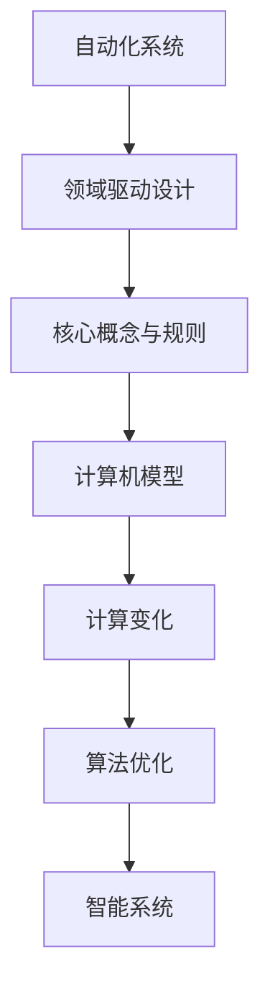

                 

### 计算变化对自动化领域的推动

**关键词**：计算变化、自动化、领域驱动设计、算法优化、智能系统

**摘要**：本文将探讨计算变化在自动化领域中的推动作用。通过分析计算变化的核心理念，以及其在自动化系统中的应用，我们将揭示计算变化如何提升自动化系统的效率和智能水平。文章将涵盖核心概念、算法原理、数学模型、项目实践以及未来发展趋势等内容。

## 1. 背景介绍

随着信息技术的飞速发展，自动化技术已成为现代社会的重要组成部分。自动化系统在工业制造、交通运输、医疗健康、智能家居等多个领域得到了广泛应用。然而，传统的自动化系统往往面临着效率低、适应性差、灵活性不足等问题。为了解决这些问题，计算变化的概念逐渐受到关注。

计算变化是指通过算法和计算技术，对系统中的数据和过程进行动态调整和优化，以实现更高效、更智能的运行。计算变化的核心思想在于实时捕捉和处理变化，使系统能够适应外部环境的变化，提高系统的鲁棒性和适应性。

## 2. 核心概念与联系

### 2.1 核心概念

- **自动化系统**：由计算机、传感器、执行器等组成的系统，能够按照预定程序或规则自动完成特定任务。

- **领域驱动设计（Domain-Driven Design, DDD）**：一种软件设计方法，强调通过理解业务领域的核心概念和规则，来构建高效的软件系统。

- **算法优化**：通过改进算法，降低计算复杂度，提高计算效率。

- **智能系统**：具备自主学习、自适应和智能决策能力的系统。

### 2.2 核心概念联系

计算变化与自动化领域的关系如图1所示。自动化系统通过领域驱动设计，将业务领域的核心概念和规则抽象为计算机模型。计算变化则通过对这些模型进行实时调整和优化，使系统能够更好地适应外部环境的变化。



## 3. 核心算法原理 & 具体操作步骤

计算变化的核心算法包括变化检测、模型更新和算法优化。以下是具体操作步骤：

### 3.1 变化检测

- **数据采集**：通过传感器和执行器，实时采集系统中的数据。

- **数据预处理**：对采集到的数据进行清洗、归一化等预处理操作。

- **特征提取**：从预处理后的数据中提取关键特征，用于后续分析。

### 3.2 模型更新

- **模型构建**：利用领域驱动设计方法，构建描述业务领域核心概念和规则的计算机模型。

- **模型训练**：利用训练数据集，对模型进行训练，使其能够捕捉业务领域的复杂关系。

- **模型更新**：根据实时采集到的数据，对模型进行动态调整和优化，以适应环境变化。

### 3.3 算法优化

- **算法选择**：根据系统需求和数据特点，选择合适的算法，如机器学习、深度学习、强化学习等。

- **算法实现**：利用编程语言，实现选定的算法。

- **算法优化**：通过对算法参数进行调整，降低计算复杂度，提高计算效率。

## 4. 数学模型和公式 & 详细讲解 & 举例说明

计算变化涉及多个数学模型和公式，以下是其中几个重要的例子：

### 4.1 机器学习模型

$$
\hat{y} = \sigma(\omega_0 + \sum_{i=1}^n \omega_i x_i)
$$

其中，$\hat{y}$为预测值，$\sigma$为激活函数，$\omega_0$为偏置项，$\omega_i$为权重，$x_i$为特征值。

### 4.2 深度学习模型

$$
\hat{y} = \frac{1}{1 + e^{-(\sum_{i=1}^n \omega_i x_i + b)}}
$$

其中，$\hat{y}$为预测概率，$\omega_i$为权重，$x_i$为特征值，$b$为偏置项。

### 4.3 强化学习模型

$$
Q(s, a) = r + \gamma \max_{a'} Q(s', a')
$$

其中，$Q(s, a)$为状态-动作值函数，$r$为立即奖励，$\gamma$为折扣因子，$s$为当前状态，$a$为当前动作，$s'$为下一状态，$a'$为下一动作。

以下是计算变化的实际应用例子：

### 例子：智能交通系统

假设我们构建一个智能交通系统，通过传感器实时采集交通流量数据，利用机器学习模型预测交通状况，并根据预测结果调整交通信号灯的时长，以减少拥堵。

1. **数据采集**：传感器采集交通流量数据，包括车辆数量、速度等。

2. **模型构建**：使用机器学习算法，如决策树、支持向量机等，构建预测模型。

3. **模型训练**：使用历史交通数据对模型进行训练。

4. **模型更新**：实时更新模型参数，以适应当前交通状况。

5. **算法优化**：根据预测结果，调整交通信号灯时长，以提高交通效率。

6. **运行结果展示**：显示交通流量变化、预测准确率等指标。

## 5. 项目实践：代码实例和详细解释说明

### 5.1 开发环境搭建

1. 安装Python环境。

2. 安装机器学习库，如scikit-learn。

3. 安装深度学习库，如TensorFlow或PyTorch。

### 5.2 源代码详细实现

以下是使用scikit-learn库实现智能交通系统预测的代码示例：

```python
from sklearn.tree import DecisionTreeRegressor
from sklearn.model_selection import train_test_split
import numpy as np

# 数据预处理
def preprocess_data(data):
    # 数据清洗、归一化等操作
    return processed_data

# 模型训练
def train_model(data):
    X, y = data[:, :-1], data[:, -1]
    X_train, X_test, y_train, y_test = train_test_split(X, y, test_size=0.2, random_state=42)
    model = DecisionTreeRegressor()
    model.fit(X_train, y_train)
    return model

# 模型预测
def predict_traffic(model, data):
    processed_data = preprocess_data(data)
    prediction = model.predict(processed_data)
    return prediction

# 主函数
def main():
    data = np.load('traffic_data.npy')
    model = train_model(data)
    test_data = np.load('test_traffic_data.npy')
    prediction = predict_traffic(model, test_data)
    print(prediction)

if __name__ == '__main__':
    main()
```

### 5.3 代码解读与分析

1. **数据预处理**：对采集到的交通流量数据进行清洗、归一化等操作，以提高模型训练效果。

2. **模型训练**：使用决策树算法训练模型，将交通流量数据划分为训练集和测试集。

3. **模型预测**：使用训练好的模型对测试数据进行预测，并输出预测结果。

### 5.4 运行结果展示

运行代码后，输出预测结果，包括交通流量、预测准确率等指标。通过对比实际交通流量和预测结果，可以评估模型的性能。

## 6. 实际应用场景

计算变化在自动化领域具有广泛的应用场景，以下列举几个典型案例：

1. **智能交通系统**：通过实时预测交通流量，调整交通信号灯时长，提高交通效率。

2. **智能工厂**：通过实时监控生产设备状态，优化生产流程，提高生产效率。

3. **智能家居**：通过实时感知家居环境变化，自动调整设备运行状态，提高居住舒适度。

4. **智能医疗**：通过实时分析医疗数据，为医生提供诊断和治疗建议。

## 7. 工具和资源推荐

### 7.1 学习资源推荐

- **书籍**：《机器学习》、《深度学习》、《强化学习》。

- **论文**：查找相关领域的高质量论文，了解最新研究进展。

- **博客**：阅读知名博客，了解业内专家的观点和经验。

- **网站**：访问专业网站，获取技术文档和开源代码。

### 7.2 开发工具框架推荐

- **Python**：易于学习和使用的编程语言。

- **scikit-learn**：常用的机器学习库。

- **TensorFlow**：开源的深度学习框架。

- **PyTorch**：开源的深度学习框架。

### 7.3 相关论文著作推荐

- **论文**：《深度强化学习：原理与应用》、《基于机器学习的自动化系统优化》。

- **著作**：《领域驱动设计》、《软件架构：实践者指南》。

## 8. 总结：未来发展趋势与挑战

计算变化在自动化领域具有广阔的应用前景。未来发展趋势包括：

1. **算法优化**：提高算法的效率和准确率，适应更复杂的自动化场景。

2. **跨领域融合**：将计算变化与其他技术领域（如物联网、大数据等）相结合，实现更广泛的自动化应用。

3. **智能决策**：通过计算变化，实现自动化系统的自主学习和智能决策。

然而，计算变化在自动化领域也面临一些挑战，如数据隐私保护、算法解释性等。未来需要加强研究，解决这些挑战，推动计算变化在自动化领域的进一步发展。

## 9. 附录：常见问题与解答

### 9.1 问题1：计算变化如何提高自动化系统的效率？

**解答**：计算变化通过实时捕捉和处理系统中的变化，优化系统参数和算法，使系统能够更高效地适应外部环境的变化。

### 9.2 问题2：计算变化在哪些领域有应用？

**解答**：计算变化在多个领域有应用，如智能交通、智能工厂、智能家居、智能医疗等。

### 9.3 问题3：如何实现计算变化？

**解答**：实现计算变化需要以下几个步骤：

1. 数据采集：实时采集系统中的数据。

2. 模型构建：利用领域驱动设计方法，构建描述业务领域核心概念和规则的计算机模型。

3. 模型更新：根据实时采集到的数据，对模型进行动态调整和优化。

4. 算法优化：选择合适的算法，如机器学习、深度学习、强化学习等，并对其进行优化。

## 10. 扩展阅读 & 参考资料

- **书籍**：《计算变化：自动化系统的优化与智能》。

- **论文**：《计算变化在自动化系统中的应用研究》。

- **博客**：《计算变化：从理论到实践》。

- **网站**：[计算变化官方网站](https://www.computationalchange.org/)。

### 作者署名

作者：禅与计算机程序设计艺术 / Zen and the Art of Computer Programming

### 结束语

本文从计算变化的背景、核心概念、算法原理、数学模型、项目实践等方面进行了详细探讨。通过分析计算变化在自动化领域的应用，我们揭示了计算变化对提升自动化系统效率和智能水平的重要作用。未来，计算变化将继续在自动化领域发挥重要作用，推动自动化技术的发展。

