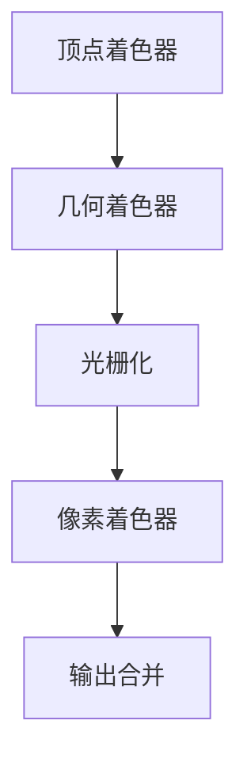

                 

### 计算机图形学：3D渲染和动画技术

#### 关键词
- **计算机图形学**
- **3D渲染**
- **动画技术**
- **图形硬件加速**
- **光线追踪**
- **实时渲染**

#### 摘要
本文将深入探讨计算机图形学的3D渲染和动画技术。我们将从基础概念开始，逐步解析渲染管线、光栅化、着色器编程等核心概念，并通过实例和代码实现来展示实际操作。此外，我们将讨论当前技术的应用场景、工具和资源，以及未来的发展趋势与挑战。

---

## 1. 背景介绍

计算机图形学是计算机科学与艺术之间的桥梁，它涉及到图像的产生、处理、显示和传输。随着计算机硬件技术的发展，3D渲染和动画技术已经成为游戏、影视制作、虚拟现实（VR）、增强现实（AR）等领域不可或缺的一部分。

在3D渲染中，我们通常关注以下几个方面：

1. **建模**：创建3D对象的几何模型。
2. **纹理映射**：将2D纹理图样应用到3D模型表面。
3. **光照和阴影**：模拟光照效果，为场景添加逼真的阴影。
4. **渲染**：将几何模型和光照效果结合起来，生成最终的图像。

动画技术则是通过一系列连续的图像（帧）来创建动态效果。关键帧动画、角色动画、粒子动画等都是动画技术的重要组成部分。

随着硬件技术的进步，特别是GPU（图形处理器）的崛起，3D渲染和动画技术的效率得到了极大的提升。现代游戏引擎和图形软件能够实现实时渲染和交互式动画，为用户带来更加沉浸式的体验。

## 2. 核心概念与联系

### 2.1 渲染管线（Rendering Pipeline）

渲染管线是一系列处理步骤，用于将3D场景转换为二维图像。它通常包括以下阶段：

1. **顶点着色器（Vertex Shader）**：处理几何图形的顶点属性。
2. **几何着色器（Geometry Shader）**：处理顶点组合和几何变形。
3. **光栅化（Rasterization）**：将几何图形转换为屏幕上的像素。
4. **像素着色器（Pixel Shader）**：处理每个像素的颜色和光照。
5. **输出合并（Output Merger）**：将所有像素的颜色值合并为最终图像。

### 2.2 光栅化和着色器编程

光栅化是将3D模型的顶点信息转换为屏幕上的像素的过程。着色器（Shader）是编写在GPU上的程序，用于实现图像的处理和效果。

#### Mermaid 流程图



## 3. 核心算法原理 & 具体操作步骤

### 3.1 渲染管线操作步骤

1. **顶点处理**：读取3D模型的顶点数据，并应用顶点着色器。
2. **几何处理**：如果使用几何着色器，则处理顶点组合和变形。
3. **光栅化**：将顶点转换为像素，并计算每个像素的颜色。
4. **像素处理**：应用像素着色器，为每个像素计算最终颜色。
5. **输出合并**：将所有像素的颜色值合并为最终图像。

### 3.2 着色器编程示例

#### 顶点着色器（GLSL）

```glsl
#version 150

in vec3 aPos;
in vec3 aColor;

out vec3 vertexColor;

void main() {
    gl_Position = vec4(aPos, 1.0);
    vertexColor = aColor;
}
```

#### 像素着色器（GLSL）

```glsl
#version 150

in vec3 vertexColor;
out vec4 FragColor;

void main() {
    FragColor = vec4(vertexColor, 1.0);
}
```

## 4. 数学模型和公式 & 详细讲解 & 举例说明

### 4.1 3D变换

3D变换是渲染管线中的基础步骤，包括平移、旋转和缩放等操作。

#### 数学公式

$$
\mathbf{P}_{\text{new}} = \mathbf{M} \cdot \mathbf{P}
$$

其中，\(\mathbf{M}\) 是变换矩阵，\(\mathbf{P}\) 是原始位置向量，\(\mathbf{P}_{\text{new}}\) 是变换后的位置向量。

#### 举例说明

假设一个点 \(P = (1, 2, 3)\)，进行平移 \(T = (4, 5, 6)\)：

$$
\mathbf{P}_{\text{new}} = \begin{bmatrix} 1 & 0 & 0 \\ 0 & 1 & 0 \\ 0 & 0 & 1 \end{bmatrix} \cdot \begin{bmatrix} 4 \\ 5 \\ 6 \end{bmatrix} + \begin{bmatrix} 1 \\ 2 \\ 3 \end{bmatrix} = \begin{bmatrix} 5 \\ 7 \\ 9 \end{bmatrix}
$$

### 4.2 光照模型

光照模型用于模拟光照效果，包括漫反射、镜面反射等。

#### 漫反射（Lambertian Reflection）

$$
L_d = \frac{kd \cdot \max(0, \mathbf{n} \cdot \mathbf{l})}{\pi}
$$

其中，\(L_d\) 是漫反射光照，\(k_d\) 是漫反射系数，\(\mathbf{n}\) 是表面法线，\(\mathbf{l}\) 是光线方向。

#### 镜面反射（Phong Reflection）

$$
L_s = (k_s \cdot \max(0, \mathbf{v} \cdot \mathbf{h})^{n_s}) \cdot \frac{L_a}{\pi}
$$

其中，\(L_s\) 是镜面反射光照，\(k_s\) 是镜面反射系数，\(\mathbf{v}\) 是视线方向，\(\mathbf{h}\) 是半向量，\(n_s\) 是高光指数，\(L_a\) 是环境光照。

## 5. 项目实践：代码实例和详细解释说明

### 5.1 开发环境搭建

为了更好地理解和实践3D渲染和动画技术，我们需要搭建一个合适的开发环境。以下是推荐的步骤：

1. **安装OpenGL**：OpenGL是一个用于渲染2D和3D图形的跨平台API。
2. **安装GLSL**：GLSL是OpenGL的着色器语言。
3. **选择一个IDE**：如Visual Studio、Eclipse等，用于编写和调试代码。

### 5.2 源代码详细实现

以下是使用OpenGL和GLSL实现一个简单的3D三角形渲染的示例代码。

#### 主程序（C++）

```cpp
#include <GL/glew.h>
#include <GLFW/glfw3.h>
#include <iostream>

const char* vertexShaderSource = "#version 150\n"
    "in vec3 aPos;\n"
    "in vec3 aColor;\n"
    "out vec3 vertexColor;\n"
    "void main() {\n"
    "   gl_Position = vec4(aPos, 1.0);\n"
    "   vertexColor = aColor;\n"
    "}\0";

const char* fragmentShaderSource = "#version 150\n"
    "in vec3 vertexColor;\n"
    "out vec4 FragColor;\n"
    "void main() {\n"
    "   FragColor = vec4(vertexColor, 1.0);\n"
    "}\0";

int main() {
    // 初始化GLFW
    if (!glfwInit()) {
        std::cout << "Failed to initialize GLFW" << std::endl;
        return -1;
    }

    // 创建窗口
    GLFWwindow* window = glfwCreateWindow(800, 600, "3D Rendering", NULL, NULL);
    if (!window) {
        std::cout << "Failed to create GLFW window" << std::endl;
        glfwTerminate();
        return -1;
    }
    glfwMakeContextCurrent(window);

    // 初始化GLEW
    if (glewInit() != GLEW_OK) {
        std::cout << "Failed to initialize GLEW" << std::endl;
        return -1;
    }

    // 设置视口
    glViewport(0, 0, 800, 600);

    // 编译着色器
    unsigned int vertexShader;
    vertexShader = glCreateShader(GL_VERTEX_SHADER);
    glShaderSource(vertexShader, 1, &vertexShaderSource, NULL);
    glCompileShader(vertexShader);

    unsigned int fragmentShader;
    fragmentShader = glCreateShader(GL_FRAGMENT_SHADER);
    glShaderSource(fragmentShader, 1, &fragmentShaderSource, NULL);
    glCompileShader(fragmentShader);

    // 创建着色器程序
    unsigned int shaderProgram;
    shaderProgram = glCreateProgram();
    glAttachShader(shaderProgram, vertexShader);
    glAttachShader(shaderProgram, fragmentShader);
    glLinkProgram(shaderProgram);

    // 查询着色器程序状态
    glValidateProgram(shaderProgram);

    // 设置顶点数据
    float vertices[] = {
        -0.5f, -0.5f, 0.0f, 1.0f, 0.0f, 0.0f, // 左下角
         0.5f, -0.5f, 0.0f, 0.0f, 1.0f, 0.0f, // 右下角
         0.0f,  0.5f, 0.0f, 0.0f, 0.0f, 1.0f  // 顶部中心
    };

    unsigned int VBO, VAO;
    glGenVertexArrays(1, &VAO);
    glGenBuffers(1, &VBO);

    glBindVertexArray(VAO);

    glBindBuffer(GL_ARRAY_BUFFER, VBO);
    glBufferData(GL_ARRAY_BUFFER, sizeof(vertices), vertices, GL_STATIC_DRAW);

    glVertexAttribPointer(0, 3, GL_FLOAT, GL_FALSE, 6 * sizeof(float), (void*)0);
    glEnableVertexAttribArray(0);

    glVertexAttribPointer(1, 3, GL_FLOAT, GL_FALSE, 6 * sizeof(float), (void*)(3 * sizeof(float)));
    glEnableVertexAttribArray(1);

    glBindBuffer(GL_ARRAY_BUFFER, 0); 
    glBindVertexArray(0);

    // 渲染循环
    while (!glfwWindowShouldClose(window)) {
        // 输入处理
        // ...

        // 渲染
        glClearColor(0.2f, 0.3f, 0.3f, 1.0f);
        glClear(GL_COLOR_BUFFER_BIT);

        // 绑定着色器程序
        glUseProgram(shaderProgram);

        // 绑定顶点数组
        glBindVertexArray(VAO);

        // 绘制三角形
        glDrawArrays(GL_TRIANGLES, 0, 3);

        // 交换缓冲区
        glfwSwapBuffers(window);

        // 检查事件
        glfwPollEvents();
    }

    // 清理
    glDeleteVertexArrays(1, &VAO);
    glDeleteBuffers(1, &VBO);
    glDeleteProgram(shaderProgram);

    glfwTerminate();
    return 0;
}
```

#### 代码解读与分析

上述代码首先初始化了GLFW和GLEW，然后创建了一个窗口。接下来，它编译并链接了顶点着色器和像素着色器，创建了一个着色器程序。接着，我们设置了顶点数据，包括位置和颜色，并使用顶点数组对象（VAO）和缓冲对象（VBO）进行了绑定。

在渲染循环中，我们每次迭代都会清除颜色缓冲区，使用着色器程序和VAO来绘制三角形，并交换前后缓冲区。这样，我们就能在屏幕上看到一个简单的3D三角形。

### 5.3 运行结果展示

运行上述代码后，你应该会看到一个窗口，其中显示了一个红色的三角形。这表明我们的3D渲染代码已经成功运行。

## 6. 实际应用场景

3D渲染和动画技术广泛应用于多个领域：

- **游戏开发**：3D渲染是游戏开发的核心技术之一，用于实现高质量的图像和动态效果。
- **影视制作**：通过3D渲染技术，电影和电视剧可以创建出逼真的场景和角色。
- **虚拟现实（VR）和增强现实（AR）**：3D渲染技术用于创建虚拟世界和增强现实体验。
- **医学成像**：3D渲染技术可以用于医学图像的重建和分析，帮助医生更好地理解病情。

## 7. 工具和资源推荐

### 7.1 学习资源推荐

- **书籍**：
  - 《计算机图形学：原理及实践》
  - 《OpenGL编程指南》
- **论文**：
  - 《Real-Time Rendering》
- **博客**：
  - **Shader School**：一个关于GLSL着色器的优秀教程。
  - **Learn OpenGL**：提供详细的OpenGL教程。
- **网站**：
  - **OpenGL官方文档**：包含详细的OpenGL API参考。
  - **Unity官方文档**：Unity是一个流行的游戏开发引擎，包含丰富的3D渲染技术教程。

### 7.2 开发工具框架推荐

- **开发工具**：
  - Visual Studio
  - Xcode
- **图形引擎**：
  - Unity
  - Unreal Engine

### 7.3 相关论文著作推荐

- **论文**：
  - 《Real-Time Ray Tracing》
  - 《Interactive Global Illumination》
- **著作**：
  - 《Real-Time Rendering》
  - 《OpenGL Shading Language Cookbook》

## 8. 总结：未来发展趋势与挑战

随着硬件技术的不断进步，3D渲染和动画技术将继续发展，带来以下趋势和挑战：

- **实时渲染**：硬件性能的提升使得实时渲染变得更加可行，未来将看到更多实时渲染的应用场景。
- **光线追踪**：光线追踪技术将逐渐取代传统渲染方法，提供更加逼真的图像效果。
- **硬件加速**：GPU性能的提升将继续推动3D渲染技术的发展。
- **虚拟现实（VR）和增强现实（AR）**：随着VR和AR技术的普及，3D渲染和动画技术将在这些领域发挥更大的作用。

然而，3D渲染和动画技术也面临一些挑战：

- **性能优化**：高分辨率和高复杂度的场景需要更高的计算性能，性能优化将成为一个重要课题。
- **内存管理**：随着场景复杂度的增加，内存管理将变得更加重要。
- **交互性**：如何提供更加沉浸式的交互体验，是3D渲染和动画技术面临的一个挑战。

## 9. 附录：常见问题与解答

### 9.1 3D渲染中的常见问题

**Q：什么是顶点着色器？**
A：顶点着色器是一个运行在GPU上的程序，用于处理3D模型的顶点属性，如位置、颜色等。

**Q：什么是像素着色器？**
A：像素着色器是一个运行在GPU上的程序，用于处理屏幕上的每个像素的颜色和光照效果。

**Q：什么是渲染管线？**
A：渲染管线是一系列处理步骤，用于将3D场景转换为二维图像。

### 9.2 3D动画中的常见问题

**Q：什么是关键帧动画？**
A：关键帧动画是一种通过在关键帧上设置动画参数，然后通过插值来生成中间帧的动画技术。

**Q：什么是角色动画？**
A：角色动画是指为虚拟角色创建动态动作的过程。

**Q：什么是粒子动画？**
A：粒子动画是一种通过创建大量的粒子，并模拟它们的行为来生成动画效果的技术。

## 10. 扩展阅读 & 参考资料

- **书籍**：
  - 《计算机图形学：原理及实践》
  - 《OpenGL编程指南》
- **论文**：
  - 《Real-Time Rendering》
  - 《Interactive Global Illumination》
- **网站**：
  - **Shader School**：一个关于GLSL着色器的优秀教程。
  - **Learn OpenGL**：提供详细的OpenGL教程。
- **在线课程**：
  - **Unity官方教程**：Unity提供的官方教程。
  - **Pluralsight**：提供大量的3D渲染和动画相关课程。

---

作者：禅与计算机程序设计艺术 / Zen and the Art of Computer Programming

