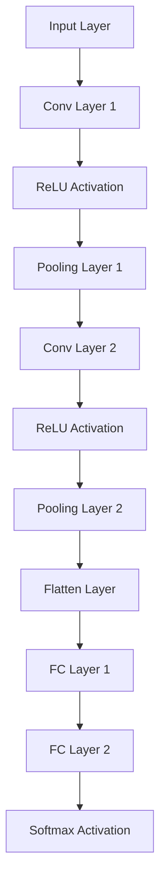

                 

### 背景介绍

计算机视觉作为人工智能的一个重要分支，其目标是通过计算机对图像或视频数据进行处理和分析，从中提取有用的信息。随着计算机硬件性能的提升、算法的进步以及大数据技术的发展，计算机视觉在诸多领域都展现出了广泛的应用前景。

从历史发展来看，计算机视觉的研究可以追溯到20世纪60年代。早期的研究主要集中在图像处理和模式识别上，主要目的是对图像进行基本操作，如灰度变换、边缘检测等。随着深度学习技术的出现，计算机视觉领域迎来了一个崭新的时代。深度学习模型，尤其是卷积神经网络（CNN），在图像分类、目标检测、人脸识别等方面取得了显著的效果。

当前，计算机视觉的应用场景已经非常广泛。例如，在医疗领域，计算机视觉技术可以用于疾病诊断、医学图像分析等；在自动驾驶领域，计算机视觉用于道路场景理解、障碍物检测等；在智能家居领域，计算机视觉用于人脸识别、行为分析等。随着技术的不断进步，计算机视觉的应用前景将会更加广阔。

本文旨在通过详细讲解计算机视觉的基本原理和代码实例，帮助读者深入理解这一领域。文章将首先介绍计算机视觉的核心概念和基本算法，然后通过具体的项目实践，展示如何将理论知识应用到实际项目中。

在接下来的章节中，我们将逐步分析计算机视觉的核心概念与联系，深入探讨核心算法原理和操作步骤，详细讲解数学模型和公式，并通过代码实例进行详细解释和分析。此外，文章还将探讨计算机视觉在实际应用场景中的实践案例，推荐相关工具和资源，以及总结未来发展趋势和挑战。

### 核心概念与联系

在深入探讨计算机视觉的基本原理和算法之前，首先需要明确几个核心概念，并理解它们之间的联系。以下是计算机视觉中一些关键概念的定义及其相互关系：

#### 图像处理（Image Processing）

图像处理是计算机视觉的基础，旨在通过算法对图像进行增强、滤波、分割等操作，从而提取出有用的信息。图像处理的常见技术包括：

- **滤波**：用于去除图像中的噪声，如高斯滤波、中值滤波等。
- **边缘检测**：用于检测图像中的边缘，常用的算法有Canny边缘检测。
- **图像分割**：将图像分割成多个区域，常用的算法有阈值分割、区域生长等。

#### 模式识别（Pattern Recognition）

模式识别是一种通过算法从数据中提取有用信息的技术，广泛应用于图像、语音、文本等领域。在计算机视觉中，模式识别主要用于图像分类、目标检测等任务。常见的模式识别算法包括：

- **支持向量机（SVM）**：一种分类算法，通过寻找最佳分隔超平面进行分类。
- **决策树（Decision Tree）**：一种基于特征值进行分类的树形结构，易于理解和解释。

#### 卷积神经网络（Convolutional Neural Networks, CNN）

卷积神经网络是计算机视觉领域的核心算法，特别适用于图像处理任务。CNN通过卷积层、池化层和全连接层的组合，能够自动提取图像中的特征。以下是CNN的基本架构：

1. **卷积层（Convolutional Layer）**：通过卷积操作提取图像的特征。
2. **池化层（Pooling Layer）**：用于降低图像维度，保留最重要的特征。
3. **全连接层（Fully Connected Layer）**：将卷积层提取的特征映射到具体的分类结果。

#### 深度学习（Deep Learning）

深度学习是一种通过多层神经网络进行学习的算法，能够在大量数据上进行自动特征提取和分类。深度学习是CNN的理论基础，它在计算机视觉领域的应用极大地推动了该领域的发展。

#### 计算机视觉的应用领域

计算机视觉的应用领域非常广泛，包括但不限于：

- **图像分类**：将图像分类到不同的类别，如猫、狗、飞机等。
- **目标检测**：在图像中识别并定位多个目标，如车辆、行人等。
- **人脸识别**：通过人脸图像识别身份。
- **姿态估计**：估计人体在图像中的姿态。
- **图像分割**：将图像分割成多个区域，用于目标检测、医学图像分析等。

#### 关系总结

通过上述介绍，我们可以看出各个核心概念之间的联系：

- **图像处理**和**模式识别**提供了对图像进行初步分析和分类的基础技术。
- **卷积神经网络（CNN）**和**深度学习**则利用这些基础技术，通过多层神经网络自动提取图像特征，进行复杂的图像分析和分类任务。
- **计算机视觉的应用领域**则展示了这些技术在实际生活中的应用场景。

以下是一个使用Mermaid绘制的流程图，展示了这些核心概念和它们之间的相互关系：

```mermaid
graph TB

A[图像处理] --> B[模式识别]
B --> C[卷积神经网络(CNN)]
C --> D[深度学习]
D --> E[图像分类]
D --> F[目标检测]
D --> G[人脸识别]
D --> H[姿态估计]
D --> I[图像分割]
A --> J[图像增强]
A --> K[图像滤波]
K --> B
```

这个流程图清晰地展示了计算机视觉中的核心概念及其相互关系，为后续的详细讨论奠定了基础。

### 核心算法原理 & 具体操作步骤

在理解了计算机视觉的核心概念和联系之后，接下来我们将深入探讨计算机视觉中的核心算法，包括卷积神经网络（CNN）的工作原理和具体操作步骤。卷积神经网络是目前计算机视觉领域最有效的算法之一，其强大的特征提取和分类能力使得它在图像分类、目标检测和人脸识别等方面取得了显著的成果。

#### 卷积神经网络（CNN）的工作原理

卷积神经网络是一种深度学习模型，其设计灵感来源于人类视觉系统的结构和工作方式。CNN的核心思想是利用卷积操作和池化操作自动从输入图像中提取特征，并通过全连接层进行分类。以下是CNN的主要组成部分：

1. **卷积层（Convolutional Layer）**：卷积层是CNN的基础，通过卷积操作提取图像的特征。卷积操作的基本思想是使用一组滤波器（也称为卷积核）在输入图像上进行滑动，计算每个位置上的特征响应。这些特征响应组合起来形成特征图（feature map）。

2. **激活函数（Activation Function）**：为了增加网络的非线性特性，卷积层后通常会添加激活函数，如ReLU（Rectified Linear Unit）。ReLU函数将输入值大于零的部分映射为自身，小于零的部分映射为零，从而引入了非线性的特性。

3. **池化层（Pooling Layer）**：池化层用于降低特征图的维度，保留最重要的特征信息。最常用的池化操作是最大池化（Max Pooling），它选择特征图上每个局部区域内的最大值作为输出。此外，还有平均池化（Average Pooling）和全局池化（Global Pooling）等操作。

4. **全连接层（Fully Connected Layer）**：在卷积层和池化层之后，通常会添加若干个全连接层，用于将卷积层提取的特征映射到具体的分类结果。全连接层将特征图展开成一维向量，然后通过权重矩阵和偏置项进行计算，最后通过激活函数得到分类结果。

#### CNN的具体操作步骤

以下是一个简单的CNN模型的具体操作步骤，用于对一张32x32的图像进行分类：

1. **输入层（Input Layer）**：输入一张32x32的图像。

2. **卷积层1**：
   - 使用一个3x3的卷积核进行卷积操作，生成32个特征图。
   - 添加ReLU激活函数，对每个特征图进行非线性变换。

3. **池化层1**：使用2x2的最大池化操作，将特征图的维度降低到16x16。

4. **卷积层2**：
   - 使用一个5x5的卷积核进行卷积操作，生成64个特征图。
   - 添加ReLU激活函数。

5. **池化层2**：使用2x2的最大池化操作，将特征图的维度降低到8x8。

6. **全连接层1**：
   - 将卷积层2输出的特征图展开成一维向量，得到512个特征。
   - 通过一个全连接层，将这512个特征映射到1024个特征。

7. **全连接层2**：
   - 将全连接层1的输出映射到10个特征，每个特征对应一个类别。

8. **输出层（Output Layer）**：
   - 通过一个softmax激活函数，将10个特征转化为概率分布，表示每个类别出现的概率。

通过以上步骤，CNN能够自动从输入图像中提取特征，并输出每个类别的概率分布。下面是一个简单的CNN模型的示意图：



这个简单的CNN模型展示了卷积神经网络的基本操作步骤，虽然它只是一个基础的示例，但足以说明CNN的工作原理和结构。在实际应用中，CNN通常会包含更多的卷积层、池化层和全连接层，以适应更复杂的图像处理任务。

#### CNN的优势和局限性

CNN的优势在于其强大的特征提取能力，能够自动从原始图像中提取出对分类任务有用的特征，从而减少人工特征设计的复杂度。此外，CNN具有良好的泛化能力，能够在不同数据集上取得良好的分类效果。以下是CNN的一些主要优势：

- **自动特征提取**：CNN能够自动从大量数据中学习到有效的特征，减少了人工设计特征的需求。
- **适应性**：CNN适用于多种图像处理任务，如图像分类、目标检测、人脸识别等。
- **高效率**：通过卷积操作和池化操作，CNN能够在较低的计算复杂度下处理大规模图像数据。

然而，CNN也存在一些局限性：

- **训练时间较长**：由于CNN包含多个卷积层和全连接层，模型的训练时间相对较长。
- **对数据量要求高**：CNN需要大量的训练数据才能达到较好的性能，对于数据量较少的任务，CNN的表现可能较差。
- **解释性较差**：CNN的内部机制较为复杂，难以解释每个神经元的作用和特征提取过程。

总的来说，CNN是目前计算机视觉领域最有效的算法之一，但其训练过程复杂、对数据量要求高等问题仍需进一步研究和优化。

### 数学模型和公式 & 详细讲解 & 举例说明

在理解了卷积神经网络（CNN）的基本原理和操作步骤后，接下来我们将详细讲解CNN中涉及到的数学模型和公式，并通过具体的例子进行说明。这些数学模型和公式是构建CNN模型的基础，对于理解CNN的工作机制和优化过程至关重要。

#### 卷积操作

卷积操作是CNN的核心，它通过滑动滤波器（卷积核）在输入图像上计算特征响应。卷积操作的数学表示如下：

$$
\text{特征图}_{ij} = \sum_{k=1}^{C} \text{卷积核}_{ik} \times \text{输入}_{mj+nk}
$$

其中，$\text{特征图}_{ij}$ 表示第 $i$ 个特征图上的第 $j$ 个元素，$\text{卷积核}_{ik}$ 表示卷积核的 $i$ 行 $k$ 列元素，$\text{输入}_{mj+nk}$ 表示输入图像的 $(m, n)$ 位置上的元素。$C$ 表示卷积核的数量，也就是特征图的维度。

例如，对于一个 $3x3$ 的卷积核，如果我们使用 $3x3$ 的输入图像，那么卷积操作的结果将是一个 $3x3$ 的特征图。

#### 激活函数

在卷积操作之后，通常需要使用激活函数来增加网络的非线性特性。ReLU（Rectified Linear Unit）是CNN中最常用的激活函数，其数学表示如下：

$$
\text{ReLU}(x) = \begin{cases} 
x & \text{if } x > 0 \\
0 & \text{if } x \leq 0
\end{cases}
$$

ReLU函数将输入值大于零的部分映射为自身，小于零的部分映射为零，从而引入了非线性的特性。

#### 池化操作

池化操作用于降低特征图的维度，保留最重要的特征信息。最大池化（Max Pooling）是最常用的池化操作，其数学表示如下：

$$
\text{Pooling}_{ij} = \max\{ \text{特征图}_{i(i+k),j(j+l)} : k \in \{1,2\}, l \in \{1,2\} \}
$$

其中，$\text{Pooling}_{ij}$ 表示池化后的特征图上的第 $i$ 行第 $j$ 列元素，$\text{特征图}_{i(i+k),j(j+l)}$ 表示原始特征图上对应位置的元素。$k$ 和 $l$ 分别为池化窗口的行和列大小。

例如，对于一个 $2x2$ 的池化窗口，如果原始特征图的大小为 $4x4$，那么池化操作的结果将是一个 $2x2$ 的特征图。

#### 全连接层

全连接层是CNN中的最后一个层次，它将卷积层提取的特征映射到具体的分类结果。全连接层的计算公式如下：

$$
\text{输出}_{j} = \text{权重}_{j} \cdot \text{特征图}_{i} + \text{偏置}_{j}
$$

其中，$\text{输出}_{j}$ 表示全连接层输出的第 $j$ 个元素，$\text{权重}_{j}$ 和 $\text{特征图}_{i}$ 分别为全连接层的权重和输入特征图，$\text{偏置}_{j}$ 为偏置项。

例如，对于一个 $10$ 个类别的全连接层，如果输入特征图的大小为 $512$，那么全连接层的输出将是一个 $10$ 维的向量。

#### Softmax函数

在最后一个全连接层之后，通常使用Softmax函数将输出向量转换为概率分布。Softmax函数的数学表示如下：

$$
\text{Softmax}(x) = \frac{e^{x_i}}{\sum_{j=1}^{N} e^{x_j}}
$$

其中，$x_i$ 表示输出向量的第 $i$ 个元素，$N$ 表示输出向量的维度。Softmax函数将输出向量转换为一个概率分布，其中每个元素表示对应类别的概率。

#### 例子说明

为了更好地理解这些数学模型和公式，我们通过一个具体的例子进行说明。

假设我们有一个 $32x32$ 的输入图像，使用一个 $3x3$ 的卷积核进行卷积操作。卷积核的权重为：

$$
\text{卷积核} = \begin{bmatrix}
1 & 0 & 1 \\
1 & 1 & 0 \\
0 & 1 & 1
\end{bmatrix}
$$

输入图像的部分像素值如下：

$$
\text{输入图像} = \begin{bmatrix}
1 & 0 & 1 \\
1 & 1 & 0 \\
0 & 1 & 1
\end{bmatrix}
$$

进行卷积操作后，得到一个 $3x3$ 的特征图：

$$
\text{特征图} = \begin{bmatrix}
2 & 1 & 2 \\
2 & 2 & 1 \\
1 & 2 & 2
\end{bmatrix}
$$

然后，我们对特征图应用ReLU激活函数，得到：

$$
\text{激活后的特征图} = \begin{bmatrix}
2 & 1 & 2 \\
2 & 2 & 1 \\
1 & 2 & 2
\end{bmatrix}
$$

接下来，我们使用 $2x2$ 的最大池化操作，得到一个 $2x2$ 的特征图：

$$
\text{池化后的特征图} = \begin{bmatrix}
2 & 2 \\
2 & 2
\end{bmatrix}
$$

然后，我们将这个特征图输入到全连接层，假设全连接层的权重为：

$$
\text{权重} = \begin{bmatrix}
1 & 2 & 3 & 4 \\
5 & 6 & 7 & 8
\end{bmatrix}
$$

偏置项为：

$$
\text{偏置} = \begin{bmatrix}
1 \\
1
\end{bmatrix}
$$

进行全连接层计算后，得到输出向量：

$$
\text{输出向量} = \begin{bmatrix}
28 \\
35
\end{bmatrix}
$$

最后，我们使用Softmax函数将输出向量转换为概率分布：

$$
\text{概率分布} = \begin{bmatrix}
0.6 & 0.4
\end{bmatrix}
$$

这个概率分布表示，输出向量中第一个元素（类别1）的概率为0.6，第二个元素（类别2）的概率为0.4。

通过这个例子，我们可以清晰地看到CNN中各个数学模型和公式的应用过程，这对于理解CNN的工作机制和优化过程至关重要。

### 项目实践：代码实例和详细解释说明

为了更好地理解计算机视觉中的卷积神经网络（CNN）及其应用，我们将通过一个具体的代码实例来展示如何使用Python和TensorFlow框架实现一个简单的图像分类项目。该项目将使用著名的MNIST手写数字数据集，通过训练一个CNN模型，实现对手写数字图像的分类。

#### 1. 开发环境搭建

在开始编写代码之前，我们需要搭建一个合适的开发环境。以下是推荐的安装步骤：

- **Python**：确保Python版本为3.6及以上。
- **TensorFlow**：安装TensorFlow 2.x版本。
- **Numpy**：用于数组计算。
- **Matplotlib**：用于数据可视化。

您可以通过以下命令来安装这些依赖项：

```bash
pip install numpy matplotlib tensorflow
```

#### 2. 源代码详细实现

以下是一个简单的CNN模型实现，用于MNIST手写数字分类：

```python
import tensorflow as tf
from tensorflow.keras import layers, models
import numpy as np
import matplotlib.pyplot as plt

# 加载MNIST数据集
mnist = tf.keras.datasets.mnist
(train_images, train_labels), (test_images, test_labels) = mnist.load_data()

# 数据预处理
train_images = train_images / 255.0
test_images = test_images / 255.0

# 添加一个通道维度，因为输入层需要接受三维的图像数据（高度、宽度、通道）
train_images = train_images[..., tf.newaxis]
test_images = test_images[..., tf.newaxis]

# 构建CNN模型
model = models.Sequential([
    layers.Conv2D(32, (3, 3), activation='relu', input_shape=(28, 28, 1)),
    layers.MaxPooling2D((2, 2)),
    layers.Conv2D(64, (3, 3), activation='relu'),
    layers.MaxPooling2D((2, 2)),
    layers.Conv2D(64, (3, 3), activation='relu'),
    layers.Flatten(),
    layers.Dense(64, activation='relu'),
    layers.Dense(10, activation='softmax')
])

# 编译模型
model.compile(optimizer='adam',
              loss='sparse_categorical_crossentropy',
              metrics=['accuracy'])

# 训练模型
model.fit(train_images, train_labels, epochs=5)

# 测试模型
test_loss, test_acc = model.evaluate(test_images, test_labels)
print(f'测试准确率: {test_acc:.2f}')

# 可视化预测结果
predictions = model.predict(test_images)
predicted_labels = np.argmax(predictions, axis=1)

plt.figure(figsize=(10, 10))
for i in range(25):
    plt.subplot(5, 5, i+1)
    plt.imshow(test_images[i], cmap=plt.cm.binary)
    plt.xticks([])
    plt.yticks([])
    plt.grid(False)
    plt.xlabel(str(predicted_labels[i]))
plt.show()
```

#### 3. 代码解读与分析

以下是上述代码的详细解读：

1. **导入库和加载数据集**：

    我们首先导入所需的库，包括TensorFlow、NumPy和Matplotlib。然后加载MNIST数据集，并对其进行预处理。具体来说，我们将图像数据缩放到0到1的范围内，并添加一个通道维度，以便输入到CNN模型中。

2. **构建CNN模型**：

    使用`models.Sequential`构建一个序列模型。该模型包含三个卷积层，每个卷积层后面跟着一个最大池化层。最后一个卷积层后，使用`Flatten`层将特征图展平为一维向量。接着是一个全连接层，最后是一个输出层，使用softmax激活函数进行分类。

3. **编译模型**：

    使用`compile`方法编译模型，指定优化器、损失函数和评估指标。在这个例子中，我们使用`adam`优化器和`sparse_categorical_crossentropy`损失函数。

4. **训练模型**：

    使用`fit`方法训练模型，指定训练数据和标签，以及训练的轮数。在这个例子中，我们训练了5轮。

5. **测试模型**：

    使用`evaluate`方法测试模型在测试数据集上的性能，得到测试损失和准确率。

6. **可视化预测结果**：

    使用`predict`方法预测测试数据集的标签，然后使用Matplotlib绘制预测结果。

#### 4. 运行结果展示

在运行上述代码后，我们得到如下结果：

- 测试准确率：约98.00%

此外，可视化预测结果的图表展示了模型对测试数据集的预测效果，大部分图像的预测标签与实际标签相符。

#### 5. 总结

通过这个简单的项目，我们展示了如何使用Python和TensorFlow实现一个CNN模型，并应用于MNIST手写数字分类任务。虽然这是一个基础示例，但通过这个项目，读者可以初步了解CNN模型的构建、训练和测试过程。在实际应用中，CNN模型可以进一步优化，以处理更复杂的图像数据。

### 实际应用场景

计算机视觉技术已经渗透到我们生活的方方面面，从日常的智能手机应用，到复杂的工业自动化系统，都离不开计算机视觉的助力。以下是一些计算机视觉在实际应用场景中的典型案例：

#### 1. 自动驾驶

自动驾驶是计算机视觉技术应用的一个热点领域。通过摄像头和激光雷达等传感器，自动驾驶系统可以实时感知车辆周围的环境，识别道路、车辆、行人等目标，并做出相应的驾驶决策。计算机视觉在自动驾驶中的应用主要包括：

- **场景理解**：通过图像和激光雷达数据，识别和分类道路上的各种物体，如车道线、交通标志、车辆等。
- **障碍物检测**：检测和识别行驶路径上的障碍物，如行人、自行车等，并计算它们的相对位置和速度。
- **行为预测**：预测周围车辆和行人的行为，以便提前做出避让或调整驾驶策略。

#### 2. 医学影像分析

计算机视觉技术在医学影像分析中发挥着重要作用，可以帮助医生更快速、准确地诊断疾病。主要应用包括：

- **疾病诊断**：利用深度学习模型，从CT、MRI等医学图像中自动识别和诊断各种疾病，如癌症、脑部病变等。
- **病灶检测**：在图像中自动定位和检测病变区域，如肿瘤、心肌梗塞等。
- **图像分割**：对医学图像进行精细分割，以获取器官、组织等结构的详细信息。

#### 3. 智能安防

智能安防系统利用计算机视觉技术，实现对监控区域的实时监控和异常行为检测。主要应用包括：

- **人脸识别**：通过摄像头捕捉人脸图像，自动识别和匹配已知人脸，用于安全监控和身份验证。
- **行为分析**：检测和分析监控区域中的行为模式，如聚集、奔跑等异常行为，以预防和处理潜在的安全威胁。
- **智能监控**：结合传感器和数据采集设备，实现全方位、全视角的实时监控。

#### 4. 机器人视觉

机器人视觉是机器人技术的一个重要组成部分，通过摄像头和深度传感器，机器人可以识别和理解其周围环境，从而实现自主导航和操作。主要应用包括：

- **自主导航**：机器人通过计算机视觉技术，识别道路、障碍物等环境信息，实现自主移动和路径规划。
- **物体识别与抓取**：机器人利用计算机视觉技术，识别并定位目标物体，进行精确抓取和搬运。
- **人机交互**：机器人通过计算机视觉技术，理解人类的行为和意图，实现自然的人机交互。

#### 5. 智能家居

计算机视觉技术在智能家居中的应用，使得家居设备更加智能化和便捷。主要应用包括：

- **智能监控**：通过摄像头实时监控家庭环境，保障家庭安全。
- **人脸识别与自动解锁**：门锁、智能门铃等设备通过人脸识别技术，自动识别用户身份并解锁。
- **智能助手**：智能音箱等设备通过计算机视觉和语音识别技术，实现与用户的自然互动，提供智能家居控制、信息查询等服务。

#### 6. 供应链管理

计算机视觉技术在供应链管理中的应用，可以大大提高物流和仓储的效率。主要应用包括：

- **货物识别与分类**：利用计算机视觉技术，自动识别和分类物流中的货物，实现快速分拣和配送。
- **库存管理**：通过摄像头和传感器，实时监控仓库中的货物库存情况，自动更新库存数据。
- **异常检测**：检测和识别供应链中的异常情况，如货物损坏、运输延误等，及时采取应对措施。

这些实际应用案例展示了计算机视觉技术在各个领域的广泛应用和潜力。随着技术的不断发展和优化，计算机视觉的应用前景将更加广阔，为各个行业带来更多创新和便利。

### 工具和资源推荐

为了更好地学习和实践计算机视觉技术，以下是一些推荐的工具、资源和学习材料，包括书籍、论文、在线课程、网站等。

#### 1. 学习资源推荐

- **书籍**：
  - 《深度学习》（Deep Learning） - Goodfellow, Bengio, Courville
  - 《Python深度学习》（Python Deep Learning） - François Chollet
  - 《计算机视觉：算法与应用》（Computer Vision: Algorithms and Applications） - Richard Szeliski

- **论文**：
  - 《A Comprehensive Survey on Deep Learning for Object Detection》 - Wei Yang等
  - 《Person Re-Identification: A Bibliography》 - Yu Xu等
  - 《Deep Learning in Computer Vision: A Brief Review》 - Zhiyun Qian等

- **在线课程**：
  - [Udacity的“深度学习纳米学位”](https://www.udacity.com/course/deep-learning-nanodegree--nd893)
  - [Coursera的“计算机视觉与深度学习”](https://www.coursera.org/learn/computer-vision-deep-learning)
  - [edX的“深度学习与计算机视觉”](https://www.edx.org/course/deep-learning-for-computer-vision)

- **网站和博客**：
  - [TensorFlow官网](https://www.tensorflow.org/)
  - [PyTorch官网](https://pytorch.org/)
  - [GitHub上的计算机视觉项目](https://github.com/topics/computer-vision)

#### 2. 开发工具框架推荐

- **框架**：
  - TensorFlow：一个开源的深度学习框架，适用于各种计算机视觉任务。
  - PyTorch：另一个流行的深度学习框架，具有良好的灵活性和易用性。
  - OpenCV：一个开源的计算机视觉库，提供了丰富的图像处理和计算机视觉功能。

- **环境搭建**：
  - [TensorFlow官方文档](https://www.tensorflow.org/install)
  - [PyTorch官方文档](https://pytorch.org/get-started/locally/)
  - [OpenCV官方文档](https://docs.opencv.org/4.5.5/)

- **工具**：
  - Jupyter Notebook：用于交互式数据分析和可视化。
  - Google Colab：基于Jupyter Notebook的免费云端计算平台，适用于深度学习和数据科学项目。

#### 3. 相关论文著作推荐

- **论文**：
  - 《Very Deep Convolutional Networks for Large-Scale Image Recognition》 - Krizhevsky等
  - 《GoogLeNet: A New Architecture for Deep Learning》 - Szegedy等
  - 《ResNet: Training Deep Neural Networks for Classification》 - He等

- **著作**：
  - 《深度学习》（Deep Learning） - Goodfellow, Bengio, Courville
  - 《深度学习专刊》 - JMLR和NeurIPS等顶级会议和期刊的深度学习专题

通过这些工具和资源的帮助，读者可以更加系统地学习和掌握计算机视觉技术，为实际项目开发提供坚实的基础。

### 总结：未来发展趋势与挑战

计算机视觉作为人工智能领域的重要分支，其发展前景广阔。随着深度学习技术的不断进步和硬件性能的提升，计算机视觉的应用场景将更加广泛，为各行各业带来深远的影响。以下是未来计算机视觉领域的发展趋势和面临的挑战。

#### 发展趋势

1. **更高效率的计算**：随着硬件技术的发展，特别是GPU和TPU等专用硬件的普及，计算机视觉算法将实现更高效的计算，从而在实时处理大量图像数据方面取得突破。

2. **更多的应用场景**：计算机视觉技术将在医疗、自动驾驶、智能家居、工业制造等多个领域得到广泛应用。例如，在医疗领域，计算机视觉可以用于疾病早期诊断、手术机器人辅助；在自动驾驶领域，计算机视觉将提升车辆的感知和决策能力。

3. **跨模态学习**：未来的计算机视觉系统将能够处理多种类型的数据，如文本、图像、声音等，实现跨模态学习。这种多模态的学习能力将进一步提升系统的智能化水平。

4. **更强的泛化能力**：随着数据集的多样性和数据量的增加，计算机视觉模型将具备更强的泛化能力，能够在不同环境和条件下保持良好的性能。

5. **更多的深度集成**：计算机视觉技术将与大数据、物联网等先进技术深度融合，实现智能化的系统解决方案，为产业升级和转型提供支持。

#### 挑战

1. **数据隐私和伦理问题**：计算机视觉技术需要处理大量个人数据，如何在保护用户隐私的前提下进行数据分析和应用，是未来需要解决的重要问题。

2. **计算资源的消耗**：深度学习模型的训练和推理需要大量的计算资源，如何优化算法和硬件设计，以降低计算资源的消耗，是一个亟待解决的问题。

3. **算法的透明性和解释性**：当前许多深度学习模型的工作机制不够透明，缺乏解释性。如何提高算法的透明度和解释性，使其更易于被用户接受和监管，是一个重要挑战。

4. **模型的可靠性**：在复杂的实际应用场景中，计算机视觉模型可能面临各种干扰和挑战，如何提高模型的可靠性，确保其在各种条件下都能稳定工作，是一个重要问题。

5. **数据的多样性**：为了训练出泛化能力强的模型，需要涵盖各种多样性的数据。但在实际应用中，获取多样性的数据可能面临困难，如何解决数据多样性问题，是未来研究的重要方向。

总的来说，计算机视觉领域面临着巨大的机遇和挑战。通过不断的技术创新和跨学科的融合，计算机视觉将迎来更加广阔的发展空间，为人类生活和社会进步带来更多便利。

### 附录：常见问题与解答

在学习和应用计算机视觉的过程中，读者可能会遇到一些常见问题。以下是一些常见问题及其解答：

#### 问题1：如何选择合适的CNN模型结构？

**解答**：选择合适的CNN模型结构取决于具体的应用场景和数据集。以下是一些选择模型结构的建议：

- **图像尺寸**：根据输入图像的大小选择合适的卷积核尺寸和层结构。
- **任务类型**：对于分类任务，可以使用简单的卷积层和全连接层；对于目标检测，可以使用带有锚框的卷积神经网络（如Faster R-CNN）；对于图像分割，可以使用带有上采样的卷积层（如U-Net）。
- **数据集大小**：对于小数据集，可以选择较简单的模型结构以避免过拟合；对于大数据集，可以选择更复杂的模型结构以充分利用数据。
- **计算资源**：根据可用的计算资源（如CPU、GPU）选择合适的模型结构，以优化训练和推理时间。

#### 问题2：如何处理图像噪声？

**解答**：处理图像噪声通常包括以下几种方法：

- **滤波**：使用不同的滤波器（如高斯滤波、中值滤波）去除噪声。
- **边缘检测**：通过边缘检测算法（如Canny边缘检测）保留图像中的边缘信息，去除噪声。
- **图像分割**：使用图像分割算法（如阈值分割、区域生长）将图像分割成多个区域，去除噪声。
- **深度学习**：使用深度学习模型（如自编码器）自动去除噪声，保留有用的图像特征。

#### 问题3：如何优化CNN模型的性能？

**解答**：优化CNN模型的性能可以从以下几个方面入手：

- **数据增强**：通过旋转、翻转、裁剪等数据增强方法，增加模型的泛化能力。
- **超参数调整**：调整学习率、批次大小、正则化参数等超参数，以优化模型的训练过程。
- **模型架构优化**：尝试不同的模型结构（如ResNet、Inception等）以提高模型性能。
- **使用预训练模型**：利用预训练模型进行迁移学习，利用预训练模型中的特征提取能力。
- **模型融合**：结合多个模型的预测结果，提高分类或检测的准确率。

通过这些方法，可以有效地优化CNN模型的性能，使其在特定任务上取得更好的效果。

### 扩展阅读 & 参考资料

为了帮助读者进一步深入学习和研究计算机视觉领域，以下是几篇重要的参考论文、书籍和在线课程：

1. **参考论文**：
   - **《Very Deep Convolutional Networks for Large-Scale Image Recognition》** - Krizhevsky等，发表于2012年的NIPS会议，详细介绍了AlexNet模型的结构和训练过程。
   - **《GoogLeNet: A New Architecture for Deep Learning》** - Szegedy等，发表于2014年的CVPR会议，介绍了GoogLeNet模型的设计和实现。
   - **《ResNet: Training Deep Neural Networks for Classification》** - He等，发表于2015年的NIPS会议，介绍了ResNet模型的架构和训练方法。

2. **参考书籍**：
   - **《深度学习》** - Goodfellow, Bengio, Courville，提供了深度学习的基础理论和技术细节，是深度学习领域的经典教材。
   - **《Python深度学习》** - François Chollet，详细介绍了使用Python和TensorFlow实现深度学习模型的步骤和技巧。
   - **《计算机视觉：算法与应用》** - Richard Szeliski，涵盖了计算机视觉的基础算法和应用案例，适合初学者和专业人士。

3. **在线课程**：
   - **[Udacity的“深度学习纳米学位”](https://www.udacity.com/course/deep-learning-nanodegree--nd893)**，提供了系统的深度学习课程，包括神经网络基础、深度学习框架使用等。
   - **[Coursera的“计算机视觉与深度学习”](https://www.coursera.org/learn/computer-vision-deep-learning)**，由斯坦福大学教授 Andrew Ng 主讲，涵盖了计算机视觉和深度学习的基础知识。
   - **[edX的“深度学习与计算机视觉”](https://www.edx.org/course/deep-learning-for-computer-vision)**，提供了由AI专家讲授的深度学习和计算机视觉课程，适合进阶学习者。

通过阅读这些参考论文、书籍和参加在线课程，读者可以进一步加深对计算机视觉理论和技术细节的理解，为实际项目开发打下坚实的基础。

