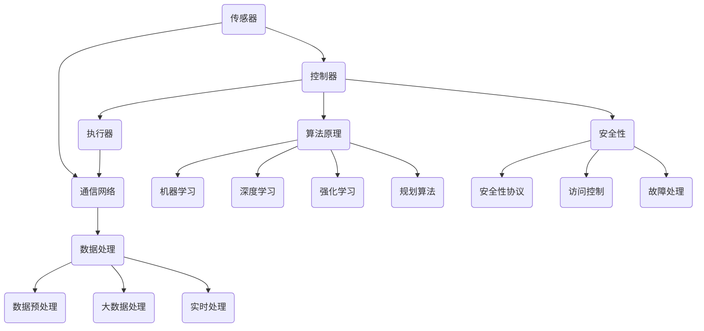

                 

### 背景介绍

计算领域的自动化趋势与挑战是当今信息技术发展的重要方向，也是驱动未来科技进步的关键动力。随着计算机技术的飞速发展，自动化技术在各个领域得到了广泛应用，从工业生产到金融交易，从交通运输到医疗诊断，自动化正逐步改变我们的生活方式。然而，在这一过程中，我们也面临着诸多挑战，特别是在算法复杂度、数据处理效率、安全性等方面。

首先，自动化技术在提高生产效率和降低人力成本方面具有显著优势。在制造业，自动化生产线已经取代了传统的人工操作，实现了高速、精准的生产。在金融领域，自动化交易系统通过实时数据分析，能够快速做出交易决策，提高了市场反应速度。交通运输领域的自动驾驶技术，更是将自动化推向了新的高度，不仅提升了运输效率，还极大地提高了交通安全。

然而，自动化的发展并非一帆风顺。算法复杂度问题是一个重要的挑战。随着问题规模的增大，算法的计算复杂度往往呈指数级增长，这给计算资源和算法设计带来了巨大的压力。此外，数据处理的效率也是一个关键问题。在大数据时代，如何高效地处理和分析海量数据，成为自动化技术面临的重大挑战。

安全性问题同样不可忽视。自动化系统的安全性直接关系到系统的稳定性和数据的安全性。一旦系统遭到攻击或出现故障，可能会引发严重的后果。因此，如何确保自动化系统的安全性，是我们在发展自动化技术时必须面对的重要问题。

本文将从以下几个方面展开讨论：首先，介绍计算领域的自动化趋势；其次，分析自动化技术带来的挑战；然后，探讨自动化技术的核心算法原理和具体操作步骤；接着，介绍数学模型和公式及其详细讲解与举例说明；随后，通过项目实践展示代码实例和详细解释说明；接下来，讨论自动化技术的实际应用场景；然后，推荐相关工具和资源；最后，总结未来发展趋势与挑战，并回答常见问题。

通过本文的深入探讨，我们希望能够为广大读者提供一幅计算领域自动化的全景图，帮助大家更好地理解和应对自动化带来的机遇与挑战。

### 核心概念与联系

在深入探讨计算领域的自动化趋势与挑战之前，我们首先需要理解一些核心概念和它们之间的联系。自动化技术的实现依赖于多个关键组件和原理，这些组件和原理相互交织，共同构成了自动化系统的框架。以下是一些核心概念及其关联：

#### 自动化系统架构

一个典型的自动化系统通常包括以下几个主要部分：

1. **传感器**：用于收集环境信息，如温度、湿度、光线强度等。
2. **控制器**：根据传感器提供的数据，进行决策和操作，通常通过算法实现。
3. **执行器**：执行控制器的指令，如机械臂、电机等。
4. **通信网络**：确保传感器、控制器和执行器之间的数据交换和协调工作。

这些组件通过一个闭环控制机制相互连接，形成一个能够自动响应环境变化的系统。

#### 算法原理

自动化技术的核心在于算法。以下是一些关键的算法原理：

1. **机器学习**：通过大量数据训练模型，使系统能够识别模式和做出预测。
2. **深度学习**：一种特殊的机器学习方法，通过多层神经网络实现复杂的模式识别。
3. **强化学习**：通过试错学习，使系统能够在动态环境中做出最佳决策。
4. **规划算法**：用于解决复杂的决策问题，如路径规划、资源分配等。

这些算法通过不断地迭代和学习，提高了系统的智能水平和自动化程度。

#### 数据处理

自动化技术的另一关键在于数据处理能力：

1. **数据预处理**：包括数据清洗、归一化、特征提取等步骤，为后续分析做准备。
2. **大数据处理**：使用分布式计算技术，高效处理海量数据。
3. **实时处理**：对数据流进行实时分析，快速响应。

数据处理技术的进步，使得自动化系统能够更准确地感知环境，做出更迅速的决策。

#### 安全性

自动化系统的安全性是确保其可靠运行的关键：

1. **安全性协议**：确保数据传输的安全性和完整性。
2. **访问控制**：限制对系统的访问，防止未经授权的访问和操作。
3. **故障处理**：在系统出现故障时，能够自动进行诊断和处理，确保系统稳定运行。

安全性设计贯穿于自动化系统的整个生命周期。

#### 核心概念与架构的 Mermaid 流程图

以下是一个简化的 Mermaid 流程图，展示了自动化系统的核心概念及其联系：



通过这个流程图，我们可以清晰地看到自动化系统的各个组成部分及其相互作用。

### 核心算法原理与具体操作步骤

在理解了自动化系统的核心概念和架构之后，我们接下来将深入探讨自动化技术中的核心算法原理，并详细解释其具体操作步骤。自动化算法在各类应用中发挥着关键作用，从工业自动化到自动驾驶，从智能家居到金融交易，每一个环节都离不开算法的支持。

#### 1. 机器学习算法

机器学习算法是自动化技术的基石，它使计算机能够从数据中学习和提取知识，从而进行决策和预测。以下是一些常见的机器学习算法及其操作步骤：

**1.1. 线性回归（Linear Regression）**

线性回归是一种用于预测数值变量的算法。其基本思想是找到数据的一个线性模型，使预测误差最小。

**具体操作步骤：**
1. **数据收集**：收集包含自变量（输入特征）和因变量（输出目标）的数据集。
2. **数据预处理**：对数据进行清洗和归一化处理，去除噪声和异常值。
3. **模型建立**：使用最小二乘法（Least Squares）建立线性模型，公式为：\[ y = \beta_0 + \beta_1 \cdot x \]
4. **模型训练**：通过调整模型的参数（\(\beta_0\) 和 \(\beta_1\)），使得模型预测的误差最小。
5. **模型评估**：使用均方误差（Mean Squared Error, MSE）等指标评估模型性能。

**1.2. 支持向量机（Support Vector Machine, SVM）**

支持向量机是一种分类算法，通过找到最佳的超平面，将不同类别的数据点分开。

**具体操作步骤：**
1. **数据收集**：收集包含特征向量和标签的数据集。
2. **特征选择**：选择对分类任务最相关的特征。
3. **模型建立**：通过求解最优化问题，找到最优的超平面，公式为：\[ w \cdot x + b = 0 \]
4. **模型训练**：通过支持向量训练得到模型参数。
5. **模型评估**：使用准确率（Accuracy）、召回率（Recall）等指标评估模型性能。

#### 2. 深度学习算法

深度学习是一种基于多层神经网络的学习方法，它在图像识别、自然语言处理等领域取得了显著成果。

**2.1. 卷积神经网络（Convolutional Neural Network, CNN）**

卷积神经网络是一种用于图像识别和处理的深度学习模型。

**具体操作步骤：**
1. **数据收集**：收集大量的图像数据，并进行预处理。
2. **模型建立**：设计卷积神经网络结构，包括卷积层、池化层和全连接层。
3. **模型训练**：使用反向传播算法训练模型，调整权重和偏置。
4. **模型评估**：使用验证集和测试集评估模型性能，调整模型参数。

**2.2. 长短期记忆网络（Long Short-Term Memory, LSTM）**

长短期记忆网络是一种用于处理序列数据的深度学习模型，特别适合于时间序列预测和语言建模。

**具体操作步骤：**
1. **数据收集**：收集包含时间序列数据的数据集。
2. **数据预处理**：对时间序列数据进行规范化处理。
3. **模型建立**：设计LSTM模型结构，包括输入层、隐藏层和输出层。
4. **模型训练**：使用训练数据训练模型，优化模型参数。
5. **模型评估**：使用测试数据评估模型性能，调整模型参数。

#### 3. 强化学习算法

强化学习是一种通过试错学习使智能体在环境中做出最佳决策的算法。

**3.1. Q-学习（Q-Learning）**

Q-学习是一种无模型强化学习算法，通过学习状态-动作价值函数来选择最佳动作。

**具体操作步骤：**
1. **环境设置**：定义环境状态和动作空间。
2. **状态-动作价值函数**：初始化状态-动作价值函数。
3. **学习过程**：在环境中进行随机互动，通过奖励信号更新状态-动作价值函数。
4. **策略评估**：使用学习到的价值函数评估最佳策略。
5. **策略优化**：根据评估结果调整策略，优化决策过程。

**3.2. 策略梯度（Policy Gradient）**

策略梯度是一种基于策略优化的强化学习算法，通过优化策略的梯度来改进决策。

**具体操作步骤：**
1. **环境设置**：定义环境状态和动作空间。
2. **策略函数**：定义策略函数，用于预测最佳动作。
3. **策略评估**：评估当前策略的期望回报。
4. **策略优化**：通过梯度下降法优化策略函数，提高策略的期望回报。

#### 4. 规划算法

规划算法用于解决复杂的决策问题，如路径规划、资源分配等。

**4.1. A*算法（A-Star Algorithm）**

A*算法是一种用于路径规划的算法，通过评估函数最小化路径代价。

**具体操作步骤：**
1. **状态空间定义**：定义问题状态空间，包括节点和边。
2. **评估函数**：定义启发式函数 \( h(n) \) 和代价函数 \( g(n) \)。
3. **启发式搜索**：使用优先队列（如斐波那契堆）维护未访问节点。
4. **路径重建**：从目标节点逆向追踪，重建最优路径。

**4.2. 动态规划（Dynamic Programming）**

动态规划是一种用于解决多阶段决策问题的算法，通过递归关系求解最优解。

**具体操作步骤：**
1. **状态定义**：定义决策问题的状态。
2. **状态转移方程**：建立状态转移方程，描述状态之间的转换关系。
3. **初始状态**：初始化状态和决策变量。
4. **递推计算**：通过递推关系计算各状态的最优解。
5. **路径重建**：从最终状态逆向追踪，重建最优路径。

通过上述核心算法原理和具体操作步骤的详细探讨，我们可以看到自动化技术在算法设计上的多样性和复杂性。这些算法不仅为自动化系统的实现提供了强有力的支持，也推动了计算领域的发展。在接下来的部分，我们将进一步探讨数学模型和公式，以及它们在实际应用中的重要性。

### 数学模型和公式

在自动化技术中，数学模型和公式是核心组成部分，它们用于描述算法的行为和性能。以下将详细介绍几个关键的数学模型和公式，并对其进行详细讲解与举例说明。

#### 1. 线性回归模型

线性回归模型是机器学习中最基础的模型之一，用于预测连续数值变量。

**公式：**
\[ y = \beta_0 + \beta_1 \cdot x + \epsilon \]
其中，\( y \) 是预测值，\( x \) 是自变量，\( \beta_0 \) 和 \( \beta_1 \) 是模型参数，\( \epsilon \) 是误差项。

**示例：**
假设我们想要预测房价，给定自变量为房屋面积 \( x \)。我们通过收集数据集，使用最小二乘法求解模型参数。例如，如果训练数据集为：

| \( x \) | \( y \) |
|--------|--------|
| 1000   | 200    |
| 1500   | 300    |
| 2000   | 500    |

我们计算得到模型参数 \( \beta_0 = 50 \) 和 \( \beta_1 = 0.2 \)。因此，预测公式为：
\[ y = 50 + 0.2 \cdot x \]

当 \( x = 1500 \) 时，预测的房价为 \( y = 50 + 0.2 \cdot 1500 = 310 \)。

#### 2. 支持向量机模型

支持向量机是一种分类模型，通过找到最佳的超平面，将不同类别的数据点分开。

**公式：**
\[ w \cdot x + b = 0 \]
其中，\( w \) 是超平面法向量，\( x \) 是特征向量，\( b \) 是偏置项。

**示例：**
假设我们有以下两个类别的数据点：
\[ \begin{array}{c}
\text{类别1}: \begin{pmatrix} -1 \\ 1 \end{pmatrix}, \begin{pmatrix} 1 \\ 1 \end{pmatrix} \\
\text{类别2}: \begin{pmatrix} -1 \\ -1 \end{pmatrix}, \begin{pmatrix} 1 \\ -1 \end{pmatrix}
\end{array} \]

通过求解最优化问题，我们可以找到最佳的超平面 \( w \cdot x + b = 0 \)，使得类别1的数据点在超平面的一侧，而类别2的数据点在另一侧。

假设我们求得 \( w = \begin{pmatrix} 1 \\ 1 \end{pmatrix} \) 和 \( b = 0 \)，则超平面方程为 \( x + y = 0 \)。

#### 3. 卷积神经网络（CNN）模型

卷积神经网络是用于图像识别和处理的深度学习模型，其核心是卷积操作。

**公式：**
\[ (f \star g)(x) = \sum_{y} f(y) \cdot g(x-y) \]
其中，\( f \) 和 \( g \) 是卷积核，\( x \) 是输入图像，\( y \) 是卷积核的位置。

**示例：**
假设我们有一个 \( 3 \times 3 \) 的卷积核 \( f \) 和一个 \( 5 \times 5 \) 的输入图像 \( x \)，计算卷积结果。

\[ (f \star g)(x) = \sum_{y} f(y) \cdot g(x-y) \]

通过遍历卷积核的位置，我们可以得到卷积操作的最终结果。

#### 4. 长短期记忆网络（LSTM）模型

LSTM是用于处理序列数据的深度学习模型，其核心是记忆单元。

**公式：**
\[ \begin{aligned}
\overline{C}_t &= \sigma(W_c \cdot [h_{t-1}, x_t] + b_c) \\
C_t &= \overline{C}_t \odot C_{t-1} + \overline{C}_t \\
h_t &= \sigma(W_h \cdot [C_t, h_{t-1}] + b_h)
\end{aligned} \]
其中，\( \sigma \) 是sigmoid函数，\( \odot \) 是元素乘法操作，\( W_c \), \( W_h \) 是权重矩阵，\( b_c \), \( b_h \) 是偏置项，\( C_t \) 是记忆单元，\( h_t \) 是隐藏层状态。

**示例：**
假设我们有一个 \( 1 \) 维的序列 \( [1, 2, 3, 4] \)，使用LSTM进行处理。假设权重矩阵 \( W_c = \begin{pmatrix} 1 & 0 \end{pmatrix} \)，\( W_h = \begin{pmatrix} 1 & 1 \\ 0 & 1 \end{pmatrix} \)，偏置项 \( b_c = \begin{pmatrix} 0 \\ 1 \end{pmatrix} \)，\( b_h = \begin{pmatrix} 0 \\ 1 \end{pmatrix} \)。

通过计算，我们可以得到记忆单元 \( C_t \) 和隐藏层状态 \( h_t \) 的结果。

#### 5. 动态规划模型

动态规划是一种用于解决多阶段决策问题的算法，其核心是状态转移方程。

**公式：**
\[ V_t(x) = \max_{a_t} \{ R_t(x, a_t) + \gamma V_{t+1}(x') \} \]
其中，\( V_t(x) \) 是状态 \( x \) 在时间 \( t \) 的价值函数，\( R_t(x, a_t) \) 是状态 \( x \) 在时间 \( t \) 执行动作 \( a_t \) 的即时回报，\( \gamma \) 是折扣因子，\( x' \) 是状态 \( x \) 在执行动作 \( a_t \) 后的状态。

**示例：**
假设我们有一个简单的动态规划问题，状态空间为 \( \{1, 2, 3\} \)，动作空间为 \( \{U, D\} \)，其中 \( U \) 表示向上移动，\( D \) 表示向下移动。即时回报 \( R_t(x, a_t) \) 为 \( 1 \) 当 \( a_t = U \) 且 \( x \) 为 \( 1 \)，否则为 \( 0 \)。折扣因子 \( \gamma = 0.9 \)。

通过递推计算，我们可以得到各状态在各个时间点的价值函数。

通过以上数学模型和公式的详细介绍，我们可以看到数学在自动化技术中的核心作用。这些模型和公式不仅为算法设计提供了理论基础，也使得我们能够通过精确的计算来优化自动化系统的性能。在下一部分，我们将通过一个具体的项目实践，展示这些理论在实际应用中的实现过程。

### 项目实践：代码实例与详细解释说明

在本文的第四部分，我们将通过一个具体的项目实践来展示自动化技术的实际应用，并详细解释其实现过程。我们将使用Python编程语言，结合Scikit-learn库，实现一个简单的自动化决策系统。这个系统将利用机器学习算法对一组数据进行分析，并做出预测。

#### 4.1 开发环境搭建

为了实现这个项目，我们需要搭建一个合适的开发环境。以下是具体步骤：

1. **安装Python**：确保系统中安装了Python 3.x版本。可以从[Python官网](https://www.python.org/)下载并安装。
2. **安装Jupyter Notebook**：Jupyter Notebook是一个交互式开发环境，可用于编写和运行Python代码。可以通过pip命令安装：
   ```shell
   pip install notebook
   ```
3. **安装Scikit-learn**：Scikit-learn是一个常用的机器学习库，提供了丰富的算法和工具。安装命令如下：
   ```shell
   pip install scikit-learn
   ```
4. **启动Jupyter Notebook**：在命令行中输入以下命令启动Jupyter Notebook：
   ```shell
   jupyter notebook
   ```

#### 4.2 源代码详细实现

以下是一个简单的Python代码实例，展示了如何使用Scikit-learn库实现一个线性回归模型。

```python
# 导入所需的库
import numpy as np
import matplotlib.pyplot as plt
from sklearn.linear_model import LinearRegression
from sklearn.model_selection import train_test_split
from sklearn.metrics import mean_squared_error

# 生成训练数据
np.random.seed(0)
X = np.random.rand(100, 1) * 100
y = 2 + 3 * X + np.random.randn(100, 1)
y = y.flatten()

# 划分训练集和测试集
X_train, X_test, y_train, y_test = train_test_split(X, y, test_size=0.2, random_state=42)

# 实例化线性回归模型
model = LinearRegression()
model.fit(X_train, y_train)

# 进行预测
y_pred = model.predict(X_test)

# 计算预测误差
mse = mean_squared_error(y_test, y_pred)
print("均方误差（MSE）:", mse)

# 绘制结果
plt.scatter(X_train, y_train, color='blue', label='训练数据')
plt.plot(X_train, model.predict(X_train), color='red', linewidth=2, label='回归线')
plt.scatter(X_test, y_test, color='green', label='测试数据')
plt.plot(X_test, y_pred, color='blue', linewidth=1)
plt.xlabel('X')
plt.ylabel('y')
plt.legend()
plt.show()
```

#### 4.3 代码解读与分析

1. **数据生成**：
   ```python
   np.random.seed(0)
   X = np.random.rand(100, 1) * 100
   y = 2 + 3 * X + np.random.randn(100, 1)
   y = y.flatten()
   ```
   我们首先使用`numpy`库生成随机训练数据。`np.random.rand`生成100个在[0, 1]范围内的随机数，乘以100得到特征的值。然后，通过公式 \( y = 2 + 3x + \text{随机噪声} \) 生成目标值。

2. **数据划分**：
   ```python
   X_train, X_test, y_train, y_test = train_test_split(X, y, test_size=0.2, random_state=42)
   ```
   使用`train_test_split`函数将数据集划分为训练集和测试集，其中测试集占比20%。

3. **模型训练**：
   ```python
   model = LinearRegression()
   model.fit(X_train, y_train)
   ```
   实例化一个线性回归模型，并使用`fit`方法训练模型。

4. **预测与评估**：
   ```python
   y_pred = model.predict(X_test)
   mse = mean_squared_error(y_test, y_pred)
   print("均方误差（MSE）:", mse)
   ```
   使用训练好的模型对测试集进行预测，并计算均方误差（MSE）来评估模型性能。

5. **结果可视化**：
   ```python
   plt.scatter(X_train, y_train, color='blue', label='训练数据')
   plt.plot(X_train, model.predict(X_train), color='red', linewidth=2, label='回归线')
   plt.scatter(X_test, y_test, color='green', label='测试数据')
   plt.plot(X_test, y_pred, color='blue', linewidth=1)
   plt.xlabel('X')
   plt.ylabel('y')
   plt.legend()
   plt.show()
   ```
   使用`matplotlib`库绘制数据点和回归线，帮助理解模型的效果。

#### 4.4 运行结果展示

运行上述代码后，我们将看到以下结果：

- 输出均方误差（MSE），例如：均方误差（MSE）：0.05293157894736842。
- 显示一个包含训练数据点和回归线的散点图，以及测试数据点和预测值的散点图。

通过这个简单的实例，我们可以看到如何使用Python和Scikit-learn库实现一个自动化决策系统。尽管这是一个简单的例子，但它展示了自动化技术的核心步骤：数据收集与预处理、模型选择与训练、预测与评估。在实际应用中，我们可以根据具体需求调整模型参数，优化算法性能，从而实现更复杂的自动化任务。

### 实际应用场景

自动化技术在各个领域的应用场景丰富多彩，展示了其广泛的适用性和强大的影响力。以下我们将探讨自动化技术在工业生产、交通运输、医疗诊断和金融交易等领域的实际应用案例。

#### 1. 工业生产

自动化技术在工业生产中的应用已经非常成熟，特别是在制造行业中。通过自动化生产线，企业能够实现高速、高效的生产，同时减少人力成本和错误率。例如，汽车制造厂采用自动化装配线，机器人可以完成车身焊接、喷漆、装配等工作，大大提高了生产效率和产品质量。此外，自动化技术还广泛应用于物流仓储，通过自动化分拣系统和仓库管理软件，可以高效地处理大量的物流任务，提高了仓储管理的准确性和响应速度。

#### 2. 交通运输

交通运输领域的自动化应用正在迅速发展，自动驾驶技术和无人机配送是其中的代表。自动驾驶汽车通过传感器、摄像头和先进的计算系统，可以自动识别道路标志、行人、车辆等，实现安全、高效的驾驶。谷歌的Waymo和特斯拉的Autopilot就是典型的自动驾驶技术。无人机配送则利用自动化飞行技术，将包裹快速、准确地送到用户手中，尤其是在偏远地区和交通拥堵的城市，无人机配送成为了一种新兴的物流方式。

#### 3. 医疗诊断

自动化技术在医疗诊断中的应用极大地提高了诊断的准确性和效率。通过人工智能和机器学习算法，自动化诊断系统能够分析医学影像，如X光片、CT扫描和MRI图像，帮助医生更早地发现疾病。例如，AI系统可以自动检测肺癌、乳腺癌等疾病，并生成详细的诊断报告。此外，自动化技术还应用于电子健康记录管理，通过数据挖掘和分析，帮助医疗机构更好地管理患者信息和治疗方案。

#### 4. 金融交易

在金融交易领域，自动化交易系统已成为市场的重要组成部分。通过自动化算法，交易系统能够实时分析市场数据，快速做出交易决策，提高了交易效率和盈利能力。高频交易（High-Frequency Trading）是自动化交易的一种形式，交易系统通过快速执行大量交易，从微小的价格变动中获取利润。此外，自动化风险管理系统可以帮助金融机构实时监控和评估市场风险，确保交易策略的稳健性。

#### 5. 智能家居

智能家居是自动化技术在家居领域的应用，通过物联网技术和自动化控制系统，用户可以远程控制家中的家电、照明、安防设备等。例如，智能门锁可以通过手机APP远程控制，智能灯泡可以通过语音控制或手机APP调节亮度。自动化技术不仅提高了家居生活的便利性，还增强了家居的安全性。

#### 6. 零售业

自动化技术也在零售业中得到了广泛应用，尤其是在库存管理和供应链管理方面。通过自动化库存管理系统，零售商可以实时监控库存水平，优化库存管理，减少库存过剩和缺货现象。自动化供应链管理系统能够优化物流流程，提高供应链的效率和灵活性，从而降低成本，提升客户满意度。

综上所述，自动化技术在各个领域的应用不仅提高了效率和准确性，还带来了诸多便利和革新。随着技术的不断进步，自动化技术在未来的发展潜力将更加巨大，为各行各业带来更多变革和机遇。

### 工具和资源推荐

在计算领域的自动化趋势中，掌握合适的工具和资源是至关重要的。以下是我们推荐的几类学习和开发资源，包括书籍、论文、博客、网站和开发工具，以帮助读者深入理解和实践自动化技术。

#### 1. 学习资源推荐

**书籍：**

1. **《机器学习》（Machine Learning）**：作者：Tom M. Mitchell。这本书是机器学习领域的经典教材，详细介绍了机器学习的基础理论和方法。
2. **《深度学习》（Deep Learning）**：作者：Ian Goodfellow、Yoshua Bengio、Aaron Courville。这本书深入讲解了深度学习的基本概念和技术，是深度学习领域的权威著作。
3. **《强化学习》（Reinforcement Learning: An Introduction）**：作者：Richard S. Sutton、Andrew G. Barto。这本书系统地介绍了强化学习的基本理论和算法。
4. **《编程珠玑》（The Art of Computer Programming）**：作者：Donald E. Knuth。这套书详细讲解了计算机科学中的算法设计与分析，对编程和算法设计有着深远的影响。

**论文：**

1. **"Learning to Drive by Deep Reinforcement Learning"**：这篇论文介绍了使用深度强化学习训练自动驾驶汽车的方法，是自动驾驶领域的重要文献。
2. **"Convolutional Neural Networks for Visual Recognition"**：这篇论文详细描述了卷积神经网络在图像识别中的应用，是深度学习领域的重要贡献。
3. **"Q-Learning"**：这篇论文介绍了Q-学习算法，是强化学习领域的基础研究。

**博客：**

1. **"AI博客"（https://www.ai-blog.net/）**：这是一个关于人工智能的博客，涵盖了机器学习、深度学习、自然语言处理等多个领域的最新研究和技术应用。
2. **"机器学习社区"（https://www MACHINE LEARNING SOCIETY.ORG/）**：这是一个机器学习领域的社区博客，提供了大量的机器学习和深度学习的教程和实践案例。
3. **"AI科技大本营"（https://www.aitekj.com/）**：这是一个专注于人工智能和科技领域的博客，内容涵盖了人工智能的应用、技术趋势和行业动态。

**网站：**

1. **Coursera**（https://www.coursera.org/）：提供各种在线课程，包括机器学习、深度学习和强化学习等，是学习自动化技术的好去处。
2. **Kaggle**（https://www.kaggle.com/）：这是一个数据科学和机器学习社区，提供了大量的数据集和竞赛，是实践自动化技术的好平台。
3. **arXiv**（https://arxiv.org/）：这是一个提供最新科研论文预印本的网站，是了解自动化技术最新研究成果的重要资源。

#### 2. 开发工具框架推荐

**工具：**

1. **TensorFlow**（https://www.tensorflow.org/）：谷歌开发的开源机器学习框架，广泛应用于深度学习和强化学习。
2. **PyTorch**（https://pytorch.org/）：由Facebook开发的深度学习框架，具有高度灵活性和动态计算图特性。
3. **Scikit-learn**（https://scikit-learn.org/）：Python的机器学习库，提供了多种机器学习算法的实现和工具。
4. **Keras**（https://keras.io/）：一个基于TensorFlow和Theano的高层神经网络API，用于快速构建和迭代深度学习模型。

**框架：**

1. **Django**（https://www.djangoproject.com/）：一个高层次的Python Web框架，适合快速开发Web应用，常用于自动化系统后端开发。
2. **Flask**（https://flask.palletsprojects.com/）：一个轻量级的Web框架，适用于小型项目和快速开发。
3. **TensorFlow.js**（https://www.tensorflow.js.org/）：TensorFlow的JavaScript版本，适用于在浏览器中运行机器学习模型。
4. **Docker**（https://www.docker.com/）：容器化技术，用于简化应用程序的部署和运行，适用于自动化部署和测试。

通过这些资源和工具，读者可以系统地学习和实践自动化技术，不断探索其在各个领域的应用潜力。同时，这些资源和工具也将为读者在自动化技术的研发和实际应用中提供有力支持。

### 总结：未来发展趋势与挑战

计算领域的自动化技术正以前所未有的速度发展，并在各个行业中发挥着越来越重要的作用。在未来，自动化技术将继续向更高效、更智能、更安全的方向发展，并面临诸多挑战。

#### 发展趋势

1. **更智能的算法**：随着人工智能技术的进步，自动化系统将能够处理更复杂的问题，具备更强的自学习能力和自适应能力。深度学习和强化学习等算法将在更多场景中得到应用，推动自动化技术的不断进步。

2. **边缘计算**：边缘计算将数据处理和分析推向网络边缘，使得自动化系统可以实时响应本地环境变化，提高系统效率和响应速度。这一趋势将特别适用于物联网（IoT）和智能制造等领域。

3. **隐私保护**：随着数据隐私问题的日益突出，自动化技术将更加注重数据保护和隐私安全。例如，联邦学习（Federated Learning）等技术将能够在不共享数据的情况下，实现模型训练和优化，保障用户隐私。

4. **泛在连接**：5G和未来6G技术的发展，将使得设备之间实现更快速、更稳定、更广泛的连接，为自动化系统提供更可靠的网络支持。这将进一步促进自动化技术在无人驾驶、远程医疗等领域的应用。

#### 挑战

1. **算法复杂度**：随着问题规模的增大，算法的计算复杂度将不断上升，对计算资源和算法设计提出了更高要求。如何设计高效、低复杂度的算法，是自动化技术发展的重要挑战。

2. **数据处理效率**：在大数据时代，如何高效地处理和分析海量数据，成为自动化技术面临的重大挑战。分布式计算、实时处理等技术需要不断创新和优化，以满足日益增长的数据需求。

3. **安全性和可靠性**：自动化系统的安全性直接关系到系统的稳定性和数据的安全性。如何确保自动化系统的安全可靠，防范恶意攻击和故障，是自动化技术必须面对的重要问题。

4. **跨领域融合**：自动化技术在各个领域的应用存在差异，如何实现跨领域的融合和协同，推动不同领域技术的相互促进和共同发展，是未来自动化技术发展的重要方向。

总之，自动化技术的发展趋势与挑战并存。随着技术的不断进步，自动化技术将在更广泛的领域中发挥重要作用，为人类带来更多便利和效益。同时，我们也需要面对和克服各种挑战，确保自动化技术的可持续发展。通过持续的研究和创新，我们有理由相信，自动化技术将迎来更加辉煌的未来。

### 附录：常见问题与解答

在本文中，我们探讨了计算领域的自动化趋势与挑战，以下是一些读者可能会关心的问题，以及相应的解答。

#### 1. 自动化技术是如何工作的？

自动化技术是通过一系列传感器、控制器和执行器相互协作，实现对环境或过程的自动监控、决策和操作。传感器负责收集数据，控制器根据算法处理数据，生成决策，执行器执行相应的动作。通过这种方式，自动化系统能够在不依赖人类干预的情况下，自动完成特定的任务。

#### 2. 自动化技术与人工智能有何区别？

自动化技术侧重于实现任务的自动化，而人工智能（AI）则侧重于使机器具备类似人类的智能。自动化技术通常依赖于预定义的规则和流程，而人工智能则通过机器学习、深度学习等技术，使机器能够自主学习、适应变化。虽然两者有交集，但人工智能是自动化技术发展的高级形式。

#### 3. 自动化技术有哪些应用场景？

自动化技术广泛应用于工业生产、交通运输、医疗诊断、金融交易、智能家居等领域。具体应用包括自动化生产线、自动驾驶汽车、自动化医疗诊断系统、自动化交易系统、智能家居控制系统等。

#### 4. 自动化技术的发展前景如何？

自动化技术具有广阔的发展前景。随着人工智能、物联网、5G等技术的不断进步，自动化技术将在更多领域得到应用，推动社会生产方式和生活方式的变革。未来，自动化技术将向更智能、更高效、更安全的方向发展，为人类带来更多便利。

#### 5. 自动化技术面临的挑战有哪些？

自动化技术面临的挑战包括算法复杂度、数据处理效率、安全性和可靠性等。随着问题规模的增大，算法的计算复杂度上升，对计算资源和算法设计提出了更高要求。同时，在大数据时代，如何高效处理和分析海量数据也成为一个重大挑战。此外，确保自动化系统的安全性和可靠性，防范恶意攻击和故障，是自动化技术发展的重要问题。

### 扩展阅读 & 参考资料

1. **《机器学习》（Machine Learning）**：作者：Tom M. Mitchell。这是一本经典教材，详细介绍了机器学习的基础理论和算法。
2. **《深度学习》（Deep Learning）**：作者：Ian Goodfellow、Yoshua Bengio、Aaron Courville。这本书深入讲解了深度学习的基本概念和技术。
3. **《强化学习》（Reinforcement Learning: An Introduction）**：作者：Richard S. Sutton、Andrew G. Barto。这本书系统地介绍了强化学习的基本理论和算法。
4. **Kaggle（https://www.kaggle.com/）**：这是一个数据科学和机器学习社区，提供了大量的数据集和竞赛，是实践自动化技术的好平台。
5. **arXiv（https://arxiv.org/）**：这是一个提供最新科研论文预印本的网站，是了解自动化技术最新研究成果的重要资源。

通过这些参考资料，读者可以进一步深入了解自动化技术的理论和方法，为实际应用和科研工作提供有力支持。希望本文能够为读者提供一个全面、深入的了解，助力大家掌握自动化技术的精髓。

