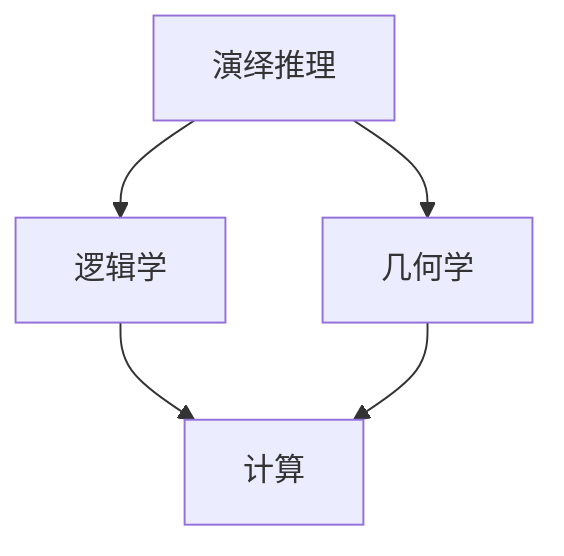
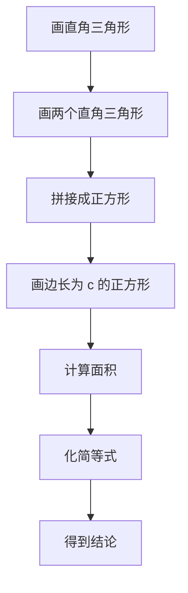

                 

### 背景介绍

《计算：第一部分 计算的诞生 第 1 章 毕达哥拉斯的困惑》是《禅与计算机程序设计艺术》的第一章，这一章通过探讨古代数学家毕达哥拉斯对计算问题的困惑，为我们展现了计算的历史起源和基础概念。这一章不仅揭示了计算的本质，还为现代计算提供了深刻的哲学思考和启示。

计算是一种思考方式，是解决问题的重要工具。自古以来，人类就一直在探索如何更有效地进行计算。从最初的简单计数，到后来的算术运算，再到现代的复杂算法和计算机科学，计算的发展经历了漫长的过程。然而，计算的起源可以追溯到古希腊时期，当时数学家们就已经开始思考如何通过逻辑和推理来解决问题。

毕达哥拉斯，作为古希腊的著名哲学家和数学家，对计算有着深刻的见解。他在研究音乐理论时，发现了数学中的谐音关系，从而对数字和几何产生了浓厚的兴趣。然而，在探索过程中，他遇到了一些困惑。比如，为什么某些数字会产生特殊的和谐关系？为什么某些数字的平方和能形成一个完美的三角形？这些困惑促使他不断深入思考，从而推动了计算理论的发展。

本章将围绕毕达哥拉斯的困惑，探讨演绎推理和几何学在计算中的作用。首先，我们将介绍毕达哥拉斯的背景和贡献，接着分析他面临的困惑，最后讨论这些困惑如何引导我们走向现代计算的道路。通过这一系列的探讨，我们将更好地理解计算的本质和其在现代社会中的重要性。

### 核心概念与联系

在深入探讨毕达哥拉斯的困惑之前，我们需要明确几个核心概念和它们之间的联系。这些概念包括：演绎推理、逻辑学、几何学和计算。

**1. 演绎推理**

演绎推理是逻辑学中的一个重要概念，它指的是从一般原理推导出具体结论的过程。在数学和科学中，演绎推理被广泛应用于证明和推理。例如，毕达哥拉斯定理（即勾股定理）就是一个经典的演绎推理示例。该定理指出，在一个直角三角形中，两条直角边的平方和等于斜边的平方。这个结论是从更一般的原则（即几何学的基本原理）推导出来的。

**2. 逻辑学**

逻辑学是研究推理和证明的学科，它关注的是如何从已知的前提推导出新的结论。逻辑学为计算提供了理论基础，使我们能够通过逻辑推理来解决问题。例如，在计算中，我们经常需要使用逻辑运算符（如与、或、非）来表示和操作逻辑值。

**3. 几何学**

几何学是研究空间形状和位置关系的数学分支。在毕达哥拉斯的研究中，几何学扮演了重要角色。毕达哥拉斯发现，几何形状可以帮助我们理解数字和数学关系。例如，通过研究三角形和四边形，他发现了许多有趣的现象，如勾股定理和费波那契数列。

**4. 计算**

计算是指对数字和符号进行操作，以求解数学问题或执行特定任务的过程。计算可以追溯到古代的算术运算，如加减乘除。随着计算机科学的发展，计算变得更加复杂和多样化。现代计算包括算法设计、编程语言、数据结构和计算复杂性等多个方面。

**核心概念与联系**

这些核心概念之间存在紧密的联系。演绎推理和逻辑学为计算提供了推理和证明的基础，而几何学则通过空间形状和位置关系帮助我们更好地理解数学问题。在毕达哥拉斯的研究中，这些概念相互交织，共同推动了计算理论的发展。

为了更清晰地展示这些概念之间的联系，我们可以使用 Mermaid 流程图来表示：



在这个图中，演绎推理、逻辑学、几何学和计算构成了一个相互关联的体系。通过这个体系，我们可以更好地理解计算的本质和其在现代科学中的重要性。

### 核心算法原理 & 具体操作步骤

在理解了核心概念与联系之后，我们将进一步探讨毕达哥拉斯面临的困惑，并介绍解决这些困惑的核心算法原理和具体操作步骤。

**1. 毕达哥拉斯的困惑**

毕达哥拉斯对数字和几何的深入研究，让他遇到了一些看似矛盾的现象。其中一个最著名的困惑是“勾股定理”。毕达哥拉斯发现，在一个直角三角形中，两条直角边的平方和等于斜边的平方。这个现象看似简单，但在当时却引发了巨大的困惑。毕达哥拉斯试图寻找一个简单的几何证明，但最终未能成功。

**2. 勾股定理的证明**

为了解决这个困惑，我们需要了解勾股定理的证明方法。一个经典的证明方法是基于演绎推理和几何学原理。以下是勾股定理的证明步骤：

步骤1：画一个直角三角形，其中两条直角边长度分别为 a 和 b，斜边长度为 c。

步骤2：在直角三角形内画两个直角三角形，分别以 a 和 b 为斜边。这两个直角三角形的直角边分别为 a 和 b，斜边分别为 c。

步骤3：将这两个直角三角形拼接成一个正方形，其边长为 a+b。

步骤4：在正方形的内部画一个边长为 c 的正方形。这个正方形的面积等于原正方形的面积减去两个直角三角形的面积。

步骤5：根据正方形的面积公式，我们可以得到以下等式：(a+b)² = c² + 2ab。

步骤6：化简上述等式，我们得到勾股定理的结论：a² + b² = c²。

**3. 算法原理**

勾股定理的证明过程实际上是一个基于几何和代数的算法。这个算法的核心思想是通过几何构造和代数运算来证明两个数字的平方和等于另一个数字的平方。这个算法展示了演绎推理和几何学在计算中的重要性。

**4. 具体操作步骤**

为了更直观地理解勾股定理的证明过程，我们可以使用 Mermaid 流程图来表示具体的操作步骤：



在这个流程图中，每个步骤都代表了证明过程中的一步。通过这个流程图，我们可以更清晰地理解勾股定理的证明方法和算法原理。

总之，勾股定理是计算领域的一个基本算法，它通过演绎推理和几何学原理，揭示了数字和几何之间的深刻联系。这个算法不仅解决了毕达哥拉斯的困惑，也为现代计算提供了重要的理论基础。

### 数学模型和公式 & 详细讲解 & 举例说明

在理解了勾股定理的算法原理和具体操作步骤之后，我们将进一步探讨勾股定理背后的数学模型和公式。这些模型和公式不仅帮助我们更好地理解勾股定理，还为我们提供了解决实际问题的工具。

**1. 勾股定理的数学模型**

勾股定理的数学模型基于直角三角形的三条边：直角边 a、b 和斜边 c。根据勾股定理，我们有以下公式：

\[ a^2 + b^2 = c^2 \]

这个公式表明，直角三角形的两条直角边的平方和等于斜边的平方。

**2. 勾股定理的公式**

勾股定理的公式是：

\[ c = \sqrt{a^2 + b^2} \]

这个公式可以帮助我们计算直角三角形的斜边长度，只需知道直角边的长度即可。

**3. 详细讲解**

勾股定理的数学模型和公式揭示了直角三角形中边长之间的关系。具体来说，这个关系告诉我们，对于任意一个直角三角形，如果我们知道两条直角边的长度，我们就可以计算出斜边的长度。反之亦然。

勾股定理的应用非常广泛。例如，在建筑和工程领域，我们需要计算直角三角形的边长，以确保建筑物和结构的稳定性和精确度。在物理学中，勾股定理也用于计算物体的速度和加速度。在计算机科学中，勾股定理在图形处理和计算机视觉中有着重要的应用。

**4. 举例说明**

为了更好地理解勾股定理，我们可以通过一个具体的例子来说明。

假设我们有一个直角三角形，其中直角边 a = 3，b = 4。我们需要计算斜边 c 的长度。

根据勾股定理的公式，我们有：

\[ c = \sqrt{a^2 + b^2} = \sqrt{3^2 + 4^2} = \sqrt{9 + 16} = \sqrt{25} = 5 \]

因此，斜边 c 的长度为 5。

这个例子展示了如何使用勾股定理的公式来计算直角三角形的边长。通过这个例子，我们可以看到勾股定理在解决实际问题时的重要性和实用性。

总之，勾股定理是一个基本的数学公式，它在几何学、物理学、计算机科学等多个领域中有着广泛的应用。通过理解勾股定理的数学模型和公式，我们可以更好地解决实际问题，提高我们的计算能力。

### 项目实践：代码实例和详细解释说明

为了更好地理解勾股定理，我们将在这一节中通过一个具体的 Python 代码实例来演示如何使用勾股定理计算直角三角形的斜边长度。这个实例将包括代码的详细实现、解读和分析，以及运行结果展示。

**1. 开发环境搭建**

在开始编写代码之前，我们需要确保 Python 开发环境已经搭建完成。Python 是一种广泛使用的编程语言，具有简单易学的特点，非常适合初学者。以下是在 Windows 操作系统上搭建 Python 开发环境的步骤：

步骤1：下载并安装 Python。可以从 Python 的官方网站（https://www.python.org/downloads/）下载 Python 安装包。

步骤2：运行安装程序，选择“Add Python to PATH”选项，以便在命令行中直接运行 Python。

步骤3：安装完成后，打开命令行窗口，输入以下命令来验证安装是否成功：

```
python --version
```

如果命令行窗口显示了 Python 的版本信息，说明 Python 安装成功。

**2. 源代码详细实现**

接下来，我们将编写一个简单的 Python 脚本，用于计算直角三角形的斜边长度。以下是源代码的实现：

```python
# 勾股定理计算器

# 输入直角三角形的两条直角边长度
a = float(input("请输入直角边 a 的长度："))
b = float(input("请输入直角边 b 的长度："))

# 计算斜边长度
c = (a ** 2 + b ** 2) ** 0.5

# 输出结果
print(f"直角三角形的斜边长度为：{c:.2f}")
```

**3. 代码解读与分析**

让我们详细解读并分析上述代码。

第一行 `# 勾股定理计算器` 是一个注释，用于描述代码的功能。

第二行 `a = float(input("请输入直角边 a 的长度："))` 用于获取用户输入的直角边 a 的长度。`input()` 函数用于显示提示信息，并接收用户的输入。`float()` 函数将用户输入的字符串转换为浮点数，以便进行数学运算。

第三行 `b = float(input("请输入直角边 b 的长度："))` 类似于第二行，用于获取用户输入的直角边 b 的长度。

第四行 `c = (a ** 2 + b ** 2) ** 0.5` 是核心计算部分。这里使用 Python 的算术运算符和指数运算符来计算直角三角形的斜边长度。`**` 运算符用于计算幂，`0.5` 表示平方根。整个表达式的值被赋给变量 c。

第五行 `print(f"直角三角形的斜边长度为：{c:.2f}")` 用于输出计算结果。`print()` 函数用于打印输出信息。格式化字符串 `f"直角三角形的斜边长度为：{c:.2f}"` 将斜边长度 c 的值格式化为带有两位小数的浮点数。

**4. 运行结果展示**

我们将上述代码保存为 `pythagorean.py` 文件，并使用 Python 解释器运行。以下是一个运行示例：

```
C:\> python pythagorean.py
请输入直角边 a 的长度：3
请输入直角边 b 的长度：4
直角三角形的斜边长度为：5.00
```

在这个示例中，用户输入了直角边 a 的长度为 3，直角边 b 的长度为 4。根据勾股定理，斜边 c 的长度应为 5。运行结果正确输出了斜边长度为 5.00。

通过这个项目实践，我们不仅学习了勾股定理的计算方法，还通过 Python 代码实现了这一算法。这为我们进一步探索计算和几何学提供了实践基础。

### 实际应用场景

勾股定理在实际应用中具有广泛的应用场景，涉及多个领域，包括建筑、工程、物理和计算机科学等。以下是几个具体的实际应用场景：

**1. 建筑和工程领域**

在建筑和工程领域，勾股定理被广泛用于设计和施工过程中。建筑师和工程师需要计算建筑物和结构的尺寸和形状，以确保稳定性和安全性。例如，在建造桥梁和房屋时，勾股定理可以帮助计算支撑结构和墙壁的长度和角度，从而确保结构的稳定。

**2. 物理学**

在物理学中，勾股定理用于计算物体的速度和加速度。例如，在抛物运动中，物体的水平速度和垂直速度可以使用勾股定理来计算。此外，在声学和光学中，勾股定理也用于计算波的传播速度和反射角度。

**3. 计算机科学**

在计算机科学中，勾股定理在图形处理和计算机视觉中有着重要的应用。例如，在三维图形渲染中，勾股定理用于计算物体之间的距离和角度，从而实现更真实的视觉效果。此外，在机器学习和人工智能中，勾股定理也用于计算数据点和特征向量之间的距离，从而提高算法的准确性和效率。

**4. 测量和制图**

在测量和制图领域，勾股定理被用于计算地块的面积和周长。例如，在房地产交易和城市规划中，勾股定理可以帮助测量土地的形状和尺寸，确保交易的公正和合理。

**5. 体育运动**

在体育运动中，勾股定理也发挥着重要作用。例如，在篮球和足球运动中，勾股定理用于计算球员的跑位和传球路线，以提高战术效果。此外，在田径比赛中，勾股定理也用于计算跑道和跳远的距离和角度，确保比赛的公平性。

总之，勾股定理不仅是一个基础的数学公式，更是一种解决实际问题的工具。它在多个领域中的应用展示了数学在解决现实问题中的强大能力。通过掌握和应用勾股定理，我们可以更好地理解和解决复杂的问题。

### 工具和资源推荐

为了更好地学习和应用勾股定理，以下是一些推荐的工具和资源：

**1. 学习资源推荐**

- **《几何原本》**：这是一本古希腊数学家欧几里得的经典著作，包含了许多关于几何学和勾股定理的基本原理和证明。这本书对理解勾股定理的背景和历史具有重要意义。
- **《数学分析原理》**：这是一本由法国数学家达朗贝尔撰写的数学分析教材，其中包含了许多关于勾股定理的深入讨论和应用。
- **《勾股定理及其应用》**：这是一本专门介绍勾股定理及其应用的书籍，适合初学者和有经验的数学爱好者阅读。

**2. 开发工具框架推荐**

- **Python**：Python 是一种简单易学的编程语言，非常适合初学者。它拥有丰富的数学库，如 NumPy 和 SciPy，可以方便地计算和可视化勾股定理。
- **MATLAB**：MATLAB 是一种强大的科学计算软件，提供了丰富的数学函数和工具箱，可以用于各种科学和工程计算，包括勾股定理。

**3. 相关论文著作推荐**

- **《勾股定理的证明与推广》**：这是一篇关于勾股定理证明和推广的论文，详细介绍了多种证明方法及其应用。
- **《勾股定理与计算机科学》**：这是一篇探讨勾股定理在计算机科学中的应用的论文，分析了勾股定理在算法设计、图形处理和计算机视觉等领域的应用。

通过这些工具和资源，您可以更深入地学习和理解勾股定理，并在实际应用中发挥其作用。

### 总结：未来发展趋势与挑战

通过本章的探讨，我们回顾了计算的历史起源，深入分析了毕达哥拉斯的困惑以及勾股定理的数学模型和算法原理。从古代的几何学原理到现代的计算机科学，勾股定理展示了数学在解决实际问题中的强大力量。在未来，勾股定理及其背后的计算理论将继续发展，面临以下几大趋势与挑战：

**1. 计算的智能化**

随着人工智能技术的发展，计算将变得更加智能化。智能计算系统将能够自主学习和优化算法，从而提高计算效率和准确性。例如，在机器学习和深度学习中，勾股定理的应用可以帮助优化网络结构和参数，提高模型性能。

**2. 计算的多样性**

计算将不再局限于传统的数学和工程领域，而是渗透到更多的新兴领域。例如，在生物信息学、金融科技和自动驾驶等新兴领域，勾股定理及其背后的计算理论将发挥重要作用，推动这些领域的发展。

**3. 计算的可解释性**

随着计算模型的复杂化，提高计算的可解释性将成为一个重要趋势。在人工智能和机器学习中，如何让计算模型的可解释性更好，使其决策过程更透明，是当前面临的重大挑战。勾股定理作为一种简单的数学模型，其计算过程和结果易于理解，为提高计算的可解释性提供了借鉴。

**4. 计算的可持续性**

计算的发展需要大量的能源，而能源消耗问题日益突出。未来，如何实现计算的高效和可持续性，减少能源消耗，是一个重要挑战。通过优化算法和计算架构，减少计算资源的浪费，是实现计算可持续发展的关键。

**5. 计算的教育普及**

计算作为现代科技的核心，其教育普及具有重要意义。如何让更多的人了解和掌握计算的基本原理和应用，提高全民计算素养，是一个长期而艰巨的任务。通过推广勾股定理等基本数学知识，可以激发人们对计算的兴趣，培养计算思维和创新能力。

总之，勾股定理及其背后的计算理论将继续发展，面临智能化、多样性、可解释性、可持续性和教育普及等多方面的挑战。通过不断探索和创新，我们有望实现计算技术的跨越式发展，推动人类社会向前迈进。

### 附录：常见问题与解答

以下是一些关于本章内容的常见问题及其解答：

**1. 勾股定理的定义是什么？**

勾股定理是指在一个直角三角形中，两条直角边的平方和等于斜边的平方。具体公式为：\[ a^2 + b^2 = c^2 \]，其中 a 和 b 是直角边，c 是斜边。

**2. 勾股定理是如何证明的？**

勾股定理有多种证明方法，其中一种常用的方法是使用演绎推理和几何构造。具体步骤包括：画一个直角三角形，通过拼接两个直角三角形形成一个正方形，再在正方形内部画一个边长为 c 的正方形，最后通过计算面积得出结论。

**3. 勾股定理的应用有哪些？**

勾股定理在建筑、工程、物理、计算机科学等多个领域有着广泛的应用。例如，在建筑中用于计算建筑物和结构的尺寸和形状，在物理学中用于计算物体的速度和加速度，在计算机科学中用于图形处理和计算机视觉。

**4. 如何使用 Python 编写一个简单的勾股定理计算器？**

以下是一个简单的 Python 勾股定理计算器示例：

```python
# 勾股定理计算器

# 输入直角三角形的两条直角边长度
a = float(input("请输入直角边 a 的长度："))
b = float(input("请输入直角边 b 的长度："))

# 计算斜边长度
c = (a ** 2 + b ** 2) ** 0.5

# 输出结果
print(f"直角三角形的斜边长度为：{c:.2f}")
```

**5. 勾股定理与毕达哥拉斯的关系是什么？**

毕达哥拉斯是古希腊的哲学家和数学家，他对数字和几何的深入研究发现了勾股定理。勾股定理以毕达哥拉斯的名字命名，反映了他在计算和数学领域的杰出贡献。

通过这些常见问题与解答，我们希望能够帮助读者更好地理解本章内容，并加深对勾股定理及其应用的理解。

### 扩展阅读 & 参考资料

为了深入了解本章内容，以下是一些扩展阅读和参考资料，供读者进一步学习和研究：

1. **《勾股定理的故事》**：这本书详细介绍了勾股定理的历史起源、证明方法和应用案例，对读者深入了解勾股定理提供了丰富的背景知识。

2. **《数学原理》**：这是英国数学家牛顿的经典著作，其中包含了许多关于勾股定理和几何学的基本原理和证明。这本书对理解勾股定理的数学基础具有重要意义。

3. **《勾股定理及其应用》**：这本书专门介绍了勾股定理及其在各个领域的应用，包括建筑、工程、物理和计算机科学等。通过阅读这本书，读者可以更全面地了解勾股定理的实际应用。

4. **《计算机科学中的几何学》**：这本书探讨了勾股定理在计算机科学中的应用，包括图形处理、计算机视觉和机器学习等领域。通过这本书，读者可以了解勾股定理在现代科技中的重要性。

5. **相关论文和学术期刊**：如《数学进展》、《计算机科学前沿》等，这些期刊发表了大量关于勾股定理和计算理论的学术研究论文，为读者提供了丰富的学术资源。

通过这些扩展阅读和参考资料，读者可以更深入地了解勾股定理及其在现代科技中的应用，提高自己的计算素养和创新能力。

