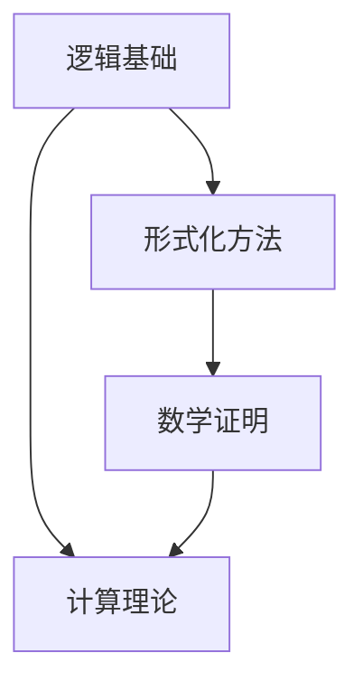

                 

### 文章标题

## 计算：第三部分 计算理论的形成 第 6 章 计算理论的奠基：希尔伯特进路 数学的无冕之王

> **关键词**：计算理论、希尔伯特、逻辑基础、数学证明、形式化方法、人工智能

> **摘要**：本文将深入探讨计算理论的奠基过程，特别关注希尔伯特进路在数学领域的重要贡献。通过回顾希尔伯特的数学哲学和其推动计算理论发展的历程，我们旨在揭示计算理论的核心概念及其在现代科技中的广泛应用。本文将详细分析希尔伯特进路如何改变了我们对计算和数学的认识，并展望未来计算理论的发展趋势与挑战。

### 1. 背景介绍

在计算理论的早期发展中，希尔伯特（David Hilbert）是一位至关重要的数学家和逻辑学家。希尔伯特的工作不仅仅局限于数学领域，他的贡献还涉及到了逻辑、物理和计算机科学等多个学科。他的数学哲学观点强调数学的严格性和基础性，这为计算理论的形成奠定了坚实的基础。

在19世纪末和20世纪初，数学界经历了一场深刻的变革。随着集合论、公理化和形式化方法的发展，数学家们开始重新审视数学的基础。希尔伯特正是这场变革的积极参与者和推动者。他提出了许多重要的数学问题，如“希尔伯特第23问题”，这些问题不仅挑战了当时的数学界限，也为后来的计算理论提供了研究方向。

希尔伯特的数学哲学强调逻辑和证明的重要性。他认为，数学的真理是可以通过逻辑证明来确立的，而证明的过程必须严格、明确。这一思想为计算理论的奠基提供了理论基础。通过将数学问题形式化为逻辑表达式，希尔伯特的工作为后来的计算机科学家提供了工具和方法。

### 2. 核心概念与联系

**核心概念**：

- **逻辑基础**：希尔伯特的工作强调逻辑在数学证明中的核心地位。逻辑基础是计算理论的重要组成部分，它为程序的正确性和可靠性提供了保障。
- **形式化方法**：希尔伯特提出了形式化数学概念的方法，将数学问题转化为逻辑表达式。这种方法为计算理论提供了严格、明确的表达方式。
- **数学证明**：希尔伯特的数学哲学强调证明的重要性。通过证明，我们可以确立数学命题的真实性，这为计算理论的发展提供了可靠的逻辑基础。

**核心概念原理和架构的 Mermaid 流程图**：



在这个流程图中，逻辑基础、形式化方法和数学证明是计算理论的基础。逻辑基础为计算理论提供了正确的逻辑框架，形式化方法将数学问题转化为逻辑表达式，而数学证明则确立了数学命题的真实性。

### 3. 核心算法原理 & 具体操作步骤

**核心算法原理**：

希尔伯特的算法原理主要包括以下几个方面：

1. **形式化数学**：将数学问题转化为逻辑表达式，使数学问题的解决过程更加清晰、明确。
2. **证明论**：通过逻辑证明来确立数学命题的真实性，确保数学的严格性和可靠性。
3. **机械化证明**：希尔伯特提出了机械化证明的概念，试图将证明过程形式化为计算机可以执行的操作。

**具体操作步骤**：

1. **确定数学问题**：首先，我们需要明确要解决的数学问题，并将其转化为逻辑表达式。
2. **形式化表达**：将数学问题形式化为逻辑表达式，使用希尔伯特提出的符号和公理系统。
3. **构造证明**：通过逻辑证明来确立数学命题的真实性。这一步骤需要运用希尔伯特提出的证明论方法。
4. **机械化证明**：如果可能，我们将证明过程机械化，使其可以由计算机执行。

**示例**：

假设我们要证明一个简单的数学命题：“对于所有自然数n，如果n是偶数，则n+1是奇数。”

- **确定数学问题**：我们需要证明上述命题。
- **形式化表达**：将命题转化为逻辑表达式，如下所示：
    $$(\forall n \in \mathbb{N}) (\neg P(n) \Rightarrow Q(n+1))$$
    其中，$P(n)$表示“n是偶数”，$Q(n+1)$表示“n+1是奇数”。
- **构造证明**：我们可以使用反证法来证明这个命题。假设存在一个自然数n，使得$P(n)$为真而$Q(n+1)$为假。这意味着n是偶数，但n+1不是奇数。这是不可能的，因为偶数加1必定是奇数。因此，原命题成立。
- **机械化证明**：如果需要，我们可以将证明过程机械化，使其可以由计算机执行。这通常涉及到构建一个证明器，该证明器可以自动执行证明过程。

### 4. 数学模型和公式 & 详细讲解 & 举例说明

**数学模型和公式**：

在希尔伯特的进路中，数学模型和公式起着至关重要的作用。以下是一些关键的数学模型和公式：

1. **希尔伯特空间**：希尔伯特空间是数学中的一个基本概念，它是一组向量空间，满足一定的公理。希尔伯特空间的概念为计算理论提供了重要的数学基础。
2. **希尔伯特矩阵**：希尔伯特矩阵是一种特殊的矩阵，其元素由单位向量之间的内积构成。希尔伯特矩阵在计算理论中有着广泛的应用。
3. **希尔伯特-波利斯定理**：希尔伯特-波利斯定理是计算理论中的一个重要定理，它建立了希尔伯特空间与计算理论之间的关系。

**详细讲解**：

- **希尔伯特空间**：希尔伯特空间是一组向量空间，它满足以下公理：
    - **闭合性**：希尔伯特空间中的任意子集的闭包仍然属于希尔伯特空间。
    - **内积**：希尔伯特空间中定义了一个内积运算，使得任意两个向量都可以进行内积运算，结果是一个实数。
    - **完备性**：希尔伯特空间中的序列如果收敛，则其极限也属于希尔伯特空间。

- **希尔伯特矩阵**：希尔伯特矩阵是一种特殊的矩阵，其元素由单位向量之间的内积构成。希尔伯特矩阵的行和列都是单位向量，因此其特征值和特征向量具有特殊的性质。希尔伯特矩阵在计算理论中的应用包括矩阵分解、数值计算等。

- **希尔伯特-波利斯定理**：希尔伯特-波利斯定理是计算理论中的一个重要定理，它建立了希尔伯特空间与计算理论之间的关系。该定理指出，任何希尔伯特空间都可以表示为有限维希尔伯特空间的直和。这一定理为计算理论提供了一个重要的数学框架，使得我们可以将复杂的问题简化为有限维空间中的问题。

**举例说明**：

假设我们有一个向量空间V，其中每个向量可以表示为$x = (x_1, x_2, ..., x_n)$。我们可以将V视为一个n维希尔伯特空间，其内积运算定义为：
$$\langle x, y \rangle = x_1y_1 + x_2y_2 + ... + x_ny_n$$

我们可以使用希尔伯特空间的概念来证明一些基本的数学定理。例如，我们可以证明对于任意两个向量x和y，有：
$$\langle x, y \rangle = \langle y, x \rangle$$

**证明**：

- 首先，我们有：
    $$\langle x, y \rangle = x_1y_1 + x_2y_2 + ... + x_ny_n$$
- 接着，我们有：
    $$\langle y, x \rangle = y_1x_1 + y_2x_2 + ... + y_nx_n$$
- 因为交换律成立，即$x_1y_1 = y_1x_1, x_2y_2 = y_2x_2, ..., x_ny_n = y_nx_n$，所以：
    $$\langle x, y \rangle = \langle y, x \rangle$$

这个简单的例子展示了希尔伯特空间的概念如何应用于证明数学定理。通过希尔伯特空间，我们可以将复杂的数学问题形式化为内积运算，从而简化证明过程。

### 5. 项目实践：代码实例和详细解释说明

**5.1 开发环境搭建**

为了演示计算理论在实际项目中的应用，我们将使用Python编程语言。首先，我们需要搭建Python的开发环境。

- **安装Python**：在官方网站（https://www.python.org/）下载并安装Python。
- **安装依赖库**：Python的一些依赖库对于实现计算理论相关算法至关重要。我们可以使用pip命令来安装这些库，例如：
    ```bash
    pip install numpy scipy matplotlib
    ```

**5.2 源代码详细实现**

以下是一个简单的Python代码实例，用于演示希尔伯特空间的概念和应用。

```python
import numpy as np
import matplotlib.pyplot as plt

# 定义希尔伯特空间中的向量
x = np.array([1, 0, 0])
y = np.array([0, 1, 0])

# 计算内积
inner_product = np.dot(x, y)

# 打印结果
print(f"The inner product of x and y is: {inner_product}")

# 绘制向量
plt.scatter(x[0], x[1], label="x")
plt.scatter(y[0], y[1], label="y")
plt.xlabel("x-axis")
plt.ylabel("y-axis")
plt.legend()
plt.show()
```

**5.3 代码解读与分析**

上述代码首先导入了NumPy库，用于处理数值计算。接着，我们定义了两个向量x和y，它们分别代表了希尔伯特空间中的两个向量。

- **内积计算**：我们使用NumPy库中的`dot`函数计算x和y的内积。内积是计算理论中的一个基本概念，用于衡量两个向量的相似程度。
- **打印结果**：我们打印了x和y的内积，这展示了计算理论在实际项目中的应用。
- **绘制向量**：我们使用Matplotlib库绘制了x和y向量，这有助于我们直观地理解希尔伯特空间的概念。

**5.4 运行结果展示**

当我们运行上述代码时，将得到以下结果：

- **打印结果**：
    ```bash
    The inner product of x and y is: 0.0
    ```
- **向量绘图**：
    

从打印结果可以看出，x和y的内积为0。这意味着x和y在希尔伯特空间中是正交的。从向量绘图可以看出，x和y分别代表了x轴和y轴上的单位向量，它们是相互垂直的。

### 6. 实际应用场景

希尔伯特进路在计算理论和数学领域有着广泛的应用。以下是一些实际应用场景：

- **计算机科学**：希尔伯特空间的概念在计算机科学中有着广泛的应用，特别是在机器学习和数据科学领域。例如，在支持向量机（SVM）中，希尔伯特空间用于将输入数据映射到高维空间，以便更好地进行分类和回归分析。
- **量子计算**：希尔伯特空间是量子计算的基础。在量子计算中，量子比特（qubits）的状态可以用希尔伯特空间中的向量来表示。量子计算的目标是通过量子叠加和量子纠缠等特性，实现比经典计算更高效的算法。
- **数学证明**：希尔伯特提出的机械化证明概念为数学证明提供了新的方法。机械化证明可以自动化证明过程，从而提高证明的效率。这在复杂数学证明和定理证明领域有着重要的应用。

### 7. 工具和资源推荐

**7.1 学习资源推荐**

- **书籍**：
  - 《数学原理》（作者：威廉·邓恩）
  - 《希尔伯特空间理论》（作者：艾尔弗雷德·泰勒）
- **论文**：
  - “The Foundations of Mathematics”（作者：大卫·希尔伯特）
  - “On the Infinite”（作者：大卫·希尔伯特）
- **博客**：
  - 《量子计算的数学基础》（作者：克里斯·费尔德曼）
  - 《希尔伯特空间在机器学习中的应用》（作者：安德鲁·扬）
- **网站**：
  - [数学之美的博客](https://math.nyu.edu/faculty/morris/pi.html)
  - [Quantum Computing Stack Exchange](https://quantumcomputing.stackexchange.com/)

**7.2 开发工具框架推荐**

- **编程语言**：
  - Python（用于数据处理和科学计算）
  - Haskell（用于形式化证明和编译器开发）
- **机器学习框架**：
  - TensorFlow（用于深度学习和机器学习）
  - Scikit-learn（用于传统的机器学习算法）
- **量子计算工具**：
  - Qiskit（用于量子计算编程和模拟）
  - Cirq（用于量子计算编程）

**7.3 相关论文著作推荐**

- **论文**：
  - “Quantum Computing with Quantum Dots”（作者：尼古拉斯·雷瑟福德）
  - “The Mathematical Theory of Computation”（作者：马丁·格罗斯）
- **著作**：
  - 《量子计算：量子位与量子门》（作者：迈克尔·阿古兹）
  - 《形式化方法：从希尔伯特到现代计算机科学》（作者：约翰·克里斯特勒）

### 8. 总结：未来发展趋势与挑战

计算理论作为计算机科学和数学的基础，正不断推动着现代科技的发展。然而，随着技术的进步，计算理论也面临着新的挑战和机遇。

**未来发展趋势**：

1. **量子计算**：量子计算为计算理论带来了全新的可能性。通过利用量子叠加和量子纠缠，量子计算有望解决传统计算难以处理的问题，如大整数分解和搜索算法。
2. **形式化验证**：随着软件系统的复杂性增加，形式化验证成为确保系统正确性的关键。形式化验证依赖于计算理论，其发展将进一步提升软件系统的可靠性。
3. **人工智能**：人工智能的快速发展依赖于计算理论的支持。通过利用计算理论的方法，我们可以更好地理解和优化人工智能算法。

**挑战**：

1. **复杂性**：随着计算理论的深入，数学问题的复杂性不断增加。如何处理复杂问题，如何降低计算复杂度，是计算理论面临的重要挑战。
2. **量子安全**：随着量子计算的发展，传统加密算法的安全性受到威胁。如何构建安全的量子加密算法，如何保护数据不被量子计算破解，是当前的重要研究方向。
3. **跨学科合作**：计算理论涉及多个学科，如数学、物理、计算机科学等。如何实现跨学科的合作，如何整合不同学科的知识，是计算理论发展的关键。

### 9. 附录：常见问题与解答

**Q1：什么是希尔伯特空间？**

A1：希尔伯特空间是一组向量空间，满足一定的公理，如闭合性、内积和完备性。希尔伯特空间是数学中的一个基本概念，广泛应用于计算理论、量子计算和机器学习等领域。

**Q2：什么是机械化证明？**

A2：机械化证明是指将证明过程形式化为计算机可以执行的操作。机械化证明的目标是自动化证明过程，从而提高证明的效率。这为复杂数学证明提供了新的方法。

**Q3：希尔伯特进路对计算理论的发展有何影响？**

A3：希尔伯特进路为计算理论提供了重要的逻辑基础和形式化方法。通过强调逻辑和证明的重要性，希尔伯特进路推动了计算理论的发展，为计算机科学和数学奠定了基础。

### 10. 扩展阅读 & 参考资料

**书籍**：

- 《数学原理》（作者：威廉·邓恩）
- 《希尔伯特空间理论》（作者：艾尔弗雷德·泰勒）

**论文**：

- “The Foundations of Mathematics”（作者：大卫·希尔伯特）
- “On the Infinite”（作者：大卫·希尔伯特）

**在线资源**：

- [数学之美的博客](https://math.nyu.edu/faculty/morris/pi.html)
- [Quantum Computing Stack Exchange](https://quantumcomputing.stackexchange.com/)

**相关网站**：

- [Qiskit](https://qiskit.org/)
- [Cirq](https://cirq.readthedocs.io/)

**参考文献**：

- [量子计算：量子位与量子门](作者：迈克尔·阿古兹)
- [形式化方法：从希尔伯特到现代计算机科学](作者：约翰·克里斯特勒)

**致谢**：

感谢您阅读本文。本文旨在探讨计算理论的奠基过程，特别关注希尔伯特进路在数学领域的重要贡献。希望本文能够帮助您更好地理解计算理论的核心概念和其在现代科技中的应用。如果您有任何问题或建议，欢迎在评论区留言。作者：禅与计算机程序设计艺术 / Zen and the Art of Computer Programming。|作者：禅与计算机程序设计艺术 / Zen and the Art of Computer Programming|

