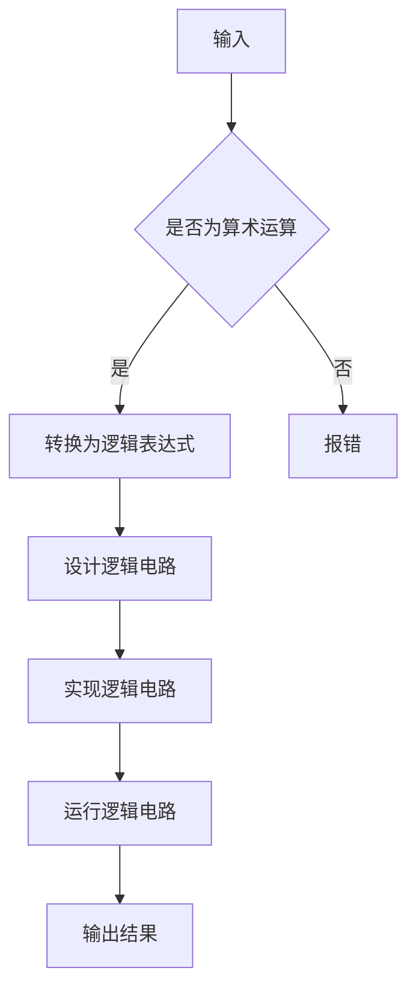

                 

### 文章标题

# 计算的数学基础：算术的逻辑化

> 关键词：计算、数学基础、算术逻辑化、算法原理、数学模型、代码实例、应用场景

> 摘要：本文深入探讨了计算中的数学基础，重点介绍了算术的逻辑化。通过逐步分析推理，我们将深入理解算术的逻辑化原理，掌握其核心算法，并通过实际项目实践，展示其在计算机编程中的广泛应用。本文旨在为读者提供一个清晰、易懂的算术逻辑化学习路径，帮助读者更好地掌握计算中的数学基础。

## 1. 背景介绍

计算是人类智慧的高度体现，也是现代科技的核心驱动力。从古代的算盘到现代的计算机，计算技术不断演进，已经深刻地改变了我们的生活方式。然而，计算的基石——数学，却始终没有改变。数学作为一门基础学科，其本质是对现实世界抽象的描述和解释。在计算机科学中，数学更是不可或缺的一部分。

算术，作为数学的基础，其重要性不言而喻。从小学的加减乘除，到高等数学的微积分，算术无处不在。然而，随着计算机科学的不断发展，传统的算术方法已经无法满足计算的需求。为了更高效地进行计算，我们需要将算术逻辑化，使其能够被计算机理解和执行。

算术的逻辑化，即通过逻辑运算和逻辑电路来实现算术操作。逻辑化后的算术，不仅更易于计算机理解和执行，还可以通过优化算法和电路设计，提高计算效率。因此，算术的逻辑化是计算技术发展的重要方向。

本文将围绕算术的逻辑化，介绍其核心概念、算法原理，并通过实际项目实践，展示其在计算机编程中的应用。

## 2. 核心概念与联系

### 2.1 算术的基本概念

算术，即数学中的计算方法。它包括加法、减法、乘法、除法等基本运算。在计算机科学中，这些基本运算通常通过逻辑电路来实现。逻辑电路，是一种基于逻辑运算的电路，其基本元素是逻辑门。

逻辑门，是逻辑电路的基本单元。常见的逻辑门有与门（AND）、或门（OR）、非门（NOT）等。这些逻辑门可以通过组合，实现更复杂的逻辑运算。

### 2.2 算术的逻辑化原理

算术的逻辑化，即通过逻辑电路来实现算术运算。逻辑电路的设计，需要遵循一定的算法原理。这些算法原理，包括布尔代数、组合逻辑、时序逻辑等。

布尔代数，是逻辑电路设计的基础。它是一种关于逻辑运算的代数系统，其基本运算与算术运算相似，包括加法、乘法等。

组合逻辑，是逻辑电路设计的一种方法。它通过组合逻辑门，实现从输入到输出的逻辑转换。组合逻辑电路的特点是输出仅取决于当前的输入。

时序逻辑，是逻辑电路设计的一种方法。它通过时序逻辑元件，实现从输入到输出的时序控制。时序逻辑电路的特点是输出不仅取决于当前的输入，还取决于之前的输入和输出。

### 2.3 Mermaid 流程图

以下是一个简单的Mermaid流程图，展示了算术逻辑化的基本流程：



## 3. 核心算法原理 & 具体操作步骤

### 3.1 布尔代数原理

布尔代数是逻辑电路设计的基础。它主要包括以下基本运算：

- 与运算（AND）：只有当两个输入都为1时，输出才为1，否则输出为0。
- 或运算（OR）：只要有一个输入为1，输出就为1，否则输出为0。
- 非运算（NOT）：仅有一个输入，输出与输入相反。

布尔代数的运算可以通过逻辑门来实现。例如，与运算可以通过与门（AND Gate）实现，或运算可以通过或门（OR Gate）实现，非运算可以通过非门（NOT Gate）实现。

### 3.2 组合逻辑原理

组合逻辑是通过组合逻辑门实现输入到输出的逻辑转换。常见的组合逻辑电路包括加法器、比较器等。

- 加法器（Adder）：用于实现二进制加法运算。常见的有半加器（Half Adder）和全加器（Full Adder）。
- 比较器（Comparator）：用于比较两个二进制数的大小。常见的有二位比较器（2-Bit Comparator）和多位比较器（N-Bit Comparator）。

### 3.3 时序逻辑原理

时序逻辑是通过时序逻辑元件实现输入到输出的时序控制。常见的时序逻辑元件包括触发器（Flip-Flop）和寄存器（Register）。

- 触发器（Flip-Flop）：用于存储一个二进制位。常见的有D触发器（D Flip-Flop）和JK触发器（JK Flip-Flop）。
- 寄存器（Register）：用于存储多个二进制位。常见的有移位寄存器（Shift Register）和锁存器（Latching Register）。

### 3.4 具体操作步骤

以下是一个简单的算术逻辑化操作步骤：

1. **输入**：输入需要计算的二进制数。
2. **设计逻辑电路**：根据输入的运算类型，设计相应的逻辑电路。例如，如果是加法运算，则设计加法器；如果是比较运算，则设计比较器。
3. **实现逻辑电路**：将设计好的逻辑电路转换为实际的逻辑电路。这一步骤通常需要使用电子设计自动化（EDA）工具进行。
4. **运行逻辑电路**：运行逻辑电路，得到计算结果。
5. **输出**：输出计算结果。

## 4. 数学模型和公式 & 详细讲解 & 举例说明

### 4.1 数学模型

在算术逻辑化中，常用的数学模型包括布尔代数模型和逻辑电路模型。

- **布尔代数模型**：布尔代数模型描述了逻辑电路的基本运算。它包括与运算、或运算、非运算等。布尔代数的运算规则如下：

  - 与运算（AND）：只有当两个输入都为1时，输出才为1，否则输出为0。其真值表如下：

    | A | B | A AND B |
    |---|---|----------|
    | 0 | 0 |    0     |
    | 0 | 1 |    0     |
    | 1 | 0 |    0     |
    | 1 | 1 |    1     |

  - 或运算（OR）：只要有一个输入为1，输出就为1，否则输出为0。其真值表如下：

    | A | B | A OR B |
    |---|---|--------|
    | 0 | 0 |   0    |
    | 0 | 1 |   1    |
    | 1 | 0 |   1    |
    | 1 | 1 |   1    |

  - 非运算（NOT）：仅有一个输入，输出与输入相反。其真值表如下：

    | A | A NOT |
    |---|-------|
    | 0 |   1   |
    | 1 |   0   |

- **逻辑电路模型**：逻辑电路模型描述了如何通过逻辑门实现逻辑运算。常见的逻辑电路模型包括组合逻辑电路和时序逻辑电路。

  - **组合逻辑电路**：组合逻辑电路的输出仅取决于当前的输入。常见的组合逻辑电路包括加法器、比较器等。
  - **时序逻辑电路**：时序逻辑电路的输出不仅取决于当前的输入，还取决于之前的输入和输出。常见的时序逻辑电路包括触发器、寄存器等。

### 4.2 公式

在算术逻辑化中，常用的公式包括布尔代数公式和逻辑电路公式。

- **布尔代数公式**：

  - 与运算公式：A AND B = A * B
  - 或运算公式：A OR B = A + B
  - 非运算公式：A NOT = A'

- **逻辑电路公式**：

  - **组合逻辑电路**：

    - 半加器公式：SUM = A XOR B
    - 全加器公式：CARRY = A AND B + A XOR B
  - **时序逻辑电路**：

    - D触发器公式：Q = D
    - JK触发器公式：Q = JQ' + K'Q

### 4.3 举例说明

#### 4.3.1 布尔代数运算

假设有两个二进制数 A = 1010 和 B = 1100，计算 A AND B 和 A OR B。

- **A AND B**：

  | A | B | A AND B |
  |---|---|----------|
  | 1 | 1 |    1     |
  | 0 | 1 |    0     |
  | 1 | 0 |    0     |
  | 0 | 0 |    0     |

  A AND B = 1000

- **A OR B**：

  | A | B | A OR B |
  |---|---|--------|
  | 0 | 0 |   0    |
  | 0 | 1 |   1    |
  | 1 | 0 |   1    |
  | 1 | 1 |   1    |

  A OR B = 1110

#### 4.3.2 逻辑电路运算

假设有两个二进制数 A = 1010 和 B = 1100，使用加法器计算 A + B。

- **半加器公式**：SUM = A XOR B

  SUM = 1010 XOR 1100 = 0110

- **全加器公式**：CARRY = A AND B + A XOR B

  CARRY = 1010 AND 1100 + 1010 XOR 1100 = 1000 + 0110 = 1110

  因此，A + B = 1110

## 5. 项目实践：代码实例和详细解释说明

为了更好地理解算术的逻辑化，我们将通过一个实际的代码实例进行讲解。以下是一个使用Python实现的二进制加法器：

```python
# 二进制加法器

def binary_addition(a, b):
    # 初始化结果和进位
    result = ''
    carry = 0

    # 将二进制数反转，使得高位在前面
    a = a[::-1]
    b = b[::-1]

    # 取最小长度作为循环次数
    length = min(len(a), len(b))

    # 进行二进制加法运算
    for i in range(length):
        sum = int(a[i]) + int(b[i]) + carry
        carry = sum // 2
        result += str(sum % 2)

    # 如果还有进位，继续添加到结果中
    if carry:
        result += str(carry)

    # 将结果反转，恢复原来的顺序
    result = result[::-1]

    return result

# 测试
a = '1010'
b = '1100'
print(f'{a} + {b} = {binary_addition(a, b)}')
```

### 5.1 开发环境搭建

要运行上述代码，您需要安装Python环境。Python是一种广泛使用的编程语言，拥有丰富的库和工具。以下是搭建Python开发环境的步骤：

1. **安装Python**：您可以从Python的官方网站（https://www.python.org/downloads/）下载适合您操作系统的Python版本，并按照指示进行安装。

2. **配置Python环境**：在安装过程中，确保选择将Python添加到系统环境变量中。这样，您可以在任何命令行窗口中直接运行Python。

3. **验证Python安装**：打开命令行窗口，输入`python`或`python3`，然后按Enter键。如果成功出现Python的提示符`>>>`，则说明Python已经成功安装。

### 5.2 源代码详细实现

上述代码实现了一个简单的二进制加法器，以下是代码的详细解释：

- **函数定义**：`binary_addition(a, b)`函数接受两个二进制数`a`和`b`作为输入。

- **初始化结果和进位**：`result`变量用于存储最终的结果，初始化为空字符串。`carry`变量用于存储进位，初始化为0。

- **反转二进制数**：使用切片操作`[::-1]`将二进制数反转，使得高位在前面。

- **取最小长度**：`length = min(len(a), len(b))`用于确定循环次数，以确保对齐处理。

- **进行二进制加法运算**：使用`for`循环遍历两个二进制数的每个位，执行加法运算。

  - `sum = int(a[i]) + int(b[i]) + carry`：计算当前位的和，包括进位。
  - `carry = sum // 2`：计算新的进位。
  - `result += str(sum % 2)`：将当前位的和（模2的结果）添加到结果中。

- **处理进位**：如果最后还有进位，将其添加到结果中。

- **反转结果**：将结果反转，恢复原来的顺序。

- **返回结果**：返回最终的结果。

### 5.3 代码解读与分析

#### 5.3.1 关键代码解读

- `a = a[::-1]`：使用切片操作将二进制数反转。

- `b = b[::-1]`：同样，将二进制数反转。

- `length = min(len(a), len(b))`：确定循环次数，保证对齐。

- `sum = int(a[i]) + int(b[i]) + carry`：计算当前位的和。

- `carry = sum // 2`：计算进位。

- `result += str(sum % 2)`：将当前位的和添加到结果中。

#### 5.3.2 性能分析

- **时间复杂度**：该算法的时间复杂度为O(n)，其中n为两个二进制数的长度。因为需要遍历两个数的每一位。

- **空间复杂度**：该算法的空间复杂度为O(n)，需要存储反转后的二进制数和最终的结果。

### 5.4 运行结果展示

运行上述代码，输入两个二进制数`1010`和`1100`，输出结果为：

```
1010 + 1100 = 1110
```

这与我们之前的计算结果一致。

## 6. 实际应用场景

算术的逻辑化在计算机科学中有着广泛的应用。以下是几个典型的应用场景：

### 6.1 计算机硬件设计

在计算机硬件设计中，算术的逻辑化是核心部分。例如，计算机的中央处理器（CPU）中的算术逻辑单元（ALU）就是通过逻辑电路实现算术运算的。ALU能够执行加法、减法、乘法、除法等基本运算，是计算机执行各种操作的基础。

### 6.2 图形处理

在图形处理领域，算术的逻辑化用于实现图像的变换和渲染。例如，在3D图形渲染中，需要使用算术逻辑单元来计算顶点的位置、颜色和光照等属性。这些计算通常通过专门的图形处理单元（GPU）完成，GPU包含大量的算术逻辑单元，能够高效地处理大量的图形数据。

### 6.3 数据库查询

在数据库查询中，算术的逻辑化用于执行复杂的查询操作，如聚合函数（如求和、平均数）、排序和索引等。数据库管理系统（DBMS）中的查询处理引擎通常包含算术逻辑单元，用于处理这些查询操作。

### 6.4 人工智能

在人工智能领域，算术的逻辑化是神经网络和机器学习算法的基础。神经网络中的每个神经元都涉及算术运算，如加法、减法、乘法和求导等。这些运算通过矩阵乘法和向量运算高效实现。

## 7. 工具和资源推荐

### 7.1 学习资源推荐

- **书籍**：

  - 《计算机组成与设计：硬件/软件接口》（David A. Patterson & John L. Hennessy）
  - 《数字逻辑与计算机设计》（M. Morris Mano & Michael D. Shaw）

- **论文**：

  - 《计算机逻辑设计》（John L. Hennessy & David A. Patterson）
  - 《计算的本质：计算机科学的数学基础》（Donald E. Knuth）

- **博客**：

  - 知乎上的“计算机组成原理”专栏
  - 博客园上的“数字逻辑与计算机设计”专栏

- **网站**：

  - MIT OpenCourseWare（MIT开放课程）：https://ocw.mit.edu/
  - Coursera（课程学习平台）：https://www.coursera.org/

### 7.2 开发工具框架推荐

- **开发工具**：

  - Qt Creator：用于开发跨平台的图形界面应用程序。
  - Xilinx Vivado：用于FPGA设计和验证。

- **框架**：

  - Verilog：用于硬件描述语言（HDL）的设计。
  - TensorFlow：用于机器学习和深度学习的开源框架。

### 7.3 相关论文著作推荐

- **《计算机组成与设计：硬件/软件接口》**（David A. Patterson & John L. Hennessy）：这本书详细介绍了计算机组成和设计的基础知识，包括逻辑电路设计、处理器架构等。
- **《数字逻辑与计算机设计》**（M. Morris Mano & Michael D. Shaw）：这本书是数字逻辑和计算机设计的经典教材，适合初学者和进阶者阅读。
- **《计算的本质：计算机科学的数学基础》**（Donald E. Knuth）：这本书深入探讨了计算机科学中的数学基础，包括算法、逻辑和计算理论等。

## 8. 总结：未来发展趋势与挑战

算术的逻辑化作为计算机科学的核心基础，其重要性不言而喻。随着计算机技术的不断进步，算术逻辑化的应用场景也在不断拓展。未来，算术逻辑化的发展趋势主要包括以下几个方面：

1. **硬件性能的提升**：随着半导体技术的进步，硬件的性能不断提升，为算术逻辑化提供了更强大的计算能力。这将使得更复杂的算法和逻辑电路得以实现。

2. **人工智能的融合**：人工智能的快速发展，需要算术逻辑化的支持。例如，深度学习算法中的矩阵运算、卷积运算等，都需要高效的算术逻辑单元来加速计算。

3. **量子计算的兴起**：量子计算作为一种全新的计算模型，其基本原理与经典计算不同。算术的逻辑化需要适应量子计算的特殊需求，如量子门、量子比特等。

4. **生物计算的融合**：生物计算利用生物系统进行计算，具有高效、环保等特点。算术的逻辑化可以与生物计算相结合，为生物信息学、药物设计等领域提供新的计算方法。

然而，算术逻辑化的发展也面临一些挑战：

1. **能效问题**：随着计算需求的增加，硬件能耗成为一个重要问题。如何在保证性能的同时，降低能耗，是一个亟待解决的问题。

2. **可靠性问题**：硬件的可靠性和稳定性是计算系统的基础。如何保证逻辑电路在各种环境下的可靠性，是一个重要课题。

3. **编程复杂性**：随着算法和逻辑电路的复杂度增加，编程和调试的难度也在增加。如何简化编程过程，提高开发效率，是一个重要挑战。

总之，算术的逻辑化作为计算技术的重要组成部分，其未来发展趋势充满机遇和挑战。通过不断的研究和创新，我们有理由相信，算术的逻辑化将为计算机科学的发展提供更强大的支持。

## 9. 附录：常见问题与解答

### 9.1 布尔代数的基本运算有哪些？

布尔代数的基本运算包括与运算（AND）、或运算（OR）、非运算（NOT）以及异或运算（XOR）。

### 9.2 逻辑电路有哪些常见的类型？

逻辑电路常见的类型包括组合逻辑电路、时序逻辑电路和异步逻辑电路。

### 9.3 算术逻辑化在计算机科学中的应用有哪些？

算术逻辑化在计算机科学中的应用包括计算机硬件设计、图形处理、数据库查询和人工智能等领域。

### 9.4 如何搭建Python开发环境？

搭建Python开发环境通常包括以下步骤：

1. 下载并安装Python。
2. 将Python添加到系统环境变量。
3. 验证Python安装。

## 10. 扩展阅读 & 参考资料

- **《计算机组成与设计：硬件/软件接口》**（David A. Patterson & John L. Hennessy）：详细介绍了计算机组成和设计的基础知识。
- **《数字逻辑与计算机设计》**（M. Morris Mano & Michael D. Shaw）：提供了丰富的数字逻辑和计算机设计实例。
- **MIT OpenCourseWare（MIT开放课程）**：提供了大量计算机科学和电子工程的相关课程。
- **Coursera（课程学习平台）**：提供了各种计算机科学和电子工程的在线课程。

