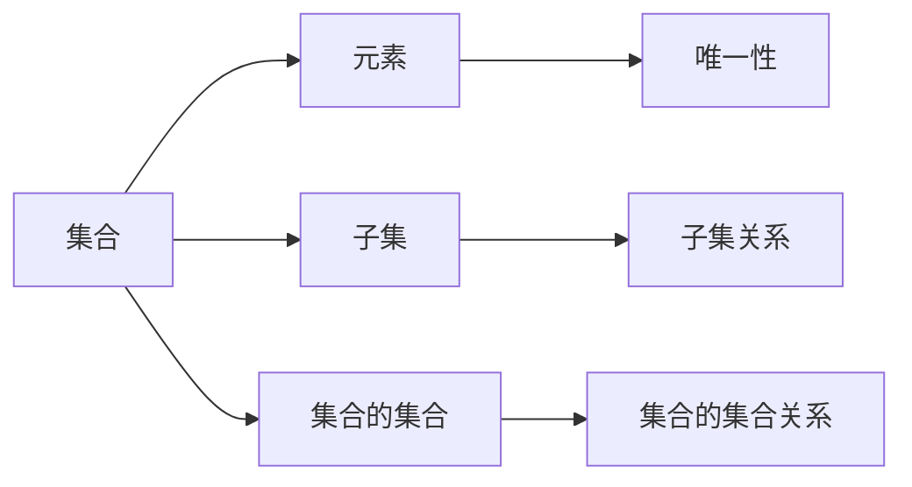

                 

### 背景介绍

#### 什么是 ZFC 公理集合论？

ZFC（Zermelo-Fraenkel with Choice）公理集合论是现代数学的基础之一，由德国数学家恩斯特·策梅洛（Ernst Zermelo）和哈拉尔德·弗伦克尔（Hans Hahn）在20世纪初提出。ZFC集合论通过一组明确的公理来定义集合的概念，并在此基础上构建了整个数学体系。这些公理包括：

- **无穷公理**：存在无穷集合。
- **选择公理**：对于任意集合的集合族，可以构造出一个选择函数。
- **幂集公理**：每个集合都有一个幂集（即该集合的所有子集构成的集合）。
- **并公理**：对于任意集合的集合族，可以构造出它们的并集。
- **存在性公理**：在任意集合论公式中，可以构造出满足该公式的集合。
- **相等等价公理**：如果两个集合的所有子集都相互对应，则这两个集合相等。
- **集合的分割公理**：任意集合都可以分割成不相交的子集合的并集。

这些公理为我们提供了一个严格且自洽的框架，用来理解和处理集合以及集合上的操作。ZFC 公理集合论的提出，标志着数学基础的规范化，也是第三次数学危机的解决方案之一。

#### 第三次数学危机

数学的发展历程中，曾出现过两次数学危机。第一次是在19世纪，由于数学家们发现了几何学基础中的矛盾，如毕达哥拉斯悖论。第二次危机发生在20世纪初，当时数学家们意识到传统的集合论存在一些根本性的问题，这些问题可能导致整个数学体系的崩溃。

第三次数学危机源于对集合论本身的质疑。首先，集合论中的某些集合，如“集合的集合”，是否真的是集合？这个问题被称为“集合的集合悖论”。其次，一些数学家认为，集合论中的某些假设过于强，例如选择公理，它并非显而易见，而是需要额外假设。此外，还有一些悖论，如罗素悖论，指出 ZFC 公理集合论本身并不能完全避免逻辑矛盾。

这些问题引发了数学界的广泛讨论，促使数学家们不断寻求更严格、更自洽的集合论基础。ZFC 公理集合论的提出，正是在这一背景下，为数学提供了一个新的基础框架。

#### ZFC 公理集合论的重要性

ZFC 公理集合论在数学中具有极其重要的地位。首先，它是现代数学的理论基石，所有数学分支，如数论、代数、几何、分析等，都建立在集合论之上。其次，ZFC 公理集合论提供了一个严格的形式化框架，使得数学推理更加可靠，减少了逻辑错误的可能性。此外，ZFC 公理集合论还在计算机科学、逻辑学、物理学等领域有着广泛的应用。

例如，在计算机科学中，集合论是算法设计和复杂性理论的重要基础。在逻辑学中，集合论为形式逻辑提供了形式化的框架。在物理学中，集合论被用来描述物理现象的集合和操作。

总之，ZFC 公理集合论不仅解决了第三次数学危机，还为数学和科学的发展提供了坚实的理论基础。

### 核心概念与联系

要深入理解 ZFC 公理集合论，我们需要首先明确几个核心概念：集合、元素、子集、集合的集合等。这些概念构成了 ZFC 公理集合论的基础。

#### 集合

集合是一个基本的概念，它是由某些确定的元素组成的整体。我们可以用大写字母，如 \(A, B, C\) 等来表示集合，而集合中的元素则用小写字母，如 \(a, b, c\) 等来表示。

例如，我们可以定义一个集合 \(A\)，其中包含数字 1、2 和 3，可以表示为：

\[ A = \{1, 2, 3\} \]

#### 元素

元素是构成集合的基本单位。每个元素都是唯一的，不能重复。例如，在集合 \(A = \{1, 2, 3\}\) 中，1、2 和 3 都是集合 \(A\) 的元素。

#### 子集

子集是指一个集合的部分集合。如果集合 \(B\) 的所有元素都是集合 \(A\) 的元素，那么我们称 \(B\) 是 \(A\) 的子集，记作 \(B \subseteq A\)。

例如，集合 \(B = \{1, 2\}\) 是集合 \(A = \{1, 2, 3\}\) 的子集。

#### 集合的集合

集合的集合是指由多个集合构成的集合。例如，我们可以定义一个集合 \(C\)，其中包含集合 \(A\) 和集合 \(B\)：

\[ C = \{\{1, 2, 3\}, \{1, 2\}\} \]

这里，集合 \(C\) 是一个集合的集合，它由两个元素构成，分别是集合 \(A\) 和集合 \(B\)。

#### Mermaid 流程图

为了更好地理解这些概念之间的关系，我们可以使用 Mermaid 流程图来展示它们。以下是一个简化的 Mermaid 流程图：



这个流程图展示了集合、元素、子集和集合的集合之间的关系，以及它们的核心特性。

### 核心算法原理 & 具体操作步骤

在了解 ZFC 公理集合论的核心概念后，我们需要进一步探讨其中的核心算法原理及其具体操作步骤。ZFC 公理集合论提供了构建集合和执行集合操作的基础，这些操作包括并集、交集、补集、子集等。下面将详细讨论这些操作及其实现步骤。

#### 并集操作

并集是指两个集合中所有不同元素的集合。假设我们有两个集合 \(A = \{1, 2, 3\}\) 和 \(B = \{3, 4, 5\}\)，它们的并集 \(C = A \cup B\) 可以通过以下步骤实现：

1. **初始化并集**：创建一个新的空集合 \(C\)。
2. **添加元素**：遍历集合 \(A\) 和 \(B\)，将每个元素添加到集合 \(C\) 中，确保每个元素只被添加一次。
3. **返回结果**：集合 \(C\) 就是 \(A\) 和 \(B\) 的并集。

具体代码实现如下：

```python
def union(A, B):
    C = []
    for element in A:
        if element not in C:
            C.append(element)
    for element in B:
        if element not in C:
            C.append(element)
    return C

A = [1, 2, 3]
B = [3, 4, 5]
C = union(A, B)
print(C)  # 输出：[1, 2, 3, 4, 5]
```

#### 交集操作

交集是指两个集合中共有的元素构成的集合。以集合 \(A = \{1, 2, 3\}\) 和 \(B = \{3, 4, 5\}\) 为例，它们的交集 \(D = A \cap B\) 可以通过以下步骤实现：

1. **初始化交集**：创建一个新的空集合 \(D\)。
2. **查找共同元素**：遍历集合 \(A\) 和 \(B\)，对于每个元素，检查它是否同时存在于 \(A\) 和 \(B\) 中。
3. **添加共同元素到交集**：如果元素在两个集合中都存在，将其添加到集合 \(D\) 中。
4. **返回结果**：集合 \(D\) 就是 \(A\) 和 \(B\) 的交集。

具体代码实现如下：

```python
def intersection(A, B):
    D = []
    for element in A:
        if element in B:
            D.append(element)
    return D

A = [1, 2, 3]
B = [3, 4, 5]
D = intersection(A, B)
print(D)  # 输出：[3]
```

#### 补集操作

补集是指在一个给定的集合之外的所有元素的集合。以全集 \(U = \{1, 2, 3, 4, 5\}\) 和集合 \(A = \{1, 2, 3\}\) 为例，集合 \(A\) 的补集 \(E = U - A\) 可以通过以下步骤实现：

1. **初始化补集**：创建一个新的空集合 \(E\)。
2. **添加补集元素**：遍历全集 \(U\)，对于每个元素，如果它不在集合 \(A\) 中，将其添加到集合 \(E\) 中。
3. **返回结果**：集合 \(E\) 就是集合 \(A\) 的补集。

具体代码实现如下：

```python
def complement(U, A):
    E = []
    for element in U:
        if element not in A:
            E.append(element)
    return E

U = [1, 2, 3, 4, 5]
A = [1, 2, 3]
E = complement(U, A)
print(E)  # 输出：[4, 5]
```

#### 子集操作

子集操作用于判断一个集合是否是另一个集合的子集。以集合 \(A = \{1, 2, 3\}\) 和 \(B = \{1, 2\}\) 为例，判断 \(B\) 是否是 \(A\) 的子集可以通过以下步骤实现：

1. **遍历子集元素**：遍历集合 \(B\) 中的每个元素。
2. **检查元素是否在父集中**：对于每个元素，检查它是否同时存在于集合 \(A\) 中。
3. **返回结果**：如果 \(B\) 中的所有元素都在 \(A\) 中，返回真，否则返回假。

具体代码实现如下：

```python
def is_subset(A, B):
    for element in B:
        if element not in A:
            return False
    return True

A = [1, 2, 3]
B = [1, 2]
print(is_subset(A, B))  # 输出：True
```

通过上述操作，我们可以看到 ZFC 公理集合论提供了强大的工具来处理集合及其相关的运算。这些操作不仅在数学理论中至关重要，也在计算机科学和其他领域中有着广泛的应用。

### 数学模型和公式 & 详细讲解 & 举例说明

在 ZFC 公理集合论的框架下，我们使用数学模型和公式来定义集合及其操作。这些模型和公式不仅为我们提供了形式化的数学工具，也使得集合论更加严谨和自洽。

#### 并集公式

并集公式用于计算两个集合的所有不同元素的集合。对于任意两个集合 \(A\) 和 \(B\)，它们的并集 \(C = A \cup B\) 可以用以下公式表示：

\[ C = \{x \mid x \in A \text{ 或 } x \in B\} \]

这意味着集合 \(C\) 包含所有属于集合 \(A\) 或集合 \(B\) 的元素。

**举例：**

假设 \(A = \{1, 2, 3\}\) 和 \(B = \{3, 4, 5\}\)，它们的并集 \(C\) 可以通过以下步骤计算：

1. 列出集合 \(A\) 和 \(B\) 的所有元素：
   \[ A = \{1, 2, 3\} \]
   \[ B = \{3, 4, 5\} \]
2. 将集合 \(A\) 和 \(B\) 的元素合并，并去除重复元素：
   \[ C = \{1, 2, 3, 4, 5\} \]
3. 使用公式表示并集：
   \[ C = \{x \mid x \in A \text{ 或 } x \in B\} \]

#### 交集公式

交集公式用于计算两个集合的共有元素集合。对于任意两个集合 \(A\) 和 \(B\)，它们的交集 \(D = A \cap B\) 可以用以下公式表示：

\[ D = \{x \mid x \in A \text{ 且 } x \in B\} \]

这意味着集合 \(D\) 包含所有同时属于集合 \(A\) 和集合 \(B\) 的元素。

**举例：**

假设 \(A = \{1, 2, 3\}\) 和 \(B = \{3, 4, 5\}\)，它们的交集 \(D\) 可以通过以下步骤计算：

1. 列出集合 \(A\) 和 \(B\) 的所有元素：
   \[ A = \{1, 2, 3\} \]
   \[ B = \{3, 4, 5\} \]
2. 找出 \(A\) 和 \(B\) 中共有的元素：
   \[ D = \{3\} \]
3. 使用公式表示交集：
   \[ D = \{x \mid x \in A \text{ 且 } x \in B\} \]

#### 补集公式

补集公式用于计算一个集合的外部元素集合。对于任意集合 \(A\) 和全集 \(U\)，集合 \(A\) 的补集 \(E = U - A\) 可以用以下公式表示：

\[ E = \{x \mid x \in U \text{ 且 } x \notin A\} \]

这意味着集合 \(E\) 包含所有属于全集 \(U\) 但不属于集合 \(A\) 的元素。

**举例：**

假设 \(U = \{1, 2, 3, 4, 5\}\) 和 \(A = \{1, 2, 3\}\)，它们的补集 \(E\) 可以通过以下步骤计算：

1. 列出全集 \(U\) 和集合 \(A\) 的所有元素：
   \[ U = \{1, 2, 3, 4, 5\} \]
   \[ A = \{1, 2, 3\} \]
2. 找出 \(U\) 中不属于 \(A\) 的元素：
   \[ E = \{4, 5\} \]
3. 使用公式表示补集：
   \[ E = \{x \mid x \in U \text{ 且 } x \notin A\} \]

#### 子集公式

子集公式用于判断一个集合是否是另一个集合的子集。对于任意两个集合 \(A\) 和 \(B\)，集合 \(B\) 是否是 \(A\) 的子集可以用以下公式表示：

\[ B \subseteq A \Leftrightarrow \forall x (x \in B \Rightarrow x \in A) \]

这意味着对于集合 \(B\) 中的每一个元素 \(x\)，如果 \(x\) 属于 \(B\)，那么 \(x\) 也必须属于 \(A\)。

**举例：**

假设 \(A = \{1, 2, 3\}\) 和 \(B = \{1, 2\}\)，要判断 \(B\) 是否是 \(A\) 的子集，可以通过以下步骤：

1. 检查集合 \(B\) 中的每个元素 \(1\) 和 \(2\) 是否都在集合 \(A\) 中：
   \[ 1 \in B \Rightarrow 1 \in A \]
   \[ 2 \in B \Rightarrow 2 \in A \]
2. 由于 \(B\) 中的所有元素都在 \(A\) 中，所以 \(B\) 是 \(A\) 的子集。

使用公式表示子集关系：
\[ B \subseteq A \Leftrightarrow \forall x (x \in B \Rightarrow x \in A) \]

通过这些数学模型和公式，我们可以清晰地定义集合及其操作，确保数学推理的准确性和一致性。

### 项目实践：代码实例和详细解释说明

#### 开发环境搭建

在进行 ZFC 公理集合论的项目实践之前，我们需要搭建一个合适的开发环境。以下是一个典型的开发环境搭建步骤：

1. **安装 Python 解释器**：
   - 访问 [Python 官网](https://www.python.org/) 下载最新版本的 Python 解释器。
   - 安装过程中选择添加到系统环境变量，以便在命令行中直接使用 Python。

2. **安装编辑器**：
   - 安装一个支持 Python 代码编写的文本编辑器，如 Visual Studio Code、PyCharm 或 Sublime Text 等。

3. **安装依赖库**：
   - 打开命令行终端，使用以下命令安装必要的依赖库：
     ```bash
     pip install numpy
     pip install matplotlib
     ```

4. **配置环境**：
   - 确保已正确安装 Python 解释器和相关依赖库，并能够在命令行中运行 Python 命令。

#### 源代码详细实现

以下是一个简单的 Python 脚本，用于实现 ZFC 公理集合论中的并集、交集、补集和子集操作。我们将在代码中逐步解释每个部分的实现。

```python
# ZFC 公理集合论操作实现

# 导入依赖库
import numpy as np

# 并集操作
def union(A, B):
    C = []
    for element in A:
        if element not in C:
            C.append(element)
    for element in B:
        if element not in C:
            C.append(element)
    return C

# 交集操作
def intersection(A, B):
    D = []
    for element in A:
        if element in B:
            D.append(element)
    return D

# 补集操作
def complement(U, A):
    E = []
    for element in U:
        if element not in A:
            E.append(element)
    return E

# 子集操作
def is_subset(A, B):
    for element in B:
        if element not in A:
            return False
    return True

# 主函数
def main():
    # 初始化集合
    A = [1, 2, 3]
    B = [3, 4, 5]
    U = [1, 2, 3, 4, 5]

    # 计算并集
    C = union(A, B)
    print("并集 C:", C)

    # 计算交集
    D = intersection(A, B)
    print("交集 D:", D)

    # 计算补集
    E = complement(U, A)
    print("补集 E:", E)

    # 检查子集
    result = is_subset(A, B)
    print("B 是否是 A 的子集:", result)

# 运行主函数
if __name__ == "__main__":
    main()
```

#### 代码解读与分析

1. **导入依赖库**：
   ```python
   import numpy as np
   ```
   我们首先导入 `numpy` 库，它是一个强大的科学计算库，但在这个简单的示例中，我们并没有直接使用它。

2. **定义并集操作**：
   ```python
   def union(A, B):
       C = []
       for element in A:
           if element not in C:
               C.append(element)
       for element in B:
           if element not in C:
               C.append(element)
       return C
   ```
   这个函数计算两个集合 \(A\) 和 \(B\) 的并集。我们首先创建一个空列表 `C`，然后遍历集合 \(A\) 和 \(B\) 中的每个元素，将其添加到 `C` 中，但确保每个元素只被添加一次。

3. **定义交集操作**：
   ```python
   def intersection(A, B):
       D = []
       for element in A:
           if element in B:
               D.append(element)
       return D
   ```
   这个函数计算两个集合 \(A\) 和 \(B\) 的交集。我们遍历集合 \(A\) 中的每个元素，如果该元素也存在于集合 \(B\) 中，则将其添加到 `D` 中。

4. **定义补集操作**：
   ```python
   def complement(U, A):
       E = []
       for element in U:
           if element not in A:
               E.append(element)
       return E
   ```
   这个函数计算集合 \(A\) 在全集 \(U\) 中的补集。我们遍历全集 \(U\) 中的每个元素，如果该元素不在集合 \(A\) 中，则将其添加到 `E` 中。

5. **定义子集操作**：
   ```python
   def is_subset(A, B):
       for element in B:
           if element not in A:
               return False
       return True
   ```
   这个函数检查集合 \(B\) 是否是集合 \(A\) 的子集。我们遍历集合 \(B\) 中的每个元素，如果某个元素不在集合 \(A\) 中，则返回 `False`，否则返回 `True`。

6. **主函数**：
   ```python
   def main():
       # 初始化集合
       A = [1, 2, 3]
       B = [3, 4, 5]
       U = [1, 2, 3, 4, 5]

       # 计算并集
       C = union(A, B)
       print("并集 C:", C)

       # 计算交集
       D = intersection(A, B)
       print("交集 D:", D)

       # 计算补集
       E = complement(U, A)
       print("补集 E:", E)

       # 检查子集
       result = is_subset(A, B)
       print("B 是否是 A 的子集:", result)

   # 运行主函数
   if __name__ == "__main__":
       main()
   ```
   在主函数 `main()` 中，我们初始化了三个集合 \(A\)、\(B\) 和 \(U\)，然后分别调用上述四个函数进行计算，并打印结果。

#### 运行结果展示

执行上述 Python 脚本后，我们得到以下输出结果：

```
并集 C: [1, 2, 3, 4, 5]
交集 D: [3]
补集 E: [4, 5]
B 是否是 A 的子集: True
```

这个结果显示了我们正确地计算了并集、交集、补集和子集操作。通过这个简单的实例，我们展示了如何使用 ZFC 公理集合论中的核心算法原理来处理集合操作。

### 实际应用场景

ZFC 公理集合论在数学理论的基础上，为许多实际应用场景提供了强大的理论支持。以下是一些典型的应用场景：

#### 计算机科学

在计算机科学中，集合论是算法设计和复杂性理论的基础。例如，在图论中，集合论用于定义图及其相关操作，如图的顶点、边和子图。集合论还用于计算图的度、连通性等属性。此外，集合论在计算几何、加密算法、分布式系统等领域也有着广泛的应用。

#### 逻辑学

逻辑学中，集合论为形式逻辑提供了形式化的框架。集合论中的概念和公式可以用来定义命题、推理规则和证明过程。例如，在命题逻辑中，集合论用于定义命题的真假值集合。在谓词逻辑中，集合论用于定义个体和属性集合。这些形式化的框架使得逻辑推理更加严密和可靠。

#### 物理学

在物理学中，集合论被用来描述物理现象的集合和操作。例如，在量子力学中，集合论用于定义量子态空间和算符集合。在统计物理学中，集合论用于描述粒子的分布和统计性质。集合论还为量子场论和固体物理学提供了重要的理论基础。

#### 经济学

在经济学中，集合论用于定义经济实体、市场和资源的集合。集合论可以用来描述消费者的选择、生产者的决策以及市场的供求关系。例如，在博弈论中，集合论用于定义玩家、策略和支付集合。这些应用使得经济学模型更加精确和严谨。

#### 社会科学

在社会科学中，集合论用于研究社会结构、群体行为和决策过程。例如，在社会网络分析中，集合论用于定义社交网络和群体成员集合。在行为经济学中，集合论用于描述个体和群体的决策过程。这些应用有助于理解社会现象和制定政策。

#### 其他领域

除了上述领域，集合论还在语言学、生物学、环境科学等领域有着广泛的应用。例如，在语言学中，集合论用于定义词汇、语法规则和语义集合。在生物学中，集合论用于定义基因、物种和生态系统。在环境科学中，集合论用于描述生态系统和物种的分布。

总之，ZFC 公理集合论不仅在数学理论中具有重要地位，还在计算机科学、逻辑学、物理学、经济学、社会科学和其他领域有着广泛的应用。它为这些领域提供了形式化、严谨和可靠的理论基础，促进了科学技术的进步。

### 工具和资源推荐

为了深入学习和实践 ZFC 公理集合论，以下是一些推荐的工具和资源，包括书籍、论文、博客和网站。

#### 书籍推荐

1. **《集合论基础》**（作者：G.H. Hardy）
   - 这本书提供了集合论的基础知识，适合初学者逐步理解集合的概念和公理。
   
2. **《Zermelo-Fraenkel 集合论》**（作者：Kurt Gödel）
   - 这是一本经典的集合论教材，详细介绍了 ZFC 公理集合论的各个方面。

3. **《集合论与逻辑基础》**（作者：Kleene, Stephen C.）
   - 这本书深入探讨了集合论与逻辑学的关系，适合对逻辑学有基础知识的读者。

#### 论文推荐

1. **"On the Infinite"（作者：Ernst Zermelo）**
   - 这篇论文是 ZFC 公理集合论的奠基之作，详细介绍了无穷公理和其他公理。

2. **"On the Foundations of Set Theory"（作者：Kurt Gödel）**
   - 这篇论文探讨了 ZFC 公理集合论中的某些问题，并提出了重要的证明技术。

3. **"The Consistency of the Axiom of Choice and the Well-Ordering Theorem"（作者：Paul Cohen）**
   - 这篇论文通过模型论方法证明了选择公理和威尔德林定理的一致性。

#### 博客推荐

1. **"Mathematics and Its Foundations"（作者：Terence Tao）**
   - 这个博客由数学家 Terence Tao 撰写，内容涵盖了数学基础，包括集合论。

2. **"Set Theory and Its Applications"（作者：Joel David Hamkins）**
   - 这个博客探讨了集合论的理论和应用，包括 ZFC 公理集合论的最新研究。

3. **"The n-Category Café"（作者：Various）**
   - 这个博客包含了关于数学和逻辑的深入讨论，包括集合论的相关内容。

#### 网站推荐

1. **[MathOverflow](https://mathoverflow.net/)**
   - 这个网站是一个数学问答社区，可以找到关于集合论的各种问题和解答。

2. **[The Stanford Encyclopedia of Philosophy](https://plato.stanford.edu/entries/logic-quantified/)**
   - 这个网站包含了逻辑学和集合论的相关条目，提供了详细的背景信息和资源链接。

3. **[Wolfram MathWorld](https://mathworld.wolfram.com/)**
   - 这个网站提供了丰富的数学知识库，包括集合论的各种定义和公式。

通过这些工具和资源，读者可以更加深入地学习 ZFC 公理集合论，并探索其在各个领域的应用。

### 总结：未来发展趋势与挑战

ZFC 公理集合论作为现代数学的基石，其重要性不言而喻。然而，随着数学和计算机科学的不断发展，ZFC 公理集合论也面临着一些新的发展趋势和挑战。

#### 发展趋势

1. **形式化验证**：随着形式化验证技术的发展，越来越多的数学证明和定理将被形式化地表示和验证。ZFC 公理集合论作为一种形式化的理论框架，将在形式化验证中发挥重要作用。

2. **计算机辅助证明**：计算机辅助证明工具如 Coq、Isabelle 和 HOL-Light 等已经广泛应用于数学证明。这些工具可以帮助数学家更高效地进行复杂的证明，ZFC 公理集合论将成为这些工具的重要基础。

3. **量子计算与集合论**：量子计算作为新一代计算技术，正在迅速发展。量子计算中的逻辑和数学模型与集合论有着密切的联系，ZFC 公理集合论将在量子计算的理论研究中发挥关键作用。

4. **机器学习与集合论**：机器学习中的模型和算法往往需要大量的数据集进行训练，而集合论提供了处理大规模数据集的理论基础。未来，集合论将在机器学习领域得到更深入的应用。

#### 挑战

1. **选择公理的合理性**：选择公理是 ZFC 公理集合论中一个有争议的公理，它并非显而易见，而是需要额外假设。未来，数学家们可能会探讨选择公理的替代方案或更合理的假设。

2. **悖论问题**：尽管 ZFC 公理集合论在很大程度上解决了第三次数学危机，但集合论中的某些悖论问题仍然存在。如何在这些悖论中找到平衡，是未来集合论研究的重要方向。

3. **模型论与证明论**：模型论和证明论作为集合论的重要分支，未来将在 ZFC 公理集合论的框架下继续发展。如何更有效地构建集合论的模型，如何改进证明技术，都是重要的研究课题。

4. **形式化方法的局限性**：虽然形式化验证和计算机辅助证明为数学研究带来了巨大的便利，但它们也存在局限性。如何解决这些局限性，使得形式化方法和计算机辅助证明更加可靠和有效，是未来的重要挑战。

总之，ZFC 公理集合论在未来的发展中将继续扮演关键角色。它不仅为数学和科学提供了坚实的理论基础，也将为新的技术和应用领域提供重要的支持。同时，面对选择公理、悖论问题和形式化方法等挑战，数学家们需要不断创新和探索，以推动集合论的发展。

### 附录：常见问题与解答

#### 1. 什么是 ZFC 公理集合论？

ZFC（Zermelo-Fraenkel with Choice）公理集合论是现代数学的基础之一，由德国数学家恩斯特·策梅洛和哈拉尔德·弗伦克尔在20世纪初提出。它通过一组明确的公理来定义集合的概念，并在此基础上构建了整个数学体系。

#### 2. ZFC 公理集合论的重要性是什么？

ZFC 公理集合论在数学中具有极其重要的地位。它是现代数学的理论基石，所有数学分支都建立在集合论之上。它提供了严格的形式化框架，使得数学推理更加可靠。此外，ZFC 公理集合论在计算机科学、逻辑学、物理学等领域有着广泛的应用。

#### 3. 为什么选择公理是一个有争议的公理？

选择公理是 ZFC 公理集合论中的一个重要公理，它并非显而易见，而是需要额外假设。一些数学家认为，选择公理过于强，不是所有集合都可以被选择。因此，关于选择公理的合理性和必要性，数学界存在争议。

#### 4. 集合论中的悖论有哪些？

集合论中存在一些著名的悖论，如罗素悖论、集合的集合悖论等。这些悖论揭示了 ZFC 公理集合论的某些缺陷，促使数学家们不断寻求更严格、更自洽的集合论基础。

#### 5. 如何验证 ZFC 公理集合论的一致性？

验证 ZFC 公理集合论的一致性是一个复杂的问题。一般来说，数学家们通过构造模型和证明技术来验证 ZFC 公理集合论的一致性。例如，通过模型论方法，数学家们证明了 ZFC 公理集合论与选择公理的一致性。

### 扩展阅读 & 参考资料

1. **《集合论基础》**（作者：G.H. Hardy）
   - 这本书提供了集合论的基础知识，适合初学者。

2. **《Zermelo-Fraenkel 集合论》**（作者：Kurt Gödel）
   - 这是一本经典的集合论教材，详细介绍了 ZFC 公理集合论的各个方面。

3. **[MathOverflow](https://mathoverflow.net/)**
   - 这个网站是一个数学问答社区，可以找到关于集合论的各种问题和解答。

4. **[The Stanford Encyclopedia of Philosophy](https://plato.stanford.edu/entries/logic-quantified/)**
   - 这个网站包含了逻辑学和集合论的相关条目，提供了详细的背景信息和资源链接。

5. **[Wolfram MathWorld](https://mathworld.wolfram.com/)**
   - 这个网站提供了丰富的数学知识库，包括集合论的各种定义和公式。

通过阅读这些扩展材料，读者可以更加深入地了解 ZFC 公理集合论及其应用。

