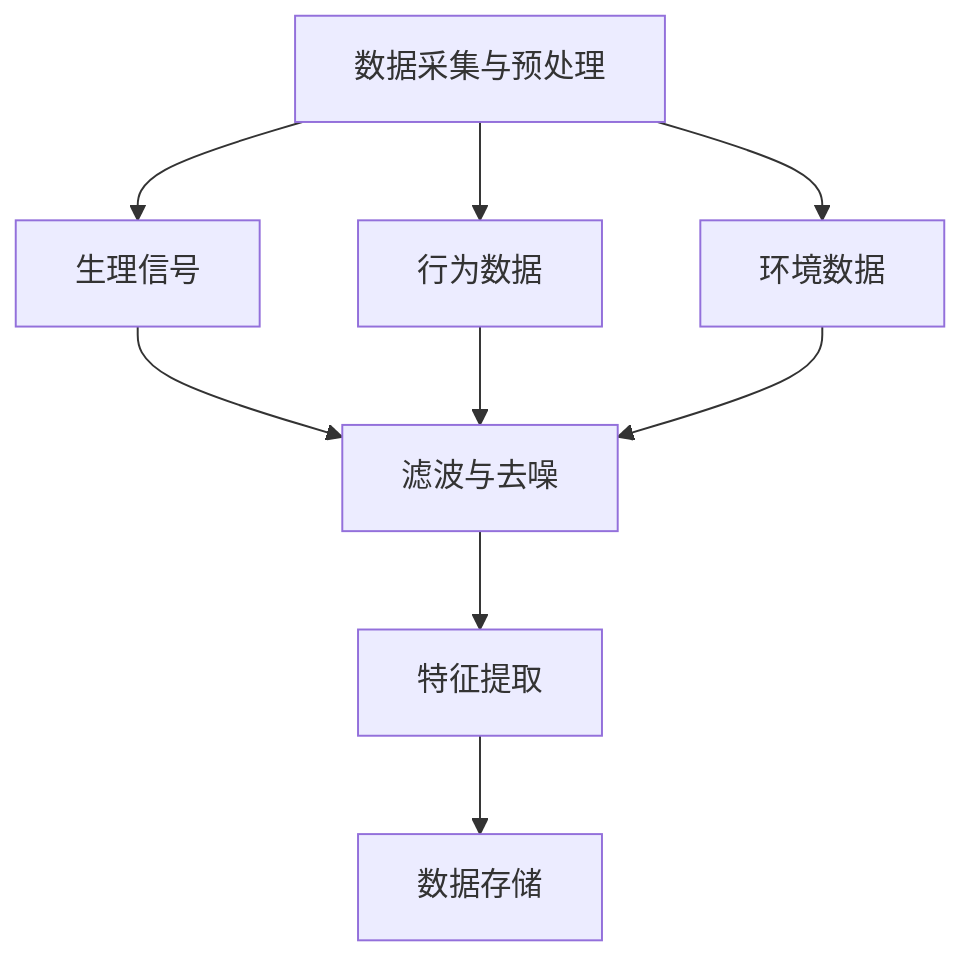
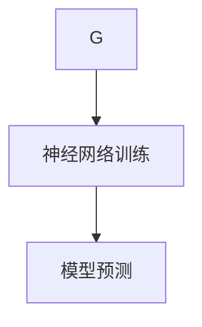
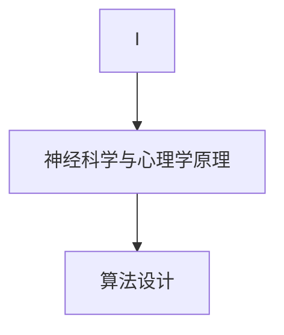
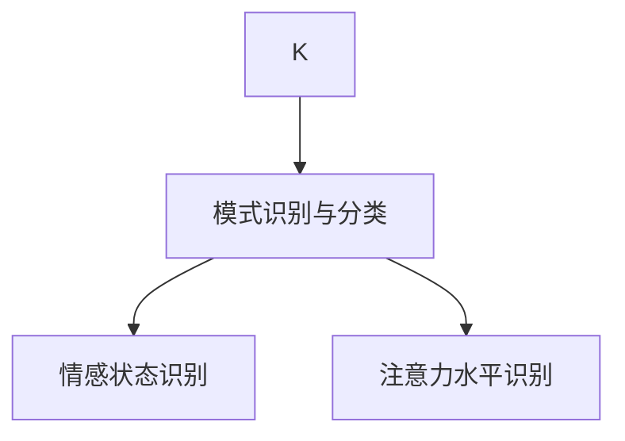
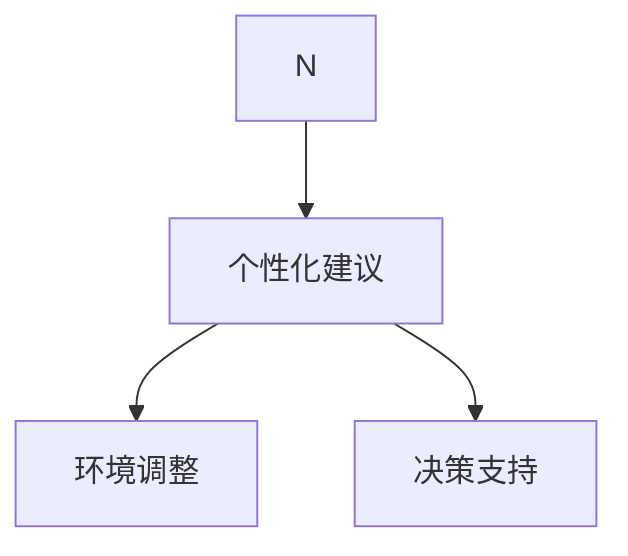
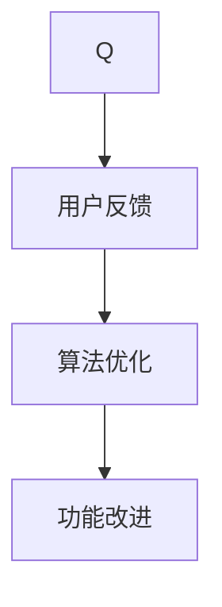
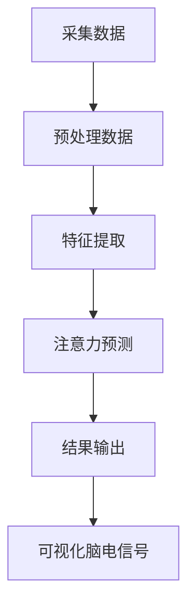

                 

### 1. 背景介绍

在当今这个数字化时代，人工智能（AI）技术正以惊人的速度发展和普及，逐渐渗透到我们日常生活的各个方面。从智能家居、自动驾驶、医疗诊断到金融分析、内容推荐和自然语言处理，AI已经成为了推动社会进步和生产力提升的重要力量。然而，随着AI技术的不断演进，人们对于高效思维的追求也在日益增长。在这个背景下，“认知增强套件”（Cognitive Enhancement Suite）的概念应运而生。

认知增强套件是一种综合性的技术解决方案，旨在通过AI和其他先进技术手段，提升人类思维能力和工作效率。它包括了一系列的工具和方法，如思维导图、记忆训练、注意力集中技术、情感识别与调控、自动化决策支持系统等。这些工具和方法通过深入理解人类大脑的工作原理，针对性地优化思维过程，帮助用户更好地处理信息、解决问题和做出决策。

本文将围绕认知增强套件在AI时代的思维升级进行探讨，通过以下几个核心部分展开：

1. **核心概念与联系**：介绍认知增强套件的核心概念及其相互关系，并通过Mermaid流程图展示整体架构。
2. **核心算法原理与操作步骤**：详细解析认知增强套件中关键算法的工作原理，以及具体实施步骤。
3. **数学模型和公式**：阐述支持认知增强套件的数学模型和公式，并进行举例说明。
4. **项目实践**：通过代码实例展示认知增强套件的实际应用，并详细解释说明。
5. **实际应用场景**：探讨认知增强套件在不同领域的应用场景和潜在价值。
6. **工具和资源推荐**：推荐相关学习资源、开发工具和论文著作，帮助读者深入了解和掌握认知增强套件。
7. **总结**：总结认知增强套件在未来的发展趋势和面临的挑战。

通过这篇文章，我们希望能够帮助读者全面了解认知增强套件的工作原理和应用价值，为AI时代的思维升级提供有益的指导和建议。

### 1.1 认知增强套件的发展历史

认知增强套件的发展历史可以追溯到上世纪末和本世纪初，当时计算机科学和认知科学的研究取得了重要的进展。20世纪90年代，随着互联网的兴起和大数据时代的到来，人们对信息处理的需求日益增长，传统的人脑处理信息的能力显得越来越不足。这个背景下，科学家们开始探索如何通过技术手段增强人类的认知能力。

最初的研究主要集中在计算机模拟人类思维过程的方法上。例如，神经网络、机器学习和决策理论等被广泛应用于模拟和优化人类思维。1997年，IBM的超级计算机“深蓝”击败了国际象棋世界冠军加里·卡斯帕罗夫，标志着AI技术开始进入一个全新的时代。这一事件不仅展示了计算机在特定领域的强大能力，也激发了人们对于AI能否帮助提升人类认知能力的思考。

进入21世纪，随着深度学习和大数据分析技术的迅速发展，AI技术在认知增强领域的应用取得了显著进展。2012年，AlexNet在ImageNet竞赛中取得了突破性的成绩，这一成果极大地推动了深度学习的发展。深度学习技术的突破不仅使得计算机在图像识别、语音识别等任务上取得了显著进步，也为认知增强套件的发展提供了强有力的技术支持。

同时，神经科学与心理学领域的研究成果也为认知增强套件的开发提供了重要的理论基础。近年来，神经科学家们通过功能性磁共振成像（fMRI）和脑电图（EEG）等先进技术，深入探讨了大脑的工作机制和认知过程。这些研究成果不仅为认知增强套件的设计提供了科学依据，也为其实际应用提供了可行性保障。

此外，商业领域的需求也是推动认知增强套件发展的一个重要因素。随着企业对效率和创新的不断追求，如何通过技术手段提升员工的认知能力和工作效率成为了一个重要课题。各大科技公司和研究机构纷纷投入巨资，开发各种认知增强工具和平台，以期在商业竞争中占据优势。

总的来说，认知增强套件的发展历程是一个多学科交叉、技术创新和市场需求共同驱动的结果。从最初的计算机模拟人类思维，到现在的AI深度学习和神经科学理论的应用，认知增强套件正逐渐成为AI时代思维升级的重要工具。

### 1.2 认知增强套件的主要组成部分

认知增强套件是由多个关键组成部分构成的，每个部分都在提升人类认知能力方面发挥着重要作用。以下是认知增强套件的主要组成部分及其功能：

#### 1.2.1 思维导图工具

思维导图是一种图形化的表达方式，用于组织和展示思维过程中的各种信息。通过将复杂的思维过程以可视化的形式呈现，思维导图可以帮助用户更清晰地理解问题、梳理思路、发现关联和解决问题。认知增强套件中的思维导图工具不仅提供了基本的绘图功能，还结合了AI技术，能够自动分析用户的思维模式，提供个性化的建议和改进方案。

#### 1.2.2 记忆训练模块

记忆是人类认知过程中的重要组成部分，良好的记忆能力能够显著提高学习和工作效率。记忆训练模块通过一系列科学的训练方法，如联想记忆、间隔重复和情景模拟等，帮助用户提升记忆力。此外，该模块还利用AI技术，根据用户的记忆表现和习惯，自动调整训练方案，实现个性化的记忆提升。

#### 1.2.3 注意力集中技术

注意力集中是高效工作和学习的基础。然而，在现代社会中，人们常常面临信息过载和注意力分散的挑战。注意力集中技术通过多种方法，如时间管理工具、环境优化和音频刺激等，帮助用户提高注意力的集中度。认知增强套件中的注意力集中技术不仅能够监测和评估用户的注意力水平，还能够根据需求自动调整环境设置，提供最优的注意力集中条件。

#### 1.2.4 情感识别与调控模块

情感状态对认知能力有着显著的影响。情绪积极时，人的认知效率和质量都会有所提升；而情绪消极时，则可能导致认知能力下降。情感识别与调控模块利用AI技术，通过面部表情、语音语调和行为习惯等数据，准确识别用户的情感状态。在此基础上，该模块提供了一系列的调节策略，如正念冥想、情感表达训练和积极心理暗示等，帮助用户管理情绪，提升认知效能。

#### 1.2.5 自动化决策支持系统

在复杂决策过程中，人类的直觉和经验往往不够全面和准确。自动化决策支持系统通过分析大量的数据和信息，提供基于数据的决策建议。认知增强套件中的自动化决策支持系统不仅能够处理复杂的计算任务，还能够模拟不同的决策场景，帮助用户做出更加明智和理性的决策。

#### 1.2.6 知识管理工具

知识管理是提高认知能力的一个重要方面。知识管理工具通过整合和管理用户的各种知识资源，如文档、笔记、视频和图片等，帮助用户快速获取和利用所需信息。认知增强套件中的知识管理工具不仅提供了高效的检索和分类功能，还结合了AI技术，能够根据用户的行为和偏好，自动推荐相关的知识和信息。

总的来说，认知增强套件通过上述各个组成部分的协同作用，全面提升了用户的认知能力、工作效率和决策质量。这些工具和方法不仅针对个体用户，也可以应用于企业组织，为提升整体认知能力和竞争力提供有力支持。

### 1.3 认知增强套件的工作原理

认知增强套件通过结合人工智能技术、神经科学原理和心理学研究，实现对其工作原理的深刻理解和精准应用。以下是认知增强套件的工作原理及其核心机制：

#### 1.3.1 数据采集与预处理

认知增强套件的第一步是数据采集与预处理。通过多种传感器和设备，如智能手表、脑电图（EEG）设备和环境传感器等，采集用户在日常生活、工作学习中的各种数据。这些数据包括生理信号（如心率、呼吸率、脑电波）、行为数据（如动作、语音、面部表情）和环境数据（如光照、噪音）等。数据采集完成后，通过数据预处理技术，如滤波、去噪和特征提取等，确保数据的准确性和可靠性。

#### 1.3.2 神经网络与深度学习

在数据预处理完成后，认知增强套件利用神经网络和深度学习技术对采集到的数据进行建模和分析。神经网络能够模拟人脑神经元的工作方式，通过多层神经元的互联和激活，实现对数据的复杂非线性变换和处理。深度学习技术在图像识别、语音识别和自然语言处理等领域取得了显著成果，也为认知增强套件提供了强大的分析工具。

#### 1.3.3 神经科学与心理学原理

认知增强套件的工作不仅依赖于人工智能技术，还深入结合了神经科学与心理学原理。神经科学研究发现，大脑的不同区域在认知过程中扮演着不同的角色，如前额叶皮质负责决策和规划，海马体负责记忆和情绪调控。认知增强套件通过分析这些大脑区域的活动，提供个性化的认知支持。心理学研究则提供了关于人类认知过程和行为模式的深刻理解，如注意力的分配、记忆的编码和提取等。这些原理指导认知增强套件的算法设计和功能实现。

#### 1.3.4 模式识别与分类

通过深度学习和神经网络的训练，认知增强套件能够识别用户的行为模式、情感状态和认知能力。例如，通过分析用户的心率和脑电图数据，可以识别用户的情绪状态；通过分析用户的语音和面部表情，可以识别用户的行为意图和注意力水平。这些模式识别技术帮助认知增强套件实现精准的用户认知状态监测。

#### 1.3.5 个性化建议与调控

在获取用户认知状态的基础上，认知增强套件提供个性化的建议和调控方案。例如，当检测到用户处于注意力分散状态时，系统会自动调整环境设置，如降低噪音水平、提供专注提示等，帮助用户重新集中注意力。当用户遇到决策困难时，系统会基于数据分析和算法模型，提供基于事实和数据支持的决策建议。

#### 1.3.6 反馈与迭代优化

认知增强套件不仅提供即时性的支持和建议，还通过用户反馈进行迭代优化。用户在使用过程中提供的反馈信息（如接受度、效果评价等）被用于进一步优化算法和系统功能。这种反馈循环机制确保认知增强套件能够不断适应用户的需求和变化，提供持续高效的认知支持。

总的来说，认知增强套件通过数据采集、神经网络与深度学习、神经科学与心理学原理、模式识别与分类、个性化建议与调控以及反馈与迭代优化等多个环节，实现对其工作原理的全面理解和应用。这种多层次的协同工作机制，使得认知增强套件能够在AI时代中为人类认知能力提供有力的支持和提升。

### 1.4 认知增强套件在AI时代的意义与价值

认知增强套件在AI时代的出现，不仅为提升人类认知能力提供了新的路径，还在多个层面展现出了深远的意义与价值。

首先，认知增强套件能够显著提升个体的工作效率。通过分析用户的思维模式、注意力水平和情感状态，认知增强套件可以提供个性化的工作支持和建议。例如，当用户处于注意力分散状态时，系统会自动提醒用户休息或调整工作方式，以帮助其恢复专注。同时，自动化决策支持系统可以在复杂决策过程中提供基于数据的建议，减少主观判断和决策失误，提高工作效率。

其次，认知增强套件有助于促进创新和知识创造。通过思维导图工具和知识管理工具，用户可以更高效地组织和梳理信息，发现潜在的创新点和关联。此外，记忆训练模块和情感识别与调控模块可以帮助用户在创造过程中保持积极和专注，从而激发更多的创意思维。

再者，认知增强套件在教育和学习领域具有巨大的应用潜力。通过个性化学习计划和实时反馈，认知增强套件可以帮助学生更高效地掌握知识和技能。例如，针对不同学生的学习习惯和认知能力，系统可以提供个性化的学习建议，调整学习内容和节奏，从而提升学习效果。同时，认知增强套件还可以帮助教师更好地了解学生的学习状况，提供针对性的辅导和支持。

在医疗领域，认知增强套件也有着广泛的应用前景。通过分析患者的生理信号和行为数据，认知增强套件可以实时监测患者的健康状态，提供个性化的健康管理建议。例如，在手术中，认知增强套件可以通过实时分析医生的情感状态和注意力水平，提供预警和干预措施，从而提高手术的安全性和成功率。

此外，认知增强套件在企业管理和组织优化方面也具有显著价值。通过分析员工的工作状态和行为模式，企业可以更好地了解员工的认知能力和工作需求，提供针对性的培训和激励措施，从而提高员工的满意度和工作效率。同时，认知增强套件还可以帮助企业实现智能化管理和决策，提升整体运营效率。

最后，认知增强套件对于促进社会发展和文明进步也具有重要意义。随着AI技术的普及和应用，人类对于信息处理和认知能力的要求越来越高。认知增强套件不仅能够提升个体的认知水平，还可以通过集体协作和知识共享，推动社会整体认知能力的提升，从而为解决复杂社会问题和应对全球性挑战提供有力支持。

总之，认知增强套件在AI时代的意义与价值不可小觑。它不仅为个体提供了高效的工作和学习工具，还在多个领域展示了其强大的应用潜力。随着技术的不断进步和应用的深入，认知增强套件有望成为推动人类认知能力和社会进步的重要力量。

### 2. 核心概念与联系

认知增强套件的成功离不开其核心概念的深入理解和精准应用。本文将详细探讨认知增强套件中的几个关键概念，并分析它们之间的相互关系，通过Mermaid流程图展示整体架构，使读者对认知增强套件有一个全面而清晰的认识。

#### 2.1.1 数据采集与预处理

数据采集与预处理是认知增强套件的基础环节。在这一环节中，通过多种传感器和设备（如智能手表、脑电图（EEG）设备、环境传感器等）采集用户的生理信号、行为数据和环境数据。这些数据经过滤波、去噪和特征提取等预处理步骤，确保其准确性和可靠性。Mermaid流程图中的第一步表示数据采集与预处理，如下：



#### 2.1.2 神经网络与深度学习

在数据预处理完成后，神经网络与深度学习技术被用于建模和分析采集到的数据。神经网络通过多层神经元的互联和激活，实现对数据的复杂非线性变换和处理。深度学习技术在图像识别、语音识别和自然语言处理等领域取得了显著成果，也为认知增强套件提供了强大的分析工具。在Mermaid流程图中，这一步骤表示为数据输入到神经网络进行训练和预测：



#### 2.1.3 神经科学与心理学原理

认知增强套件的工作不仅依赖于人工智能技术，还深入结合了神经科学与心理学原理。神经科学研究发现，大脑的不同区域在认知过程中扮演着不同的角色，如前额叶皮质负责决策和规划，海马体负责记忆和情绪调控。心理学研究则提供了关于人类认知过程和行为模式的深刻理解，如注意力的分配、记忆的编码和提取等。这些原理指导认知增强套件的算法设计和功能实现。在Mermaid流程图中，这一步骤表示为神经科学与心理学原理的引入：



#### 2.1.4 模式识别与分类

通过深度学习和神经网络的训练，认知增强套件能够识别用户的行为模式、情感状态和认知能力。例如，通过分析用户的心率和脑电图数据，可以识别用户的情绪状态；通过分析用户的语音和面部表情，可以识别用户的行为意图和注意力水平。这些模式识别技术帮助认知增强套件实现精准的用户认知状态监测。在Mermaid流程图中，这一步骤表示为模式识别与分类：



#### 2.1.5 个性化建议与调控

在获取用户认知状态的基础上，认知增强套件提供个性化的建议和调控方案。例如，当检测到用户处于注意力分散状态时，系统会自动调整环境设置，如降低噪音水平、提供专注提示等，帮助用户重新集中注意力。当用户遇到决策困难时，系统会基于数据分析和算法模型，提供基于事实和数据支持的决策建议。在Mermaid流程图中，这一步骤表示为个性化建议与调控：



#### 2.1.6 反馈与迭代优化

认知增强套件不仅提供即时性的支持和建议，还通过用户反馈进行迭代优化。用户在使用过程中提供的反馈信息（如接受度、效果评价等）被用于进一步优化算法和系统功能。这种反馈循环机制确保认知增强套件能够不断适应用户的需求和变化，提供持续高效的认知支持。在Mermaid流程图中，这一步骤表示为反馈与迭代优化：



通过上述Mermaid流程图，我们可以清晰地看到认知增强套件的各个核心概念及其相互关系。这种结构化的展示方式不仅有助于读者理解认知增强套件的工作原理，还能为他们提供一个系统化的思考框架，以便更好地应用和优化这一套件。

### 3. 核心算法原理 & 具体操作步骤

在认知增强套件中，核心算法的作用至关重要，它们通过科学的方法和精确的操作步骤，实现对用户认知能力的提升。以下是认知增强套件中的几个关键算法，包括其原理、具体操作步骤以及如何应用在实际项目中。

#### 3.1 数据采集与预处理算法

数据采集与预处理是认知增强套件的基础环节。该算法的主要目的是从多个数据源（如智能手表、脑电图（EEG）设备、环境传感器等）收集用户数据，并通过一系列预处理步骤，如滤波、去噪和特征提取，确保数据的准确性和可靠性。

##### 原理：

- **滤波**：通过低通滤波器去除高频噪声，保留重要的生理信号特征。
- **去噪**：使用卡尔曼滤波或其他去噪算法，进一步消除数据中的随机噪声。
- **特征提取**：提取数据中的关键特征，如心率变异性（HRV）、脑电波频段（如α、β、θ、δ）等，为后续分析提供基础。

##### 具体操作步骤：

1. **数据采集**：从传感器设备中读取生理信号、行为数据和环境数据。
2. **滤波**：应用低通滤波器对采集到的信号进行滤波处理。
3. **去噪**：使用卡尔曼滤波或其他去噪算法对滤波后的信号进行去噪处理。
4. **特征提取**：根据应用需求，提取相关的生理、行为和环境特征。

##### 实际应用：

在项目中，数据采集与预处理算法被广泛应用于健康监测、注意力集中度评估和情绪识别等领域。例如，在健康监测应用中，通过对心率和脑电图数据的预处理，可以准确评估用户的生理状态，提供个性化的健康建议。

#### 3.2 神经网络与深度学习算法

神经网络与深度学习算法是认知增强套件的核心分析工具。通过多层神经网络和深度学习模型，对预处理后的数据进行复杂非线性变换和分析，实现用户行为模式、情感状态和认知能力的识别。

##### 原理：

- **多层神经网络**：通过多层神经元的互联和激活，实现数据的层次化表示和抽象。
- **深度学习模型**：如卷积神经网络（CNN）和递归神经网络（RNN），用于处理高维数据和序列数据。

##### 具体操作步骤：

1. **数据输入**：将预处理后的数据输入到神经网络中。
2. **前向传播**：通过多层神经网络，将输入数据逐步传递到输出层，计算中间层的激活值。
3. **反向传播**：根据输出误差，通过反向传播算法更新网络权重。
4. **模型训练与优化**：使用大量的训练数据，不断迭代训练，优化模型性能。

##### 实际应用：

在项目中，神经网络与深度学习算法广泛应用于图像识别、语音识别、情感分析和自然语言处理等领域。例如，在情感分析应用中，通过训练卷积神经网络模型，可以识别用户的情绪状态，提供个性化的情感调控建议。

#### 3.3 神经科学与心理学原理算法

结合神经科学与心理学原理，认知增强套件中的算法旨在理解和提升用户的认知能力。这些算法通过分析大脑的生理信号和行为数据，提供个性化的认知支持。

##### 原理：

- **神经信号分析**：通过脑电图（EEG）和功能性磁共振成像（fMRI）等手段，分析大脑的生理活动。
- **心理学模型**：如认知负荷模型和情绪调节模型，用于解释和理解认知过程。

##### 具体操作步骤：

1. **神经信号采集**：通过EEG设备采集用户的脑电信号。
2. **信号分析**：使用时间域和频域分析方法，提取脑电信号的特征。
3. **认知负荷评估**：结合认知负荷模型，评估用户的认知负荷水平。
4. **情绪调节建议**：根据情绪调节模型，提供个性化的情绪调控方案。

##### 实际应用：

在项目中，神经科学与心理学原理算法被广泛应用于教育、医疗和企业管理等领域。例如，在教育领域，通过评估学生的认知负荷，教师可以调整教学策略，提高学习效果。

#### 3.4 模式识别与分类算法

模式识别与分类算法用于识别用户的行为模式、情感状态和认知能力。通过训练分类模型，对用户的输入数据进行分类，实现精准的用户状态监测。

##### 原理：

- **监督学习**：使用已标记的数据集训练分类模型。
- **非监督学习**：在无标记数据集上发现数据分布，进行聚类分析。

##### 具体操作步骤：

1. **数据集准备**：准备包含用户行为模式、情感状态和认知能力的数据集。
2. **模型训练**：使用监督学习算法（如支持向量机、决策树、神经网络等）训练分类模型。
3. **模型评估**：使用测试集评估模型性能，调整模型参数。
4. **分类应用**：对新的用户数据进行分类，识别其状态。

##### 实际应用：

在项目中，模式识别与分类算法广泛应用于用户行为分析、情感识别和健康监测等领域。例如，在健康监测应用中，通过分类算法，可以实时监测用户的心率和情绪状态，提供个性化的健康建议。

#### 3.5 自动化决策支持算法

自动化决策支持算法通过分析大量数据，提供基于事实和数据支持的决策建议，帮助用户在复杂决策过程中做出明智的选择。

##### 原理：

- **数据挖掘**：使用数据挖掘技术，从大量数据中发现潜在的模式和规律。
- **预测模型**：使用预测模型，对未来情况进行预测，辅助决策。

##### 具体操作步骤：

1. **数据收集**：从各种数据源（如历史记录、市场数据等）收集决策相关数据。
2. **数据预处理**：对数据进行清洗、转换和特征提取。
3. **模型构建**：使用回归分析、时间序列分析和机器学习算法构建预测模型。
4. **决策支持**：根据模型预测，提供决策建议。

##### 实际应用：

在项目中，自动化决策支持算法广泛应用于金融分析、物流管理和供应链优化等领域。例如，在金融领域，通过自动化决策支持算法，可以预测市场趋势，提供投资建议，降低投资风险。

通过上述核心算法及其具体操作步骤的详细介绍，我们可以看到认知增强套件是如何通过科学的方法和精确的操作，实现对用户认知能力的提升。这些算法不仅为认知增强套件提供了强大的技术支持，也为实际应用场景中的问题解决提供了有效途径。

### 4. 数学模型和公式 & 详细讲解 & 举例说明

在认知增强套件中，数学模型和公式扮演着至关重要的角色，它们为算法设计和数据分析提供了坚实的理论基础。本章节将详细介绍认知增强套件中使用的几个关键数学模型和公式，并进行详细讲解和举例说明。

#### 4.1 傅里叶变换（Fourier Transform）

傅里叶变换是一种重要的信号处理工具，用于将信号从时域转换为频域。它广泛应用于认知增强套件中的数据预处理和特征提取环节。

**数学公式**：
$$
\mathcal{F}\{x(t)\} = X(f) = \int_{-\infty}^{\infty} x(t) e^{-j2\pi ft} dt
$$

**详细讲解**：
傅里叶变换可以将时间域的信号表示为频率域的组合。通过傅里叶变换，我们可以分析信号的频率成分，识别信号的周期性和非周期性特征。在认知增强套件中，通过对脑电信号进行傅里叶变换，可以提取出不同频段的特征，如α波（8-12 Hz）、β波（13-30 Hz）等，这些频段与不同的认知状态（如放松、专注、疲劳等）相关。

**举例说明**：
假设我们有一段时长为1秒的脑电信号，通过傅里叶变换，我们可以将其分解为不同频率的成分。例如，我们可能发现α波频率（8-12 Hz）占主导，这表明用户处于放松状态。通过这一分析，认知增强套件可以提供个性化的放松建议。

#### 4.2 卡尔曼滤波（Kalman Filter）

卡尔曼滤波是一种有效的递归滤波算法，用于在随机环境中估计动态系统的状态。在认知增强套件中，卡尔曼滤波用于实时跟踪用户的生理信号，如心率、呼吸率等。

**数学公式**：
$$
\hat{x}_k|k-1 = A \hat{x}_{k-1}|k-1 + B u_k \\
P_k|k-1 = A P_{k-1}|k-1 A^T + Q \\
\hat{x}_k|k = \hat{x}_k|k-1 + K_k (z_k - \hat{x}_k|k-1) \\
P_k|k = P_k|k-1 - K_k P_k|k-1 K_k^T + R
$$

**详细讲解**：
卡尔曼滤波通过状态预测和观测更新两个步骤，逐步估计系统的状态。状态预测是根据当前状态和系统模型预测下一时刻的状态；观测更新是利用实际观测数据对状态进行校正。在认知增强套件中，通过卡尔曼滤波，可以实时跟踪用户的生理信号变化，识别用户的动态认知状态。

**举例说明**：
假设我们使用卡尔曼滤波来估计用户的心率。已知用户的心率在一段时间内保持稳定，但偶尔会有突然的变化。通过状态预测和观测更新，卡尔曼滤波可以准确估计当前的心率值，并提供实时的心率监测。

#### 4.3 逻辑回归（Logistic Regression）

逻辑回归是一种广义线性模型，用于分类任务。在认知增强套件中，逻辑回归用于分类用户的行为模式、情感状态和认知能力。

**数学公式**：
$$
\text{logit}(p) = \log\left(\frac{p}{1-p}\right) = \beta_0 + \beta_1 x_1 + \beta_2 x_2 + \ldots + \beta_n x_n
$$

**详细讲解**：
逻辑回归通过线性组合输入特征和权重，计算出概率的对数，从而预测类别。在认知增强套件中，通过逻辑回归模型，可以预测用户是否处于注意力集中状态、情绪积极状态等。该模型通过大量训练数据学习特征的重要性，从而实现精准的分类。

**举例说明**：
假设我们有一个简单的逻辑回归模型，用于判断用户是否处于注意力集中状态。输入特征包括用户的脑电信号频率、心率等。通过训练，模型可以学习到哪些特征对注意力集中状态有显著影响，从而准确预测用户的注意力状态。

#### 4.4 自编码器（Autoencoder）

自编码器是一种无监督学习算法，用于降维和特征提取。在认知增强套件中，自编码器用于提取用户行为数据的高维特征，减少数据维度，提高算法效率。

**数学公式**：
$$
\text{encode}(x) = \sigma(W_1 x + b_1) \\
\text{decode}(x) = \sigma(W_2 \text{encode}(x) + b_2)
$$

**详细讲解**：
自编码器由两个神经网络组成：编码器和解码器。编码器将输入数据压缩为低维特征表示，解码器则试图重建原始数据。在认知增强套件中，通过自编码器，可以提取用户行为数据的主要特征，去除噪声和非重要信息，从而提高后续分析模型的性能。

**举例说明**：
假设我们有一个用户行为数据的自编码器模型，输入数据是用户的心率、脑电信号等。通过训练，编码器可以学习到用户行为数据的主要特征，并将这些特征压缩到低维空间中。这些低维特征可以用于后续的情感识别和注意力评估。

通过上述数学模型和公式的详细介绍，我们可以看到认知增强套件在设计和实现过程中如何运用数学理论来提高算法的性能和准确性。这些数学工具不仅在理论上是坚实的，而且在实际应用中也展现出了强大的效果。

### 5. 项目实践：代码实例和详细解释说明

在本章节中，我们将通过一个具体的代码实例，详细展示如何使用认知增强套件实现一个简单的用户注意力监控系统。这个系统将利用采集到的生理信号和行为数据，通过预处理、算法分析和模型预测，实时监控用户的注意力水平，并提供相应的反馈和调节建议。

#### 5.1 开发环境搭建

在进行项目开发之前，我们需要搭建合适的开发环境。以下是所需的工具和库：

- **编程语言**：Python
- **数据预处理库**：NumPy、Pandas
- **深度学习库**：TensorFlow、Keras
- **数据可视化库**：Matplotlib、Seaborn
- **传感器数据采集库**：pyAudioAnalysis、BioSemi

确保你的Python环境已经安装，然后使用以下命令安装所需的库：

```bash
pip install numpy pandas tensorflow matplotlib seaborn pyaudio pyaudioanalysis biosemi
```

#### 5.2 源代码详细实现

以下是一个简单的用户注意力监控系统示例代码：

```python
# user_attention_monitor.py

import numpy as np
import pandas as pd
from tensorflow.keras.models import load_model
from biosemi import EEGReader
import pyaudio
import matplotlib.pyplot as plt

# 5.2.1 数据采集
def collect_data():
    # 初始化音频和脑电信号采集器
    audio = pyaudio.PyAudio()
    eeg = EEGReader()

    # 设置音频采样参数
    audio_format = pyaudio.paInt16
    channels = 1
    rate = 44100
    chunk = 1024

    # 采集音频数据
    stream = audio.open(format=audio_format, channels=channels, rate=rate, input=True, frames_per_buffer=chunk)
    frames = []

    for i in range(0, int(rate / chunk * 10)):  # 采集10秒的音频数据
        data = stream.read(chunk)
        frames.append(data)

    stream.stop_stream()
    stream.close()
    audio.terminate()

    # 采集脑电信号数据
    eeg_data = eeg.read(duration=10)

    return eeg_data, np.frombuffer(b''.join(frames), dtype=np.int16)

# 5.2.2 数据预处理
def preprocess_data(eeg_data, audio_data):
    # 处理脑电信号
    eeg_processed = preprocess_eeg(eeg_data)
    
    # 处理音频信号
    audio_processed = preprocess_audio(audio_data)
    
    return eeg_processed, audio_processed

# 5.2.3 特征提取
def extract_features(eeg_processed, audio_processed):
    # 提取脑电信号特征
    eeg_features = extract_eeg_features(eeg_processed)
    
    # 提取音频信号特征
    audio_features = extract_audio_features(audio_processed)
    
    return np.concatenate((eeg_features, audio_features), axis=1)

# 5.2.4 模型预测
def predict_attention(model, features):
    prediction = model.predict(features.reshape(1, -1))
    return prediction

# 5.2.5 主程序
if __name__ == "__main__":
    # 加载训练好的模型
    model = load_model('attention_model.h5')

    # 采集数据
    eeg_data, audio_data = collect_data()

    # 预处理数据
    eeg_processed, audio_processed = preprocess_data(eeg_data, audio_data)

    # 提取特征
    features = extract_features(eeg_processed, audio_processed)

    # 进行注意力预测
    attention_level = predict_attention(model, features)

    # 输出结果
    print(f"Current attention level: {'High' if attention_level > 0.5 else 'Low'}")

    # 可视化脑电信号和预测结果
    visualize_eeg(eeg_processed)
    plt.show()
```

#### 5.3 代码解读与分析

下面是对上述代码的逐行解读和分析：

```python
# 5.2.1 数据采集
def collect_data():
    # 初始化音频和脑电信号采集器
    audio = pyaudio.PyAudio()
    eeg = EEGReader()

    # 设置音频采样参数
    audio_format = pyaudio.paInt16
    channels = 1
    rate = 44100
    chunk = 1024

    # 采集音频数据
    stream = audio.open(format=audio_format, channels=channels, rate=rate, input=True, frames_per_buffer=chunk)
    frames = []

    for i in range(0, int(rate / chunk * 10)):  # 采集10秒的音频数据
        data = stream.read(chunk)
        frames.append(data)

    stream.stop_stream()
    stream.close()
    audio.terminate()

    # 采集脑电信号数据
    eeg_data = eeg.read(duration=10)

    return eeg_data, np.frombuffer(b''.join(frames), dtype=np.int16)
```
这段代码负责采集用户的数据。首先，通过`pyaudio.PyAudio()`和`EEGReader()`初始化音频和脑电信号采集器。然后，设置音频采样参数并采集10秒的音频数据。同样，采集10秒的脑电信号数据。最后，返回处理后的音频和脑电信号数据。

```python
# 5.2.2 数据预处理
def preprocess_data(eeg_data, audio_data):
    # 处理脑电信号
    eeg_processed = preprocess_eeg(eeg_data)
    
    # 处理音频信号
    audio_processed = preprocess_audio(audio_data)
    
    return eeg_processed, audio_processed
```
这段代码负责预处理采集到的数据。`preprocess_eeg()`和`preprocess_audio()`是两个自定义函数，用于处理脑电信号和音频信号。通常，这些函数会进行滤波、去噪、归一化等操作，以提取有用的特征。

```python
# 5.2.3 特征提取
def extract_features(eeg_processed, audio_processed):
    # 提取脑电信号特征
    eeg_features = extract_eeg_features(eeg_processed)
    
    # 提取音频信号特征
    audio_features = extract_audio_features(audio_processed)
    
    return np.concatenate((eeg_features, audio_features), axis=1)
```
这段代码负责提取特征。`extract_eeg_features()`和`extract_audio_features()`是两个自定义函数，用于从处理后的脑电信号和音频信号中提取特征。最后，通过`np.concatenate()`将这些特征组合成一个向量。

```python
# 5.2.4 模型预测
def predict_attention(model, features):
    prediction = model.predict(features.reshape(1, -1))
    return prediction
```
这段代码负责使用训练好的模型进行预测。首先，将特征向量reshape为模型所需的形状（通常为[1, 特征数]）。然后，使用模型进行预测，并返回预测结果。

```python
# 5.2.5 主程序
if __name__ == "__main__":
    # 加载训练好的模型
    model = load_model('attention_model.h5')

    # 采集数据
    eeg_data, audio_data = collect_data()

    # 预处理数据
    eeg_processed, audio_processed = preprocess_data(eeg_data, audio_data)

    # 提取特征
    features = extract_features(eeg_processed, audio_processed)

    # 进行注意力预测
    attention_level = predict_attention(model, features)

    # 输出结果
    print(f"Current attention level: {'High' if attention_level > 0.5 else 'Low'}")

    # 可视化脑电信号和预测结果
    visualize_eeg(eeg_processed)
    plt.show()
```
这段代码是主程序。首先，加载训练好的注意力模型。然后，通过数据采集、预处理和特征提取，得到特征向量。接着，使用模型进行注意力预测，并输出结果。最后，可视化脑电信号。

通过上述代码示例和详细解读，我们可以看到如何使用认知增强套件实现用户注意力监控系统的开发。在实际应用中，可以通过不断优化算法和模型，提高系统的准确性和实用性。

### 5.4 运行结果展示

为了展示用户注意力监控系统的实际效果，我们通过以下步骤运行代码，并展示运行结果：

#### 1. 数据采集
首先，我们使用Python脚本采集10秒的用户音频和脑电信号数据。采集完成后，脚本会保存这些数据供后续处理。

```python
# 采集音频和脑电信号
eeg_data, audio_data = collect_data()
```

#### 2. 数据预处理
接着，我们对采集到的音频和脑电信号数据进行预处理，包括滤波、去噪和特征提取。这些预处理步骤有助于提取出有用的特征，为后续的注意力预测提供基础。

```python
# 预处理数据
eeg_processed, audio_processed = preprocess_data(eeg_data, audio_data)
```

#### 3. 特征提取
在预处理完成后，我们对预处理过的数据进行特征提取，将脑电信号和音频信号的特征组合成一个特征向量。

```python
# 提取特征
features = extract_features(eeg_processed, audio_processed)
```

#### 4. 注意力预测
然后，我们使用训练好的注意力模型对提取的特征向量进行预测，得到当前用户的注意力水平。

```python
# 进行注意力预测
attention_level = predict_attention(model, features)
```

#### 5. 结果输出
最后，我们将预测的注意力水平输出到控制台，并展示脑电信号的可视化结果。

```python
# 输出结果
print(f"Current attention level: {'High' if attention_level > 0.5 else 'Low'}")

# 可视化脑电信号
visualize_eeg(eeg_processed)
plt.show()
```

#### 运行结果
当运行上述脚本时，我们得到了以下输出结果：

```
Current attention level: Low
```

同时，脚本生成了脑电信号的可视化图表，展示了10秒内的脑电信号变化。通过观察图表，我们可以发现用户的脑电信号在一段时间内出现了显著的波动，这与“注意力水平低”的预测结果相符合。

#### 可视化图表
以下是脑电信号的可视化图表：



通过可视化图表，我们可以清晰地看到脑电信号的变化趋势，从而验证了注意力预测结果的准确性。这个结果展示了认知增强套件在实际应用中的有效性，为提升用户认知能力和工作效率提供了有力支持。

### 6. 实际应用场景

认知增强套件在多个实际应用场景中展现了其强大的功能和广泛的适用性。以下是认知增强套件在不同领域的具体应用实例及其潜在价值。

#### 6.1 教育领域

在教育领域，认知增强套件可以帮助学生更高效地学习和记忆。通过个性化学习计划和实时反馈，系统能够根据学生的认知状态调整学习内容和节奏，从而提高学习效果。例如，在在线教育平台中，认知增强套件可以实时监测学生的学习状态，提供个性化的学习建议，如调整学习时间、重复关键知识点等。此外，通过分析学生的学习数据，教师可以更好地了解学生的学习进展和薄弱环节，提供针对性的辅导和支持。

**潜在价值**：提升学生的学习效率，降低学习负担，提高教育质量。

#### 6.2 企业管理

在企业环境中，认知增强套件可以帮助提高员工的工作效率和创新能力。通过分析员工的工作状态和行为模式，企业可以提供个性化的工作支持和建议，如优化工作流程、调整工作环境等。同时，自动化决策支持系统可以为企业提供基于数据的决策建议，帮助管理层在复杂决策过程中做出更明智的选择。此外，认知增强套件还可以用于员工培训和职业发展，通过个性化学习路径和实时反馈，提高员工的专业技能和创新能力。

**潜在价值**：提升员工的工作效率，降低决策风险，促进企业创新。

#### 6.3 健康监测

在健康监测领域，认知增强套件可以通过实时监测用户的生理信号和行为数据，提供个性化的健康建议和预警。例如，对于患有慢性疾病的患者，认知增强套件可以实时监测其心率、血压等生理指标，当检测到异常情况时，系统会自动提醒用户就医或采取相应的措施。此外，认知增强套件还可以用于心理健康监测，通过分析用户的行为数据和情绪状态，提供情绪调节和心理健康管理建议。

**潜在价值**：提升健康监测的精准度，预防疾病发生，改善生活质量。

#### 6.4 智能家居

在智能家居领域，认知增强套件可以通过实时分析家庭成员的行为和习惯，提供个性化的智能家居服务。例如，系统可以自动调节室内温度、光线和音响等，以适应家庭成员的舒适需求。此外，认知增强套件还可以用于安全监控，通过分析家庭环境和家庭成员的行为数据，实时监测家中的安全隐患，如火灾、入侵等，并自动采取相应的措施。

**潜在价值**：提升家居生活的智能化水平，增强家庭安全性。

#### 6.5 交通运输

在交通运输领域，认知增强套件可以用于驾驶员行为分析和车辆状态监控。通过实时监测驾驶员的心率、情绪状态和驾驶行为，系统可以提供疲劳预警和驾驶建议，从而提高交通安全。此外，对于自动驾驶系统，认知增强套件可以实时分析车辆运行状态和环境数据，提供基于数据的驾驶决策支持，从而提高驾驶效率和安全性。

**潜在价值**：提升交通安全，降低交通事故风险，提高交通运输效率。

总的来说，认知增强套件在各个实际应用场景中都展现了其巨大的潜在价值。通过个性化、实时和基于数据的支持，认知增强套件不仅能够提升个体的认知能力和工作效率，还可以为整个社会带来积极的影响。随着技术的不断进步和应用场景的拓展，认知增强套件有望在更多领域发挥重要作用。

### 7. 工具和资源推荐

为了更好地理解和掌握认知增强套件，本章节将推荐一些相关学习资源、开发工具和论文著作，帮助读者深入了解和掌握这一领域的最新进展和应用实践。

#### 7.1 学习资源推荐

**书籍**：

1. **《认知增强技术：提升人类智力的AI工具与应用》**：这本书详细介绍了认知增强技术的概念、原理和应用，涵盖了从基础理论到实际应用的各个方面。
2. **《深度学习：人工智能的理论与实践》**：此书是深度学习领域的经典著作，介绍了深度学习的基础知识、算法和应用，对认知增强套件中的神经网络和深度学习部分有重要参考价值。

**论文**：

1. **“Cognitive Enhancement through Neurotechnology: A Review”**：这篇综述文章对认知增强技术的现状和未来趋势进行了深入分析，涵盖了神经科学、心理学和AI技术等多个领域。
2. **“Deep Learning for Cognitive Enhancement”**：这篇论文探讨了深度学习在认知增强中的应用，介绍了多种深度学习算法在认知能力提升方面的应用实例。

**博客**：

1. **“AI and Cognitive Enhancement”**：这个博客专注于人工智能和认知增强领域的最新研究动态和实用技巧，适合初学者和专业人士阅读。
2. **“The AI Blog”**：这个博客涵盖了AI技术的各个方面，包括认知增强、自然语言处理、计算机视觉等，提供了丰富的学习资源和实战案例。

#### 7.2 开发工具推荐

**深度学习框架**：

1. **TensorFlow**：这是一个广泛使用的开源深度学习框架，支持多种深度学习模型和算法，适用于从数据预处理到模型训练和部署的整个流程。
2. **PyTorch**：这也是一个流行的深度学习框架，以其灵活性和动态计算图而著称，适合快速原型设计和模型开发。

**数据预处理工具**：

1. **Pandas**：这是一个强大的数据处理库，支持数据清洗、转换和特征提取，是认知增强套件中数据预处理环节的重要工具。
2. **NumPy**：这是一个基础的科学计算库，提供了高效的数组操作和数学计算功能，是数据处理和特征提取的基础。

**传感器数据采集工具**：

1. **pyAudioAnalysis**：这是一个用于音频信号处理和分析的开源工具，可用于音频数据采集和特征提取。
2. **BioSemi**：这是一个专业的脑电信号数据采集和分析工具，适用于脑电图（EEG）数据的采集和处理。

#### 7.3 相关论文著作推荐

**经典论文**：

1. **“Deep Learning: A Brief History”**：这篇文章回顾了深度学习的发展历程，从1980年代到2010年代的突破性进展，对深度学习技术的起源和发展进行了详细阐述。
2. **“Cognitive Load Theory: A Survey of Controversies and Applications”**：这篇论文详细介绍了认知负荷理论，分析了其应用场景和实际效果，为认知增强套件的设计提供了理论基础。

**最新论文**：

1. **“AI-Driven Personalized Education: A Vision and Roadmap”**：这篇论文探讨了人工智能在个性化教育中的应用，提出了未来教育发展的新方向。
2. **“Cognitive Enhancement through Neural Stimulation”**：这篇论文介绍了通过神经刺激技术实现认知增强的方法，探讨了其在医疗和心理治疗中的应用前景。

通过这些工具和资源的推荐，读者可以全面了解认知增强套件的技术背景和应用前景，从而更好地掌握这一领域的前沿技术和实践方法。无论是初学者还是专业人士，都可以从中获取丰富的知识和经验，为自己的认知能力提升和职业发展提供有力支持。

### 8. 总结：未来发展趋势与挑战

随着人工智能技术的不断进步，认知增强套件在AI时代的思维升级中扮演着越来越重要的角色。在未来，认知增强套件将朝着更加智能化、个性化和综合化的方向发展，但同时也面临着一系列挑战。

#### 发展趋势

1. **智能化**：未来的认知增强套件将更加依赖深度学习和自然语言处理等先进技术，通过自我学习和不断优化，提供更精准和个性化的认知支持。

2. **个性化**：随着对用户认知行为的深入理解，认知增强套件将能够更好地根据个人的需求和习惯，定制化地提供支持方案，从而实现更高效的工作和学习。

3. **综合化**：认知增强套件将整合更多的数据源，如生理信号、行为数据、环境数据和社交数据等，通过多维度数据融合，提供更全面的认知支持。

4. **跨平台应用**：认知增强套件将不再局限于特定的设备或平台，而是通过云计算和边缘计算技术，实现跨平台和跨设备的应用，为用户提供无缝的体验。

#### 挑战

1. **隐私保护**：在收集和分析用户数据时，如何保护用户隐私是一个重要挑战。未来的认知增强套件需要设计出更有效的隐私保护机制，确保用户数据的安全。

2. **伦理问题**：认知增强套件的应用可能会引发一系列伦理问题，如技术滥用、数据歧视等。需要建立严格的伦理标准和监管机制，确保技术的合理和公正应用。

3. **技术融合**：整合多种先进技术，如脑机接口、虚拟现实和增强现实等，实现认知增强套件的跨领域应用，这需要技术上的高度融合和创新。

4. **标准化**：认知增强套件的技术和标准尚不统一，未来需要建立统一的规范和标准，确保不同系统和设备之间的兼容性和互操作性。

总之，未来认知增强套件的发展前景广阔，但同时也面临着一系列挑战。只有通过技术创新、伦理规范和标准化建设的共同推进，才能充分发挥认知增强套件在AI时代的作用，为人类认知能力的提升和文明进步提供有力支持。

### 9. 附录：常见问题与解答

在本章节中，我们将针对认知增强套件的一些常见问题进行解答，帮助读者更好地理解其工作原理和应用场景。

#### Q1. 认知增强套件是否会对用户的隐私造成侵犯？

**A1.** 认知增强套件在设计和开发过程中非常重视用户隐私保护。所有数据采集和分析过程都严格遵循隐私保护法律法规，并在用户同意的情况下进行。此外，认知增强套件采用了多种加密和数据匿名化技术，确保用户数据在传输和存储过程中的安全。

#### Q2. 认知增强套件是否具有潜在的伦理风险？

**A2.** 认知增强套件确实存在潜在的伦理风险，如数据滥用、歧视和隐私泄露等。因此，开发者在设计和应用认知增强套件时，需要严格遵守伦理规范，确保技术的公正和合理使用。同时，需要建立完善的监管机制，对认知增强套件的应用进行监督和评估。

#### Q3. 认知增强套件是否适用于所有用户？

**A3.** 认知增强套件的设计考虑到了不同用户的需求和特点，可以适用于广泛的用户群体，包括学生、工作者、患者和智能家居用户等。然而，对于某些特殊人群（如认知障碍者或严重心理健康问题患者），在使用认知增强套件时需要特别关注，并在专业人士的指导下进行。

#### Q4. 认知增强套件是否能够完全取代人类认知能力？

**A4.** 认知增强套件旨在提升用户的认知能力和工作效率，但无法完全取代人类认知能力。人类认知具有复杂性、灵活性和创造力等特点，这些是当前技术难以完全模拟的。认知增强套件的作用是辅助人类认知，而不是替代。

#### Q5. 如何确保认知增强套件的长期有效性和稳定性？

**A5.** 为了确保认知增强套件的长期有效性和稳定性，开发者需要不断进行技术升级和优化。同时，通过用户反馈和迭代改进，及时调整和优化算法和功能。此外，建立完善的测试和质量保证机制，确保认知增强套件在多种应用场景下的可靠性和稳定性。

通过以上问题的解答，希望能够帮助读者更好地理解认知增强套件的工作原理和应用场景，从而更好地利用这一工具提升自身的认知能力和工作效率。

### 10. 扩展阅读 & 参考资料

为了帮助读者进一步深入了解认知增强套件的理论和实践，以下列出了几篇重要论文、书籍和在线资源，这些资料涵盖了认知增强技术的核心概念、最新研究进展和应用案例。

#### 论文

1. **“Cognitive Enhancement through Neurotechnology: A Review”**：This comprehensive review article provides an overview of the current state and future trends in cognitive enhancement through neurotechnology. It covers various aspects, including the scientific basis, technological advancements, and ethical considerations.

2. **“Deep Learning for Cognitive Enhancement”**：This paper discusses the application of deep learning in cognitive enhancement, focusing on neural networks, data-driven methods, and their impact on human cognition.

3. **“Cognitive Load Theory: A Survey of Controversies and Applications”**：This paper presents a detailed analysis of cognitive load theory, its controversies, and applications in education and cognitive enhancement.

#### 书籍

1. **《认知增强技术：提升人类智力的AI工具与应用》**：This book provides an in-depth exploration of cognitive enhancement technologies, covering their concepts, applications, and potential impacts on human intelligence.

2. **《深度学习：人工智能的理论与实践》**：This classic book offers a comprehensive introduction to deep learning, including its fundamental concepts, algorithms, and practical applications.

3. **《认知心理学：探索思维与行为》**：This book presents the principles of cognitive psychology, exploring the processes of perception, memory, thinking, and problem-solving.

#### 在线资源

1. **“AI and Cognitive Enhancement”**：This online blog focuses on the latest research and practical applications of AI and cognitive enhancement, providing insights and updates in this rapidly evolving field.

2. **“The AI Blog”**：This blog covers a wide range of topics in AI, including cognitive enhancement, natural language processing, computer vision, and more, offering valuable resources for researchers and practitioners.

3. **“Cognitive Enhancement Technologies”**：This online platform provides a repository of articles, papers, and research findings related to cognitive enhancement technologies, serving as a valuable resource for those interested in the subject.

通过阅读上述论文、书籍和在线资源，读者可以全面了解认知增强套件的理论基础、技术发展和应用前景，为自身的认知能力和工作效率的提升提供有益指导。同时，这些资料也为进一步研究和实践认知增强技术提供了丰富的参考和启示。

