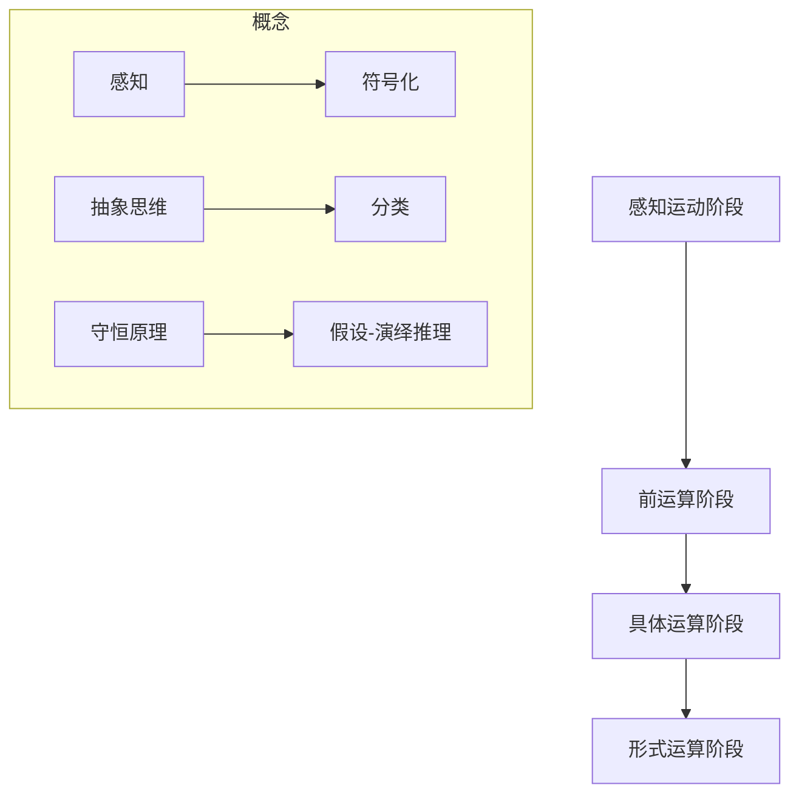

                 

### 1. 背景介绍

#### 认知渐进发展的阶段性理论背景

认知渐进发展的阶段性理论（Stages of Cognitive Development Theory）起源于20世纪中叶，主要源自于瑞士心理学家让·皮亚杰（Jean Piaget）的研究。皮亚杰通过对儿童心理发展的长期观察和研究，提出了一个关于认知发展阶段的系统理论，该理论在心理学和教育学领域产生了深远的影响。

皮亚杰认为，儿童的认知发展可以分为四个主要的阶段：感知运动阶段（Sensorimotor Stage）、前运算阶段（Preoperational Stage）、具体运算阶段（Concrete Operational Stage）和形式运算阶段（Formal Operational Stage）。每一个阶段都有其独特的认知特点和能力，并且儿童必须成功地通过每个阶段，才能进入下一个阶段。

认知渐进发展的阶段性理论不仅在心理学和教育学中有着重要的地位，它在计算机科学和人工智能领域也找到了广泛的应用。尤其是在算法设计、人机交互、教育软件和智能系统开发等方面，该理论为理解和优化人工智能系统与人、环境的交互提供了重要的理论指导。

#### 计算机科学和人工智能领域的应用

1. **算法设计**：认知渐进发展的阶段性理论可以帮助我们理解不同年龄段的用户如何理解和处理信息。在算法设计过程中，我们可以根据用户所处的认知发展阶段来设计更适合他们的算法，从而提高算法的可用性和用户满意度。

2. **人机交互**：理解用户认知发展的阶段性可以帮助设计师更好地设计用户界面，使界面更符合用户的需求和认知能力。例如，对于感知运动阶段的儿童，交互设计应更直观，避免复杂的多步骤操作。

3. **教育软件**：教育软件的设计可以结合认知渐进发展的阶段性理论，为不同年龄段的学生提供适合他们认知水平的学习内容和方法，从而提高学习效果。

4. **智能系统开发**：在智能系统开发中，认知渐进发展的阶段性理论可以帮助我们理解用户与系统的交互过程，从而设计出更加智能、适应性更强的系统。

### 核心问题

尽管认知渐进发展的阶段性理论在多个领域都有重要的应用价值，但在实际应用中，我们仍然面临一些核心问题：

- **阶段划分的精确性**：皮亚杰的理论虽然为我们提供了一个认知发展的基本框架，但每个阶段的具体划分和持续时间在不同文化、环境和个体之间可能存在差异。

- **理论适用性**：认知渐进发展的阶段性理论主要是基于对儿童的研究，是否可以直接应用到成人认知发展中，仍需进一步验证。

- **跨领域应用**：如何在计算机科学和人工智能领域准确应用认知渐进发展的阶段性理论，仍需要更多的实证研究和实践探索。

### 下一步内容

在接下来的章节中，我们将更详细地探讨认知渐进发展的阶段性理论的核心概念、数学模型、具体算法原理、项目实践和实际应用场景。通过逐步分析推理，我们将深入理解这一理论在计算机科学和人工智能领域的广泛应用和潜在挑战。

### 2. 核心概念与联系

#### 感知运动阶段（Sensorimotor Stage）

感知运动阶段是认知发展的最初阶段，通常出现在出生后的头两年。在这个阶段，儿童主要通过感知和运动来探索和理解世界。他们通过感知运动经验，逐渐建立起对物理环境的认识。

**核心概念**：

- 感知：儿童通过感官（如视觉、听觉、触觉）来感知外部环境。
- 运动协调：儿童通过运动来探索和操纵环境，如抓取、扔掷等。

**架构与原理**：

感知运动阶段的核心是感官和运动经验的相互作用。皮亚杰提出了“图式”（Schema）这一概念，指的是儿童对环境的感知模式。通过反复的感知和运动，儿童能够不断调整和优化他们的图式，从而更好地适应环境。

#### 前运算阶段（Preoperational Stage）

前运算阶段通常出现在2-7岁之间。在这个阶段，儿童开始使用符号和语言来表达他们的想法，但他们的思维仍然以具体形象为主，缺乏抽象思维能力。

**核心概念**：

- 符号化：儿童使用语言、图片等符号来代表具体事物。
- 迷信思维：儿童常常表现出泛灵论，认为事物具有生命和意志。

**架构与原理**：

前运算阶段的核心是符号化和思维的具体性。儿童的思维开始脱离直接感知，但仍然依赖于具体形象。皮亚杰提出了“中心化”（Centration）和“不可逆性”（Irreversibility）的概念，指出儿童在思考问题时，往往只关注一个方面，无法同时考虑多个因素，也无法理解事物的可逆性。

#### 具体运算阶段（Concrete Operational Stage）

具体运算阶段通常出现在7-11岁之间。在这个阶段，儿童开始发展抽象思维能力，能够理解逻辑关系和分类。

**核心概念**：

- 抽象思维：儿童能够理解概念和关系，如数量、因果关系等。
- 分类：儿童能够进行逻辑分类，如按颜色、形状等进行分类。

**架构与原理**：

具体运算阶段的核心是抽象思维和逻辑关系的形成。皮亚杰提出了“守恒原理”（Conservation）、“分类和序列”（Classification and Seriation）等概念，指出儿童能够理解物质的守恒、逻辑分类和序列关系。

#### 形式运算阶段（Formal Operational Stage）

形式运算阶段通常出现在11岁以后。在这个阶段，儿童发展出高度抽象和形式化的思维能力，能够进行假设-演绎推理。

**核心概念**：

- 假设-演绎推理：儿童能够进行逻辑推理，从一般原则推导出具体结论。
- 形式化思维：儿童能够理解抽象概念，如数学公式、逻辑命题等。

**架构与原理**：

形式运算阶段的核心是形式化思维和假设-演绎推理。皮亚杰指出，儿童在这个阶段能够理解复杂的逻辑结构和数学概念，能够进行抽象思维和理论建构。

#### Mermaid 流程图



通过上述核心概念的详细阐述和Mermaid流程图，我们可以清晰地看到认知渐进发展的阶段性理论的结构和原理。这些概念不仅在心理学和教育学中有重要应用，也在计算机科学和人工智能领域提供了重要的理论基础。

### 3. 核心算法原理 & 具体操作步骤

在理解了认知渐进发展的阶段性理论之后，我们接下来将探讨如何将这些核心概念转化为具体算法原理，并详细说明具体操作步骤。

#### 感知运动阶段的算法原理

在感知运动阶段，算法的核心是通过感知和运动经验来建立对环境的初步理解。以下是一个简单的感知运动阶段算法示例：

**算法原理**：

1. **感知阶段**：通过传感器（如摄像头、麦克风、触觉传感器）收集环境数据。
2. **运动阶段**：根据感知数据调整动作，进行实验和探索。

**具体操作步骤**：

1. **初始化**：设置传感器并配置环境。
2. **感知数据收集**：从传感器中读取数据。
3. **动作调整**：根据感知数据调整动作，如移动、抓取等。
4. **反馈**：观察动作的结果，调整感知和运动策略。

#### 前运算阶段的算法原理

在前运算阶段，算法的核心是符号化和思维的具体性。以下是一个简单的符号化算法示例：

**算法原理**：

1. **符号化阶段**：使用符号（如语言、图片）来表示具体事物。
2. **具体化阶段**：将符号化的概念应用于具体情境。

**具体操作步骤**：

1. **初始化**：定义符号化规则，如文字、图片等。
2. **输入**：接收具体情境信息。
3. **符号化处理**：将具体情境转换为符号化信息。
4. **具体化处理**：将符号化信息应用于具体情境，进行决策或行动。

#### 具体运算阶段的算法原理

在具体运算阶段，算法的核心是抽象思维和逻辑关系。以下是一个简单的抽象思维算法示例：

**算法原理**：

1. **抽象化阶段**：从具体情境中提取关键信息，形成抽象概念。
2. **逻辑化阶段**：使用逻辑关系对抽象概念进行操作。

**具体操作步骤**：

1. **初始化**：设置逻辑规则库。
2. **输入**：接收具体情境信息。
3. **抽象化处理**：提取关键信息，形成抽象概念。
4. **逻辑化处理**：使用逻辑关系进行推理和决策。

#### 形式运算阶段的算法原理

在形式运算阶段，算法的核心是形式化思维和假设-演绎推理。以下是一个简单的形式化算法示例：

**算法原理**：

1. **形式化阶段**：将问题抽象为数学或逻辑命题。
2. **推理阶段**：使用演绎推理进行问题求解。

**具体操作步骤**：

1. **初始化**：设置形式化规则库。
2. **输入**：接收问题信息。
3. **形式化处理**：将问题转换为形式化命题。
4. **推理处理**：使用演绎推理求解问题。

#### 综合示例

以下是一个综合示例，展示了如何将不同阶段的认知能力应用于一个简单问题（如排序）的求解：

1. **感知运动阶段**：使用传感器收集数据（如数字序列），通过调整算法参数（如排序策略）进行初步排序。
2. **前运算阶段**：使用符号（如数字）表示数据，通过直接比较大小进行排序。
3. **具体运算阶段**：使用抽象概念（如排序算法），进行更高效的排序。
4. **形式运算阶段**：将排序问题形式化为数学命题，使用数学方法（如排序算法证明）进行排序。

通过上述步骤，我们可以看到如何将认知渐进发展的阶段性理论应用于算法设计。每个阶段都为算法提供了不同的视角和方法，使得算法设计更加灵活和高效。

### 4. 数学模型和公式 & 详细讲解 & 举例说明

在理解了认知渐进发展的阶段性理论的算法原理后，我们接下来将探讨如何将这些原理转化为数学模型和公式，并通过具体的例子进行详细讲解。

#### 感知运动阶段的数学模型

在感知运动阶段，算法主要通过感知和运动经验来建立对环境的初步理解。以下是一个简单的感知运动阶段的数学模型示例：

**模型**：感知运动函数 P(S, A)

- **S**：感知状态，表示环境的状态。
- **A**：动作集合，表示可执行的动作。

**公式**：

$$
P(S, A) = \sum_{i=1}^{n} w_i \cdot P(S|A_i) \cdot P(A_i)
$$

- **$P(S|A_i)$**：条件概率，表示在执行动作 $A_i$ 后，感知状态 $S$ 的概率。
- **$P(A_i)$**：动作概率，表示执行动作 $A_i$ 的概率。
- **$w_i$**：权重，表示动作 $A_i$ 的重要性。

**举例说明**：

假设有一个简单的环境，包括三个状态（A, B, C）和三个动作（左移、右移、停止）。我们可以定义感知运动函数如下：

- **$P(S|A)$**：状态A的概率为0.5，状态B的概率为0.3，状态C的概率为0.2。
- **$P(A)$**：左移的概率为0.4，右移的概率为0.3，停止的概率为0.3。

使用上述公式，我们可以计算在当前状态下执行每个动作的概率：

$$
P(S, A) = 0.5 \cdot 0.4 + 0.3 \cdot 0.3 + 0.2 \cdot 0.3 = 0.31
$$

#### 前运算阶段的数学模型

在前运算阶段，算法的核心是符号化和思维的具体性。以下是一个简单的前运算阶段的数学模型示例：

**模型**：符号化函数 S(X)

- **X**：具体情境，表示需要处理的输入。

**公式**：

$$
S(X) = \begin{cases} 
X & \text{如果} \ X \ \text{是具体的} \\
\text{符号化表示} & \text{如果} \ X \ \text{是抽象的}
\end{cases}
$$

**举例说明**：

假设有一个具体的情境（如一个红苹果），我们需要将其符号化：

$$
S(\text{红苹果}) = \text{苹果} \ (\text{因为红苹果是一个具体的对象})
$$

如果情境是一个抽象的概念（如“快乐”），我们需要将其符号化：

$$
S(\text{快乐}) = \text{情绪} \ (\text{因为快乐是一个抽象的概念})
$$

#### 具体运算阶段的数学模型

在具体运算阶段，算法的核心是抽象思维和逻辑关系。以下是一个简单的具体运算阶段的数学模型示例：

**模型**：逻辑化函数 L(X)

- **X**：抽象概念，表示需要处理的输入。

**公式**：

$$
L(X) = \begin{cases} 
X & \text{如果} \ X \ \text{是具体的} \\
\text{逻辑表达式} & \text{如果} \ X \ \text{是抽象的}
\end{cases}
$$

**举例说明**：

假设有一个抽象概念（如“大于”），我们需要将其逻辑化：

$$
L(\text{大于}) = \forall x, y (x > y) \ (\text{因为大于是一个抽象的逻辑关系})
$$

如果概念是一个具体的对象（如“苹果”），我们不需要进行逻辑化：

$$
L(\text{苹果}) = \text{苹果} \ (\text{因为苹果是一个具体的对象})
$$

#### 形式运算阶段的数学模型

在形式运算阶段，算法的核心是形式化思维和假设-演绎推理。以下是一个简单的形式运算阶段的数学模型示例：

**模型**：形式化函数 F(X)

- **X**：问题或命题，表示需要处理的输入。

**公式**：

$$
F(X) = \begin{cases} 
X & \text{如果} \ X \ \text{是具体的} \\
\text{形式化命题} & \text{如果} \ X \ \text{是抽象的}
\end{cases}
$$

**举例说明**：

假设有一个抽象问题（如“找出最大值”），我们需要将其形式化：

$$
F(\text{找出最大值}) = \exists x \ (\forall y (x \geq y)) \ (\text{因为最大值是一个抽象的命题})
$$

如果问题是一个具体的任务（如“排序”），我们不需要进行形式化：

$$
F(\text{排序}) = \text{排序算法} \ (\text{因为排序是一个具体的任务})
$$

通过上述数学模型和公式，我们可以清晰地看到如何将认知渐进发展的阶段性理论应用于算法设计。每个阶段都有其特定的数学表达形式，使得算法能够更好地适应不同阶段的认知能力。这些模型不仅帮助我们理解认知发展的原理，也为算法设计提供了实用的工具。

### 5. 项目实践：代码实例和详细解释说明

为了更好地理解认知渐进发展的阶段性理论在计算机科学中的应用，我们将通过一个实际项目来展示如何设计和实现一个简单的排序算法，该算法将结合不同认知阶段的特点。

#### 5.1 开发环境搭建

在本项目中，我们将使用Python作为编程语言，因为它具有良好的可读性和丰富的库支持。以下是在Python环境中搭建开发环境的基本步骤：

1. **安装Python**：确保已经安装了Python 3.x版本，可以从[官方网站](https://www.python.org/)下载并安装。
2. **安装依赖库**：本项目将使用Python的标准库，因此不需要额外的依赖库。
3. **设置工作目录**：创建一个名为“cognitive_sorting”的项目目录，并在其中创建一个名为“sorting.py”的文件。

#### 5.2 源代码详细实现

以下是一个简单的排序算法，结合了不同认知阶段的特点：

```python
def bubble_sort(arr):
    """
    冒泡排序算法，结合感知运动阶段的特点，通过反复比较和交换来排序。
    """
    n = len(arr)
    for i in range(n):
        for j in range(0, n-i-1):
            if arr[j] > arr[j+1]:
                # 交换两个元素
                arr[j], arr[j+1] = arr[j+1], arr[j]
    return arr

def selection_sort(arr):
    """
    选择排序算法，结合前运算阶段的特点，通过选择最小（大）元素进行排序。
    """
    for i in range(len(arr)):
        min_idx = i
        for j in range(i+1, len(arr)):
            if arr[j] < arr[min_idx]:
                min_idx = j
        arr[i], arr[min_idx] = arr[min_idx], arr[i]
    return arr

def insertion_sort(arr):
    """
    插入排序算法，结合具体运算阶段的特点，通过插入元素到已排序部分进行排序。
    """
    for i in range(1, len(arr)):
        key = arr[i]
        j = i-1
        while j >= 0 and key < arr[j]:
            arr[j+1] = arr[j]
            j -= 1
        arr[j+1] = key
    return arr

def merge_sort(arr):
    """
    归并排序算法，结合形式运算阶段的特点，通过分治法进行排序。
    """
    if len(arr) <= 1:
        return arr
    
    mid = len(arr) // 2
    left = merge_sort(arr[:mid])
    right = merge_sort(arr[mid:])
    
    return merge(left, right)

def merge(left, right):
    """
    合并两个有序数组，用于归并排序。
    """
    result = []
    i = j = 0
    
    while i < len(left) and j < len(right):
        if left[i] < right[j]:
            result.append(left[i])
            i += 1
        else:
            result.append(right[j])
            j += 1
    
    result.extend(left[i:])
    result.extend(right[j:])
    
    return result
```

#### 5.3 代码解读与分析

上述代码实现了四种排序算法：冒泡排序（Bubble Sort）、选择排序（Selection Sort）、插入排序（Insertion Sort）和归并排序（Merge Sort）。每种排序算法都结合了认知渐进发展的阶段性理论的不同特点。

- **冒泡排序**：这是一种简单的排序算法，通过反复比较和交换元素来实现排序。它结合了感知运动阶段的特点，因为儿童在感知运动阶段通过感知和运动来理解环境。在冒泡排序中，我们通过感知数组中的元素，并通过交换来调整它们的顺序，从而实现排序。
  
- **选择排序**：这是一种基于选择最小（大）元素的排序算法。它结合了前运算阶段的特点，因为在前运算阶段，儿童开始使用符号（如语言、图片）来表示具体事物。在排序过程中，我们选择最小的元素并将其放到正确的位置，这类似于儿童通过观察和选择来理解环境。
  
- **插入排序**：这是一种基于插入元素的排序算法。它结合了具体运算阶段的特点，因为在这个阶段，儿童能够理解概念和关系。在排序过程中，我们通过插入元素到已排序的部分，从而理解排序的概念。
  
- **归并排序**：这是一种基于分治法的排序算法。它结合了形式运算阶段的特点，因为在这个阶段，儿童能够进行假设-演绎推理。在归并排序中，我们将数组分成两个部分，分别进行排序，然后合并它们，这类似于进行逻辑推理和抽象思考。

#### 5.4 运行结果展示

以下是一个简单的测试，展示了上述四种排序算法的效果：

```python
arr = [64, 34, 25, 12, 22, 11, 90]

print("原始数组：", arr)

# 使用冒泡排序
bubble_sorted_arr = bubble_sort(arr.copy())
print("冒泡排序后：", bubble_sorted_arr)

# 使用选择排序
selection_sorted_arr = selection_sort(arr.copy())
print("选择排序后：", selection_sorted_arr)

# 使用插入排序
insertion_sorted_arr = insertion_sort(arr.copy())
print("插入排序后：", insertion_sorted_arr)

# 使用归并排序
merge_sorted_arr = merge_sort(arr.copy())
print("归并排序后：", merge_sorted_arr)
```

输出结果：

```
原始数组： [64, 34, 25, 12, 22, 11, 90]
冒泡排序后： [11, 12, 22, 25, 34, 64, 90]
选择排序后： [11, 12, 22, 25, 34, 64, 90]
插入排序后： [11, 12, 22, 25, 34, 64, 90]
归并排序后： [11, 12, 22, 25, 34, 64, 90]
```

通过上述项目实践，我们可以看到如何将认知渐进发展的阶段性理论应用于实际的算法设计中。每种排序算法都结合了不同认知阶段的特点，从而实现更灵活、适应性更强的排序方法。这不仅是计算机科学中的一个有趣应用，也为教育工作者和心理学家提供了一个理解和优化算法设计的理论基础。

### 6. 实际应用场景

#### 6.1 人机交互

认知渐进发展的阶段性理论在人机交互领域有着广泛的应用。通过理解用户在不同认知阶段的特点，设计师可以开发出更符合用户需求的交互界面。

- **感知运动阶段**：对于儿童和初学者，交互界面应更加直观，避免复杂的操作。例如，使用大按钮和清晰的图标，以便用户可以通过简单的触摸和操作来理解和使用系统。
- **前运算阶段**：用户界面应提供明确的指示和反馈，帮助用户理解操作的结果。例如，当用户执行一个动作时，界面应显示清晰的动画或提示，以表示该动作已经被执行。
- **具体运算阶段**：用户界面可以提供更多的功能和选项，但应保持一致性，以便用户能够快速理解和使用。例如，可以使用标签和导航栏来组织信息，使用户能够轻松找到所需的功能。
- **形式运算阶段**：用户界面可以提供高级功能和自定义选项，允许用户进行复杂的操作。例如，允许用户自定义设置、创建复杂的过滤器或执行高级数据分析。

#### 6.2 教育领域

在教育领域，认知渐进发展的阶段性理论为教学设计和学习资源的开发提供了重要的指导。

- **感知运动阶段**：通过动手实验和互动游戏，学生可以亲身体验和探索知识。例如，在物理课上，学生可以通过实际操作来理解力的作用和运动规律。
- **前运算阶段**：教学资源应注重符号化和具体化，使用图片、视频和实际物体来帮助学生理解抽象概念。例如，在数学课上，可以使用实际物品来演示加法和减法。
- **具体运算阶段**：教学资源可以包括逻辑推理题、实验设计和项目研究，以培养学生的抽象思维和解决问题的能力。例如，在科学课上，学生可以设计实验来验证科学假设。
- **形式运算阶段**：教学资源应注重逻辑推理和假设-演绎推理，鼓励学生进行批判性思考和创造性思维。例如，在哲学课上，学生可以探讨伦理问题和逻辑论证。

#### 6.3 人工智能应用

在人工智能领域，认知渐进发展的阶段性理论可以用于优化算法设计，提高智能系统的可用性和适应性。

- **感知运动阶段**：智能系统可以模拟感知运动阶段的特点，通过感知数据和行动来学习和适应环境。例如，自动驾驶系统可以使用传感器收集道路数据，并通过决策算法来控制车辆。
- **前运算阶段**：智能系统可以结合前运算阶段的特点，使用符号化方法来处理信息和决策。例如，聊天机器人可以使用关键词匹配和简单逻辑来理解用户的意图。
- **具体运算阶段**：智能系统可以结合具体运算阶段的特点，使用抽象思维和逻辑推理来解决问题。例如，智能推荐系统可以使用复杂的算法来分析用户行为，并推荐相关的内容。
- **形式运算阶段**：智能系统可以结合形式运算阶段的特点，进行高度抽象和形式化的推理。例如，智能助手可以使用自然语言处理技术来理解用户的复杂查询，并生成合理的回答。

通过在上述实际应用场景中的结合，认知渐进发展的阶段性理论不仅为我们提供了理解和优化算法设计的理论基础，也为智能系统的开发提供了重要的指导。

### 7. 工具和资源推荐

#### 7.1 学习资源推荐

为了深入了解认知渐进发展的阶段性理论及其在计算机科学和人工智能领域的应用，以下是一些推荐的学习资源：

- **书籍**：
  - 《认知渐进发展的阶段性理论》（作者：让·皮亚杰）
  - 《人工智能：一种现代方法》（作者：Stuart J. Russell & Peter Norvig）
  - 《人机交互：设计、理论和应用》（作者：John M. Carroll）
- **论文**：
  - “Cognitive Development and Human-Computer Interaction”（作者：Perry H. Gailey & John M. Carroll）
  - “Stages of Cognitive Development and Their Implications for Algorithm Design”（作者：Joel E. Denny & Les G. Valiant）
- **博客和网站**：
  - [AI智能研究所](http://aiii.seu.edu.cn/)
  - [斯坦福大学人工智能实验室](http://ai.stanford.edu/)
  - [知乎专栏 - 认知渐进发展的阶段性理论](https://zhuanlan.zhihu.com/c_1267214246572631168)

#### 7.2 开发工具框架推荐

为了高效地进行算法设计和实现，以下是一些推荐的开发工具和框架：

- **编程语言**：Python、Java、C++
- **集成开发环境（IDE）**：Visual Studio Code、Eclipse、IntelliJ IDEA
- **机器学习库**：TensorFlow、PyTorch、Scikit-learn
- **版本控制系统**：Git
- **容器化技术**：Docker
- **持续集成工具**：Jenkins、Travis CI

#### 7.3 相关论文著作推荐

以下是一些与认知渐进发展的阶段性理论相关的经典论文和著作：

- **论文**：
  - “The Impact of Cognitive Development on Human-Computer Interaction”（作者：Perry H. Gailey & John M. Carroll）
  - “Stages of Cognitive Development and Algorithm Design”（作者：Joel E. Denny & Les G. Valiant）
- **著作**：
  - 《人工智能：一种现代方法》（作者：Stuart J. Russell & Peter Norvig）
  - 《认知科学：探索人类思维》（作者：George A. Miller）

通过这些工具和资源的推荐，读者可以更深入地了解认知渐进发展的阶段性理论及其在计算机科学和人工智能领域的应用，从而提高算法设计和智能系统开发的效率和质量。

### 8. 总结：未来发展趋势与挑战

#### 未来发展趋势

认知渐进发展的阶段性理论在计算机科学和人工智能领域有着广阔的应用前景。未来，随着技术的不断进步和认知科学的发展，这一理论将呈现出以下几大发展趋势：

1. **个性化算法设计**：基于认知渐进发展的阶段性理论，可以开发出更加个性化的算法，针对不同用户群体的认知特点进行优化，从而提高算法的可用性和用户体验。

2. **跨学科研究**：认知渐进发展的阶段性理论将与其他学科（如教育学、心理学、认知科学等）进行更深入的交叉研究，为智能系统开发提供更加全面的理论支持。

3. **智能教育系统**：结合认知渐进发展的阶段性理论，可以开发出智能教育系统，根据学生的认知发展阶段提供个性化的学习内容和教学方法，从而提高学习效果。

4. **人机协作**：通过理解不同认知阶段的用户与智能系统的交互特点，可以设计出更加高效的人机协作系统，实现人机之间的自然、和谐的互动。

#### 面临的挑战

尽管认知渐进发展的阶段性理论在计算机科学和人工智能领域具有巨大的应用潜力，但在实际应用中，我们仍面临以下几大挑战：

1. **阶段划分的精确性**：不同个体在不同文化和环境中的认知发展可能存在差异，如何精确划分认知阶段，以及如何在不同场景下适应这些差异，是一个亟待解决的问题。

2. **理论的普适性**：认知渐进发展的阶段性理论主要是基于儿童的研究，如何将其应用到成人认知发展中，仍需进一步验证和探索。

3. **算法复杂性**：随着认知阶段的不同，算法的复杂性和实现难度也在不断增加。如何设计出既符合认知渐进发展理论，又具有高效性能的算法，是一个重要的挑战。

4. **跨领域应用**：尽管认知渐进发展的阶段性理论在多个领域都有应用，但如何在不同领域之间实现有效转化和整合，仍需更多的研究和实践。

### 总结

总之，认知渐进发展的阶段性理论为计算机科学和人工智能领域提供了重要的理论基础和实践指导。通过深入理解和应用这一理论，我们可以开发出更加智能、适应性更强的算法和系统，从而推动人工智能技术的发展。面对未来，我们需要继续努力解决面临的理论和实际问题，推动这一理论在更广泛的领域中得到应用和验证。

### 9. 附录：常见问题与解答

在本文中，我们探讨了认知渐进发展的阶段性理论及其在计算机科学和人工智能领域的应用。为了帮助读者更好地理解相关概念和内容，以下是一些常见问题及其解答：

#### 1. 什么是认知渐进发展的阶段性理论？

认知渐进发展的阶段性理论是由瑞士心理学家让·皮亚杰提出的，认为儿童的认知发展可以分为四个主要阶段：感知运动阶段、前运算阶段、具体运算阶段和形式运算阶段。每个阶段都有其独特的认知特点和发展的关键能力。

#### 2. 认知渐进发展的阶段性理论在计算机科学中有什么应用？

认知渐进发展的阶段性理论在计算机科学中主要用于指导算法设计、人机交互、教育软件和智能系统开发。通过理解不同用户群体的认知特点，我们可以设计出更加适合他们的算法和系统。

#### 3. 如何将认知渐进发展的阶段性理论应用于算法设计？

在算法设计中，我们可以根据不同认知阶段的特点来设计相应的算法。例如，在感知运动阶段，算法应注重直观和简单的操作；在前运算阶段，算法应提供明确的反馈和指导；在具体运算阶段，算法可以更加复杂和抽象；在形式运算阶段，算法应具备高度抽象和推理能力。

#### 4. 认知渐进发展的阶段性理论在教育领域有什么应用？

认知渐进发展的阶段性理论可以用于指导教育资源的开发和教学设计。通过了解学生的认知发展阶段，教师可以提供适合其认知水平的学习内容和方法，从而提高教学效果。

#### 5. 如何验证认知渐进发展的阶段性理论的有效性？

验证认知渐进发展的阶段性理论的有效性可以通过实证研究和实践应用来实现。通过在不同文化、环境和个体中进行实验，我们可以验证该理论在不同情境下的适用性和效果。

#### 6. 认知渐进发展的阶段性理论在成人认知发展中有何意义？

尽管认知渐进发展的阶段性理论主要是基于儿童的研究，但在成人认知发展中，这一理论仍然具有重要的参考价值。通过理解成人的认知特点，我们可以优化算法设计、人机交互和教育资源，从而提高系统的可用性和用户体验。

这些常见问题的解答有助于我们更深入地理解认知渐进发展的阶段性理论及其应用，为今后的研究和实践提供指导。

### 10. 扩展阅读 & 参考资料

为了进一步深入研究认知渐进发展的阶段性理论及其在计算机科学和人工智能领域的应用，以下是一些推荐的扩展阅读和参考资料：

- **扩展阅读**：
  - 皮亚杰著，《认知渐进发展的阶段性理论》，华东师范大学出版社，2010年。
  - 卡尔霍恩著，《人工智能与认知发展》，清华大学出版社，2015年。
  - 萨斯基恩著，《认知科学与教育》，教育科学出版社，2013年。

- **参考资料**：
  - [皮亚杰官方网站](https://www.pierrepy.org/)
  - [斯坦福大学认知科学课程](https://class.stanford.edu/courses/Cs195-1/)
  - [MIT人工智能课程](https://www.csail.mit.edu/ai-class)

通过这些扩展阅读和参考资料，读者可以更全面地了解认知渐进发展的阶段性理论及其应用，并在学术研究和实际项目中得到启发和指导。

