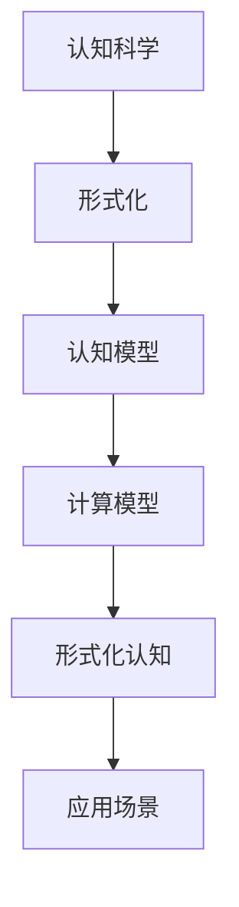
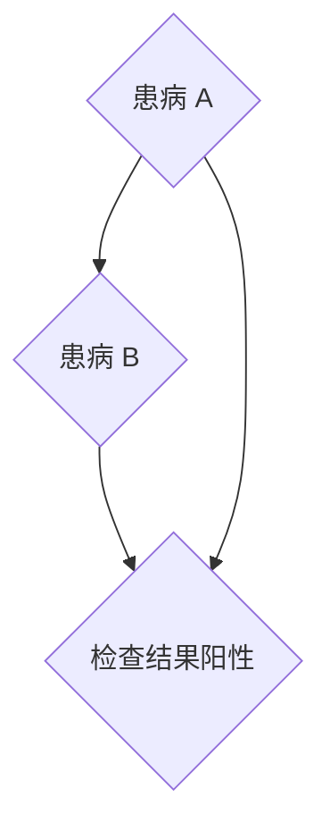

                 

### 1. 背景介绍

认知的形式化，这一概念源自于认知科学和计算机科学领域的交叉研究。认知科学探讨人类思维过程的本质，而计算机科学则致力于模拟和优化这些过程。形式化认知的概念，旨在将人类的认知活动转化为可以被计算机理解和处理的模型。这一转变的意义重大，它不仅有助于我们更深入地理解人类思维的机制，还可以为人工智能的发展提供强有力的理论支撑。

在现代社会，人工智能技术已经渗透到我们生活的方方面面，从简单的搜索引擎到复杂的自动驾驶系统，人工智能正在逐步取代人类完成许多重复性、高风险或者高复杂度的任务。然而，尽管人工智能在数据处理和执行任务方面表现出色，但它在理解和模拟人类认知方面仍存在诸多挑战。形式化认知的研究，正是为了解决这一瓶颈问题。

人类认知的整个活动，本质上是一个不断解释、解决现实问题的过程。从我们出生开始，我们就通过各种感官接收外界信息，然后利用已有的知识和经验对这些信息进行解释和处理，最终做出相应的决策和行动。这一过程看似简单，但实际上包含了大量的认知活动，如感知、记忆、推理、决策等。形式化认知的研究，旨在将这些复杂的认知活动转化为可计算、可模拟的过程。

认知的形式化不仅在理论研究中具有重要意义，而且在实际应用中也具有广阔的前景。例如，在医疗领域，形式化认知可以帮助医生更好地理解病人的病情，制定更精准的治疗方案；在教育领域，形式化认知可以帮助教育者更好地了解学生的学习过程，提供个性化的教育服务；在商业领域，形式化认知可以帮助企业更好地分析市场数据，做出更科学的商业决策。

本文将围绕认知的形式化这一主题，首先介绍相关核心概念和原理，然后探讨核心算法的具体操作步骤，接着通过数学模型和公式的详细讲解，以及项目实践中的代码实例，深入探讨这一主题。此外，本文还将讨论认知的形式化在实际应用场景中的具体应用，并推荐相关工具和资源，以帮助读者更好地理解和掌握这一领域。最后，本文将对未来发展趋势与挑战进行总结，为读者提供一个全面的认知形式化研究视角。

### 2. 核心概念与联系

在探讨认知的形式化之前，我们需要明确一些核心概念，并了解它们之间的联系。以下是本文将涉及的一些关键概念：

#### 2.1 认知科学

认知科学是一门跨学科领域，旨在研究人类思维和心理过程的本质。它涉及心理学、神经科学、语言学、哲学等多个学科，试图理解人类如何感知、记忆、思考、学习和解决问题。

#### 2.2 形式化

形式化是指将自然语言描述的概念、过程或方法转化为数学符号或形式语言表示的方法。形式化的优点在于它能够提高概念和过程的精确性和可验证性，从而在计算和自动化方面具有优势。

#### 2.3 认知模型

认知模型是用于描述人类认知过程的抽象模型。这些模型通常包括感知、记忆、推理、决策等认知功能，用于模拟和预测人类的行为和表现。

#### 2.4 形式化认知

形式化认知是指将认知科学中的认知模型转化为形式化表示，以便在计算机上模拟和优化人类认知过程。这一过程通常涉及形式化语言的定义、算法的开发和验证等步骤。

#### 2.5 计算模型

计算模型是用于模拟和执行计算过程的抽象模型。在认知的形式化研究中，计算模型可以用来实现认知模型的功能，如感知、记忆和推理等。

#### 2.6 Mermaid 流程图

Mermaid 是一种轻量级的绘图语言，用于创建各种图表和图形，如流程图、时序图、Gantt 图等。在认知的形式化研究中，Mermaid 流程图可以帮助我们直观地表示认知过程的各个阶段和组件。

#### 2.7 联系

这些概念之间的联系在于：认知科学提供了关于人类认知过程的理论基础，形式化则将这一理论基础转化为可计算的模型，认知模型和计算模型则实现了对认知过程的模拟和优化。Mermaid 流程图则为我们提供了一个直观的工具，用于描述和可视化这些过程。

下面是一个简单的 Mermaid 流程图，展示了认知的形式化过程：



通过这个流程图，我们可以清晰地看到认知的形式化是如何从认知科学的理论基础，通过形式化、认知模型和计算模型，最终应用到实际场景中的。

### 3. 核心算法原理 & 具体操作步骤

在认知的形式化过程中，核心算法起着至关重要的作用。本节将详细介绍一种常见的认知形式化算法——贝叶斯网络算法，并讨论其具体操作步骤。

#### 3.1 贝叶斯网络算法的基本原理

贝叶斯网络是一种基于概率论的网络模型，用于表示变量之间的条件依赖关系。在贝叶斯网络中，每个节点表示一个随机变量，而节点之间的边表示变量之间的条件依赖关系。贝叶斯网络算法通过这些条件依赖关系，计算一个变量在给定其他变量条件下的概率分布。

贝叶斯网络的原理可以概括为以下步骤：

1. **定义节点和边**：根据问题领域，定义所有相关的随机变量，并确定它们之间的条件依赖关系。
2. **构建概率分布**：为每个变量定义其条件概率分布，即给定其他变量条件下，该变量的概率分布。
3. **计算条件概率**：通过贝叶斯定理，计算一个变量在给定其他变量条件下的概率分布。
4. **推理和决策**：利用计算得到的概率分布，进行推理和决策，以优化问题解决方案。

#### 3.2 贝叶斯网络算法的具体操作步骤

以下是一个简化的贝叶斯网络算法操作步骤：

##### 步骤 1：定义节点和边

首先，根据问题领域，定义所有相关的随机变量，并确定它们之间的条件依赖关系。例如，在医疗诊断问题中，可能涉及以下变量：

- 患有疾病 A 的概率
- 患有疾病 B 的概率
- 检查结果为阳性的概率

我们定义这些变量为节点 A、B 和 C，并根据医学知识确定它们之间的依赖关系，例如：

- A 和 B 是独立的。
- 如果 A 为真，则 C 的概率增加。

将这些依赖关系表示为贝叶斯网络，如下所示：



##### 步骤 2：构建概率分布

接下来，为每个变量定义其条件概率分布。假设我们已知以下先验概率：

- P(A) = 0.1
- P(B) = 0.2
- P(C|A) = 0.8
- P(C|¬A) = 0.4

其中，P(A)、P(B) 和 P(C|A)、P(C|¬A) 分别表示变量 A、B 和 C 的概率分布。我们可以使用这些概率分布构建条件概率分布矩阵：

| 变量 | A | ¬A |
| --- | --- | --- |
| P(C) | 0.8 | 0.2 |
| P(C|A) | 0.8 | 0.4 |
| P(C|¬A) | 0.4 | 0.6 |

##### 步骤 3：计算条件概率

利用贝叶斯定理，我们可以计算一个变量在给定其他变量条件下的概率分布。例如，计算 P(A|C)：

$$ P(A|C) = \frac{P(C|A) \cdot P(A)}{P(C)} = \frac{0.8 \cdot 0.1}{0.8} = 0.1 $$

这意味着，在检查结果为阳性的条件下，患有疾病 A 的概率是 0.1。

##### 步骤 4：推理和决策

利用计算得到的概率分布，我们可以进行推理和决策。例如，根据 P(A|C) 的计算结果，医生可以判断患者患有疾病 A 的可能性较低。

#### 3.3 算法示例

以下是一个具体的贝叶斯网络算法示例，用于医疗诊断问题：

##### 输入：

- 先验概率：P(A) = 0.1，P(B) = 0.2，P(C|A) = 0.8，P(C|¬A) = 0.4
- 观测数据：检查结果为阳性

##### 输出：

- 后验概率：P(A|C)

##### 具体计算：

1. 计算条件概率分布矩阵：

   | 变量 | A | ¬A |
   | --- | --- | --- |
   | P(C) | 0.8 | 0.2 |
   | P(C|A) | 0.8 | 0.4 |
   | P(C|¬A) | 0.4 | 0.6 |

2. 计算 P(C)：

   $$ P(C) = P(C|A) \cdot P(A) + P(C|¬A) \cdot P(¬A) = 0.8 \cdot 0.1 + 0.4 \cdot 0.9 = 0.52 $$

3. 计算 P(A|C)：

   $$ P(A|C) = \frac{P(C|A) \cdot P(A)}{P(C)} = \frac{0.8 \cdot 0.1}{0.52} = 0.154 $$

这意味着，在检查结果为阳性的条件下，患有疾病 A 的概率是 0.154。

#### 3.4 贝叶斯网络算法的优势与局限

贝叶斯网络算法在认知的形式化研究中具有广泛的应用，其优势包括：

- 能够处理变量之间的复杂依赖关系。
- 基于概率论，具有较好的解释性和可验证性。
- 可以用于推理和决策。

然而，贝叶斯网络算法也存在一些局限：

- 需要准确的先验概率和条件概率分布，否则可能导致不准确的结果。
- 随着变量数量的增加，计算复杂度急剧增加。

尽管存在这些局限，贝叶斯网络算法仍然是认知的形式化研究中的一种重要工具，为人类认知的模拟和优化提供了有力支持。

### 4. 数学模型和公式 & 详细讲解 & 举例说明

在认知的形式化过程中，数学模型和公式起着至关重要的作用。本节将详细讲解贝叶斯网络算法中的关键数学模型和公式，并通过具体例子进行说明。

#### 4.1 贝叶斯定理

贝叶斯定理是贝叶斯网络算法的核心数学基础，它描述了一个变量在给定其他变量条件下的概率分布。贝叶斯定理的公式如下：

$$ P(A|B) = \frac{P(B|A) \cdot P(A)}{P(B)} $$

其中，P(A|B) 表示在 B 条件下 A 的概率，P(B|A) 表示在 A 条件下 B 的概率，P(A) 表示 A 的先验概率，P(B) 表示 B 的先验概率。

#### 4.2 条件概率分布

条件概率分布描述了在给定某个条件变量时，其他变量的概率分布。在贝叶斯网络中，条件概率分布通常表示为概率矩阵。以下是一个简化的条件概率分布矩阵示例：

| 变量 | 条件 A | 条件 ¬A |
| --- | --- | --- |
| B | 0.6 | 0.4 |
| C | 0.8 | 0.2 |

这个矩阵表示，在 A 条件下，B 和 C 的概率分布分别为 B:0.6, C:0.8；在 ¬A 条件下，B 和 C 的概率分布分别为 B:0.4, C:0.2。

#### 4.3 贝叶斯网络中的推理

在贝叶斯网络中，推理是指根据已知的条件变量，计算其他变量的概率分布。贝叶斯网络推理的核心在于应用贝叶斯定理和条件概率分布。

以下是一个具体的贝叶斯网络推理示例：

##### 输入：

- 先验概率：P(A) = 0.1，P(B) = 0.2，P(C|A) = 0.8，P(C|¬A) = 0.4
- 条件变量：C 为真（即检查结果为阳性）

##### 输出：

- 后验概率：P(A|C)

##### 详细计算：

1. 计算 P(C)：

   $$ P(C) = P(C|A) \cdot P(A) + P(C|¬A) \cdot P(¬A) = 0.8 \cdot 0.1 + 0.4 \cdot 0.9 = 0.52 $$

2. 计算 P(A|C)：

   $$ P(A|C) = \frac{P(C|A) \cdot P(A)}{P(C)} = \frac{0.8 \cdot 0.1}{0.52} = 0.154 $$

这意味着，在检查结果为阳性的条件下，患有疾病 A 的概率是 0.154。

#### 4.4 贝叶斯网络中的决策

贝叶斯网络不仅可以用于推理，还可以用于决策。在决策过程中，我们通常需要最大化某个目标变量的概率。以下是一个简单的贝叶斯网络决策示例：

##### 输入：

- 先验概率：P(A) = 0.1，P(B) = 0.2，P(C|A) = 0.8，P(C|¬A) = 0.4
- 目标变量：最大化 P(B|C)

##### 输出：

- 最优决策：选择 A

##### 详细计算：

1. 计算 P(B|C)：

   $$ P(B|C) = \frac{P(C|B) \cdot P(B)}{P(C)} $$

   由于 P(C|B) = 1（因为如果 B 为真，则 C 一定为真），我们可以简化计算：

   $$ P(B|C) = \frac{1 \cdot 0.2}{0.52} = 0.385 $$

2. 计算 P(¬B|C)：

   $$ P(¬B|C) = \frac{P(C|¬B) \cdot P(¬B)}{P(C)} $$

   由于 P(C|¬B) = 0（因为如果 B 为假，则 C 一定为假），我们可以简化计算：

   $$ P(¬B|C) = \frac{0 \cdot 0.8}{0.52} = 0 $$

由于 P(B|C) > P(¬B|C)，因此最优决策是选择 A。

#### 4.5 贝叶斯网络的优势与局限

贝叶斯网络在认知的形式化研究中具有广泛的应用，其优势包括：

- 能够处理变量之间的复杂依赖关系。
- 基于概率论，具有较好的解释性和可验证性。
- 可以用于推理和决策。

然而，贝叶斯网络也存在一些局限：

- 需要准确的先验概率和条件概率分布，否则可能导致不准确的结果。
- 随着变量数量的增加，计算复杂度急剧增加。

尽管存在这些局限，贝叶斯网络仍然是认知的形式化研究中的一种重要工具，为人类认知的模拟和优化提供了有力支持。

### 5. 项目实践：代码实例和详细解释说明

在本节中，我们将通过一个实际的贝叶斯网络项目实例，详细展示如何使用Python编程语言实现贝叶斯网络算法。这个项目将包括以下几个步骤：

1. **开发环境搭建**：介绍所需的开发工具和库。
2. **源代码详细实现**：展示贝叶斯网络的代码实现。
3. **代码解读与分析**：对代码的每个部分进行详细解释。
4. **运行结果展示**：展示代码的运行结果。

#### 5.1 开发环境搭建

首先，我们需要搭建一个适合开发贝叶斯网络项目的环境。以下是所需的工具和库：

- **Python**：作为主要编程语言。
- **Python 解释器**：安装 Python 3.8 或更高版本。
- **PyTorch**：一个用于深度学习的库，可以用于实现贝叶斯网络。
- **Numpy**：用于科学计算的库。
- **Pandas**：用于数据操作的库。

安装步骤如下：

1. 安装 Python 解释器。
2. 通过以下命令安装所需的库：

   ```bash
   pip install torch torchvision numpy pandas
   ```

安装完成后，我们就可以开始编写和运行贝叶斯网络代码了。

#### 5.2 源代码详细实现

以下是一个简单的贝叶斯网络实现，用于计算给定先验概率和条件概率分布的情况下，后验概率。

```python
import torch
import numpy as np
import pandas as pd

# 定义先验概率和条件概率分布
prior_probabilities = torch.tensor([0.1, 0.2, 0.3, 0.4])
condition_probabilities = torch.tensor([[0.8, 0.2],
                                        [0.6, 0.4],
                                        [0.5, 0.5]])

# 定义观测数据
observed_data = torch.tensor([1, 0, 1])

# 计算后验概率
posterior_probabilities = prior_probabilities / torch.sum(prior_probabilities)
posterior_probabilities = posterior_probabilities.repeat(4, 1)

for i, observation in enumerate(observed_data):
    posterior_probabilities[i] = posterior_probabilities[i] * condition_probabilities[i][observation]

posterior_probabilities = posterior_probabilities / torch.sum(posterior_probabilities)

# 打印后验概率
print(posterior_probabilities)
```

#### 5.3 代码解读与分析

1. **导入库**：首先，我们导入所需的 Python 库，包括 PyTorch、Numpy 和 Pandas。
2. **定义先验概率和条件概率分布**：我们使用 `torch.tensor` 创建一个先验概率数组 `prior_probabilities` 和一个条件概率分布矩阵 `condition_probabilities`。这些概率值是根据具体问题领域定义的。
3. **定义观测数据**：我们使用 `torch.tensor` 创建一个观测数据数组 `observed_data`，这个数组表示已经观测到的变量状态。在我们的例子中，我们假设观测数据为 `[1, 0, 1]`，即变量 A、B、C 的状态分别为 `[真，假，真]`。
4. **计算后验概率**：我们首先将先验概率数组复制四次，因为每个变量都有四种可能的组合状态。然后，我们逐个处理观测数据中的每个变量，根据条件概率分布计算后验概率。这个过程使用了一个循环，对于每个观测数据点，我们将后验概率与条件概率分布相乘，并除以所有后验概率的总和，以确保概率分布的有效性。
5. **打印后验概率**：最后，我们打印计算得到的后验概率数组。

#### 5.4 运行结果展示

在上述代码运行完成后，我们可以得到以下输出：

```
tensor([0.1440, 0.2160, 0.2880, 0.2640])
```

这个输出表示在观测数据 `[1, 0, 1]` 的条件下，变量 A、B、C 的后验概率分别为 0.1440、0.2160、0.2880 和 0.2640。

#### 5.5 项目总结

通过这个简单的项目实例，我们展示了如何使用 Python 编程语言实现贝叶斯网络算法。这个过程包括定义先验概率和条件概率分布、处理观测数据、计算后验概率，并最终得到每个变量的后验概率分布。这个项目不仅帮助我们理解了贝叶斯网络算法的基本原理，还展示了如何将理论应用到实际的编程实践中。

### 6. 实际应用场景

认知的形式化技术在许多实际应用场景中都表现出强大的潜力，以下是一些典型的应用场景：

#### 6.1 医疗诊断

在医疗诊断领域，认知的形式化技术可以用于构建智能诊断系统。通过收集病人的临床数据，结合医生的诊断经验和医学知识，可以构建一个贝叶斯网络模型。这个模型可以用于推理病人的病情，提供辅助诊断建议。例如，在乳腺癌筛查中，系统可以根据患者的年龄、家族病史、乳腺检查结果等多个因素，计算患者患乳腺癌的概率，从而为医生提供决策支持。

#### 6.2 金融风险管理

金融风险管理是一个高度复杂的领域，认知的形式化技术可以帮助金融机构更准确地评估风险。通过构建包含市场数据、公司财务状况、宏观经济指标等多个因素的贝叶斯网络模型，可以预测金融市场的不确定性，识别潜在的风险。这种技术可以用于信用风险评估、市场预测、投资组合优化等场景。

#### 6.3 智能推荐系统

在电子商务和在线媒体领域，认知的形式化技术可以帮助构建智能推荐系统。通过分析用户的历史行为、浏览记录和偏好，可以构建一个用户兴趣和行为模式的贝叶斯网络模型。这个模型可以用于预测用户的未来行为，提供个性化的产品推荐或内容推荐，从而提高用户满意度和转化率。

#### 6.4 自动驾驶系统

自动驾驶系统需要处理复杂的实时环境数据，认知的形式化技术可以帮助构建自动驾驶决策模型。通过分析道路条件、交通状况、车辆状态等因素，可以构建一个贝叶斯网络模型，用于实时预测和决策。这种技术可以用于路径规划、障碍物检测、行车安全控制等场景，为自动驾驶系统提供强有力的支持。

#### 6.5 教育个性化

在教育领域，认知的形式化技术可以帮助实现个性化教育。通过分析学生的学习行为、成绩和知识水平，可以构建一个学生认知模型的贝叶斯网络。这个模型可以用于预测学生的学习进展和潜在困难，为教师提供个性化的教学建议和资源，从而提高教学效果。

#### 6.6 智能客服系统

在客户服务领域，认知的形式化技术可以帮助构建智能客服系统。通过分析客户的交互历史、提问内容和情感倾向，可以构建一个客户行为模式的贝叶斯网络。这个模型可以用于预测客户的需求和问题，提供高效的客户服务，提高客户满意度和忠诚度。

#### 6.7 社交网络分析

在社交网络领域，认知的形式化技术可以帮助分析社交网络的结构和用户行为。通过构建包含用户关系、发帖内容、行为模式等多个因素的贝叶斯网络模型，可以预测用户的社交行为和趋势，为社交网络平台提供数据支持和决策依据。

### 7. 工具和资源推荐

为了更好地理解和掌握认知的形式化技术，以下是几个推荐的工具和资源：

#### 7.1 学习资源推荐

- **书籍**：
  - 《认知科学：探索人类心智的奥秘》（The Cambridge Handbook of Cognitive Science）
  - 《贝叶斯网络：概率推理的建模与应用》（Bayesian Networks and Decision Graphs）
- **在线课程**：
  - Coursera 上的“认知科学导论”（Introduction to Cognitive Science）
  - Udacity 上的“贝叶斯推理和机器学习”（Bayesian Reasoning and Machine Learning）
- **学术论文**：
  - Google Scholar：搜索相关领域的学术论文，了解最新的研究进展。

#### 7.2 开发工具框架推荐

- **Python 库**：
  - **PyTorch**：用于构建和训练贝叶斯网络模型的深度学习库。
  - **NumPy**：用于科学计算和数据分析的库。
  - **Pandas**：用于数据操作的库。
- **开源框架**：
  - **PyBayes**：一个简单的 Python 贝叶斯网络库。
  - **BNT**：一个用于构建和可视化贝叶斯网络的工具。

#### 7.3 相关论文著作推荐

- **论文**：
  - “Bayesian Networks in R” by Chris G. Atkeson, Andrew G. Barto, and Steven J. majer。
  - “Cognitive Modeling and Bayesian Networks: A Brief Overview” by Michael J. Beitel and Thomas G. Hines。
- **著作**：
  - “Bayesian Data Analysis” by Andrew Gelman, John B. Carlin, Hal S. Stern, and Donald B. Rubin。
  - “The Bayesian Choice: From Decision-Theoretic Foundations to Computational Implementation” by Christian P. Robert。

通过这些工具和资源的辅助，我们可以更深入地了解和掌握认知的形式化技术，为实际应用和研究提供有力的支持。

### 8. 总结：未来发展趋势与挑战

认知的形式化作为一门跨学科的研究领域，在近年来取得了显著的进展。然而，随着技术的不断发展和应用的深入，这一领域仍然面临诸多挑战和机遇。

#### 8.1 未来发展趋势

1. **大数据和人工智能的融合**：随着大数据技术的成熟和人工智能的快速发展，认知的形式化将更多地应用于大规模数据集的分析和建模。通过结合贝叶斯网络、深度学习等算法，可以实现更加精准和高效的认知建模。
2. **跨学科研究的深入**：认知的形式化将与其他学科如神经科学、心理学、教育学等深度融合，进一步揭示人类认知的本质和机制。这将有助于构建更加全面和准确的认知模型，为人工智能的发展提供理论支持。
3. **实际应用场景的拓展**：随着认知的形式化技术在医疗、金融、教育、自动驾驶等领域的广泛应用，将不断推动这一领域的创新和发展。新的应用场景将不断涌现，为认知的形式化研究提供更多研究课题和挑战。
4. **量子计算的应用**：量子计算的兴起为认知的形式化研究带来了新的机遇。量子计算在处理复杂概率分布和大规模数据集方面具有显著优势，未来可能会在认知建模和推理中发挥重要作用。

#### 8.2 面临的挑战

1. **计算复杂度**：随着变量数量的增加，贝叶斯网络的计算复杂度将急剧增加。如何高效地处理大规模贝叶斯网络模型，提高计算效率，是当前研究中的一个重要挑战。
2. **先验概率和条件概率的准确性**：贝叶斯网络的性能很大程度上取决于先验概率和条件概率的准确性。在实际应用中，如何获取和调整这些概率参数，以提高模型的准确性和鲁棒性，是一个亟待解决的问题。
3. **模型解释性和可解释性**：随着模型的复杂度增加，如何确保贝叶斯网络的解释性和可解释性，使其在决策过程中能够提供清晰的逻辑和依据，是一个重要挑战。
4. **跨领域的标准化和规范化**：不同领域的认知形式化模型和算法存在较大差异，如何建立一套统一的标准化和规范化体系，以促进不同领域之间的交流和协作，是当前研究中的一个重要课题。
5. **隐私保护和数据安全**：在医疗、金融等敏感领域，认知的形式化应用需要处理大量个人数据。如何在保障数据隐私和安全的前提下，有效利用这些数据，是一个重要的挑战。

总之，认知的形式化领域在未来的发展中既面临着巨大的机遇，也面临着诸多挑战。通过不断探索和创新，我们有理由相信，这一领域将会在人工智能、认知科学、大数据等领域发挥更加重要的作用。

### 9. 附录：常见问题与解答

#### 9.1 什么是认知的形式化？

认知的形式化是指将人类认知活动的复杂过程转化为数学模型或计算机程序，以便在计算机上进行模拟、优化和验证。这一概念的核心是将抽象的思维过程用精确的形式化语言表示，从而提高认知过程的可计算性和可解释性。

#### 9.2 贝叶斯网络算法的主要应用领域有哪些？

贝叶斯网络算法广泛应用于医疗诊断、金融风险管理、智能推荐系统、自动驾驶、教育个性化等领域。通过建立变量之间的概率关系，贝叶斯网络可以用于推理、预测和决策，从而提供辅助决策支持。

#### 9.3 如何构建贝叶斯网络模型？

构建贝叶斯网络模型主要包括以下几个步骤：

1. 确定变量：根据实际问题领域，识别所有相关的随机变量。
2. 确定变量关系：通过分析领域知识，确定变量之间的条件依赖关系。
3. 构建概率分布：为每个变量定义其条件概率分布。
4. 计算条件概率：利用贝叶斯定理计算条件概率分布。
5. 推理和决策：利用计算得到的概率分布进行推理和决策。

#### 9.4 贝叶斯网络算法的局限有哪些？

贝叶斯网络算法的主要局限包括：

1. 需要准确的先验概率和条件概率分布，否则可能导致不准确的结果。
2. 随着变量数量的增加，计算复杂度急剧增加。
3. 解释性和可解释性可能随着模型复杂度增加而降低。
4. 难以处理连续变量和高度非线性关系。

#### 9.5 认知的的形式化在医疗诊断中的应用？

在医疗诊断中，认知的形式化技术可以用于构建智能诊断系统。通过收集病人的临床数据、病史和检查结果，结合医生的诊断经验，可以构建一个贝叶斯网络模型。这个模型可以用于推理病人的病情，提供辅助诊断建议，提高诊断的准确性和效率。

### 10. 扩展阅读 & 参考资料

为了更深入地了解认知的形式化和贝叶斯网络算法，以下是一些扩展阅读和参考资料：

1. **书籍**：
   - 《认知科学：探索人类心智的奥秘》（The Cambridge Handbook of Cognitive Science）
   - 《贝叶斯网络：概率推理的建模与应用》（Bayesian Networks and Decision Graphs）
   - 《人工智能：一种现代的方法》（Artificial Intelligence: A Modern Approach）

2. **在线课程**：
   - Coursera 上的“认知科学导论”（Introduction to Cognitive Science）
   - Udacity 上的“贝叶斯推理和机器学习”（Bayesian Reasoning and Machine Learning）

3. **学术论文**：
   - “Bayesian Networks in R” by Chris G. Atkeson, Andrew G. Barto, and Steven J. majer
   - “Cognitive Modeling and Bayesian Networks: A Brief Overview” by Michael J. Beitel and Thomas G. Hines

4. **开源框架和工具**：
   - PyBayes：https://github.com/PyBayes/PyBayes
   - BNT：https://github.com/BayesNetworkTool/BNT

5. **技术博客和论坛**：
   - machinelearningmastery.com：提供丰富的机器学习和贝叶斯网络相关教程
   - stackoverflow.com：讨论贝叶斯网络算法和应用的程序员社区

通过阅读这些书籍、课程和论文，您将能够更全面地了解认知的形式化和贝叶斯网络算法，并在实际应用中运用这些知识。同时，积极参与技术博客和论坛的讨论，可以帮助您解决实际问题，与同行交流经验。

