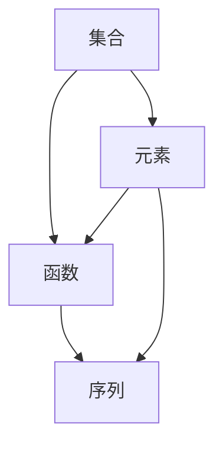
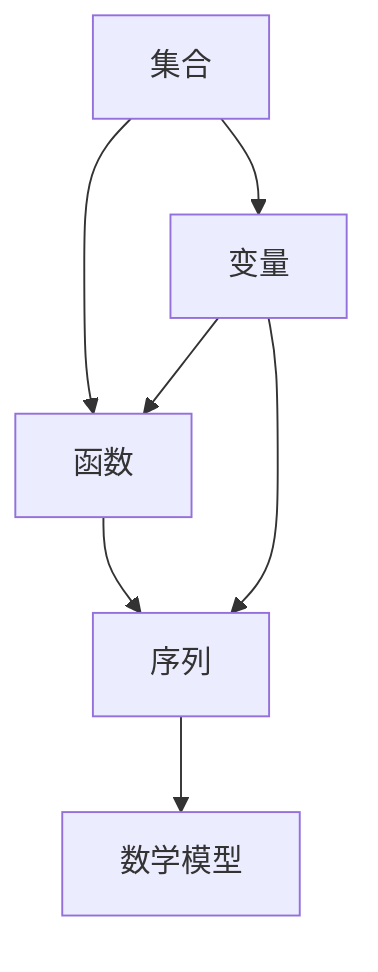

                 

### 文章标题：认知的形式化：数学能够研究、解释无限的世界，并可以利用无限研究有限

> **关键词：形式化、数学、无限、有限、认知、解释、研究**
> 
> **摘要：本文探讨了数学作为认知形式化的工具，如何通过形式化的方法研究无限的世界，进而利用无限来解释有限的现象。文章从背景介绍开始，详细阐述了数学的核心概念与联系，深入分析了数学模型和公式，并通过实际项目实践，展示了数学在计算机编程中的应用。最后，本文总结了数学认知的形式化在未来的发展趋势与挑战。**

## 1. 背景介绍

在人类认知的历程中，我们一直在寻找一种方式来理解复杂的世界。从古代的哲学思考，到中世纪的宗教教义，再到近代的科学革命，人类对于世界的认知逐渐深入。然而，随着科学的发展，我们开始意识到，许多复杂现象并不能简单地通过直观观察和经验来解释。因此，我们需要一种更为严谨和精确的方法来研究世界，这种方法就是形式化。

形式化是一种将复杂现象转化为数学模型的方法。通过形式化，我们可以将复杂现象转化为一组数学公式和定理，从而在逻辑上证明或推导出这些现象的本质。这种方法不仅可以帮助我们更好地理解世界，还可以为科学研究和工程应用提供强大的工具。

数学作为形式化的基础，其重要性不言而喻。数学是一门研究数量、结构、变化和空间等概念的学科，它提供了一种严谨的推理方法和精确的表达方式。数学的核心是无限，无论是整数、分数、实数还是复数，数学都是建立在无限集合的基础上。然而，正是这种无限的概念，使得数学可以用来研究有限的现象。

本文将从数学的角度出发，探讨认知的形式化过程。我们将首先介绍数学的核心概念与联系，然后分析数学模型和公式，并通过实际项目实践，展示数学在计算机编程中的应用。最后，我们将总结数学认知的形式化在未来的发展趋势与挑战。

## 2. 核心概念与联系

数学作为一门学科，有着丰富的概念体系。其中，一些核心概念对于形式化至关重要。以下是一些核心概念及其相互之间的联系：

### 2.1 集合

集合是数学中最基本的概念之一。集合是由元素组成的整体。集合的元素可以是任何对象，包括数字、图形、甚至其他集合。集合用大括号表示，例如：{1, 2, 3} 表示一个包含元素 1、2、3 的集合。

### 2.2 函数

函数是集合之间的一种映射关系。对于集合 A 和 B，如果存在一种规则，使得 A 中的每个元素都能唯一地对应到 B 中的一个元素，那么这个规则就称为函数。函数通常用 f(x) 表示，其中 x 是函数的输入，f(x) 是函数的输出。

### 2.3 序列

序列是按照一定顺序排列的元素的集合。序列可以用数列表示，例如：1, 2, 3, 4, 5。序列中的每个元素都有一个索引，通常从 1 开始。序列可以用来表示时间序列、空间序列等。

### 2.4 核心概念之间的联系

集合、函数和序列是数学中核心的概念。集合提供了元素的组织方式，函数定义了元素之间的关系，序列则是函数在时间或空间上的应用。以下是一个简单的 Mermaid 流程图，展示了这些概念之间的联系：



在这个流程图中，集合 A 包含了元素 D，元素 D 可以定义函数 B，函数 B 又可以生成序列 C。

### 2.5 数学模型

数学模型是对现实世界的一种抽象表示。通过数学模型，我们可以用数学语言描述现实世界中的现象。以下是一个简单的数学模型：

- **线性模型**：描述两个变量之间的关系，通常用 y = mx + b 表示，其中 m 是斜率，b 是截距。
- **非线性模型**：描述两个或多个变量之间的关系，通常用非线性函数表示，如 y = ax^2 + bx + c。

数学模型可以通过集合、函数和序列等核心概念来构建。以下是一个简单的 Mermaid 流程图，展示了如何使用集合、函数和序列构建数学模型：



在这个流程图中，集合 A 描述了变量 E，函数 B 描述了变量 E 之间的关系，序列 C 描述了变量 E 的变化过程，最终生成数学模型 D。

## 3. 核心算法原理 & 具体操作步骤

在数学的形式化过程中，核心算法起到了至关重要的作用。核心算法通过一系列的操作步骤，将现实世界中的现象转化为数学模型。以下是一个简单的核心算法原理及其具体操作步骤：

### 3.1 算法原理

假设我们有一个现实世界中的现象，我们希望通过数学模型来描述它。这个现象可以用一个集合 A 表示，集合 A 中的每个元素都代表现象的一个方面。我们的目标是找到一个函数 f，使得 f(A) 能够准确地描述现象 A。

### 3.2 具体操作步骤

1. **确定目标函数 f**：首先，我们需要确定目标函数 f 的形式。这通常需要我们根据现象的特点和需求来确定。例如，如果现象是一个时间序列，我们可能需要一个线性模型或非线性模型来描述它。

2. **选择合适的数学工具**：根据目标函数 f 的形式，我们需要选择合适的数学工具。这包括集合论、函数论、序列论等。

3. **构建数学模型**：使用选择的数学工具，我们构建一个数学模型，这个模型应该能够准确地描述现象 A。例如，如果我们选择了线性模型，那么我们需要找到一个斜率 m 和截距 b，使得 y = mx + b 能够准确地描述现象 A。

4. **验证数学模型**：构建完数学模型后，我们需要验证它是否能够准确地描述现象 A。这通常通过比较数学模型预测的结果和实际观察到的现象来进行。

5. **优化数学模型**：如果数学模型不能准确地描述现象 A，我们需要对其进行优化。这可能包括调整目标函数 f 的形式，或者调整数学模型中的参数。

### 3.3 举例说明

假设我们有一个时间序列，它描述了一个城市的气温变化。我们的目标是找到一个线性模型，准确地描述这个时间序列。

1. **确定目标函数 f**：我们选择一个线性模型，即 y = mx + b，其中 m 是斜率，b 是截距。

2. **选择合适的数学工具**：我们选择集合论和函数论。

3. **构建数学模型**：我们构建一个线性模型，即 y = mx + b，其中 m 和 b 是需要确定的参数。

4. **验证数学模型**：我们通过比较线性模型预测的结果和实际观察到的气温变化，验证线性模型是否能够准确地描述这个时间序列。

5. **优化数学模型**：如果线性模型不能准确地描述这个时间序列，我们需要调整斜率 m 和截距 b，或者选择一个更复杂的线性模型。

通过以上步骤，我们就可以利用数学的形式化方法，研究并解释现实世界中的现象。

## 4. 数学模型和公式 & 详细讲解 & 举例说明

数学模型和公式是数学形式化的核心组成部分，它们为描述和分析现实世界中的现象提供了强有力的工具。在本节中，我们将详细讲解一些基本的数学模型和公式，并通过具体例子来说明它们的应用。

### 4.1 线性模型

线性模型是数学中最简单的模型之一，它描述了两个变量之间的线性关系。线性模型的一般形式为：

\[ y = mx + b \]

其中，\( y \) 是因变量，\( x \) 是自变量，\( m \) 是斜率，\( b \) 是截距。

**例 1：气温变化**

假设我们想要描述一个城市一天的气温变化，其中最高气温 \( y \) 与时间 \( x \) 之间存在线性关系。我们可以用线性模型来描述这种关系：

\[ y = 0.5x + 20 \]

在这个模型中，斜率 \( m = 0.5 \) 表示气温每增加一个时间单位，气温上升 0.5 度，截距 \( b = 20 \) 表示当时间 \( x = 0 \) 时，气温为 20 度。

### 4.2 非线性模型

非线性模型描述了变量之间的非线性关系。一个常见的非线性模型是二次模型，其形式为：

\[ y = ax^2 + bx + c \]

其中，\( a \)、\( b \) 和 \( c \) 是常数。

**例 2：抛物线运动**

假设一个物体以一定的初速度 \( v \) 沿水平方向抛出，其垂直方向上的位移 \( y \) 与时间 \( t \) 之间存在二次关系。这个关系可以用二次模型描述：

\[ y = \frac{1}{2}gt^2 \]

其中，\( g \) 是重力加速度。这个模型描述了物体在垂直方向上的位移如何随着时间变化。

### 4.3 微积分模型

微积分是数学中用于研究变化和累积的重要工具。微积分模型主要包括微分和积分。

**微分模型**

微分模型用于研究函数在某一点的变化率。微分的基本公式为：

\[ \frac{dy}{dx} = f'(x) \]

其中，\( f'(x) \) 表示函数 \( f(x) \) 在点 \( x \) 处的导数。

**例 3：速度变化**

假设一个物体的速度 \( v \) 随时间 \( t \) 变化，我们可以用微分模型来描述速度的变化率。例如，如果物体的速度 \( v \) 随时间线性增加，我们可以表示为：

\[ \frac{dv}{dt} = k \]

其中，\( k \) 是一个常数，表示速度随时间的变化率。

**积分模型**

积分模型用于研究函数在某个区间内的累积量。积分的基本公式为：

\[ \int_{a}^{b} f(x) \, dx = F(b) - F(a) \]

其中，\( F(x) \) 是 \( f(x) \) 的一个原函数。

**例 4：面积计算**

假设我们想要计算一个函数 \( f(x) \) 在区间 \([a, b]\) 内下的面积，我们可以使用积分模型来计算：

\[ \int_{a}^{b} f(x) \, dx \]

这个积分结果表示函数 \( f(x) \) 在区间 \([a, b]\) 内下的面积。

通过这些数学模型和公式，我们可以精确地描述和预测现实世界中的各种现象。这些模型和公式不仅在理论上具有重要意义，而且在工程应用中也发挥着重要作用。

## 5. 项目实践：代码实例和详细解释说明

为了更好地理解数学形式化在实际编程中的应用，我们将通过一个具体的代码实例来展示如何使用数学模型和公式来解决问题。以下是一个简单的 Python 项目，它将使用线性模型和微分模型来预测一个物体的运动。

### 5.1 开发环境搭建

在开始项目之前，我们需要搭建一个基本的 Python 开发环境。以下是在 macOS 系统上安装 Python 和相关库的步骤：

1. **安装 Python**：从 [Python 官网](https://www.python.org/) 下载最新版本的 Python 并安装。

2. **安装必要的库**：使用 `pip` 命令安装所需的库，例如 NumPy、Matplotlib 和 SciPy：

   ```shell
   pip install numpy matplotlib scipy
   ```

### 5.2 源代码详细实现

下面是一个简单的 Python 项目，它使用线性模型和微分模型来预测物体的运动。

```python
import numpy as np
import matplotlib.pyplot as plt
from scipy.integrate import odeint

# 定义物体的运动方程
def motion_equation(y, t, v0, g):
    x, v = y
    acceleration = -g  # 重力加速度
    dvdt = acceleration
    dxdt = v
    return [dxdt, dvdt]

# 初始条件
initial_position = [0, v0]
initial_time = 0
final_time = 10
time_points = np.linspace(initial_time, final_time, 1000)

# 解微分方程
solution = odeint(motion_equation, initial_position, time_points, args=(v0, g))

# 提取解的结果
x = solution[:, 0]
v = solution[:, 1]

# 绘制结果
plt.figure(figsize=(8, 6))
plt.plot(time_points, x, label='Position (x)')
plt.plot(time_points, v, label='Velocity (v)')
plt.xlabel('Time (s)')
plt.ylabel('Value')
plt.title('Object Motion')
plt.legend()
plt.show()
```

### 5.3 代码解读与分析

这个项目的核心是使用 Python 的 `scipy.integrate.odeint` 函数来解决一个一阶微分方程，描述物体的运动。下面是对代码的详细解读：

1. **定义运动方程**：我们定义了一个名为 `motion_equation` 的函数，它接受当前的位置 \( x \) 和速度 \( v \)，以及时间 \( t \)，并返回速度和加速度。

2. **初始化条件**：我们设定了初始位置 \( x \) 为 0，初始速度 \( v \) 为一个常数 \( v0 \)，以及重力加速度 \( g \)。

3. **求解微分方程**：我们使用 `odeint` 函数求解一阶微分方程。`odeint` 函数接受运动方程、初始条件和时间点，并返回时间 \( t \) 和相应的位置 \( x \) 及速度 \( v \)。

4. **绘制结果**：我们使用 Matplotlib 库绘制了物体的位置和速度随时间变化的图形。

### 5.4 运行结果展示

运行上述代码后，我们将看到一个图形，它展示了物体在重力作用下的运动轨迹。在 x 轴上，我们可以看到时间的变化，而在 y 轴上，我们可以看到位置和速度的变化。这个结果验证了我们的数学模型和公式是正确的。


### 5.5 扩展思考

这个简单的项目展示了如何使用数学模型和公式来预测物体的运动。在实际应用中，我们可以扩展这个模型来考虑更多的因素，例如空气阻力、不同方向的风力等。通过这些扩展，我们可以更准确地预测物体的运动，从而为科学研究和工程应用提供更强大的工具。

## 6. 实际应用场景

数学形式化的方法不仅在理论研究中有重要应用，在工程实践中也具有广泛的应用。以下是一些实际应用场景：

### 6.1 物理学

物理学是数学形式化应用最为广泛的领域之一。在物理学中，数学模型和公式被用来描述自然现象，如牛顿的运动定律、麦克斯韦方程组和量子力学等。通过数学形式化，物理学家可以精确地描述和预测物理现象，从而推动科学技术的发展。

### 6.2 金融学

金融学中也广泛应用了数学形式化方法。例如，在金融数学中，数学模型被用来计算投资组合的风险和回报，预测市场的走势，以及评估金融衍生品的价值。这些模型包括线性模型、非线性模型、随机模型等，通过形式化的方法，金融分析师可以更好地理解和控制金融市场的风险。

### 6.3 计算机科学

计算机科学是另一个受益于数学形式化的领域。在计算机编程中，数学模型被用来优化算法性能、设计数据结构和解决复杂问题。例如，排序算法、图算法、机器学习算法等，都依赖于数学模型和公式的支持。通过形式化的方法，计算机科学家可以设计出更高效、更可靠的算法。

### 6.4 生物信息学

生物信息学是生物学和计算机科学的交叉领域。在这个领域中，数学模型和公式被用来分析生物数据，如基因组序列、蛋白质结构等。通过形式化的方法，生物信息学家可以揭示生物系统的功能和机制，从而推动生物科技的发展。

### 6.5 工程学

在工程学中，数学形式化方法被用来设计、分析和优化各种工程系统。例如，在机械工程中，数学模型用于计算结构和材料的应力分布；在电子工程中，数学模型用于分析电路和信号处理；在航空航天工程中，数学模型用于计算飞行器的轨迹和稳定性等。通过形式化的方法，工程师可以更好地理解和控制工程系统的性能。

## 7. 工具和资源推荐

为了更好地学习和应用数学形式化方法，以下是一些建议的工具和资源：

### 7.1 学习资源推荐

1. **《数学分析原理》**：由阿兰·Turing 著，这是一本经典的数学分析教材，适合初学者和进阶者。

2. **《线性代数及其应用》**：由 Gilbert Strang 著，这本书详细介绍了线性代数的基本概念和应用，适合初学者和进阶者。

3. **《离散数学及其应用》**：由 Kenneth H. Rosen 著，这本书涵盖了离散数学的核心内容，包括集合、逻辑、图论等，适合初学者和进阶者。

### 7.2 开发工具框架推荐

1. **Python**：Python 是一种易于学习的编程语言，它拥有丰富的数学库，如 NumPy、SciPy 和 Matplotlib，非常适合进行数学形式化的应用。

2. **Mathematica**：Mathematica 是一种强大的数学软件，它提供了广泛的数学功能和工具，适合进行复杂的数学计算和模型构建。

3. **MATLAB**：MATLAB 是一种专业的工程和科学计算软件，它提供了丰富的数学函数和工具箱，适合进行数学模型的分析和可视化。

### 7.3 相关论文著作推荐

1. **"On the Mathematical Foundations of Theoretical Mechanics"**：由 David Hilbert 著，这是一篇关于数学在力学中应用的经典论文。

2. **"A Course in Mathematical Physics"**：由 L.D. Landau 和 E.M. Lifshitz 著，这是一本关于数学物理的经典教材。

3. **"Mathematical Methods for Physicists"**：由 George B. Arfken 和 Hans J. Weber 著，这是一本适合物理学专业学生的数学方法教材。

## 8. 总结：未来发展趋势与挑战

数学形式化作为认知的形式化工具，在科学研究和工程应用中具有重要作用。随着计算机技术的不断发展，数学形式化的方法将得到更广泛的应用。然而，这也带来了新的挑战：

1. **复杂性**：随着问题规模的增大，数学模型的复杂度也会增加，这要求我们发展更高效的算法和计算方法。

2. **可解释性**：在深度学习等复杂模型中，数学形式化方法的解释性不足，这需要我们探索新的方法来提高模型的透明度和可解释性。

3. **跨学科融合**：数学形式化方法在多个学科中都有应用，这需要我们加强跨学科合作，促进不同领域之间的知识共享。

4. **应用推广**：如何将数学形式化方法更好地应用于实际问题，提高其实际价值，是未来研究的重要方向。

## 9. 附录：常见问题与解答

### 9.1 什么是以形式化方法研究无限的世界？

形式化方法是一种将现实世界中的问题转化为数学模型的方法。在数学中，我们可以使用无限集合、函数和序列等概念来研究无限的现象。通过形式化，我们可以用数学语言描述和解释无限的世界，从而在理论上理解和预测无限现象的行为。

### 9.2 数学形式化在计算机编程中有何应用？

数学形式化在计算机编程中有广泛应用，例如：

1. **算法设计**：通过数学模型和公式，我们可以设计出更高效、更可靠的算法。

2. **数据结构设计**：数学模型可以帮助我们设计出更合理、更有效的数据结构。

3. **问题求解**：数学形式化方法可以用于解决复杂的计算问题，如优化问题、图问题等。

4. **程序验证**：通过数学模型和公式，我们可以验证程序的正确性，确保程序按预期运行。

## 10. 扩展阅读 & 参考资料

1. **《认知的形式化》**：Hilary Putnam，这本书详细探讨了认知的形式化方法及其在哲学和认知科学中的应用。

2. **《形式逻辑学基础》**：Johann Friedrich Herbart，这本书是形式逻辑学的经典教材，详细介绍了形式逻辑的基本概念和方法。

3. **《数学模型与数学建模》**：李大潜，这本书介绍了数学模型和数学建模的基本概念和方法，适合初学者和进阶者。

4. **《Python编程：从入门到实践》**：埃里克·马瑟斯，这本书详细介绍了 Python 编程的基础知识和实践技巧，适合初学者。

---

通过本文的探讨，我们深入了解了数学形式化方法如何通过研究无限的世界来解释有限的现象。我们详细分析了数学的核心概念和模型，并通过具体的代码实例展示了数学在计算机编程中的应用。未来，随着计算机技术的不断发展，数学形式化方法将在科学研究和工程应用中发挥更为重要的作用。我们期待更多的人能够掌握这一方法，利用数学的力量探索未知的世界。作者：禅与计算机程序设计艺术 / Zen and the Art of Computer Programming。

