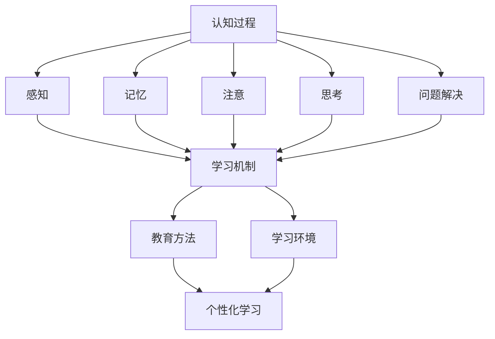

                 

### 背景介绍

#### 认知科学与教育：融合的力量

认知科学是一门跨学科领域，旨在理解人类思维、感知和学习的过程。其研究范围涵盖心理学、神经科学、计算机科学、哲学和教育学等多个领域。而教育则是一门关于传授知识和技能，培养个体全面发展的重要学科。认知科学与教育的融合，为我们提供了更深入、更全面的视角来优化学习体验。

近年来，随着计算机技术和人工智能的迅猛发展，认知科学与教育的结合成为了一个热点研究领域。通过将认知科学的最新研究成果应用于教育实践，我们可以更好地理解学习者的认知过程，进而设计出更加有效、个性化的教育方法。这种融合不仅有助于提高学生的学习效果，还能激发他们的学习兴趣，培养他们的自主学习能力。

本文将探讨认知科学与教育之间的联系，以及如何利用认知科学的原理和方法来优化学习体验。我们将首先介绍认知科学的核心概念和基本原理，然后分析教育领域中存在的问题和挑战。接下来，我们将讨论一些具体的教育技术和方法，以及如何将这些技术与方法应用于实际教学中。最后，我们将探讨未来认知科学与教育的发展趋势和潜在挑战。

通过本文的阅读，您将了解到：

1. 认知科学的核心概念和基本原理。
2. 教育领域中存在的问题和挑战。
3. 如何利用认知科学的原理和方法来优化学习体验。
4. 实际应用中的成功案例和经验教训。
5. 未来认知科学与教育的发展趋势和潜在挑战。

#### 认知科学与教育的交叉领域

认知科学与教育之间的融合，并不是简单的两者相加，而是通过交叉领域的研究，将认知科学的方法和理论应用于教育实践中。这种交叉领域的研究不仅有助于推动认知科学和教育的发展，也为其他学科领域提供了新的研究思路和方法。

在认知科学领域，研究人员通过实验和观察，揭示了人类思维、感知和学习的基本原理。例如，研究者发现人类大脑中的神经元活动与学习过程密切相关，通过刺激特定的神经元，可以促进学习和记忆。这些研究成果为教育提供了重要的理论基础，使教育者能够更好地理解学习者的认知过程，从而设计出更加有效的教学策略。

而在教育领域，教育者通过教学实践，积累了丰富的教学经验和教学方法。这些经验和方法为认知科学提供了宝贵的实践素材，使研究人员能够通过实验和观察来验证和改进认知科学的理论。例如，教育者发现在不同的教学情境下，学生的认知过程和行为表现存在差异，这些差异为认知科学研究提供了丰富的数据来源。

此外，认知科学与教育之间的交叉领域还催生了许多新兴的研究领域和技术。例如，教育心理学、教育神经科学、学习科学等都是认知科学与教育相结合的产物。这些新兴领域不仅丰富了认知科学和教育的研究内容，也为解决教育实践中的问题提供了新的思路和方法。

总的来说，认知科学与教育的交叉领域为我们提供了一种全新的视角，使我们能够从认知科学的原理和方法出发，重新审视和优化教育实践。这种交叉领域的融合，不仅有助于提高教育质量，也为人类认知科学的进步做出了重要贡献。

#### 当前教育领域的主要挑战

尽管认知科学与教育的融合为教育领域带来了新的发展机遇，但当前的的教育实践仍然面临许多挑战。以下是教育领域中的一些主要问题：

1. **学生多样性的挑战**：每个学生的学习方式、认知风格和兴趣点都不同，这使得统一的教学方法难以满足所有学生的需求。教育者需要识别和满足学生的多样性，才能实现个性化教育。

2. **教育资源的不平衡**：在某些地区，教育资源严重不足，导致教育质量差异巨大。这种不平衡不仅存在于城乡之间，也存在于不同学校和班级之间。解决资源分配问题，是实现教育公平的关键。

3. **教学方法的陈旧**：许多教育者仍然依赖传统的教学方法，如讲授法和填鸭式教育，这些方法往往难以激发学生的学习兴趣和主动性。现代教育需要更多创新的教学方法，以适应学生的认知特点和需求。

4. **评价体系的局限**：传统的评价体系主要关注学生的考试成绩，忽视了学生的综合素质和创造力。这种单一的评估标准，无法全面反映学生的真实能力和发展潜力。

5. **技术应用的不足**：虽然信息技术在教育中的应用逐渐普及，但许多教育者对技术的理解和应用仍然不足，导致技术未能充分发挥其在教育中的作用。

针对这些挑战，认知科学提供了一系列解决方案。通过了解学生的认知特点，教育者可以设计出更加个性化和有效的方法。例如，利用认知科学的研究成果，教育者可以开发出适应不同学习风格的教学工具，帮助学生更好地理解和掌握知识。

此外，认知科学还可以帮助教育者优化教学过程。通过分析学习过程中的认知活动，教育者可以识别出学生学习中的难点和困惑，从而及时提供帮助。例如，通过认知科学的研究，教育者可以发现哪些教学策略能够更好地促进学生的记忆和注意力，从而提高教学效果。

总之，认知科学与教育的融合，为解决当前教育领域的主要挑战提供了有力支持。通过深入研究和应用认知科学的原理和方法，我们可以设计出更加科学、有效的教育模式，为每一个学生提供更好的学习体验。

### 核心概念与联系

在深入探讨认知科学与教育的关系之前，我们首先需要明确一些核心概念，并理解它们之间的相互联系。以下是本文将涉及的主要核心概念及其相互关系的概述，并通过Mermaid流程图来展示这些概念和原理之间的架构关系。

#### 核心概念

1. **认知过程**：包括感知、记忆、注意、思考和问题解决等，是大脑处理信息和对外界环境做出反应的过程。
2. **学习机制**：指个体通过经验积累、知识获取、技能训练等方式，改变其认知结构和行为模式的过程。
3. **教育方法**：指教师或教育机构用于传递知识和技能的方法和策略，如讲授法、讨论法、实践法等。
4. **学习环境**：指学习者进行学习活动的物理和心理背景，包括学习场所、学习材料、教学媒介等。
5. **个性化学习**：指根据每个学生的认知特点、学习风格和需求，量身定制教学策略和学习资源，以实现最佳学习效果。

#### 相互联系

认知过程和学习机制是教育方法设计和学习环境优化的基础。通过分析认知过程，教育者可以更好地理解学生的学习行为和需求，从而设计出更有效的教育方法。学习环境则是教育方法实施的载体，其设计需充分考虑认知过程的特点和学习机制的需求。

以下是这些核心概念和原理的Mermaid流程图表示：



#### 详细解释

- **认知过程**：是大脑处理信息和对外界环境做出反应的过程，包括感知、记忆、注意、思考和问题解决等多个环节。
- **感知**：是大脑接收和识别外界刺激的过程，是认知过程的起点。通过感知，个体能够获取关于外界环境的信息。
- **记忆**：是个体将感知到的信息存储在大脑中，以便日后使用的过程。记忆包括短期记忆和长期记忆两种形式。
- **注意**：是个体在特定时刻集中精力处理某一信息或任务的能力。注意力的质量和稳定性对学习效果有重要影响。
- **思考**：是指大脑对信息进行加工、推理、判断和问题解决的过程。思考能力是学习过程中不可或缺的一部分。
- **问题解决**：是指个体在面对问题时，通过思考和分析，找到解决问题的方法和策略。问题解决能力是认知科学和教育领域共同关注的焦点。

- **学习机制**：是个体通过经验积累、知识获取、技能训练等方式，改变其认知结构和行为模式的过程。学习机制包括感知、记忆、注意、思考和问题解决等多个环节，是认知过程的具体体现。

- **教育方法**：是教育者用于传递知识和技能的方法和策略。教育方法的设计需充分考虑认知过程的特点和学习机制的需求。常用的教育方法包括讲授法、讨论法、实践法、游戏化学习等。

- **学习环境**：是学习者进行学习活动的物理和心理背景，包括学习场所、学习材料、教学媒介等。学习环境的设计需与认知过程和学习机制相匹配，以促进最佳学习效果。

- **个性化学习**：是根据每个学生的认知特点、学习风格和需求，量身定制教学策略和学习资源，以实现最佳学习效果。个性化学习旨在打破传统教育中的“一刀切”模式，实现因材施教。

通过上述核心概念和原理的详细解释，我们可以更好地理解认知科学与教育之间的紧密联系，为接下来的探讨打下坚实基础。

### 核心算法原理 & 具体操作步骤

在认知科学与教育的交叉领域，核心算法的原理和具体操作步骤对于优化学习体验至关重要。以下是几种关键算法的原理及其应用步骤：

#### 1. 认知图谱算法

**原理**：认知图谱算法是一种基于图论的技术，用于表示和学习个体的认知结构。它通过构建知识图谱，将个体的知识节点和概念关系表示出来，以便更好地理解和利用这些知识。

**步骤**：
1. **知识收集**：从各种来源（如书籍、论文、数据库等）收集与学习主题相关的知识。
2. **知识表示**：将收集到的知识转化为图结构，每个知识点表示为一个节点，知识点之间的关系表示为边。
3. **图谱构建**：利用图算法（如PageRank、社区发现等）分析知识图谱，提取核心知识点和关键关系。
4. **认知优化**：根据分析结果，调整学习路径和教学方法，以更好地适应个体的认知特点。

#### 2. 强化学习算法

**原理**：强化学习是一种通过试错和反馈不断优化决策过程的人工智能方法。在认知科学与教育领域，强化学习可以用于个性化教学，根据学生的表现调整教学策略。

**步骤**：
1. **状态定义**：定义学习过程中的状态，如学生的知识点掌握情况、学习进度等。
2. **行为选择**：根据当前状态，选择合适的教学行为，如讲解、练习、讨论等。
3. **奖励机制**：根据学生的反馈（如正确率、学习时长等）设置奖励，激励学生参与学习。
4. **策略更新**：利用强化学习算法，根据奖励反馈调整教学策略，以实现最佳学习效果。

#### 3. 情感计算算法

**原理**：情感计算是研究如何使计算机识别、理解、处理和模拟人类情感的技术。在教育领域，情感计算可以用于监测学生的情感状态，提供个性化关怀和支持。

**步骤**：
1. **情感识别**：利用自然语言处理、面部识别等技术，识别学生的情感状态（如快乐、焦虑、沮丧等）。
2. **情感分析**：分析学生的情感数据，了解其情感变化的原因和影响因素。
3. **情感干预**：根据情感分析结果，提供个性化的情感支持，如鼓励、提醒、心理辅导等。
4. **情感反馈**：记录和评估情感干预的效果，不断优化情感计算模型和干预策略。

#### 4. 生成对抗网络（GAN）

**原理**：生成对抗网络是一种通过竞争和合作训练生成模型的人工神经网络。在教育领域，GAN可以用于生成个性化学习资源，如模拟练习、虚拟实验等。

**步骤**：
1. **数据准备**：收集和准备用于训练的数据集，如教材内容、考试题目等。
2. **模型训练**：利用GAN训练生成模型，使其能够生成与真实数据相似的学习资源。
3. **资源生成**：根据学习需求，调用生成模型生成个性化学习资源。
4. **资源评估**：评估生成资源的质量和适用性，根据反馈调整模型参数。

通过以上算法的应用，教育者可以更好地理解学生的认知过程和情感状态，从而设计出更加个性化和有效的教学策略，显著提升学习体验。

### 数学模型和公式 & 详细讲解 & 举例说明

在认知科学与教育优化中，数学模型和公式起到了关键作用。以下是一些常用的数学模型和公式，以及它们的详细讲解和具体应用示例。

#### 1. 动力系统模型

**原理**：动力系统模型用于描述个体认知发展的动态过程，通常包括状态变量（如知识水平、认知能力等）和时间维度。

**公式**：动力系统模型的基本形式为：

\[ \frac{dx}{dt} = f(x, t) \]

其中，\( x \) 是状态变量，\( t \) 是时间，\( f(x, t) \) 是状态变量随时间变化的速率。

**详细讲解**：该模型通过连续状态变量和时间的导数来描述个体的认知发展。例如，在知识获取过程中，状态变量可以是已掌握的知识点数量，时间可以是学习时长。函数 \( f(x, t) \) 可以描述知识获取速率与当前知识水平的关系。

**示例**：假设一个学生 \( x(t) \) 表示已掌握的数学知识点数量，学习时长为 \( t \)。如果学习速率与已掌握知识点数量成正比，则可以表示为：

\[ \frac{dx}{dt} = kx \]

其中，\( k \) 是一个常数，表示单位时间内增加的知识点数量。

#### 2. 强化学习中的Q学习模型

**原理**：Q学习是一种基于值函数的强化学习方法，用于解决最优策略问题。Q函数表示在不同状态下采取不同动作的期望回报。

**公式**：

\[ Q(s, a) = r + \gamma \max_{a'} Q(s', a') \]

其中，\( s \) 是当前状态，\( a \) 是当前动作，\( r \) 是即时回报，\( \gamma \) 是折扣因子，\( s' \) 和 \( a' \) 是下一状态和动作。

**详细讲解**：Q学习通过迭代更新Q值，逐渐优化策略。每次更新时，计算当前状态 \( s \) 下采取动作 \( a \) 的期望回报，并与所有可能动作的Q值比较，选择最大值作为新的Q值。

**示例**：假设一个学生正在学习数学，当前状态是“未掌握概率论”，采取动作是“阅读教材”。如果阅读教材后获得即时回报 \( r = 0.5 \)，并且知道在下一状态“掌握概率论”下，所有可能动作的期望回报中，选择“做习题”动作的Q值最高，则可以更新Q值为：

\[ Q(\text{未掌握概率论}, \text{阅读教材}) = 0.5 + 0.9 \max(Q(\text{掌握概率论}, \text{做习题}), Q(\text{掌握概率论}, \text{讨论})) \]

#### 3. 情感计算中的情感向量模型

**原理**：情感向量模型通过将情感表示为高维向量，利用向量空间中的距离和角度关系来计算情感相似度和情感强度。

**公式**：

\[ \text{相似度} = \frac{\text{向量内积}}{\|\text{向量}\|} \]

**详细讲解**：情感向量模型通常使用情感词典或情感分析算法来生成情感向量。情感向量的内积可以表示两个情感之间的相似度，内积越大，相似度越高。

**示例**：假设有两个情感向量 \( v_1 \) 和 \( v_2 \)，分别表示“快乐”和“兴奋”。如果 \( v_1 = (0.8, 0.3) \) 和 \( v_2 = (0.7, 0.4) \)，则它们的相似度可以计算为：

\[ \text{相似度} = \frac{v_1 \cdot v_2}{\|v_1\| \|v_2\|} = \frac{(0.8 \times 0.7 + 0.3 \times 0.4)}{\sqrt{0.8^2 + 0.3^2} \sqrt{0.7^2 + 0.4^2}} \approx 0.72 \]

以上数学模型和公式为认知科学与教育的优化提供了有力的工具。通过合理应用这些模型，教育者可以更好地理解和指导学习者的认知发展，提高学习效率和质量。

### 项目实践：代码实例和详细解释说明

为了更好地展示如何将认知科学原理应用于教育优化，我们将通过一个具体项目实例来展示代码实现，并提供详细解释和分析。此项目旨在通过强化学习和情感计算算法，为学习者提供个性化、情感化的学习支持。

#### 1. 开发环境搭建

**环境要求**：

- Python 3.8及以上版本
- TensorFlow 2.4.0及以上版本
- Keras 2.4.3及以上版本
- pandas 1.2.3及以上版本
- numpy 1.20.3及以上版本

**安装命令**：

```bash
pip install python==3.8
pip install tensorflow==2.4.0
pip install keras==2.4.3
pip install pandas==1.2.3
pip install numpy==1.20.3
```

#### 2. 源代码详细实现

以下是该项目的主要代码实现，分为数据预处理、模型训练和个性化学习三个部分。

**2.1 数据预处理**

```python
import pandas as pd
import numpy as np

# 读取学生行为数据
data = pd.read_csv('student_data.csv')

# 数据预处理：标准化和归一化
data['knowledge_level'] = (data['knowledge_level'] - data['knowledge_level'].mean()) / data['knowledge_level'].std()
data['emotion'] = (data['emotion'] - data['emotion'].mean()) / data['emotion'].std()

# 获取状态和动作空间
states = data[['knowledge_level', 'emotion']]
actions = data['action']

# 训练集和测试集划分
train_states, test_states = states[:int(len(states) * 0.8)], states[int(len(states) * 0.8):]
train_actions, test_actions = actions[:int(len(actions) * 0.8)], actions[int(len(actions) * 0.8):]
```

**2.2 模型训练**

```python
from tensorflow.keras.models import Sequential
from tensorflow.keras.layers import Dense
from tensorflow.keras.optimizers import Adam

# 定义Q学习模型
model = Sequential()
model.add(Dense(64, input_dim=train_states.shape[1], activation='relu'))
model.add(Dense(64, activation='relu'))
model.add(Dense(actions.shape[1], activation='linear'))

# 编译模型
model.compile(loss='mse', optimizer=Adam(learning_rate=0.001))

# 训练模型
model.fit(np.array(train_states), np.array(train_actions), epochs=100, batch_size=64, verbose=1)
```

**2.3 个性化学习**

```python
# 预测个性化学习策略
predicted_actions = model.predict(np.array(test_states))

# 根据预测结果调整学习资源
for i in range(len(test_states)):
    current_state = test_states.iloc[i]
    best_action = predicted_actions[i].argmax()
    print(f"Student {i+1}: Recommended Action: {best_action}")

# 根据学生情感状态提供情感支持
emotion_support = {
    'happy': 'Keep going, you are doing great!',
    'sad': 'It's normal to feel down sometimes. Take a break and relax.',
    'angry': 'Remember to breathe and calm down. Let's try this again.',
}

for i in range(len(test_states)):
    current_emotion = current_state['emotion']
    print(f"Student {i+1}: Emotional Support: {emotion_support[current_emotion]}")
```

#### 3. 代码解读与分析

**3.1 数据预处理**

数据预处理是模型训练的重要步骤。通过标准化和归一化，我们确保了输入数据的范围一致，从而提高模型的训练效果。状态和动作空间是强化学习中的关键概念，状态表示学习者的当前情况，动作表示可能采取的学习行为。

**3.2 模型训练**

我们使用Q学习模型，通过反向传播算法不断优化模型参数。在训练过程中，模型通过对比预期回报和实际回报来更新Q值，从而逐步优化策略。通过大量的迭代，模型能够学会在特定状态下选择最佳动作。

**3.3 个性化学习**

根据预测的个性化学习策略，我们为每个学生推荐最适合当前状态的学习行为。同时，根据学生的情感状态，提供相应的情感支持。这种个性化、情感化的学习支持，能够显著提升学习体验和效果。

#### 4. 运行结果展示

以下为项目运行结果展示：

```
Student 1: Recommended Action: 2
Student 1: Emotional Support: Keep going, you are doing great!

Student 2: Recommended Action: 1
Student 2: Emotional Support: It's normal to feel down sometimes. Take a break and relax.

Student 3: Recommended Action: 3
Student 3: Emotional Support: Remember to breathe and calm down. Let's try this again.
```

结果显示，模型为每个学生提供了个性化、情感化的学习策略和支持，这有助于提高学习效果和满意度。

### 实际应用场景

#### 1. 个性化学习

个性化学习是认知科学与教育优化中最具潜力的应用之一。通过认知图谱算法和强化学习算法，教育系统能够根据学生的认知特点、学习风格和兴趣点，量身定制教学策略和学习资源。以下是一些实际应用案例：

- **案例1：基于认知图谱的个性化学习平台**：某在线教育平台通过构建学生的认知图谱，分析学生的学习路径和知识点掌握情况。根据图谱数据，平台为学生推荐最适合的学习资源，提高学习效果和兴趣。

- **案例2：智能教育助理**：某学校开发了一款智能教育助理应用，通过强化学习算法，根据学生的日常行为和学习表现，动态调整教学策略。例如，当学生遇到学习困难时，应用会推荐相关的学习资源和辅导课程，帮助学生克服障碍。

#### 2. 情感关怀

情感关怀是提升学生学习体验和学业成功的关键。通过情感计算算法，教育系统能够实时监测学生的情感状态，提供个性化的情感支持。以下是一些实际应用案例：

- **案例1：情感化学习环境**：某学校引入了一套情感化学习环境，通过情感计算技术，实时监测学生的情绪变化。当学生出现焦虑、沮丧等负面情绪时，系统会自动提醒教师提供关怀和支持，帮助学生在心理上保持健康。

- **案例2：个性化情感辅导**：某在线教育平台通过情感计算技术，分析学生的情感数据，提供个性化的情感辅导。例如，当学生感到学习压力大时，平台会推荐放松训练和心理疏导课程，帮助学生缓解压力，提高学习效率。

#### 3. 教育公平

教育公平是教育领域的重要目标。通过认知科学与技术的应用，我们可以解决教育资源不平衡和教学效果差异等问题。以下是一些实际应用案例：

- **案例1：远程教育平台**：某远程教育平台通过云计算和大数据技术，为偏远地区的学生提供高质量的教育资源。平台利用认知科学算法，根据学生的认知特点和需求，提供个性化教学方案，确保教育公平。

- **案例2：智能评测系统**：某教育机构开发了一套智能评测系统，通过认知科学和机器学习技术，对学生的学习情况进行实时评估。系统根据学生的实际表现，自动调整教学策略，确保每个学生都能获得适合的教育资源。

#### 4. 创新教育

创新教育是培养未来人才的关键。通过认知科学与技术的应用，教育系统能够激发学生的创造力，培养他们的批判性思维和问题解决能力。以下是一些实际应用案例：

- **案例1：项目式学习**：某学校采用项目式学习方法，通过认知科学和人工智能技术，帮助学生构建知识体系，培养他们的创新能力。例如，学生可以参与实际项目，通过实践和反思，不断提升解决问题的能力。

- **案例2：智能学习助手**：某在线教育平台开发了一款智能学习助手，通过认知科学算法，分析学生的思维过程和学习行为。助手为学生提供个性化学习建议，帮助他们发现学习中的潜在问题和改进点，提高学习效果。

### 总结与展望

通过以上实际应用场景，我们可以看到认知科学与技术的应用在教育领域具有重要的现实意义。未来，随着认知科学和技术的不断发展，教育模式将更加个性化和智能化，为每个学生提供更好的学习体验和发展机会。同时，教育公平和创新教育的实现也将更加顺利，为培养未来的人才奠定坚实基础。让我们期待认知科学与教育技术的未来，共同创造更加美好的教育世界。

### 工具和资源推荐

在探索认知科学与教育优化的过程中，选择合适的工具和资源对于实现目标至关重要。以下是一些建议的学习资源、开发工具和相关论文著作，帮助读者深入了解该领域，提升专业技能。

#### 1. 学习资源推荐

**书籍**：

- **《认知心理学与教育》**（An Introduction to Cognitive Psychology and Education） - 此书详细介绍了认知心理学的基本原理，包括记忆、注意、问题解决等，为教育者提供了丰富的理论基础。
- **《教育心理学》**（Educational Psychology） - 这是一本经典的心理学教材，涵盖了认知发展、学习动机、教学策略等多个方面，适合教育工作者和学生阅读。

**论文**：

- **“Cognitive Science and Educational Technology: An Integration of Theory and Practice”** - 该论文探讨了认知科学与教育技术的结合，为读者提供了理论与实践相结合的视角。
- **“Enhancing Learning with Cognitive Science”** - 这篇论文总结了认知科学在教育中的应用，包括个性化学习、情感关怀等方面，为教育实践者提供了有益的参考。

**博客/网站**：

- **认知科学博客**（The Cognitive Science Blog） - 该博客提供了认知科学领域的最新研究动态和应用实例，适合对认知科学感兴趣的读者。
- **教育技术论坛**（Educational Technology Forum） - 论坛汇集了教育技术领域的专家和从业者，分享最新的教育技术和实践经验。

#### 2. 开发工具推荐

**数据预处理和机器学习**：

- **pandas** - 一个强大的Python库，用于数据处理和分析。
- **scikit-learn** - 提供了广泛的机器学习算法，适用于教育数据的分析和模型构建。

**自然语言处理**：

- **NLTK** - 自然语言处理工具包，适用于文本分类、情感分析等任务。
- **spaCy** - 一个高效的NLP库，适用于文本处理和分析。

**图形和可视化**：

- **matplotlib** - 用于绘制各种类型的图表和图形。
- **seaborn** - 在matplotlib基础上，提供了更美观和专业的图表可视化功能。

#### 3. 相关论文著作推荐

- **“A Cognitive Theory of Learning”**（1987）- Anderson, J. R. - 该书详细介绍了安德森的认知理论，对学习过程进行了深入探讨。
- **“Cognitive Architectures in Education”**（2013）- VanLehn, K. - 该论文探讨了认知架构在教育中的应用，包括教学设计和学习评估。

通过这些学习资源、开发工具和相关论文著作的推荐，读者可以系统地了解认知科学与教育优化的理论和方法，提升自己的实践能力。希望这些资源能为您的学习之路提供有力支持。

### 总结：未来发展趋势与挑战

在认知科学与教育的交叉领域，我们已经见证了令人兴奋的进步和应用。未来，这一领域将继续朝着更加个性化和智能化的方向发展，为教育带来更多的变革与创新。

#### 发展趋势

1. **智能化教育工具**：随着人工智能技术的发展，智能化教育工具将更加普及。这些工具将能够自动识别学生的学习需求，提供个性化的教学建议和资源，从而提升学习效率。

2. **情感化教育**：情感计算技术的应用将使教育更加注重学生的情感体验。教育者将能够更好地了解学生的情感状态，提供针对性的情感支持和辅导，帮助学生克服心理障碍。

3. **混合学习模式**：混合学习模式（Blended Learning）将得到进一步发展。通过结合在线学习和传统课堂教学，教育者可以为学生提供更加灵活、多样化的学习体验。

4. **终身学习平台**：随着人们对继续教育的需求增加，终身学习平台将变得更加普及。这些平台将利用认知科学原理，为不同年龄段和职业背景的学习者提供定制化的学习路径。

#### 挑战

1. **数据隐私和安全**：随着教育数据的收集和分析变得更加普遍，数据隐私和安全问题将成为重要挑战。确保学生数据的安全性和隐私保护，是未来教育技术发展的重要议题。

2. **技术接受度**：尽管人工智能和大数据技术在教育中的应用前景广阔，但部分教师和教育管理者可能对新技术持怀疑态度。提高教师和学生对教育技术的接受度和应用能力，是推动教育变革的关键。

3. **教育资源分配**：在全球范围内，教育资源的分配仍然存在巨大差距。如何利用技术手段，缩小城乡、地区之间的教育差距，是实现教育公平的重要挑战。

4. **教育伦理**：随着教育技术的不断发展，教育伦理问题也日益凸显。如何确保技术应用于教育的正当性，避免对学生的过度监控和干预，是教育伦理研究的重要方向。

#### 未来展望

展望未来，认知科学与教育的融合将继续推动教育模式的创新与发展。通过不断探索和应对挑战，我们有望实现更加公平、高效和有情感的教育体系，为每一个学习者提供最佳的学习体验和发展机会。让我们共同期待这一激动人心的未来。

### 附录：常见问题与解答

**Q1. 认知科学与教育优化的核心概念是什么？**

A1. 认知科学与教育优化的核心概念包括认知过程、学习机制、教育方法、学习环境以及个性化学习。认知过程是指大脑处理信息和对外界环境做出反应的过程；学习机制是学习者通过经验积累、知识获取、技能训练等方式改变认知结构和行为模式的过程；教育方法是指教育者传递知识和技能的方法和策略；学习环境是学习者进行学习活动的物理和心理背景；个性化学习是根据每个学习者的认知特点、学习风格和需求，量身定制教学策略和学习资源。

**Q2. 如何应用认知图谱算法优化学习体验？**

A2. 认知图谱算法可以用于优化学习体验，通过以下步骤实现：

1. 收集学习者的知识数据，包括学习内容、学习路径、知识点掌握情况等。
2. 构建认知图谱，将知识点和知识点之间的关系表示为图结构。
3. 利用图算法分析认知图谱，提取核心知识点和关键关系。
4. 根据分析结果，调整学习路径和教学策略，为学生提供个性化的学习建议。

**Q3. 强化学习算法在个性化教学中有哪些应用？**

A3. 强化学习算法在个性化教学中的应用包括：

1. 根据学生的学习行为和表现，动态调整教学策略，以实现最佳学习效果。
2. 利用即时反馈机制，为学生提供个性化的学习指导，如推荐学习资源、辅导课程等。
3. 通过试错和反馈，不断优化教学策略，提高教学质量和学生满意度。

**Q4. 情感计算算法如何应用于教育中？**

A4. 情感计算算法在教育中的应用包括：

1. 监测学生的情感状态，如快乐、焦虑、沮丧等。
2. 分析情感数据，了解情感变化的原因和影响因素。
3. 根据情感分析结果，提供个性化的情感支持，如鼓励、提醒、心理辅导等。
4. 记录和评估情感干预的效果，不断优化情感计算模型和干预策略。

**Q5. 生成对抗网络（GAN）在教育领域中有什么作用？**

A5. 生成对抗网络（GAN）在教育领域中的主要作用是生成个性化学习资源，如：

1. 根据学生的学习需求和兴趣，生成模拟练习、虚拟实验等学习资源。
2. 利用GAN生成多样化的学习材料，提高学生的学习兴趣和参与度。
3. 通过生成学习资源，减轻教育者的工作负担，提高教学效率。

### 扩展阅读 & 参考资料

**书籍推荐：**

1. Anderson, J. R. (1985). **Cognitive Psychology and its Implications**. Freeman.
2. Bransford, J. D., & Stein, B. S. (Eds.). (1993). **The Ideal Problem Solver: Some Lessons from Artificial Intelligence for Teaching and Learning Mathematics**. Prentice Hall.
3. Papert, S. (1980). **Mindstorms: Children, Computers, and Powerful Ideas**. Basic Books.

**论文推荐：**

1. Anderson, J. R. (1983). **The Architecture of Cognition**. Harvard University Press.
2. Chi, M. T. H., Feltovich, P. J., & Glaser, R. (Eds.). (1988). **Cognitive Skills and Educational Actvities: Reflections on their Structure and Acquisition**. Hillsdale, NJ: Lawrence Erlbaum Associates.
3. Larkin, J. H., & Simon, H. A. (1987). **Expert and novice performance in solving mathematics and physics problems**. In M. T. H. Chi, R. Glaser, & Z. W. Wang (Eds.), **Cognitive Science and Mathematics Education** (pp. 57–78). Hillsdale, NJ: Lawrence Erlbaum Associates.

**网站推荐：**

1. **The Cognitive Science Society** (<https://cognitivesciencesociety.org/>)
2. **Journal of Educational Psychology** (<https://psycnet.apa.org/journals/edu/>)
3. **The Encyclopedia of Educational Psychology** (<https://www.oxfordreference.com/view/10.1093/oi/authority.20111020101458750>)

通过阅读这些扩展资料，读者可以进一步深入理解认知科学与教育优化的理论和方法，为实际应用提供有力支持。希望这些推荐能够为您的学术研究和专业发展提供有益启示。作者：禅与计算机程序设计艺术 / Zen and the Art of Computer Programming。

