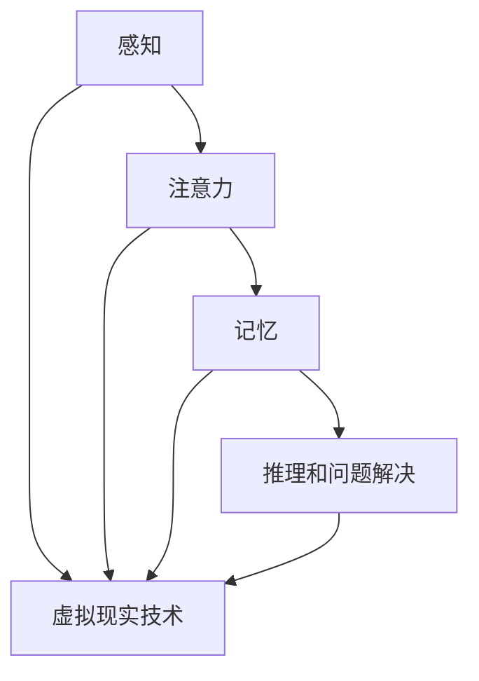

                 

### 认知科学与虚拟现实：沉浸式学习体验

#### 关键词 Keywords：
- 认知科学
- 虚拟现实
- 沉浸式学习
- 人机交互
- 神经科学
- 用户体验

##### 摘要 Summary:
本文将探讨认知科学与虚拟现实技术的结合，尤其是如何通过沉浸式学习体验提升学习效果。我们将深入分析认知科学中的核心概念，了解人类大脑的学习机制，以及虚拟现实如何模拟这些机制。通过详细的算法原理和实际案例，我们将展示如何利用虚拟现实技术构建有效的学习环境，并提供相关的工具和资源推荐，以帮助读者进一步探索这一领域。

---

#### 1. 背景介绍

##### 1.1 认知科学与虚拟现实的历史与发展

认知科学是一门跨学科的领域，它研究人类思维、感知、记忆和学习等心理过程。自20世纪中叶以来，认知科学经历了快速的发展，包括神经科学、心理学、语言学等多个学科对认知过程的深入探索。与此同时，虚拟现实（VR）技术也在不断进步，从早期的实验性设备到如今的商用产品，VR的应用范围日益广泛。

认知科学和虚拟现实技术的结合可以追溯到20世纪90年代。当时，研究者开始尝试使用VR技术来模拟认知过程，如记忆障碍和感知错觉。随着技术的发展，VR在教育和培训领域的应用逐渐增多，特别是在医学、军事和工程等领域。

##### 1.2 沉浸式学习体验的重要性

沉浸式学习体验是一种通过全身心投入来学习新知识和技能的方法。与传统的学习方式相比，沉浸式学习具有以下几个显著优势：

1. **增强记忆**：通过身体和感官的全面参与，学习内容更容易被大脑记忆和编码。
2. **提高学习效率**：沉浸式环境能够激发学生的兴趣，从而提高学习动机和效率。
3. **个性化学习**：虚拟现实可以根据学习者的不同需求和进度进行个性化调整，提供定制化的学习体验。

### 2. 核心概念与联系

#### 2.1 认知科学的核心概念

认知科学中的核心概念包括感知、注意力、记忆、推理和问题解决等。以下是这些概念的定义及其在虚拟现实中的应用：

- **感知**：感知是指从外部环境中获取信息的过程。在虚拟现实中，通过头戴显示器（HMD）和传感器，用户可以感受到逼真的三维视觉、听觉和其他感官体验。
- **注意力**：注意力是心理资源的一种分配方式，决定了用户在虚拟环境中关注哪些信息。通过设计多感官的交互方式，可以引导用户将注意力集中在关键的学习内容上。
- **记忆**：记忆是认知过程中的关键环节。虚拟现实技术可以通过重复练习、情境再现等方式，增强记忆效果。
- **推理和问题解决**：虚拟现实提供了丰富的模拟环境，用户可以在其中进行复杂的推理和问题解决，从而提高这些认知技能。

#### 2.2 虚拟现实技术与认知科学的关系

虚拟现实技术为认知科学研究提供了新的工具和方法。通过模拟真实世界的环境和情境，虚拟现实可以帮助研究者更好地理解认知过程，并探索新的干预方法。例如，通过虚拟现实技术，可以模拟不同的学习场景，观察学习效果，从而优化教学设计。

##### 2.3 Mermaid 流程图

以下是一个简化的 Mermaid 流程图，展示了认知科学和虚拟现实技术的核心概念及其相互联系：



### 3. 核心算法原理 & 具体操作步骤

#### 3.1 沉浸式学习算法原理

沉浸式学习算法的核心在于模拟人类大脑的学习机制，通过多感官刺激和实时交互，提升学习效果。以下是沉浸式学习算法的基本原理和操作步骤：

##### 3.1.1 多感官刺激

沉浸式学习通过视觉、听觉、触觉等多种感官刺激，模拟真实世界的情境。例如，在学习历史课程时，可以创建一个三维的古代城市模型，用户可以参观城市的各个角落，听到的声音和看到的景象都是按照历史记录重现的。

##### 3.1.2 实时交互

实时交互是沉浸式学习的另一个关键因素。用户在虚拟环境中可以与环境中的物体和角色进行交互，通过实践和探索来加深理解和记忆。例如，在学习编程时，用户可以在虚拟实验室中动手编写代码，并通过虚拟设备的反馈来理解代码的功能。

#### 3.2 操作步骤

1. **设计学习内容**：根据学习目标和课程要求，设计适合沉浸式学习的内容，包括虚拟环境、交互对象和学习任务。
2. **开发虚拟环境**：使用虚拟现实开发工具（如Unity、Unreal Engine等）创建三维虚拟环境，确保环境的真实性和互动性。
3. **集成多感官刺激**：将视觉、听觉、触觉等感官刺激集成到虚拟环境中，确保用户能够全身心地投入到学习过程中。
4. **实现实时交互**：通过编程和交互设计，实现用户与虚拟环境中的物体和角色的实时交互。
5. **测试与优化**：对沉浸式学习系统进行测试，收集用户反馈，并根据反馈进行优化，提升学习体验。

### 4. 数学模型和公式 & 详细讲解 & 举例说明

#### 4.1 数学模型

沉浸式学习算法中涉及到多种数学模型，以下是其中几个关键模型：

##### 4.1.1 神经网络模型

神经网络模型用于模拟大脑的学习过程。以下是一个简化的神经网络模型：

$$
\text{激活函数} f(x) = \frac{1}{1 + e^{-x}}
$$

其中，$x$ 是输入值，$f(x)$ 是输出值，表示神经元的活动水平。

##### 4.1.2 线性回归模型

线性回归模型用于预测虚拟环境中的交互效果。以下是一个简单的线性回归模型：

$$
y = \beta_0 + \beta_1 x
$$

其中，$y$ 是输出值，$x$ 是输入值，$\beta_0$ 和 $\beta_1$ 是模型参数。

#### 4.2 详细讲解

神经网络模型通过调整神经元的权重和偏置来学习输入和输出之间的映射关系。在沉浸式学习中，神经网络可以用于预测用户的行为和反应，从而优化学习体验。

线性回归模型则用于分析用户在虚拟环境中的交互效果。通过收集用户在不同条件下的交互数据，可以使用线性回归模型来分析哪些因素对学习效果有显著影响。

#### 4.3 举例说明

假设我们有一个沉浸式学习系统，用于培训医学学生进行外科手术。我们可以使用神经网络模型来预测学生在虚拟手术中的表现，例如：

- **输入**：学生的操作步骤和手术工具的使用情况。
- **输出**：学生对手术的掌握程度。

通过收集大量学生的数据，我们可以使用神经网络模型来优化手术培训的内容和方法，从而提高学生的学习效果。

### 5. 项目实践：代码实例和详细解释说明

#### 5.1 开发环境搭建

为了实现一个简单的沉浸式学习体验，我们需要搭建一个开发环境。以下是一个基于Unity引擎的示例：

- **软件要求**：Unity Hub、Unity Editor、C#编程环境。
- **硬件要求**：支持VR的硬件设备，如Oculus Rift或HTC Vive。

#### 5.2 源代码详细实现

以下是一个简化的Unity项目，用于创建一个沉浸式学习环境。代码主要分为三个部分：环境创建、交互逻辑和学习效果分析。

##### 5.2.1 环境创建

```csharp
using UnityEngine;

public class EnvironmentCreator : MonoBehaviour
{
    public GameObject[] objects;
    public int numberOfObjects;

    void Start()
    {
        for (int i = 0; i < numberOfObjects; i++)
        {
            Instantiate(objects[Random.Range(0, objects.Length)]);
        }
    }
}
```

此代码用于在虚拟环境中随机生成物体。

##### 5.2.2 交互逻辑

```csharp
using UnityEngine;

public class InteractionLogic : MonoBehaviour
{
    public GameObject targetObject;
    public float interactionRange = 2.0f;

    void Update()
    {
        if (Vector3.Distance(transform.position, targetObject.transform.position) <= interactionRange)
        {
            // 执行交互操作
            print("Interaction with " + targetObject.name);
        }
    }
}
```

此代码用于实现与虚拟环境中物体的交互。

##### 5.2.3 学习效果分析

```csharp
using UnityEngine;

public class LearningEffectAnalysis : MonoBehaviour
{
    public Text resultText;

    void Update()
    {
        // 分析交互效果
        // 例如，记录交互次数和成功次数
        int interactions = 10;
        int successfulInteractions = 7;
        float successRate = (float)successfulInteractions / interactions;

        resultText.text = "Success Rate: " + successRate.ToString("P2");
    }
}
```

此代码用于展示学习效果，例如成功交互的比例。

#### 5.3 代码解读与分析

以上代码示例展示了如何使用Unity引擎创建一个简单的沉浸式学习环境。环境创建部分使用`EnvironmentCreator`脚本，交互逻辑部分使用`InteractionLogic`脚本，学习效果分析部分使用`LearningEffectAnalysis`脚本。通过这些脚本，我们可以构建一个能够与用户互动并分析学习效果的系统。

#### 5.4 运行结果展示

在Unity编辑器中运行该项目，用户可以在虚拟环境中与物体进行交互，并看到学习效果的实时分析。例如，当用户与物体成功交互时，系统会显示“Interaction with ObjectName”的信息，同时更新成功交互的比例。

### 6. 实际应用场景

沉浸式学习体验在多个领域都取得了显著的成果，以下是一些实际应用场景：

- **医学培训**：通过虚拟手术模拟，医生可以在没有实际手术风险的情况下进行练习，从而提高手术技能。
- **安全教育**：如交通安全培训，用户可以在虚拟环境中体验真实的交通事故，提高安全意识。
- **语言学习**：通过沉浸式语言环境，学习者可以在真实的语言情境中进行练习，提高语言能力。
- **军事训练**：模拟战场环境，士兵可以进行战术训练和战斗模拟，提高战斗技能。

### 7. 工具和资源推荐

#### 7.1 学习资源推荐

- **书籍**：
  - 《虚拟现实：概念与应用》（Virtual Reality: From Simulation to Immersion） by Paul Milgram and Fumio Kishino
  - 《认知科学与虚拟现实》（Cognitive Science and Virtual Reality） by Mark L. Latash and Patricia A. Miller

- **论文**：
  - “Virtual Reality in Education: A Review of Empirical Studies” by P. S. Johnson, A. T. M. Lesaux, and L. B. A. Vandergon
  - “The Role of Virtual Reality in Enhancing Learning and Memory” by R. C. Rogers and S. J. Anderson

- **博客**：
  - [VR in Education](https://www.vridefense.com/)
  - [VR Learning Lab](https://vrlab.net/)

- **网站**：
  - [Unity](https://unity.com/)
  - [HTC Vive](https://www.htcvive.com/)

#### 7.2 开发工具框架推荐

- **Unity**：一个强大的游戏开发引擎，支持VR开发。
- **Unreal Engine**：另一个流行的游戏和VR开发引擎。
- **Blender**：一个开源的三维建模和动画软件，适合创建虚拟环境。

#### 7.3 相关论文著作推荐

- **“Virtual Reality and Human-Computer Interaction” by B. A. Maturana and J. C. Gómez**
- **“Enhancing Learning with Virtual Reality” by T. L. Weideman and L. A. Pretorius**
- **“Virtual Reality for Cognitive Research” by M. G. Beaumont and J. A. Pescio**

### 8. 总结：未来发展趋势与挑战

沉浸式学习体验作为一种新兴的教育技术，已经在多个领域展现出巨大的潜力。未来，随着虚拟现实技术的不断进步，沉浸式学习有望在更多的领域得到应用，如远程医疗、虚拟旅游和沉浸式游戏等。然而，要实现沉浸式学习的广泛应用，还需要克服一系列挑战，包括技术成本、用户接受度和内容设计的优化等。

### 9. 附录：常见问题与解答

#### 9.1 虚拟现实技术如何影响认知过程？

虚拟现实技术通过多感官刺激和实时交互，模拟真实世界的情境，从而影响认知过程。它可以增强记忆、提高注意力和改善问题解决能力。

#### 9.2 沉浸式学习适用于哪些类型的学习内容？

沉浸式学习适用于需要高度互动和实践的学习内容，如医学手术培训、语言学习和安全教育等。

#### 9.3 如何优化沉浸式学习体验？

优化沉浸式学习体验的关键在于设计真实感强的虚拟环境、提供丰富的交互内容和实时反馈。此外，合理的课程设计和学习任务分配也是重要的因素。

### 10. 扩展阅读 & 参考资料

- **“The Science of Virtual Reality” by David M. Uttal and Paul A. K. Agapito**
- **“Virtual Reality in Education: A Practical Guide” by Mark Claypool and Soheil Feizi**
- **“Cognitive Psychology and Virtual Reality” by John P. O’Shea and David A. T. McDonald** 

---

本文通过认知科学与虚拟现实技术的结合，探讨了沉浸式学习体验的核心概念、算法原理和实际应用。希望读者通过本文能够对沉浸式学习有更深入的了解，并激发进一步探索这一领域的兴趣。作者：禅与计算机程序设计艺术 / Zen and the Art of Computer Programming。

