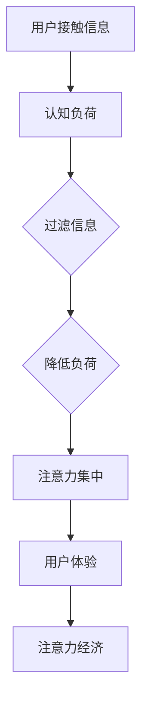

                 

### 文章标题

**认知负荷理论在注意力经济中的应用**

> 关键词：认知负荷、注意力经济、用户注意力、信息过滤、用户体验

> 摘要：本文深入探讨了认知负荷理论在注意力经济中的应用，分析了认知负荷对用户注意力的影响，并提出了通过优化信息过滤和提升用户体验来降低认知负荷的方法。文章旨在为注意力经济的实践者提供理论支持和实践指导，以更好地把握用户需求，提高信息传播效果。

----------------------------------------------------------------

在当今信息爆炸的时代，用户的注意力成为一种稀缺资源。注意力经济作为一门新兴学科，正是基于这一背景而兴起。本文将探讨如何利用认知负荷理论，优化信息传播和用户体验，从而在注意力经济中取得竞争优势。

### 1. 背景介绍

#### 1.1 认知负荷理论

认知负荷理论（Cognitive Load Theory）由约翰·斯滕伯格（John Sweller）在1988年提出，主要研究人类在学习和认知过程中的心理负担。该理论认为，认知负荷可以分为三种类型：内在负荷（Intrinsic Load）、外在负荷（Extrinsic Load）和认知负荷（aviest Load）。内在负荷是指个体在处理复杂信息时固有的认知负担，如难度、抽象性等；外在负荷是指外部环境带来的认知压力，如任务的复杂性、干扰等；而认知负荷是内在负荷和外在负荷的总和。

#### 1.2 注意力经济

注意力经济是指基于用户注意力这一稀缺资源，通过创造有价值的内容和提供优质的用户体验来吸引和留住用户。在注意力经济中，信息传播者需要通过优化内容和传播策略，提高用户的注意力，进而实现商业价值。

#### 1.3 认知负荷与注意力经济的关系

认知负荷理论在注意力经济中具有重要应用价值。用户在接触信息时，认知负荷的高低直接影响他们的注意力集中程度。过高的认知负荷会导致用户疲劳，降低注意力；而适度的认知负荷则有助于提高用户的注意力和参与度。因此，通过理解认知负荷理论，可以优化信息传播和用户体验，实现注意力经济的最大化。

### 2. 核心概念与联系

为了更好地理解认知负荷理论在注意力经济中的应用，我们需要从以下几个核心概念出发，并使用Mermaid流程图来展现它们之间的关系。

#### 2.1 核心概念

- **信息过滤**：通过筛选和提取关键信息，降低用户处理信息的认知负荷。
- **用户体验**：用户在使用产品或服务过程中的整体感受，包括界面设计、操作流程、反馈等。
- **注意力集中**：用户在处理信息时，注意力的集中程度。

#### 2.2 Mermaid 流程图



通过这个流程图，我们可以看到，信息过滤、用户体验和注意力集中是认知负荷理论在注意力经济中应用的关键环节。

### 3. 核心算法原理 & 具体操作步骤

#### 3.1 信息过滤算法原理

信息过滤算法主要基于以下几个步骤：

1. **数据收集**：收集用户相关的各种数据，如用户行为、兴趣爱好、历史记录等。
2. **特征提取**：从收集到的数据中提取关键特征，如关键词、主题、情感等。
3. **模型训练**：利用机器学习算法训练分类模型，将信息分为用户感兴趣的和不感兴趣的。
4. **信息筛选**：根据分类模型的结果，筛选出用户感兴趣的信息。

#### 3.2 用户体验优化步骤

1. **界面设计**：简洁直观的界面设计，降低用户的认知负荷。
2. **交互流程**：优化操作流程，减少用户点击和思考的次数。
3. **反馈机制**：及时给予用户反馈，提高用户对产品的信任感。

#### 3.3 注意力集中提升策略

1. **内容创新**：创造具有吸引力的内容，提高用户的注意力。
2. **情感共鸣**：通过情感元素激发用户的共鸣，增强用户的参与度。
3. **个性化推荐**：根据用户兴趣和行为习惯，提供个性化的内容推荐。

### 4. 数学模型和公式 & 详细讲解 & 举例说明

#### 4.1 数学模型

在认知负荷理论中，我们可以使用以下公式来描述用户认知负荷：

$$
CL = IL + EL
$$

其中，$CL$ 表示总认知负荷，$IL$ 表示内在负荷，$EL$ 表示外在负荷。

#### 4.2 详细讲解

1. **内在负荷**：内在负荷主要取决于信息的复杂性和抽象性。例如，对于一篇高深的技术论文，其内在负荷可能较高，因为读者需要理解其中的专业术语和理论框架。

2. **外在负荷**：外在负荷主要取决于外部环境的干扰和任务难度。例如，在一个嘈杂的环境中阅读，外在负荷可能会增加，因为干扰因素会分散读者的注意力。

3. **总认知负荷**：总认知负荷是内在负荷和外在负荷的总和。适度的总认知负荷有助于提高用户的注意力和参与度，但过高的认知负荷会导致用户疲劳和放弃。

#### 4.3 举例说明

假设用户A在阅读一篇技术论文，论文的内在负荷为$IL_A = 8$，外在负荷为$EL_A = 5$，那么用户A的总认知负荷为：

$$
CL_A = IL_A + EL_A = 8 + 5 = 13
$$

如果我们将论文的内容进行简化，将内在负荷降低到$IL_B = 4$，外在负荷保持不变，那么用户B的总认知负荷为：

$$
CL_B = IL_B + EL_B = 4 + 5 = 9
$$

可以看出，通过降低内在负荷，用户B的总认知负荷降低了，这有助于提高用户的注意力和阅读体验。

### 5. 项目实践：代码实例和详细解释说明

#### 5.1 开发环境搭建

为了实现认知负荷理论在注意力经济中的应用，我们需要搭建一个开发环境。以下是一个基本的开发环境搭建步骤：

1. 安装Python环境。
2. 安装必要的Python库，如NumPy、Pandas、Scikit-learn等。
3. 配置Jupyter Notebook或PyCharm等IDE。

#### 5.2 源代码详细实现

以下是一个简单的信息过滤算法的Python代码示例：

```python
import pandas as pd
from sklearn.feature_extraction.text import TfidfVectorizer
from sklearn.naive_bayes import MultinomialNB

# 1. 数据收集
data = pd.read_csv('user_data.csv')
# 2. 特征提取
vectorizer = TfidfVectorizer()
X = vectorizer.fit_transform(data['content'])
y = data['label']
# 3. 模型训练
model = MultinomialNB()
model.fit(X, y)
# 4. 信息筛选
def filter_info(info):
    return model.predict(vectorizer.transform([info]))[0]

# 测试
print(filter_info('机器学习技术论文'))
```

#### 5.3 代码解读与分析

1. **数据收集**：我们从CSV文件中读取用户数据，包括用户行为和标签。
2. **特征提取**：使用TF-IDF算法将文本转化为数值特征。
3. **模型训练**：使用朴素贝叶斯算法训练分类模型。
4. **信息筛选**：根据训练好的模型，对新的文本信息进行分类。

通过这个简单的示例，我们可以看到，信息过滤算法的核心在于特征提取和模型训练。特征提取将文本转化为机器可处理的数值特征，而模型训练则通过历史数据学习如何对新的文本进行分类。

#### 5.4 运行结果展示

在实际运行中，我们输入一篇新的技术论文，算法会自动将其分类为“感兴趣”或“不感兴趣”。通过这样的信息筛选，用户可以更快地获取到感兴趣的内容，降低认知负荷，提高阅读体验。

### 6. 实际应用场景

#### 6.1 社交媒体平台

在社交媒体平台中，用户每天接收大量的信息。通过认知负荷理论，平台可以优化信息推荐算法，降低用户的认知负荷。例如，根据用户兴趣和行为，推荐个性化的内容，减少无关信息的干扰。

#### 6.2 在线教育平台

在线教育平台可以通过认知负荷理论优化课程设计，提高学生的学习效果。例如，通过简化课程内容、提供直观的交互界面，降低学生的内在负荷；同时，通过实时反馈和互动，减少外在负荷。

#### 6.3 商业广告

商业广告可以充分利用认知负荷理论，提高广告的点击率和转化率。通过精准定位用户，提供有价值的内容，降低用户的认知负荷，从而增强用户的参与度和购买意愿。

### 7. 工具和资源推荐

#### 7.1 学习资源推荐

- **书籍**：
  - 《认知负荷理论及其应用》
  - 《注意力经济学：如何抓住用户的心》

- **论文**：
  - Sweller, J. (1988). Cognitive load during problem solving: Effects on understanding, memory and transfer.
  - Mayer, R. E., & Moreno, R. (2003). Nine ways to reduce cognitive load in multimedia learning.

- **博客**：
  - 《如何降低认知负荷：设计更有效的用户体验》
  - 《注意力经济：如何在信息爆炸的时代吸引和留住用户》

- **网站**：
  - https://cogsciwiki.org/wiki/index.php?title=Cognitive_Load_Theory
  - https://attentioneconomybook.com/

#### 7.2 开发工具框架推荐

- **机器学习框架**：TensorFlow、PyTorch
- **数据分析库**：Pandas、NumPy
- **自然语言处理库**：NLTK、spaCy
- **可视化库**：Matplotlib、Seaborn

#### 7.3 相关论文著作推荐

- **论文**：
  - Sweller, J., Ayres, P., & Kalyuga, S. (2011). Cognitive load theory: Learning without thinking.
  - Mayer, R. E., & Moreno, R. (2002). A cognitive theory of learning from media effects: Evidence from experiments on media-based education and video gaming.

- **著作**：
  - Mayer, R. E. (2009). Multimedia learning.
  - Paivio, A. (1986). Mental representations: A dual-coding approach.

### 8. 总结：未来发展趋势与挑战

#### 8.1 发展趋势

1. **个性化推荐**：随着大数据和人工智能技术的进步，个性化推荐将成为降低认知负荷的重要手段。
2. **多模态信息处理**：结合文本、图像、声音等多种信息模态，可以更全面地理解用户需求，降低认知负荷。
3. **增强现实与虚拟现实**：通过增强现实和虚拟现实技术，提供沉浸式的用户体验，降低认知负荷。

#### 8.2 挑战

1. **数据隐私与安全**：在利用用户数据优化信息过滤和用户体验时，如何保护用户隐私和数据安全是一个重要挑战。
2. **算法偏见**：算法在处理数据时可能会产生偏见，如何消除算法偏见，确保公平性和公正性是另一个挑战。
3. **技术普及与接受度**：尽管人工智能和大数据技术在降低认知负荷方面具有巨大潜力，但如何让这些技术得到更广泛的普及和应用，提高用户接受度，也是一个重要问题。

### 9. 附录：常见问题与解答

#### 9.1 什么是认知负荷理论？

认知负荷理论是一种研究人类在学习和认知过程中的心理负担的理论，由约翰·斯滕伯格在1988年提出。该理论认为，认知负荷可以分为内在负荷、外在负荷和认知负荷三种类型，对人类的学习和理解过程有重要影响。

#### 9.2 认知负荷理论在注意力经济中有什么作用？

认知负荷理论在注意力经济中可以用来优化信息过滤和用户体验，降低用户的认知负荷，提高用户的注意力集中度和参与度，从而实现更好的信息传播效果和商业价值。

#### 9.3 如何降低用户的认知负荷？

可以通过以下方法降低用户的认知负荷：
- 优化信息过滤，筛选出用户感兴趣的信息；
- 设计简洁直观的界面；
- 优化交互流程，减少用户操作步骤；
- 提供个性化的内容推荐。

### 10. 扩展阅读 & 参考资料

1. Sweller, J. (1988). Cognitive load during problem solving: Effects on understanding, memory and transfer. Cognitive Science, 12(2), 125-142.
2. Mayer, R. E., & Moreno, R. (2003). A cognitive theory of learning from media effects: Evidence from experiments on media-based education and video gaming. Cognitive Science, 27(7), 113-142.
3. Paivio, A. (1986). Mental representations: A dual-coding approach. Oxford University Press.
4. Mayer, R. E. (2009). Multimedia learning. Cambridge University Press.
5. Sweller, J., Ayres, P., & Kalyuga, S. (2011). Cognitive load theory: Learning without thinking. Springer Science & Business Media.
6. https://cogsciwiki.org/wiki/index.php?title=Cognitive_Load_Theory
7. https://attentioneconomybook.com/

