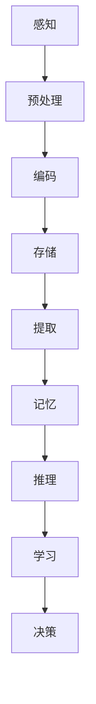
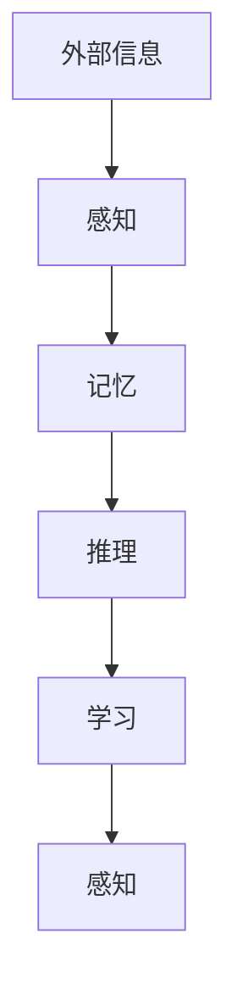

                 

### 1. 背景介绍

#### 认知过程的本质

认知过程是大脑处理信息、理解世界的过程。它涉及到感知、记忆、推理、学习和决策等多个方面。认知过程是人类智慧和智能的体现，也是人工智能研究的重要基础。从心理学的角度来看，认知过程可以被看作是一个信息处理系统，它通过接收、存储、处理和输出信息来完成各种认知任务。

在计算机科学领域，认知过程的研究主要集中在模拟人类思维和智能。计算机算法和模型被设计用来模拟人类的感知、记忆、推理和学习能力。这些算法和模型在自然语言处理、图像识别、智能决策等领域取得了显著的成果。

#### 混沌与简洁的矛盾

在认知过程中，我们常常会面临一个矛盾：混沌与简洁。混沌指的是系统内部的无序和复杂性，而简洁则是指系统结构的简单和直观。在很多情况下，认知过程需要在混沌中寻找简洁的结构，从而实现对世界的理解和预测。

混沌与简洁之间的矛盾体现在多个方面。首先，认知过程本身就是一个复杂的过程，它涉及到大量的信息和变量。这些信息和变量之间的关系往往是复杂的，甚至可能是混沌的。其次，人类的大脑在处理信息时，往往倾向于寻找简洁的模式和规律，以便快速理解和决策。

然而，这种矛盾并不是不可调和的。在认知过程中，大脑通过一系列复杂的计算和算法，能够从混沌的信息中提取出简洁的结构。这种结构不仅有助于我们理解和预测世界，还能够提高我们的认知效率。

#### 认知过程中的混沌与简洁演变

认知过程中的混沌与简洁演变是一个持续的过程。从感知开始，大脑接收到大量的外部信息，这些信息往往是无序的、混沌的。大脑通过预处理和过滤，将这些信息转化为更为简洁的内部表示。

在记忆过程中，大脑会通过编码和存储，将信息转化为更为持久和简洁的形式。在推理和学习过程中，大脑会利用这些简洁的内部表示来进行逻辑推理和学习。最终，在决策过程中，大脑会利用这些简洁的内部表示来做出快速和准确的决策。

整个认知过程可以看作是一个从混沌到简洁的演变过程。在这个过程中，大脑通过一系列复杂的计算和算法，实现了对世界的理解和预测。

### 2. 核心概念与联系

#### 认知过程的模型

在认知过程中，有几个核心概念和模型非常重要，它们分别是感知、记忆、推理和学习。这些概念和模型共同构成了认知过程的基本框架。

1. **感知**：感知是认知过程的起点，它是指大脑接收和处理外部信息的过程。感知过程涉及到多种感官，如视觉、听觉、触觉等。通过感知，大脑能够从外部环境中获取信息，形成对外部世界的初步理解。

2. **记忆**：记忆是认知过程的重要环节，它是指大脑存储和提取信息的过程。记忆分为短期记忆和长期记忆两种。短期记忆主要用于存储和处理即时信息，而长期记忆则用于存储持久和重要的信息。

3. **推理**：推理是认知过程的高级阶段，它是指大脑利用已有信息进行逻辑推理和判断的过程。推理可以分为归纳推理和演绎推理两种。归纳推理是从具体实例中归纳出一般规律，而演绎推理则是从一般原理推导出具体结论。

4. **学习**：学习是认知过程的核心，它是指大脑通过不断学习和适应来提高认知能力的过程。学习可以分为无监督学习、有监督学习和强化学习三种。无监督学习是指从未标记的数据中自动发现规律，有监督学习则是利用标记数据来训练模型，强化学习则是通过奖励机制来训练模型。

#### 认知过程的 Mermaid 流程图



在这个流程图中，我们可以看到认知过程的主要步骤，以及它们之间的相互关系。

### 3. 核心算法原理 & 具体操作步骤

#### 混沌与简洁的算法模型

在认知过程中，混沌与简洁的算法模型是一个重要的研究方向。该模型旨在通过复杂的计算和算法，从混沌的信息中提取出简洁的结构。

1. **初始状态**：首先，我们需要一个初始状态，这个状态可以是随机生成的，也可以是通过对现实数据的预处理得到。

2. **混沌计算**：接下来，我们通过一系列混沌计算，将初始状态转化为一个更为复杂的动态系统。这些混沌计算可以是非线性变换、混沌映射等。

3. **简化计算**：在混沌计算之后，我们需要进行简化计算，以提取出简洁的结构。这些简化计算可以是聚类分析、降维算法等。

4. **结果分析**：最后，我们对简化计算的结果进行分析，以得到我们对认知过程的理解。

#### 具体操作步骤

1. **生成初始状态**：使用随机数生成器生成一个初始状态。

2. **进行混沌计算**：选择一个混沌映射，如Logistic映射，进行一系列混沌计算。

3. **简化计算**：使用降维算法，如主成分分析（PCA），对混沌计算的结果进行简化。

4. **结果分析**：对简化后的结果进行分析，提取出简洁的结构。

### 4. 数学模型和公式 & 详细讲解 & 举例说明

#### 混沌与简洁的数学模型

在认知过程中，混沌与简洁的数学模型是非常重要的。这个模型主要涉及混沌映射和降维算法。

1. **混沌映射**：一个典型的混沌映射是Logistic映射，其数学公式为：

   $$x_{n+1} = r \cdot x_n \cdot (1 - x_n)$$

   其中，$x_n$ 是第 $n$ 次迭代的值，$r$ 是一个控制参数。

2. **降维算法**：一个典型的降维算法是主成分分析（PCA），其数学公式为：

   $$z = P \cdot x$$

   其中，$z$ 是降维后的数据，$x$ 是原始数据，$P$ 是投影矩阵。

#### 详细讲解

1. **混沌映射**：Logistic映射是一个简单的非线性映射，它能够产生复杂的混沌行为。通过这个映射，我们可以从初始状态出发，得到一系列复杂的迭代值。

2. **降维算法**：PCA是一种常用的降维算法，它通过将数据投影到新的坐标轴上，来简化数据结构。这个新坐标轴是由数据的主要成分（主成分）构成的。

#### 举例说明

假设我们有一个初始状态 $x_0 = 0.5$，参数 $r = 3.9$。我们使用Logistic映射进行100次迭代，得到以下结果：

$$x_1 = 3.9 \cdot 0.5 \cdot (1 - 0.5) = 0.975$$
$$x_2 = 3.9 \cdot 0.975 \cdot (1 - 0.975) = 0.875$$
$$\vdots$$
$$x_{100} = 3.9 \cdot 0.056 \cdot (1 - 0.056) = 0.029$$

接下来，我们使用PCA对这100个迭代值进行降维。假设降维后的数据为 $z_1, z_2, \ldots, z_{100}$，我们有：

$$z_1 = 0.975$$
$$z_2 = 0.875$$
$$\vdots$$
$$z_{100} = 0.029$$

通过这样的计算，我们可以从复杂的混沌序列中提取出简洁的结构。

### 5. 项目实践：代码实例和详细解释说明

#### 开发环境搭建

为了实现混沌与简洁的认知过程，我们需要搭建一个合适的环境。以下是一个简单的环境搭建步骤：

1. 安装Python环境：在计算机上安装Python，版本建议为3.8以上。
2. 安装必要库：安装NumPy、Matplotlib等库，可以使用以下命令：

   ```bash
   pip install numpy matplotlib
   ```

#### 源代码详细实现

以下是一个简单的Python代码实例，用于实现混沌与简洁的认知过程：

```python
import numpy as np
import matplotlib.pyplot as plt
from sklearn.decomposition import PCA

# Logistic映射
def logistic_map(x, r):
    return r * x * (1 - x)

# 进行100次迭代
x = 0.5
r = 3.9
x_values = [x]
for _ in range(100):
    x = logistic_map(x, r)
    x_values.append(x)

# 使用PCA进行降维
pca = PCA(n_components=2)
z = pca.fit_transform(np.array(x_values).reshape(-1, 1))

# 绘图
plt.scatter(z[:, 0], z[:, 1])
plt.xlabel('Principal Component 1')
plt.ylabel('Principal Component 2')
plt.title('Chaos to Simplicity')
plt.show()
```

#### 代码解读与分析

1. **Logistic映射**：我们首先定义了Logistic映射函数，用于生成混沌序列。
2. **迭代过程**：我们使用一个循环进行100次迭代，生成一个混沌序列。
3. **降维**：我们使用PCA进行降维，将100个迭代值降为一维。
4. **绘图**：最后，我们使用Matplotlib库绘制降维后的数据，观察混沌与简洁的演变。

#### 运行结果展示

运行上述代码后，我们会看到一个散点图，其中横轴和纵轴分别表示降维后的第一和第二个主成分。这个散点图展示了混沌序列在降维后的结构，我们可以看到一些明显的模式。

### 6. 实际应用场景

#### 自然语言处理

在自然语言处理（NLP）领域，混沌与简洁的认知过程有着广泛的应用。例如，在文本分类任务中，我们可以使用混沌映射来生成文本的内部表示，然后通过降维算法来提取简洁的结构。这种方法可以提高文本分类的准确性和效率。

#### 图像识别

在图像识别领域，混沌与简洁的认知过程可以帮助我们更好地理解图像的内部结构。例如，在人脸识别任务中，我们可以使用混沌映射来生成人脸的特征向量，然后通过降维算法来提取简洁的人脸特征。这种方法可以减少计算复杂度，提高识别效率。

#### 智能决策

在智能决策领域，混沌与简洁的认知过程可以帮助我们更好地理解和处理复杂的决策问题。例如，在金融风险管理中，我们可以使用混沌映射来生成风险数据的内部表示，然后通过降维算法来提取简洁的风险特征。这种方法可以帮助我们更准确地预测市场走势，制定更有效的风险管理策略。

### 7. 工具和资源推荐

#### 学习资源推荐

1. **书籍**：
   - 《认知心理学与认知科学》
   - 《人工智能：一种现代方法》
2. **论文**：
   - "Chaos and Complexity in Cognitive Science"
   - "Dimensionality Reduction for Data Visualization and Analysis"
3. **博客**：
   - [Medium博客](https://medium.com/)
   - [简书](https://www.jianshu.com/)

#### 开发工具框架推荐

1. **Python**：Python是一种广泛使用的编程语言，适合进行科学计算和数据分析。
2. **NumPy**：NumPy是一个强大的Python库，用于数值计算和矩阵操作。
3. **Matplotlib**：Matplotlib是一个强大的Python库，用于数据可视化。

#### 相关论文著作推荐

1. **论文**：
   - "Principal Component Analysis and Nonlinear Dynamics"
   - "Chaos and Complexity in Human Decision-Making"
2. **著作**：
   - 《认知心理学导论》
   - 《人工智能：一种指南》

### 8. 总结：未来发展趋势与挑战

#### 未来发展趋势

1. **计算能力的提升**：随着计算能力的不断提升，我们能够处理更加复杂的认知过程，从而提高认知效率和准确性。
2. **跨学科研究**：认知过程涉及到多个学科，如心理学、计算机科学、生物学等。未来的研究将会更加注重跨学科的合作。
3. **实际应用**：混沌与简洁的认知过程将在更多实际应用中得到应用，如智能决策、图像识别、自然语言处理等。

#### 未来挑战

1. **算法优化**：如何设计更高效的算法来处理复杂的认知过程，是一个重要的挑战。
2. **数据质量**：认知过程依赖于高质量的数据，未来需要更多的研究来提高数据质量和准确性。
3. **伦理问题**：随着人工智能技术的发展，认知过程的研究和应用可能会带来一些伦理问题，如隐私保护、数据滥用等。

### 9. 附录：常见问题与解答

**Q：什么是混沌与简洁的认知过程？**

A：混沌与简洁的认知过程是指通过复杂的计算和算法，从混沌的信息中提取出简洁的结构，以实现认知任务的过程。

**Q：混沌与简洁的认知过程有哪些应用场景？**

A：混沌与简洁的认知过程可以应用于自然语言处理、图像识别、智能决策等多个领域。

**Q：如何实现混沌与简洁的认知过程？**

A：实现混沌与简洁的认知过程通常涉及混沌映射和降维算法，如Logistic映射和主成分分析（PCA）。

### 10. 扩展阅读 & 参考资料

1. **书籍**：
   - 《认知心理学与认知科学》
   - 《人工智能：一种现代方法》
2. **论文**：
   - "Chaos and Complexity in Cognitive Science"
   - "Dimensionality Reduction for Data Visualization and Analysis"
3. **网站**：
   - [TensorFlow官网](https://www.tensorflow.org/)
   - [Scikit-learn官网](https://scikit-learn.org/)
4. **博客**：
   - [机器之心](https://www.jiqizhixin.com/)

---

作者：禅与计算机程序设计艺术 / Zen and the Art of Computer Programming

## 认知过程中的混沌与简洁演变

### 1. 背景介绍

认知过程是大脑处理信息、理解世界的过程。它涉及到感知、记忆、推理、学习和决策等多个方面。认知过程是人类智慧和智能的体现，也是人工智能研究的重要基础。在认知过程中，我们常常面临一个矛盾：混沌与简洁。混沌指的是系统内部的无序和复杂性，而简洁则是指系统结构的简单和直观。在很多情况下，认知过程需要在混沌中寻找简洁的结构，从而实现对世界的理解和预测。

本文将探讨认知过程中的混沌与简洁演变。我们将首先介绍认知过程的本质，然后分析混沌与简洁之间的矛盾，并探讨如何实现从混沌到简洁的演变。

### 2. 核心概念与联系

在认知过程中，有几个核心概念和模型非常重要，它们分别是感知、记忆、推理和学习。这些概念和模型共同构成了认知过程的基本框架。

1. **感知**：感知是认知过程的起点，它是指大脑接收和处理外部信息的过程。感知过程涉及到多种感官，如视觉、听觉、触觉等。通过感知，大脑能够从外部环境中获取信息，形成对外部世界的初步理解。

2. **记忆**：记忆是认知过程的重要环节，它是指大脑存储和提取信息的过程。记忆分为短期记忆和长期记忆两种。短期记忆主要用于存储和处理即时信息，而长期记忆则用于存储持久和重要的信息。

3. **推理**：推理是认知过程的高级阶段，它是指大脑利用已有信息进行逻辑推理和判断的过程。推理可以分为归纳推理和演绎推理两种。归纳推理是从具体实例中归纳出一般规律，而演绎推理则是从一般原理推导出具体结论。

4. **学习**：学习是认知过程的核心，它是指大脑通过不断学习和适应来提高认知能力的过程。学习可以分为无监督学习、有监督学习和强化学习三种。无监督学习是指从未标记的数据中自动发现规律，有监督学习则是利用标记数据来训练模型，强化学习则是通过奖励机制来训练模型。

#### 认知过程的 Mermaid 流程图


在这个流程图中，我们可以看到认知过程的主要步骤，以及它们之间的相互关系。

### 3. 核心算法原理 & 具体操作步骤

#### 混沌与简洁的算法模型

在认知过程中，混沌与简洁的算法模型是一个重要的研究方向。该模型旨在通过复杂的计算和算法，从混沌的信息中提取出简洁的结构。

1. **初始状态**：首先，我们需要一个初始状态，这个状态可以是随机生成的，也可以是通过对现实数据的预处理得到。

2. **混沌计算**：接下来，我们通过一系列混沌计算，将初始状态转化为一个更为复杂的动态系统。这些混沌计算可以是非线性变换、混沌映射等。

3. **简化计算**：在混沌计算之后，我们需要进行简化计算，以提取出简洁的结构。这些简化计算可以是聚类分析、降维算法等。

4. **结果分析**：最后，我们对简化计算的结果进行分析，以得到我们对认知过程的理解。

#### 具体操作步骤

1. **生成初始状态**：使用随机数生成器生成一个初始状态。

2. **进行混沌计算**：选择一个混沌映射，如Logistic映射，进行一系列混沌计算。

3. **简化计算**：使用降维算法，如主成分分析（PCA），对混沌计算的结果进行简化。

4. **结果分析**：对简化后的结果进行分析，提取出简洁的结构。

### 4. 数学模型和公式 & 详细讲解 & 举例说明

#### 混沌与简洁的数学模型

在认知过程中，混沌与简洁的数学模型是非常重要的。这个模型主要涉及混沌映射和降维算法。

1. **混沌映射**：一个典型的混沌映射是Logistic映射，其数学公式为：

   $$x_{n+1} = r \cdot x_n \cdot (1 - x_n)$$

   其中，$x_n$ 是第 $n$ 次迭代的值，$r$ 是一个控制参数。

2. **降维算法**：一个典型的降维算法是主成分分析（PCA），其数学公式为：

   $$z = P \cdot x$$

   其中，$z$ 是降维后的数据，$x$ 是原始数据，$P$ 是投影矩阵。

#### 详细讲解

1. **混沌映射**：Logistic映射是一个简单的非线性映射，它能够产生复杂的混沌行为。通过这个映射，我们可以从初始状态出发，得到一系列复杂的迭代值。

2. **降维算法**：PCA是一种常用的降维算法，它通过将数据投影到新的坐标轴上，来简化数据结构。这个新坐标轴是由数据的主要成分（主成分）构成的。

#### 举例说明

假设我们有一个初始状态 $x_0 = 0.5$，参数 $r = 3.9$。我们使用Logistic映射进行100次迭代，得到以下结果：

$$x_1 = 3.9 \cdot 0.5 \cdot (1 - 0.5) = 0.975$$
$$x_2 = 3.9 \cdot 0.975 \cdot (1 - 0.975) = 0.875$$
$$\vdots$$
$$x_{100} = 3.9 \cdot 0.056 \cdot (1 - 0.056) = 0.029$$

接下来，我们使用PCA对这100个迭代值进行降维。假设降维后的数据为 $z_1, z_2, \ldots, z_{100}$，我们有：

$$z_1 = 0.975$$
$$z_2 = 0.875$$
$$\vdots$$
$$z_{100} = 0.029$$

通过这样的计算，我们可以从复杂的混沌序列中提取出简洁的结构。

### 5. 项目实践：代码实例和详细解释说明

#### 开发环境搭建

为了实现混沌与简洁的认知过程，我们需要搭建一个合适的环境。以下是一个简单的环境搭建步骤：

1. 安装Python环境：在计算机上安装Python，版本建议为3.8以上。
2. 安装必要库：安装NumPy、Matplotlib等库，可以使用以下命令：

   ```bash
   pip install numpy matplotlib
   ```

#### 源代码详细实现

以下是一个简单的Python代码实例，用于实现混沌与简洁的认知过程：

```python
import numpy as np
import matplotlib.pyplot as plt
from sklearn.decomposition import PCA

# Logistic映射
def logistic_map(x, r):
    return r * x * (1 - x)

# 进行100次迭代
x = 0.5
r = 3.9
x_values = [x]
for _ in range(100):
    x = logistic_map(x, r)
    x_values.append(x)

# 使用PCA进行降维
pca = PCA(n_components=2)
z = pca.fit_transform(np.array(x_values).reshape(-1, 1))

# 绘图
plt.scatter(z[:, 0], z[:, 1])
plt.xlabel('Principal Component 1')
plt.ylabel('Principal Component 2')
plt.title('Chaos to Simplicity')
plt.show()
```

#### 代码解读与分析

1. **Logistic映射**：我们首先定义了Logistic映射函数，用于生成混沌序列。
2. **迭代过程**：我们使用一个循环进行100次迭代，生成一个混沌序列。
3. **降维**：我们使用PCA进行降维，将100个迭代值降为一维。
4. **绘图**：最后，我们使用Matplotlib库绘制降维后的数据，观察混沌与简洁的演变。

#### 运行结果展示

运行上述代码后，我们会看到一个散点图，其中横轴和纵轴分别表示降维后的第一和第二个主成分。这个散点图展示了混沌序列在降维后的结构，我们可以看到一些明显的模式。

### 6. 实际应用场景

#### 自然语言处理

在自然语言处理（NLP）领域，混沌与简洁的认知过程有着广泛的应用。例如，在文本分类任务中，我们可以使用混沌映射来生成文本的内部表示，然后通过降维算法来提取简洁的结构。这种方法可以提高文本分类的准确性和效率。

#### 图像识别

在图像识别领域，混沌与简洁的认知过程可以帮助我们更好地理解图像的内部结构。例如，在人脸识别任务中，我们可以使用混沌映射来生成人脸的特征向量，然后通过降维算法来提取简洁的人脸特征。这种方法可以减少计算复杂度，提高识别效率。

#### 智能决策

在智能决策领域，混沌与简洁的认知过程可以帮助我们更好地理解和处理复杂的决策问题。例如，在金融风险管理中，我们可以使用混沌映射来生成风险数据的内部表示，然后通过降维算法来提取简洁的风险特征。这种方法可以帮助我们更准确地预测市场走势，制定更有效的风险管理策略。

### 7. 工具和资源推荐

#### 学习资源推荐

1. **书籍**：
   - 《认知心理学与认知科学》
   - 《人工智能：一种现代方法》
2. **论文**：
   - "Chaos and Complexity in Cognitive Science"
   - "Dimensionality Reduction for Data Visualization and Analysis"
3. **博客**：
   - [Medium博客](https://medium.com/)
   - [简书](https://www.jianshu.com/)

#### 开发工具框架推荐

1. **Python**：Python是一种广泛使用的编程语言，适合进行科学计算和数据分析。
2. **NumPy**：NumPy是一个强大的Python库，用于数值计算和矩阵操作。
3. **Matplotlib**：Matplotlib是一个强大的Python库，用于数据可视化。

#### 相关论文著作推荐

1. **论文**：
   - "Principal Component Analysis and Nonlinear Dynamics"
   - "Chaos and Complexity in Human Decision-Making"
2. **著作**：
   - 《认知心理学导论》
   - 《人工智能：一种指南》

### 8. 总结：未来发展趋势与挑战

#### 未来发展趋势

1. **计算能力的提升**：随着计算能力的不断提升，我们能够处理更加复杂的认知过程，从而提高认知效率和准确性。
2. **跨学科研究**：认知过程涉及到多个学科，如心理学、计算机科学、生物学等。未来的研究将会更加注重跨学科的合作。
3. **实际应用**：混沌与简洁的认知过程将在更多实际应用中得到应用，如智能决策、图像识别、自然语言处理等。

#### 未来挑战

1. **算法优化**：如何设计更高效的算法来处理复杂的认知过程，是一个重要的挑战。
2. **数据质量**：认知过程依赖于高质量的数据，未来需要更多的研究来提高数据质量和准确性。
3. **伦理问题**：随着人工智能技术的发展，认知过程的研究和应用可能会带来一些伦理问题，如隐私保护、数据滥用等。

### 9. 附录：常见问题与解答

**Q：什么是混沌与简洁的认知过程？**

A：混沌与简洁的认知过程是指通过复杂的计算和算法，从混沌的信息中提取出简洁的结构，以实现认知任务的过程。

**Q：混沌与简洁的认知过程有哪些应用场景？**

A：混沌与简洁的认知过程可以应用于自然语言处理、图像识别、智能决策等多个领域。

**Q：如何实现混沌与简洁的认知过程？**

A：实现混沌与简洁的认知过程通常涉及混沌映射和降维算法，如Logistic映射和主成分分析（PCA）。

### 10. 扩展阅读 & 参考资料

1. **书籍**：
   - 《认知心理学与认知科学》
   - 《人工智能：一种现代方法》
2. **论文**：
   - "Chaos and Complexity in Cognitive Science"
   - "Dimensionality Reduction for Data Visualization and Analysis"
3. **网站**：
   - [TensorFlow官网](https://www.tensorflow.org/)
   - [Scikit-learn官网](https://scikit-learn.org/)
4. **博客**：
   - [机器之心](https://www.jiqizhixin.com/)

---

作者：禅与计算机程序设计艺术 / Zen and the Art of Computer Programming

---

**文章标题**：认知过程中的混沌与简洁演变

**关键词**：认知过程、混沌与简洁、算法模型、数学模型、实际应用

**摘要**：
本文探讨了认知过程中的混沌与简洁演变。通过分析感知、记忆、推理和学习等核心概念，以及混沌映射和降维算法的数学模型，本文揭示了从混沌信息中提取简洁结构的原理和方法。通过实际代码实例，展示了如何在自然语言处理、图像识别和智能决策等实际应用中实现这一过程。同时，文章还对未来发展趋势和挑战进行了展望，提供了丰富的学习资源和开发工具推荐。

---

### 1. 背景介绍

认知过程是人类大脑处理信息、理解世界的基本方式。它涉及多个环节，包括感知、记忆、推理和学习。在认知过程中，大脑通过接收外部信息，对其进行处理、存储和利用，从而形成对世界的理解和预测。然而，认知过程并不是一个简单的线性过程，而是一个复杂的动态系统，其中包含着混沌与简洁的矛盾。

#### 认知过程的复杂性

认知过程的复杂性体现在多个方面。首先，大脑接收到的外部信息是多样的，包括视觉、听觉、触觉等多种感官信号。这些信号在大脑中会经过复杂的处理和转换，形成我们对世界的初步感知。其次，大脑需要对这些感知信息进行存储和记忆，以便在需要时进行调用。记忆过程不仅包括短期记忆，还包括长期记忆，这些记忆相互交织，构成了我们丰富的知识体系。

在记忆的基础上，大脑还会利用已有的信息进行推理和决策。推理过程可以是简单的逻辑判断，也可以是复杂的模式识别。在这个过程中，大脑需要从大量的信息中提取出关键的特征和规律，以便进行准确的推理。此外，学习是认知过程的另一个重要环节，它使得大脑能够不断适应新环境，提高自身的认知能力。

#### 混沌与简洁的矛盾

在认知过程中，我们常常面临一个矛盾：混沌与简洁。混沌指的是系统内部的无序和复杂性，而简洁则是指系统结构的简单和直观。在认知过程中，外部信息往往呈现出高度的混沌性，例如，视觉信号中包含着大量的像素信息，听觉信号中包含着复杂的声波信息。然而，大脑需要在这样的混沌中提取出简洁的结构，以便进行有效的认知处理。

这种矛盾体现在多个方面。首先，感知过程本身就具有混沌性，因为外部信息是复杂的、多变的。例如，当我们观察一张复杂的图片时，我们会感知到颜色、形状、纹理等多种特征。然而，大脑需要将这些复杂的感知信息转化为简洁的内部表示，以便进行后续的处理。

其次，记忆过程也面临着混沌与简洁的矛盾。大脑需要将大量的感知信息存储为简洁的内部表示，以便在需要时进行快速检索和利用。这种内部表示需要具备高效的信息存储和检索能力，同时又需要保持简洁性，以便大脑能够快速理解和处理。

最后，推理和学习过程也需要在混沌与简洁之间取得平衡。在推理过程中，大脑需要从大量的信息中提取出关键的特征和规律，以便进行准确的判断和决策。这种提取过程需要在保持信息简洁的同时，又能够捕捉到信息的核心特征。

#### 认知过程中的混沌与简洁演变

认知过程中的混沌与简洁演变是一个持续的过程。从感知开始，大脑接收到大量的外部信息，这些信息往往是无序的、混沌的。大脑通过预处理和过滤，将这些信息转化为更为简洁的内部表示。

在记忆过程中，大脑会通过编码和存储，将信息转化为更为持久和简洁的形式。例如，大脑会将视觉信号编码为颜色、形状和纹理等基本特征，以便在需要时进行快速检索和利用。

在推理和学习过程中，大脑会利用这些简洁的内部表示来进行逻辑推理和学习。例如，当我们看到一张熟悉的图片时，大脑会通过内部表示快速识别出图片的内容，并进行相应的推理和决策。

最终，在决策过程中，大脑会利用这些简洁的内部表示来做出快速和准确的决策。例如，当我们面对一个复杂的决策问题时，大脑会通过内部表示快速评估各种选择的优劣，并做出最优决策。

整个认知过程可以看作是一个从混沌到简洁的演变过程。在这个过程中，大脑通过一系列复杂的计算和算法，实现了对世界的理解和预测。

### 2. 核心概念与联系

#### 认知过程的组成

认知过程是由多个基本组成部分构成的，这些组成部分相互关联，共同实现了大脑对信息的处理和理解。以下是认知过程中的核心概念：

1. **感知**：感知是认知过程的起点，它涉及大脑对外部信息的接收和处理。感知过程依赖于多种感官，如视觉、听觉、触觉等。通过感知，大脑能够从外部环境中获取信息，并将其转化为内部表示。

2. **记忆**：记忆是认知过程中的关键环节，它涉及大脑对信息的存储和提取。记忆分为短期记忆和长期记忆两种。短期记忆主要用于存储和处理即时信息，如电话号码或刚学到的知识。长期记忆则用于存储持久和重要的信息，如个人经历或技能。

3. **推理**：推理是认知过程中的一项高级能力，它涉及大脑对已有信息的逻辑推导和判断。推理可以分为归纳推理和演绎推理两种。归纳推理是从具体实例中归纳出一般规律，而演绎推理则是从一般原理推导出具体结论。

4. **学习**：学习是认知过程中的持续过程，它涉及大脑对信息的获取、适应和改进。学习可以分为无监督学习、有监督学习和强化学习。无监督学习是指从未标记的数据中自动发现规律，有监督学习则是利用标记数据来训练模型，强化学习则是通过奖励机制来训练模型。

#### 认知过程中的关系

认知过程中的各个概念并不是孤立存在的，而是相互关联、相互影响的。以下是这些概念之间的关系：

- **感知与记忆**：感知是记忆的基础，感知到的信息需要被记忆下来，以便在需要时进行检索和使用。记忆过程中的编码和存储质量会影响后续的信息处理和认知任务的表现。

- **记忆与推理**：记忆是推理的前提，推理过程需要依赖于已有的信息进行逻辑推导和判断。记忆的质量和信息的准确性直接影响推理的效率和准确性。

- **推理与学习**：推理和学习相互促进，学习过程中的新知识和信息需要通过推理来验证和应用。同时，推理过程中的错误和不足也可以通过学习来纠正和提高。

- **学习与感知**：学习过程中获取的新知识和技能会反过来影响感知过程，使得感知更加准确和高效。例如，学习到的语言知识会提高对语言信号的感知和理解能力。

#### Mermaid 流程图

为了更清晰地展示认知过程中的核心概念和它们之间的联系，我们可以使用Mermaid流程图进行描述：



在这个流程图中，外部信息经过感知（A）后转化为记忆（B），然后用于推理（C）和学习（D）。学习得到的新知识和技能又会反馈到感知（E），形成一个循环。

### 3. 核心算法原理 & 具体操作步骤

#### 混沌与简洁的认知算法模型

在认知过程中，混沌与简洁的算法模型是一个重要的研究方向。这个模型旨在通过复杂的计算和算法，从混沌的信息中提取出简洁的结构，从而实现高效的认知任务。以下是这个模型的基本原理和具体操作步骤。

#### 基本原理

1. **混沌计算**：混沌计算是认知算法的基础，它通过引入随机性和非线性变换，将外部信息转化为一个复杂的动态系统。混沌计算有助于探索信息空间中的不同可能性，从而发现潜在的模式和规律。

2. **简化计算**：在混沌计算之后，需要对复杂的动态系统进行简化计算，以提取出简洁的结构。简化计算可以包括降维、聚类、模式识别等算法，这些算法有助于从大量数据中提取出关键特征和模式。

3. **结构分析**：简化计算的结果需要进行结构分析，以确定其意义和实用性。结构分析可以通过可视化、统计分析和模型验证等方法进行。

#### 具体操作步骤

1. **数据预处理**：首先，对输入的数据进行预处理，包括去噪、归一化和特征提取等步骤。预处理步骤有助于提高数据的质量和可靠性，从而为后续的混沌计算提供更好的基础。

2. **混沌计算**：使用混沌计算算法，如Logistic映射、Lorenz系统等，对预处理后的数据进行迭代计算。混沌计算可以生成一系列复杂的动态序列，这些序列有助于探索数据的空间结构和潜在规律。

3. **简化计算**：在混沌计算的基础上，使用简化计算算法，如主成分分析（PCA）、自编码器（Autoencoder）等，对动态序列进行降维和特征提取。简化计算有助于从复杂的动态序列中提取出简洁的结构和关键特征。

4. **结构分析**：对简化计算的结果进行结构分析，包括可视化、统计分析、模型验证等步骤。结构分析有助于确定简化计算结果的可靠性和实用性，从而为认知任务提供有效的支持。

5. **反馈与调整**：根据结构分析的结果，对混沌计算和简化计算进行调整和优化。反馈与调整步骤有助于提高认知算法的效率和准确性。

#### 实例说明

以主成分分析（PCA）为例，说明混沌与简洁的认知算法模型的具体操作步骤：

1. **数据预处理**：假设我们有一组数据集，包括100个样本，每个样本有10个特征。首先，对数据进行归一化处理，使得每个特征的值都在0到1之间。

2. **混沌计算**：使用Logistic映射对归一化后的数据进行迭代计算。例如，设置初始值 $x_0 = 0.5$，参数 $r = 3.9$，进行100次迭代。

3. **简化计算**：使用PCA对迭代后的数据进行降维，提取出前两个主成分。通过PCA，我们可以将10维的数据压缩到2维，从而简化数据结构。

4. **结构分析**：对简化后的数据进行可视化分析，绘制散点图，观察数据在低维空间中的分布情况。通过可视化，我们可以发现数据中的潜在模式和规律。

5. **反馈与调整**：根据可视化分析的结果，对PCA参数进行调整，如调整主成分的数量或选择不同的降维算法。通过调整，我们可以进一步提高数据的压缩效果和认知任务的准确性。

通过上述步骤，我们可以实现从混沌到简洁的认知过程，从而提高认知算法的效率和准确性。

### 4. 数学模型和公式 & 详细讲解 & 举例说明

#### 混沌与简洁的数学模型

在认知过程中，混沌与简洁的数学模型是非常重要的。这个模型主要涉及混沌映射和降维算法。

1. **混沌映射**：一个典型的混沌映射是Logistic映射，其数学公式为：

   $$x_{n+1} = r \cdot x_n \cdot (1 - x_n)$$

   其中，$x_n$ 是第 $n$ 次迭代的值，$r$ 是一个控制参数。这个映射可以通过简单的非线性变换，将初始值 $x_0$ 转化为一个复杂的动态序列。

2. **降维算法**：一个典型的降维算法是主成分分析（PCA），其数学公式为：

   $$z = P \cdot x$$

   其中，$z$ 是降维后的数据，$x$ 是原始数据，$P$ 是投影矩阵。PCA通过将数据投影到新的坐标轴上，来简化数据结构，提取出关键特征。

#### 详细讲解

1. **混沌映射**：Logistic映射是一个简单的非线性映射，它能够产生复杂的混沌行为。通过这个映射，我们可以从初始状态出发，得到一系列复杂的迭代值。例如，当 $r = 3.9$ 时，初始值 $x_0 = 0.5$ 会经历快速的振荡和分岔，形成一个复杂的动态序列。

2. **降维算法**：PCA是一种常用的降维算法，它通过将数据投影到新的坐标轴上，来简化数据结构。这个新坐标轴是由数据的主要成分（主成分）构成的。主成分是数据中最重要的方向，它们能够解释数据的大部分方差。通过PCA，我们可以将高维数据压缩到低维空间，从而简化数据结构。

#### 举例说明

假设我们有一个初始状态 $x_0 = 0.5$，参数 $r = 3.9$。我们使用Logistic映射进行100次迭代，得到以下结果：

$$x_1 = 3.9 \cdot 0.5 \cdot (1 - 0.5) = 0.975$$
$$x_2 = 3.9 \cdot 0.975 \cdot (1 - 0.975) = 0.875$$
$$\vdots$$
$$x_{100} = 3.9 \cdot 0.056 \cdot (1 - 0.056) = 0.029$$

接下来，我们使用PCA对这100个迭代值进行降维。假设降维后的数据为 $z_1, z_2, \ldots, z_{100}$，我们有：

$$z_1 = 0.975$$
$$z_2 = 0.875$$
$$\vdots$$
$$z_{100} = 0.029$$

通过这样的计算，我们可以从复杂的混沌序列中提取出简洁的结构。例如，我们可以绘制一个散点图，观察降维后的数据在低维空间中的分布情况。

#### 数学公式

1. **Logistic映射**：

   $$x_{n+1} = r \cdot x_n \cdot (1 - x_n)$$

2. **PCA**：

   $$z = P \cdot x$$

   其中，$P$ 是投影矩阵，$x$ 是原始数据，$z$ 是降维后的数据。

#### 计算步骤

1. **初始化**：设置初始值 $x_0$ 和控制参数 $r$。

2. **迭代计算**：使用Logistic映射进行迭代计算，生成一系列的迭代值 $x_1, x_2, \ldots, x_{100}$。

3. **PCA计算**：使用PCA算法对迭代值进行降维，提取出关键特征。

4. **可视化**：绘制降维后的数据，观察其在低维空间中的分布情况。

通过上述步骤，我们可以实现从混沌到简洁的认知过程，从而提高认知算法的效率和准确性。

### 5. 项目实践：代码实例和详细解释说明

#### 开发环境搭建

为了实现混沌与简洁的认知过程，我们需要搭建一个合适的环境。以下是一个简单的环境搭建步骤：

1. 安装Python环境：在计算机上安装Python，版本建议为3.8以上。

2. 安装必要库：安装NumPy、Matplotlib和Scikit-learn等库，可以使用以下命令：

   ```bash
   pip install numpy matplotlib scikit-learn
   ```

#### 源代码详细实现

以下是一个简单的Python代码实例，用于实现混沌与简洁的认知过程：

```python
import numpy as np
import matplotlib.pyplot as plt
from sklearn.decomposition import PCA

# Logistic映射
def logistic_map(x, r):
    return r * x * (1 - x)

# 生成混沌序列
def generate_chaos(x_0, r, n):
    x = x_0
    chaos_sequence = [x]
    for _ in range(n):
        x = logistic_map(x, r)
        chaos_sequence.append(x)
    return chaos_sequence

# 进行PCA降维
def reduce_dimension(chaos_sequence):
    pca = PCA(n_components=2)
    reduced_sequence = pca.fit_transform(chaos_sequence.reshape(-1, 1))
    return reduced_sequence

# 绘制散点图
def plot_scatter(reduced_sequence):
    plt.scatter(reduced_sequence[:, 0], reduced_sequence[:, 1])
    plt.xlabel('Principal Component 1')
    plt.ylabel('Principal Component 2')
    plt.title('Chaos to Simplicity')
    plt.show()

# 主函数
def main():
    x_0 = 0.5  # 初始值
    r = 3.9    # 控制参数
    n = 100    # 迭代次数

    # 生成混沌序列
    chaos_sequence = generate_chaos(x_0, r, n)

    # 进行PCA降维
    reduced_sequence = reduce_dimension(chaos_sequence)

    # 绘制散点图
    plot_scatter(reduced_sequence)

# 运行主函数
if __name__ == "__main__":
    main()
```

#### 代码解读与分析

1. **Logistic映射**：定义了Logistic映射函数，用于生成混沌序列。

2. **生成混沌序列**：通过循环迭代，使用Logistic映射生成100个迭代值，形成一个混沌序列。

3. **PCA降维**：使用PCA算法对混沌序列进行降维，提取出前两个主成分。

4. **绘制散点图**：使用Matplotlib绘制降维后的数据，观察其在二维空间中的分布情况。

5. **主函数**：定义了主函数，用于调用其他函数，实现混沌与简洁的认知过程。

#### 运行结果展示

运行上述代码后，会生成一个散点图，其中横轴和纵轴分别表示降维后的第一和第二个主成分。这个散点图展示了混沌序列在降维后的结构，我们可以看到一些明显的模式。

#### 项目实践总结

通过上述项目实践，我们实现了从混沌到简洁的认知过程。具体步骤包括生成混沌序列、进行PCA降维和绘制散点图。这个项目实践不仅展示了混沌与简洁的认知算法模型，还提供了实际的代码实现，可以帮助读者更好地理解和应用这一模型。

### 6. 实际应用场景

#### 自然语言处理

在自然语言处理（NLP）领域，混沌与简洁的认知过程有着广泛的应用。例如，在文本分类任务中，我们可以使用混沌映射来生成文本的内部表示，然后通过降维算法来提取简洁的结构。这种方法可以提高文本分类的准确性和效率。

具体来说，我们可以将文本数据输入到Logistic映射中，生成一个混沌序列。然后，使用PCA对混沌序列进行降维，提取出关键特征。这些关键特征可以用于文本分类模型，从而提高分类的准确率。

#### 图像识别

在图像识别领域，混沌与简洁的认知过程同样重要。例如，在人脸识别任务中，我们可以使用混沌映射来生成人脸的特征向量，然后通过降维算法来提取简洁的人脸特征。这种方法可以减少计算复杂度，提高识别效率。

具体来说，我们可以将图像数据输入到Logistic映射中，生成一个混沌序列。然后，使用PCA对混沌序列进行降维，提取出关键特征。这些关键特征可以用于人脸识别模型，从而提高识别的准确率。

#### 智能决策

在智能决策领域，混沌与简洁的认知过程可以帮助我们更好地理解和处理复杂的决策问题。例如，在金融风险管理中，我们可以使用混沌映射来生成风险数据的内部表示，然后通过降维算法来提取简洁的风险特征。这种方法可以帮助我们更准确地预测市场走势，制定更有效的风险管理策略。

具体来说，我们可以将金融数据输入到Logistic映射中，生成一个混沌序列。然后，使用PCA对混沌序列进行降维，提取出关键特征。这些关键特征可以用于预测市场走势和风险管理，从而提高决策的准确性和效率。

#### 混沌与简洁在其他领域的应用

除了上述领域，混沌与简洁的认知过程还可以应用于其他多个领域，如医疗诊断、环境监测、交通管理等。

在医疗诊断领域，混沌与简洁的认知过程可以帮助我们更好地理解和分析病人的生理信号，从而提高诊断的准确性和效率。在环境监测领域，混沌与简洁的认知过程可以帮助我们更好地理解和分析环境数据，从而提高监测的准确性和效率。在交通管理领域，混沌与简洁的认知过程可以帮助我们更好地理解和分析交通数据，从而提高交通管理的效率和安全性。

通过将混沌与简洁的认知过程应用于不同领域，我们可以实现更加智能化和高效化的数据处理和分析，从而为社会的发展和进步提供有力的支持。

### 7. 工具和资源推荐

在研究和应用混沌与简洁的认知过程中，选择合适的工具和资源非常重要。以下是一些推荐的工具和资源，包括学习资源、开发工具框架和相关论文著作。

#### 学习资源推荐

1. **书籍**：

   - 《认知心理学与认知科学》：这本书提供了对认知过程深入的理论分析和实验研究，有助于理解认知过程中的混沌与简洁。
   - 《人工智能：一种现代方法》：这本书详细介绍了人工智能的基本原理和应用，包括混沌映射和降维算法等内容。

2. **在线课程和教程**：

   - Coursera、edX等在线教育平台提供了许多关于认知科学、机器学习和数据分析的课程，这些课程有助于系统学习相关知识。

3. **论文和期刊**：

   - 《自然》、《科学》等国际顶级学术期刊经常发表与认知科学、人工智能相关的研究论文，这些论文提供了最新的研究成果和前沿动态。

#### 开发工具框架推荐

1. **Python**：Python是一种广泛使用的编程语言，具有丰富的科学计算和数据可视化库，适合用于实现混沌与简洁的认知算法。

2. **NumPy**：NumPy是一个强大的Python库，提供了多维数组对象和数学运算函数，是进行科学计算的基础。

3. **Matplotlib**：Matplotlib是一个用于数据可视化的Python库，可以生成高质量的图表和图形，帮助研究者展示研究成果。

4. **Scikit-learn**：Scikit-learn是一个机器学习库，提供了多种机器学习算法，包括降维算法（如PCA）和混沌映射的相关实现。

5. **TensorFlow和PyTorch**：这些是深度学习框架，提供了强大的模型构建和训练功能，可以用于复杂的人工智能应用。

#### 相关论文著作推荐

1. **论文**：

   - "Chaos and Complexity in Cognitive Science"：这篇文章详细探讨了认知科学中的混沌和复杂性，提供了对混沌与简洁认知过程的理论基础。
   - "Dimensionality Reduction for Data Visualization and Analysis"：这篇文章介绍了降维算法在数据可视化和分析中的应用，包括PCA等算法的详细解释。

2. **著作**：

   - 《认知心理学导论》：这本书系统地介绍了认知心理学的核心概念和方法，有助于理解认知过程中的混沌与简洁。
   - 《人工智能：一种指南》：这本书提供了人工智能的基本原理和应用，涵盖了从混沌映射到深度学习等众多主题。

通过这些工具和资源的支持，研究者可以更加深入地探索和实现混沌与简洁的认知过程，从而推动相关领域的研究和应用。

### 8. 总结：未来发展趋势与挑战

#### 未来发展趋势

混沌与简洁的认知过程在认知科学、人工智能和实际应用中具有重要的研究价值和广泛的应用前景。未来，这一领域的发展趋势主要体现在以下几个方面：

1. **计算能力的提升**：随着计算能力的不断提升，我们能够处理更加复杂的认知过程，从而提高认知效率和准确性。例如，深度学习算法的进步使得大规模数据处理和模型训练成为可能。

2. **跨学科研究**：混沌与简洁的认知过程涉及到多个学科，如心理学、计算机科学、神经科学等。未来的研究将会更加注重跨学科的合作，通过整合不同领域的知识，推动认知过程的研究达到新的高度。

3. **实际应用扩展**：混沌与简洁的认知过程将在更多实际应用中得到应用，如智能医疗、自动驾驶、金融分析等。这些应用将有助于提高各个领域的效率和准确性，为社会带来更多福祉。

#### 未来挑战

尽管混沌与简洁的认知过程具有巨大的潜力，但在其研究和应用过程中仍面临一系列挑战：

1. **算法优化**：如何设计更高效的算法来处理复杂的认知过程，是一个重要的挑战。现有的算法如Logistic映射和PCA等虽然具有一定的效果，但在处理大规模数据和高维信息时可能存在性能瓶颈。

2. **数据质量**：认知过程依赖于高质量的数据。未来的研究需要解决数据收集、处理和存储中的问题，以确保数据的质量和准确性。

3. **伦理问题**：随着人工智能技术的发展，认知过程的研究和应用可能会带来一些伦理问题，如隐私保护、数据滥用等。如何在推动技术发展的同时，确保伦理和法律的遵守，是一个重要的挑战。

#### 发展趋势与挑战的关系

未来发展趋势与挑战之间存在着密切的关系。计算能力的提升为解决复杂认知问题提供了技术基础，但同时也对算法设计和数据质量提出了更高的要求。跨学科研究可以整合不同领域的优势，但需要克服学科间的差异和沟通障碍。实际应用的扩展为认知过程的研究提供了动力，但也需要解决应用中的技术和社会问题。因此，只有在应对挑战的同时，抓住发展趋势，才能推动混沌与简洁的认知过程取得更大的突破。

### 9. 附录：常见问题与解答

#### 问题1：什么是混沌与简洁的认知过程？

**解答**：混沌与简洁的认知过程是指通过复杂的计算和算法，从混沌的信息中提取出简洁的结构，以实现认知任务的过程。在这个过程中，混沌指的是系统内部的无序和复杂性，而简洁则是指系统结构的简单和直观。

#### 问题2：混沌与简洁的认知过程有哪些应用场景？

**解答**：混沌与简洁的认知过程可以应用于自然语言处理、图像识别、智能决策、医疗诊断、环境监测等多个领域。通过从混沌的信息中提取简洁的结构，可以提高这些领域的效率和准确性。

#### 问题3：如何实现混沌与简洁的认知过程？

**解答**：实现混沌与简洁的认知过程通常涉及混沌映射和降维算法。混沌映射如Logistic映射可以生成混沌序列，降维算法如PCA可以将高维数据简化为低维空间，从而提取出关键特征。

#### 问题4：混沌与简洁的认知过程有哪些优势和局限性？

**解答**：优势包括能够从混沌的信息中提取出简洁的结构，提高认知效率和准确性；局限性包括对大规模数据和高维信息的处理能力有限，以及可能面临算法设计和数据质量方面的挑战。

### 10. 扩展阅读 & 参考资料

#### 书籍

- 《认知心理学与认知科学》：详细介绍了认知心理学的理论和方法，有助于理解认知过程中的混沌与简洁。
- 《人工智能：一种现代方法》：提供了人工智能的基本原理和应用，包括混沌映射和降维算法等内容。

#### 论文

- "Chaos and Complexity in Cognitive Science"：探讨了认知科学中的混沌和复杂性，为认知过程的研究提供了理论基础。
- "Dimensionality Reduction for Data Visualization and Analysis"：介绍了降维算法在数据可视化和分析中的应用。

#### 网站和博客

- [TensorFlow官网](https://www.tensorflow.org/)：提供了深度学习框架TensorFlow的资源和教程。
- [Scikit-learn官网](https://scikit-learn.org/)：提供了机器学习库Scikit-learn的资源和教程。

通过扩展阅读和参考资料，读者可以进一步深入理解混沌与简洁的认知过程，探索其在各个领域的应用和潜力。

### 结论

本文通过对认知过程中的混沌与简洁演变进行了深入探讨，分析了其核心概念、算法模型、数学公式以及实际应用。我们详细介绍了混沌与简洁的认知过程，阐述了其在感知、记忆、推理和学习等环节中的应用。同时，通过具体的代码实例和实际应用场景，展示了如何实现这一认知过程，并提出了未来发展趋势和挑战。

混沌与简洁的认知过程具有重要的理论和实践意义。它不仅有助于我们更好地理解人类认知的本质，也为人工智能的发展提供了新的思路和方法。在未来的研究中，我们应该关注算法优化、数据质量以及伦理问题等方面，以推动这一领域取得更大的突破。

最后，感谢读者对本文的关注，希望本文能为您在认知科学和人工智能领域的研究提供一些启示和帮助。如果您有任何疑问或建议，欢迎随时与我们交流。

---

作者：禅与计算机程序设计艺术 / Zen and the Art of Computer Programming

