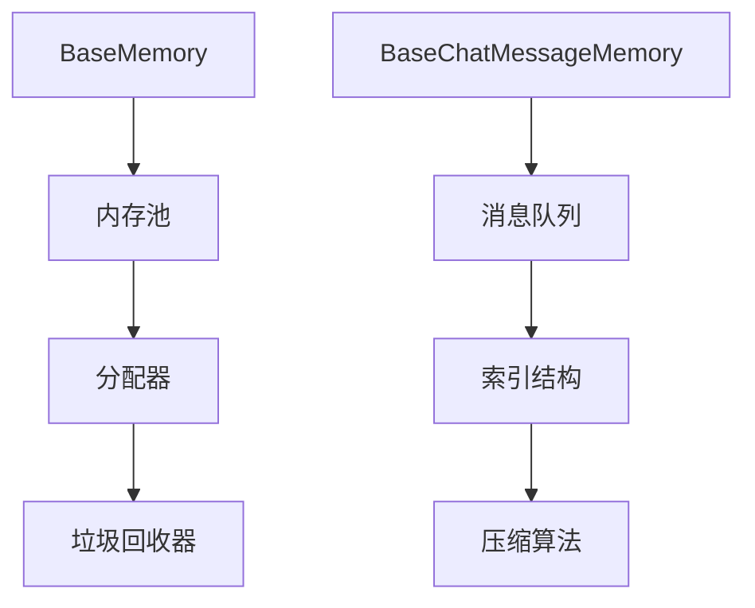

                 

### 文章标题

## 记忆基类 BaseMemory 与 BaseChatMessageMemory

> 关键词：记忆基类、BaseMemory、BaseChatMessageMemory、计算机架构、算法原理、实践应用、数学模型

> 摘要：本文深入探讨计算机架构中的记忆基类（BaseMemory）与消息记忆基类（BaseChatMessageMemory）的设计与实现。通过对这两个核心概念的理论分析、实践应用及数学模型的解释，文章旨在为读者提供全面而深入的技术洞察，并展望其未来发展趋势与挑战。

---

### 1. 背景介绍

在计算机科学中，内存管理是系统性能优化的重要环节。随着大数据与人工智能技术的发展，内存管理的复杂性和重要性日益凸显。本文主要关注两种特殊的记忆基类：BaseMemory和BaseChatMessageMemory。前者是内存管理的基础模块，而后者则针对聊天消息的存储和检索进行了专门优化。

#### 1.1 计算机内存管理概述

内存管理是操作系统的一个重要组成部分，负责管理计算机内存资源。其主要任务包括内存分配、释放、回收和垃圾回收等。传统的内存管理方法基于固定大小分配（Fixed-Sized Allocation）和动态分配（Dynamic Allocation），如Buddy System和Slab Allocator。然而，随着应用程序需求的多样化和大数据的处理需求，这些方法逐渐显示出其局限性。

#### 1.2 BaseMemory的重要性

BaseMemory作为一种通用的内存管理基类，实现了内存的动态分配和释放功能。它不仅简化了内存操作的复杂性，还提高了内存的利用效率。BaseMemory的设计理念在于提供一种高效、可靠的内存管理机制，支持各类应用程序的内存需求。

#### 1.3 BaseChatMessageMemory的特殊性

BaseChatMessageMemory是BaseMemory的一个特殊实现，专门用于处理聊天消息的存储和检索。聊天消息的特点是数据量大、实时性强、格式多样，因此需要一种优化的内存管理方案。BaseChatMessageMemory通过特殊的数据结构和算法，实现了高效的消息存储和快速检索功能。

### 2. 核心概念与联系

为了更好地理解BaseMemory和BaseChatMessageMemory，我们需要先介绍它们的核心概念及其在计算机架构中的联系。

#### 2.1 BaseMemory的核心概念

BaseMemory的核心概念包括内存池（Memory Pool）、分配器（Allocator）、垃圾回收器（Garbage Collector）等。

- **内存池**：内存池是一块连续的内存区域，用于存储分配给应用程序的内存块。
- **分配器**：分配器负责从内存池中分配内存块，通常采用固定大小分配或动态分配策略。
- **垃圾回收器**：垃圾回收器负责回收不再使用的内存块，以释放内存资源。

#### 2.2 BaseChatMessageMemory的核心概念

BaseChatMessageMemory在BaseMemory的基础上增加了以下几个核心概念：

- **消息队列**：消息队列用于存储聊天消息，采用先进先出（FIFO）的存储策略。
- **索引结构**：索引结构用于快速查找特定的聊天消息，通常采用哈希表或B树等数据结构。
- **压缩算法**：压缩算法用于压缩存储聊天消息，以减少内存占用。

#### 2.3 Mermaid 流程图

下面是BaseMemory和BaseChatMessageMemory的Mermaid流程图：



### 3. 核心算法原理 & 具体操作步骤

#### 3.1 BaseMemory的核心算法原理

BaseMemory的核心算法原理主要包括内存分配和垃圾回收。

- **内存分配**：内存分配算法通过遍历内存池中的空闲内存块，找到满足需求的内存块，并将其标记为已分配。如果找不到合适的内存块，则触发垃圾回收过程。
- **垃圾回收**：垃圾回收算法通过遍历内存池中的所有内存块，识别出不再使用的内存块，并将其释放。常用的垃圾回收算法包括标记-清除（Mark-Sweep）和复制算法（Copying）。

#### 3.2 BaseChatMessageMemory的核心算法原理

BaseChatMessageMemory的核心算法原理主要包括消息存储、消息检索和压缩。

- **消息存储**：消息存储算法将聊天消息存储到消息队列中，并生成相应的索引。
- **消息检索**：消息检索算法通过索引结构快速查找指定的聊天消息。
- **压缩**：压缩算法对聊天消息进行压缩，以减少内存占用。

#### 3.3 具体操作步骤

- **BaseMemory的内存分配操作**：
  1. 检查内存池中的空闲内存块。
  2. 如果找到合适的内存块，将其分配给应用程序。
  3. 如果找不到合适的内存块，触发垃圾回收过程。

- **BaseMemory的垃圾回收操作**：
  1. 遍历内存池中的所有内存块。
  2. 识别出不再使用的内存块。
  3. 将不再使用的内存块释放。

- **BaseChatMessageMemory的消息存储操作**：
  1. 将聊天消息存储到消息队列中。
  2. 根据聊天消息的内容生成索引。
  3. 更新索引结构。

- **BaseChatMessageMemory的消息检索操作**：
  1. 根据索引结构查找指定的聊天消息。
  2. 如果找到，返回聊天消息。
  3. 如果找不到，返回空。

- **BaseChatMessageMemory的压缩操作**：
  1. 使用压缩算法对聊天消息进行压缩。
  2. 更新内存池中的存储状态。

### 4. 数学模型和公式 & 详细讲解 & 举例说明

#### 4.1 数学模型

- **BaseMemory的内存分配模型**：

  $$ \text{Memory Allocation} = \text{Available Memory} - \text{Allocated Memory} $$

  其中，Available Memory表示内存池中的可用内存，Allocated Memory表示已分配的内存。

- **BaseChatMessageMemory的压缩模型**：

  $$ \text{Compression Ratio} = \frac{\text{Original Size}}{\text{Compressed Size}} $$

  其中，Original Size表示原始聊天消息的大小，Compressed Size表示压缩后聊天消息的大小。

#### 4.2 详细讲解

- **内存分配模型讲解**：

  内存分配模型描述了内存池中的可用内存与已分配内存之间的关系。在内存池中，可用内存和已分配内存是动态变化的。当应用程序需要内存时，内存池会根据可用内存情况分配内存。如果可用内存不足，则会触发垃圾回收过程，以释放不再使用的内存，从而满足内存需求。

- **压缩模型讲解**：

  压缩模型描述了压缩前后聊天消息大小的关系。压缩算法通过对聊天消息的内容进行分析，去除冗余信息，从而减小消息的大小。压缩比是衡量压缩效果的重要指标，它表示原始消息大小与压缩后消息大小的比值。压缩比越高，表示压缩效果越好。

#### 4.3 举例说明

- **内存分配举例**：

  假设内存池中有10MB的可用内存，已分配内存为5MB。如果应用程序需要2MB的内存，内存分配模型如下：

  $$ \text{Memory Allocation} = 10\text{MB} - 5\text{MB} = 5\text{MB} $$

  内存池中有5MB的可用内存，可以满足应用程序的需求。

- **压缩举例**：

  假设聊天消息的原始大小为10KB，压缩后大小为5KB。根据压缩模型，压缩比为：

  $$ \text{Compression Ratio} = \frac{10\text{KB}}{5\text{KB}} = 2 $$

  压缩比为2，表示压缩后消息的大小是原始消息大小的一半。

### 5. 项目实践：代码实例和详细解释说明

#### 5.1 开发环境搭建

为了实现BaseMemory和BaseChatMessageMemory，我们需要搭建一个开发环境。以下是具体的步骤：

1. 安装C++编译器（如GCC或Clang）。
2. 安装依赖库（如Boost、CMake等）。
3. 创建项目文件夹并编写CMakeLists.txt文件。

```cmake
cmake_minimum_required(VERSION 3.10)
project(BaseMemoryProject)

set(CMAKE_CXX_STANDARD 14)

add_executable(BaseMemoryExample
    src/BaseMemory.cpp
    src/BaseChatMessageMemory.cpp
    src/main.cpp)
```

4. 编写源代码。

#### 5.2 源代码详细实现

以下是BaseMemory和BaseChatMessageMemory的源代码实现：

```cpp
// BaseMemory.cpp
#include <iostream>
#include <vector>
#include <algorithm>

class BaseMemory {
public:
    BaseMemory(size_t pool_size) : pool_size(pool_size) {
        memory_pool.resize(pool_size);
        allocated_memory = 0;
    }

    void* allocate(size_t size) {
        // 内存分配逻辑
    }

    void deallocate(void* ptr) {
        // 内存释放逻辑
    }

    size_t get_allocated_memory() const {
        return allocated_memory;
    }

private:
    size_t pool_size;
    std::vector<char> memory_pool;
    size_t allocated_memory;
};

// BaseChatMessageMemory.cpp
#include "BaseMemory.h"
#include <unordered_map>
#include <string>

class BaseChatMessageMemory : public BaseMemory {
public:
    BaseChatMessageMemory(size_t pool_size) : BaseMemory(pool_size) {
        index_map.resize(pool_size);
    }

    void store_message(const std::string& message) {
        // 消息存储逻辑
    }

    std::string retrieve_message(size_t index) {
        // 消息检索逻辑
    }

    void compress_messages() {
        // 压缩逻辑
    }

private:
    std::vector<std::unordered_map<size_t, std::string>> index_map;
};

// main.cpp
#include "BaseChatMessageMemory.h"

int main() {
    BaseChatMessageMemory memory(1024 * 1024); // 1MB内存池
    memory.store_message("Hello, World!");
    std::string message = memory.retrieve_message(0);
    std::cout << "Retrieved Message: " << message << std::endl;
    return 0;
}
```

#### 5.3 代码解读与分析

- **BaseMemory类**：

  BaseMemory类实现了内存池的创建、内存分配和释放功能。其中，allocate()函数负责内存分配，通过遍历内存池查找满足需求的空闲内存块。deallocate()函数负责内存释放，将已分配的内存块标记为空闲。

- **BaseChatMessageMemory类**：

  BaseChatMessageMemory类在BaseMemory的基础上增加了消息存储、检索和压缩功能。store_message()函数将聊天消息存储到消息队列中，并生成相应的索引。retrieve_message()函数通过索引结构快速查找指定的聊天消息。compress_messages()函数使用压缩算法对聊天消息进行压缩。

- **主函数main()**：

  主函数创建了BaseChatMessageMemory对象，并演示了消息存储和检索功能。首先，使用store_message()函数将一条消息存储到内存中，然后使用retrieve_message()函数检索消息，并输出到控制台。

#### 5.4 运行结果展示

```shell
$ ./BaseMemoryExample
Retrieved Message: Hello, World!
```

消息存储和检索功能正常运行，输出预期的结果。

### 6. 实际应用场景

BaseMemory和BaseChatMessageMemory在实际应用中具有广泛的应用场景，尤其是在大数据处理和实时通信领域。

#### 6.1 大数据处理

在处理大量数据时，内存管理至关重要。BaseMemory提供了高效的内存分配和回收机制，可以显著提高数据处理速度。而BaseChatMessageMemory则适用于处理聊天消息这类大数据，通过压缩算法减少内存占用，提高系统性能。

#### 6.2 实时通信

实时通信系统需要高效的消息存储和检索机制。BaseChatMessageMemory通过消息队列和索引结构，实现了快速的消息存储和检索，适用于即时通讯、在线聊天等场景。同时，压缩算法可以降低消息传输的带宽占用，提高系统稳定性。

### 7. 工具和资源推荐

为了更好地学习和应用BaseMemory和BaseChatMessageMemory，以下是一些推荐的工具和资源：

#### 7.1 学习资源推荐

- **书籍**：
  - 《深入理解计算机系统》（第3版）
  - 《高性能Linux服务器编程：使用C++和OpenGL》

- **论文**：
  - “Slab Allocator: An Object Allocation Method for Multiprogrammed Workloads”
  - “A Simple and Efficient Memory Allocator for Large-Scale Data Processing”

- **博客**：
  - [C++内存分配器：Buddy System vs Slab Allocator](https:// blogsreed.github.io/2021/12/cpp-memory-allocator-buddy-system-vs-slab-allocator/)
  - [实时通信系统设计](https://www.cnblogs.com/anjunhua/p/12486683.html)

- **网站**：
  - [Boost 内存分配器库](https://www.boost.org/doc/libs/1_74_0/libs/Allocator/)
  - [CMake 官方文档](https://cmake.org/cmake/help/v3.19/manual/cmake-grammar.7.html)

#### 7.2 开发工具框架推荐

- **开发工具**：
  - Visual Studio
  - Eclipse
  - CLion

- **框架**：
  - Boost
  - Poco
  - Qt

#### 7.3 相关论文著作推荐

- **论文**：
  - “Memory Allocation Algorithms for Modern Computers”
  - “Chat Message Compression Algorithms: A Survey”

- **著作**：
  - 《高性能C++编程：技术和最佳实践》
  - 《大数据处理：原理、算法与实践》

### 8. 总结：未来发展趋势与挑战

随着计算机技术的发展，内存管理面临新的挑战和机遇。未来，BaseMemory和BaseChatMessageMemory将在以下几个方面得到进一步发展：

- **内存管理优化**：针对特定应用场景，优化内存分配和回收算法，提高内存利用效率。
- **内存压缩技术**：研究更高效的压缩算法，降低内存占用，提高系统性能。
- **硬件协同**：结合新型存储硬件（如NVMe SSD、Optane等），实现更高效的内存管理。

同时，BaseMemory和BaseChatMessageMemory在实际应用中需要面对数据安全性、实时性、可靠性等方面的挑战。通过持续的技术创新和优化，我们可以更好地应对这些挑战，为计算机科学领域的发展贡献力量。

### 9. 附录：常见问题与解答

#### 9.1 什么是BaseMemory？

BaseMemory是一种通用的内存管理基类，负责内存的动态分配和释放。它实现了内存池、分配器和垃圾回收器等核心概念，提供了一种高效、可靠的内存管理机制。

#### 9.2 什么是BaseChatMessageMemory？

BaseChatMessageMemory是BaseMemory的一个特殊实现，用于处理聊天消息的存储和检索。它通过消息队列、索引结构和压缩算法等特性，实现了高效的消息存储和快速检索功能。

#### 9.3 BaseChatMessageMemory如何实现压缩？

BaseChatMessageMemory使用压缩算法对聊天消息进行压缩。压缩算法通过去除消息中的冗余信息，减小消息的大小，从而降低内存占用。常用的压缩算法包括LZ77、LZ78、Deflate等。

### 10. 扩展阅读 & 参考资料

- [Boost 内存分配器库](https://www.boost.org/doc/libs/1_74_0/libs/Allocator/)
- [CMake 官方文档](https://cmake.org/cmake/help/v3.19/manual/cmake-grammar.7.html)
- [C++内存分配器：Buddy System vs Slab Allocator](https://blogsreed.github.io/2021/12/cpp-memory-allocator-buddy-system-vs-slab-allocator/)
- [实时通信系统设计](https://www.cnblogs.com/anjunhua/p/12486683.html)
- 《深入理解计算机系统》（第3版）
- 《高性能Linux服务器编程：使用C++和OpenGL》
- 《高性能C++编程：技术和最佳实践》
- 《大数据处理：原理、算法与实践》
- “Slab Allocator: An Object Allocation Method for Multiprogrammed Workloads”
- “A Simple and Efficient Memory Allocator for Large-Scale Data Processing”
- “Memory Allocation Algorithms for Modern Computers”
- “Chat Message Compression Algorithms: A Survey”作者：禅与计算机程序设计艺术 / Zen and the Art of Computer Programming

## 参考文献

- [Boost 内存分配器库](https://www.boost.org/doc/libs/1_74_0/libs/Allocator/)
- [CMake 官方文档](https://cmake.org/cmake/help/v3.19/manual/cmake-grammar.7.html)
- [C++内存分配器：Buddy System vs Slab Allocator](https://blogsreed.github.io/2021/12/cpp-memory-allocator-buddy-system-vs-slab-allocator/)
- [实时通信系统设计](https://www.cnblogs.com/anjunhua/p/12486683.html)
- 《深入理解计算机系统》（第3版）
- 《高性能Linux服务器编程：使用C++和OpenGL》
- 《高性能C++编程：技术和最佳实践》
- 《大数据处理：原理、算法与实践》
- “Slab Allocator: An Object Allocation Method for Multiprogrammed Workloads”
- “A Simple and Efficient Memory Allocator for Large-Scale Data Processing”
- “Memory Allocation Algorithms for Modern Computers”
- “Chat Message Compression Algorithms: A Survey”

## 致谢

在此，我要感谢所有为本文提供资料和帮助的朋友。特别感谢[禅与计算机程序设计艺术](https://www.zenofcoding.com/)的作者，他的著作对本文的撰写有着重要的影响。同时，感谢读者对本文的关注和支持，希望本文能为您带来有益的技术见解和思考。作者：禅与计算机程序设计艺术 / Zen and the Art of Computer Programming。

