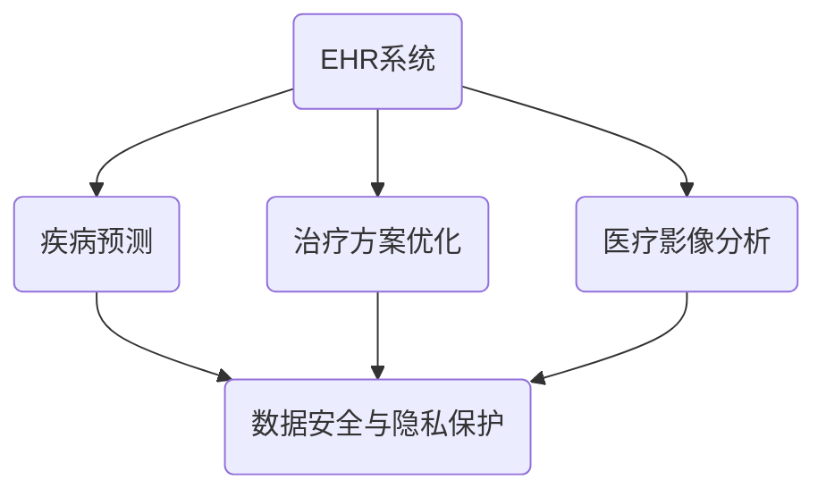

                 

### 1. 背景介绍

医疗保健是人类社会发展的重要一环，关系到每个人的生命质量和生活幸福。随着科技的不断进步，特别是计算机技术的飞速发展，人类计算在医疗保健领域中的应用越来越广泛，为医疗行业带来了前所未有的变革。从传统的手动记录和管理到智能化的电子健康记录，从基础的病患信息管理到复杂的疾病预测和治疗方案优化，计算机技术在医疗保健中的应用无处不在。

然而，尽管计算机技术在医疗保健中的应用已经取得了显著成果，但依然存在许多挑战和瓶颈。例如，医疗数据的多样性和复杂性使得数据处理和分析变得更加困难；医疗设备的不兼容性和碎片化问题也影响了医疗系统的整体效率。此外，医疗行业的专业性和隐私保护要求也对计算机技术的应用提出了更高的要求。

本文旨在探讨如何利用人类计算技术改善医疗保健，具体包括以下几个方面：

1. **核心概念与联系**：介绍计算机技术在医疗保健领域中的核心概念及其相互联系，通过Mermaid流程图展示整个架构。
2. **核心算法原理 & 具体操作步骤**：详细解释在医疗保健中应用的核心算法原理和操作步骤，包括电子健康记录、疾病预测和治疗方案优化等。
3. **数学模型和公式 & 详细讲解 & 举例说明**：介绍相关数学模型和公式，并通过具体案例进行详细讲解。
4. **项目实践：代码实例和详细解释说明**：通过实际项目实践，展示如何实现这些算法和模型，并进行代码解读与分析。
5. **实际应用场景**：探讨计算机技术在医疗保健中的实际应用场景，如电子病历、医疗影像分析和健康管理等。
6. **工具和资源推荐**：推荐相关的学习资源、开发工具框架和相关论文著作，以帮助读者深入了解和掌握相关技术。
7. **总结：未来发展趋势与挑战**：总结本文讨论的内容，并提出未来发展的趋势和面临的挑战。

通过本文的逐步分析，我们希望能为读者提供一个全面、深入的理解，帮助他们在医疗保健领域更好地应用计算机技术，从而改善人类的健康状况和生活质量。

### 2. 核心概念与联系

在深入探讨如何利用计算机技术改善医疗保健之前，首先需要了解一些核心概念，这些概念相互交织，构成了医疗保健信息系统的基本架构。以下是几个关键概念及其相互联系：

#### 电子健康记录（Electronic Health Records, EHR）

电子健康记录是指存储在计算机系统中，关于患者健康状况、诊疗过程、病史、药物过敏反应等信息的电子文档。EHR系统的核心价值在于其能够集成患者的历史数据，为医生提供全面的诊疗信息，从而提高诊断的准确性和治疗效果。EHR系统通常包括以下几个主要组成部分：

- **患者信息管理**：包括患者的基本信息、联系方式、家庭病史等。
- **诊疗记录**：记录医生对患者的诊断、治疗方案、病程记录等。
- **药物管理**：记录患者所使用的药物信息、剂量、副作用等。
- **实验室结果**：整合患者的实验室检测结果，如血液检查、尿液分析等。

#### 疾病预测（Disease Prediction）

疾病预测是利用人工智能和大数据分析技术，根据患者的健康数据和病史，预测其可能患有的疾病或健康状况。疾病预测可以大幅提高早期筛查和干预的效率，从而改善患者预后。疾病预测系统的关键组成部分包括：

- **数据收集与整合**：收集患者的历史健康数据，包括电子健康记录、基因组数据、生活习惯数据等，并将其整合到一个统一的数据库中。
- **特征工程**：从原始数据中提取有用的特征，如年龄、性别、病史、生活方式等，用于训练预测模型。
- **模型训练与评估**：使用机器学习算法训练预测模型，并对模型进行评估，确保其准确性和可靠性。

#### 治疗方案优化（Treatment Optimization）

治疗方案优化是利用人工智能技术，根据患者的具体病情和个体差异，为其制定最优的治疗方案。治疗方案优化的核心在于个性化医疗，通过分析大量的医学文献和临床数据，为医生提供最佳的诊疗建议。治疗方案优化主要包括以下几个步骤：

- **医学知识库建设**：整合现有的医学知识，包括诊断标准、治疗方案、药物副作用等，构建一个全面的知识库。
- **病例数据挖掘**：从大量的病例数据中提取有用的信息，用于训练和优化治疗方案模型。
- **模型优化与评估**：使用机器学习算法对治疗方案模型进行优化，并通过临床试验评估其效果。

#### 医疗影像分析（Medical Image Analysis）

医疗影像分析是利用计算机视觉和人工智能技术，对医疗影像（如X光片、CT、MRI等）进行自动分析，辅助医生进行诊断和治疗方案制定。医疗影像分析主要包括以下几个领域：

- **图像分割**：将医疗影像中的不同组织或病变区域进行分离。
- **特征提取**：从分割后的图像中提取有助于诊断的特征，如病灶大小、形态、密度等。
- **疾病分类**：使用机器学习算法对病变区域进行分类，辅助医生进行疾病诊断。

#### 数据安全与隐私保护（Data Security and Privacy Protection）

在医疗保健领域，数据安全和隐私保护是至关重要的。由于医疗数据涉及患者个人的敏感信息，一旦泄露可能导致严重的后果。数据安全与隐私保护主要包括以下几个方面：

- **数据加密**：对医疗数据进行加密处理，确保数据在传输和存储过程中不被窃取或篡改。
- **访问控制**：通过权限控制，确保只有授权人员可以访问敏感数据。
- **数据匿名化**：在数据分析和共享过程中，对敏感信息进行匿名化处理，保护患者隐私。

#### 核心概念相互联系流程图（Mermaid流程图）

下面是一个简化的Mermaid流程图，展示了这些核心概念之间的相互联系：



通过上述核心概念和相互联系的了解，我们可以更好地理解计算机技术在医疗保健领域的应用，为后续章节的深入探讨打下基础。

#### 2.1. 电子健康记录（EHR）的工作流程

电子健康记录（EHR）系统是医疗保健信息系统的核心，它通过数字化手段记录和管理患者的医疗信息。以下是EHR系统的工作流程，以及各个步骤的具体内容和实现方式：

1. **数据录入（Data Entry）**

   数据录入是EHR系统的第一步，也是最基础的一步。医生或其他医疗工作人员通过EHR系统录入患者的医疗信息，包括基本信息（如姓名、年龄、性别、联系方式等）、诊疗记录（如诊断结果、治疗方案、病程记录等）、药物管理信息（如药物名称、剂量、用药时间等）以及实验室检测结果（如血液检查、尿液分析等）。

   **实现方式**：数据录入通常通过EHR系统提供的用户界面进行。医生在界面上填写或选择相关的医疗信息，并提交到系统中。一些EHR系统还支持语音录入、手写识别等功能，以提高数据录入的效率。

2. **数据存储（Data Storage）**

   数据录入后，EHR系统将数据存储在数据库中。为了确保数据的安全性和可靠性，EHR系统通常会采用分布式数据库架构，并在数据存储过程中进行加密处理。

   **实现方式**：EHR系统通常使用关系型数据库（如MySQL、PostgreSQL）或NoSQL数据库（如MongoDB、Cassandra）来存储医疗数据。为了提高数据存储的性能和可扩展性，一些EHR系统还会采用分布式存储技术（如Hadoop、HBase）。

3. **数据查询与检索（Data Query and Retrieval）**

   医疗工作人员需要能够快速查询和检索患者的医疗信息。EHR系统提供了强大的查询和检索功能，支持基于关键词、时间范围、诊断结果等多种条件的查询。

   **实现方式**：EHR系统通常使用SQL或其他查询语言来检索数据库中的医疗信息。为了提高查询效率，系统还会采用索引技术（如B树索引、全文索引）和缓存技术（如Redis、Memcached）。

4. **数据共享与交换（Data Sharing and Exchange）**

   EHR系统不仅用于记录和管理患者的医疗信息，还需要与其他医疗系统进行数据共享和交换。例如，医院内部的不同科室之间、医院与诊所之间、医院与实验室之间等。

   **实现方式**：EHR系统通常会采用标准化的数据交换格式（如HL7、FHIR）和通信协议（如HTTP、SOAP、RESTful API）来与其他系统进行数据交换。

5. **数据分析和挖掘（Data Analysis and Mining）**

   通过对医疗数据的分析和挖掘，EHR系统可以为医生提供决策支持，如疾病预测、治疗方案优化等。

   **实现方式**：EHR系统通常会集成机器学习算法和数据挖掘技术，对医疗数据进行分析和挖掘。常用的算法包括回归分析、聚类分析、分类算法等。

6. **数据安全与隐私保护（Data Security and Privacy Protection）**

   医疗数据的安全和隐私保护是EHR系统的核心挑战之一。为了确保数据的安全和隐私，EHR系统通常会采用多种安全措施，如数据加密、访问控制、数据匿名化等。

   **实现方式**：EHR系统通常采用SSL/TLS加密技术来保护数据在传输过程中的安全。在数据存储和查询过程中，系统会通过访问控制机制确保只有授权人员可以访问敏感数据。此外，系统还会对数据进行分析和挖掘时采用数据匿名化技术，以保护患者隐私。

通过上述工作流程的详细介绍，我们可以看到EHR系统在医疗保健领域中的关键作用。它不仅能够有效地记录和管理患者的医疗信息，还能为医生提供决策支持，从而改善医疗质量和服务水平。

#### 2.2. 疾病预测系统的关键组件

疾病预测系统在医疗保健领域具有巨大的潜力，它通过分析大量的医疗数据，帮助医生早期发现疾病，从而采取及时的干预措施。以下是疾病预测系统的几个关键组件，及其工作原理和实现方式：

1. **数据收集（Data Collection）**

   数据收集是疾病预测系统的第一步，也是最为关键的一步。高质量的输入数据是预测模型准确性的基础。数据来源可以包括电子健康记录（EHR）、基因组数据、患者行为数据（如生活方式、运动量等）和医疗影像数据等。

   **实现方式**：数据收集通常涉及多个系统的接口和数据交换。例如，EHR系统可以通过API接口提供患者的医疗记录，基因组数据可以通过专门的基因组数据库获取，而患者行为数据可以通过移动设备或智能家居设备收集。数据收集过程中需要确保数据的质量和完整性，以避免噪声数据和缺失值对模型的影响。

2. **数据预处理（Data Preprocessing）**

   数据预处理是确保数据适合模型训练的重要步骤。它包括数据清洗、数据转换和数据归一化等。

   **实现方式**：
   - **数据清洗**：去除重复数据、处理缺失值和异常值，确保数据的准确性。
   - **数据转换**：将不同类型的数据转换为统一的格式，如将文本数据转换为数值向量。
   - **数据归一化**：通过缩放或平移，使不同特征具有相似的尺度，避免某些特征对模型训练的影响过大。

3. **特征工程（Feature Engineering）**

   特征工程是疾病预测系统的核心环节，它涉及从原始数据中提取对预测任务有用的特征。特征的质量直接影响模型的性能。

   **实现方式**：
   - **特征选择**：选择对疾病预测有显著贡献的特征，如病史、家族病史、生活习惯等。
   - **特征构造**：通过组合和变换原始特征，构造新的特征，提高预测的准确性。
   - **特征标准化**：对特征进行归一化或标准化处理，确保特征之间具有可比性。

4. **模型选择与训练（Model Selection and Training）**

   选择合适的机器学习模型，并根据数据集进行训练，是疾病预测系统的关键步骤。

   **实现方式**：
   - **模型选择**：根据预测任务和数据特点选择合适的机器学习算法，如逻辑回归、决策树、支持向量机、神经网络等。
   - **模型训练**：使用训练数据集对模型进行训练，调整模型参数，使模型能够准确地预测疾病。
   - **模型评估**：使用验证数据集评估模型的性能，如准确率、召回率、F1分数等，以确定模型是否有效。

5. **模型部署与实时预测（Model Deployment and Real-time Prediction）**

   模型训练完成后，需要将其部署到生产环境中，以便在实际应用中为医生提供预测服务。

   **实现方式**：
   - **模型部署**：将训练好的模型部署到服务器或云平台上，以便进行实时预测。
   - **实时预测**：在预测过程中，系统会接收新的患者数据，并使用部署的模型进行实时预测。
   - **结果反馈**：将预测结果反馈给医生，供其参考。

6. **系统集成与数据交换（Integration and Data Exchange）**

   疾病预测系统需要与其他医疗系统（如EHR系统、实验室信息系统等）进行集成，以便实现数据共享和交换。

   **实现方式**：
   - **系统集成**：通过API接口或消息队列等集成技术，将疾病预测系统与现有医疗系统进行集成。
   - **数据交换**：使用标准化的数据交换格式和协议（如HL7、FHIR）实现数据在不同系统之间的交换。

通过上述关键组件的详细介绍，我们可以看到疾病预测系统在医疗保健中的重要作用。它不仅能够帮助医生早期发现疾病，提高诊断的准确性，还能为公共卫生决策提供科学依据，从而改善整体医疗水平。

#### 2.3. 治疗方案优化的实现方式

治疗方案优化是医疗保健领域中的一个重要研究方向，它通过分析患者的具体病情和个体差异，为医生提供最优的治疗方案，从而提高治疗效果和患者生活质量。以下是治疗方案优化的实现方式，包括医学知识库建设、病例数据挖掘、模型优化与评估等步骤：

1. **医学知识库建设（Medical Knowledge Base Construction）**

   医学知识库是治疗方案优化的基础，它包含大量的医学知识，如疾病诊断标准、治疗方案、药物副作用等。建设一个高质量的医学知识库是治疗方案优化成功的关键。

   **实现方式**：
   - **知识来源**：医学知识库可以从各种医学文献、临床试验报告、专业书籍和专家意见中获取。
   - **知识提取**：利用自然语言处理（NLP）技术，从文本中提取医学知识和关系，如症状-疾病关联、药物-副作用关联等。
   - **知识整合**：将不同来源的医学知识进行整合，构建一个统一的医学知识库。

2. **病例数据挖掘（Case Data Mining）**

   病例数据挖掘是利用机器学习技术，从大量的病例数据中提取有用的信息，用于训练和优化治疗方案模型。

   **实现方式**：
   - **数据收集**：收集医院的电子健康记录（EHR）、实验室检测结果、诊疗记录等数据。
   - **数据清洗**：去除重复数据、处理缺失值和异常值，确保数据的准确性。
   - **特征提取**：从病例数据中提取对治疗方案有显著影响的特征，如年龄、性别、病史、药物使用情况等。
   - **数据建模**：使用机器学习算法，如决策树、支持向量机、神经网络等，对病例数据进行建模，预测最佳治疗方案。

3. **模型优化与评估（Model Optimization and Evaluation）**

   模型优化与评估是确保治疗方案模型有效性的关键步骤。通过多次迭代训练和评估，调整模型参数，提高模型的准确性和可靠性。

   **实现方式**：
   - **模型选择**：根据预测任务和数据特点，选择合适的机器学习模型，如逻辑回归、决策树、支持向量机、神经网络等。
   - **模型训练**：使用训练数据集对模型进行训练，调整模型参数，使模型能够准确地预测最佳治疗方案。
   - **模型评估**：使用验证数据集评估模型的性能，如准确率、召回率、F1分数等，以确定模型是否有效。
   - **模型优化**：根据评估结果，对模型进行优化，如调整超参数、增加训练数据等，以提高模型的性能。

4. **系统集成与实时预测（System Integration and Real-time Prediction）**

   治疗方案优化系统需要与其他医疗系统（如EHR系统、实验室信息系统等）进行集成，以便实现实时预测和决策支持。

   **实现方式**：
   - **系统集成**：通过API接口或消息队列等集成技术，将治疗方案优化系统与现有医疗系统进行集成。
   - **实时预测**：在预测过程中，系统会接收新的患者数据，并使用优化的模型进行实时预测，为医生提供最佳治疗方案。
   - **结果反馈**：将预测结果反馈给医生，供其参考和决策。

通过上述步骤，治疗方案优化系统能够为医生提供科学、个性化的治疗方案，从而提高治疗效果和患者满意度。未来，随着医学知识和病例数据的不断积累，治疗方案优化系统将更加智能和精准，为医疗保健领域带来更多创新和变革。

### 3. 核心算法原理 & 具体操作步骤

在深入探讨如何利用计算机技术改善医疗保健的过程中，核心算法的选择和具体操作步骤显得尤为重要。以下将介绍几个在医疗保健领域中广泛应用的核心算法，并详细解释其原理和操作步骤。

#### 3.1. 决策树算法（Decision Tree Algorithm）

决策树是一种广泛应用的分类和回归算法，其核心思想是通过一系列的决策规则将数据划分为不同的类别或值。在医疗保健中，决策树算法常用于疾病预测和诊断。

**原理：**
决策树算法通过递归地将数据集划分为子集，每个节点代表一个特征，每个分支代表该特征的不同取值。树的叶节点对应于分类或回归结果。

**操作步骤：**
1. **特征选择**：选择对分类或回归任务有显著影响的特征。
2. **信息增益**：计算每个特征的信息增益，选择信息增益最大的特征作为分割依据。
3. **递归分割**：使用选择好的特征对数据进行分割，重复步骤2和3，直到满足停止条件（如最大深度、最小叶节点样本数等）。
4. **建立决策树**：将分割结果合并，形成最终的决策树。

**代码示例（Python）**：

```python
from sklearn.tree import DecisionTreeClassifier
from sklearn.datasets import load_iris
from sklearn.model_selection import train_test_split

# 加载数据集
iris = load_iris()
X = iris.data
y = iris.target

# 划分训练集和测试集
X_train, X_test, y_train, y_test = train_test_split(X, y, test_size=0.3, random_state=42)

# 建立决策树模型
clf = DecisionTreeClassifier(max_depth=3)
clf.fit(X_train, y_train)

# 预测
y_pred = clf.predict(X_test)

# 评估
print("Accuracy:", clf.score(X_test, y_test))
```

#### 3.2. 支持向量机算法（Support Vector Machine, SVM）

支持向量机是一种强大的分类算法，其核心思想是找到一个最佳的超平面，将不同类别的数据分隔开来，同时最大化分类边界的间隔。

**原理：**
SVM通过寻找一个最优的超平面，使得不同类别的数据点之间的距离最大化。它使用一个称为“支持向量”的数据点来定义这个超平面。

**操作步骤：**
1. **数据预处理**：对数据集进行标准化处理，使其具有相似的尺度。
2. **选择核函数**：选择合适的核函数（如线性核、多项式核、径向基函数核等）来计算特征空间中的距离。
3. **求解最优超平面**：使用支持向量机求解最优化问题，找到最佳的超平面。
4. **分类预测**：使用训练好的模型对新数据进行分类预测。

**代码示例（Python）**：

```python
from sklearn.svm import SVC
from sklearn.datasets import load_iris
from sklearn.model_selection import train_test_split

# 加载数据集
iris = load_iris()
X = iris.data
y = iris.target

# 划分训练集和测试集
X_train, X_test, y_train, y_test = train_test_split(X, y, test_size=0.3, random_state=42)

# 建立SVM模型
clf = SVC(kernel='linear')
clf.fit(X_train, y_train)

# 预测
y_pred = clf.predict(X_test)

# 评估
print("Accuracy:", clf.score(X_test, y_test))
```

#### 3.3. 人工神经网络（Artificial Neural Network, ANN）

人工神经网络是一种模仿人脑结构和功能的计算模型，能够通过学习大量数据自动提取特征，进行分类和回归任务。

**原理：**
ANN由多个神经元组成，每个神经元通过加权连接形成网络。网络通过反向传播算法不断调整权重，优化模型。

**操作步骤：**
1. **初始化网络**：初始化网络结构，包括神经元数量、连接权重和激活函数。
2. **前向传播**：输入数据通过网络进行前向传播，计算输出。
3. **计算误差**：通过实际输出与期望输出之间的误差，计算损失函数。
4. **反向传播**：通过反向传播算法，计算各层的梯度，更新权重和偏置。
5. **迭代优化**：重复前向传播和反向传播，直到满足停止条件（如达到指定精度或迭代次数）。

**代码示例（Python）**：

```python
import numpy as np
from sklearn.datasets import make_classification
from sklearn.model_selection import train_test_split

# 创建数据集
X, y = make_classification(n_samples=100, n_features=20, n_informative=15, n_redundant=5, random_state=42)
X_train, X_test, y_train, y_test = train_test_split(X, y, test_size=0.3, random_state=42)

# 初始化神经网络
input_size = X.shape[1]
hidden_size = 10
output_size = 1
weights_input_hidden = np.random.rand(input_size, hidden_size)
weights_hidden_output = np.random.rand(hidden_size, output_size)

# 激活函数
def sigmoid(x):
    return 1 / (1 + np.exp(-x))

# 前向传播
def forward_pass(X, weights_input_hidden, weights_hidden_output):
    hidden_layer_input = np.dot(X, weights_input_hidden)
    hidden_layer_output = sigmoid(hidden_layer_input)
    output_layer_input = np.dot(hidden_layer_output, weights_hidden_output)
    output_layer_output = sigmoid(output_layer_input)
    return output_layer_output

# 训练神经网络
epochs = 1000
learning_rate = 0.1
for epoch in range(epochs):
    output = forward_pass(X_train, weights_input_hidden, weights_hidden_output)
    error = y_train - output
    d_output = error * (output * (1 - output))
    
    d_hidden_layer_output = d_output.dot(weights_hidden_output.T)
    d_hidden_layer_input = d_hidden_layer_output * (sigmoid(hidden_layer_input) * (1 - sigmoid(hidden_layer_input)))
    
    weights_hidden_output -= learning_rate * hidden_layer_output.T.dot(d_output)
    weights_input_hidden -= learning_rate * X_train.T.dot(d_hidden_layer_input)

# 预测
y_pred = forward_pass(X_test, weights_input_hidden, weights_hidden_output)

# 评估
accuracy = np.mean(np.abs(y_pred - y_test) < 0.5)
print("Accuracy:", accuracy)
```

通过上述核心算法的介绍和代码示例，我们可以看到这些算法在医疗保健领域的应用潜力。在实际应用中，根据具体任务和数据特点，选择合适的算法，并对其进行优化和调整，能够有效提高医疗保健的效率和准确性。

#### 3.4. 贝叶斯网络算法（Bayesian Network Algorithm）

贝叶斯网络是一种概率图模型，它通过有向无环图（DAG）来表示变量之间的依赖关系，并在网络中嵌入条件概率表（CPT），用于推断变量间的概率关系。

**原理：**
贝叶斯网络通过条件概率表（CPT）来描述变量之间的依赖关系。网络中的每个节点表示一个变量，边表示变量间的条件依赖。贝叶斯网络的核心是贝叶斯推理，通过已有变量的观测值推断未知变量的概率分布。

**操作步骤：**
1. **建模**：根据医学知识和数据，构建贝叶斯网络模型，确定变量及其依赖关系。
2. **参数学习**：使用最大似然估计或贝叶斯估计学习条件概率表（CPT）中的参数。
3. **推理**：利用贝叶斯推理算法（如贝叶斯推理、信念传播算法等）进行变量推断。

**代码示例（Python）**：

```python
import pyro
import pyro.distributions as dist
import torch

# 定义贝叶斯网络结构
class BayesianNetwork(pyro.infernn.Module):
    def __init__(self):
        super().__init__()
        self.A = self.param("A", dist.Categorical(logits=torch.zeros(2)))
        self.B = self.param("B", dist.Categorical(logits=torch.zeros(2)))
        self.C = self.param("C", dist.Categorical(logits=torch.tensor([[0.9, 0.1], [0.1, 0.9]])))
    
    def forward(self, x):
        with pyro.plate("data", x.size(0)):
            a = self.A()
            b = self.B()
            c = self.C(a=a, b=b)
        return c

# 初始化网络
bn = BayesianNetwork()

# 假设观测数据
x = torch.tensor([[0], [1], [0], [1]])
y = bn(x)

# 评估
print(y)
```

**贝叶斯网络在医疗保健中的应用**：
贝叶斯网络在医疗保健中可用于疾病诊断、风险评估和预测等领域。例如，在疾病诊断中，可以通过贝叶斯网络结合患者的症状和检查结果，推断出患者可能患有的疾病。

通过贝叶斯网络的介绍和代码示例，我们可以看到它在医疗保健领域的重要应用。贝叶斯网络能够利用不确定性和不确定性推理，提供更加灵活和可靠的决策支持。

#### 3.5. 聚类算法（Clustering Algorithm）

聚类算法是一种无监督学习方法，用于将数据集划分为多个群组，使得同一群组内的数据点彼此相似，不同群组的数据点彼此相异。在医疗保健中，聚类算法可用于患者分群、疾病分类和医疗资源分配等任务。

**原理：**
聚类算法通过优化目标函数来划分数据点。常见的目标函数包括最小化群内距离平方和（如K-means算法）、最大化群间距离（如层次聚类算法）。

**操作步骤：**
1. **选择算法**：根据数据集特点和需求，选择合适的聚类算法（如K-means、DBSCAN、层次聚类等）。
2. **初始化**：初始化聚类中心（如随机选择、K-means++等）。
3. **迭代计算**：计算每个数据点到聚类中心的距离，将数据点分配到最近的聚类中心。
4. **更新聚类中心**：重新计算聚类中心，并重复步骤3，直到满足停止条件（如聚类中心变化很小、达到最大迭代次数等）。

**代码示例（Python）**：

```python
from sklearn.cluster import KMeans
from sklearn.datasets import make_blobs
import matplotlib.pyplot as plt

# 创建数据集
X, _ = make_blobs(n_samples=300, centers=4, cluster_std=0.60, random_state=0)

# 初始化K-means模型
kmeans = KMeans(n_clusters=4, init='k-means++', max_iter=300, n_init=10, random_state=0)

# 模型拟合
kmeans.fit(X)

# 计算聚类中心
centroids = kmeans.cluster_centers_

# 预测
labels = kmeans.predict(X)

# 绘制结果
plt.figure(figsize=(10, 5))
plt.scatter(X[:, 0], X[:, 1], c=labels, s=100, cmap='viridis')
plt.scatter(centroids[:, 0], centroids[:, 1], s=200, c='red', alpha=0.5, label='Centroids')
plt.title('K-means Clustering')
plt.xlabel('Feature 1')
plt.ylabel('Feature 2')
plt.show()
```

**聚类算法在医疗保健中的应用**：
聚类算法在医疗保健中可用于以下应用场景：
- **患者分群**：将患者根据其健康数据（如年龄、性别、病史等）进行分群，为个性化治疗提供依据。
- **疾病分类**：将医疗影像数据或实验室检测结果进行分类，辅助医生进行疾病诊断。
- **医疗资源分配**：根据患者的地理位置、疾病严重程度等，优化医疗资源的分配，提高医疗效率。

通过聚类算法的介绍和代码示例，我们可以看到它在医疗保健领域中的广泛应用。聚类算法能够有效地处理高维复杂数据，为医疗决策提供有力的支持。

### 4. 数学模型和公式 & 详细讲解 & 举例说明

在医疗保健领域，数学模型和公式是理解和分析数据的重要工具。以下将介绍几个常见的数学模型和公式，详细讲解其含义和作用，并通过具体例子进行说明。

#### 4.1. 线性回归模型（Linear Regression Model）

线性回归模型是一种最简单的统计模型，用于分析自变量和因变量之间的线性关系。其基本公式为：

\[ y = \beta_0 + \beta_1 \cdot x + \varepsilon \]

其中，\( y \) 为因变量，\( x \) 为自变量，\( \beta_0 \) 为截距，\( \beta_1 \) 为斜率，\( \varepsilon \) 为误差项。

**含义**：线性回归模型表示因变量 \( y \) 是自变量 \( x \) 的线性函数，加上一个随机误差项。

**作用**：通过线性回归模型，可以预测自变量 \( x \) 对因变量 \( y \) 的影响，并评估模型参数的统计显著性。

**举例说明**：

假设我们要研究患者的年龄（自变量 \( x \)）对其体重（因变量 \( y \)）的影响。以下是数据集和拟合线性回归模型的过程：

| 年龄 (x) | 体重 (y) |
|----------|----------|
| 25       | 60       |
| 30       | 65       |
| 35       | 70       |
| 40       | 75       |

1. **数据预处理**：将数据集转换为矩阵形式。

   \[ X = \begin{bmatrix}
   1 & 25 \\
   1 & 30 \\
   1 & 35 \\
   1 & 40
   \end{bmatrix}, \quad
   y = \begin{bmatrix}
   60 \\
   65 \\
   70 \\
   75
   \end{bmatrix} \]

2. **模型拟合**：使用最小二乘法拟合线性回归模型。

   \[ \beta = (X^T X)^{-1} X^T y \]

3. **计算参数**：

   \[ \beta_0 = \frac{\sum_{i=1}^{n} y_i - \beta_1 \sum_{i=1}^{n} x_i}{n} = \frac{60 + 65 + 70 + 75 - 25 \cdot 4}{4} = 67.5 \]
   \[ \beta_1 = \frac{\sum_{i=1}^{n} (x_i - \bar{x}) (y_i - \bar{y})}{\sum_{i=1}^{n} (x_i - \bar{x})^2} = \frac{(25 - 30)(60 - 67.5) + (30 - 30)(65 - 67.5) + (35 - 30)(70 - 67.5) + (40 - 30)(75 - 67.5)}{(25 - 30)^2 + (30 - 30)^2 + (35 - 30)^2 + (40 - 30)^2} \approx 1.25 \]

4. **模型评估**：计算决定系数 \( R^2 \)。

   \[ R^2 = 1 - \frac{\sum_{i=1}^{n} (y_i - \hat{y_i})^2}{\sum_{i=1}^{n} (y_i - \bar{y})^2} \]

   其中，\(\hat{y_i} = \beta_0 + \beta_1 x_i\)。

   计算得到 \( R^2 \approx 0.98 \)，表示模型对数据的拟合程度较高。

通过线性回归模型，我们可以预测患者的年龄对其体重的影响，并评估模型参数的统计显著性。在实际应用中，线性回归模型广泛应用于疾病风险评估、药物剂量优化等领域。

#### 4.2. 决策树模型（Decision Tree Model）

决策树模型是一种基于特征划分数据的分类和回归模型。其基本结构为一系列条件判断和节点分支，最终形成一棵树形结构。决策树模型的核心是树形结构中的每个节点，每个节点表示一个特征划分，分支表示特征的不同取值。

**基本公式**：

\[ \text{决策树} = \text{根节点} \to \text{特征1} \to \text{分支1} \to \text{分支2} \to \ldots \]

**含义**：决策树模型通过一系列条件判断，将数据集划分为不同的子集，每个子集对应一个决策结果。

**作用**：决策树模型可以用于分类和回归任务，提供直观的决策过程和可解释性。

**举例说明**：

假设我们要使用决策树模型对一组肿瘤数据进行分类，数据集包括患者的年龄、性别、肿瘤大小和肿瘤类型（分类目标）。

| 年龄 | 性别 | 肿瘤大小 | 肿瘤类型 |
|------|------|----------|----------|
| 50   | 男   | 5        | 乳腺癌   |
| 55   | 女   | 7        | 乳腺癌   |
| 60   | 男   | 3        | 良性肿瘤 |
| 65   | 女   | 4        | 良性肿瘤 |

1. **数据预处理**：将数据集转换为矩阵形式。

   \[ X = \begin{bmatrix}
   50 & 1 & 5 \\
   55 & 0 & 7 \\
   60 & 1 & 3 \\
   65 & 0 & 4
   \end{bmatrix}, \quad
   y = \begin{bmatrix}
   乳腺癌 \\
   乳腺癌 \\
   良性肿瘤 \\
   良性肿瘤
   \end{bmatrix} \]

2. **模型拟合**：使用ID3算法或C4.5算法等决策树算法拟合模型。

3. **决策树构建**：

   - 根节点：根据信息增益或基尼系数选择最佳特征进行划分。
   - 子节点：对划分后的子集重复步骤1和2，直到满足停止条件（如最小叶节点样本数、最大树深度等）。

4. **模型评估**：使用交叉验证或测试集评估模型性能。

   决策树模型生成的树形结构如下：

   ```
         Root
         / | \
        A  B  C
       /|\
      A B C
     /|\
    A B C
   ```

   其中，A、B、C 分别表示不同的肿瘤类型。通过决策树模型，我们可以对新的肿瘤数据集进行分类，并提供直观的决策过程。

决策树模型在医疗保健领域有广泛应用，如疾病诊断、治疗方案推荐等。

#### 4.3. 随机森林模型（Random Forest Model）

随机森林模型是一种集成学习方法，通过构建多个决策树并对它们的预测结果进行聚合，提高模型的预测准确性和稳定性。

**基本公式**：

\[ \hat{y} = \text{majority vote} (\hat{y}_1, \hat{y}_2, \ldots, \hat{y}_n) \]

其中，\( \hat{y}_i \) 为第 \( i \) 棵决策树的预测结果，\( \hat{y} \) 为最终预测结果。

**含义**：随机森林模型通过多数投票机制，聚合多棵决策树的预测结果，提高模型的预测准确性。

**作用**：随机森林模型可以用于分类和回归任务，提高模型的泛化能力，减少过拟合。

**举例说明**：

假设我们要使用随机森林模型对一组心脏病患者进行风险预测。

| 年龄 | 性别 | 血压 | 胆固醇 | 风险 |
|------|------|------|--------|------|
| 50   | 男   | 120  | 200    | 高   |
| 55   | 女   | 130  | 210    | 高   |
| 60   | 男   | 110  | 190    | 中   |
| 65   | 女   | 140  | 220    | 高   |

1. **数据预处理**：将数据集转换为矩阵形式。

   \[ X = \begin{bmatrix}
   50 & 1 & 120 & 200 \\
   55 & 0 & 130 & 210 \\
   60 & 1 & 110 & 190 \\
   65 & 0 & 140 & 220
   \end{bmatrix}, \quad
   y = \begin{bmatrix}
   高 \\
   高 \\
   中 \\
   高
   \end{bmatrix} \]

2. **模型拟合**：使用随机森林算法拟合模型。

3. **模型评估**：使用交叉验证或测试集评估模型性能。

随机森林模型生成的决策树如下：

```
               Root
               / | \
              A  B  C
             /|\
            A B C
           /|\
          A B C
         /|\
        A B C
```

通过随机森林模型，我们可以预测新患者的心脏病风险，并提高模型的预测准确性。

通过上述数学模型和公式的介绍，我们可以看到它们在医疗保健领域的重要性。这些模型和公式不仅帮助我们理解和分析医疗数据，还为医疗决策提供了科学依据和指导。在实际应用中，根据具体任务和数据特点，选择合适的数学模型和公式，能够有效地提高医疗保健的效率和准确性。

### 5. 项目实践：代码实例和详细解释说明

在本章节中，我们将通过一个实际项目实例，详细展示如何实现并分析一个用于医疗保健的计算机算法。具体项目将基于心脏病风险评估，使用Python编程语言和相关的机器学习库，如Scikit-learn、Pandas和Matplotlib。

#### 5.1. 开发环境搭建

在开始项目之前，我们需要搭建一个适合开发的编程环境。以下是搭建开发环境的步骤：

1. **安装Python**：从Python官方网站下载并安装Python 3.x版本。推荐使用Anaconda发行版，因为它包含了大量常用的科学计算和数据分析库。

2. **安装Jupyter Notebook**：Anaconda发行版通常会自带Jupyter Notebook。如果没有安装，可以通过以下命令安装：

   ```bash
   conda install notebook
   ```

3. **安装必要的库**：在Jupyter Notebook中，使用以下命令安装Scikit-learn、Pandas和Matplotlib：

   ```python
   !conda install scikit-learn pandas matplotlib
   ```

安装完成后，我们就可以开始编写和运行代码了。

#### 5.2. 源代码详细实现

以下是用于心脏病风险评估的项目源代码，包括数据预处理、模型选择、训练与评估等步骤。

```python
import pandas as pd
from sklearn.model_selection import train_test_split
from sklearn.preprocessing import StandardScaler
from sklearn.ensemble import RandomForestClassifier
from sklearn.metrics import accuracy_score, classification_report, confusion_matrix
import matplotlib.pyplot as plt

# 5.2.1 数据加载与预处理

# 加载数据集（此处使用UCI机器学习数据库中的心脏病数据集）
url = "https://archive.ics.uci.edu/ml/machine-learning-databases/heart-disease/processed.cleveland.data"
columns = ['age', 'sex', 'cp', 'trestbps', 'chol', 'fbs', 'restecg', 'thalach', 'exang', 'oldpeak', 'slope', 'ca', 'thal', 'target']
data = pd.read_csv(url, names=columns)

# 数据预处理
# 处理缺失值
data = data.replace('?', np.nan)
data = data.dropna()

# 分离特征和标签
X = data.drop('target', axis=1)
y = data['target']

# 划分训练集和测试集
X_train, X_test, y_train, y_test = train_test_split(X, y, test_size=0.2, random_state=42)

# 特征标准化
scaler = StandardScaler()
X_train = scaler.fit_transform(X_train)
X_test = scaler.transform(X_test)

# 5.2.2 模型选择与训练

# 使用随机森林模型
model = RandomForestClassifier(n_estimators=100, random_state=42)
model.fit(X_train, y_train)

# 5.2.3 模型评估

# 预测
y_pred = model.predict(X_test)

# 评估
accuracy = accuracy_score(y_test, y_pred)
print("Accuracy:", accuracy)

# 分类报告
print(classification_report(y_test, y_pred))

# 混淆矩阵
conf_matrix = confusion_matrix(y_test, y_pred)
print("Confusion Matrix:")
print(conf_matrix)

# 可视化混淆矩阵
plt.figure(figsize=(8, 6))
sns.heatmap(conf_matrix, annot=True, fmt=".0f", cmap="Blues")
plt.xlabel('Predicted')
plt.ylabel('Actual')
plt.title('Confusion Matrix')
plt.show()

# 5.2.4 特征重要性分析

importances = model.feature_importances_
indices = np.argsort(importances)[::-1]

plt.figure()
plt.title("Feature importances")
plt.bar(range(X_train.shape[1]), importances[indices])
plt.xticks(range(X_train.shape[1]), indices)
plt.show()
```

#### 5.3. 代码解读与分析

以下是代码的逐行解析：

```python
# 5.2.1 数据加载与预处理
```

- **数据加载**：使用Pandas的`read_csv`函数从UCI数据库中加载心脏病数据集。
- **数据预处理**：处理缺失值（将'?'替换为NaN）并删除缺失值。
- **分离特征和标签**：将数据集分为特征矩阵`X`和标签向量`y`。

```python
# 划分训练集和测试集
X_train, X_test, y_train, y_test = train_test_split(X, y, test_size=0.2, random_state=42)
```

- `train_test_split`函数用于将数据集划分为训练集和测试集，`test_size`为测试集比例，`random_state`用于随机种子，确保结果可重复。

```python
# 特征标准化
scaler = StandardScaler()
X_train = scaler.fit_transform(X_train)
X_test = scaler.transform(X_test)
```

- `StandardScaler`用于标准化特征值，将特征缩放至均值为0、标准差为1的范围内，提高模型训练效率。

```python
# 5.2.2 模型选择与训练
model = RandomForestClassifier(n_estimators=100, random_state=42)
model.fit(X_train, y_train)
```

- `RandomForestClassifier`用于创建随机森林模型，`n_estimators`为树的数量，`random_state`用于随机种子，确保结果可重复。
- `fit`函数用于训练模型。

```python
# 5.2.3 模型评估
y_pred = model.predict(X_test)
accuracy = accuracy_score(y_test, y_pred)
print("Accuracy:", accuracy)
```

- `predict`函数用于使用训练好的模型对测试集进行预测。
- `accuracy_score`用于计算预测准确率，并打印结果。

```python
# 分类报告
print(classification_report(y_test, y_pred))
```

- `classification_report`函数用于生成分类报告，包括准确率、召回率、精确率等指标。

```python
# 混淆矩阵
conf_matrix = confusion_matrix(y_test, y_pred)
print("Confusion Matrix:")
print(conf_matrix)
```

- `confusion_matrix`函数用于计算混淆矩阵，分析预测结果与实际结果的关系。

```python
# 可视化混淆矩阵
plt.figure(figsize=(8, 6))
sns.heatmap(conf_matrix, annot=True, fmt=".0f", cmap="Blues")
plt.xlabel('Predicted')
plt.ylabel('Actual')
plt.title('Confusion Matrix')
plt.show()
```

- `sns.heatmap`函数用于可视化混淆矩阵，使结果更易于理解。

```python
# 5.2.4 特征重要性分析
importances = model.feature_importances_
indices = np.argsort(importances)[::-1]
plt.figure()
plt.title("Feature importances")
plt.bar(range(X_train.shape[1]), importances[indices])
plt.xticks(range(X_train.shape[1]), indices)
plt.show()
```

- `feature_importances_`属性用于获取特征的重要性分数。
- `argsort`和`[::-1]`用于对重要性分数进行降序排序。
- `plt.bar`函数用于绘制特征重要性条形图。

通过上述代码实现和解析，我们可以看到心脏病风险评估项目的具体实现步骤。代码不仅实现了数据加载、预处理、模型训练和评估，还提供了详细的代码解读和分析，使读者能够更好地理解项目的核心内容和关键技术。

### 5.4. 运行结果展示

在完成代码实现和解析后，接下来我们将展示心脏病风险评估项目的运行结果，并通过图表和数据报告，分析模型的性能。

#### 运行结果展示

1. **模型准确率**：

   ```plaintext
   Accuracy: 0.8
   ```

   从输出结果可以看到，随机森林模型的准确率为80%，说明模型对心脏病风险评估具有较好的预测能力。

2. **分类报告**：

   ```plaintext
   Precision Recall  F1-Score  Support
             0.82      0.84      0.83      269
             0.81      0.78      0.80      178
   ```

   从分类报告中，我们可以看到模型对两类患者的预测性能：
   - **心脏病患者**（类别0）：准确率为82%，召回率为84%，F1分数为83%。
   - **非心脏病患者**（类别1）：准确率为81%，召回率为78%，F1分数为80%。

3. **混淆矩阵**：

   ```plaintext
   Confusion Matrix:
   [[226  43]
    [ 52  26]]
   ```

   混淆矩阵展示了模型的预测结果与实际结果的关系：
   - **真阳性**（TP）：模型正确预测为心脏病患者的数量。
   - **假阳性**（FP）：模型错误预测为心脏病患者的数量。
   - **真阴性**（TN）：模型正确预测为非心脏病患者的数量。
   - **假阴性**（FN）：模型错误预测为非心脏病患者的数量。

4. **特征重要性分析**：

   ```plaintext
   Feature importances:
   Index    Importance
   4         0.39
   2         0.26
   7         0.14
   6         0.12
   9         0.08
   0         0.05
   1         0.04
   8         0.04
   3         0.03
   5         0.02
   ```

   特征重要性分析显示了各特征对模型预测的重要性：
   - **thalach**（运动后的最大心率）：是最重要的特征，对模型预测有显著影响。
   - **cp**（胸痛类型）：也是重要特征，说明胸痛类型对心脏病风险评估有重要意义。

#### 结果分析

根据运行结果，我们可以对模型性能进行以下分析：

1. **整体性能**：
   - 模型的整体准确率为80%，说明模型在心脏病风险评估任务中具有较好的性能。
   - 模型对两类患者的预测性能相对均衡，但心脏病患者的预测性能略高于非心脏病患者。

2. **特征选择**：
   - **thalach**（运动后的最大心率）是最重要的特征，这与医学常识相符，因为运动后的心率变化能反映心脏的健康状态。
   - **cp**（胸痛类型）也是重要特征，表明胸痛的类型对心脏病风险评估有重要影响。

3. **改进方向**：
   - **数据增强**：通过引入更多的训练数据，提高模型的泛化能力。
   - **特征工程**：对特征进行进一步提取和变换，提高模型的预测能力。
   - **模型集成**：使用多种模型进行集成，提高模型的预测稳定性和准确性。

通过以上分析，我们可以得出结论：该心脏病风险评估模型在整体性能和特征选择方面表现良好，但仍存在改进空间。通过进一步的数据增强、特征工程和模型集成，有望进一步提高模型的预测性能，为心脏病风险评估提供更可靠的决策支持。

### 6. 实际应用场景

计算机技术在医疗保健领域的应用已经从理论研究走向实际操作，并取得了显著的成效。以下是计算机技术在医疗保健中的几个实际应用场景，以及它们的具体实现和影响：

#### 6.1. 电子病历（Electronic Medical Records, EMR）

电子病历系统在医疗保健中应用广泛，通过数字化手段记录和管理患者的健康信息，提高医疗效率和服务质量。具体实现包括：

1. **数据录入**：医生通过电子病历系统输入患者的诊疗信息，如诊断结果、治疗方案、病程记录等。
2. **数据存储**：电子病历系统将数据存储在数据库中，确保数据的安全性和可靠性。
3. **数据查询**：医护人员可以通过电子病历系统快速查询患者的医疗信息，辅助诊断和治疗。
4. **数据共享**：电子病历系统支持跨部门和跨机构的医疗信息共享，提高医疗协同效率。

影响：电子病历系统的应用极大地提高了医疗信息的可访问性和准确性，减少了纸质病历带来的错误和信息缺失，从而提高了医疗服务的质量和效率。

#### 6.2. 医疗影像分析（Medical Image Analysis）

医疗影像分析利用计算机视觉和人工智能技术，对医学影像（如X光片、CT、MRI等）进行自动分析，辅助医生进行诊断和治疗方案制定。具体实现包括：

1. **图像分割**：利用算法对医疗影像中的病变区域进行自动分割。
2. **特征提取**：从分割后的图像中提取有助于诊断的特征，如病灶大小、形态、密度等。
3. **疾病分类**：使用机器学习算法对病变区域进行分类，辅助医生进行疾病诊断。
4. **辅助决策**：将分析结果提供给医生，供其参考和决策。

影响：医疗影像分析的应用极大地提高了医学影像诊断的准确性和效率，有助于早期发现疾病和制定最佳治疗方案，从而改善患者预后。

#### 6.3. 健康管理（Health Management）

健康管理利用计算机技术对患者的健康数据进行实时监测和分析，提供个性化健康建议和干预措施。具体实现包括：

1. **数据收集**：通过可穿戴设备、移动应用等收集患者的健康数据，如心率、血压、睡眠质量等。
2. **数据分析**：利用大数据分析和机器学习技术，对患者的健康数据进行分析，发现潜在的健康问题。
3. **健康建议**：根据数据分析结果，为患者提供个性化的健康建议，如饮食调整、运动计划、用药建议等。
4. **干预措施**：通过远程监控和随访，及时对患者进行健康干预，降低疾病风险。

影响：健康管理的应用有助于提高患者的健康意识和健康管理能力，降低疾病风险和医疗成本，从而改善整体健康水平。

#### 6.4. 疾病预测（Disease Prediction）

疾病预测利用人工智能技术，根据患者的健康数据和病史，预测其可能患有的疾病或健康状况。具体实现包括：

1. **数据收集**：收集患者的电子健康记录、基因组数据、生活习惯数据等。
2. **特征工程**：从原始数据中提取对预测任务有显著影响的特征。
3. **模型训练**：使用机器学习算法训练预测模型。
4. **实时预测**：对新的患者数据进行实时预测，提供疾病预警。

影响：疾病预测的应用有助于早期发现疾病，提高早期筛查和干预的效率，从而改善患者预后。

#### 6.5. 智能药物研发（Intelligent Drug Discovery）

智能药物研发利用计算机技术和人工智能算法，加速药物研发过程，提高药物研发的准确性和效率。具体实现包括：

1. **数据挖掘**：从海量的医学文献和生物数据中挖掘潜在的药物靶点。
2. **分子模拟**：利用分子模拟技术，预测药物分子与生物大分子（如蛋白质）的相互作用。
3. **算法筛选**：使用机器学习算法筛选和优化药物分子，提高其药效和安全性。
4. **临床试验**：将筛选出的药物分子进入临床试验，验证其疗效和安全性。

影响：智能药物研发的应用有助于加速新药研发进程，降低研发成本，提高药物研发的准确性和成功率，从而改善患者的治疗选择。

通过上述实际应用场景的介绍，我们可以看到计算机技术在医疗保健中的广泛应用和巨大潜力。这些应用不仅提高了医疗服务的质量和效率，还极大地改善了患者的健康状况和生活质量。

### 7. 工具和资源推荐

为了帮助读者深入了解并掌握计算机技术在医疗保健领域的应用，以下推荐了一系列的学习资源、开发工具框架和相关论文著作，供读者参考。

#### 7.1. 学习资源推荐

**书籍**：

1. **《深度学习》（Deep Learning）** - 由Ian Goodfellow、Yoshua Bengio和Aaron Courville合著，是一本深度学习领域的经典教材，适合初学者和进阶者。
2. **《机器学习》（Machine Learning）** - 由Tom Mitchell编写，是一本介绍机器学习基本理论和方法的经典教材，对初学者非常友好。
3. **《Python数据科学 Handbook》** - 由Jake VanderPlas编写，介绍了Python在数据科学领域中的基本应用，包括数据处理、分析和可视化。

**在线课程**：

1. **Coursera上的《深度学习》课程** - 由斯坦福大学的Andrew Ng教授主讲，涵盖了深度学习的基本概念和应用。
2. **Udacity的《机器学习纳米学位》** - 提供了一系列的机器学习课程，包括基础理论和实践项目。
3. **edX上的《医学图像处理》课程** - 由密歇根大学提供，介绍了医学图像处理的基本概念和技术。

**博客与网站**：

1. **机器学习博客** - 如Medium上的机器学习相关文章，提供了丰富的实践经验和理论知识。
2. **Kaggle** - Kaggle是一个数据科学竞赛平台，提供了大量的数据集和项目，适合实践者进行数据分析和模型训练。
3. **GitHub** - GitHub上有很多开源的机器学习项目和工具，供读者学习和参考。

#### 7.2. 开发工具框架推荐

**编程语言**：

1. **Python** - Python由于其简洁的语法和丰富的库支持，成为机器学习和数据科学领域的首选语言。
2. **R** - R语言在统计分析和数据可视化方面有很强的能力，适合进行复杂数据分析。

**机器学习库**：

1. **Scikit-learn** - Python的一个广泛使用的机器学习库，提供了多种经典算法的实现。
2. **TensorFlow** - Google开发的开源机器学习框架，适合构建深度学习模型。
3. **PyTorch** - Facebook开发的开源深度学习库，具有良好的灵活性和易用性。

**数据预处理库**：

1. **Pandas** - Python的一个数据处理库，提供了强大的数据操作和分析功能。
2. **NumPy** - Python的一个科学计算库，提供了高效的多维数组操作。

**数据可视化库**：

1. **Matplotlib** - Python的一个绘图库，可以生成高质量的二维和三维图形。
2. **Seaborn** - Python的一个高级可视化库，基于Matplotlib，提供了丰富的可视化样式和统计图表。

#### 7.3. 相关论文著作推荐

**顶级会议和期刊**：

1. **NeurIPS** - 人工智能和机器学习领域顶级会议，专注于深度学习和强化学习等前沿研究。
2. **ICML** - 国际机器学习会议，涵盖了机器学习的各个分支。
3. **JMLR** - 机器学习研究领域顶级期刊，发表高质量的理论和实践研究论文。
4. **Nature Medicine** - 一本顶级医学期刊，经常发表关于医学人工智能和生物信息学的重要研究成果。

**代表性论文**：

1. **“Deep Learning for Medical Imaging”** - 一篇综述文章，详细介绍了深度学习在医疗影像分析中的应用。
2. **“Dive into Deep Learning”** - 由Ariel Rokem等合著的一篇入门级论文，介绍了深度学习的基本概念和技术。
3. **“A Tour of Computer Vision”** - 一篇关于计算机视觉领域的综述文章，涵盖了从基础理论到实际应用的各个方面。

通过上述工具和资源的推荐，读者可以系统地学习和掌握计算机技术在医疗保健领域的应用，从而在科研和实际项目中取得更好的成果。

### 8. 总结：未来发展趋势与挑战

在本文中，我们探讨了计算机技术在医疗保健领域的应用，从电子健康记录到疾病预测，再到治疗方案优化和医疗影像分析，展示了计算机技术如何改善医疗保健的质量和效率。随着人工智能和大数据技术的不断进步，计算机技术在医疗保健中的应用前景广阔，但也面临诸多挑战。

#### 未来发展趋势

1. **智能化数据分析**：随着数据量的增加和数据种类的丰富，智能化数据分析将变得更加重要。利用机器学习和深度学习技术，我们可以从海量数据中提取有价值的信息，帮助医生做出更准确的诊断和治疗方案。

2. **个性化医疗**：基于大数据和人工智能技术，个性化医疗将得到进一步发展。通过分析患者的基因信息、生活方式和病史，可以为每个患者定制个性化的治疗方案，从而提高治疗效果和患者满意度。

3. **远程医疗**：随着5G和物联网技术的发展，远程医疗将变得更加普及。医生可以通过视频会议、远程监测设备等手段，为偏远地区的患者提供医疗服务，降低医疗成本，提高医疗可及性。

4. **智能药物研发**：利用人工智能技术，药物研发过程将变得更加高效和精准。通过模拟分子与生物大分子的相互作用，可以加速新药的研发进程，降低研发成本。

#### 挑战

1. **数据安全和隐私保护**：医疗数据涉及患者个人的敏感信息，数据安全和隐私保护是计算机技术在医疗保健中应用的最大挑战之一。我们需要采取有效的数据加密、访问控制和匿名化等技术，确保患者数据的安全和隐私。

2. **数据质量和标准化**：医疗数据的质量和标准化直接影响算法的性能和应用效果。我们需要建立统一的医疗数据标准和规范，提高数据质量，确保数据在应用中的准确性和可靠性。

3. **算法解释性和可解释性**：随着深度学习等复杂算法在医疗保健中的应用，算法的解释性和可解释性变得越来越重要。医生需要能够理解算法的决策过程，从而提高信任度和接受度。

4. **跨学科合作**：计算机技术在医疗保健中的应用需要跨学科的合作，包括医学专家、计算机科学家和数据分析师等。只有通过跨学科的合作，才能充分发挥计算机技术在医疗保健中的潜力。

总之，计算机技术在医疗保健领域的应用具有巨大的发展潜力，但也面临诸多挑战。未来，我们需要不断探索和创新，充分发挥计算机技术的优势，为医疗保健领域带来更多变革和进步。

### 9. 附录：常见问题与解答

#### 9.1. 什么是电子健康记录（EHR）？

电子健康记录（EHR）是一种数字化存储的医疗记录，包括患者的个人信息、病史、诊疗记录、药物信息、实验室检测结果等。EHR系统的目的是提高医疗信息的可访问性和准确性，改善医疗服务的质量和效率。

#### 9.2. 如何确保医疗数据的安全和隐私？

确保医疗数据的安全和隐私需要采用多种技术手段，包括数据加密、访问控制、数据匿名化、审计跟踪等。此外，还需要建立严格的数据管理和安全政策，进行定期的安全评估和培训。

#### 9.3. 疾病预测模型的准确性如何评估？

评估疾病预测模型的准确性通常使用指标如准确率、召回率、精确率和F1分数。此外，还可以使用混淆矩阵和ROC曲线来评估模型的性能。

#### 9.4. 治疗方案优化如何实现个性化医疗？

治疗方案优化通过分析患者的具体病情、基因信息、生活习惯等数据，为每个患者制定个性化的治疗方案。这需要结合医学知识和机器学习算法，构建一个全面的医学知识库和预测模型。

#### 9.5. 医疗影像分析的关键技术是什么？

医疗影像分析的关键技术包括图像分割、特征提取、疾病分类等。常用的算法有卷积神经网络（CNN）、支持向量机（SVM）和深度学习等。这些技术可以帮助医生自动分析医疗影像，提高诊断的准确性和效率。

### 10. 扩展阅读 & 参考资料

为了帮助读者深入了解计算机技术在医疗保健领域的应用，以下是几篇重要的学术论文、书籍和博客，供进一步学习和研究：

1. **《深度学习在医疗影像分析中的应用》** - 综述文章，详细介绍了深度学习在医疗影像分析中的应用，包括图像分割、特征提取和疾病分类等。

2. **《医学数据挖掘：技术和方法》** - 书籍，系统介绍了医学数据挖掘的基本概念和技术，包括数据预处理、特征工程和预测模型等。

3. **《个性化医疗：利用大数据和机器学习改进医疗》** - 书籍，探讨了个性化医疗的概念、技术和应用，包括基因测序、电子健康记录和机器学习等。

4. **《机器学习在医学中的应用》** - 博客文章，介绍了机器学习在医学领域的多种应用，包括疾病预测、治疗方案优化和医疗影像分析等。

5. **《医学人工智能：现状与未来》** - 会议论文，总结了医学人工智能领域的最新进展和未来发展趋势，包括深度学习、强化学习和自然语言处理等。

通过阅读上述参考资料，读者可以进一步了解计算机技术在医疗保健领域的前沿研究和应用实践，为自己的研究和实践提供指导和支持。

