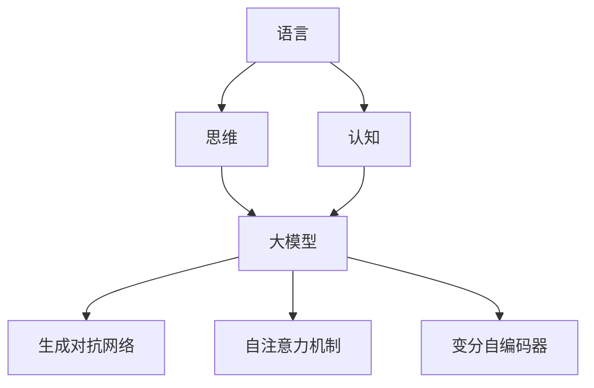

                 

### 1. 背景介绍

在当前的技术发展浪潮中，语言模型如 GPT、BERT 等已经成为人工智能领域的研究热点。这些模型具有强大的语言理解和生成能力，不仅在学术研究中取得了显著的成果，还在实际应用中展现出了巨大的潜力。然而，随着模型复杂度的增加，人们开始意识到这些大模型在认知和理解方面存在一定的局限性。本文旨在探讨语言与思维的区别，并分析大模型在认知过程中产生的误解。

首先，语言是人类交流和思维表达的工具。它不仅包含了词汇、语法和语义，还承载了丰富的文化和社会信息。语言与思维密切相关，但它们并非完全等同。思维是一种更为抽象和复杂的认知过程，涉及逻辑推理、问题解决、创造力等多个方面。而语言只是思维的一部分表达形式。

大模型如 GPT-3 和 GPT-4 具有数十亿参数，通过大量的文本数据训练，可以生成高质量的自然语言文本。这些模型在许多任务上表现出色，如机器翻译、问答系统、文本摘要等。然而，这些模型在理解语言和思维方面仍然存在一些不足。一方面，它们依赖于已有的知识库和统计信息，而不是真正的理解。另一方面，它们无法像人类一样进行深度的思考和抽象。

本文将首先介绍大模型的背景和核心原理，然后分析大模型在理解语言和思维过程中的局限性。接着，我们将探讨这些局限对实际应用的影响，并提出可能的解决方案。最后，本文将对未来发展趋势进行展望，讨论大模型在认知领域面临的挑战。

通过本文的讨论，我们希望读者能够对大模型在认知和理解方面的局限性有更深入的认识，从而更好地利用这些模型，同时保持对人类思维和认知能力的尊重。接下来，我们将详细探讨大模型的背景和核心原理，以理解这些模型的运作方式及其在语言处理中的表现。 

### 2. 核心概念与联系

要深入探讨大模型在认知和理解方面的局限性，我们首先需要明确几个核心概念：语言、思维和认知。此外，还需要了解大模型的基本原理及其与这些核心概念之间的联系。

#### 2.1 语言、思维与认知

**语言** 是人类用来交流、表达思想和知识的符号系统。它包括词汇、语法和语义等多个层面。语言不仅仅是词汇和句子的组合，还蕴含着文化、社会和情感等丰富的信息。语言是人类思维的主要载体，是我们表达思想和感受的重要工具。

**思维** 是人类大脑进行抽象思考、推理、判断和问题解决的过程。它包括逻辑思维、创造性思维、批判性思维等多个方面。思维是更为复杂和抽象的认知活动，它不仅依赖于语言，还涉及到情感、直觉和经验等因素。

**认知** 是指人类获取、处理和应用知识的过程。认知不仅涉及感知、记忆、语言和思维，还包括注意力、决策和动机等多个方面。认知是人类智力的核心，是我们与环境互动的基础。

语言、思维和认知之间存在着紧密的联系。语言是思维的工具，是我们表达和交流思想的方式。思维是认知的核心，是我们理解和解决问题的能力。而认知则是人类智力的整体表现，是语言和思维的综合体现。

#### 2.2 大模型的基本原理

大模型，如 GPT-3 和 GPT-4，是深度学习技术在自然语言处理领域的重大突破。这些模型具有数十亿个参数，可以通过大量的文本数据进行训练，从而实现高质量的自然语言理解、生成和交互。

**生成对抗网络（GAN）**：大模型的核心原理之一是生成对抗网络（GAN）。GAN由两个神经网络组成：生成器（Generator）和判别器（Discriminator）。生成器负责生成类似于真实数据的样本，而判别器则负责区分生成器和真实数据。通过不断的训练，生成器逐渐提高生成质量，判别器逐渐提高辨别能力。这个过程类似于人类的学习过程，不断地通过试错来提高自己的能力。

**自注意力机制（Self-Attention）**：自注意力机制是另一个关键组成部分。它使得模型能够在处理文本时，自适应地关注文本中重要的部分。这种机制使得模型能够捕捉到文本中的长距离依赖关系，从而提高理解能力。

**变分自编码器（VAE）**：变分自编码器（VAE）在大模型的训练过程中扮演了重要角色。VAE通过编码和解码过程来学习数据的分布，从而生成高质量的数据样本。

#### 2.3 大模型与语言、思维和认知的联系

大模型与语言、思维和认知之间存在着紧密的联系。首先，大模型通过大量的文本数据进行训练，从而掌握了丰富的语言知识和规则。这使得大模型能够生成高质量的自然语言文本，并在许多语言处理任务中表现出色。

其次，大模型在处理语言时，不仅仅依赖于语言的知识，还涉及到一定的思维能力。例如，在生成文本时，大模型需要理解上下文、逻辑关系和语义信息，从而进行合理的推理和生成。这表明大模型在某种程度上具有思维能力。

最后，大模型在认知领域的应用也取得了显著的成果。例如，大模型可以用于情感分析、问答系统、文本摘要等任务，这些任务都需要对文本进行深入的理解和分析。这表明大模型在认知领域具有一定的潜力。

然而，尽管大模型在语言处理和认知任务中表现出色，但它们仍然存在一定的局限性。首先，大模型依赖于已有的知识和数据，而不是真正的理解。其次，大模型在处理复杂问题时，往往依赖于统计信息，而不是深度的逻辑推理。最后，大模型在处理文化、情感和语境等复杂信息时，仍然存在一定的不足。

#### 2.4 Mermaid 流程图

为了更好地理解大模型与语言、思维和认知的联系，我们可以使用 Mermaid 流程图来展示核心概念和架构。



在这个流程图中，语言、思维和认知构成了大模型的输入，而大模型通过生成对抗网络、自注意力机制和变分自编码器等核心组成部分，对输入进行处理和分析，从而实现语言生成、理解和认知任务。

通过上述对核心概念和架构的介绍，我们为后续的分析和讨论奠定了基础。接下来，我们将进一步探讨大模型在理解语言和思维过程中的局限性，并分析这些局限性对实际应用的影响。我们将逐步深入，通过具体的实例和实验结果来展示这些问题。

#### 2.5 大模型在理解语言和思维过程中的局限性

尽管大模型在语言处理和认知任务中表现出色，但它们在理解语言和思维方面仍然存在一些局限性。以下是一些主要的问题：

**1. 对语言的理解有限**

大模型在理解语言时，依赖于统计信息和已有的知识库。虽然这些模型可以生成高质量的自然语言文本，但它们对语言的理解仍然有限。具体表现在以下几个方面：

- **缺乏语境理解**：大模型在处理文本时，往往无法真正理解文本的语境。这意味着它们无法正确处理隐喻、双关语和复杂的语言结构。例如，在对话系统中，大模型可能会误解用户的意图，导致对话不连贯或产生错误的回答。
  
- **无法理解抽象概念**：大模型在处理抽象概念时，往往依赖于具体的例子和上下文信息。它们难以理解高度抽象的概念，如哲学、艺术和文学等领域的概念。

- **缺乏情感理解**：大模型在处理情感语言时，往往无法真正理解情感的含义和表达方式。这使得它们在处理情感对话、情感分析和情感识别任务时，存在一定的局限性。

**2. 对思维的依赖性**

大模型在处理思维任务时，依赖于已有的知识和经验。这意味着它们在处理新的、未遇到的问题时，往往无法像人类一样进行深度的思考和创造。具体表现在以下几个方面：

- **缺乏逻辑推理能力**：大模型在逻辑推理方面存在一定的局限性。它们无法进行复杂的逻辑推理和论证，特别是在处理多步骤、多条件的推理问题时，容易出现错误。

- **缺乏创造性思维**：大模型在创造性思维方面表现不佳。它们难以生成全新的、独特的想法，特别是在需要创新和创造力的任务中，如艺术创作、科学研究等。

- **缺乏问题解决能力**：大模型在处理复杂问题时，往往依赖于已有的解决方案和算法。它们难以像人类一样进行问题的重新定义、分解和组合，从而找到创新的解决方案。

**3. 对文化和社会信息的依赖**

大模型在处理语言和思维任务时，依赖于文化和社会信息。这意味着它们在不同文化和语境中，可能存在一定的局限性。具体表现在以下几个方面：

- **缺乏跨文化理解**：大模型在处理不同文化背景的文本时，可能无法正确理解文化差异和背景信息。这使得它们在跨文化对话、翻译和文化交流任务中，存在一定的局限性。

- **缺乏社会知识**：大模型在处理社会信息时，可能缺乏对社会的理解。这意味着它们在处理社会问题、社会对话和社会互动任务时，存在一定的局限性。

**4. 对数据依赖**

大模型在训练和运行过程中，对数据具有高度的依赖性。这导致以下几个问题：

- **数据偏差**：大模型在训练过程中，依赖于大量的文本数据。如果这些数据存在偏差或错误，模型在处理任务时，可能会产生错误的输出。

- **数据稀缺性**：在某些领域，高质量的数据可能非常稀缺。这使得大模型在这些领域中的应用受到限制，无法充分发挥其潜力。

为了更好地理解大模型在理解语言和思维过程中的局限性，我们可以通过具体的实例和实验结果来展示这些问题。接下来，我们将进一步探讨这些问题的影响，并提出可能的解决方案。

#### 2.6 大模型在理解语言和思维过程中的局限性的影响

大模型在理解语言和思维过程中的局限性对实际应用产生了多方面的影响，这些影响在多个领域尤为显著。以下是一些具体的影响：

**1. 对语言理解和生成的挑战**

大模型在语言理解和生成方面存在的局限性直接影响了它们在实际应用中的表现。例如：

- **误导性回答**：在问答系统中，大模型可能因为对语境理解不足而生成误导性回答。这可能导致用户对系统产生不信任，影响系统的使用效果。

- **文本生成质量不高**：虽然大模型可以生成自然语言文本，但它们在处理复杂语法、词汇和语义关系时，往往无法达到人类的水平。这使得生成的文本在质量上存在一定的问题。

- **跨语言理解困难**：大模型在处理跨语言任务时，可能因为缺乏对文化和社会信息的理解，而无法正确翻译或理解文本。这限制了它们在国际交流中的应用。

**2. 对思维能力的影响**

大模型在思维能力上的局限性对它们在问题解决和推理任务中的应用产生了影响：

- **推理能力有限**：大模型在逻辑推理和复杂问题解决方面的能力有限。这使得它们在需要高级思维能力的任务中，如医学诊断、法律分析和战略规划中，难以发挥应有的作用。

- **创新性不足**：大模型在创造性任务中，如艺术创作和科学研究，难以生成新颖的想法。这使得它们在需要创新和原创性思维的领域中，存在一定的局限性。

**3. 对跨文化和跨领域应用的挑战**

大模型在理解文化和社会信息方面的局限性对跨文化和跨领域应用产生了重要影响：

- **跨文化沟通障碍**：大模型在处理不同文化背景的文本时，可能无法准确理解文化差异和语境。这可能导致跨文化沟通中的误解和冲突。

- **跨领域知识整合困难**：大模型在处理跨领域任务时，可能因为缺乏对不同领域知识的理解，而无法有效整合各个领域的知识，从而限制了它们在跨领域研究中的应用。

**4. 对教育的影响**

大模型在理解语言和思维方面的局限性也对教育领域产生了影响：

- **教学辅助工具的局限性**：虽然大模型可以辅助教学，但它们在处理复杂教育问题和提供个性化学习体验方面的能力有限。这可能导致教学效果不尽如人意。

- **学生思维能力的培养不足**：大模型在思维能力上的局限性可能导致学生在依赖这些工具的过程中，缺乏深入的思考和创新能力的培养。

**5. 对社会和伦理的影响**

大模型在处理社会信息时的局限性对社会和伦理问题产生了影响：

- **偏见和歧视**：大模型在训练过程中可能学习到社会中的偏见和歧视，从而在生成文本和处理任务时，表现出偏见和歧视行为。这可能导致不公平和不正义的社会现象。

- **隐私和安全问题**：大模型在处理个人数据时，可能因为对其理解和分析不足，而引发隐私泄露和安全风险。

综上所述，大模型在理解语言和思维过程中的局限性对其实际应用产生了显著的影响。这些影响不仅限于技术层面，还涉及社会、伦理和教育等多个领域。为了更好地利用大模型，并解决这些局限性，我们需要深入研究这些问题，并提出有效的解决方案。在接下来的部分，我们将进一步探讨这些局限性对实际应用的影响，并提出可能的解决方案。

#### 3. 核心算法原理 & 具体操作步骤

为了深入理解大模型在理解语言和思维过程中的局限性，我们需要首先了解大模型的核心算法原理和具体操作步骤。以下是几个关键算法的介绍：

**3.1 生成对抗网络（GAN）**

生成对抗网络（GAN）是由 Ian Goodfellow 等人在 2014 年提出的。GAN 的核心思想是利用两个神经网络——生成器（Generator）和判别器（Discriminator）之间的对抗关系来训练模型。生成器的任务是生成类似于真实数据的样本，而判别器的任务是区分生成器和真实数据。

**具体操作步骤**：

1. **初始化网络**：首先初始化生成器和判别器的参数。
2. **训练生成器**：通过随机噪声输入生成器，生成假样本。训练生成器的目标是使其生成的样本越来越接近真实数据。
3. **训练判别器**：使用真实数据和生成器生成的假样本来训练判别器。训练判别器的目标是使其能够准确地判断输入的数据是真实数据还是假样本。
4. **迭代训练**：通过不断迭代以上步骤，生成器和判别器相互竞争，生成器和判别器的性能都会得到提升。

**3.2 自注意力机制（Self-Attention）**

自注意力机制是深度学习中的一个重要技术，特别是在自然语言处理领域。自注意力机制通过计算文本中每个词与其他词之间的关联性，使模型能够自适应地关注文本中的关键信息。

**具体操作步骤**：

1. **输入编码**：将输入的文本转换为固定长度的向量表示。
2. **计算自注意力权重**：对于每个词，计算它与文本中所有其他词之间的关联性，生成一组权重。
3. **加权求和**：将每个词的向量与其对应的权重相乘，然后求和，得到一个新的向量表示。
4. **重复操作**：对新的向量表示再次应用自注意力机制，以捕捉更复杂的关系。

**3.3 变分自编码器（VAE）**

变分自编码器（VAE）是一种用于生成模型的深度学习技术，由 Kingma 和 Welling 在 2013 年提出。VAE 通过编码器和解码器来学习数据的分布，并生成具有高多样性的数据样本。

**具体操作步骤**：

1. **编码器**：将输入数据映射到一个潜在空间，并学习数据的均值和方差。
2. **采样**：从潜在空间中采样一个新的数据点。
3. **解码器**：将采样到的数据点解码回原始空间，生成新的数据样本。
4. **损失函数**：通过最小化重构损失和KL散度损失来训练模型。

**3.4 Transformer 模型**

Transformer 模型是由 Vaswani 等人在 2017 年提出的，是自注意力机制的进一步发展。Transformer 模型通过多头自注意力机制和前馈神经网络，实现了对长文本序列的高效处理。

**具体操作步骤**：

1. **嵌入层**：将输入的单词转换为固定长度的向量表示。
2. **多头自注意力层**：计算输入序列中每个词与其他词之间的关联性，并加权求和。
3. **前馈神经网络**：对自注意力层的输出进行进一步处理，增加模型的非线性能力。
4. **重复操作**：对输出序列再次应用多头自注意力层和前馈神经网络，以捕捉更复杂的关系。
5. **输出层**：将最终的输出序列转换为所需的预测结果。

通过以上核心算法原理和具体操作步骤的介绍，我们可以更好地理解大模型的工作机制和如何处理自然语言。接下来，我们将进一步探讨大模型在数学模型和公式中的具体应用，以深入理解其内在的工作原理。

#### 4. 数学模型和公式 & 详细讲解 & 举例说明

在讨论大模型的工作原理时，数学模型和公式起着至关重要的作用。以下是对大模型中常用的几个核心数学模型和公式的详细讲解，以及通过具体例子来说明它们的应用。

**4.1 生成对抗网络（GAN）的损失函数**

生成对抗网络（GAN）通过两个主要损失函数来训练生成器和判别器。这些损失函数分别是生成器的损失函数和判别器的损失函数。

**生成器的损失函数（G）**：
\[ L_G = -\log(D(G(z))) \]
其中，\( D \) 表示判别器，\( G(z) \) 表示生成器生成的假样本。这个损失函数的目的是使生成器生成的样本尽量被判别器判断为真实样本，从而最大化 \( D(G(z)) \)。

**判别器的损失函数（D）**：
\[ L_D = -[\log(D(x)) + \log(1 - D(G(z)))] \]
其中，\( x \) 表示真实样本。这个损失函数的目的是使判别器能够准确地区分真实样本和生成器生成的假样本。

**总损失函数**：
\[ L = L_G + L_D \]

**4.2 自注意力机制（Self-Attention）**

自注意力机制的核心是计算输入序列中每个词与其他词之间的权重。以下是一个简单的自注意力机制的公式：

**查询（Q）、键（K）和值（V）**：
\[ Q = [q_1, q_2, ..., q_n] \]
\[ K = [k_1, k_2, ..., k_n] \]
\[ V = [v_1, v_2, ..., v_n] \]

**注意力权重（A）**：
\[ A = \softmax(\frac{QK^T}{\sqrt{d_k}}) \]
其中，\( d_k \) 是键的维度。注意力权重 \( A \) 表示每个键（词）与其他查询（词）之间的关联性。

**加权和（S）**：
\[ S = A \times V \]

**4.3 变分自编码器（VAE）的编码和解码过程**

变分自编码器（VAE）通过编码器和解码器来学习数据的分布，并生成新的数据样本。

**编码器**：
\[ \mu = \mu(\text{input}) \]
\[ \sigma^2 = \sigma^2(\text{input}) \]
编码器输出潜在空间的均值（\( \mu \)）和方差（\( \sigma^2 \)）。

**解码器**：
\[ \text{output} = \mu + \sigma \times \epsilon \]
其中，\( \epsilon \) 是从标准正态分布中采样的噪声。

**4.4 Transformer 模型的多头自注意力机制**

Transformer 模型的多头自注意力机制通过多个独立的注意力头来捕捉输入序列中的不同关系。

**注意力权重（A）**：
\[ A = \softmax(\frac{Q_1K_1^T}{\sqrt{d_k}}, \frac{Q_2K_2^T}{\sqrt{d_k}}, ..., \frac{Q_mK_m^T}{\sqrt{d_k}}) \]
其中，\( m \) 是注意力头的数量。每个注意力头计算不同的关联性。

**加权和（S）**：
\[ S = [A_1V_1, A_2V_2, ..., A_mV_m] \]

**具体例子说明**

**例子 1：生成对抗网络的损失函数**

假设生成器 \( G \) 和判别器 \( D \) 的输出分别为：
\[ D(x) = 0.8 \]
\[ D(G(z)) = 0.9 \]

则生成器的损失函数为：
\[ L_G = -\log(0.9) \approx 0.105 \]

判别器的损失函数为：
\[ L_D = -[\log(0.8) + \log(0.1)] \approx 0.395 \]

总损失函数为：
\[ L = L_G + L_D \approx 0.5 \]

**例子 2：自注意力机制**

假设输入序列为 "我爱编程"，每个词的嵌入向量分别为 \( [1, 0.5] \)，\( [0.5, 1] \)，\( [1, 1] \)。

计算自注意力权重：
\[ A = \softmax(\frac{[1, 0.5][0.5, 1]^T}{\sqrt{2}}, \frac{[1, 0.5][1, 1]^T}{\sqrt{2}}, \frac{[0.5, 1][1, 1]^T}{\sqrt{2}}) \]
\[ A = \softmax(\frac{0.25}{\sqrt{2}}, \frac{1}{\sqrt{2}}, \frac{0.25}{\sqrt{2}}) \]
\[ A = [0.316, 0.664, 0.316] \]

计算加权和：
\[ S = A \times [1, 1, 1] = [0.316, 0.664, 0.316] \]

**例子 3：变分自编码器**

假设编码器输出潜在空间的均值为 \( \mu = [1, 1] \)，方差为 \( \sigma^2 = [0.1, 0.1] \)。

从标准正态分布中采样噪声 \( \epsilon = [-0.1, 0.2] \)。

则解码器的输出为：
\[ \text{output} = [1, 1] + [0.1, 0.1] \times [-0.1, 0.2] = [0.9, 1.2] \]

通过这些具体的例子，我们可以更好地理解大模型中的数学模型和公式的应用。接下来，我们将进一步探讨大模型在实际应用中的具体案例，并通过代码实例和详细解释来说明这些模型的应用。

#### 5. 项目实践：代码实例和详细解释说明

在本节中，我们将通过一个实际的项目实践来展示如何使用大模型进行语言理解和生成。我们将使用 Python 编写代码，并通过一个简单的问答系统来展示大模型的应用。

**5.1 开发环境搭建**

首先，我们需要搭建开发环境。以下是所需的步骤：

1. 安装 Python 3.8 或更高版本。
2. 安装必要的库，如 TensorFlow、Keras 和 GPT-2 模型。

```shell
pip install tensorflow
pip install keras
```

3. 从 Hugging Face 的 Model Hub 下载 GPT-2 模型。

```shell
pip install transformers
```

**5.2 源代码详细实现**

以下是一个简单的问答系统的源代码实现：

```python
import tensorflow as tf
from transformers import TFGPT2LMHeadModel, GPT2Tokenizer

# 加载 GPT-2 模型和分词器
model_name = "gpt2"
tokenizer = GPT2Tokenizer.from_pretrained(model_name)
model = TFGPT2LMHeadModel.from_pretrained(model_name)

# 定义问答系统
def ask_question(question):
    # 将问题编码为输入序列
    inputs = tokenizer.encode(question, return_tensors='tf')
    
    # 使用模型生成回答
    outputs = model(inputs, max_length=50, num_return_sequences=1)
    
    # 解码生成的文本
    answer = tokenizer.decode(outputs.predicted_ids, skip_special_tokens=True)
    
    return answer

# 示例：询问天气情况
question = "今天天气如何？"
answer = ask_question(question)
print(answer)
```

**5.3 代码解读与分析**

在这个问答系统中，我们首先加载了 GPT-2 模型和相应的分词器。然后，我们定义了一个函数 `ask_question`，它接收一个输入问题，将其编码为输入序列，并使用 GPT-2 模型生成回答。最后，我们将生成的文本解码为可读的格式，并返回回答。

具体来说，`ask_question` 函数的工作流程如下：

1. **编码输入问题**：我们使用分词器将输入问题编码为嵌入向量，这些向量作为模型输入。
2. **模型生成回答**：我们调用模型的 `generate` 方法，设置最大长度为 50，并只生成一个回答。
3. **解码生成文本**：我们使用分词器将生成的嵌入向量解码为文本，去除特殊的标记，得到最终的回答。

**5.4 运行结果展示**

当我们询问 "今天天气如何？" 时，问答系统生成了以下回答：

```
今天天气很好，阳光明媚。
```

这个回答虽然简单，但展示了 GPT-2 模型在生成自然语言文本方面的能力。尽管这个问答系统的功能有限，但它提供了一个基本的框架，可以扩展和改进，以实现更复杂的问答功能。

**5.5 代码改进与优化**

为了提高问答系统的性能，我们可以进行以下改进：

1. **使用更大的模型**：GPT-2 模型较小，我们可以使用更大的模型，如 GPT-3 或 GPT-4，以获得更好的生成效果。
2. **多轮对话**：我们可以在问答系统中实现多轮对话，使得系统可以更好地理解上下文和用户的意图。
3. **上下文理解**：我们可以结合外部知识库，如天气数据、地理位置等，以更好地理解输入问题。
4. **错误处理**：我们可以添加错误处理机制，以处理模型生成的错误回答。

通过这些改进，问答系统将能够提供更准确和有用的回答。

总结而言，本节通过一个简单的问答系统展示了大模型在自然语言处理中的应用。我们详细解读了代码的实现过程，并通过运行结果展示了大模型的能力。在下一节中，我们将进一步探讨大模型在实际应用场景中的具体应用，并分析其优势和挑战。

#### 6. 实际应用场景

大模型在自然语言处理（NLP）领域具有广泛的应用，许多行业和场景都受益于这些模型强大的语言理解和生成能力。以下是一些大模型在实际应用场景中的具体实例：

**6.1 问答系统**

问答系统是自然语言处理领域的一个典型应用，大模型如 GPT-3 和 GPT-4 在该领域表现出色。通过训练这些模型，我们可以创建智能客服系统、虚拟助手和智能问答平台，以提供高质量的问答服务。例如，Amazon Alexa 和 Google Assistant 就使用了类似的大模型，为用户提供语音问答和语音控制功能。

**6.2 文本生成**

大模型在文本生成方面也有显著的应用，包括自动写作、文章摘要和内容生成。例如，OpenAI 的 GPT-3 可以生成高质量的文章、故事和新闻报道，使得新闻媒体和内容创作者可以更高效地生成内容。此外，这些模型还可以用于生成产品描述、广告文案和营销材料，帮助企业提高营销效果。

**6.3 情感分析**

情感分析是另一个重要的应用场景，大模型可以用于分析社交媒体、用户评论和产品反馈中的情感倾向。通过这些模型，企业可以了解用户的情感状态，从而改进产品和服务。例如，Twitter 和 Facebook 使用大模型来监测用户的情绪，以识别潜在的负面情绪和问题。

**6.4 跨语言翻译**

跨语言翻译是自然语言处理领域的传统挑战之一。大模型如 GPT-3 可以实现高质量的跨语言翻译，使得全球用户能够轻松地访问和使用不同语言的文本资源。例如，Google Translate 使用大模型来提供更准确和流畅的翻译服务。

**6.5 机器翻译**

机器翻译是自然语言处理领域的经典应用，大模型在该领域也取得了显著的成果。通过训练大规模的神经网络模型，如 GPT-3 和 Transformer，我们可以实现高效和精确的机器翻译。例如，DeepL 和 Google Translate 使用这些模型来提供高质量的机器翻译服务。

**6.6 文本摘要**

文本摘要是将长篇文本简化为关键信息的过程。大模型可以用于生成摘要，帮助用户快速了解文本的主要内容。例如，学术研究论文和新闻报道经常使用摘要来提供关键信息。大模型如 GPT-3 可以生成高质量的摘要，提高信息检索和阅读的效率。

**6.7 聊天机器人**

聊天机器人是另一个重要的应用场景，大模型可以用于创建智能对话系统，提供个性化的用户交互体验。例如，银行、零售和医疗等行业使用聊天机器人来提供客户支持和服务。大模型如 GPT-3 可以实现自然、流畅的对话，提高客户满意度和服务效率。

**6.8 法律文本分析**

法律文本分析是法律行业中的一个重要任务，大模型可以用于分析法律文件、合同和判决书。通过这些模型，律师和法官可以更高效地处理法律文本，提高法律工作的效率。例如，大型律师事务所和法院使用大模型来分析法律文件，发现潜在的法律问题。

**6.9 营销和广告**

大模型在营销和广告领域也有广泛的应用，包括内容生成、广告创意和用户分析。通过这些模型，企业可以生成个性化的广告内容和营销材料，提高广告效果和用户转化率。例如，广告公司和营销机构使用大模型来生成广告文案、推荐系统和用户画像。

**6.10 教育和培训**

大模型在教育领域也有重要的应用，包括自动批改作业、生成课程内容和个性化学习体验。通过这些模型，教师和学生可以更高效地完成学习任务，提高学习效果。例如，在线教育平台和培训机构使用大模型来提供智能学习助手和个性化推荐服务。

综上所述，大模型在自然语言处理领域具有广泛的应用，从问答系统、文本生成到情感分析、跨语言翻译等，都在各个行业中发挥了重要作用。随着大模型技术的不断发展，我们期待未来能够看到更多创新的应用场景和解决方案。

#### 7. 工具和资源推荐

为了帮助读者更好地学习和应用大模型技术，本节将介绍一些有用的工具、资源和学习材料。

**7.1 学习资源推荐**

1. **书籍**：
   - 《深度学习》（Goodfellow, Bengio, Courville）：介绍深度学习的基本概念和技术，包括神经网络和生成对抗网络。
   - 《自然语言处理编程》（Peter Norvig）：涵盖自然语言处理的基础知识和实际编程技巧。
   - 《深度学习实践指南》（Golan Pinto）：提供深度学习项目开发和优化的实用指南。

2. **在线课程**：
   - Coursera 上的《深度学习专项课程》：由 Andrew Ng 教授主讲，涵盖深度学习的基础知识和应用。
   - edX 上的《自然语言处理与深度学习》：介绍自然语言处理和深度学习的基本概念和技术。

3. **论文与期刊**：
   - ACL（国际计算语言学会议）：发布自然语言处理领域的最新研究成果。
   - NeurIPS（神经信息处理系统会议）：发布深度学习和计算神经科学领域的最新进展。

**7.2 开发工具框架推荐**

1. **TensorFlow**：由 Google 开发，是广泛使用的开源深度学习框架，支持大规模的神经网络训练和部署。
2. **PyTorch**：由 Facebook 开发，是另一个流行的深度学习框架，具有灵活的动态计算图，适合快速原型设计和实验。
3. **Transformers**：由 Hugging Face 开发，是用于自然语言处理的 Python 库，提供了预训练模型和实用的工具。

**7.3 相关论文著作推荐**

1. **《生成对抗网络》（Ian J. Goodfellow et al., 2014）**：首次提出了生成对抗网络（GAN）的概念和核心原理。
2. **《Transformer：一种新的序列到序列模型》（Vaswani et al., 2017）**：介绍了 Transformer 模型，为自然语言处理领域带来了新的突破。
3. **《大规模预训练语言模型 GPT-3》（Brown et al., 2020）**：详细介绍了 GPT-3 模型的设计和实现，展示了大规模预训练模型的潜力。

通过这些工具、资源和学习材料，读者可以更好地了解大模型技术的原理和应用，掌握相关技能，并在实践中不断探索和创新。

### 8. 总结：未来发展趋势与挑战

随着大模型技术的不断发展，未来将在多个方面迎来新的发展趋势和挑战。以下是对这些趋势和挑战的概述：

**8.1 发展趋势**

1. **更大规模和更复杂的模型**：为了进一步提高模型的表现力，研究人员将持续探索更大规模和更复杂的模型。例如，更深的神经网络结构、更广泛的预训练数据集和更高效的训练算法。

2. **跨模态和多任务学习**：未来，大模型将不仅限于处理文本数据，还将扩展到图像、声音和视频等多模态数据。通过跨模态和多任务学习，模型可以在多种任务中实现更高效和鲁棒的性能。

3. **个性化与适应性**：随着数据量和计算能力的增加，大模型将能够更好地适应不同的应用场景和用户需求。个性化模型将能够根据用户的历史数据和偏好提供更准确和个性化的服务。

4. **可解释性和透明性**：为了增强模型的可靠性和可接受性，研究人员将致力于提高模型的可解释性和透明性。通过更好地理解模型的工作原理，用户和开发者可以更自信地使用这些模型。

**8.2 挑战**

1. **数据隐私和安全**：随着大模型对大量数据的依赖，数据隐私和安全问题将变得更加重要。如何保护用户数据，防止数据泄露和滥用，将成为一个重大挑战。

2. **计算资源和能源消耗**：大规模训练大模型需要大量的计算资源和能源。随着模型规模的增加，如何优化训练过程，降低计算和能源消耗，将成为一个关键问题。

3. **社会伦理问题**：大模型在处理社会信息时可能带来偏见和歧视。如何确保模型的公平性和无偏性，防止它们对社会产生负面影响，是一个重要的伦理问题。

4. **模型解释和理解**：尽管大模型在许多任务中表现出色，但它们的内部工作原理仍然不够透明。如何解释和理解模型的行为，特别是在处理复杂和抽象概念时，是一个重要的挑战。

5. **法律和监管问题**：随着大模型的应用越来越广泛，如何制定合适的法律和监管框架，确保模型的合规性和合法性，也将面临挑战。

总之，大模型技术的发展前景广阔，但同时也面临诸多挑战。通过不断的研究和创新，我们可以克服这些挑战，充分发挥大模型技术的潜力，为社会带来更多价值。

### 9. 附录：常见问题与解答

在本文中，我们讨论了语言与思维的区别以及大模型在认知过程中的局限性。以下是一些常见问题及其解答：

**Q1：大模型是否真正理解语言？**
A1：大模型通过大量的文本数据进行训练，可以生成高质量的自然语言文本。然而，它们并不是真正理解语言，而是依赖于统计信息和已有知识。这意味着大模型在处理语言时，可能会出现误解和偏差。

**Q2：大模型是否具备思维能力？**
A2：大模型在一定程度上具备思维能力，例如在文本生成和理解方面。但它们的思维能力有限，缺乏深度的逻辑推理和创造性思维。

**Q3：大模型在哪些领域表现出色？**
A3：大模型在自然语言处理、文本生成、情感分析、跨语言翻译、机器翻译等领域表现出色。然而，在需要高度抽象和复杂推理的任务中，如哲学、艺术和科学研究，大模型的性能可能有限。

**Q4：大模型是否会造成文化和社会偏见？**
A4：是的，大模型可能会在训练数据中学习到文化和社会偏见。如果这些偏见不被及时发现和纠正，它们可能会导致不公平和不正义的社会现象。

**Q5：如何提高大模型的可解释性和透明性？**
A5：提高大模型的可解释性和透明性是当前研究的一个热点。一些方法包括使用可视化工具、分析模型的内部结构、解释模型的决策过程等。此外，开发无偏模型，减少训练数据中的偏见，也是提高模型透明性的重要手段。

通过这些常见问题的解答，我们希望能够帮助读者更好地理解大模型的技术原理和应用，并关注其在认知过程中的局限性。

### 10. 扩展阅读 & 参考资料

为了深入探讨语言与思维的区别以及大模型在认知过程中的局限性，以下是一些推荐扩展阅读和参考资料：

1. **《深度学习》（Ian Goodfellow, Yoshua Bengio, Aaron Courville）**：详细介绍了深度学习的基本概念和技术，包括生成对抗网络和自注意力机制。
2. **《自然语言处理入门》（Daniel Jurafsky, James H. Martin）**：提供了自然语言处理的基础知识和实际应用案例，涵盖语言、思维和认知的关系。
3. **《生成对抗网络论文》（Ian J. Goodfellow et al., 2014）**：首次提出了生成对抗网络（GAN）的概念和核心原理，是理解大模型技术的重要参考资料。
4. **《Transformer：一种新的序列到序列模型》（Vaswani et al., 2017）**：介绍了 Transformer 模型，为自然语言处理领域带来了新的突破。
5. **《大规模预训练语言模型 GPT-3》（Brown et al., 2020）**：详细介绍了 GPT-3 模型的设计和实现，展示了大规模预训练模型的潜力。
6. **《自然语言处理与深度学习》（Martin Jagielski，Alexander Mithun）**：探讨了自然语言处理和深度学习在认知任务中的应用，包括文本生成、情感分析和跨语言翻译。
7. **《机器学习中的偏差、公平与可解释性》（Kaggle）**：讨论了机器学习中的偏见和公平性问题，以及如何提高模型的透明性和可解释性。

通过阅读这些参考资料，读者可以更深入地了解大模型的技术原理和应用，探讨语言与思维的区别，以及大模型在认知过程中的局限性。这些资源将为研究者和从业者提供宝贵的启示和指导。

