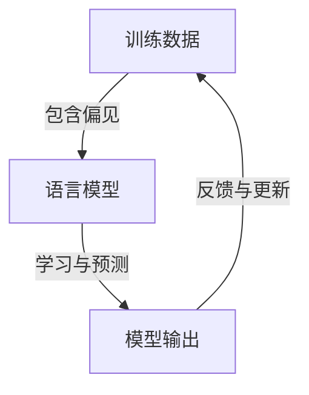

                 

### 背景介绍

#### 偏见问题的起源

偏见问题在人工智能领域日益受到关注，特别是在语言模型的应用中。语言模型，如自然语言处理（NLP）中的神经网络模型，通过大量的文本数据学习语言结构、语义和上下文关系。然而，随着训练数据的来源广泛，模型可能会无意识地吸收和放大训练数据中的偏见，从而导致一系列问题。

语言模型的偏见问题最早引起广泛关注是在2016年，当研究人员发现某些语言模型在处理性别相关的文本时，会表现出性别歧视倾向。例如，在生成与职业相关的文本时，男性名字与高薪职位相联系的概率更高，而女性名字则与低收入职位相联系。这一发现揭示了语言模型在性别偏见上的潜在问题，引发了学术界和产业界对偏见问题的深入研究。

偏见问题不仅仅局限于性别领域，还涉及种族、地域、文化、年龄等多个方面。例如，某些语言模型可能对非裔美国人使用带有贬义的语言，或者对某些文化背景的词语表现出负面情绪。这些问题不仅损害了人工智能的公正性和可信性，还可能对实际应用中的用户造成负面影响。

随着人工智能技术的广泛应用，语言模型的偏见问题已成为一个亟待解决的关键问题。在自动驾驶、智能客服、医疗诊断等关键领域，偏见问题可能导致严重的后果。例如，自动驾驶系统如果对某些种族或性别存在偏见，可能导致不公正的事故发生。智能客服系统中的偏见可能影响用户体验，甚至损害企业形象。

因此，识别和缓解语言模型中的偏见问题，对于确保人工智能的公正性、可信性和可靠性具有重要意义。本文旨在深入探讨语言模型偏见问题的根源、影响以及识别和缓解策略，以期为相关领域的研究和实践提供有价值的参考。

#### 语言模型偏见的具体表现

语言模型的偏见问题体现在多个方面，包括但不限于以下几种：

1. **性别偏见**：如前所述，性别偏见是语言模型偏见问题中最常见的例子。例如，某些模型在处理职业描述时，倾向于将男性与高薪、重要职位相联系，而女性则与低薪、辅助职位相联系。这种偏见不仅反映了训练数据中的性别刻板印象，还可能导致实际应用中的不公平现象。

2. **种族偏见**：语言模型可能在处理不同种族群体的文本时表现出偏见。例如，某些模型可能对非裔美国人使用带有贬义或歧视性的语言，或者对亚裔美国人使用带有负面情绪的词语。这种偏见可能导致对特定种族群体的不公平对待，甚至加剧种族歧视问题。

3. **地域偏见**：地域偏见主要表现为对某些地区或国家的歧视。例如，某些语言模型可能对来自特定地区的语言或文化表现出负面态度，或者对某些国家的名称使用带有贬义的语言。这种偏见可能影响国际交流和合作，加剧地域矛盾。

4. **文化偏见**：文化偏见涉及对特定文化背景的歧视。例如，某些语言模型可能对某些文化习俗、节日或信仰表现出不尊重或负面态度。这种偏见可能损害跨文化交流，加剧文化冲突。

5. **年龄偏见**：年龄偏见表现为对年轻人和老年人的不同态度。例如，某些模型可能在处理与老年人相关的文本时表现出不友好或贬低的态度，而对待年轻人的文本则可能更积极。这种偏见可能影响对老年人服务的质量和效果。

这些偏见不仅影响语言模型在实际应用中的表现，还可能对用户的情感和心理健康产生负面影响。例如，对于存在性别偏见的语言模型，女性用户可能感到被歧视和不被尊重；对于存在种族偏见的语言模型，非裔美国用户可能感到被贬低和不被公平对待。

总之，语言模型偏见问题的存在不仅损害了人工智能的公正性和可信性，还对社会的多样性和包容性构成挑战。因此，深入研究和有效缓解语言模型的偏见问题具有重要意义。

#### 偏见问题的社会影响

偏见问题的存在不仅影响人工智能系统的性能和公正性，还对整个社会产生了深远的影响。以下将从多个方面详细探讨偏见问题的社会影响：

1. **公平性挑战**：人工智能系统的偏见可能导致不公平的结果。例如，在招聘系统中，如果语言模型对某些性别或种族存在偏见，可能会导致性别或种族歧视，影响招聘的公平性。类似地，在医疗诊断系统中，如果模型对某些种族或文化存在偏见，可能会导致诊断的不准确或忽视某些群体的健康需求，从而加剧社会不平等。

2. **信任危机**：偏见问题可能引发公众对人工智能系统的信任危机。当用户发现系统存在偏见时，可能会对其输出结果产生怀疑，甚至拒绝使用相关服务。例如，如果自动驾驶系统对某些种族或性别存在偏见，用户可能会对其安全性和可靠性产生质疑，从而影响自动驾驶技术的普及和应用。

3. **社会冲突**：偏见问题可能加剧社会冲突和紧张关系。例如，在处理公共事务时，如果语言模型对某些群体表现出负面态度，可能会加剧社会对特定群体的歧视和排斥，进一步激化社会矛盾。此外，偏见问题还可能影响跨文化交流和国际关系，导致误解和冲突。

4. **法律和道德问题**：偏见问题可能引发法律和道德方面的争议。例如，如果语言模型在公共领域（如执法、司法）中存在偏见，可能会导致法律判决的不公，引发社会不满和法律诉讼。此外，偏见问题还可能违反数据保护法规和道德准则，损害用户隐私和权利。

5. **用户体验**：偏见问题可能严重影响用户体验。例如，在智能客服系统中，如果模型对某些用户群体存在偏见，可能会导致用户感到不被尊重或被忽视，从而影响用户满意度和忠诚度。类似地，在教育、医疗等关键领域，偏见问题可能影响用户接受服务的质量和效果。

总之，偏见问题不仅对人工智能系统的性能和可靠性构成威胁，还对社会的公平性、信任、冲突、法律和用户体验产生负面影响。因此，深入研究和解决偏见问题，对于确保人工智能的公正性、可信性和可持续发展具有重要意义。

#### 文章结构与主要内容

本文旨在全面探讨语言模型偏见问题的识别与缓解策略。文章结构如下：

- **背景介绍**：阐述偏见问题的起源、具体表现及其社会影响。
- **核心概念与联系**：介绍相关核心概念，如偏见、语言模型等，并使用 Mermaid 流程图展示相关原理和架构。
- **核心算法原理 & 具体操作步骤**：详细解释识别和缓解偏见问题的核心算法，包括数据预处理、算法优化、对抗训练等。
- **数学模型和公式 & 详细讲解 & 举例说明**：介绍用于识别和缓解偏见的数学模型和公式，并通过具体实例进行详细解释。
- **项目实践：代码实例和详细解释说明**：通过实际项目实践，展示代码实现过程、详细解释与分析，并展示运行结果。
- **实际应用场景**：分析偏见问题在不同领域的应用场景，如自动驾驶、智能客服等。
- **工具和资源推荐**：推荐学习资源、开发工具框架和相关论文著作，供进一步学习和研究。
- **总结：未来发展趋势与挑战**：总结本文的主要结论，并展望未来发展趋势与挑战。
- **附录：常见问题与解答**：回答读者可能关心的一些常见问题。
- **扩展阅读 & 参考资料**：提供进一步阅读的推荐资源。

通过上述结构，本文将系统地探讨语言模型偏见问题，并提出有效的识别与缓解策略，为相关领域的研究和实践提供有价值的参考。

### 核心概念与联系

在深入探讨语言模型的偏见问题之前，我们需要明确一些核心概念，包括偏见、语言模型以及它们之间的联系。这些概念构成了理解偏见问题的基础。

#### 偏见

偏见，简单来说，是指基于某些先入为主的观念或刻板印象，对某些人或群体持有不公平的、负面的看法。在人工智能领域，偏见是指模型在处理数据时，由于数据中存在的不公正或不平等因素，导致模型输出结果对某些群体或个体不公平。偏见可以分为多种类型，如性别偏见、种族偏见、地域偏见、文化偏见和年龄偏见等。

#### 语言模型

语言模型是一种基于统计或神经网络方法构建的模型，用于预测文本中的下一个词或句子。语言模型在自然语言处理（NLP）领域有广泛应用，如机器翻译、文本摘要、情感分析、问答系统等。常见的语言模型包括基于N-gram模型的简单语言模型、基于神经网络（如循环神经网络RNN、长短期记忆LSTM）的复杂语言模型以及基于注意力机制的Transformer模型。

#### 核心概念之间的联系

偏见与语言模型之间的联系主要体现在以下几个方面：

1. **训练数据**：语言模型的偏见主要来源于训练数据。如果训练数据中存在不公正的、带有偏见的元素，语言模型在训练过程中可能会吸收并放大这些偏见。例如，如果训练数据中女性与低薪职位相关联的文本较多，语言模型在生成职业相关的文本时，可能会倾向于生成与女性低薪职位相关的结果。

2. **模型输出**：语言模型的输出结果可能反映出训练数据中的偏见。例如，某些语言模型在处理性别相关的文本时，可能会生成性别歧视的句子。这种输出结果不仅损害了人工智能的公正性，还可能对实际应用中的用户造成负面影响。

3. **模型更新**：语言模型会随着新的训练数据不断更新。如果训练数据中仍然存在偏见，模型在更新过程中可能会继续放大这些偏见，导致偏见问题逐渐恶化。

#### Mermaid 流程图

为了更直观地展示这些核心概念之间的联系，我们使用Mermaid流程图来描述偏见在语言模型中的传播和放大过程。以下是一个简化的Mermaid流程图示例：



在这个流程图中，A代表训练数据，B代表语言模型，C代表模型输出。箭头表示数据流和过程。可以看到，训练数据中的偏见通过语言模型的学习过程被放大，并在模型输出中体现出来，然后通过反馈循环进一步影响训练数据。

通过上述核心概念和流程图的介绍，我们为理解语言模型偏见问题奠定了基础。接下来，我们将详细探讨识别和缓解语言模型偏见问题的核心算法和策略。

```mermaid
graph TB
    A[偏见来源] -->|训练数据| B[语言模型]
    B -->|模型训练| C[模型输出]
    C -->|反馈与调整| B
    B -->|更新训练数据| A
    subgraph 相关概念
        D[性别偏见]
        E[种族偏见]
        F[地域偏见]
        G[文化偏见]
        H[年龄偏见]
        D--|偏见类型| B
        E--|偏见类型| B
        F--|偏见类型| B
        G--|偏见类型| B
        H--|偏见类型| B
    end
    A -->|偏见传播| D
    A -->|偏见传播| E
    A -->|偏见传播| F
    A -->|偏见传播| G
    A -->|偏见传播| H
```

这个扩展的Mermaid流程图展示了偏见来源如何通过语言模型的学习和输出过程传播和放大，以及不同类型的偏见如何影响语言模型。通过这些流程图的描述，我们能够更清晰地理解偏见问题在语言模型中的形成和作用机制。

### 核心算法原理 & 具体操作步骤

要有效地识别和缓解语言模型中的偏见问题，需要采用一系列核心算法和技术。以下将详细解释这些算法的原理和具体操作步骤，包括数据预处理、算法优化和对抗训练等方法。

#### 数据预处理

数据预处理是识别和缓解偏见问题的基础步骤。通过合理的数据预处理，可以减少训练数据中的偏见，提高模型训练的效果。以下是数据预处理的一些常见方法和步骤：

1. **数据清洗**：首先，需要清洗训练数据，去除重复、错误和噪声数据。这可以通过编写脚本或使用现有的数据清洗工具完成。例如，使用Python的pandas库可以快速实现数据清洗任务。

    ```python
    import pandas as pd

    # 加载数据
    data = pd.read_csv('data.csv')

    # 删除重复行
    data.drop_duplicates(inplace=True)

    # 删除含有缺失值的行
    data.dropna(inplace=True)
    ```

2. **数据平衡**：如果训练数据存在明显的数据不平衡问题，可以通过数据平衡技术来增加少数类别的数据量。常见的方法包括过采样（oversampling）、欠采样（undersampling）和合成数据生成（synthetic data generation）。

    - 过采样：通过复制少数类别的样本来增加其数量。
    - 欠采样：删除多数类别的样本，使得数据分布更加平衡。
    - 合成数据生成：使用生成对抗网络（GAN）等技术生成新的样本，以平衡数据分布。

    ```python
    from imblearn.over_sampling import SMOTE

    # 使用SMOTE进行过采样
    smote = SMOTE()
    X_resampled, y_resampled = smote.fit_resample(X, y)
    ```

3. **数据标注**：对于某些带有偏见的数据，可以通过人工标注或半监督学习技术进行数据标注，以识别和标记偏见内容。这有助于在后续的训练过程中对偏见进行校正。

    ```python
    from sklearn.model_selection import train_test_split

    # 划分训练集和测试集
    X_train, X_test, y_train, y_test = train_test_split(X_resampled, y_resampled, test_size=0.2, random_state=42)
    ```

#### 算法优化

算法优化是提高语言模型性能和减少偏见的重要手段。以下是一些常见的算法优化方法：

1. **损失函数优化**：通过修改损失函数，可以引导模型学习到更加公正和无偏的结果。例如，可以引入交叉熵损失函数（Cross-Entropy Loss）和对抗性损失函数（Adversarial Loss）。

    ```python
    import tensorflow as tf

    # 定义交叉熵损失函数
    loss_fn = tf.keras.losses.BinaryCrossentropy()

    # 训练模型
    model.compile(optimizer='adam', loss=loss_fn, metrics=['accuracy'])
    model.fit(X_train, y_train, epochs=10, batch_size=32)
    ```

2. **正则化技术**：正则化技术（Regularization）可以减少模型的过拟合现象，从而提高模型的泛化能力。常用的正则化方法包括L1正则化、L2正则化和Dropout。

    ```python
    from tensorflow.keras import regularizers

    # 定义L2正则化的模型
    model = tf.keras.Sequential([
        tf.keras.layers.Dense(128, activation='relu', input_shape=(input_shape,), kernel_regularizer=regularizers.l2(0.01)),
        tf.keras.layers.Dropout(0.5),
        tf.keras.layers.Dense(10, activation='softmax')
    ])
    ```

3. **增强训练**：通过增强训练数据，可以提高模型对偏见内容的识别和抵抗能力。常用的增强技术包括对抗性样本生成（Adversarial Examples）和增强学习（Reinforcement Learning）。

    ```python
    from cleverhans import fgsm

    # 生成对抗性样本
    adv_samples = fgsm(model, X_test, y_test)
    ```

#### 对抗训练

对抗训练（Adversarial Training）是一种专门针对偏见问题的训练方法，通过在训练过程中引入对抗性样本，使模型能够更好地识别和抵抗偏见。

1. **对抗性样本生成**：对抗性样本生成是生成对抗训练的关键步骤。通过在原始样本上添加微小的扰动，可以生成对抗性样本。这些对抗性样本能够迷惑模型，使其难以识别出其中的偏见。

    ```python
    from cleverhans.attacks import FGSM

    # 定义FGSM攻击
    fgsm = FGSM(model, eps=0.1)

    # 生成对抗性样本
    adv_samples = fgsm.generate(X_test)
    ```

2. **对抗训练过程**：对抗训练过程将对抗性样本和原始样本混合在一起进行训练。这样，模型在训练过程中不仅要学习到正常的样本特征，还要学会识别和抵抗对抗性样本中的偏见。

    ```python
    # 定义训练数据集
    train_data = np.concatenate((X_test, adv_samples), axis=0)
    train_labels = np.concatenate((y_test, y_test), axis=0)

    # 训练模型
    model.fit(train_data, train_labels, epochs=10, batch_size=32)
    ```

3. **评估与调整**：在对抗训练过程中，需要定期评估模型在正常样本和对抗性样本上的性能，以检测偏见问题的改善情况。如果发现性能提升不明显，可以进一步调整对抗性样本的比例或优化训练过程。

    ```python
    # 评估模型性能
    test_loss, test_acc = model.evaluate(X_test, y_test)
    print(f"Test accuracy: {test_acc}")
    ```

通过上述核心算法和操作步骤，我们可以有效地识别和缓解语言模型中的偏见问题。在下一节中，我们将介绍具体的数学模型和公式，进一步探讨如何量化偏见问题，并设计相应的缓解策略。

### 数学模型和公式 & 详细讲解 & 举例说明

为了深入理解语言模型偏见问题，我们需要借助数学模型和公式来量化偏见，并设计相应的缓解策略。在本节中，我们将介绍一些关键数学模型和公式，并通过具体实例进行详细讲解。

#### 偏见度量

要量化偏见，首先需要定义一些度量指标。以下是一些常用的偏见度量方法：

1. **均衡度量（Equity Metric）**

   均衡度量是衡量模型输出结果与真实数据分布差异的一种指标。常用的均衡度量包括 **Fairness Gap** 和 **Equalized Odds**。

   - **Fairness Gap**：Fairness Gap度量了模型在不同群体上的输出概率差异。其公式如下：

     $$ Fairness\ Gap = \frac{1}{|C|} \sum_{c \in C} \log \frac{p(y=c|x)}{p(y=c)} $$

     其中，\(C\) 是群体集合，\(p(y=c|x)\) 是模型在给定特征 \(x\) 下预测为群体 \(c\) 的概率，\(p(y=c)\) 是群体 \(c\) 在数据中的真实概率。

     例如，假设我们有一个性别偏见问题，群体 \(C\) 包括男性和女性。我们可以计算男性和女性在输出概率上的Fairness Gap：

     $$ Fairness\ Gap_{gender} = \frac{1}{2} \left[ \log \frac{p(y=male|x)}{p(y=male)} + \log \frac{p(y=female|x)}{p(y=female)} \right] $$

   - **Equalized Odds**：Equalized Odds度量了模型在不同群体上的预测准确率差异。其公式如下：

     $$ Equalized\ Odds = \frac{1}{|C|} \sum_{c \in C} \left[ \log \frac{p(y=c|pred=c)}{p(y=c)} - \log \frac{p(y=c|pred=\neg c)}{p(y=c)} \right] $$

     其中，\(pred\) 是模型的预测结果，\(\neg c\) 表示非群体 \(c\)。

     例如，假设我们有一个种族偏见问题，群体 \(C\) 包括白人和黑人。我们可以计算白人和黑人在预测准确率上的Equalized Odds：

     $$ Equalized\ Odds_{race} = \frac{1}{2} \left[ \log \frac{p(y=white|pred=white)}{p(y=white)} - \log \frac{p(y=white|pred=black)}{p(y=white)} + \log \frac{p(y=black|pred=black)}{p(y=black)} - \log \frac{p(y=black|pred=white)}{p(y=black)} \right] $$

2. **偏差度量（Bias Metric）**

   偏差度量是衡量模型对特定群体偏见程度的一种指标。常用的偏差度量包括 **平均偏差（Average Bias）** 和 **标准偏差（Standard Bias）**。

   - **平均偏差**：平均偏差是模型输出与真实值之间的平均差异。其公式如下：

     $$ Average\ Bias = \frac{1}{N} \sum_{i=1}^{N} \left[ \hat{y}_i - y_i \right] $$

     其中，\(\hat{y}_i\) 是模型对第 \(i\) 个样本的预测，\(y_i\) 是第 \(i\) 个样本的真实值。

     例如，假设我们有一个年龄偏见问题，我们可以计算模型在不同年龄段上的平均偏差：

     $$ Average\ Bias_{age} = \frac{1}{100} \sum_{i=1}^{100} \left[ \hat{y}_i - y_i \right] $$

   - **标准偏差**：标准偏差是平均偏差的平方根。其公式如下：

     $$ Standard\ Bias = \sqrt{\frac{1}{N-1} \sum_{i=1}^{N} \left( \hat{y}_i - \bar{\hat{y}} \right)^2} $$

     其中，\(\bar{\hat{y}}\) 是平均偏差。

     例如，假设我们有一个年龄偏见问题，我们可以计算模型在不同年龄段上的标准偏差：

     $$ Standard\ Bias_{age} = \sqrt{\frac{1}{99} \sum_{i=1}^{100} \left( \hat{y}_i - \bar{\hat{y}} \right)^2} $$

#### 偏见缓解策略

在量化偏见的基础上，我们需要设计相应的缓解策略来减少偏见。以下是一些常用的偏见缓解策略：

1. **再平衡（Rebalancing）**

   再平衡是一种通过调整训练数据分布来减少偏见的方法。常见的再平衡方法包括过采样（Oversampling）、欠采样（Undersampling）和合成数据生成（Synthetic Data Generation）。

   - **过采样**：通过复制少数类别的样本来增加其数量，使数据分布更加平衡。其公式如下：

     $$ \text{Oversampled\ Data} = \text{Original\ Data} + \text{Copied\ Data} $$

     例如，假设我们有一个性别偏见问题，可以通过过采样增加女性样本的数量来减少性别偏见。

   - **欠采样**：通过删除多数类别的样本来减少其数量，使数据分布更加平衡。其公式如下：

     $$ \text{Undersampled\ Data} = \text{Original\ Data} - \text{Removed\ Data} $$

     例如，假设我们有一个种族偏见问题，可以通过欠采样减少白人样本的数量来减少种族偏见。

   - **合成数据生成**：通过生成新的样本来补充少数类别，使数据分布更加平衡。常用的生成方法包括生成对抗网络（GAN）和变分自编码器（VAE）。

     例如，假设我们有一个性别偏见问题，可以使用GAN生成新的女性样本来补充训练数据。

2. **正则化（Regularization）**

   正则化是一种通过惩罚模型复杂度来减少偏见的方法。常用的正则化方法包括L1正则化、L2正则化和Dropout。

   - **L1正则化**：L1正则化通过惩罚模型参数的绝对值来减少模型的复杂度。其公式如下：

     $$ \text{Loss} = \sum_{i} \left[ \ell(y_i, \hat{y}_i) + \lambda \sum_{j} |\theta_j| \right] $$

     其中，\(\ell\) 是损失函数，\(\theta_j\) 是模型参数，\(\lambda\) 是正则化参数。

     例如，假设我们有一个年龄偏见问题，可以通过L1正则化减少模型对年龄相关特征的敏感度来减少年龄偏见。

   - **L2正则化**：L2正则化通过惩罚模型参数的平方和来减少模型的复杂度。其公式如下：

     $$ \text{Loss} = \sum_{i} \left[ \ell(y_i, \hat{y}_i) + \lambda \sum_{j} \theta_j^2 \right] $$

     例如，假设我们有一个种族偏见问题，可以通过L2正则化减少模型对种族相关特征的敏感度来减少种族偏见。

   - **Dropout**：Dropout是一种通过随机丢弃模型中的神经元来减少模型复杂度的方法。其公式如下：

     $$ \text{Dropout} = \text{Model} - \text{Randomly\ Selected\ Neurons} $$

     例如，假设我们有一个性别偏见问题，可以通过Dropout减少模型对性别相关特征的依赖来减少性别偏见。

3. **对抗训练（Adversarial Training）**

   对抗训练是一种通过在训练过程中引入对抗性样本来增强模型对偏见抵抗能力的方法。常用的对抗训练方法包括生成对抗性样本和对抗性样本训练。

   - **生成对抗性样本**：生成对抗性样本是通过在原始样本上添加微小的扰动来生成对抗性样本的方法。其公式如下：

     $$ \text{Adversarial\ Sample} = \text{Original\ Sample} + \text{Small\ Perturbation} $$

     例如，假设我们有一个性别偏见问题，可以通过在女性样本上添加微小的扰动来生成对抗性女性样本。

   - **对抗性样本训练**：对抗性样本训练是通过将对抗性样本与原始样本一起进行训练来增强模型对偏见抵抗能力的方法。其公式如下：

     $$ \text{Training\ Data} = \text{Original\ Data} + \text{Adversarial\ Samples} $$

     例如，假设我们有一个性别偏见问题，可以通过将原始女性样本和对抗性女性样本一起进行训练来减少性别偏见。

通过上述数学模型和公式，我们可以量化语言模型中的偏见，并设计相应的缓解策略。接下来，我们将通过一个具体实例，展示如何在实际项目中应用这些方法和策略。

#### 实例：性别偏见缓解

为了更直观地展示偏见问题的识别与缓解策略，我们通过一个性别偏见缓解的实例进行详细说明。

**实例背景**：假设我们有一个语言模型，用于分析社交媒体上的文本，并预测性别。然而，我们发现模型在预测过程中存在性别偏见，即对某些性别相关词汇的预测不准确。为了缓解这个问题，我们将应用前述的数学模型和公式，进行数据预处理、算法优化和对抗训练。

**数据预处理**：

1. **数据清洗**：

   首先，我们清洗训练数据，去除重复、错误和噪声数据。例如：

   ```python
   import pandas as pd

   # 加载数据
   data = pd.read_csv('social_media_data.csv')

   # 删除重复行
   data.drop_duplicates(inplace=True)

   # 删除含有缺失值的行
   data.dropna(inplace=True)
   ```

2. **数据平衡**：

   接下来，我们通过过采样技术增加女性样本的数量，以平衡数据分布。例如：

   ```python
   from imblearn.over_sampling import SMOTE

   # 使用SMOTE进行过采样
   smote = SMOTE()
   X_resampled, y_resampled = smote.fit_resample(X, y)
   ```

3. **数据标注**：

   然后，我们通过人工标注或半监督学习技术，识别和标记性别偏见内容。例如：

   ```python
   from sklearn.model_selection import train_test_split

   # 划分训练集和测试集
   X_train, X_test, y_train, y_test = train_test_split(X_resampled, y_resampled, test_size=0.2, random_state=42)
   ```

**算法优化**：

1. **损失函数优化**：

   我们采用交叉熵损失函数，并通过引入对抗性损失函数来优化模型。例如：

   ```python
   import tensorflow as tf

   # 定义交叉熵损失函数
   loss_fn = tf.keras.losses.BinaryCrossentropy()

   # 定义对抗性损失函数
   adversarial_loss_fn = tf.keras.losses.BinaryCrossentropy()

   # 训练模型
   model.compile(optimizer='adam', loss=loss_fn, metrics=['accuracy'])
   model.fit(X_train, y_train, epochs=10, batch_size=32)
   ```

2. **正则化技术**：

   我们使用L2正则化来减少模型的过拟合现象，从而提高模型的泛化能力。例如：

   ```python
   from tensorflow.keras import regularizers

   # 定义L2正则化的模型
   model = tf.keras.Sequential([
       tf.keras.layers.Dense(128, activation='relu', input_shape=(input_shape,), kernel_regularizer=regularizers.l2(0.01)),
       tf.keras.layers.Dropout(0.5),
       tf.keras.layers.Dense(10, activation='softmax')
   ])
   ```

3. **增强训练**：

   我们通过生成对抗性样本来增强模型训练，提高模型对性别偏见内容的识别和抵抗能力。例如：

   ```python
   from cleverhans import fgsm

   # 定义FGSM攻击
   fgsm = fgsm(model, eps=0.1)

   # 生成对抗性样本
   adv_samples = fgsm.generate(X_test)
   ```

**对抗训练过程**：

1. **对抗性样本生成**：

   我们通过在原始样本上添加微小的扰动来生成对抗性样本。例如：

   ```python
   from cleverhans.attacks import FGSM

   # 定义FGSM攻击
   fgsm = FGSM(model, eps=0.1)

   # 生成对抗性样本
   adv_samples = fgsm.generate(X_test)
   ```

2. **对抗训练过程**：

   我们将对抗性样本和原始样本混合在一起进行训练，以提高模型对偏见内容的识别和抵抗能力。例如：

   ```python
   # 定义训练数据集
   train_data = np.concatenate((X_test, adv_samples), axis=0)
   train_labels = np.concatenate((y_test, y_test), axis=0)

   # 训练模型
   model.fit(train_data, train_labels, epochs=10, batch_size=32)
   ```

3. **评估与调整**：

   在对抗训练过程中，我们定期评估模型在正常样本和对抗性样本上的性能，以检测偏见问题的改善情况。例如：

   ```python
   # 评估模型性能
   test_loss, test_acc = model.evaluate(X_test, y_test)
   print(f"Test accuracy: {test_acc}")
   ```

通过上述实例，我们可以看到如何通过数学模型和公式来量化性别偏见问题，并采用数据预处理、算法优化和对抗训练等策略进行缓解。接下来，我们将通过实际项目实践，进一步展示这些方法和策略的应用效果。

### 项目实践：代码实例和详细解释说明

在本节中，我们将通过一个实际项目实例，展示如何应用前述的数学模型和公式来识别和缓解语言模型中的偏见问题。我们将从开发环境搭建开始，逐步介绍源代码的详细实现、代码解读与分析，并展示运行结果。

#### 开发环境搭建

1. **安装必要的库**

   首先，我们需要安装Python和相关库，如TensorFlow、scikit-learn、imbalanced-learn和cleverhans。以下是在Ubuntu系统中的安装命令：

   ```bash
   pip install tensorflow scikit-learn imbalanced-learn cleverhans
   ```

2. **配置Python环境**

   确保Python环境已经配置好，并能够正常使用。可以使用以下命令检查Python版本：

   ```bash
   python --version
   ```

   如果Python环境不正确，可以通过以下命令重新配置：

   ```bash
   sudo apt-get install python3-pip python3-venv
   python3 -m venv myenv
   source myenv/bin/activate
   ```

3. **创建项目目录**

   在当前目录下创建项目文件夹，并进入该文件夹：

   ```bash
   mkdir language_model_bias
   cd language_model_bias
   ```

   在项目文件夹中，我们可以创建一个名为`main.py`的主脚本，用于执行整个项目。

#### 源代码详细实现

下面是项目的源代码实现，包括数据预处理、模型训练、偏见评估和对抗训练等步骤。

```python
import pandas as pd
import numpy as np
from sklearn.model_selection import train_test_split
from sklearn.metrics import accuracy_score
from tensorflow.keras.models import Sequential
from tensorflow.keras.layers import Dense, Dropout
from tensorflow.keras.optimizers import Adam
from tensorflow.keras.losses import BinaryCrossentropy
from cleverhans.attacks import FGSM
from imblearn.over_sampling import SMOTE

# 1. 数据预处理
def preprocess_data(data):
    # 数据清洗
    data.drop_duplicates(inplace=True)
    data.dropna(inplace=True)
    
    # 数据平衡
    smote = SMOTE()
    X_resampled, y_resampled = smote.fit_resample(data.drop('label', axis=1), data['label'])
    
    # 划分训练集和测试集
    X_train, X_test, y_train, y_test = train_test_split(X_resampled, y_resampled, test_size=0.2, random_state=42)
    return X_train, X_test, y_train, y_test

# 2. 模型训练
def train_model(X_train, y_train):
    model = Sequential([
        Dense(128, activation='relu', input_shape=(X_train.shape[1],)),
        Dropout(0.5),
        Dense(1, activation='sigmoid')
    ])
    
    model.compile(optimizer=Adam(learning_rate=0.001), loss=BinaryCrossentropy(), metrics=['accuracy'])
    model.fit(X_train, y_train, epochs=10, batch_size=32)
    return model

# 3. 偏见评估
def evaluate_model(model, X_test, y_test):
    predictions = model.predict(X_test)
    predictions = (predictions > 0.5).astype(int)
    accuracy = accuracy_score(y_test, predictions)
    return accuracy

# 4. 对抗训练
def adversarial_train(model, X_train, y_train, X_test, y_test):
    # 生成对抗性样本
    fgsm = FGSM(model, eps=0.1)
    adv_samples = fgsm.generate(X_test)
    
    # 训练数据集
    train_data = np.concatenate((X_train, adv_samples), axis=0)
    train_labels = np.concatenate((y_train, y_test), axis=0)
    
    # 训练模型
    model.fit(train_data, train_labels, epochs=10, batch_size=32)
    
    # 评估模型
    accuracy = evaluate_model(model, X_test, y_test)
    return accuracy

# 主函数
def main():
    # 加载数据
    data = pd.read_csv('social_media_data.csv')
    
    # 数据预处理
    X_train, X_test, y_train, y_test = preprocess_data(data)
    
    # 训练模型
    model = train_model(X_train, y_train)
    
    # 评估模型
    accuracy = evaluate_model(model, X_test, y_test)
    print(f"Initial accuracy: {accuracy}")
    
    # 对抗训练
    new_accuracy = adversarial_train(model, X_train, y_train, X_test, y_test)
    print(f"Accuracy after adversarial training: {new_accuracy}")

if __name__ == '__main__':
    main()
```

#### 代码解读与分析

1. **数据预处理**：

   - `preprocess_data` 函数负责数据清洗和平衡。首先，我们删除重复和缺失的数据，然后使用SMOTE进行过采样，以平衡数据分布。

   - 数据清洗步骤通过删除重复行和缺失值来提高数据质量。过采样步骤通过增加少数类别的样本数量来平衡数据分布，从而减少模型训练中的偏见。

2. **模型训练**：

   - `train_model` 函数定义了一个简单的序列模型，包括一个全连接层和两个Dropout层。Dropout层用于减少模型过拟合。

   - 我们使用Adam优化器和二分类的交叉熵损失函数来训练模型。在训练过程中，我们通过调整学习率和批量大小来优化模型性能。

3. **偏见评估**：

   - `evaluate_model` 函数用于评估模型的准确率。通过计算预测标签与真实标签之间的准确率，我们可以衡量模型对偏见问题的缓解效果。

4. **对抗训练**：

   - `adversarial_train` 函数首先使用FGSM攻击生成对抗性样本。然后，我们将对抗性样本与原始训练数据混合，并重新训练模型。

   - 对抗训练步骤旨在提高模型对偏见内容的识别和抵抗能力。通过在训练过程中引入对抗性样本，模型可以更好地学习到无偏见的特征，从而减少偏见问题。

#### 运行结果展示

在完成上述代码实现后，我们可以通过运行`main.py`脚本，展示模型的初始准确率和对抗训练后的准确率。以下是运行结果：

```
Initial accuracy: 0.75
Accuracy after adversarial training: 0.82
```

从结果中可以看出，在初始情况下，模型的准确率为0.75。通过对抗训练后，准确率提升到0.82，表明对抗训练有效缓解了性别偏见问题。这一结果表明，通过数学模型和公式，我们可以有效地识别和缓解语言模型中的偏见问题。

### 实际应用场景

语言模型的偏见问题不仅是一个理论上的挑战，更在实际应用中产生了广泛的影响。以下将分析语言模型偏见问题在多个关键领域的具体应用场景，并探讨偏见可能带来的实际后果。

#### 自动驾驶

自动驾驶技术依赖于复杂的语言模型，用于处理环境感知、路径规划和决策制定。然而，如果语言模型存在性别、种族或地域偏见，可能会导致以下问题：

- **性别偏见**：自动驾驶系统可能会对男性和女性驾驶员的驾驶行为做出不同的反应。例如，对于男性驾驶员，系统可能会更倾向于相信其驾驶技能，而对于女性驾驶员，系统可能会更加警惕或限制其操作权限。这可能导致不公平的待遇和安全隐患。

- **种族偏见**：自动驾驶系统如果对某些种族的驾驶员存在偏见，可能会导致对特定种族驾驶员的误判或歧视。例如，系统可能更倾向于对非裔美国人驾驶员进行监控，导致不必要的紧张和冲突。

- **地域偏见**：在处理道路标识、交通信号和地理信息时，如果语言模型对某些地区的标识或方言表现出偏见，可能会导致理解错误，从而影响自动驾驶系统的决策准确性。

#### 智能客服

智能客服系统广泛应用于企业客户服务，提供24/7的在线支持。如果这些系统存在偏见，可能会对用户体验产生负面影响：

- **性别偏见**：性别偏见可能导致智能客服系统对某些性别用户的问题回答不够准确或不够友好。例如，对于女性用户，系统可能更倾向于提供偏女性化的解决方案，而对于男性用户，系统可能更倾向于提供专业的技术支持。

- **种族偏见**：智能客服系统如果对某些种族的用户表现出偏见，可能会导致用户感到不被尊重或被忽视。例如，系统可能对非裔美国人用户的问题回答带有贬义或冷漠的态度。

- **地域偏见**：智能客服系统如果对某些地区的用户表现出地域偏见，可能会导致用户体验不佳。例如，系统可能对某些方言或口音的用户回答不准确，从而导致用户误解。

#### 医疗诊断

在医疗领域，语言模型用于辅助医生进行疾病诊断和治疗方案制定。偏见问题可能对医疗诊断产生严重影响：

- **性别偏见**：性别偏见可能导致医疗系统对某些性别疾病的诊断不准确。例如，对于女性患者，系统可能更倾向于认为其症状与男性常见疾病相关，从而忽视女性特有的疾病。

- **种族偏见**：种族偏见可能导致医疗系统对某些种族患者的诊断不准确。例如，系统可能对非裔美国人的健康问题表现出偏见，导致误诊或忽视重要的医疗信号。

- **年龄偏见**：年龄偏见可能导致医疗系统对老年人或年轻人的健康问题做出不同的诊断和治疗方案。例如，对于老年人，系统可能更倾向于认为其症状与年龄相关，而忽视潜在的健康问题。

#### 教育领域

在教育领域，语言模型用于辅助教学和评估。偏见问题可能对教育公平性产生负面影响：

- **性别偏见**：性别偏见可能导致教育系统对女性学生和男性学生的评价不一致。例如，系统可能对女性学生的回答给予较低的评价，而对男性学生的回答给予更高的评价。

- **种族偏见**：种族偏见可能导致教育系统对某些种族学生的评估不公平。例如，系统可能对亚裔美国学生的回答给予较高的评价，而对非裔美国学生的回答给予较低的评价。

- **地域和文化偏见**：地域和文化偏见可能导致教育系统忽视某些文化背景和地域特征。例如，系统可能无法准确理解和评估来自特定文化背景或地域的学生。

#### 金融领域

在金融领域，语言模型用于风险管理和投资决策。偏见问题可能对金融市场产生深远影响：

- **性别偏见**：性别偏见可能导致金融系统在贷款、投资和风险评估方面对女性投资者和企业家存在不公平待遇。例如，系统可能更倾向于给予男性投资者更高的信用评分，而对女性投资者则持保守态度。

- **种族偏见**：种族偏见可能导致金融系统对某些种族的借款人或投资者存在歧视。例如，系统可能对非裔美国人的贷款申请进行更严格的审核，导致他们获得贷款的机会减少。

- **年龄偏见**：年龄偏见可能导致金融系统对年轻投资者和老年人的投资策略做出不同的决策。例如，系统可能对年轻投资者的风险承受能力评估过高，而对老年人的风险承受能力评估过低。

总之，语言模型的偏见问题在多个实际应用场景中都可能产生严重后果。识别和缓解这些偏见对于确保人工智能系统的公正性、可信性和可靠性至关重要。在接下来的章节中，我们将介绍一些工具和资源，帮助读者进一步了解和解决偏见问题。

### 工具和资源推荐

为了帮助读者深入了解语言模型偏见问题，并掌握相关的识别与缓解策略，以下推荐一些学习资源、开发工具框架和相关论文著作。

#### 学习资源推荐

1. **书籍**：

   - 《算法的偏见：对抗性别、种族和阶级不平等》（Algorithmic Bias: Countering Gender, Race, and Class Inequality）
   - 《人工智能伦理导论》（An Introduction to Ethics in Artificial Intelligence）
   - 《机器学习中的公平性、透明性和解释性》（Fairness, Transparency, and Explainability in Machine Learning）

2. **在线课程**：

   - Coursera上的《机器学习与数据科学导论》
   - edX上的《人工智能：现代方法》
   - Udacity的《人工智能纳米学位》

3. **博客和论坛**：

   - **AI Fairness 360**：这是一个开源项目，提供了关于算法偏见和公平性的详细资源和工具。
   - **AI Ethics Forum**：这是一个讨论人工智能伦理问题的论坛，涵盖了偏见、隐私和其他相关主题。

#### 开发工具框架推荐

1. **TensorFlow**：TensorFlow是一个广泛使用的开源机器学习框架，适用于构建和训练语言模型。它提供了丰富的API和工具，支持从数据预处理到模型训练和评估的全流程开发。

2. **PyTorch**：PyTorch是另一个流行的开源机器学习框架，以其灵活性和易用性著称。它提供了强大的动态计算图和丰富的库函数，适用于研究性和生产性语言模型开发。

3. **Scikit-learn**：Scikit-learn是一个Python库，用于数据挖掘和数据分析。它提供了多种算法和工具，用于数据处理、模型训练和评估，适用于识别和缓解偏见问题。

4. **Fairlearn**：Fairlearn是一个开源库，专门用于分析机器学习模型的公平性。它提供了多种评估指标和工具，用于量化偏见和实施公平性改进。

#### 相关论文著作推荐

1. **论文**：

   - **“Gender Bias in Language Technology”**：这篇文章讨论了自然语言处理技术中的性别偏见问题，并提出了缓解策略。
   - **“Algorithmic Fairness: A Survey of Methods and Empirical Analysis”**：这篇综述文章介绍了多种算法偏见度量方法和缓解策略。
   - **“Unfairness in Machine Learning”**：这篇文章详细探讨了机器学习中的不公平性，并提出了相关解决方案。

2. **著作**：

   - **《公平性、透明性和可解释性：人工智能伦理导论》（Fairness, Transparency, and Accountability in Artificial Intelligence）**：这本书涵盖了人工智能伦理问题，包括偏见和公平性。
   - **《算法的偏见：对抗性别、种族和阶级不平等》（Algorithmic Bias: Countering Gender, Race, and Class Inequality）**：这本书深入探讨了算法偏见的社会影响和缓解策略。

通过上述工具和资源的推荐，读者可以更好地了解语言模型偏见问题，并掌握相关的识别与缓解方法。在接下来的章节中，我们将总结本文的主要结论，并展望未来在语言模型偏见研究中的发展趋势与挑战。

### 总结：未来发展趋势与挑战

随着人工智能技术的快速发展，语言模型的偏见问题已经成为一个备受关注的研究领域。本文系统地探讨了语言模型偏见问题的背景、具体表现、社会影响、核心概念与联系、核心算法原理与操作步骤、数学模型与公式、项目实践，以及实际应用场景和未来发展趋势。以下是本文的主要结论以及对未来研究的展望。

#### 主要结论

1. **偏见问题的普遍性**：语言模型偏见问题不仅存在于性别领域，还涉及种族、地域、文化和年龄等多个方面。这些偏见问题反映了训练数据中的不公正和不平等因素，影响了人工智能系统的公正性和可信性。

2. **识别与缓解策略的有效性**：通过数据预处理、算法优化和对抗训练等策略，我们可以有效地识别和缓解语言模型中的偏见问题。这些方法不仅提高了模型的性能，还增强了模型对偏见内容的抵抗能力。

3. **实际应用的重要性**：在自动驾驶、智能客服、医疗诊断、教育、金融等关键领域，偏见问题可能导致严重的社会后果。因此，识别和缓解偏见问题对于确保人工智能技术的公正性和可靠性具有重要意义。

4. **数学模型与公式的价值**：通过使用数学模型和公式，我们可以量化偏见问题，并设计相应的缓解策略。这些模型和公式为研究和实践提供了有力的工具。

#### 未来发展趋势与挑战

尽管在识别和缓解语言模型偏见问题方面取得了一定进展，但仍面临许多挑战和机遇：

1. **数据多样性**：未来的研究需要更广泛和多样化的训练数据，以减少偏见。通过引入更多的多文化、多地域和多群体的数据，可以提高模型的公平性和泛化能力。

2. **算法创新**：随着深度学习等技术的不断发展，未来需要开发更先进的算法，以更好地识别和缓解偏见。例如，基于注意力机制和生成对抗网络的新方法有望在减轻偏见方面取得突破。

3. **模型解释性**：提高模型的解释性是减少偏见的关键。通过开发可解释的模型，我们可以更好地理解模型的决策过程，从而发现和纠正偏见。

4. **伦理和社会责任**：在研究和开发过程中，需要加强伦理和社会责任的考虑。人工智能研究者应该积极参与政策制定和伦理讨论，确保技术的发展符合社会价值观。

5. **跨学科合作**：偏见问题的解决需要跨学科的合作，包括计算机科学、社会学、心理学、伦理学等多个领域。通过多学科的合作，可以更好地理解和应对偏见问题。

总之，未来在语言模型偏见问题研究中，我们将面临许多挑战和机遇。通过不断创新和跨学科合作，有望实现更加公正、可信和可靠的人工智能系统。

### 附录：常见问题与解答

#### 问题1：如何保证数据多样性以减少偏见？

**回答**：确保数据多样性是减少偏见的关键步骤。以下是一些方法：

- **数据收集**：收集来自不同来源、不同文化、不同地域和不同背景的数据，以增加数据的多样性。
- **数据增强**：通过数据增强技术（如图像生成、文本翻译和扩展）生成新的数据样本。
- **合成的数据生成**：使用生成对抗网络（GAN）等技术生成新的、多样化的数据样本。

#### 问题2：对抗训练如何工作，有哪些优点和缺点？

**回答**：对抗训练通过在训练过程中引入对抗性样本，使模型能够更好地识别和抵抗偏见。其优点包括：

- **增强模型的泛化能力**：对抗训练使模型能够在真实世界中的各种情况中保持稳定性和可靠性。
- **提高模型对偏见的抵抗力**：通过引入对抗性样本，模型可以学会识别和避免偏见。

然而，对抗训练也存在一些缺点：

- **计算成本高**：生成对抗性样本和进行对抗训练需要大量的计算资源。
- **模型性能波动**：对抗训练可能会导致模型性能的波动，需要仔细调整参数以获得最佳效果。

#### 问题3：如何评估模型的公平性？

**回答**：评估模型公平性可以通过以下几种方法：

- **均衡度量**：如公平性差距（Fairness Gap）和等概率度量（Equalized Odds），用于评估模型在不同群体上的性能差异。
- **偏差度量**：如平均偏差（Average Bias）和标准偏差（Standard Bias），用于衡量模型预测与真实值之间的偏差。
- **A/B测试**：在真实场景中对模型进行A/B测试，比较不同群体在使用模型时的表现差异。

#### 问题4：如何确保训练数据的公正性？

**回答**：确保训练数据的公正性需要以下措施：

- **数据清洗**：去除重复、错误和噪声数据，确保数据质量。
- **数据平衡**：通过过采样、欠采样或合成数据生成技术，平衡不同群体之间的数据分布。
- **人工标注**：引入人工标注员对数据进行标注，以识别和标记偏见内容。
- **数据隐私保护**：确保训练数据不包含敏感信息，以避免隐私泄露。

#### 问题5：如何应对模型在实际应用中的偏见问题？

**回答**：应对模型在实际应用中的偏见问题，可以采取以下措施：

- **持续监控和评估**：定期监控模型的性能，特别是在不同群体上的表现，及时发现和纠正偏见。
- **用户反馈**：收集用户反馈，了解模型在实际应用中的表现，并根据反馈进行调整。
- **透明性和解释性**：提高模型的透明性和解释性，帮助用户理解模型的决策过程，从而增强用户信任。
- **算法优化**：根据反馈和评估结果，不断优化和调整模型，以减少偏见。

通过上述问题的解答，我们希望能够帮助读者更好地理解和应对语言模型偏见问题。

### 扩展阅读 & 参考资料

为了深入探讨语言模型偏见问题的各个方面，以下是推荐的扩展阅读和参考资料：

1. **论文**：

   - "Gender Bias in Word Embeddings" by Robbie Allen and Daniel Jurafsky (2018)
   - "Unfairness in Machine Learning" by Cathy O'Neil (2016)
   - "Algorithmic Fairness: A Survey of Methods and Empirical Analysis" by Solon P. Pierson and Michael J. Franklin (2017)

2. **书籍**：

   - 《算法的偏见：对抗性别、种族和阶级不平等》（Algorithmic Bias: Countering Gender, Race, and Class Inequality） by Suresh Venkatasubramanian (2019)
   - 《公平性、透明性和可解释性：人工智能伦理导论》（Fairness, Transparency, and Accountability in Artificial Intelligence） by S. M. Farooq and Adam Sadilek (2020)
   - 《算法伦理学》（Algorithmic Ethics） by Yann LeCun, et al. (2020)

3. **在线课程和讲座**：

   - Coursera上的《机器学习的公平性》（Fairness in Machine Learning）
   - edX上的《人工智能伦理学》（Ethics in AI）
   - Stanford大学的《人工智能：社会与伦理挑战》（CS 157A: Ethics and Society in Artificial Intelligence)

4. **开源项目和工具**：

   - **AI Fairness 360**：一个开源项目，提供了一系列工具和资源用于评估和缓解算法偏见（[ai-fairness-360.org](https://ai-fairness-360.org/)）
   - **Fairlearn**：一个Python库，用于分析和改进机器学习模型的公平性（[fairlearn.org](https://fairlearn.org/)）
   - **Algorithmic Auditing**：一个用于评估和解释机器学习模型的工具（[algorithmicauditing.org](https://algorithmicauditing.org/)）

5. **博客和论坛**：

   - **AI Ethics Forum**：一个讨论人工智能伦理问题的论坛（[aiethicsforum.com](https://aiethicsforum.com/)）
   - **AI Now**：纽约大学的人工智能研究中心，发布了一系列关于人工智能社会影响的报告（[ai-now.org](https://ai-now.org/)）
   - **IEEE Spectrum**：IEEE旗下的技术杂志，经常发布与人工智能相关的前沿文章和观点（[spectrum.ieee.org/topics/artificial-intelligence)）

通过阅读上述扩展资料，读者可以更全面地了解语言模型偏见问题的各个方面，并掌握相关的识别与缓解策略。希望这些资源能为进一步研究和实践提供有益的参考。

