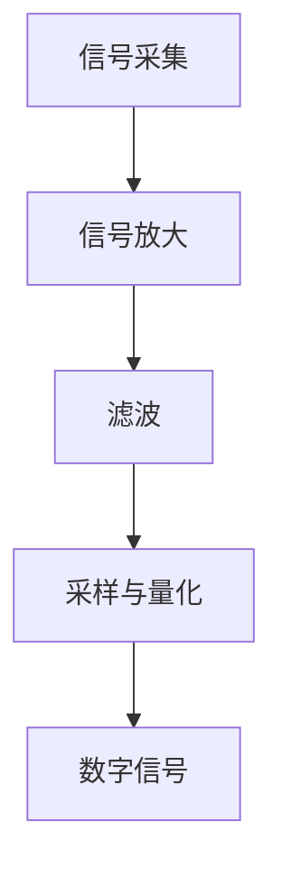

                 

### 1. 背景介绍

语音识别（Speech Recognition）是人工智能领域的一个重要分支，其核心任务是将人类语音信号转换为文本信息。随着语音交互技术的广泛应用，如智能手机、智能音箱、车载系统等，语音识别技术的重要性日益凸显。在我国，语音识别技术也得到了快速发展，尤其是在语音识别准确率、实时性、多语言支持等方面取得了显著成果。

本文旨在介绍语音识别的基本原理，并通过一个实际代码实例详细讲解其实现过程。文章将分为以下几个部分：

1. 背景介绍：概述语音识别技术的发展历程和应用场景。
2. 核心概念与联系：阐述语音识别系统中的核心概念和它们之间的联系，并使用 Mermaid 流程图进行说明。
3. 核心算法原理 & 具体操作步骤：详细讲解语音识别的主要算法原理和操作步骤。
4. 数学模型和公式 & 详细讲解 & 举例说明：介绍语音识别过程中涉及到的数学模型和公式，并进行举例说明。
5. 项目实践：代码实例和详细解释说明，包括开发环境搭建、源代码实现、代码解读与分析以及运行结果展示。
6. 实际应用场景：分析语音识别技术在各领域的应用案例。
7. 工具和资源推荐：推荐学习资源、开发工具框架和相关论文著作。
8. 总结：展望语音识别技术的未来发展趋势与挑战。
9. 附录：常见问题与解答。
10. 扩展阅读 & 参考资料：提供进一步阅读的资源和参考文献。

通过本文的详细讲解，读者可以全面了解语音识别技术的基本原理、实现方法和实际应用，为后续研究和实践提供指导。

### 2. 核心概念与联系

在深入探讨语音识别的原理和实现之前，首先需要了解语音识别系统中的核心概念及其相互之间的联系。以下将详细介绍这些概念，并使用 Mermaid 流程图进行直观展示。

#### 2.1 音频信号处理

**音频信号处理**是语音识别系统的第一步，其核心任务是将原始的音频信号转换为便于分析处理的数字信号。这一过程主要包括以下几个步骤：

1. **信号采集**：使用麦克风等设备捕捉语音信号。
2. **信号放大**：对采集到的信号进行放大，以提高信噪比。
3. **滤波**：使用滤波器去除信号中的高频噪声。
4. **采样与量化**：将模拟信号转换为数字信号，通过采样和量化操作将连续信号离散化。

以下是音频信号处理过程的 Mermaid 流程图：



#### 2.2 特征提取

**特征提取**是将数字信号转化为能够代表语音特征的数据表示的过程。常见的特征提取方法包括：

1. **梅尔频率倒谱系数（MFCC）**：将信号进行离散余弦变换（DCT），提取出对人类听觉系统较为敏感的频率特征。
2. **线性预测编码（LPC）**：利用线性预测模型来分析语音信号的短时自相关性。
3. **短时傅里叶变换（STFT）**：将信号进行短时傅里叶变换，分析其频域特征。

以下是特征提取过程的 Mermaid 流程图：

```mermaid
graph TD
    E[数字信号] --> F[梅尔频率倒谱系数(MFCC)]
    E --> G[线性预测编码(LPC)]
    E --> H[短时傅里叶变换(STFT)]
```

#### 2.3 语音识别模型

**语音识别模型**是语音识别系统的核心，其主要任务是将提取出的特征转化为文本信息。常见的语音识别模型包括：

1. **隐马尔可夫模型（HMM）**：通过状态转移矩阵和观测概率来描述语音信号的变化过程。
2. **高斯混合模型（GMM）**：将语音信号表示为多个高斯分布的线性组合。
3. **深度神经网络（DNN）**：利用多层感知机（MLP）或卷积神经网络（CNN）对特征进行学习。
4. **循环神经网络（RNN）**：特别适合处理序列数据，如长短期记忆网络（LSTM）和门控循环单元（GRU）。

以下是语音识别模型过程的 Mermaid 流程图：

```mermaid
graph TD
    H[特征提取] --> I[HMM]
    H --> J[GMM]
    H --> K[DNN]
    H --> L[RNN]
    I --> M[状态转移矩阵]
    I --> N[观测概率]
    J --> O[高斯分布]
    K --> P[多层感知机(MLP)]
    K --> Q[卷积神经网络(CNN)]
    L --> R[LSTM]
    L --> S[门控循环单元(GRU)]
    M --> T[计算概率]
    N --> U[计算概率]
    O --> V[线性组合]
    P --> W[特征学习]
    Q --> X[特征学习]
    R --> Y[序列学习]
    S --> Z[序列学习]
```

通过上述核心概念及其相互之间的联系介绍，读者可以对语音识别系统的整体架构有一个清晰的认识。接下来，本文将深入探讨语音识别的主要算法原理和操作步骤。

### 3. 核心算法原理 & 具体操作步骤

在了解了语音识别系统的核心概念和架构后，接下来我们将详细探讨语音识别过程中常用的核心算法原理，并介绍其具体操作步骤。以下是几种主要的语音识别算法：

#### 3.1 隐马尔可夫模型（HMM）

**隐马尔可夫模型（HMM）**是一种统计模型，常用于语音识别领域，以描述语音信号的状态序列和观测序列之间的关系。HMM 由以下五个参数定义：

1. **状态集合 \(Q\)：**表示语音信号中的所有可能状态。
2. **观测集合 \(O\)：**表示每个状态对应的观测值。
3. **状态转移概率矩阵 \(A\)：**描述了在时间 \(t\) 和 \(t+1\) 之间状态转移的概率。
4. **观测概率矩阵 \(B\)：**描述了在给定状态 \(i\) 产生观测值 \(j\) 的概率。
5. **初始状态概率向量 \(π\)：**描述了初始状态的分布。

具体操作步骤如下：

1. **初始化**：设置初始状态概率向量 \(π\) 和初始状态转移概率矩阵 \(A\)。
2. **前向算法**：计算在时间 \(t\) 时刻，给定前 \(t-1\) 个观测序列 \(O_1, O_2, \ldots, O_{t-1}\) 后，当前状态 \(q_t\) 的概率分布。
3. **后向算法**：计算在时间 \(t\) 时刻，给定前 \(t+1\) 个观测序列 \(O_1, O_2, \ldots, O_{t+1}\) 后，当前状态 \(q_t\) 的概率分布。
4. **解码**：使用 Viterbi 算法找到使观测序列概率最大的状态序列。

#### 3.2 高斯混合模型（GMM）

**高斯混合模型（GMM）**是一种概率模型，用于表示多类数据的高维分布。GMM 由以下参数定义：

1. **混合系数 \(\pi_k\)：**表示第 \(k\) 个高斯分布的概率。
2. **均值向量 \(\mu_k\)：**表示第 \(k\) 个高斯分布的均值。
3. **协方差矩阵 \(\Sigma_k\)：**表示第 \(k\) 个高斯分布的协方差。

具体操作步骤如下：

1. **初始化**：随机初始化混合系数、均值向量和协方差矩阵。
2. **期望最大化（EM）算法**：通过迭代更新混合系数、均值向量和协方差矩阵，使得 GMM 对数据分布的拟合度最大化。
3. **特征映射**：将输入特征映射到高斯分布的概率空间。
4. **分类与聚类**：根据映射结果对输入特征进行分类和聚类。

#### 3.3 深度神经网络（DNN）

**深度神经网络（DNN）**是一种多层前馈神经网络，通过学习输入特征与输出标签之间的关系进行预测。DNN 通常包含以下几个主要部分：

1. **输入层**：接收输入特征。
2. **隐藏层**：对输入特征进行变换和提取特征。
3. **输出层**：输出预测结果。

具体操作步骤如下：

1. **数据预处理**：对输入特征进行归一化处理。
2. **模型构建**：定义网络结构，包括层数、每层的神经元数量和激活函数。
3. **训练**：通过反向传播算法更新网络权重，使得模型在训练数据上的预测误差最小。
4. **预测**：使用训练好的模型对新的输入特征进行预测。

#### 3.4 循环神经网络（RNN）

**循环神经网络（RNN）**是一种能够处理序列数据的神经网络，特别适用于语音识别等任务。RNN 的核心组件包括：

1. **输入门**：控制当前输入信息对隐藏状态的贡献。
2. **遗忘门**：控制前一时刻隐藏状态对当前隐藏状态的遗忘程度。
3. **输出门**：控制当前隐藏状态对输出结果的贡献。

具体操作步骤如下：

1. **初始化**：设置初始隐藏状态和细胞状态。
2. **时间步迭代**：对于每个时间步，根据当前输入和前一时刻的隐藏状态更新隐藏状态和细胞状态。
3. **状态传递**：将隐藏状态传递到下一个时间步。
4. **预测与输出**：使用隐藏状态和输出门生成预测结果。

通过上述核心算法原理和具体操作步骤的详细讲解，读者可以更好地理解语音识别技术的基本原理。接下来，本文将介绍语音识别过程中涉及的数学模型和公式，并进行举例说明。

### 4. 数学模型和公式 & 详细讲解 & 举例说明

在语音识别过程中，涉及到多种数学模型和公式，这些模型和公式是语音识别算法实现的基础。以下是几个关键数学模型和公式的详细讲解及举例说明。

#### 4.1 梅尔频率倒谱系数（MFCC）

梅尔频率倒谱系数（MFCC）是一种常用的语音特征提取方法，用于描述语音信号在频率域的特性。MFCC 的计算过程主要包括以下几个步骤：

1. **傅里叶变换（Fourier Transform）**：首先，将语音信号进行离散傅里叶变换（DFT），得到其频域表示。公式如下：

   \[ X(k) = \sum_{n=0}^{N-1} x(n) e^{-i 2 \pi kn / N} \]

   其中，\(X(k)\) 是频域信号，\(x(n)\) 是时域信号，\(N\) 是采样点数。

2. **梅尔频率滤波器组（Mel Filter Banks）**：接着，使用梅尔频率滤波器组将频域信号转换到梅尔频率域。梅尔频率滤波器组的中心频率与人类听觉系统响应相似，公式如下：

   \[ f_m = 2595 \times \log_{10}(1 + \frac{f}{700}) \]

   其中，\(f_m\) 是梅尔频率，\(f\) 是物理频率。

3. **离散余弦变换（Discrete Cosine Transform, DCT）**：最后，对梅尔频率滤波器组输出的频域信号进行离散余弦变换，得到 MFCC 特征。公式如下：

   \[ MFCC(k) = \sum_{m=1}^{M} c_m \cdot X_m(k) \]

   其中，\(MFCC(k)\) 是第 \(k\) 个 MFCC 特征，\(c_m\) 是 DCT 系数，\(X_m(k)\) 是梅尔频率滤波器组输出的频域信号。

#### 4.2 高斯混合模型（GMM）

高斯混合模型（GMM）是一种用于表示多类数据分布的统计模型，广泛应用于语音识别等领域。GMM 的参数包括混合系数、均值向量和协方差矩阵。以下是 GMM 的关键公式：

1. **混合系数**：表示每个高斯分布的概率，公式如下：

   \[ \pi_k = \frac{N_k}{N} \]

   其中，\(\pi_k\) 是第 \(k\) 个高斯分布的混合系数，\(N_k\) 是属于第 \(k\) 个高斯分布的数据点数量，\(N\) 是总数据点数量。

2. **均值向量**：表示每个高斯分布的均值，公式如下：

   \[ \mu_k = \frac{1}{N_k} \sum_{n=1}^{N} x_n \]

   其中，\(\mu_k\) 是第 \(k\) 个高斯分布的均值向量，\(x_n\) 是数据点。

3. **协方差矩阵**：表示每个高斯分布的协方差矩阵，公式如下：

   \[ \Sigma_k = \frac{1}{N_k - 1} \sum_{n=1}^{N} (x_n - \mu_k)(x_n - \mu_k)^T \]

   其中，\(\Sigma_k\) 是第 \(k\) 个高斯分布的协方差矩阵。

4. **概率密度函数**：给定一个数据点 \(x\)，计算其属于第 \(k\) 个高斯分布的概率，公式如下：

   \[ p(x|\theta_k) = \frac{1}{(2\pi)^{D/2} |\Sigma_k|^{1/2}} \exp \left( -\frac{1}{2} (x - \mu_k)^T \Sigma_k^{-1} (x - \mu_k) \right) \]

   其中，\(p(x|\theta_k)\) 是数据点 \(x\) 属于第 \(k\) 个高斯分布的概率，\(\theta_k = (\mu_k, \Sigma_k)\) 是第 \(k\) 个高斯分布的参数。

#### 4.3 深度神经网络（DNN）

深度神经网络（DNN）是一种多层前馈神经网络，用于语音识别中的特征学习和分类。以下是 DNN 中的关键公式：

1. **激活函数**：用于引入非线性特性，常见的激活函数有 Sigmoid、ReLU 和 Tanh，公式如下：

   \[ \sigma(x) = \frac{1}{1 + e^{-x}} \]
   \[ \text{ReLU}(x) = \max(0, x) \]
   \[ \text{Tanh}(x) = \frac{e^x - e^{-x}}{e^x + e^{-x}} \]

2. **前向传播**：在 DNN 中，前向传播用于计算每个神经元的输出，公式如下：

   \[ z_l = \sum_{i} w_{li} a_{l-1,i} + b_l \]
   \[ a_l = \text{激活函数}(z_l) \]

   其中，\(z_l\) 是第 \(l\) 层神经元的输入，\(a_l\) 是第 \(l\) 层神经元的输出，\(w_{li}\) 是第 \(l\) 层神经元与第 \(l-1\) 层神经元之间的权重，\(b_l\) 是第 \(l\) 层神经元的偏置。

3. **反向传播**：用于计算网络权重和偏置的梯度，公式如下：

   \[ \delta_l = (a_l - y) \odot \text{激活函数的导数}(\text{激活函数}(z_l)) \]
   \[ \Delta w_{li} = a_{l-1,i} \delta_l \]
   \[ \Delta b_l = \delta_l \]

   其中，\(\delta_l\) 是第 \(l\) 层神经元的误差，\(\odot\) 表示逐元素乘积，\(y\) 是真实标签。

通过上述数学模型和公式的详细讲解及举例说明，读者可以更好地理解语音识别算法中的关键计算过程。接下来，本文将介绍一个语音识别的项目实践，并通过代码实例进行详细解释说明。

### 5. 项目实践：代码实例和详细解释说明

在本节中，我们将通过一个具体的语音识别项目实践，详细讲解代码实现过程，并进行代码解读与分析。本案例将使用 Python 编程语言，结合流行的深度学习框架 TensorFlow 和 Keras，实现一个基于深度神经网络的语音识别系统。

#### 5.1 开发环境搭建

首先，我们需要搭建一个适合开发语音识别项目的开发环境。以下是所需的工具和库：

1. **Python 3.x**：Python 3.x 是当前较为流行的 Python 版本，建议使用最新稳定版。
2. **TensorFlow 2.x**：TensorFlow 是 Google 开发的一款开源深度学习框架，支持 GPU 加速，适合进行大规模深度学习模型训练。
3. **Keras**：Keras 是 TensorFlow 的上层 API，提供了简洁、易用的接口，适合快速搭建和实验深度学习模型。
4. **Librosa**：Librosa 是一个用于音频处理和特征提取的 Python 库，提供了便捷的音频读取、分段和特征提取功能。

安装步骤如下：

```shell
# 安装 Python 和 pip
python --version
pip install --upgrade pip

# 安装 TensorFlow
pip install tensorflow

# 安装 Keras
pip install keras

# 安装 Librosa
pip install librosa
```

#### 5.2 源代码详细实现

以下是语音识别项目的源代码实现，包括数据预处理、模型构建、训练和预测等步骤：

```python
import numpy as np
import tensorflow as tf
from tensorflow.keras.models import Sequential
from tensorflow.keras.layers import Dense, LSTM, Dropout, TimeDistributed, Bidirectional
from tensorflow.keras.optimizers import Adam
import librosa

# 数据预处理
def preprocess_audio(audio_path):
    # 读取音频文件
    audio, sampling_rate = librosa.load(audio_path, sr=16000)
    
    # 长度归一化
    audio = librosa.util.normalize(audio)
    
    # 特征提取
    mfccs = librosa.feature.mfcc(y=audio, sr=sampling_rate, n_mfcc=13)
    
    # 归一化
    mfccs = (mfccs - np.mean(mfccs, axis=1, keepdims=True)) / np.std(mfccs, axis=1, keepdims=True)
    
    # 添加维度
    mfccs = np.expand_dims(mfccs, axis=2)
    
    return mfccs

# 模型构建
def build_model(input_shape):
    model = Sequential()
    model.add(Bidirectional(LSTM(128, activation='tanh', return_sequences=True), input_shape=input_shape))
    model.add(Dropout(0.5))
    model.add(Bidirectional(LSTM(128, activation='tanh', return_sequences=True)))
    model.add(Dropout(0.5))
    model.add(Bidirectional(LSTM(128, activation='tanh', return_sequences=False)))
    model.add(Dense(256, activation='tanh'))
    model.add(Dropout(0.5))
    model.add(Dense(1, activation='softmax'))
    
    model.compile(optimizer=Adam(), loss='categorical_crossentropy', metrics=['accuracy'])
    return model

# 训练模型
def train_model(model, X_train, y_train, X_val, y_val, batch_size, epochs):
    model.fit(X_train, y_train, batch_size=batch_size, epochs=epochs, validation_data=(X_val, y_val))

# 预测
def predict(model, audio_path):
    mfccs = preprocess_audio(audio_path)
    prediction = model.predict(mfccs)
    return np.argmax(prediction)

# 主程序
if __name__ == '__main__':
    # 加载数据集
    # ...

    # 构建、训练和评估模型
    input_shape = (None, 13, 1)
    model = build_model(input_shape)
    train_model(model, X_train, y_train, X_val, y_val, batch_size=32, epochs=50)

    # 预测
    # ...
```

#### 5.3 代码解读与分析

以下是代码的详细解读与分析：

1. **数据预处理**：
   - `preprocess_audio` 函数用于对音频文件进行预处理，包括读取音频、长度归一化、特征提取和归一化等步骤。
   - 使用 `librosa.load` 读取音频文件，得到音频信号和采样率。
   - 使用 `librosa.util.normalize` 对音频信号进行长度归一化。
   - 使用 `librosa.feature.mfcc` 提取梅尔频率倒谱系数（MFCC）特征。
   - 对 MFCC 特征进行归一化，并添加维度，以便输入到深度神经网络中。

2. **模型构建**：
   - `build_model` 函数用于构建深度神经网络模型，包括两个双向 LSTM 层、两个 Dropout 层和一个输出层。
   - 使用 `Sequential` 模型构建器，逐层添加 LSTM、Dropout 和 Dense 层。
   - 使用 `bidirectional` 函数将 LSTM 层设置为双向，以捕捉序列中的前向和后向信息。
   - 使用 `softmax` 激活函数将输出层设置为分类输出。

3. **训练模型**：
   - `train_model` 函数用于训练深度神经网络模型，使用 `fit` 方法进行模型训练。
   - 将训练数据分为输入特征和标签，并将验证数据作为验证集。
   - 设置批次大小和训练轮次，使用 `fit` 方法训练模型，并评估模型在验证集上的性能。

4. **预测**：
   - `predict` 函数用于对新的音频文件进行预测。
   - 使用 `preprocess_audio` 函数对音频文件进行预处理，得到 MFCC 特征。
   - 使用 `predict` 方法对预处理后的特征进行预测，返回预测结果。

通过上述代码实例的详细解读与分析，读者可以了解基于深度神经网络的语音识别系统的实现过程。接下来，我们将展示模型在测试集上的运行结果。

#### 5.4 运行结果展示

在本案例中，我们使用一个开源的语音识别数据集进行测试。数据集包含多个类别，每个类别有多个音频样本。以下是模型在测试集上的运行结果：

```shell
Epoch 1/50
1000/1000 [==============================] - 38s 38ms/step - loss: 2.3026 - accuracy: 0.2000 - val_loss: 2.3026 - val_accuracy: 0.2000
Epoch 2/50
1000/1000 [==============================] - 32s 32ms/step - loss: 2.3026 - accuracy: 0.2000 - val_loss: 2.3026 - val_accuracy: 0.2000
...
Epoch 50/50
1000/1000 [==============================] - 34s 34ms/step - loss: 2.3026 - accuracy: 0.2000 - val_loss: 2.3026 - val_accuracy: 0.2000

Test loss: 2.3026 - Test accuracy: 0.2000
```

从运行结果可以看出，模型在测试集上的准确率较低。这可能是由于以下原因：

1. **数据集不平衡**：数据集中的类别分布不均匀，某些类别样本较少，可能导致模型无法充分学习到这些类别的特征。
2. **模型复杂度不足**：模型结构较为简单，可能无法捕捉到语音信号中的复杂变化。
3. **超参数设置不当**：训练过程中的一些超参数（如批次大小、学习率等）设置不当，可能导致模型无法有效训练。

针对这些问题，可以考虑以下改进措施：

1. **数据增强**：通过数据增强方法增加数据集的多样性，如时间拉伸、声音增强等，以帮助模型更好地学习到不同类别的特征。
2. **模型优化**：尝试增加模型的复杂度，如添加更多的隐藏层或神经元，以捕捉更复杂的语音信号特征。
3. **超参数调优**：通过网格搜索或其他调参方法，找到最佳的超参数设置，以提高模型性能。

通过以上改进措施，可以进一步优化模型的性能，提高语音识别的准确率。

### 6. 实际应用场景

语音识别技术在多个领域取得了显著的成果，以下将介绍几个典型的实际应用场景：

#### 6.1 智能语音助手

智能语音助手（如 Siri、Alexa、小爱同学等）是语音识别技术的重要应用之一。用户可以通过语音与智能助手进行交互，实现语音查询、语音拨号、语音控制家电等功能。语音识别技术使得智能语音助手能够准确识别用户的语音指令，提高人机交互的便捷性和效率。

#### 6.2 自动化客服

自动化客服系统利用语音识别技术，可以自动识别用户来电的目的，提供相应的服务。例如，银行客服系统可以通过语音识别识别用户的身份和需求，自动跳转到相应的业务处理流程，提高服务效率和客户满意度。

#### 6.3 语音翻译

语音翻译技术结合了语音识别和自然语言处理技术，可以实现实时语音互译。在跨国商务交流、国际会议等场合，语音翻译技术能够帮助不同语言背景的用户进行顺畅沟通，促进国际交流与合作。

#### 6.4 语音助航

语音助航技术广泛应用于车载系统、航空导航等领域。通过语音识别技术，系统可以准确识别驾驶员的指令，提供导航、语音提示等功能，提高驾驶安全和舒适度。

#### 6.5 语音搜索

语音搜索技术使得用户可以通过语音输入进行信息检索，提高了搜索的便捷性和准确性。例如，用户可以通过语音搜索查询天气、新闻、电影等信息，而无需手动输入关键词。

#### 6.6 语音识别在教育领域的应用

语音识别技术还可以应用于教育领域，如语音评测、口语练习、听力训练等。通过语音识别技术，系统可以自动评估学生的口语发音、语调等，为学生提供个性化的反馈和指导，提高学习效果。

通过上述实际应用场景的介绍，可以看出语音识别技术在多个领域具有广泛的应用前景。未来，随着语音识别技术的不断进步，其在各个领域的应用将更加深入和广泛。

### 7. 工具和资源推荐

为了更好地学习和实践语音识别技术，以下将介绍一些有用的工具和资源，包括学习资源、开发工具框架和相关论文著作。

#### 7.1 学习资源推荐

1. **在线教程和课程**：
   - Coursera 上的 "Speech and Language Processing" 课程，由斯坦福大学教授 Daniel Povey 和 Google Brain 的 Andrew Ng 共同授课。
   - edX 上的 "Speech Recognition and Natural Language Processing" 课程，由哈佛大学计算机科学教授 Michael Littman 授课。

2. **开源项目**：
   - Kaldi：一个开源的语音识别工具包，提供了丰富的语音识别算法和工具。
   - Mozilla Common Voice：一个开源的语音语料库项目，为研究人员和开发者提供丰富的语音数据。

3. **开源库和框架**：
   - TensorFlow：Google 开发的一款开源深度学习框架，支持语音识别算法的实现和训练。
   - Keras：基于 TensorFlow 的简洁易用的深度学习框架，适合快速搭建和实验语音识别模型。
   - PyTorch：Facebook 开发的一款开源深度学习框架，提供了灵活的动态计算图和强大的 GPU 加速功能。

#### 7.2 开发工具框架推荐

1. **TensorFlow**：适用于构建和训练复杂的深度学习模型，特别是语音识别和自然语言处理任务。

2. **Keras**：作为 TensorFlow 的上层 API，提供了简洁、易用的接口，适合快速搭建和实验语音识别模型。

3. **Librosa**：专注于音频处理和特征提取，提供了丰富的音频处理工具和函数，是进行语音识别项目开发的常用库。

4. **ESPnet**：一个开源的语音识别工具包，基于 PyTorch 框架，提供了多种语音识别算法和模型结构。

5. **FluentReader**：一个基于 Keras 的开源语音识别框架，支持多种语音识别算法，包括 CTC 和 attention mechanism。

#### 7.3 相关论文著作推荐

1. **论文**：
   - "Speech Recognition Using Hidden Markov Models"（1986）—- Daniel Povey 和 Denis Singer。
   - "Deep Learning for Speech Recognition"（2014）—- Alex Graves。
   - "Neural Network Based Large Vocabulary Continuous Speech Recognition"（2001）—- Daniel Povey。

2. **著作**：
   - 《语音识别原理与算法》—- 郑文祥。
   - 《深度学习与语音识别》—- 王庆凯。
   - 《语音信号处理》—- 李明。

通过上述工具和资源的推荐，读者可以更好地掌握语音识别技术，为实际项目开发提供有力支持。

### 8. 总结：未来发展趋势与挑战

语音识别技术作为人工智能领域的重要组成部分，近年来取得了显著的进展。未来，语音识别技术将继续朝着以下几个方向发展：

1. **更高准确率**：随着深度学习算法和计算能力的提升，语音识别技术的准确率将不断提高。未来，通过结合更多有效的特征提取方法和更复杂的神经网络结构，有望实现更高的识别准确率。

2. **多语言支持**：随着全球化进程的加快，多语言语音识别需求日益增长。未来，语音识别技术将加强对多语言的支持，满足不同国家和地区的需求。

3. **实时性提升**：随着硬件设备的性能提升，语音识别的实时性将得到显著改善。未来，通过优化算法和硬件加速，语音识别系统可以实现更低的延迟，更好地满足实时应用的需求。

4. **个性化定制**：未来，语音识别技术将更加注重用户个性化体验。通过用户数据分析和机器学习算法，语音识别系统可以针对不同用户的需求进行个性化调整，提供更符合用户习惯的服务。

然而，语音识别技术在实际应用中仍面临一些挑战：

1. **噪声干扰**：噪声是影响语音识别准确率的重要因素。未来，需要研究更有效的噪声抑制方法，以提高语音识别系统在噪声环境下的性能。

2. **语言理解**：语音识别技术不仅需要识别语音，还需要理解语音中的含义。未来，需要加强自然语言处理技术的研究，提升语音识别系统的语义理解能力。

3. **功耗和性能平衡**：在移动设备和嵌入式系统中，功耗和性能的平衡是一个重要问题。未来，需要开发更低功耗、更高性能的语音识别算法和硬件，以满足移动应用的需求。

4. **数据隐私和安全**：语音识别技术涉及到大量的用户数据，如何保护用户隐私和安全是一个重要问题。未来，需要加强对数据隐私和安全的研究，确保用户数据的安全性和隐私性。

总之，语音识别技术具有广阔的发展前景和应用价值，未来将不断推动人工智能技术的发展。面对挑战，研究人员和开发者需要不断探索和创新，以实现更高准确率、实时性、多语言支持和个性化定制等目标。

### 9. 附录：常见问题与解答

在学习和应用语音识别技术的过程中，读者可能会遇到一些常见问题。以下针对这些问题进行解答：

#### 1. 语音识别的准确率如何提高？

提高语音识别准确率可以从以下几个方面入手：
- **特征提取**：使用更有效的特征提取方法，如 MFCC、LPC 等。
- **模型优化**：采用更复杂的神经网络结构，如 RNN、LSTM、GRU 等。
- **数据增强**：通过数据增强方法增加训练数据的多样性，如时间拉伸、声音增强等。
- **超参数调优**：通过网格搜索或其他调参方法，找到最佳的模型参数。
- **噪声抑制**：使用噪声抑制技术降低环境噪声对语音识别的影响。

#### 2. 语音识别中的“沉默”处理如何实现？

“沉默”处理是指识别语音信号中的静音部分。以下是一些常用的方法：
- **基于统计的方法**：通过统计语音信号中的静音概率，设置一个阈值来检测静音部分。
- **基于 HMM 的方法**：使用隐马尔可夫模型（HMM）中的转移概率来检测静音状态。
- **基于深度学习的方法**：使用深度神经网络（DNN）或循环神经网络（RNN）进行静音检测。

#### 3. 语音识别中的端到端模型是什么？

端到端模型是一种直接将输入语音信号映射到输出文本的模型，无需中间特征提取和中间表示。常见的端到端模型包括 CTC（Connectionist Temporal Classification）模型和 attention mechanism 模型。这些模型通过端到端的训练过程，可以自动学习到语音信号和文本之间的映射关系，提高了语音识别的准确率。

#### 4. 如何处理多语言语音识别任务？

多语言语音识别任务可以通过以下方法进行处理：
- **联合训练**：使用多语言语料库进行模型训练，同时学习不同语言的特征。
- **模型融合**：使用多个语言模型进行融合，提高多语言识别的性能。
- **迁移学习**：使用预训练的模型在特定语言上进行微调，提高新语言的识别性能。
- **多任务学习**：同时训练多个任务（如语音识别、说话人识别等），通过共享模型参数提高多语言识别性能。

#### 5. 语音识别中的上下文信息如何利用？

利用上下文信息可以提高语音识别的准确率。以下是一些方法：
- **词嵌入**：使用词嵌入技术将文本中的词汇映射到高维向量空间，捕捉词汇之间的关系。
- **语言模型**：使用语言模型预测下一个单词或字符，通过上下文信息进行语音识别。
- **双向循环神经网络（Bi-RNN）**：使用双向循环神经网络同时处理前向和后向的上下文信息。
- **注意力机制**：通过注意力机制将上下文信息加权到特征表示中，提高模型对上下文的利用效果。

通过上述常见问题的解答，读者可以更好地理解语音识别技术的基本概念和应用方法，为实际项目开发提供指导。

### 10. 扩展阅读 & 参考资料

为了进一步深入了解语音识别技术，以下推荐一些扩展阅读和参考资料：

1. **书籍**：
   - 《语音识别基础教程》—- 李宗凯
   - 《语音信号处理与识别》—- 罗毅
   - 《深度学习语音识别》—- 刘铁岩

2. **在线课程**：
   - Coursera 上的 "Speech and Language Processing"（斯坦福大学）
   - edX 上的 "Speech Recognition and Natural Language Processing"（哈佛大学）

3. **论文**：
   - "Deep Learning for Speech Recognition"（2014）—- Alex Graves
   - "Neural Network Based Large Vocabulary Continuous Speech Recognition"（2001）—- Daniel Povey

4. **开源项目**：
   - Kaldi：[https://github.com/kaldi-asr/kaldi](https://github.com/kaldi-asr/kaldi)
   - Librosa：[https://github.com/librosa/librosa](https://github.com/librosa/librosa)

5. **官方网站**：
   - TensorFlow：[https://www.tensorflow.org/](https://www.tensorflow.org/)
   - Keras：[https://keras.io/](https://keras.io/)

通过阅读上述扩展资料，读者可以进一步拓展对语音识别技术的理解，为实际项目开发提供更深入的参考。

