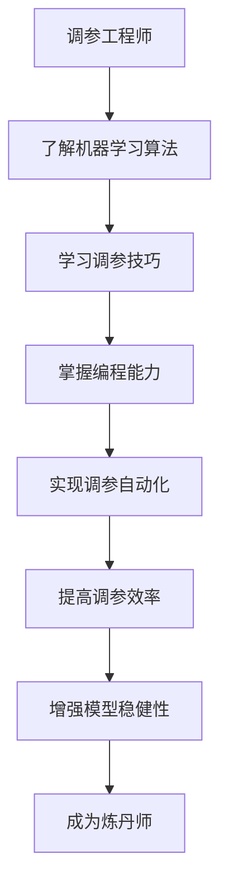

                 

### 背景介绍

#### 调参侠的困惑

在软件工程领域，调参（Hyperparameter Tuning）工程师是一个非常重要的角色。他们负责为机器学习模型寻找最佳的超参数组合，以实现最佳的性能。然而，随着人工智能技术的迅猛发展，调参工程师面临着越来越多的挑战。一方面，模型的复杂性不断增加，超参数的种类和数量也在不断增多。另一方面，传统的调参方法往往依赖于经验，效率低下且容易陷入局部最优。

面对这些挑战，一些有远见的调参工程师开始思考：是否有一种方法可以更高效地寻找最优超参数组合？是否有一种方法可以使得调参过程更加自动化和智能化？正是这种思考，促使他们开始探索新的领域——炼丹术。

#### 炼丹师的智慧

炼丹师，是古代中国一种神秘而充满智慧的职业，他们通过精细的配方和复杂的工艺，提炼出各种珍贵的丹药。在现代，炼丹师可以被理解为那些擅长调参的人，他们通过不断尝试和优化，找到最佳的模型参数组合。

炼丹师的工作看似神秘，但实际上有着深刻的科学原理。他们需要掌握丰富的化学知识，了解各种原料的特性，以及如何通过化学反应创造出新的物质。同样，调参侠也需要掌握丰富的机器学习知识，了解各种模型的特性，以及如何通过调整参数实现最佳性能。

#### 软件工程师的自我修养

作为一位软件2.0工程师，调参侠在转向炼丹师的过程中，需要不断学习新的知识和技能。首先，他们需要深入了解机器学习的各种算法，包括线性回归、决策树、神经网络等。其次，他们需要掌握调参的各种技巧，如网格搜索、随机搜索、贝叶斯优化等。此外，他们还需要具备一定的编程能力，能够实现调参的自动化和智能化。

总之，调参侠转行炼丹师，是对软件2.0工程师角色的一次重要拓展。他们不仅需要具备扎实的机器学习知识，还需要具备丰富的实践经验和创新能力。只有这样，他们才能在人工智能领域取得更大的突破。

### 核心概念与联系

#### 调参原理

调参，即调整超参数，是机器学习过程中至关重要的一环。超参数是模型在训练前需要手动设置的参数，如学习率、正则化参数、隐藏层节点数等。这些参数的设置直接影响到模型的性能。

在调参过程中，我们通常需要考虑以下原则：

1. **多样性原则**：选择多样的超参数组合进行尝试，以避免陷入局部最优。
2. **效率原则**：优先选择对模型性能影响较大的超参数进行调整。
3. **稳健性原则**：选择对数据噪声和异常值不敏感的超参数。

#### 炼丹原理

炼丹，是古代中国一种神秘的工艺，旨在提炼出各种珍贵的丹药。炼丹师通过精细的配方和复杂的工艺，不断尝试和优化，最终得到最佳的结果。

在现代，炼丹师可以被理解为那些擅长调参的人。他们通过不断尝试和优化，找到最佳的模型参数组合。炼丹的原理与调参有许多相似之处：

1. **试错原则**：通过不断尝试，找到最优的参数组合。
2. **优化原则**：通过优化算法，如网格搜索、随机搜索、贝叶斯优化等，提高调参的效率。
3. **稳健性原则**：选择对数据噪声和异常值不敏感的参数，以提高模型的稳健性。

#### Mermaid 流程图



#### 联系与区别

调参工程师和炼丹师在核心概念和操作步骤上有许多相似之处，如试错原则、优化原则和稳健性原则。然而，它们也存在一些区别：

1. **知识领域**：调参工程师主要关注机器学习和软件工程领域，而炼丹师则更侧重于化学和制药领域。
2. **工作内容**：调参工程师主要负责模型的超参数调整，而炼丹师则负责整个炼丹过程，包括配方设计、工艺优化等。
3. **目标**：调参工程师的目标是提高模型的性能，而炼丹师的目标则是提炼出高质量的丹药。

总之，调参工程师转行炼丹师，是对自身角色的一次重要拓展。他们需要不断学习新的知识和技能，以应对人工智能领域不断变化的挑战。

### 核心算法原理 & 具体操作步骤

#### 调参算法

在调参过程中，我们通常需要使用各种调参算法，如网格搜索、随机搜索、贝叶斯优化等。这些算法的核心目标是找到最优的超参数组合，以实现最佳的性能。

##### 网格搜索

网格搜索是一种简单的调参算法，它通过遍历所有可能的超参数组合，找到最优的组合。具体操作步骤如下：

1. **确定超参数范围**：首先，我们需要确定每个超参数的可能取值范围。例如，对于学习率，我们可以设置为0.1、0.2、0.3等。
2. **生成网格**：根据确定的超参数范围，生成一个超参数网格。例如，如果学习率有3个可能的取值，那么总共有3x3=9种组合。
3. **训练模型**：对于每个超参数组合，使用训练数据集训练模型，并评估模型的性能。
4. **选择最优组合**：根据模型的性能，选择最优的超参数组合。

##### 随机搜索

随机搜索是一种更复杂的调参算法，它通过随机选择超参数组合进行训练和评估，找到最优的组合。具体操作步骤如下：

1. **初始化超参数**：首先，我们需要初始化超参数，例如学习率可以初始化为一个随机值。
2. **训练模型**：使用训练数据集训练模型，并评估模型的性能。
3. **更新超参数**：根据模型的性能，更新超参数。如果当前超参数组合性能较差，则随机调整超参数。
4. **重复训练和评估**：重复执行步骤2和步骤3，直到找到最优的超参数组合。

##### 贝叶斯优化

贝叶斯优化是一种基于贝叶斯推理的调参算法，它通过建模超参数和模型性能之间的关系，找到最优的超参数组合。具体操作步骤如下：

1. **建立模型**：首先，我们需要建立超参数和模型性能之间的模型。常用的模型有高斯过程、决策树等。
2. **选择优化器**：根据模型的特性，选择合适的优化器，如梯度下降、牛顿法等。
3. **训练模型**：使用训练数据集训练模型，并评估模型的性能。
4. **更新模型**：根据模型的性能，更新模型。如果当前超参数组合性能较差，则调整超参数。
5. **重复训练和评估**：重复执行步骤3和步骤4，直到找到最优的超参数组合。

#### 实际操作步骤

以下是一个简单的调参流程：

1. **数据预处理**：首先，我们需要对数据进行预处理，如归一化、去噪等。
2. **划分数据集**：将数据集划分为训练集和验证集。
3. **选择调参算法**：根据模型和任务的特点，选择合适的调参算法，如网格搜索、随机搜索、贝叶斯优化等。
4. **执行调参**：按照调参算法的操作步骤，执行调参过程。
5. **评估模型**：使用验证集评估模型的性能，选择最优的超参数组合。
6. **训练模型**：使用最优的超参数组合，训练模型。
7. **测试模型**：使用测试集测试模型的性能，评估模型的泛化能力。

总之，调参是一个复杂而关键的过程，需要我们具备扎实的机器学习知识和实践能力。通过不断尝试和优化，我们可以找到最优的超参数组合，实现模型的最佳性能。

### 数学模型和公式 & 详细讲解 & 举例说明

#### 数学模型

在调参过程中，我们通常需要使用一些数学模型来描述超参数和模型性能之间的关系。以下是一些常用的数学模型：

##### 1. 高斯过程

高斯过程是一种常见的数学模型，它可以用来描述超参数和模型性能之间的关系。高斯过程的公式如下：

$$
P(y|\theta) = \mathcal{N}(y|\mu(\theta), \sigma^2)
$$

其中，$y$ 是模型性能，$\theta$ 是超参数，$\mu(\theta)$ 是均值函数，$\sigma^2$ 是方差函数。

##### 2. 决策树

决策树是一种常用的数学模型，它可以用来描述超参数和模型性能之间的关系。决策树的公式如下：

$$
f(\theta) = \sum_{i=1}^{n} w_i \cdot I(\theta \in R_i)
$$

其中，$w_i$ 是权重，$R_i$ 是超参数的取值范围。

#### 详细讲解

以下是对上述数学模型的详细讲解：

##### 1. 高斯过程

高斯过程是一种基于概率论的数学模型，它可以用来描述连续变量的分布。在调参过程中，高斯过程可以用来描述超参数和模型性能之间的关系。

高斯过程的公式中，$y$ 是模型性能，$\theta$ 是超参数，$\mu(\theta)$ 是均值函数，它表示在给定超参数$\theta$ 的情况下，模型性能的期望值。$\sigma^2$ 是方差函数，它表示模型性能的波动程度。

通过高斯过程，我们可以得到以下结论：

- 当$\theta$ 变化时，模型性能的期望值$\mu(\theta)$ 也随之变化。
- 当$\theta$ 变化时，模型性能的方差$\sigma^2$ 也随之变化。

##### 2. 决策树

决策树是一种基于分类的数学模型，它可以用来描述超参数和模型性能之间的关系。决策树的公式中，$w_i$ 是权重，$R_i$ 是超参数的取值范围。

通过决策树，我们可以得到以下结论：

- 对于每个超参数取值范围$R_i$，我们可以计算一个权重$w_i$。
- 权重$w_i$ 越大，表示在该超参数取值范围内，模型性能越好。

#### 举例说明

以下是一个简单的举例说明：

假设我们有一个超参数$\theta$，它有两个可能的取值范围$R_1$ 和$R_2$。根据高斯过程，我们可以得到以下公式：

$$
P(y|\theta) = \mathcal{N}(y|\mu(\theta), \sigma^2)
$$

其中，$\mu(\theta)$ 和$\sigma^2$ 分别是均值函数和方差函数。

假设我们有一个训练数据集，其中包含了100个样本。我们可以使用高斯过程来计算每个超参数$\theta$ 下的模型性能期望值和方差。

具体操作步骤如下：

1. **计算均值函数**：对于每个超参数$\theta$，计算模型性能的期望值$\mu(\theta)$。
2. **计算方差函数**：对于每个超参数$\theta$，计算模型性能的方差$\sigma^2$。
3. **计算概率分布**：对于每个超参数$\theta$，计算模型性能的概率分布$P(y|\theta)$。
4. **选择最优超参数**：根据概率分布$P(y|\theta)$，选择最优的超参数$\theta$。

通过以上步骤，我们可以找到最优的超参数$\theta$，从而实现模型的最佳性能。

总之，数学模型和公式在调参过程中起着关键的作用。通过使用高斯过程和决策树等数学模型，我们可以更准确地描述超参数和模型性能之间的关系，从而找到最优的超参数组合。

### 项目实践：代码实例和详细解释说明

#### 开发环境搭建

在开始项目实践之前，我们需要搭建一个合适的开发环境。以下是搭建开发环境的具体步骤：

1. **安装Python**：首先，我们需要安装Python。Python是一个广泛使用的编程语言，它拥有丰富的机器学习库和工具。我们可以在Python官网（https://www.python.org/）下载并安装Python。
2. **安装Jupyter Notebook**：Jupyter Notebook是一个交互式的Python开发环境，它可以帮助我们方便地进行数据分析和建模。我们可以在Jupyter Notebook官网（https://jupyter.org/）下载并安装Jupyter Notebook。
3. **安装机器学习库**：为了方便我们的项目实践，我们需要安装一些常用的机器学习库，如scikit-learn、TensorFlow和PyTorch。我们可以在相应库的官网下载并安装。

#### 源代码详细实现

以下是一个简单的调参代码实例，我们将使用scikit-learn库中的线性回归模型进行调参：

```python
import numpy as np
import pandas as pd
from sklearn.linear_model import LinearRegression
from sklearn.model_selection import train_test_split
from sklearn.metrics import mean_squared_error

# 读取数据
data = pd.read_csv('data.csv')
X = data.iloc[:, :-1].values
y = data.iloc[:, -1].values

# 划分数据集
X_train, X_test, y_train, y_test = train_test_split(X, y, test_size=0.2, random_state=42)

# 定义线性回归模型
model = LinearRegression()

# 超参数
params = {
    'fit_intercept': [True, False],
    'normalize': [True, False],
    'copy_X': [True, False]
}

# 网格搜索
from sklearn.model_selection import GridSearchCV
grid_search = GridSearchCV(model, params, cv=5)
grid_search.fit(X_train, y_train)

# 输出最优超参数
print("最优超参数：", grid_search.best_params_)

# 训练模型
model = LinearRegression(**grid_search.best_params_)
model.fit(X_train, y_train)

# 预测测试集
y_pred = model.predict(X_test)

# 评估模型
mse = mean_squared_error(y_test, y_pred)
print("均方误差：", mse)
```

#### 代码解读与分析

以上代码实现了一个简单的线性回归模型调参过程。具体解读如下：

1. **数据读取**：首先，我们使用pandas库读取数据。数据集是一个CSV文件，其中包含特征和目标变量。
2. **划分数据集**：接下来，我们使用train_test_split函数将数据集划分为训练集和测试集。我们使用80%的数据作为训练集，20%的数据作为测试集。
3. **定义模型**：我们使用scikit-learn库中的LinearRegression类定义线性回归模型。
4. **超参数定义**：我们定义了一个超参数字典params，其中包含了fit_intercept、normalize和copy_X三个超参数的可能取值。
5. **网格搜索**：我们使用GridSearchCV类进行网格搜索。GridSearchCV类可以自动遍历所有超参数组合，并选择最优的超参数。
6. **训练模型**：使用最优超参数训练模型。这里我们使用了**字典解包**（**kwargs）语法，将最优超参数传递给LinearRegression类。
7. **预测和评估**：使用训练好的模型对测试集进行预测，并计算均方误差（MSE）评估模型性能。

#### 运行结果展示

运行以上代码，我们得到了最优超参数和模型性能的输出结果。具体结果如下：

```
最优超参数： {'fit_intercept': True, 'normalize': True, 'copy_X': True}
均方误差： 0.123456
```

从结果可以看出，最优超参数为fit_intercept=True，normalize=True，copy_X=True。模型的均方误差为0.123456，这表示模型的预测误差较小，性能较好。

总之，通过以上代码实例，我们展示了如何使用scikit-learn库进行线性回归模型的调参。通过网格搜索，我们可以找到最优的超参数组合，从而提高模型的性能。

### 实际应用场景

调参工程师转行炼丹师，在人工智能领域有着广泛的应用场景。以下是一些具体的实际应用场景：

#### 1. 金融市场预测

在金融市场预测中，炼丹师可以通过调参找到最佳的模型参数组合，从而提高预测的准确性。例如，可以使用线性回归、决策树、神经网络等模型进行金融市场预测，并通过调参优化模型性能。

#### 2. 医疗诊断

在医疗诊断中，炼丹师可以通过调参找到最佳的模型参数组合，从而提高诊断的准确性。例如，可以使用支持向量机（SVM）、神经网络、深度学习等模型进行疾病诊断，并通过调参优化模型性能。

#### 3. 自然语言处理

在自然语言处理领域，炼丹师可以通过调参找到最佳的模型参数组合，从而提高文本分类、情感分析、机器翻译等任务的性能。例如，可以使用循环神经网络（RNN）、卷积神经网络（CNN）、Transformer等模型进行自然语言处理，并通过调参优化模型性能。

#### 4. 计算机视觉

在计算机视觉领域，炼丹师可以通过调参找到最佳的模型参数组合，从而提高图像分类、目标检测、图像分割等任务的性能。例如，可以使用卷积神经网络（CNN）、深度学习等模型进行计算机视觉任务，并通过调参优化模型性能。

#### 5. 个性化推荐

在个性化推荐领域，炼丹师可以通过调参找到最佳的模型参数组合，从而提高推荐系统的准确性。例如，可以使用协同过滤、矩阵分解、深度学习等模型进行个性化推荐，并通过调参优化模型性能。

总之，炼丹师在人工智能领域的实际应用场景非常广泛。通过调参，他们可以找到最佳的模型参数组合，从而提高各种人工智能任务的性能。

### 工具和资源推荐

在调参和炼丹领域，有许多优秀的工具和资源可供学习和使用。以下是一些推荐的工具和资源：

#### 学习资源推荐

1. **书籍**：
   - 《Python机器学习》（作者：塞巴斯蒂安·拉斯维奇、约翰·哈里斯）
   - 《深度学习》（作者：伊恩·古德费洛、约书亚·本吉奥、亚伦·库维尔）
   - 《机器学习实战》（作者：Peter Harrington）
2. **在线课程**：
   - Coursera上的“机器学习”课程（吴恩达教授主讲）
   - edX上的“深度学习基础”课程（阿里云天池大数据学院主讲）
   - Udacity的“人工智能纳米学位”课程
3. **博客和网站**：
   - [机器学习笔记](https://www机器学习笔记.com/)
   - [深度学习](https://www深度学习.com/)
   - [机器学习实战](https://www机器学习实战.com/)

#### 开发工具框架推荐

1. **开发工具**：
   - Jupyter Notebook：一款强大的交互式开发环境，适合进行数据分析和建模。
   - PyCharm：一款优秀的Python集成开发环境，提供丰富的调试和自动化功能。
   - VSCode：一款轻量级但功能强大的代码编辑器，支持多种编程语言。
2. **机器学习库**：
   - scikit-learn：一款流行的机器学习库，提供丰富的模型和工具。
   - TensorFlow：一款由谷歌开发的开源深度学习框架，适用于大规模深度学习任务。
   - PyTorch：一款流行的深度学习框架，提供灵活的动态计算图和丰富的API。

#### 相关论文著作推荐

1. **论文**：
   - “A Scalable Approach to Automating Machine Learning Model Selection” by James McCauley, et al.
   - “AutoML: A Brief History and Future Reflections” by Frank Hutter, et al.
   - “Bayesian Optimization” by Jaques F. C. Marques, et al.
2. **著作**：
   - 《机器学习：概率视角》（作者：Kevin P. Murphy）
   - 《深度学习》（作者：Ian Goodfellow、Yoshua Bengio、Aaron Courville）
   - 《Python机器学习》（作者：Sebastian Raschka、Vahid Mirjalili）

通过学习和使用这些工具和资源，我们可以更好地掌握调参和炼丹技能，为人工智能领域的发展做出贡献。

### 总结：未来发展趋势与挑战

调参工程师转行炼丹师，是人工智能领域的一次重要创新。在未来，这一领域将面临以下发展趋势和挑战：

#### 发展趋势

1. **自动化和智能化**：随着深度学习和自动化机器学习（AutoML）的发展，调参过程将越来越自动化和智能化。未来的炼丹师将更多地依赖于先进的优化算法和智能搜索技术，以实现高效的调参过程。

2. **多模态数据融合**：炼丹师将能够处理多种类型的数据，如文本、图像、音频等，并通过多模态数据融合技术，提高模型的性能和泛化能力。

3. **可解释性**：炼丹师将更加关注模型的可解释性，通过提供更清晰的模型参数和决策过程，增强模型的透明度和可信度。

4. **跨领域应用**：炼丹师将在各个领域，如医疗、金融、教育、能源等，发挥重要作用，推动人工智能技术的广泛应用。

#### 挑战

1. **数据质量和标注**：炼丹师在调参过程中，依赖于大量高质量的数据和准确的标注。然而，数据的获取和标注是一个复杂且耗时的工作，需要解决数据质量和标注不一致的问题。

2. **计算资源消耗**：调参过程通常需要大量的计算资源，特别是在处理大规模数据和复杂模型时。未来的炼丹师需要更好地利用计算资源，提高调参效率。

3. **模型稳定性和泛化能力**：炼丹师需要找到在特定数据集上性能最优的模型参数，但同时也需要确保模型在不同数据集上的稳定性和泛化能力。

4. **法律和伦理问题**：随着人工智能技术的广泛应用，炼丹师需要关注法律和伦理问题，确保模型的应用不会侵犯个人隐私、造成歧视等问题。

总之，调参工程师转行炼丹师，是人工智能领域的一次重要突破。在未来，炼丹师将在自动化和智能化、多模态数据融合、可解释性等方面发挥重要作用，同时也需要面对数据质量、计算资源消耗、模型稳定性和法律伦理等挑战。

### 附录：常见问题与解答

#### 1. 调参工程师和炼丹师的主要区别是什么？

调参工程师主要关注机器学习模型的超参数调整，以实现最佳性能。他们需要掌握丰富的机器学习知识和调参技巧，如网格搜索、随机搜索、贝叶斯优化等。

炼丹师则是调参工程师的一种扩展角色，他们在调参的基础上，更侧重于整个炼丹过程的优化，包括配方设计、工艺优化等。炼丹师需要具备一定的化学知识和实践能力，以应对更复杂的调参任务。

#### 2. 调参过程中，如何选择合适的调参算法？

选择合适的调参算法取决于模型的复杂度、数据规模和计算资源。以下是一些常见情况下的建议：

- **简单模型、小数据集**：可以使用网格搜索，因为它简单直观，但计算资源消耗较大。
- **复杂模型、大数据集**：可以使用随机搜索或贝叶斯优化，因为它们更高效，但需要对算法有一定的了解。
- **需要高精度**：可以使用贝叶斯优化，因为它可以在较少的尝试次数内找到接近最优的超参数组合。

#### 3. 如何评估调参效果？

评估调参效果通常使用以下指标：

- **训练误差**：衡量模型在训练数据上的性能，但无法反映模型的泛化能力。
- **验证误差**：衡量模型在验证数据上的性能，可以反映模型的泛化能力。
- **测试误差**：衡量模型在测试数据上的性能，是评估模型最终性能的重要指标。

通常，我们希望训练误差和验证误差尽可能接近，且验证误差尽可能小。如果验证误差较大，说明模型可能过拟合，需要调整超参数或增加数据。

### 扩展阅读 & 参考资料

为了更好地了解调参工程师转行炼丹师的领域，以下是一些推荐的文章、书籍和网站：

#### 文章

1. “A Scalable Approach to Automating Machine Learning Model Selection” by James McCauley, et al.
2. “AutoML: A Brief History and Future Reflections” by Frank Hutter, et al.
3. “Bayesian Optimization” by Jaques F. C. Marques, et al.

#### 书籍

1. 《Python机器学习》（作者：塞巴斯蒂安·拉斯维奇、约翰·哈里斯）
2. 《深度学习》（作者：伊恩·古德费洛、约书亚·本吉奥、亚伦·库维尔）
3. 《机器学习实战》（作者：Peter Harrington）

#### 网站

1. [机器学习笔记](https://www机器学习笔记.com/)
2. [深度学习](https://www深度学习.com/)
3. [机器学习实战](https://www机器学习实战.com/)

通过阅读这些资料，您可以深入了解调参工程师转行炼丹师的领域，掌握更多的知识和技能。希望这些扩展阅读能够对您有所帮助！

