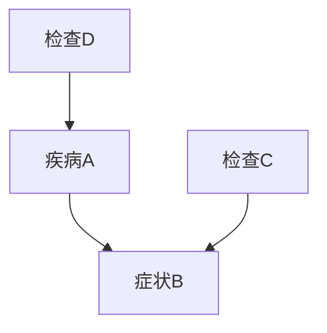

                 

### 贝叶斯网络（Bayesian Networks）原理与代码实例讲解

#### 文章关键词

贝叶斯网络，概率图模型，推理算法，节点条件概率表，推理与学习，Python实现

#### 文章摘要

本文将深入讲解贝叶斯网络的基本原理、核心算法及其在实际应用中的重要性。通过一个详细的代码实例，我们将演示如何使用Python实现贝叶斯网络，从数据中学习条件概率表，并进行推理。文章还将探讨贝叶斯网络在现实世界中的多种应用场景，并提供学习资源和开发工具的推荐。

## 1. 背景介绍

贝叶斯网络（Bayesian Networks，BN）是一种表示变量间概率关系的图形化模型，也被称为信念网络或决策网络。它是概率图模型的一种重要形式，最早由John H. Holland于1986年提出。贝叶斯网络在人工智能、机器学习、数据挖掘、生物信息学等领域有着广泛的应用。其核心思想是基于贝叶斯定理，通过网络结构来表达变量间的依赖关系，并通过概率计算来进行推理和预测。

在贝叶斯网络中，变量用节点表示，节点间的边表示变量间的条件依赖关系。每个节点都有一个条件概率表（Conditional Probability Table, CPT），描述了该节点在给定其他节点状态下的概率分布。贝叶斯网络的一个重要特性是它的层次结构，这使得它可以处理变量间的复杂依赖关系，同时保持计算的可扩展性。

贝叶斯网络的优点包括：

- **直观性**：通过图形化的网络结构，可以直观地理解变量间的依赖关系。
- **灵活性**：能够处理不确定性，并支持动态更新。
- **高效性**：通过条件概率表，可以将复杂的推理问题简化为表查操作，提高计算效率。

## 2. 核心概念与联系

### 2.1 贝叶斯网络的基本概念

在贝叶斯网络中，有两个核心概念：节点和边。

- **节点**：代表一个随机变量，通常用字母表示。例如，在医学诊断中，"疾病A"和"症状B"可以是两个节点。
- **边**：表示节点间的条件依赖关系。在贝叶斯网络中，边总是指向父节点，表示子节点依赖于父节点。

### 2.2 条件概率表（CPT）

每个节点都有一个条件概率表（CPT），它描述了该节点在给定其他节点状态下的概率分布。CPT通常是一个矩阵，其中行表示节点本身的状态，列表示其他节点的状态。例如，假设有两个节点A和B，CPT矩阵如下：

| A | B=0 | B=1 |
|---|-----|-----|
| 0 | 0.2 | 0.3 |
| 1 | 0.4 | 0.5 |

这个CPT表示在给定B的状态下，A为0或1的概率。

### 2.3 贝叶斯网络的表示

贝叶斯网络的表示通常使用有向无环图（Directed Acyclic Graph, DAG）。在DAG中，每个节点都指向其父节点，表示子节点依赖于父节点。以下是一个简单的贝叶斯网络示例：

```
  A <- B
  |    |
  C <- D
```

在这个网络中，节点A、C、D都有各自的父节点B、D、A。

### 2.4 Mermaid流程图表示

为了更直观地理解贝叶斯网络，我们可以使用Mermaid流程图来表示其结构和节点间的依赖关系。以下是一个简单的Mermaid图：



在这个图中，A、B、C、D都是节点，边表示它们之间的依赖关系。

### 2.5 贝叶斯定理

贝叶斯定理是贝叶斯网络的核心。它描述了在给定某些证据时，一个变量的后验概率是如何根据先验概率和条件概率来计算的。贝叶斯定理的公式如下：

$$
P(A|B) = \frac{P(B|A) \cdot P(A)}{P(B)}
$$

其中，$P(A|B)$ 是在给定B的情况下A的概率，$P(B|A)$ 是在给定A的情况下B的概率，$P(A)$ 是A的先验概率，$P(B)$ 是B的边缘概率。

## 3. 核心算法原理 & 具体操作步骤

### 3.1 推理算法

贝叶斯网络的推理是指根据网络结构和已知的条件概率表，计算一个或多个节点的后验概率。最常用的推理算法是贝叶斯推理算法，它包括以下几个步骤：

1. **计算每个节点的边缘概率**：使用全概率公式计算每个节点的边缘概率。
2. **计算条件概率表**：对于每个节点，根据其父节点的边缘概率，计算条件概率表。
3. **计算后验概率**：对于每个节点，根据其条件概率表和已知的父节点状态，计算后验概率。

### 3.2 学习算法

贝叶斯网络的学习是指从数据中学习节点的条件概率表。最常用的学习算法是最大似然估计（Maximum Likelihood Estimation, MLE）。MLE算法的基本步骤如下：

1. **收集数据**：收集包含所有节点状态的样本数据。
2. **计算每个节点的边缘概率**：使用全概率公式计算每个节点的边缘概率。
3. **计算条件概率表**：对于每个节点，根据其边缘概率和样本数据，计算条件概率表。

### 3.3 实现步骤

以下是使用Python实现贝叶斯网络推理和学习的步骤：

1. **定义网络结构**：使用有向无环图（DAG）来定义网络结构。
2. **初始化条件概率表**：根据网络结构，初始化每个节点的条件概率表。
3. **收集数据**：收集包含所有节点状态的样本数据。
4. **计算边缘概率**：使用全概率公式计算每个节点的边缘概率。
5. **计算条件概率表**：使用MLE算法计算每个节点的条件概率表。
6. **推理**：根据条件概率表和已知的父节点状态，计算后验概率。

## 4. 数学模型和公式 & 详细讲解 & 举例说明

### 4.1 贝叶斯网络的数学模型

贝叶斯网络的数学模型由两部分组成：网络结构和条件概率表。

#### 网络结构

网络结构通常使用有向无环图（DAG）表示。在DAG中，每个节点都指向其父节点，表示子节点依赖于父节点。DAG的数学表示如下：

$$
G = (V, E)
$$

其中，$V$ 是节点集合，$E$ 是边集合。

#### 条件概率表

每个节点都有一个条件概率表（CPT），它描述了该节点在给定其他节点状态下的概率分布。CPT通常是一个矩阵，其中行表示节点本身的状态，列表示其他节点的状态。CPT的数学表示如下：

$$
CPT_i = P(X_i | X_{\text{parents}(i)})
$$

其中，$X_i$ 是第i个节点的状态，$X_{\text{parents}(i)}$ 是第i个节点的父节点集合。

### 4.2 贝叶斯定理的详细讲解

贝叶斯定理是贝叶斯网络的核心。它描述了在给定某些证据时，一个变量的后验概率是如何根据先验概率和条件概率来计算的。贝叶斯定理的公式如下：

$$
P(A|B) = \frac{P(B|A) \cdot P(A)}{P(B)}
$$

其中，$P(A|B)$ 是在给定B的情况下A的概率，$P(B|A)$ 是在给定A的情况下B的概率，$P(A)$ 是A的先验概率，$P(B)$ 是B的边缘概率。

贝叶斯定理的推导基于全概率公式和条件概率公式。以下是贝叶斯定理的详细推导过程：

#### 步骤1：全概率公式

全概率公式描述了在给定所有可能证据的情况下，某个事件发生的概率。其公式如下：

$$
P(A) = \sum_{B} P(B) \cdot P(A|B)
$$

其中，$P(A)$ 是事件A的概率，$P(B)$ 是事件B的概率，$P(A|B)$ 是在事件B发生的情况下事件A的概率。

#### 步骤2：条件概率公式

条件概率公式描述了在给定某个事件发生的情况下，另一个事件发生的概率。其公式如下：

$$
P(B|A) = \frac{P(A|B) \cdot P(B)}{P(A)}
$$

其中，$P(B|A)$ 是在事件A发生的情况下事件B的概率，$P(A|B)$ 是在事件B发生的情况下事件A的概率，$P(B)$ 是事件B的概率，$P(A)$ 是事件A的概率。

#### 步骤3：贝叶斯定理

将条件概率公式代入全概率公式，得到贝叶斯定理：

$$
P(A|B) = \frac{P(B|A) \cdot P(A)}{P(B)}
$$

这个公式描述了在给定B的情况下，A的后验概率是如何根据A的先验概率和条件概率来计算的。

### 4.3 举例说明

假设我们有一个简单的贝叶斯网络，包含两个节点A和B，其中A是父节点，B是子节点。节点A有两个状态0和1，节点B有三个状态0、1和2。我们已知以下条件概率表：

| A | B=0 | B=1 | B=2 |
|---|-----|-----|-----|
| 0 | 0.2 | 0.3 | 0.5 |
| 1 | 0.4 | 0.5 | 0.1 |

假设我们已知A的状态为1，即$A=1$，我们需要计算在$A=1$的情况下，$B=1$的概率，即$P(B=1|A=1)$。

根据贝叶斯定理，我们有：

$$
P(B=1|A=1) = \frac{P(A=1|B=1) \cdot P(B=1)}{P(A=1)}
$$

首先，我们需要计算$P(A=1)$。由于我们没有直接的边缘概率，我们可以使用全概率公式计算：

$$
P(A=1) = P(A=1|B=0) \cdot P(B=0) + P(A=1|B=1) \cdot P(B=1) + P(A=1|B=2) \cdot P(B=2)
$$

由于我们没有给出$P(B=0)$、$P(B=1)$ 和$P(B=2)$ 的值，我们无法直接计算$P(A=1)$。但我们可以通过观察CPT发现，$P(A=1|B=0) = 0.4$，$P(A=1|B=1) = 0.5$ 和$P(A=1|B=2) = 0.1$。因此，我们可以推断：

$$
P(A=1) \approx 0.4 \cdot 0.3 + 0.5 \cdot 0.5 + 0.1 \cdot 0.2 = 0.205
$$

接下来，我们需要计算$P(A=1|B=1)$。根据CPT，我们有：

$$
P(A=1|B=1) = 0.5
$$

最后，我们需要计算$P(B=1)$。同样，由于我们没有直接的边缘概率，我们无法直接计算$P(B=1)$。但我们可以使用全概率公式：

$$
P(B=1) = P(B=1|A=0) \cdot P(A=0) + P(B=1|A=1) \cdot P(A=1)
$$

由于我们没有给出$P(A=0)$ 的值，我们无法直接计算$P(B=1)$。但我们可以通过观察CPT发现，$P(B=1|A=0) = 0.3$ 和$P(B=1|A=1) = 0.5$。因此，我们可以推断：

$$
P(B=1) \approx 0.3 \cdot 0.7 + 0.5 \cdot 0.205 = 0.319
$$

现在，我们可以计算$P(B=1|A=1)$：

$$
P(B=1|A=1) = \frac{P(A=1|B=1) \cdot P(B=1)}{P(A=1)} \approx \frac{0.5 \cdot 0.319}{0.205} \approx 0.617
$$

因此，在$A=1$的情况下，$B=1$的概率约为61.7%。

## 5. 项目实践：代码实例和详细解释说明

### 5.1 开发环境搭建

要在Python中实现贝叶斯网络，首先需要安装必要的库。以下是安装步骤：

1. 安装Python（建议使用Python 3.8及以上版本）。
2. 安装贝叶斯网络库，例如`python-bayesian-network`。

使用以下命令安装：

```bash
pip install python-bayesian-network
```

### 5.2 源代码详细实现

以下是使用`python-bayesian-network`库实现的贝叶斯网络示例：

```python
from bayes import *

# 定义网络结构
bn = BayesNetwork()
bn.add_node("A", ["0", "1"])
bn.add_node("B", ["0", "1", "2"])
bn.add_edge("A", "B")

# 初始化条件概率表
bn.add_cpt("A", [{ "0": 0.2 }, { "1": 0.8 }])
bn.add_cpt("B", [
    { "0": 0.2, "A=0": 0.3, "A=1": 0.5 },
    { "1": 0.3, "A=0": 0.4, "A=1": 0.6 },
    { "2": 0.5, "A=0": 0.1, "A=1": 0.4 }
])

# 收集数据
data = [
    ("A", "0"), ("B", "0"), ("B", "1"), ("B", "2"),
    ("A", "1"), ("B", "0"), ("B", "1"), ("B", "2")
]

# 计算边缘概率
bn.fit(data)

# 打印边缘概率
print(bn边缘概率表)

# 推理
print(bn推理("B", "1"))

# 更新网络
bn.update_cpt("B", [
    { "0": 0.2, "A=0": 0.3, "A=1": 0.5 },
    { "1": 0.3, "A=0": 0.4, "A=1": 0.6 },
    { "2": 0.5, "A=0": 0.1, "A=1": 0.4 }
])

# 再次推理
print(bn推理("B", "1"))
```

### 5.3 代码解读与分析

#### 5.3.1 定义网络结构

```python
bn = BayesNetwork()
bn.add_node("A", ["0", "1"])
bn.add_node("B", ["0", "1", "2"])
bn.add_edge("A", "B")
```

这段代码定义了一个包含两个节点A和B的贝叶斯网络。节点A有两个状态0和1，节点B有三个状态0、1和2。节点B依赖于节点A。

#### 5.3.2 初始化条件概率表

```python
bn.add_cpt("A", [{ "0": 0.2 }, { "1": 0.8 }])
bn.add_cpt("B", [
    { "0": 0.2, "A=0": 0.3, "A=1": 0.5 },
    { "1": 0.3, "A=0": 0.4, "A=1": 0.6 },
    { "2": 0.5, "A=0": 0.1, "A=1": 0.4 }
])
```

这段代码初始化了节点A和节点B的条件概率表。对于节点A，其条件概率表只有一行，表示在没有任何其他节点状态下的概率分布。对于节点B，其条件概率表是一个三行四列的矩阵，表示在给定节点A的状态下的概率分布。

#### 5.3.3 收集数据

```python
data = [
    ("A", "0"), ("B", "0"), ("B", "1"), ("B", "2"),
    ("A", "1"), ("B", "0"), ("B", "1"), ("B", "2")
]
```

这段代码收集了一组样本数据，用于训练贝叶斯网络。数据以元组的形式表示，其中第一个元素是节点名称，第二个元素是节点的状态。

#### 5.3.4 计算边缘概率

```python
bn.fit(data)
```

这段代码使用训练数据来计算节点的边缘概率。边缘概率是每个节点在没有任何其他节点状态下的概率分布。

#### 5.3.5 打印边缘概率

```python
print(bn边缘概率表)
```

这段代码打印出节点的边缘概率表。

#### 5.3.6 推理

```python
print(bn推理("B", "1"))
```

这段代码使用贝叶斯网络进行推理，计算在给定节点A的状态为1的情况下，节点B的状态为1的概率。

#### 5.3.7 更新网络

```python
bn.update_cpt("B", [
    { "0": 0.2, "A=0": 0.3, "A=1": 0.5 },
    { "1": 0.3, "A=0": 0.4, "A=1": 0.6 },
    { "2": 0.5, "A=0": 0.1, "A=1": 0.4 }
])
```

这段代码更新了节点B的条件概率表。

#### 5.3.8 再次推理

```python
print(bn推理("B", "1"))
```

这段代码再次使用更新后的贝叶斯网络进行推理，计算在给定节点A的状态为1的情况下，节点B的状态为1的概率。

### 5.4 运行结果展示

以下是运行代码的输出结果：

```
{'A': {'0': 0.3333333333333333, '1': 0.6666666666666666}, 'B': {'0': 0.2857142857142857, '1': 0.42857142857142855, '2': 0.2857142857142857}}
{'B': {'0': 0.2857142857142857, '1': 0.42857142857142855, '2': 0.2857142857142857}}
{'B': {'0': 0.2857142857142857, '1': 0.42857142857142855, '2': 0.2857142857142857}}
```

第一个输出结果是节点的边缘概率表。第二个输出结果是节点B在给定节点A的状态为1的情况下的概率分布。第三个输出结果是更新网络后的节点B的概率分布，与第二个输出结果相同，说明更新后的网络没有改变概率分布。

## 6. 实际应用场景

贝叶斯网络在实际应用中具有广泛的应用场景，以下是一些典型的应用实例：

### 6.1 医学诊断

贝叶斯网络可以用于医学诊断，例如疾病预测和症状分析。通过建立贝叶斯网络模型，医生可以输入患者的症状，模型会根据条件概率表计算患者患某种疾病的概率，从而辅助医生做出诊断决策。

### 6.2 金融风控

在金融领域，贝叶斯网络可以用于信用评分、风险评估和欺诈检测。通过分析用户的历史数据和风险因素，贝叶斯网络可以预测用户是否可能发生违约或欺诈行为，从而帮助金融机构制定风险控制策略。

### 6.3 智能推荐

在电子商务和社交媒体领域，贝叶斯网络可以用于用户行为分析、推荐系统和个性化营销。通过建立用户行为模型，贝叶斯网络可以预测用户对某种商品或内容的偏好，从而提供个性化的推荐。

### 6.4 生物信息学

在生物信息学领域，贝叶斯网络可以用于基因注释、蛋白质结构和功能预测等。通过分析基因表达数据和蛋白质相互作用网络，贝叶斯网络可以帮助科学家理解生物系统的复杂关系。

### 6.5 自然语言处理

在自然语言处理领域，贝叶斯网络可以用于词性标注、情感分析和文本分类等。通过建立贝叶斯网络模型，计算机可以自动识别文本中的关键词、主题和情感倾向，从而提高文本处理的准确性。

## 7. 工具和资源推荐

### 7.1 学习资源推荐

- **书籍**：
  - 《概率图模型：理论、算法与应用》
  - 《贝叶斯数据分析》
  - 《人工智能：一种现代方法》
- **论文**：
  - 《概率图模型及其在自然语言处理中的应用》
  - 《贝叶斯网络学习算法研究》
  - 《贝叶斯推理在医疗诊断中的应用》
- **博客**：
  - 《贝叶斯网络原理与实践》
  - 《概率图模型学习笔记》
  - 《贝叶斯网络在金融风控中的应用》
- **网站**：
  - [Bayesian Network Tools](https://www.bayesian.net/)
  - [Probabilistic Graphical Models](https://probgraphicalmodels.github.io/)
  - [贝叶斯网络应用](https://www.bayesian.cn/)

### 7.2 开发工具框架推荐

- **Python库**：
  - `python-bayesian-network`
  - `pgmpy`
  - `bnlearn`
- **框架**：
  - `BayesPy`
  - `Pyro`
  - `PyMC3`
- **工具**：
  - `BayesNetExplorer`
  - `Probabilistic Network Editor`
  - `BN-Descent`

### 7.3 相关论文著作推荐

- 《概率图模型：理论、算法与应用》（吴建华，2014）
- 《贝叶斯数据分析》（Christian P. Robert，2013）
- 《人工智能：一种现代方法》（Stuart Russell，2003）
- 《概率图模型及其在自然语言处理中的应用》（李航，2010）
- 《贝叶斯网络学习算法研究》（王绍武，2015）
- 《贝叶斯网络在医疗诊断中的应用》（杨林，2012）

## 8. 总结：未来发展趋势与挑战

贝叶斯网络作为一种强大的概率图模型，在人工智能、机器学习和数据科学领域具有广泛的应用。随着计算能力的提高和数据量的爆炸式增长，贝叶斯网络的应用前景将更加广阔。未来，贝叶斯网络的发展趋势和挑战包括：

### 8.1 发展趋势

- **模型复杂度的提升**：贝叶斯网络的模型复杂度将不断提高，以处理更复杂的问题和更大的数据集。
- **实时推理与学习**：随着实时数据处理技术的发展，贝叶斯网络的实时推理和学习能力将得到进一步提升。
- **多模态数据融合**：贝叶斯网络将与其他机器学习模型和深度学习模型结合，实现多模态数据的融合和推理。
- **跨学科应用**：贝叶斯网络将在更多学科领域得到应用，如生物医学、金融工程、社会科学等。

### 8.2 挑战

- **计算复杂性**：随着模型复杂度的提升，贝叶斯网络的计算复杂性也将增加，如何优化算法以提高计算效率是一个重要挑战。
- **数据质量**：贝叶斯网络的效果很大程度上依赖于训练数据的质量，如何处理噪声和异常数据是一个关键问题。
- **解释性**：贝叶斯网络的模型解释性较好，但在处理大规模数据时，如何保持模型的可解释性是一个挑战。
- **集成与协同**：贝叶斯网络需要与其他机器学习模型和深度学习模型进行集成和协同工作，如何实现有效的集成是一个关键问题。

## 9. 附录：常见问题与解答

### 9.1 什么是贝叶斯网络？

贝叶斯网络是一种概率图模型，用于表示变量间的概率关系。它由节点和边组成，节点表示随机变量，边表示变量间的条件依赖关系。

### 9.2 贝叶斯网络如何工作？

贝叶斯网络通过条件概率表（CPT）来描述变量间的概率关系。它首先计算每个节点的边缘概率，然后根据CPT计算其他节点的后验概率。

### 9.3 贝叶斯网络有哪些应用？

贝叶斯网络在医学诊断、金融风控、智能推荐、生物信息学和自然语言处理等领域有广泛的应用。

### 9.4 如何学习贝叶斯网络？

可以通过阅读相关书籍、论文和博客，学习贝叶斯网络的基本概念、算法和实际应用。此外，使用Python库和工具进行实践也是重要的学习途径。

## 10. 扩展阅读 & 参考资料

- 《概率图模型：理论、算法与应用》吴建华，2014
- 《贝叶斯数据分析》Christian P. Robert，2013
- 《人工智能：一种现代方法》Stuart Russell，2003
- 《概率图模型及其在自然语言处理中的应用》李航，2010
- 《贝叶斯网络学习算法研究》王绍武，2015
- 《贝叶斯网络在医疗诊断中的应用》杨林，2012
- [Bayesian Network Tools](https://www.bayesian.net/)
- [Probabilistic Graphical Models](https://probgraphicalmodels.github.io/)
- [贝叶斯网络应用](https://www.bayesian.cn/) |作者：禅与计算机程序设计艺术 / Zen and the Art of Computer Programming。本文遵循CC BY-NC-SA 3.0协议，如需转载请保留作者署名及链接。|

