                 

### 1. 背景介绍

贝壳找房（Beike）是中国领先的房地产服务平台，由链家网升级而来，于2018年正式成立。贝壳找房致力于为用户提供全面、精准、高效的房产交易服务，覆盖新房、二手房、租赁、金融服务等多个领域。随着互联网技术的不断发展，贝壳找房在技术创新和产品优化方面不断深耕，吸引了许多优秀的开发者和架构师加入。

在贝壳找房的招聘体系中，社招前端架构师是一个重要的岗位，承担着平台前端架构设计、技术难题攻关、团队技术培训等多项职责。为了确保招聘到符合岗位要求的人才，贝壳找房的面试过程非常严格，涉及到技术面试、项目实践、行为面试等多个环节。本文将重点分析贝壳找房2025年社招前端架构师面试的重点，帮助准备面试的开发者了解面试的核心内容和考察方向。

贝壳找房的前端架构师岗位要求应聘者具备扎实的前端技术基础、丰富的项目经验以及对前沿技术的敏锐洞察力。在2025年的招聘中，贝壳找房对前端架构师的面试重点主要围绕以下几个方向：

1. **前端技术深度掌握**：包括对JavaScript、HTML、CSS等基础技术的熟练运用，以及对React、Vue、Angular等主流前端框架的深入理解和应用。
2. **性能优化与算法**：了解前端性能优化的策略，包括网络优化、资源加载优化、代码优化等，以及常见算法的原理和应用。
3. **系统设计与架构**：包括前端系统的设计理念、架构模式、模块划分等，以及如何处理高并发、大数据量等复杂场景。
4. **代码规范与质量**：熟悉代码规范，能够编写高质量、可维护的代码，并且对代码审查有深刻的认识。
5. **团队协作与沟通**：具备良好的团队协作能力和沟通能力，能够在团队中发挥关键作用，推动项目进展。

本文将依次探讨这些面试重点，结合具体实例和案例分析，帮助开发者更好地准备贝壳找房的前端架构师面试。

---

### 2. 核心概念与联系

#### 前端技术深度掌握

要成为贝壳找房的前端架构师，首先需要深刻理解并熟练掌握前端基础技术，这包括JavaScript、HTML和CSS。

- **JavaScript**：JavaScript是前端开发的核心语言，它不仅负责页面的动态交互，还涉及到后台API的调用、异步处理等复杂功能。贝壳找房的面试可能会考查以下方面的知识点：

  - JavaScript基本语法和数据类型；
  - 执行上下文和作用域；
  - 闭包和原型链；
  - 事件循环和异步编程（如Promises、async/await）。

- **HTML**：HTML是网页内容的结构基础，贝壳找房的面试可能会涉及以下内容：

  - 标签的使用和语义化；
  - 网页布局（如Flexbox、Grid）；
  - 表单处理和表单验证。

- **CSS**：CSS负责页面的样式和布局，贝壳找房的面试可能会考察：

  - CSS选择器；
  - 布局技术（如响应式设计、媒体查询）；
  - 预处理器（如Sass、Less）的使用。

#### 前端框架的理解与应用

除了基础技术，贝壳找房的面试还会重点考查前端框架的理解与应用。目前主流的前端框架有React、Vue和Angular，每种框架都有其独特的优势和适用场景。

- **React**：React由Facebook推出，以组件化和虚拟DOM为核心。贝壳找房的面试可能会涉及：

  - React的组件生命周期；
  - Hooks的使用；
  - 受控组件与非受控组件；
  - 服务器端渲染（SSR）和静态站点生成（SSG）。

- **Vue**：Vue由尤雨溪开发，以其简洁和高效著称。贝壳找房的面试可能会关注：

  - Vue的数据绑定和指令系统；
  - Vue的组件通信和路由；
  - Vuex的状态管理。

- **Angular**：Angular是由Google推出的全功能框架，贝壳找房的面试可能会考察：

  - Angular的模块和组件；
  - Dependency Injection；
  - Directives和Pipes。

#### 性能优化与算法

前端性能优化是贝壳找房面试的一个重点，它涉及到多个方面：

- **网络优化**：包括优化HTTP请求、使用CDN、减少重绘和回流等。

- **资源加载优化**：如代码分割、懒加载、预加载等。

- **代码优化**：包括压缩、混淆、Tree Shaking等。

此外，贝壳找房的面试还可能涉及以下算法原理：

- **排序算法**（如快速排序、归并排序等）；
- **搜索算法**（如二分搜索、深度优先搜索等）；
- **数据结构**（如栈、队列、哈希表等）。

#### 系统设计与架构

贝壳找房的前端架构师需要具备系统设计与架构的能力，能够处理高并发、大数据量等复杂场景。以下是相关的核心概念：

- **模块化**：将代码分割成独立的模块，便于维护和复用。

- **组件化**：将页面分割成组件，每个组件独立开发、测试和部署。

- **微前端**：通过将前端应用拆分成多个独立的部分，实现各个部分的独立开发、部署和运维。

- **服务端渲染**（SSR）和静态站点生成（SSG）。

- **缓存策略**：包括浏览器缓存、服务端缓存、分布式缓存等。

- **数据流管理**：如Redux、Vuex、MobX等状态管理库。

- **负载均衡**：如何处理高并发请求，确保系统稳定运行。

#### 代码规范与质量

贝壳找房非常注重代码规范和质量，这包括：

- **编码规范**：如代码风格、命名规范、注释规范等。

- **代码质量**：包括代码的可读性、可维护性、可测试性等。

- **代码审查**：如何进行代码审查，确保代码质量。

- **自动化测试**：包括单元测试、集成测试、端到端测试等。

#### 团队协作与沟通

最后，贝壳找房的前端架构师需要具备良好的团队协作和沟通能力，能够在团队中发挥关键作用，推动项目进展。这包括：

- **技术沟通**：如何与技术团队进行有效沟通，确保技术方案的一致性。
- **项目管理**：如何管理项目进度、风险评估和资源分配。
- **团队协作**：如何与团队成员合作，提高团队效率和项目质量。

#### Mermaid 流程图

为了更好地理解上述核心概念之间的联系，我们使用Mermaid绘制一个简化的流程图：

```mermaid
graph TB
    A[前端基础] --> B[JavaScript]
    A --> C[HTML]
    A --> D[CSS]
    E[前端框架] --> F[React]
    E --> G[Vue]
    E --> H[Angular]
    I[性能优化] --> J[网络优化]
    I --> K[资源加载优化]
    I --> L[代码优化]
    M[算法原理] --> N[排序算法]
    M --> O[搜索算法]
    M --> P[数据结构]
    Q[系统设计] --> R[模块化]
    Q --> S[组件化]
    Q --> T[微前端]
    Q --> U[SSR/SSG]
    Q --> V[缓存策略]
    Q --> W[数据流管理]
    Q --> X[负载均衡]
    Y[代码质量] --> Z[编码规范]
    Y --> AA[代码质量]
    Y --> BB[代码审查]
    Y --> CC[自动化测试]
    DD[团队协作] --> EE[技术沟通]
    DD --> FF[项目管理]
    DD --> GG[团队协作]
```



通过这个流程图，我们可以清晰地看到前端架构师所需掌握的核心概念及其相互联系。

---

在本节中，我们详细介绍了贝壳找房前端架构师面试所需的核心概念和技能，包括前端基础技术、前端框架、性能优化与算法、系统设计与架构、代码规范与质量以及团队协作与沟通。这些核心概念构成了前端架构师专业素养的基础，是贝壳找房在面试过程中重点考察的内容。接下来，我们将进一步探讨这些核心概念的具体原理和应用，帮助开发者更深入地理解和准备面试。

### 3. 核心算法原理 & 具体操作步骤

在前端架构师面试中，核心算法原理是不可或缺的一部分。这些算法不仅考察应聘者的技术深度，也反映其对性能优化和数据处理的实际能力。下面我们将介绍几个常见的核心算法原理，包括排序算法、搜索算法和数据结构等，并提供具体操作步骤。

#### 排序算法

排序算法是计算机科学中非常重要的算法，用于对数据进行排序。贝壳找房的前端架构师面试可能会涉及以下几种常见的排序算法：

1. **快速排序（Quick Sort）**：

   - **原理**：快速排序是一种分治算法，其基本思想是通过一趟排序将待排序的数据分割成独立的两部分，其中一部分的所有数据都比另一部分的所有数据要小，然后再按此方法对这两部分数据分别进行快速排序，整个排序过程可以递归进行，以此达到整个数据变成有序序列。
   - **步骤**：
     1. 选择一个基准元素；
     2. 将比基准元素小的元素放在其左边，比其大的放在右边；
     3. 对左右两部分递归执行快速排序。
   - **实现代码**（Python示例）：

     ```python
     def quick_sort(arr):
         if len(arr) <= 1:
             return arr
         pivot = arr[len(arr) // 2]
         left = [x for x in arr if x < pivot]
         middle = [x for x in arr if x == pivot]
         right = [x for x in arr if x > pivot]
         return quick_sort(left) + middle + quick_sort(right)
     ```

2. **归并排序（Merge Sort）**：

   - **原理**：归并排序同样采用分治策略，将待排序的序列不断分割成更小的序列，每一小序列本身是有序的，然后将这些有序的小序列合并成最终的有序序列。
   - **步骤**：
     1. 将待排序的序列不断分割成大小相同的子序列；
     2. 对每个子序列进行排序；
     3. 将有序子序列合并成最终的有序序列。
   - **实现代码**（Python示例）：

     ```python
     def merge_sort(arr):
         if len(arr) <= 1:
             return arr
         mid = len(arr) // 2
         left = merge_sort(arr[:mid])
         right = merge_sort(arr[mid:])
         return merge(left, right)

     def merge(left, right):
         result = []
         while left and right:
             if left[0] < right[0]:
                 result.append(left.pop(0))
             else:
                 result.append(right.pop(0))
         result.extend(left or right)
         return result
     ```

#### 搜索算法

搜索算法用于在数据结构中查找特定的元素，贝壳找房的前端架构师面试可能会涉及以下两种常见的搜索算法：

1. **二分搜索（Binary Search）**：

   - **原理**：二分搜索是在有序数组中查找特定元素的搜索算法，其基本思想是每次将待查找的区间缩小一半，直到找到元素或确定元素不存在。
   - **步骤**：
     1. 确定区间的上下限（low和high）；
     2. 计算区间的中点（mid）；
     3. 比较目标值与中点值，根据比较结果调整上下限；
     4. 重复步骤2和3，直到找到目标值或上下限重叠。
   - **实现代码**（Python示例）：

     ```python
     def binary_search(arr, target):
         low = 0
         high = len(arr) - 1
         while low <= high:
             mid = (low + high) // 2
             if arr[mid] == target:
                 return mid
             elif arr[mid] < target:
                 low = mid + 1
             else:
                 high = mid - 1
         return -1
     ```

2. **深度优先搜索（DFS）和广度优先搜索（BFS）**：

   - **原理**：DFS和BFS都是图搜索算法，DFS沿着一个路径一直走到底，如果遇到障碍就返回上一次分叉点，继续探索另一条路径；BFS则是逐层遍历，一层一层地向外扩展。
   - **步骤**：
     1. 初始化起点和访问列表；
     2. 深度优先搜索：选择未访问的节点，进行深度优先搜索，并标记为已访问；
     3. 广度优先搜索：使用队列进行层次遍历，每次取出队首元素，并将其相邻未访问的节点加入队列。
   - **实现代码**（Python示例）：

     ```python
     def dfs(graph, start, visited=None):
         if visited is None:
             visited = set()
         visited.add(start)
         for neighbor in graph[start]:
             if neighbor not in visited:
                 dfs(graph, neighbor, visited)

     def bfs(graph, start):
         visited = set()
         queue = deque([start])
         while queue:
             vertex = queue.popleft()
             if vertex not in visited:
                 visited.add(vertex)
                 for neighbor in graph[vertex]:
                     if neighbor not in visited:
                         queue.append(neighbor)
     ```

#### 数据结构

数据结构是算法的基础，贝壳找房的前端架构师面试可能会涉及以下几种常见的数据结构：

1. **栈（Stack）和队列（Queue）**：

   - **原理**：栈是一种后进先出（LIFO）的数据结构，队列是一种先进先出（FIFO）的数据结构。
   - **步骤**：
     1. 栈：push（压栈）和pop（出栈）；
     2. 队列：enqueue（入队）和dequeue（出队）。
   - **实现代码**（Python示例）：

     ```python
     class Stack:
         def __init__(self):
             self.items = []

         def push(self, item):
             self.items.append(item)

         def pop(self):
             return self.items.pop()

     class Queue:
         def __init__(self):
             self.items = deque()

         def enqueue(self, item):
             self.items.append(item)

         def dequeue(self):
             return self.items.popleft()
     ```

2. **哈希表（Hash Table）**：

   - **原理**：哈希表是一种利用哈希函数将键映射到表中的存储技术，能够快速查找和插入元素。
   - **步骤**：
     1. 选择合适的哈希函数；
     2. 计算哈希值并存储元素；
     3. 冲突解决（如链地址法、开放地址法）。
   - **实现代码**（Python示例）：

     ```python
     class HashTable:
         def __init__(self):
             self.size = 10
             self.table = [[] for _ in range(self.size)]

         def hash_function(self, key):
             return key % self.size

         def insert(self, key, value):
             index = self.hash_function(key)
             bucket = self.table[index]
             for i, (k, v) in enumerate(bucket):
                 if k == key:
                     bucket[i] = (key, value)
                     return
             bucket.append((key, value))

         def get(self, key):
             index = self.hash_function(key)
             bucket = self.table[index]
             for k, v in bucket:
                 if k == key:
                     return v
             return None
     ```

通过以上对核心算法原理和具体操作步骤的详细介绍，我们可以看到，贝壳找房的前端架构师面试不仅考查算法的理论知识，还强调实际应用能力。开发者需要通过深入理解和熟练掌握这些算法，才能在面试中脱颖而出。接下来，我们将继续探讨数学模型和公式，帮助开发者更好地应对面试中的相关题目。

### 4. 数学模型和公式 & 详细讲解 & 举例说明

在前端架构师的面试中，数学模型和公式的理解与应用是考察应聘者技术水平的重要方面。这些数学模型不仅在算法设计中起到关键作用，还能帮助开发者优化性能、分析复杂系统的行为。以下我们将详细讲解几个关键的数学模型和公式，并通过具体示例来说明它们的应用。

#### 加权平均数（Weighted Average）

加权平均数是用于计算一组数值的平均值，其中每个数值根据其重要性赋予不同的权重。加权平均数的公式如下：

$$
\text{加权平均数} = \frac{\sum_{i=1}^{n} w_i \cdot x_i}{\sum_{i=1}^{n} w_i}
$$

其中，$w_i$ 是第 $i$ 个数值的权重，$x_i$ 是第 $i$ 个数值，$n$ 是数值的总数。

**举例说明**：

假设一家电商网站需要计算不同商品的平均售价，其中每个商品的售价根据其销量赋予不同的权重。数据如下：

| 商品名称 | 售价（元） | 销量（件） |
| --- | --- | --- |
| 商品A | 200 | 10 |
| 商品B | 300 | 20 |
| 商品C | 400 | 30 |

计算平均售价的步骤如下：

1. 计算加权总售价：$200 \times 10 + 300 \times 20 + 400 \times 30 = 2000 + 6000 + 12000 = 20000$ 元。
2. 计算总权重：$10 + 20 + 30 = 60$ 件。
3. 计算加权平均售价：$\frac{20000}{60} \approx 333.33$ 元。

因此，该电商网站的平均售价为333.33元。

#### 最小生成树（Minimum Spanning Tree）

最小生成树（MST）是一个无向加权图中包含所有顶点的树，其权重之和最小。普里姆（Prim）和克鲁斯卡尔（Kruskal）是最常见的两种计算MST的算法。

**普里姆算法**：

普里姆算法从某个顶点开始，逐步扩展生成最小生成树。其基本步骤如下：

1. 初始化：选择一个顶点作为起点，将其加入生成树，其他顶点放入一个优先队列中。
2. 循环直到所有顶点被加入生成树：
   1. 从优先队列中提取权重最小的边。
   2. 如果边的另一端顶点不在生成树中，则将其加入生成树。
   3. 更新优先队列中的边权重。

**克鲁斯卡尔算法**：

克鲁斯卡尔算法按照边权重从小到大排序，逐步选择边并构建最小生成树。其基本步骤如下：

1. 初始化：将所有边按权重排序。
2. 循环直到生成树包含所有顶点：
   1. 选择权重最小的边。
   2. 如果选择该边不会形成环，则将其加入生成树。

**示例**：

给定图如下，计算其最小生成树：

```
顶点：A, B, C, D, E
边：AB(4), BC(3), CD(2), DE(5), CE(6), AD(7)
```

使用普里姆算法计算MST：

1. 选择顶点A作为起点，加入生成树。
2. 从优先队列中提取边AD(7)，但D已在生成树中，不加入。
3. 提取边BC(3)，D不在生成树中，加入生成树。
4. 提取边CD(2)，E不在生成树中，加入生成树。
5. 提取边AB(4)，B不在生成树中，加入生成树。

最终生成树为：A-B-C-D-E，总权重为$4 + 3 + 2 + 4 = 13$。

**示例**：

使用克鲁斯卡尔算法计算MST：

1. 按权重排序边：AD(7), BC(3), CD(2), DE(5), CE(6), AB(4)。
2. 选择边BC(3)，D不在生成树中，加入生成树。
3. 选择边CD(2)，E不在生成树中，加入生成树。
4. 选择边AB(4)，B不在生成树中，加入生成树。
5. 选择边DE(5)，E已在生成树中，不加入。
6. 选择边CE(6)，C不在生成树中，加入生成树。

最终生成树为：A-B-C-D-E，总权重为$3 + 2 + 4 + 6 = 15$。

#### 动态规划（Dynamic Programming）

动态规划是一种解决最优化问题的算法思想，通过将复杂问题分解成多个子问题，并存储子问题的解，以避免重复计算。常见的动态规划问题包括背包问题、最长公共子序列、最长递增子序列等。

**最长公共子序列（LCS）**：

给定两个序列$X = \{x_1, x_2, ..., x_m\}$和$Y = \{y_1, y_2, ..., y_n\}$，最长公共子序列是两个序列中长度最长的相同子序列。

LCS的动态规划公式如下：

$$
LCS[i][j] =
\begin{cases}
LCS[i-1][j-1] + 1, & \text{如果} x_i = y_j \\
\max(LCS[i-1][j], LCS[i][j-1]), & \text{如果} x_i \neq y_j
\end{cases}
$$

**举例说明**：

给定序列$X = \{1, 2, 3, 4\}$和$Y = \{2, 5, 3, 4\}$，计算LCS：

```
  Y: 2 5 3 4
X:   1 2 3 4
   0 0 0 0
  1 0 0 0
  1 1 0 0
  1 1 1 0
  1 1 1 1
```

LCS为$\{2, 3, 4\}$，长度为3。

通过上述对加权平均数、最小生成树和动态规划等数学模型和公式的详细讲解和举例说明，我们可以看到，这些数学工具在解决复杂算法问题中的重要性。贝壳找房的前端架构师面试会通过这些数学问题来考察应聘者的技术深度和解决问题的能力。在接下来的部分，我们将通过具体的项目实践和代码实例，帮助开发者更好地理解和应用这些数学模型。

### 5. 项目实践：代码实例和详细解释说明

为了更好地理解前文所述的核心算法原理和数学模型，下面我们将通过一个具体的项目实践，展示如何在实际开发中应用这些知识，并提供详细的代码实例和解释说明。

#### 项目背景

假设贝壳找房需要开发一个房屋信息展示系统，系统需要根据用户的位置信息推荐附近的房屋。该项目涉及到地图数据处理、搜索算法以及前端性能优化等多个技术点。我们将通过以下步骤实现这一项目：

1. **环境搭建**：配置开发环境，选择合适的前端框架和地图API。
2. **数据获取**：从贝壳找房的API获取房屋数据。
3. **地图展示**：使用地图API将房屋位置展示在页面上。
4. **搜索功能**：实现搜索算法，根据用户输入快速定位附近的房屋。
5. **性能优化**：优化地图加载和搜索性能。

#### 5.1 开发环境搭建

**技术栈选择**：

- **前端框架**：使用Vue.js，因其易于学习和使用，同时具备较高的性能。
- **地图API**：选择高德地图API，因其在国内广泛应用，提供丰富的地图功能和API接口。
- **后端服务**：使用Node.js和Express框架搭建简单的后端服务，用于处理前端请求并与贝壳找房API进行交互。

**环境配置**：

1. 安装Node.js和npm。
2. 创建Vue.js项目，使用Vue CLI：

   ```bash
   vue create house-recommendation-system
   ```

3. 安装所需依赖：

   ```bash
   cd house-recommendation-system
   npm install vue-router axios
   ```

4. 配置高德地图API密钥：

   在Vue项目的`vue.config.js`文件中添加以下配置：

   ```javascript
   module.exports = {
     publicPath: process.env.NODE_ENV === 'production' ? '/production-sub-path/' : '/',
     devServer: {
       open: true,
       proxy: {
         '/api': {
           target: '<你的高德地图API代理地址>',
           changeOrigin: true,
           pathRewrite: {
             '^/api': ''
           }
         }
       }
     }
   };
   ```

#### 5.2 源代码详细实现

**5.2.1 数据获取**

在Vue项目中，使用axios库获取贝壳找房的房屋数据：

```javascript
// src/api/houseService.js
import axios from 'axios';

const HOUSE_API_URL = 'https://api.beike.com/v1/houses';

export function fetchHouses() {
  return axios.get(HOUSE_API_URL).then(response => response.data);
}
```

**5.2.2 地图展示**

在Vue组件中使用高德地图API，展示房屋位置：

```vue
<!-- src/components/Map.vue -->
<template>
  <div class="map-container">
    <amap vid="map" :center="center" :zoom="zoom" class="map">
      <amap-marker
        v-for="house in houses"
        :key="house.id"
        :position="house.position"
      >
        <template>
          <icon name="home" style="color: blue;"></icon>
        </template>
      </amap-marker>
    </amap>
  </div>
</template>

<script>
import { AMap, AMapMarker } from 'vue-amap';

export default {
  components: {
    AMap,
    AMapMarker
  },
  data() {
    return {
      center: [116.397428, 39.90923],
      zoom: 12,
      houses: []
    };
  },
  created() {
    this.fetchHouses();
  },
  methods: {
    fetchHouses() {
      fetchHouses().then(houses => {
        this.houses = houses;
      });
    }
  }
};
</script>

<style scoped>
.map-container {
  height: 400px;
}
.map {
  width: 100%;
  height: 100%;
}
</style>
```

**5.2.3 搜索功能**

实现搜索功能，根据用户输入的地理位置快速定位附近的房屋：

```javascript
// src/components/Search.vue
<template>
  <div class="search-container">
    <input type="text" v-model="location" placeholder="输入位置" />
    <button @click="searchHouses">搜索</button>
  </div>
</template>

<script>
import { mapActions } from 'vuex';

export default {
  data() {
    return {
      location: ''
    };
  },
  methods: {
    ...mapActions(['fetchHousesByLocation']),
    searchHouses() {
      this.fetchHousesByLocation(this.location);
    }
  }
};
</script>

<style scoped>
.search-container {
  margin-bottom: 20px;
}
</style>
```

**5.2.4 性能优化**

为了优化前端性能，我们采用以下策略：

1. **懒加载**：对地图上的房屋信息采用懒加载，仅在用户滚动到地图特定区域时加载附近的房屋数据。
2. **缓存策略**：利用前端缓存机制，减少对后端API的请求次数。
3. **代码分割**：将不同功能模块分割成不同的代码包，按需加载。

```javascript
// src/router/index.js
import Vue from 'vue';
import Router from 'vue-router';
import Map from '@/components/Map.vue';
import Search from '@/components/Search.vue';

Vue.use(Router);

export default new Router({
  routes: [
    {
      path: '/',
      name: 'Map',
      component: Map
    },
    {
      path: '/search',
      name: 'Search',
      component: Search
    }
  ]
});
```

通过以上代码实例，我们可以看到如何在一个实际项目中应用前文提到的核心算法原理和数学模型。首先，我们配置了开发环境并选择了合适的技术栈；接着，通过API获取数据，使用地图API展示数据；然后，实现搜索功能，并采用多种策略优化性能。这个项目实践不仅帮助开发者深入理解相关技术，也为面试中的项目实践提供了实际的参考。

### 5.3 代码解读与分析

在上一个部分中，我们详细介绍了如何使用Vue.js和高德地图API搭建一个房屋信息展示系统。在这个部分，我们将深入分析代码，解释每个关键部分的实现原理和细节，并提供性能优化的具体实现。

#### 5.3.1 数据获取模块分析

数据获取模块主要涉及与贝壳找房API的交互，使用axios库进行数据请求。关键代码如下：

```javascript
// src/api/houseService.js
import axios from 'axios';

const HOUSE_API_URL = 'https://api.beike.com/v1/houses';

export function fetchHouses() {
  return axios.get(HOUSE_API_URL).then(response => response.data);
}
```

这里，`fetchHouses`函数使用axios库发起GET请求，获取房屋数据。`HOUSE_API_URL`是贝壳找房API的URL。`then`方法用于处理成功的响应，将数据返回。

**性能优化**：

为了优化性能，我们可以采用缓存策略，避免频繁发起API请求。具体实现如下：

```javascript
// src/api/houseService.js
import axios from 'axios';

const HOUSE_API_URL = 'https://api.beike.com/v1/houses';
const HOUSES_CACHE = {};

export function fetchHouses() {
  if (HOUSES_CACHE.hasOwnProperty('data')) {
    return Promise.resolve(HOUSES_CACHE.data);
  }
  return axios.get(HOUSE_API_URL).then(response => {
    HOUSES_CACHE.data = response.data;
    return response.data;
  });
}
```

这里，我们引入了一个`HOUSES_CACHE`对象，用于存储获取到的房屋数据。在每次发起请求前，首先检查缓存中是否已有数据。如果缓存中存在数据，则直接返回缓存数据，否则发起API请求并将数据存储在缓存中。

#### 5.3.2 地图展示模块分析

地图展示模块使用高德地图API实现，关键代码如下：

```vue
<!-- src/components/Map.vue -->
<template>
  <div class="map-container">
    <amap vid="map" :center="center" :zoom="zoom" class="map">
      <amap-marker
        v-for="house in houses"
        :key="house.id"
        :position="house.position"
      >
        <template>
          <icon name="home" style="color: blue;"></icon>
        </template>
      </amap-marker>
    </amap>
  </div>
</template>

<script>
import { AMap, AMapMarker } from 'vue-amap';

export default {
  components: {
    AMap,
    AMapMarker
  },
  data() {
    return {
      center: [116.397428, 39.90923],
      zoom: 12,
      houses: []
    };
  },
  created() {
    this.fetchHouses();
  },
  methods: {
    fetchHouses() {
      fetchHouses().then(houses => {
        this.houses = houses;
      });
    }
  }
};
</script>

<style scoped>
.map-container {
  height: 400px;
}
.map {
  width: 100%;
  height: 100%;
}
</style>
```

这里，`Map`组件负责初始化地图、设置地图中心和缩放级别，并从`houses`数据源获取房屋位置，使用`amap-marker`组件在地图上标注房屋位置。

**性能优化**：

为了提升地图展示的性能，我们采用懒加载策略，仅在用户滚动到地图特定区域时加载附近的房屋数据。具体实现如下：

```javascript
<script>
// ...
data() {
  return {
    center: [116.397428, 39.90923],
    zoom: 12,
    houses: [],
    loadedHouses: []
  };
},
created() {
  this.fetchHouses();
},
methods: {
  fetchHouses() {
    fetchHouses().then(houses => {
      this.houses = houses;
      this.loadedHouses = houses.filter(house => this.isInViewport(house.position));
    });
  },
  isInViewport(position) {
    // 实现判断位置是否在视口的逻辑
  }
},
watch: {
  loadedHouses(houses) {
    houses.forEach(house => {
      if (!this.isInViewport(house.position)) {
        this.loadedHouses.splice(this.loadedHouses.indexOf(house), 1);
      }
    });
  }
}
// ...
</script>
```

这里，我们添加了一个`loadedHouses`数组，用于存储当前已加载的房屋数据。在`fetchHouses`方法中，将所有房屋数据加载到`houses`数组中，并过滤出在视口内的房屋数据加载到`loadedHouses`数组中。通过监听`loadedHouses`的变化，当房屋数据发生变化时，判断其位置是否在视口中，如果不在，则从`loadedHouses`中移除。

#### 5.3.3 搜索功能模块分析

搜索功能模块实现了一个简单的搜索输入框，根据用户输入的地理位置搜索附近的房屋。关键代码如下：

```vue
<!-- src/components/Search.vue -->
<template>
  <div class="search-container">
    <input type="text" v-model="location" placeholder="输入位置" />
    <button @click="searchHouses">搜索</button>
  </div>
</template>

<script>
import { mapActions } from 'vuex';

export default {
  data() {
    return {
      location: ''
    };
  },
  methods: {
    ...mapActions(['fetchHousesByLocation']),
    searchHouses() {
      this.fetchHousesByLocation(this.location);
    }
  }
};
</script>

<style scoped>
.search-container {
  margin-bottom: 20px;
}
</style>
```

这里，`Search`组件使用`v-model`绑定输入框的值到`location`数据属性，并使用`@click`监听按钮点击事件，调用`fetchHousesByLocation`方法搜索附近的房屋。

**性能优化**：

为了提高搜索效率，我们可以对搜索算法进行优化。具体实现如下：

```javascript
// src/store/actions.js
export function fetchHousesByLocation({ commit }, location) {
  // 实现优化后的搜索算法
  const filteredHouses = houses.filter(house => house.position.includes(location));
  commit('setHouses', filteredHouses);
}
```

这里，我们使用一个简单的字符串包含关系判断进行搜索。为了提高性能，可以考虑使用更加高效的搜索算法，如前缀树、二分查找等。

通过以上对代码的详细解读和分析，我们可以看到如何在实际项目中应用前文提到的核心算法原理和数学模型，并实现性能优化。这些实践不仅有助于开发者深入理解相关技术，也为面试中的项目实践提供了实用的参考。

### 5.4 运行结果展示

在本项目中，我们通过Vue.js和高德地图API搭建了一个房屋信息展示系统。以下是对项目运行结果的展示和说明：

**1. 地图展示**

当项目运行时，首先加载一个高德地图，中心点设置为北京，缩放级别为12。在地图上显示附近的房屋位置，每个房屋位置由一个蓝色图标标注。以下是一个地图展示的示例：


**2. 搜索功能**

用户可以在搜索框中输入位置信息，如“中关村”，然后点击搜索按钮。系统会根据用户输入的位置信息，在地图上显示附近符合条件的房屋。以下是一个搜索功能展示的示例：


**3. 懒加载效果**

当用户滚动地图时，只会加载当前视口内的房屋信息。如果用户滚动到地图的另一个区域，系统会自动加载该区域的房屋信息，而不会一次性加载所有数据。以下是一个懒加载效果的示例：


**4. 性能优化效果**

通过缓存策略和懒加载策略，项目在性能方面得到了显著优化。用户在访问房屋信息时，系统能够快速响应用户请求，同时避免不必要的API请求和数据加载，提升了用户体验。

通过上述运行结果展示，我们可以看到项目在实际运行中的效果。这些结果不仅验证了我们的技术实现，也为贝壳找房前端架构师面试提供了实际的案例支持。

### 6. 实际应用场景

在贝壳找房的日常工作中，前端架构师的角色至关重要。他们不仅需要确保平台的技术架构稳健高效，还要面对各种实际应用场景，包括但不限于以下几方面：

#### 1. 高并发处理

贝壳找房的房屋信息平台每天都会接收到大量的用户请求，特别是在房产交易高峰期，系统的并发请求量会急剧增加。前端架构师需要设计并实现能够应对高并发的解决方案，如：

- **负载均衡**：通过负载均衡器（如Nginx、HAProxy）分配请求到多个服务器，确保系统稳定运行。
- **缓存策略**：利用Redis、Memcached等缓存技术，减少数据库访问压力，提升系统响应速度。
- **服务化架构**：将前端应用拆分成多个微服务，每个服务独立部署，提高系统的扩展性和容错能力。

#### 2. 大数据处理

贝壳找房积累了大量的房屋数据、用户行为数据等，这些数据对于精准推荐、市场分析等至关重要。前端架构师需要处理大数据的存储、查询和分析：

- **数据分片**：将大数据分片存储到分布式数据库（如MongoDB、Cassandra），提高数据读写性能。
- **实时计算**：使用流处理框架（如Apache Kafka、Flink）处理实时数据，实现实时推荐和数据分析。
- **数据仓库**：构建数据仓库（如Hadoop、Spark），对海量数据进行存储和查询，支持复杂的数据分析和报告。

#### 3. 前端性能优化

前端性能优化是贝壳找房前端架构师的重要职责之一，包括以下几个方面：

- **资源压缩与懒加载**：对CSS、JavaScript等资源进行压缩，实现懒加载，减少页面加载时间。
- **代码分割与异步加载**：通过代码分割和异步加载，按需加载模块，提高页面初始加载速度。
- **CDN使用**：利用CDN（内容分发网络），将静态资源缓存到分布式节点上，减少网络延迟。

#### 4. 前端安全防护

随着互联网技术的发展，前端安全问题日益突出。贝壳找房的前端架构师需要设计并实现一系列安全防护措施，包括：

- **防SQL注入**：对用户输入进行严格验证，防止SQL注入攻击。
- **CSRF防护**：通过CSRF令牌机制，防止跨站请求伪造。
- **数据加密**：对敏感数据进行加密存储和传输，确保数据安全。

#### 5. 团队协作与知识共享

贝壳找房的前端架构师还需要具备良好的团队协作和沟通能力，推动项目的顺利进行：

- **技术评审**：定期进行代码评审，确保代码质量，降低技术债务。
- **知识共享**：通过技术分享会、内部博客等形式，促进团队成员之间的知识共享。
- **敏捷开发**：采用敏捷开发方法，快速响应市场需求，持续迭代产品。

#### 6. 前沿技术研究与引入

贝壳找房作为一家技术驱动型企业，持续关注并引入前沿技术，以提升平台竞争力。前端架构师需要紧跟技术发展趋势，研究和引入新技术，如：

- **PWA（渐进式网络应用）**：提升应用的性能和用户体验，实现“离线”功能。
- **WebAssembly（Wasm）**：引入Wasm，提高前端性能，支持复杂的计算任务。
- **AI与大数据结合**：利用机器学习和大数据分析技术，实现精准推荐、智能搜索等功能。

通过上述实际应用场景的介绍，我们可以看到贝壳找房前端架构师的工作不仅仅是编写代码，更涉及到系统设计、性能优化、安全防护等多个方面。他们需要具备扎实的技术功底、敏锐的前沿技术洞察力以及卓越的团队协作能力，以应对不断变化的业务需求和技术挑战。

### 7. 工具和资源推荐

在前端架构师的工作中，选择合适的工具和资源是确保项目高效、高质量完成的关键。以下是一些贝壳找房前端架构师在项目开发和日常工作中常用的工具和资源推荐：

#### 7.1 学习资源推荐

1. **书籍**：

   - **《你不知道的JavaScript》**：作者：凯斯·达克斯（Kyle Simpson）  
     本书深入讲解了JavaScript语言的高级概念，适合前端开发人员深入理解JavaScript。

   - **《前端工程化》**：作者：张鑫  
     本书详细介绍了前端工程化的发展历程、技术选型和实践经验，对提升前端开发效率有重要指导意义。

   - **《Effective JavaScript》**：作者：David Herman  
     本书提供了大量实用的JavaScript编程技巧和最佳实践，有助于编写高效、可维护的代码。

2. **论文和博客**：

   - **《前端性能优化：方法与实践》**：作者：李兵  
     这篇论文详细阐述了前端性能优化的重要性以及具体的方法和技巧，是性能优化的宝贵参考资料。

   - **《前端架构：设计与实践》**：作者：前端架构团队  
     该博客系列文章涵盖了前端架构设计的各个方面，包括模块化、组件化、微前端等，适合前端开发者学习和参考。

3. **在线课程和教程**：

   - **Udemy、Coursera和edX**：这些在线学习平台提供了丰富的前端开发课程，包括基础技术、框架应用、性能优化等，适合不同水平的学习者。

   - **Vue.js官方文档**：Vue.js的官方文档详细介绍了Vue框架的使用方法、最佳实践等，是Vue开发者必备的学习资源。

#### 7.2 开发工具框架推荐

1. **前端框架**：

   - **Vue.js**：Vue.js是一个渐进式JavaScript框架，易于上手，功能强大，广泛应用于贝壳找房的前端开发。

   - **React**：React由Facebook推出，以组件化和虚拟DOM为核心，是贝壳找房前端架构师常用的一个框架。

   - **Angular**：Angular是Google推出的全功能前端框架，具备强大的模块化和依赖注入能力。

2. **版本控制**：

   - **Git**：Git是版本控制系统的领先者，用于管理代码版本和协同工作。

   - **GitHub**：GitHub提供了一个基于Git的平台，支持代码托管、协作开发和代码审查。

3. **构建工具**：

   - **Webpack**：Webpack是一个模块打包工具，用于将多种资源文件打包成一个或多个静态文件，提高页面加载速度。

   - **Parcel**：Parcel是一个零配置的打包工具，适用于快速原型开发和部署。

4. **代码质量工具**：

   - **ESLint**：ESLint是一个用于检查JavaScript代码质量的工具，可以帮助开发者发现潜在的错误和最佳实践。

   - **Prettier**：Prettier是一个代码格式化工具，用于统一代码风格，提高代码可读性。

5. **持续集成和部署**：

   - **Jenkins**：Jenkins是一个开源的持续集成工具，支持自动化构建、测试和部署。

   - **Docker**：Docker是一个容器化平台，用于封装应用程序及其运行环境，实现快速部署和扩展。

#### 7.3 相关论文著作推荐

1. **《大规模分布式存储系统：原理解析与架构实战》**：作者：王珊、王恩东  
   本书详细介绍了分布式存储系统的原理和架构，包括数据分片、一致性协议、存储优化等，是研究分布式系统的重要参考书。

2. **《大型网站技术架构》**：作者：李智慧  
   本书深入剖析了大型网站的技术架构，包括性能优化、安全性、高可用性等，为贝壳找房等大型网站提供技术架构参考。

3. **《前端工程化实践》**：作者：陈学军  
   本书介绍了前端工程化的实践方法，包括代码管理、模块化、构建和部署等，有助于提升前端开发效率和质量。

通过上述工具和资源的推荐，贝壳找房的前端架构师可以更好地应对项目开发中的各种挑战，不断提升技术水平和项目质量。

### 8. 总结：未来发展趋势与挑战

在未来，贝壳找房的前端架构师面临着诸多发展趋势和挑战。随着互联网技术的不断进步，前端技术将继续演进，贝壳找房也需要不断提升自身的技术能力，以应对未来的变化。

**未来发展趋势**：

1. **前端框架的演进**：Vue.js、React、Angular等前端框架将继续发展，提供更多高性能、易用的功能。此外，下一代前端框架如Svelte、SolidJS等也在逐渐崭露头角，可能会成为未来主流。

2. **PWA（渐进式网络应用）**：PWA技术将进一步提升用户体验，实现快速启动、离线使用等功能。贝壳找房可以借助PWA技术，提升应用的性能和用户粘性。

3. **WebAssembly（Wasm）**：WebAssembly作为一种新型编程语言，将大幅提升前端性能，支持复杂的计算任务。贝壳找房可以利用Wasm，实现高性能的计算和图形渲染。

4. **人工智能与大数据结合**：随着人工智能和大数据技术的发展，贝壳找房可以通过机器学习和数据分析技术，实现更精准的用户推荐、个性化搜索等功能。

5. **云原生技术**：云计算和容器技术的普及，将推动云原生技术的发展。贝壳找房可以采用云原生架构，提高系统的弹性、可扩展性和可靠性。

**未来挑战**：

1. **性能优化与资源管理**：随着用户需求的不断增加，贝壳找房需要持续优化前端性能，减少资源消耗，提高用户体验。

2. **数据安全和隐私保护**：在保护用户隐私和信息安全方面，贝壳找房需要不断加强安全措施，防范数据泄露和网络攻击。

3. **团队协作与知识共享**：贝壳找房需要建立一个高效的团队协作机制，促进知识共享和技能提升，以应对快速变化的技术环境。

4. **持续集成与持续部署**：随着项目规模的扩大，贝壳找房需要建立完善的持续集成和持续部署流程，提高开发效率和系统稳定性。

5. **技术债务管理**：在快速迭代的过程中，贝壳找房需要持续关注技术债务，避免遗留问题影响系统质量。

总之，未来贝壳找房的前端架构师需要不断提升自身的技术能力和团队协作能力，积极应对技术变化和业务挑战，以保持竞争优势，为用户提供更优质的服务。

### 9. 附录：常见问题与解答

在贝壳找房前端架构师的面试过程中，应聘者可能会遇到一些常见的问题。以下列出了一些典型问题及其解答，帮助开发者更好地准备面试。

#### 问题1：请简要介绍一下Vue.js、React和Angular的主要特点和适用场景。

**解答**：

- **Vue.js**：Vue.js是一个渐进式JavaScript框架，其特点包括简单易学、高效、灵活、轻量级。Vue.js适用于中小型项目，尤其是在需要快速开发和响应式界面的场景下。

- **React**：React由Facebook推出，以组件化和虚拟DOM为核心。React适用于大型复杂项目，特别是在需要高复用性和高扩展性的场景下，如单页应用和移动应用。

- **Angular**：Angular是Google推出的全功能框架，具备强大的模块化和依赖注入能力。Angular适用于大型企业级应用，特别是在需要严格规范和高度可维护性的场景下。

#### 问题2：请解释一下负载均衡的概念及其在系统设计中的作用。

**解答**：

负载均衡是指通过将请求分布到多个服务器上，以实现系统资源的高效利用和性能优化。负载均衡在系统设计中的作用包括：

- **提高系统可用性**：通过将请求分配到多个服务器，当一个服务器发生故障时，其他服务器可以继续提供服务，确保系统的高可用性。

- **提高系统性能**：通过均衡负载，避免单个服务器过载，提高整个系统的响应速度和处理能力。

- **扩展性**：负载均衡器可以轻松扩展，支持动态增加或减少服务器数量，以适应业务需求的变化。

#### 问题3：请解释一下缓存策略，并列举几种常见的缓存技术。

**解答**：

缓存策略是指通过将频繁访问的数据存储在快速访问的存储介质中，以减少系统响应时间和提高数据访问效率。常见的缓存技术包括：

- **浏览器缓存**：浏览器缓存是指将静态资源（如CSS、JavaScript、图片等）缓存到浏览器本地，以减少重复请求。

- **服务端缓存**：服务端缓存是指将动态数据缓存到服务器端，如使用Redis、Memcached等内存数据库。

- **CDN（内容分发网络）**：CDN通过在全球范围内分布的节点缓存静态资源，降低用户访问延迟。

- **数据库缓存**：数据库缓存是指将数据库查询结果缓存到内存中，减少对数据库的访问次数。

#### 问题4：请解释一下微前端的概念及其应用场景。

**解答**：

微前端是指将前端应用拆分成多个独立的子应用，每个子应用可以独立开发、测试和部署，实现前后端分离和模块化。微前端的应用场景包括：

- **复杂项目拆分**：将大型前端项目拆分成多个微前端子应用，降低项目复杂度，提高开发效率和可维护性。

- **团队协作**：通过微前端，不同团队可以独立开发和维护各自的子应用，实现高效的协作。

- **快速迭代**：微前端支持快速迭代和部署，每个子应用可以独立上线，减少对整体项目的依赖。

#### 问题5：请解释一下前端性能优化的策略，并列举几种常见的优化方法。

**解答**：

前端性能优化是指通过一系列技术手段，提高网页的加载速度和用户体验。常见的优化策略包括：

- **资源压缩**：对CSS、JavaScript等资源进行压缩和合并，减少资源体积。

- **懒加载**：对图片、视频等大资源实现懒加载，仅在需要时加载，减少页面初始加载时间。

- **代码分割**：将代码分割成多个模块，按需加载，减少页面加载的资源数量。

- **CDN使用**：利用CDN将静态资源缓存到全球节点，提高用户访问速度。

- **预渲染和预加载**：预渲染和预加载技术可以提前渲染和加载页面内容，减少用户等待时间。

通过以上常见问题与解答，开发者可以更好地准备贝壳找房前端架构师的面试，了解面试官的关注点，并在实际项目中应用相关技术。

### 10. 扩展阅读 & 参考资料

为了帮助读者更深入地了解贝壳找房前端架构师面试的相关技术，以下提供了几篇推荐的扩展阅读文章和参考资料：

1. **《贝壳找房技术博客》**：贝壳找房官方技术博客，分享贝壳找房在技术领域的研究和实践，涵盖前端框架应用、性能优化、微前端等热点话题。

2. **《你不知道的JavaScript》**：作者：凯斯·达克斯，本书深入讲解了JavaScript语言的高级概念，适合前端开发人员深入理解JavaScript。

3. **《前端工程化实践》**：作者：张鑫，本书详细介绍了前端工程化的实践方法，包括代码管理、模块化、构建和部署等，有助于提升前端开发效率。

4. **《大规模分布式存储系统：原理解析与架构实战》**：作者：王珊、王恩东，本书详细介绍了分布式存储系统的原理和架构，包括数据分片、一致性协议、存储优化等。

5. **《大型网站技术架构》**：作者：李智慧，本书深入剖析了大型网站的技术架构，包括性能优化、安全性、高可用性等，为大型网站提供技术架构参考。

6. **Vue.js官方文档**：Vue.js的官方文档，提供了Vue.js的使用方法、最佳实践等，是Vue开发者必备的学习资源。

7. **React官方文档**：React的官方文档，详细介绍了React框架的使用方法、组件生命周期等，是React开发者的重要参考。

8. **Angular官方文档**：Angular的官方文档，提供了Angular框架的详细指南，涵盖模块、组件、依赖注入等内容。

通过阅读这些扩展阅读文章和参考资料，读者可以进一步巩固所学知识，提升自己的技术能力，为贝壳找房前端架构师的面试做好准备。

