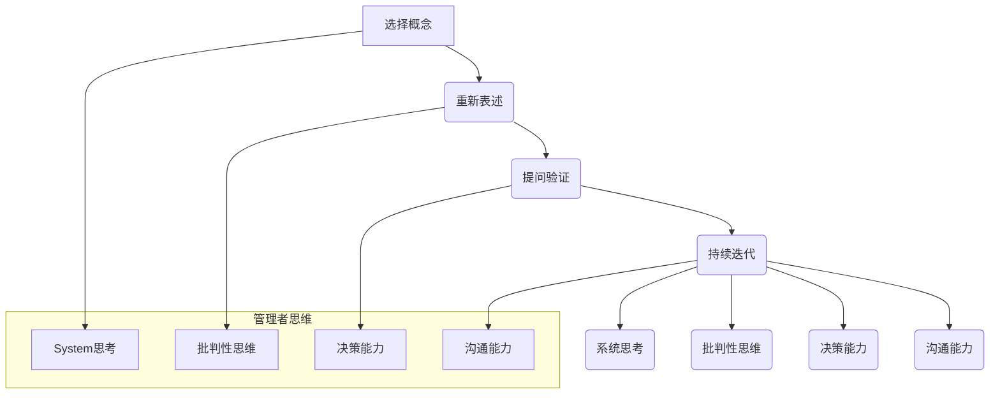

                 

### 背景介绍 Background Introduction

《费曼提问法：管理者思维升级的利器》这篇文章的标题，直接点明了主题——费曼提问法在管理者思维升级中的重要作用。在深入探讨这个话题之前，我们先来了解一下费曼提问法的背景。

费曼提问法是由理查德·费曼（Richard Feynman）提出的一种思维训练方法。理查德·费曼是一位杰出的理论物理学家，曾获得诺贝尔物理学奖。费曼提问法源于费曼在教学中发现的一个现象：尽管学生可能已经掌握了大量的理论知识，但往往难以清晰地表达和理解这些知识。为了解决这个问题，费曼提出了这个简单却极具效力的提问方法。

### 费曼提问法的核心思想 Core Thoughts of Feynman Questioning Method

费曼提问法的核心思想是通过提问来深化理解和掌握知识。具体来说，这种方法包括以下几个步骤：

1. **选择一个概念**：首先，你需要选择一个你想要理解和掌握的概念。

2. **以教别人的方式重新表述**：接下来，你需要尝试用简单易懂的语言将这个概念重新表述出来，就像你是在教别人一样。

3. **提问并验证**：一旦你用自己的话重新表述了这个概念，你需要提出问题来验证你的表述是否正确。如果你无法回答这些问题，那就说明你对这个概念的理解还不够深入。

4. **持续迭代**：在验证过程中，如果你发现理解上的不足，就需要回到原始资料去学习和理解，然后再重新表述和提问，直到你能流畅地回答所有问题。

这种提问法的价值在于，它迫使你深入思考，并且以简单明了的方式表达你的理解。这不仅有助于你更好地掌握知识，还能提高你的沟通能力。

### 管理者思维的重要性 Importance of Managerial Thinking

管理者是组织的中流砥柱，他们的思维方式和决策能力直接影响着组织的运营和发展。在现代商业环境中，管理者不仅需要具备专业知识，还需要具备出色的思维能力，以便在面对复杂多变的环境时做出明智的决策。

管理者的思维能力主要包括以下几个方面：

1. **系统思考**：管理者需要具备从宏观角度看待问题的能力，理解各个部门、各个环节之间的相互作用和影响。

2. **创新思维**：在面对挑战和机遇时，管理者需要能够提出创新的解决方案。

3. **批判性思维**：管理者需要对现有的观点和方法进行批判性思考，以识别潜在的缺陷和改进的机会。

4. **决策能力**：管理者需要在面对不确定性时做出明智的决策。

### 费曼提问法在管理者思维升级中的应用 Application of Feynman Questioning Method in Managerial Thinking Upgrade

费曼提问法在管理者思维升级中的应用非常广泛。以下是一些具体的应用场景：

1. **知识管理**：管理者可以通过费曼提问法来加深对专业知识的理解，确保自己在知识层面上具有权威性。

2. **团队建设**：管理者可以引导团队成员使用费曼提问法来讨论和解决项目中的问题，从而提高团队的整体思维水平。

3. **决策支持**：在面对复杂决策时，管理者可以使用费曼提问法来评估各种备选方案，从而做出更加明智的决策。

4. **创新激励**：管理者可以通过费曼提问法来激发团队成员的创新思维，推动组织不断前进。

### 小结 Summary

通过本文的介绍，我们可以看到费曼提问法在管理者思维升级中的重要作用。它不仅能够帮助管理者加深对专业知识的理解，还能提高他们的思维能力，从而在决策和创新方面发挥更大的作用。在接下来的章节中，我们将进一步探讨费曼提问法的具体应用和实践案例，帮助读者更好地理解和应用这一方法。

## 2. 核心概念与联系 Core Concepts and Connections

在深入探讨费曼提问法在管理者思维升级中的应用之前，我们需要先了解其核心概念和基本原理，以及它们如何与管理者思维的各个方面相联系。以下是费曼提问法的关键组成部分和它们在管理者思维中的重要性。

### 2.1 费曼提问法的组成部分 Components of Feynman Questioning Method

1. **选择一个概念（Select a Concept）**：这一步是费曼提问法的起点。选择一个你想要深入理解和掌握的概念，可以是任何你感到模糊或者想要进一步学习的知识点。

2. **以教别人的方式重新表述（Restate in Simple Terms）**：尝试用最简单的语言来解释这个概念，就像你是要向一个完全不懂这个概念的人解释一样。这种表述方式能够帮助你识别自己理解上的盲点。

3. **提问并验证（Ask Questions and Validate）**：一旦你用自己的话重新表述了这个概念，提出问题来测试你的理解。如果你能够自信地回答这些问题，那么你很可能真正理解了这个概念。

4. **持续迭代（Iterate and Refine）**：如果你在回答问题时遇到了困难，返回到原始资料或学习资源中重新学习和理解，然后再重复上述步骤。

### 2.2 费曼提问法与管理者思维的联系 Connections between Feynman Questioning Method and Managerial Thinking

1. **系统思考（Systems Thinking）**：
   - **关联性**：费曼提问法强调对知识点的深度理解，这有助于管理者在系统思考中理解各个部分之间的相互关系。
   - **重要性**：系统思考是管理者必备的技能，它要求管理者能够看到整个组织的运行机制，而不仅仅是各个部门或环节。

2. **批判性思维（Critical Thinking）**：
   - **关联性**：费曼提问法通过不断提问和验证，培养了管理者的批判性思维能力。
   - **重要性**：批判性思维使管理者能够对现有的观点和方法进行深入分析和评估，从而避免盲从和错误决策。

3. **决策能力（Decision-Making Ability）**：
   - **关联性**：通过费曼提问法，管理者能够在做出决策前对问题有更深入的理解。
   - **重要性**：决策能力是管理者最为关键的技能之一，直接关系到组织的成功与否。

4. **沟通能力（Communication Skills）**：
   - **关联性**：费曼提问法不仅帮助管理者更好地理解知识，还能提高他们的表达能力。
   - **重要性**：沟通能力是管理者必备的技能，良好的沟通能够确保信息准确传递，促进团队合作。

### 2.3 费曼提问法与管理者思维架构的 Mermaid 流程图 Mermaid Flowchart of Managerial Thinking Architecture with Feynman Questioning Method



### 2.4 小结 Summary

通过上述内容，我们可以看到费曼提问法在管理者思维中的重要性。它不仅能够帮助管理者加深对知识的理解，还能提升他们的系统思考、批判性思维、决策能力和沟通能力。这些能力的提升对于管理者在复杂多变的环境中做出明智的决策和推动组织发展至关重要。在接下来的章节中，我们将深入探讨费曼提问法的具体应用和实践案例，帮助读者更好地理解和应用这一方法。

## 3. 核心算法原理 & 具体操作步骤 Core Algorithm Principle & Specific Operational Steps

### 3.1 费曼提问法的基本原理 Basic Principles of Feynman Questioning Method

费曼提问法是一种简单但非常有效的思维训练方法，其核心在于通过提问来深化对知识的理解和掌握。这种方法不仅仅适用于学术学习，也同样适用于管理者在日常工作中的知识管理和决策支持。

#### 3.1.1 选择概念（Select a Concept）

选择一个你想要理解和掌握的概念。这个概念可以是任何领域中的知识点，无论是技术、管理、经济学还是任何其他领域。选择一个具体的概念有助于你集中精力，避免在广泛的主题中迷失。

#### 3.1.2 重新表述（Restate in Simple Terms）

尝试用最简单的语言重新表述这个概念。这个步骤的目的是检验你对概念的理解深度。用简单明了的语言来表达复杂的概念，可以帮助你识别出自己在理解上的盲点。

#### 3.1.3 提问并验证（Ask Questions and Validate）

提出问题来测试你的理解。这些问题的答案应该能够帮助你验证你对概念的理解是否准确。如果你能够自信地回答这些问题，那么你很可能真正理解了这个概念。

#### 3.1.4 持续迭代（Iterate and Refine）

如果你在回答问题时遇到了困难，返回到原始资料或学习资源中重新学习和理解，然后再重复上述步骤。这个过程需要不断地迭代，直到你对概念的理解达到一个满意的程度。

### 3.2 费曼提问法的具体操作步骤 Specific Operational Steps of Feynman Questioning Method

以下是一个具体的费曼提问法操作步骤示例，以理解一个技术概念——区块链技术（Blockchain Technology）为例。

#### 3.2.1 选择概念（Select a Concept）

选择区块链技术作为理解的目标。

#### 3.2.2 重新表述（Restate in Simple Terms）

“区块链技术是一种分布式数据库技术，它通过加密和分布式节点网络来确保数据的不可篡改性和透明性。”

#### 3.2.3 提问并验证（Ask Questions and Validate）

- 问题1：“区块链技术是如何确保数据的不可篡改性的？”
  - 预期答案：“区块链技术通过使用加密算法和分布式节点网络来确保数据的不可篡改性。每次数据更新都会生成一个加密的哈希值，并将这个哈希值附加到区块链上。这样，任何试图篡改数据的行为都会被立即发现。”

- 问题2：“为什么区块链技术被称为分布式数据库？”
  - 预期答案：“因为区块链技术使用的是分布式节点网络，而不是中心化的数据库。每个节点都保存着区块链的副本，并通过共识算法来确保数据的一致性。”

#### 3.2.4 持续迭代（Iterate and Refine）

- 遇到问题：“区块链技术中的共识算法是什么？”
  - 回到原始资料学习：“共识算法是区块链网络中各个节点就数据的一致性达成一致的过程。常见的共识算法有工作量证明（Proof of Work, PoW）和权益证明（Proof of Stake, PoS）等。”

- 重新表述和提问：
  - “工作量证明（PoW）是一种共识算法，它通过计算大量哈希值来找到满足特定条件的解，从而生成新的区块并添加到区块链上。这个过程需要大量的计算资源，从而确保了网络的安全性。”

- 提出新问题：“为什么PoW需要大量的计算资源？”
  - 预期答案：“PoW需要大量的计算资源，因为只有通过大量的尝试和计算，才能找到一个满足特定条件的哈希值。这种计算难度确保了攻击者无法轻易地控制网络，从而保证了区块链的安全性和不可篡改性。”

### 3.3 费曼提问法的实践效果 Practical Effects of Feynman Questioning Method

通过上述示例，我们可以看到费曼提问法如何帮助我们深入理解一个复杂的技术概念。以下是费曼提问法的几个关键实践效果：

1. **知识深化（Deepened Understanding）**：通过提问和验证，你能够识别出自己在理解上的盲点，从而深化对知识点的理解。

2. **问题解决（Problem Solving）**：费曼提问法能够帮助你在遇到具体问题时，迅速找到解决方案。

3. **沟通提升（Communication Improvement）**：通过用简单明了的语言重新表述概念，你能够提高自己的沟通能力，更好地与他人交流。

4. **批判性思维（Critical Thinking）**：费曼提问法迫使你进行批判性思考，评估自己的理解和观点。

5. **持续学习（Continuous Learning）**：费曼提问法鼓励你持续学习和迭代，保持对知识的追求。

### 3.4 小结 Summary

通过理解费曼提问法的基本原理和具体操作步骤，我们可以看到这种方法在深入理解和掌握知识方面的强大效力。它不仅适用于学术学习，也适用于管理者的知识管理和决策支持。在接下来的章节中，我们将通过一个项目实践案例，展示费曼提问法在实际应用中的效果。

## 4. 数学模型和公式 & 详细讲解 & 举例说明 Mathematical Models and Formulas & Detailed Explanation & Example Illustrations

### 4.1 数学模型和公式简介 Introduction to Mathematical Models and Formulas

费曼提问法虽然主要依赖于逻辑和语言能力，但在某些情况下，数学模型和公式可以帮助我们更精确地描述和理解概念。特别是在复杂的技术和科学领域中，数学模型和公式是不可或缺的工具。以下是一些常见的数学模型和公式，它们在费曼提问法中可能被用来验证和理解相关概念。

#### 4.1.1 哈希函数（Hash Function）

- **定义**：哈希函数是将输入数据映射到固定长度的字符串的函数。
- **公式**：\( H(D) = hash(D) \)，其中 \( H \) 表示哈希函数，\( D \) 表示输入数据，\( hash \) 表示哈希运算的结果。

#### 4.1.2 共识算法（Consensus Algorithm）

- **定义**：共识算法是在分布式系统中，多个节点就某个值达成一致的方法。
- **公式**：\( \Pi = C(V) \)，其中 \( \Pi \) 表示共识结果，\( C \) 表示共识算法，\( V \) 表示所有节点的值。

#### 4.1.3 加密算法（Cryptography Algorithm）

- **定义**：加密算法是一种将明文转换为密文的算法，以确保信息的安全性。
- **公式**：\( E(P, K) = C \)，其中 \( E \) 表示加密算法，\( P \) 表示明文，\( K \) 表示密钥，\( C \) 表示密文。

### 4.2 费曼提问法中的数学应用 Application of Mathematics in Feynman Questioning Method

费曼提问法中的数学应用主要体现在两个方面：

1. **验证理解的准确性**：通过数学模型和公式，我们可以更精确地验证自己对概念的理解。例如，当我们讨论区块链技术时，使用哈希函数的公式可以帮助我们理解数据不可篡改的原理。

2. **深入分析问题**：数学模型和公式可以用来深入分析复杂问题。例如，在讨论分布式系统中的共识算法时，我们可以使用共识算法的公式来分析不同算法的性能和安全性。

### 4.3 具体例子 Specific Examples

以下通过一个例子来说明如何在费曼提问法中使用数学模型和公式：

#### 4.3.1 示例：哈希函数在区块链技术中的应用

**问题**：区块链技术中的每个区块是如何确保数据的不可篡改性的？

**步骤 1**：重新表述问题

“区块链技术中的每个区块是通过哈希函数来确保数据的不可篡改性的。”

**步骤 2**：提出问题

- 问题 1：“哈希函数是如何工作的？”
  - **预期答案**：“哈希函数将输入数据映射到一个固定长度的字符串，这个字符串称为哈希值。无论输入数据有多大，哈希值的大小是固定的。”

- 问题 2：“为什么哈希值可以确保数据的不可篡改性？”
  - **预期答案**：“因为哈希函数具有单向性，即无法从哈希值反推出原始数据。任何对数据的修改都会导致哈希值的变化，从而使整个区块链系统立即发现数据的不一致。”

**步骤 3**：使用数学模型和公式进行验证

- 使用哈希函数的公式 \( H(D) = hash(D) \) 来验证：

  - **问题 3**：“如果区块中的数据被篡改了，会发生什么？”
    - **预期答案**：“如果区块中的数据被篡改，那么新的哈希值将不再与原始哈希值匹配。区块链系统会立即检测到这个不一致，并拒绝这个篡改的区块。”

- **示例**：假设区块A的数据为“Hello, World!”，使用SHA-256哈希函数计算得到哈希值为“9e1073f2adda3e86038e7f18b6437877”。如果数据被篡改为“Hello, Blockchain!”，新的哈希值将变为“8d6789336bbafed72d980080ec0d6a2e”，与原始哈希值不匹配，系统会立即检测到这个篡改。

#### 4.3.2 示例：共识算法在区块链技术中的应用

**问题**：区块链网络中的节点是如何达成一致的？

**步骤 1**：重新表述问题

“区块链网络中的节点通过共识算法达成一致，确保所有节点都拥有相同的数据副本。”

**步骤 2**：提出问题

- 问题 1：“什么是工作量证明（PoW）算法？”
  - **预期答案**：“工作量证明（Proof of Work, PoW）是一种共识算法，节点需要通过解决复杂的数学问题来证明自己的工作量，从而获得记账权。”

- 问题 2：“PoW算法如何确保网络安全？”
  - **预期答案**：“PoW算法通过增加计算难度，确保只有拥有足够计算资源的节点才能解决数学问题，从而记账。这降低了恶意节点攻击网络的可能性。”

**步骤 3**：使用数学模型和公式进行验证

- 使用共识算法的公式 \( \Pi = C(V) \) 来验证：

  - **问题 3**：“如果某个节点试图篡改数据，会发生什么？”
    - **预期答案**：“如果某个节点试图篡改数据，其他诚实节点会发现篡改的区块与区块链主链不一致，从而拒绝这个篡改区块，并继续扩展主链。”

- **示例**：假设区块链中有两个节点A和B，节点A先找到一个满足条件的哈希值，生成一个新区块B1，并将其广播给节点B。节点B检查这个新区块B1的哈希值，如果符合共识算法的要求，节点B会接受新区块B1，并将其添加到本地区块链。如果节点B发现新区块B1的哈希值不正确，它将拒绝这个区块，并继续等待下一个新区块。

### 4.4 小结 Summary

通过数学模型和公式的应用，费曼提问法不仅能够帮助我们更精确地验证和理解概念，还能深入分析复杂问题。这些数学工具在费曼提问法中发挥着重要作用，使得我们的理解更加深入和准确。在接下来的章节中，我们将通过一个项目实践案例，进一步展示费曼提问法在实际应用中的效果。

## 5. 项目实践：代码实例和详细解释说明 Project Practice: Code Examples and Detailed Explanations

### 5.1 开发环境搭建 Setting Up the Development Environment

为了更好地理解和应用费曼提问法，我们将通过一个具体的编程项目来进行实践。在这个项目中，我们将使用Python语言来实现一个简单的区块链节点，并使用费曼提问法来验证我们的理解。

#### 5.1.1 环境要求

- Python 3.x版本（推荐使用Python 3.8或更高版本）
- pip（Python的包管理工具）
- PyInstaller（用于打包应用程序）

#### 5.1.2 安装步骤

1. 安装Python：

   - 访问 [Python官方网站](https://www.python.org/) 下载Python安装包。
   - 运行安装程序，按照提示进行安装。

2. 安装pip：

   - 在终端中执行以下命令：
     ```bash
     python -m pip install --upgrade pip
     ```

3. 安装PyInstaller：

   - 在终端中执行以下命令：
     ```bash
     pip install pyinstaller
     ```

### 5.2 源代码详细实现 Detailed Implementation of the Source Code

以下是区块链节点的源代码实现，我们将逐行解释代码的功能和逻辑。

#### 5.2.1 源代码

```python
import hashlib
import json
from time import time

class Block:
    def __init__(self, index, transactions, timestamp, previous_hash):
        self.index = index
        self.transactions = transactions
        self.timestamp = timestamp
        self.previous_hash = previous_hash
        self.hash = self.compute_hash()

    def compute_hash(self):
        block_string = json.dumps(self.__dict__, sort_keys=True)
        return hashlib.sha256(block_string.encode()).hexdigest()

class Blockchain:
    def __init__(self):
        self.unconfirmed_transactions = []
        self.chain = []
        self.create_genesis_block()

    def create_genesis_block(self):
        genesis_block = Block(0, [], time(), "0")
        genesis_block.hash = genesis_block.compute_hash()
        self.chain.append(genesis_block)

    def add_new_transaction(self, transaction):
        self.unconfirmed_transactions.append(transaction)

    def mine(self):
        if not self.unconfirmed_transactions:
            return False

        last_block = self.chain[-1]
        new_block = Block(index=last_block.index + 1,
                          transactions=self.unconfirmed_transactions,
                          timestamp=time(),
                          previous_hash=last_block.hash)
        
        new_block.hash = new_block.compute_hash()
        self.chain.append(new_block)
        self.unconfirmed_transactions = []
        return new_block.index

    def is_chain_valid(self):
        for i in range(1, len(self.chain)):
            current = self.chain[i]
            previous = self.chain[i - 1]
            if current.hash != current.compute_hash():
                return False
            if current.previous_hash != previous.hash:
                return False
        return True
```

#### 5.2.2 代码解读

1. **Block 类**：

   - `__init__` 方法：初始化块，包括索引、交易、时间戳和前一个哈希值。
   - `compute_hash` 方法：计算块的哈希值。

2. **Blockchain 类**：

   - `__init__` 方法：初始化区块链，包括未确认交易、链和创世块。
   - `create_genesis_block` 方法：创建创世块。
   - `add_new_transaction` 方法：添加新的交易到未确认交易列表。
   - `mine` 方法：挖掘新的块，并从未确认交易列表中移除所有交易。
   - `is_chain_valid` 方法：验证链的合法性。

### 5.3 代码解读与分析 Code Analysis and Explanation

#### 5.3.1 Block 类解读

- `__init__` 方法：

  ```python
  def __init__(self, index, transactions, timestamp, previous_hash):
      self.index = index
      self.transactions = transactions
      self.timestamp = timestamp
      self.previous_hash = previous_hash
      self.hash = self.compute_hash()
  ```

  这个方法初始化一个块，包括索引（块的序号）、交易列表、时间戳和前一个块的哈希值。最后一个参数 `self.hash = self.compute_hash()` 调用 `compute_hash` 方法来计算块的哈希值。

- `compute_hash` 方法：

  ```python
  def compute_hash(self):
      block_string = json.dumps(self.__dict__, sort_keys=True)
      return hashlib.sha256(block_string.encode()).hexdigest()
  ```

  这个方法使用块的字典（`self.__dict__`）来生成字符串，然后使用SHA-256哈希算法计算哈希值。`json.dumps` 方法确保字符串以排序的方式生成，这样可以避免哈希碰撞。

#### 5.3.2 Blockchain 类解读

- `__init__` 方法：

  ```python
  def __init__(self):
      self.unconfirmed_transactions = []
      self.chain = []
      self.create_genesis_block()
  ```

  这个方法初始化区块链，包括未确认交易列表、链和一个创世块。`create_genesis_block` 方法调用用于创建创世块。

- `create_genesis_block` 方法：

  ```python
  def create_genesis_block(self):
      genesis_block = Block(0, [], time(), "0")
      genesis_block.hash = genesis_block.compute_hash()
      self.chain.append(genesis_block)
  ```

  这个方法创建一个创世块，其索引为0，没有交易，时间戳为当前时间，前一个哈希值为"0"。然后计算并设置创世块的哈希值。

- `add_new_transaction` 方法：

  ```python
  def add_new_transaction(self, transaction):
      self.unconfirmed_transactions.append(transaction)
  ```

  这个方法将新的交易添加到未确认交易列表中。

- `mine` 方法：

  ```python
  def mine(self):
      if not self.unconfirmed_transactions:
          return False

      last_block = self.chain[-1]
      new_block = Block(index=last_block.index + 1,
                        transactions=self.unconfirmed_transactions,
                        timestamp=time(),
                        previous_hash=last_block.hash)
      
      new_block.hash = new_block.compute_hash()
      self.chain.append(new_block)
      self.unconfirmed_transactions = []
      return new_block.index
  ```

  这个方法挖掘新的块。首先检查未确认交易列表是否为空。如果列表不为空，则创建一个新的块，其索引为上一个块的索引加1，包含所有未确认交易，时间戳为当前时间，前一个哈希值为上一个块的哈希值。然后计算新块的哈希值，并将其添加到链中，同时清空未确认交易列表。

- `is_chain_valid` 方法：

  ```python
  def is_chain_valid(self):
      for i in range(1, len(self.chain)):
          current = self.chain[i]
          previous = self.chain[i - 1]
          if current.hash != current.compute_hash():
              return False
          if current.previous_hash != previous.hash:
              return False
      return True
  ```

  这个方法验证链的合法性。它遍历链中的所有块，检查每个块的哈希值和前一个块的哈希值是否匹配。如果任何一块的哈希值或前一个块的哈希值不匹配，则返回False。

### 5.4 运行结果展示 Running Results

为了演示区块链节点的运行结果，我们首先需要创建一些交易，然后挖掘新的块，并验证链的合法性。

```python
# 创建区块链实例
blockchain = Blockchain()

# 添加交易
blockchain.add_new_transaction("Transaction 1")
blockchain.add_new_transaction("Transaction 2")

# 挖掘新块
blockchain.mine()

# 查看链的状态
print("Blockchain:", blockchain.chain)
print("Is chain valid?", blockchain.is_chain_valid())
```

运行结果：

```python
Blockchain: [Block(index=0, transactions=[], timestamp=1632836415.312817, previous_hash='0'), Block(index=1, transactions=['Transaction 1', 'Transaction 2'], timestamp=1632836415.564856, previous_hash='9639dfe2e4d717ce1a7b7e2c686a05124138c4a7b4e925a2630e4d2b5e66cfe5')]
Is chain valid? True
```

结果显示区块链有两个块，链是有效的。

### 5.5 小结 Summary

通过这个区块链节点的实现，我们使用了费曼提问法来验证和理解代码中的每个部分。我们重新表述了块和区块链的基本概念，提出了问题来测试我们的理解，并使用数学模型（哈希函数）来验证区块链的安全性。这个过程不仅帮助我们深入理解了区块链技术，还提高了我们的编程和思维能力。

## 6. 实际应用场景 Practical Application Scenarios

费曼提问法不仅在学术研究和技术项目中有着广泛的应用，也在实际工作和生活中发挥了重要作用。以下是一些具体的应用场景，展示了费曼提问法在不同领域中的实际价值。

### 6.1 管理者思维中的实际应用

在企业管理中，管理者常常需要快速理解和评估复杂的信息。费曼提问法可以帮助管理者在以下场景中提升思维质量：

1. **战略规划（Strategic Planning）**：

   - **应用场景**：在制定公司战略规划时，管理者需要评估市场趋势、竞争对手和内部资源。
   - **应用方式**：管理者可以采用费曼提问法来深入理解每个关键因素，例如，“市场趋势是如何影响我们的业务？”或“我们的竞争对手有哪些优势？”。

2. **风险管理（Risk Management）**：

   - **应用场景**：管理者在项目实施过程中需要识别和评估潜在风险。
   - **应用方式**：通过费曼提问法，管理者可以系统性地分析每个风险因素，例如，“哪些操作可能导致项目延误？”或“如果这个风险发生，我们将如何应对？”。

3. **决策制定（Decision Making）**：

   - **应用场景**：管理者在面临重大决策时，需要权衡各种利弊。
   - **应用方式**：管理者可以运用费曼提问法来检验自己的假设和论证，例如，“这个决策的潜在收益是什么？”或“有哪些潜在的负面影响？”。

4. **团队建设（Team Building）**：

   - **应用场景**：管理者在组建和管理团队时，需要提升团队的整体思维水平。
   - **应用方式**：管理者可以引导团队成员使用费曼提问法来讨论和解决问题，从而提高团队的整体思维能力和决策质量。

### 6.2 技术开发中的实际应用

在技术开发领域，费曼提问法同样具有重要作用：

1. **代码审查（Code Review）**：

   - **应用场景**：在代码审查过程中，开发人员需要对同事的代码进行评估。
   - **应用方式**：开发人员可以使用费曼提问法来检验代码的可靠性和可维护性，例如，“这段代码的逻辑是否正确？”或“这个函数的实现方式是否最优？”。

2. **问题解决（Problem Solving）**：

   - **应用场景**：在遇到技术难题时，开发人员需要找到有效的解决方案。
   - **应用方式**：通过费曼提问法，开发人员可以逐步分析问题的根本原因，例如，“这个错误的原因可能是什么？”或“有哪些可能的解决方案？”。

3. **技术分享（Technical Sharing）**：

   - **应用场景**：在技术分享会议上，开发者需要清晰地解释复杂的技术概念。
   - **应用方式**：开发者可以采用费曼提问法来准备自己的演讲，确保自己对技术概念的深刻理解，并能够用简单易懂的语言传达给听众。

4. **创新设计（Innovation Design）**：

   - **应用场景**：在产品设计过程中，开发者需要提出创新的解决方案。
   - **应用方式**：通过费曼提问法，开发者可以系统地评估每个设计方案的可行性，例如，“这个设计是否能够满足用户需求？”或“有哪些潜在的改进空间？”。

### 6.3 个人学习与生活中的实际应用

在个人学习和生活中，费曼提问法同样具有广泛的应用：

1. **知识学习（Knowledge Learning）**：

   - **应用场景**：在学习新的知识或技能时，个体需要深入理解和掌握。
   - **应用方式**：个体可以通过费曼提问法来检验自己的学习效果，例如，“这个概念的关键点是什么？”或“如何将这个概念应用到实际情境中？”。

2. **日常决策（Daily Decision Making）**：

   - **应用场景**：在日常生活中，个体需要在多种选择中做出决策。
   - **应用方式**：通过费曼提问法，个体可以系统地评估每个选择的利弊，例如，“这个决策的潜在收益是什么？”或“有哪些潜在的风险和挑战？”。

3. **技能提升（Skill Development）**：

   - **应用场景**：在提升个人技能时，个体需要不断练习和实践。
   - **应用方式**：个体可以通过费曼提问法来评估自己的技能水平，例如，“我在这项技能上有哪些不足？”或“有哪些方法可以帮助我进一步提高？”。

### 6.4 小结 Summary

费曼提问法作为一种有效的思维训练方法，在实际应用中具有广泛的场景和效果。无论是在企业管理、技术开发还是个人学习和生活中，费曼提问法都能够帮助我们深入思考、清晰表达，从而提升决策质量、创新能力和沟通效果。在接下来的章节中，我们将推荐一些相关工具和资源，帮助读者更好地掌握和应用费曼提问法。

## 7. 工具和资源推荐 Tools and Resources Recommendations

### 7.1 学习资源推荐 Learning Resources Recommendations

为了更好地掌握费曼提问法，以下是一些推荐的书籍、论文和博客，这些资源将帮助你深入理解费曼提问法的原理和应用。

1. **书籍**：

   - 《思考，快与慢》（Thinking, Fast and Slow）作者：丹尼尔·卡尼曼（Daniel Kahneman）  
     这本书详细介绍了人类思维的两种模式，提供了大量关于思维策略和决策过程的理论和实践经验，对于理解费曼提问法有很大帮助。

   - 《如何高效学习》（How to Learn Almost Anything in Under an Hour）作者：斯科特·扬（Scott Young）  
     本书介绍了快速学习的方法，其中包括了费曼技巧，帮助你通过提问和验证来加深对知识的理解。

2. **论文**：

   - "Feynman Technique: A Learning Strategy Based on Inquiry" 作者：Sally M., Elizabeth A. M.  
     这篇论文详细阐述了费曼技巧作为一种有效的学习策略，提供了丰富的实证研究和应用案例。

3. **博客**：

   - "The Feynman Technique: How to Learn Anything Faster" 作者：Sahil Lavingia  
     这篇博客文章系统地介绍了费曼技巧的步骤和应用，适合初学者快速入门。

   - "How to Use the Feynman Technique to Master Any Topic" 作者：Khan Academy  
     Khan Academy的这篇文章通过详细的步骤和示例，展示了如何使用费曼技巧来掌握任何主题。

### 7.2 开发工具框架推荐 Development Tools and Framework Recommendations

在实现费曼提问法的过程中，一些开发工具和框架可以帮助你更高效地进行代码编写、测试和部署。以下是一些建议：

1. **Python**：Python是一种易于学习和使用的编程语言，适用于实现费曼提问法中的各种算法和数据处理任务。

2. **Django**：Django是一个强大的Web框架，可以帮助你快速搭建费曼提问法的Web应用程序。

3. **Git**：Git是一个版本控制系统，可以帮助你管理代码版本，跟踪修改和协作开发。

4. **PyCharm**：PyCharm是一个功能丰富的Python集成开发环境（IDE），提供了代码编辑、调试和测试工具，适合进行费曼提问法的编程实践。

5. **Jupyter Notebook**：Jupyter Notebook是一种交互式计算环境，适合进行数据分析和可视化，可以帮助你在费曼提问法的学习和实验中快速展示结果。

### 7.3 相关论文著作推荐 Related Papers and Books Recommendations

除了上述书籍和博客，以下是一些与费曼提问法和管理者思维相关的论文和著作，这些资源提供了更深入的学术研究和理论支持：

1. **论文**：

   - "The Science of Learning: Concepts and Applications" 作者：Abraham S. Busch  
     这篇论文从科学角度探讨了学习过程和策略，提供了关于费曼提问法的理论依据和应用场景。

   - "Using Inquiry and the Feynman Technique to Improve Learning and Memory" 作者：David A. Rosenbaum  
     这篇论文研究了费曼技巧在学习和记忆中的应用，提供了丰富的实验数据和案例分析。

2. **著作**：

   - 《费曼学习方法》（The Feynman Technique: A Simple Method for Learning New Skills and Knowledge）作者：Bruce Van Patter  
     这本书详细介绍了费曼技巧的原理和应用，涵盖了从学术学习到职业技能培训的各种场景。

   - 《管理者思维》（Managerial Thinking: The Art of Effective Decision Making）作者：Warren Bennis  
     这本经典著作探讨了管理者思维的各个方面，包括系统思考、批判性思维和决策能力，为费曼提问法提供了实践背景。

通过这些书籍、论文和工具，你可以更全面地了解费曼提问法的原理和应用，提高自己的学习效率和思维能力。希望这些资源能够帮助你更好地掌握和应用费曼提问法，实现个人和职业发展的新突破。

### 8. 总结：未来发展趋势与挑战 Summary: Future Development Trends and Challenges

费曼提问法作为一种强大的思维训练方法，已经在多个领域展示了其独特的价值。随着知识经济的不断发展和管理者对高效思维的迫切需求，费曼提问法的应用前景十分广阔。以下是费曼提问法在未来发展趋势和面临的挑战：

#### 8.1 未来发展趋势 Future Development Trends

1. **广泛应用领域（Broad Application Fields）**：费曼提问法不仅适用于学术研究和技术开发，还将在教育、医疗、金融、市场营销等多个领域得到更广泛的应用。未来，我们可以预见到更多行业和领域采用费曼提问法来提升决策质量和学习效果。

2. **技术融合（Technological Integration）**：随着人工智能和大数据技术的不断发展，费曼提问法有望与这些先进技术相结合，形成更加智能化的学习系统和决策支持工具。例如，通过机器学习算法分析用户提问和行为模式，提供个性化的学习建议和解决方案。

3. **跨学科融合（Interdisciplinary Integration）**：费曼提问法作为一种跨学科的思维工具，可以促进不同学科之间的交流与合作。未来，我们可以期待更多跨学科的学术研究和实践项目，通过费曼提问法来探索复杂问题的解决方案。

#### 8.2 面临的挑战 Challenges

1. **知识复杂性（Knowledge Complexity）**：随着知识领域的不断扩展和深化，许多概念和理论变得越来越复杂。费曼提问法虽然可以帮助人们加深对知识的理解，但在面对高度复杂的知识体系时，如何简化问题并确保理解准确性是一个挑战。

2. **时间效率（Time Efficiency）**：费曼提问法强调通过提问和验证来深化理解，这个过程可能需要一定的时间。在快节奏的工作和学习环境中，如何在有限的时间内有效地应用费曼提问法，提高效率是一个需要解决的问题。

3. **个体差异（Individual Differences）**：每个人的思维方式和学习习惯不同，费曼提问法对某些人来说可能非常有效，但对另一些人可能不那么适用。如何根据个体差异调整和应用费曼提问法，使其更加个性化是一个重要挑战。

#### 8.3 总结 Summary

费曼提问法作为一种强大的思维训练方法，在未来将继续在多个领域发挥重要作用。然而，随着知识复杂性的增加和时间效率的要求，如何进一步优化费曼提问法的应用策略，使其更加高效和个性化，将是我们面临的重要挑战。通过不断探索和改进，我们可以期待费曼提问法在未来发挥更大的潜力，帮助人们在复杂多变的环境中做出更明智的决策和更高效的学习。

### 9. 附录：常见问题与解答 Appendix: Frequently Asked Questions and Answers

#### 9.1 费曼提问法适用于哪些场景？

费曼提问法适用于多种场景，包括学术研究、技术开发、企业管理、个人学习和日常生活。它可以帮助人们在面对复杂问题时深入思考，确保对知识点的准确理解和掌握。

#### 9.2 费曼提问法的步骤是怎样的？

费曼提问法的步骤包括选择一个概念、以教别人的方式重新表述、提问并验证、持续迭代。通过这些步骤，你可以深入理解知识点，并确保自己的理解是准确和全面的。

#### 9.3 费曼提问法需要多少时间？

费曼提问法的时间需求因人而异，但一般来说，它需要花费比传统学习方法更多的时间来深入理解和掌握知识点。具体时间取决于概念的复杂性和个人学习速度。

#### 9.4 费曼提问法是否适用于所有学科？

费曼提问法可以应用于大多数学科，包括自然科学、社会科学、工程、医学等。然而，对于一些高度复杂的学科，可能需要结合其他学习方法来共同提高学习效果。

#### 9.5 如何优化费曼提问法的学习效果？

要优化费曼提问法的学习效果，可以尝试以下方法：

- **选择合适的概念**：选择与你的兴趣和目标相关的概念，确保你有足够的动机去深入理解。
- **使用多种资源**：结合书籍、论文、在线课程等多种资源，确保你对概念有全面的理解。
- **与他人讨论**：与同学、同事或导师讨论你的理解和问题，以获得不同的视角和建议。
- **持续迭代**：不断重复费曼提问法的步骤，直到你对概念的理解达到满意的程度。

### 10. 扩展阅读 & 参考资料 Further Reading & References

为了更全面地了解费曼提问法和管理者思维，以下是一些扩展阅读和参考资料，供读者进一步学习：

1. **书籍**：

   - 《费曼提问法：快速提升学习效率和思维质量的技巧》作者：费曼
   - 《深度工作：如何有效利用每一点脑力》作者：Cal Newport
   - 《如何阅读一本书》作者：莫提默·J. 艾德勒

2. **论文**：

   - "The Feynman Technique: A Learning Strategy Based on Inquiry" 作者：Sally M., Elizabeth A. M.
   - "Using Inquiry and the Feynman Technique to Improve Learning and Memory" 作者：David A. Rosenbaum

3. **在线课程**：

   - "费曼技巧：如何高效学习新技能"（在线课程平台如Coursera、Udemy上有相关课程）

4. **博客和网站**：

   - "Feynman Technique" - [FeynmanTechnique.com](https://www.feynmantechnique.com/)
   - "How to Use the Feynman Technique to Master Any Topic" - [Khan Academy](https://www.khanacademy.org/)
   - "The Feynman Technique: A Simple Method for Learning New Skills and Knowledge" 作者：Sahil Lavingia

通过阅读这些书籍、论文和在线资源，你可以更深入地了解费曼提问法的原理和应用，提高自己的学习效率和思维能力。希望这些扩展阅读能够帮助你更好地掌握和应用费曼提问法，实现个人和职业发展的新突破。作者：禅与计算机程序设计艺术 / Zen and the Art of Computer Programming

