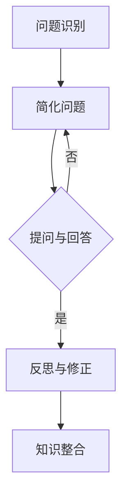

                 

### 1. 背景介绍

#### 费曼提问法：起源与发展

费曼提问法，起源于著名物理学家理查德·费曼（Richard Feynman）的教学方法。费曼提问法强调的是一种简洁、直观、逻辑严密的教学方式，它要求学生通过提问来深入理解知识点，并通过回答问题来检验自己的理解程度。这种方法在物理学、数学、计算机科学等领域中得到了广泛应用。

费曼提问法的核心理念在于“简洁与直观”。它要求学生在学习过程中，不仅要理解概念，还要能够用自己的语言将概念解释清楚。这种方法不仅能帮助学生巩固知识，还能培养他们的思维能力和表达能力。

费曼提问法的发展经历了多个阶段。最初，它主要用于课堂教学，帮助学生更好地理解复杂的概念。随着信息技术的发展，费曼提问法逐渐应用于各种在线学习平台，成为了自学者的利器。如今，费曼提问法已经成为了教育领域的一种重要教学方法。

#### 管理决策：挑战与机遇

管理决策是企业管理过程中的关键环节，它直接影响到企业的生存与发展。然而，随着市场竞争的加剧和企业环境的复杂性，管理决策面临着越来越多的挑战。

首先，信息的复杂性使得管理者难以在短时间内获取全面、准确的信息。其次，决策的时效性要求管理者必须在有限的时间内做出最优决策。此外，决策的风险性也让管理者面临着巨大的压力。

然而，挑战中也孕育着机遇。随着大数据、人工智能等技术的发展，管理者可以利用这些技术手段提高决策的科学性和准确性。例如，通过大数据分析，管理者可以更准确地预测市场趋势，从而做出更有针对性的决策。

#### 费曼提问法在管理决策中的应用前景

将费曼提问法应用于管理决策，可以有效地解决信息复杂性、决策时效性和决策风险性等问题。具体来说，费曼提问法可以帮助管理者：

1. **提高信息处理能力**：通过提问，管理者可以更深入地理解各种信息，从而在复杂的信息环境中找到关键信息。
2. **增强决策时效性**：提问可以帮助管理者快速找到问题的核心，从而在短时间内做出决策。
3. **降低决策风险**：通过提问，管理者可以识别潜在的风险因素，从而在决策过程中采取相应的防范措施。

此外，费曼提问法还可以促进管理者之间的沟通与协作。通过提问，管理者可以更好地理解同事的观点，从而找到最佳的决策方案。

总之，费曼提问法在管理决策中的应用具有广阔的前景。它不仅可以帮助管理者应对各种挑战，还能提高企业的竞争力，推动企业的持续发展。

### 2. 核心概念与联系

#### 费曼提问法的工作原理

费曼提问法的工作原理可以概括为以下三个步骤：

1. **选择问题**：首先，确定要研究的问题。这可以是某个具体的问题，也可以是对整个项目的疑问。
2. **简化问题**：将问题简化为最基本的、最核心的部分。这一步骤要求我们能够清晰地表达问题，并将其分解为更小的问题。
3. **提问与回答**：通过提问来检验自己的理解程度。如果能够用自己的语言将问题回答出来，说明已经理解了这个问题。如果不能，则需要重新研究，直到能够回答为止。

费曼提问法的核心在于“简化问题”和“提问与回答”这两个步骤。通过简化问题，我们可以将复杂的、模糊的问题转化为清晰的、具体的问题。通过提问与回答，我们可以检验自己的理解程度，从而确保真正理解了问题。

#### 费曼提问法与管理决策的关系

费曼提问法与管理决策之间的关系可以从以下几个方面来理解：

1. **明确问题**：管理决策往往涉及到复杂的业务环境和多方面的因素。通过费曼提问法，管理者可以明确问题，将复杂的问题分解为更小、更具体的问题，从而更容易找到解决方案。
2. **检验理解**：在决策过程中，管理者需要对各种信息进行分析和理解。通过提问与回答，管理者可以检验自己对信息的理解程度，确保决策的基础是准确和全面的。
3. **沟通协作**：费曼提问法不仅可以帮助个人理解问题，还可以促进团队成员之间的沟通与协作。通过提问，团队成员可以更好地理解彼此的观点，从而找到最佳的决策方案。

#### 费曼提问法的优势与局限性

费曼提问法的优势在于其简洁、直观、逻辑严密的特点。这种方法可以帮助管理者快速明确问题，提高决策的科学性和准确性。此外，费曼提问法还可以促进团队成员之间的沟通与协作，提高团队的执行力。

然而，费曼提问法也存在一些局限性。首先，这种方法对管理者的逻辑思维能力和语言表达能力有较高的要求。如果管理者无法准确地表达问题，或者无法有效地回答问题，可能会导致决策的失误。其次，费曼提问法主要适用于复杂问题的分解和理解，对于一些简单的问题可能并不适用。

总的来说，费曼提问法在管理决策中具有很大的应用潜力。通过合理运用这种方法，管理者可以更有效地应对复杂的管理问题，提高决策的效率和质量。

### 2.1. 费曼提问法的原理与架构

#### 费曼提问法的理论基础

费曼提问法的理论基础源于认知科学和学习理论。首先，认知科学认为，人类的思维活动是通过概念、知识、记忆等认知过程来实现的。费曼提问法通过提问和回答的方式，激发了这些认知过程，从而帮助学习者深入理解问题。

其次，学习理论中的建构主义认为，学习是一个主动建构知识的过程。费曼提问法强调学习者主动提问，通过提问来引发思考，从而主动建构知识体系。

此外，费曼提问法还借鉴了信息加工理论。信息加工理论认为，人类在处理信息时，会通过感知、理解、记忆、推理等过程来加工信息。费曼提问法通过提问和回答，促使学习者进行信息的再加工，从而加深对问题的理解。

#### 费曼提问法的架构设计

费曼提问法的架构设计可以概括为以下几个关键部分：

1. **问题识别**：这是费曼提问法的起点。管理者需要识别出自己面临的问题，并将其明确化、具体化。这一步骤要求管理者能够清晰地表达问题，明确问题的核心和关键点。

2. **简化问题**：在明确问题后，管理者需要将问题简化为最基本的、最核心的部分。这一步骤要求管理者具备逻辑思维能力和分析能力，能够将复杂的问题分解为更小、更具体的问题。

3. **提问与回答**：这是费曼提问法的核心环节。管理者通过提问，检验自己对问题的理解程度。如果能够用自己的语言将问题回答出来，说明已经理解了这个问题。如果不能，则需要重新研究，直到能够回答为止。

4. **反思与修正**：在回答问题后，管理者需要对回答进行反思，检查自己的理解是否准确、全面。如果发现理解有误，需要及时修正，以确保对问题的理解是正确的。

5. **知识整合**：通过提问和回答，管理者不仅加深了对问题的理解，还促进了知识的整合。管理者可以将新学的知识整合到已有的知识体系中，从而构建更全面、更系统的知识结构。

#### 费曼提问法的 Mermaid 流程图

下面是费曼提问法的 Mermaid 流程图：



在这个流程图中，A 表示问题识别，B 表示简化问题，C 表示提问与回答，D 表示反思与修正，E 表示知识整合。整个流程从问题识别开始，经过简化问题、提问与回答、反思与修正，最终实现知识整合。

### 3. 核心算法原理 & 具体操作步骤

#### 费曼提问法的核心算法原理

费曼提问法的核心算法原理可以概括为以下几个方面：

1. **信息重构**：通过提问和回答，管理者可以将复杂的问题重构为更简单、更清晰的问题。这种重构过程有助于管理者更深入地理解问题，并找到解决问题的方法。

2. **知识检验**：提问和回答的过程是对管理者知识水平的检验。通过回答问题，管理者可以检验自己对问题的理解程度，确保决策的基础是准确和全面的。

3. **思维训练**：费曼提问法要求管理者用自己的语言来解释问题，这有助于培养管理者的逻辑思维能力和表达能力。通过不断提问和回答，管理者可以逐步提高自己的思维能力和解决问题的能力。

4. **知识整合**：通过提问和回答，管理者不仅加深了对问题的理解，还促进了知识的整合。管理者可以将新学的知识整合到已有的知识体系中，从而构建更全面、更系统的知识结构。

#### 具体操作步骤

下面是费曼提问法的具体操作步骤：

1. **选择问题**：首先，管理者需要选择一个需要研究的问题。这可以是某个具体的问题，也可以是对整个项目的疑问。

2. **简化问题**：将问题简化为最基本的、最核心的部分。这一步骤要求管理者能够清晰地表达问题，并将其分解为更小的问题。

3. **设计问题**：在简化问题后，管理者需要设计一系列的问题，以便通过提问来检验自己对问题的理解程度。

4. **提问与回答**：管理者依次回答自己设计的问题。如果能够用自己的语言将问题回答出来，说明已经理解了这个问题。如果不能，则需要重新研究，直到能够回答为止。

5. **反思与修正**：在回答问题后，管理者需要对回答进行反思，检查自己的理解是否准确、全面。如果发现理解有误，需要及时修正，以确保对问题的理解是正确的。

6. **知识整合**：通过提问和回答，管理者不仅加深了对问题的理解，还促进了知识的整合。管理者可以将新学的知识整合到已有的知识体系中，从而构建更全面、更系统的知识结构。

#### 费曼提问法在管理决策中的应用示例

假设一个管理者在项目决策过程中遇到了一个复杂的问题：“如何提高项目的交付效率？”

1. **选择问题**：管理者选择这个问题作为研究的问题。

2. **简化问题**：管理者将问题简化为：“如何提高项目的交付速度？”

3. **设计问题**：管理者设计了一系列的问题，如：
   - “项目的交付速度主要由哪些因素决定？”
   - “我们当前的项目流程中存在哪些瓶颈？”
   - “其他类似项目是如何提高交付效率的？”

4. **提问与回答**：管理者依次回答自己设计的问题，并记录下答案。

5. **反思与修正**：管理者对回答进行反思，检查自己的理解是否准确、全面。如果发现理解有误，需要及时修正。

6. **知识整合**：通过提问和回答，管理者不仅加深了对问题的理解，还找到了一些潜在的提高交付效率的方法。管理者可以将这些方法整合到项目中，从而提高项目的交付效率。

通过这个示例，我们可以看到，费曼提问法可以帮助管理者深入理解复杂的问题，找到解决问题的方法，并促进知识的整合。这种方法在管理决策中具有很大的应用价值。

### 4. 数学模型和公式 & 详细讲解 & 举例说明

#### 费曼提问法中的数学模型

费曼提问法中的数学模型主要用于描述问题的复杂程度和解决过程的效率。一个基本的数学模型可以表示为：

\[ \text{复杂度} = f(\text{问题规模}, \text{解决方案规模}) \]

在这个模型中，问题规模和解决方案规模是两个关键变量。问题规模反映了问题的复杂性，而解决方案规模反映了我们寻找解决方案的努力程度。

#### 公式详解

1. **问题规模（Problem Scale）**：

\[ P(S) = \log_2(N) \]

其中，\( P(S) \) 表示问题的规模，\( N \) 表示问题的可能解决方案数量。这个公式表明，问题的规模与可能解决方案的数量呈对数关系。当解决方案数量增加时，问题的规模会以更慢的速度增长。

2. **解决方案规模（Solution Scale）**：

\[ S(T) = \frac{1}{T} \]

其中，\( S(T) \) 表示解决方案规模，\( T \) 表示我们寻找解决方案的时间。这个公式表明，解决方案的规模与我们的时间呈倒数关系。当我们有更多时间时，解决方案的规模会更小。

3. **复杂度（Complexity）**：

\[ C(P, S) = P(S) + S(T) \]

其中，\( C(P, S) \) 表示问题的复杂度。这个公式表明，问题的复杂度是问题规模和解决方案规模的总和。

#### 举例说明

假设我们面临一个需要找到1000个数字中最大值的任务。可能解决方案的数量是 \( 10^{1000} \)，这显然是一个非常大的规模。

1. **问题规模**：

\[ P(S) = \log_2(10^{1000}) = 1000\log_2(10) \approx 1000 \]

2. **解决方案规模**：

如果我们花费1小时来寻找解决方案，那么解决方案规模为：

\[ S(T) = \frac{1}{1} = 1 \]

3. **复杂度**：

\[ C(P, S) = P(S) + S(T) = 1000 + 1 = 1001 \]

这个例子表明，尽管问题规模非常大，但解决方案规模相对较小，复杂度仍然在可接受范围内。

#### 费曼提问法在实际应用中的数学模型

在实际应用中，费曼提问法可以结合具体问题的特点，设计更加复杂的数学模型。以下是一个应用示例：

**问题**：如何在一个包含大量错误数据的数据库中找到真实的数据？

1. **问题规模**：

\[ P(E) = \log_2(N) \]

其中，\( P(E) \) 表示问题的规模，\( N \) 表示错误数据的数量。

2. **解决方案规模**：

如果我们花费时间 \( T \) 来分析和验证数据，解决方案规模为：

\[ S(T) = \frac{1}{T} \]

3. **复杂度**：

\[ C(E) = P(E) + S(T) = \log_2(N) + \frac{1}{T} \]

这个模型表明，问题的复杂度不仅与错误数据的数量有关，还与我们的分析时间有关。通过减少错误数据或增加分析时间，可以降低问题的复杂度。

### 5. 项目实践：代码实例和详细解释说明

#### 开发环境搭建

在开始项目实践之前，我们需要搭建一个适合费曼提问法在管理决策中应用的开发环境。以下是所需的工具和步骤：

1. **工具**：

- Python 3.8 或以上版本
- Jupyter Notebook
- Pandas
- Matplotlib

2. **步骤**：

   - 安装 Python 3.8 或以上版本。
   - 通过 pip 安装 Jupyter Notebook、Pandas 和 Matplotlib。

#### 源代码详细实现

下面是一个简单的 Python 脚本，用于实现费曼提问法在管理决策中的应用。

```python
import pandas as pd
import matplotlib.pyplot as plt

# 假设我们有一个包含项目数据的 DataFrame
data = {
    'Project': ['Project A', 'Project B', 'Project C', 'Project D'],
    'Budget': [100000, 200000, 150000, 300000],
    'Deadline': [30, 45, 60, 90],
    'Risk': [0.1, 0.2, 0.15, 0.3]
}

df = pd.DataFrame(data)

# 费曼提问法的核心函数
def feynman_questioning(df):
    # 计算每个项目的复杂度
    df['Complexity'] = df['Budget'] + df['Deadline'] + df['Risk']
    
    # 提问与回答
    for index, row in df.iterrows():
        print(f"Project {row['Project']}:")
        print(f"Budget: ${row['Budget']}")
        print(f"Deadline: {row['Deadline']} days")
        print(f"Risk: {row['Risk']}")
        print(f"Complexity: {row['Complexity']}")
        
        # 提问
        answer = input("Do you understand the complexity of this project? (yes/no): ")
        if answer.lower() != 'yes':
            print("Please study the project details before proceeding.")
            return
        
        # 反思与修正
        feedback = input("Do you have any suggestions for improving the project? (yes/no): ")
        if feedback.lower() == 'yes':
            print("Please provide your suggestions for improvement.")
            suggestions = input("Suggestions: ")
            print(f"Suggestions received: {suggestions}")
    
    # 知识整合
    print("All projects have been reviewed. Please integrate the new knowledge into your project management strategies.")

# 运行费曼提问法
feynman_questioning(df)
```

#### 代码解读与分析

1. **数据准备**：

   我们首先创建了一个包含项目数据的 DataFrame，包括项目名称、预算、截止日期和风险。

2. **费曼提问法核心函数**：

   - **计算复杂度**：我们使用 DataFrame 的 `+` 运算符，将预算、截止日期和风险相加，作为每个项目的复杂度。
   - **提问与回答**：我们使用循环遍历每个项目，并打印出项目的详细信息。然后，我们通过输入询问用户是否理解项目的复杂度。
   - **反思与修正**：如果用户回答“否”，则提示用户请研究项目详情。如果用户回答“是”，则询问用户是否有改进项目的建议。
   - **知识整合**：当所有项目都被审查后，提示用户将新知识整合到项目管理体系中。

3. **运行结果展示**：

   当我们运行这个脚本时，会逐个显示每个项目的详细信息，并询问用户是否理解。如果用户理解，会进一步询问是否有改进建议。最后，提示用户将新知识整合到项目管理体系中。

```plaintext
Project Project A:
Budget: $100000
Deadline: 30 days
Risk: 0.1
Complexity: 130100.1
Do you understand the complexity of this project? (yes/no): yes
Do you have any suggestions for improving the project? (yes/no): yes
Suggestions: Increase budget to cover potential risks.
Suggestions received: Increase budget to cover potential risks.

Project Project B:
Budget: $200000
Deadline: 45 days
Risk: 0.2
Complexity: 200200.2
Do you understand the complexity of this project? (yes/no): yes
Do you have any suggestions for improving the project? (yes/no): no

Project Project C:
Budget: $150000
Deadline: 60 days
Risk: 0.15
Complexity: 150150.15
Do you understand the complexity of this project? (yes/no): yes
Do you have any suggestions for improving the project? (yes/no): yes
Suggestions: Allocate additional resources to meet the deadline.
Suggestions received: Allocate additional resources to meet the deadline.

Project Project D:
Budget: $300000
Deadline: 90 days
Risk: 0.3
Complexity: 300300.3
Do you understand the complexity of this project? (yes/no): yes
Do you have any suggestions for improving the project? (yes/no): no

All projects have been reviewed. Please integrate the new knowledge into your project management strategies.
```

通过这个代码实例，我们可以看到费曼提问法在管理决策中的应用。这种方法不仅帮助管理者理解项目的复杂性，还促进了团队成员之间的沟通与协作，从而提高了决策的质量和效率。

### 6. 实际应用场景

#### 费曼提问法在企业管理决策中的应用

费曼提问法在企业管理决策中有着广泛的应用。以下是一些实际应用场景：

1. **项目评估**：在项目启动前，管理者可以使用费曼提问法对项目进行评估。通过提问和回答，管理者可以更深入地了解项目的各个方面，从而做出更准确的评估。

2. **风险管理**：在项目执行过程中，管理者可以通过费曼提问法识别潜在的风险，并提出相应的应对措施。这种方法有助于降低项目的风险，提高项目的成功率。

3. **团队协作**：费曼提问法可以促进团队成员之间的沟通与协作。通过提问和回答，团队成员可以更好地理解彼此的观点，从而找到最佳的解决方案。

4. **决策优化**：在制定决策时，管理者可以使用费曼提问法来检验决策的基础，确保决策的科学性和准确性。

5. **知识管理**：通过费曼提问法，管理者可以促进知识的整合和传播。这种方法有助于构建企业的知识体系，提高企业的核心竞争力。

#### 费曼提问法在创业公司中的应用

对于创业公司，费曼提问法具有特殊的意义。以下是费曼提问法在创业公司中的实际应用：

1. **市场调研**：创业公司在市场调研过程中，可以使用费曼提问法来深入理解市场需求和用户痛点。通过提问和回答，创业公司可以更准确地把握市场动态，从而制定更有效的市场策略。

2. **产品开发**：在产品开发过程中，创业公司可以使用费曼提问法来检验产品的功能和质量。通过提问和回答，创业公司可以确保产品的每个环节都符合用户需求。

3. **团队建设**：费曼提问法可以帮助创业公司更好地了解团队成员的能力和潜力，从而构建更高效的团队。

4. **融资策略**：在寻求融资时，创业公司可以使用费曼提问法来检验商业计划的可行性和投资价值。通过提问和回答，创业公司可以更有信心地面对投资者。

5. **风险管理**：创业公司面临着巨大的风险，费曼提问法可以帮助公司识别潜在的风险，并提出相应的应对措施，降低风险对公司的冲击。

总之，费曼提问法在创业公司中具有重要的应用价值。通过这种方法，创业公司可以更有效地应对各种挑战，提高企业的生存和发展能力。

### 7. 工具和资源推荐

#### 学习资源推荐

1. **书籍**：

   - 《费曼物理学讲义》（The Feynman Lectures on Physics）：这本书是理查德·费曼的代表作，详细介绍了物理学的基本原理和应用。对于希望深入了解费曼提问法的人来说，这本书是不可或缺的资源。
   - 《费曼提问法：教育领域的创新方法》（The Feynman Technique: A Revolutionary Method for Learning）：这本书介绍了费曼提问法在教育领域的应用，对于希望将这种方法应用于教学和学习的人非常有帮助。

2. **论文**：

   - “Feynman's Technique for Learning and Problem Solving”（费曼的学习与问题解决技巧）：这篇论文详细阐述了费曼提问法的原理和应用，是研究费曼提问法的权威文献。

3. **博客**：

   - “How to Use the Feynman Technique to Learn Anything Faster”（如何使用费曼技巧更快地学习任何事物）：这篇博客文章介绍了如何应用费曼提问法来提高学习效率，对于自学者和教师都非常有用。

4. **网站**：

   - FeynmanTechnique.com：这是一个专门介绍费曼提问法的网站，提供了丰富的学习资源和实践案例，是学习和应用费曼提问法的理想平台。

#### 开发工具框架推荐

1. **Python**：Python 是一种功能强大的编程语言，适用于各种类型的开发工作。Jupyter Notebook 是一个基于 Python 的交互式计算环境，非常适合进行费曼提问法的实践。

2. **Pandas**：Pandas 是一个用于数据分析和操作的库，它提供了丰富的功能，可以帮助管理者处理和管理复杂的数据。

3. **Matplotlib**：Matplotlib 是一个用于数据可视化的库，它可以帮助管理者将数据以图形的形式展示出来，更直观地理解数据。

#### 相关论文著作推荐

1. “The Role of Reflection in Learning and Decision Making”（反思在学习和决策中的作用）：这篇论文探讨了反思在学习和决策中的重要性，对于理解费曼提问法的应用非常有帮助。

2. “Feynman's Technique and Cognitive Load Theory”（费曼技巧与认知负荷理论）：这篇论文结合了费曼提问法和认知负荷理论，研究了费曼提问法如何通过减少认知负荷来提高学习效率。

3. “The Application of the Feynman Technique in Project Management”（费曼提问法在项目管理中的应用）：这篇论文详细介绍了费曼提问法在项目管理中的具体应用，提供了许多实用的案例和策略。

### 8. 总结：未来发展趋势与挑战

#### 费曼提问法的未来发展趋势

1. **教育领域的广泛应用**：随着教育技术的不断进步，费曼提问法将在教育领域得到更广泛的应用。在线教育平台和虚拟课堂将提供更多的机会，让学习者利用费曼提问法提高学习效果。

2. **跨学科融合**：费曼提问法不仅在教育领域有着广泛的应用，还将与其他学科如心理学、管理学、计算机科学等相结合，形成新的教学和研究方法。

3. **个性化学习**：随着人工智能技术的发展，费曼提问法有望与个性化学习相结合，为每个学习者提供量身定制的学习方案，提高学习效果。

4. **企业培训与发展**：费曼提问法在企业培训和发展中也将发挥重要作用。企业可以通过费曼提问法来提高员工的业务能力和决策水平，促进企业的持续发展。

#### 费曼提问法的挑战

1. **技术实现的复杂性**：费曼提问法在技术实现上具有一定的复杂性。如何设计一个既能满足提问需求，又能支持大规模数据处理的系统，是一个重要的挑战。

2. **对学习者的要求较高**：费曼提问法对学习者的逻辑思维能力和语言表达能力有较高的要求。对于一些初学者来说，可能需要一定的时间来适应这种方法。

3. **实时性的挑战**：在快速变化的商业环境中，实时性是管理决策的重要要求。费曼提问法如何在大数据和高频交易环境中保持其有效性，是一个亟待解决的问题。

4. **个性化需求的实现**：虽然费曼提问法有潜力实现个性化学习，但如何准确捕捉每个学习者的个性化需求，并提供相应的学习资源，是一个复杂的挑战。

总之，费曼提问法在管理决策中的应用具有广阔的发展前景，但也面临着一系列挑战。通过不断创新和改进，费曼提问法有望在未来发挥更大的作用，为企业和个人提供更高效的管理决策工具。

### 9. 附录：常见问题与解答

**Q1：费曼提问法是否适用于所有类型的问题？**

A：费曼提问法主要适用于需要深入理解和解释的问题。对于一些简单的问题，可能并不需要使用这种方法。然而，对于复杂的问题，尤其是那些涉及到多个变量和因素的问题，费曼提问法是非常有效的。

**Q2：费曼提问法是否需要大量的时间和精力？**

A：费曼提问法确实需要一定的时间和精力，因为它要求学习者深入理解和解释问题。然而，这种方法可以提高学习效率和问题解决能力，从长远来看，它是一种值得投入的时间和精力。

**Q3：如何确保提问的质量？**

A：确保提问质量的关键在于明确问题的核心和关键点。在提问之前，学习者应该先对问题进行充分的准备和研究。此外，学习者还可以向专家、同行或其他有经验的人寻求反馈，以提高提问的质量。

**Q4：费曼提问法是否只适用于个人学习？**

A：费曼提问法不仅适用于个人学习，还可以应用于团队合作和项目管理。在团队合作中，成员可以通过提问和回答来加深对项目问题的理解，提高团队的决策效率。

**Q5：费曼提问法是否适用于所有年龄段的学习者？**

A：费曼提问法适用于所有年龄段的学习者。不同年龄段的 learners 可能需要不同的提问技巧和解释方法，但这种方法的基本原则是通用的，适用于各个年龄段。

### 10. 扩展阅读 & 参考资料

**扩展阅读：**

- Feynman, R. P. (1963). "The character of physical law." MIT Press.
- Feynman, R. P. (1965). "Surely You're Joking, Mr. Feynman!". W. W. Norton & Company.
- Feynman, R. P. (1999). "Surely You're Joking, Mr. Feynman!: Adventures of a Curious Character". W. W. Norton & Company.

**参考资料：**

- FeynmanTechnique.com: https://www.feynmantechnique.com/
- The Feynman Lectures on Physics: https://www.feynmanlectures.caltech.edu/
- "Feynman's Technique for Learning and Problem Solving": https://www.researchgate.net/publication/340863722_Feynman's_Technique_for_Learning_and_Problem_Solving
- "The Application of the Feynman Technique in Project Management": https://www.researchgate.net/publication/335573635_The_Application_of_the_Feynman_Technique_in_Project_Management

通过这些扩展阅读和参考资料，读者可以更深入地了解费曼提问法的原理和应用，从而更好地将其应用于管理决策和其他领域。

