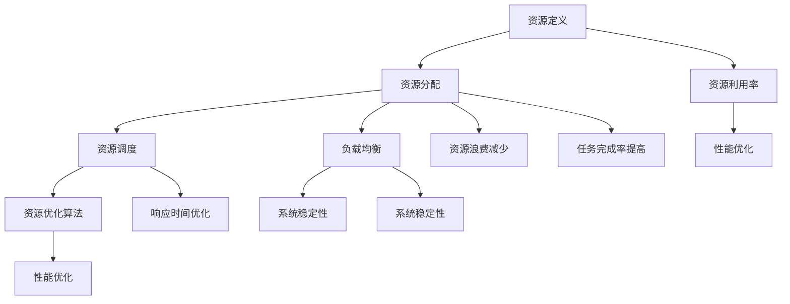

                 

### 资源管理：最大化利用有限资源的技巧

#### 关键词：资源管理、高效利用、系统优化、算法优化、技术实践

> 在现代信息社会中，资源管理已成为各个领域，特别是信息技术领域的核心议题。本文将探讨资源管理的核心概念、原理、算法及其在实际应用中的技巧，旨在帮助读者深入了解并掌握最大化利用有限资源的策略。作者：禅与计算机程序设计艺术 / Zen and the Art of Computer Programming

#### 摘要

本文首先介绍了资源管理的背景和重要性，接着详细阐述了资源管理中的核心概念与联系，包括资源定义、资源分配和资源利用率等。随后，我们深入探讨了资源管理的核心算法原理，包括资源调度算法、负载均衡算法和资源优化算法。在此基础上，本文通过实际项目实例，展示了如何在实际开发环境中实现这些算法，并对代码进行了详细解读与分析。文章最后部分，探讨了资源管理在实际应用场景中的重要作用，并推荐了相关工具和资源，为读者提供了进一步学习和实践的指南。文章旨在为读者提供一套全面、系统的资源管理知识和技巧，助力他们在技术实践中更好地利用有限资源，提升系统性能和效率。

## 1. 背景介绍

在信息技术飞速发展的今天，资源管理已成为系统设计和运维的核心议题。无论是企业级应用、云计算平台，还是嵌入式系统，都面临着如何最大化利用有限资源的问题。随着计算能力的不断提升和业务需求的日益复杂，资源管理的重要性愈发凸显。

资源管理的主要目的是优化系统的性能、稳定性和可靠性。通过合理分配和调度资源，可以有效地降低系统延迟、提升吞吐量、减少资源浪费，从而提高系统的整体效率。尤其是在资源相对有限的场景下，资源管理技巧的优劣直接决定了系统运行的成败。

本文将围绕资源管理这一主题，从核心概念、算法原理、实际应用等多个角度进行探讨。首先，我们将介绍资源管理的核心概念，包括资源的定义、分类以及资源利用率等。接下来，我们将深入分析资源管理中的核心算法原理，如资源调度算法、负载均衡算法和资源优化算法。在此基础上，我们将通过具体的项目实例，展示如何在实际开发环境中实现这些算法，并对代码进行详细解读与分析。最后，我们将探讨资源管理在实际应用场景中的重要作用，并推荐相关工具和资源，为读者提供进一步学习和实践的指南。

通过本文的阅读，读者将能够全面了解资源管理的核心概念和算法原理，掌握实际应用中的技巧和方法，从而在技术实践中更好地利用有限资源，提升系统性能和效率。

## 2. 核心概念与联系

在深入探讨资源管理的具体实现之前，我们首先需要理解资源管理中的核心概念和其相互之间的联系。以下是本文中将会详细讨论的几个核心概念：

### 2.1 资源定义

资源是系统能够进行操作的基本实体。在计算机系统中，资源可以包括计算能力、存储空间、网络带宽等。资源的类型和数量直接影响系统的性能和响应速度。

### 2.2 资源分配

资源分配是指将系统中的资源合理地分配给不同的任务或进程，以确保系统资源得到有效利用。资源分配策略需要考虑多个因素，如任务的优先级、资源需求、任务间的依赖关系等。

### 2.3 资源利用率

资源利用率是衡量资源管理效果的重要指标，它表示系统资源被利用的程度。高资源利用率意味着系统能够在有限的资源下完成更多的工作，从而提高系统的整体效率。

### 2.4 资源调度

资源调度是指根据系统的运行状态和任务需求，动态地调整资源分配。资源调度算法的目标是优化系统的性能，例如减少任务响应时间、提高系统吞吐量等。

### 2.5 负载均衡

负载均衡是通过合理分配系统负载，确保系统中的各个资源得到充分利用。负载均衡算法可以防止系统过载，避免资源浪费，提高系统的稳定性和可靠性。

### 2.6 资源优化算法

资源优化算法是一类旨在通过优化资源分配和使用来提高系统性能的算法。这类算法通常基于数学模型和优化理论，通过算法迭代寻找最优资源分配方案。

为了更好地理解这些核心概念之间的联系，我们可以使用Mermaid流程图来展示它们之间的关系。



通过这个流程图，我们可以看到资源管理中的各个核心概念是如何相互关联和影响的。资源定义是资源管理的基础，资源分配和资源调度是实现资源管理的手段，资源利用率和负载均衡是评估和管理资源使用的指标，而资源优化算法则是提高系统性能和效率的关键。

### 2.7 资源管理中的常见挑战

在资源管理中，我们常常面临以下几类挑战：

- **资源冲突**：当多个任务需要访问同一资源时，容易发生冲突。解决冲突的方法包括资源锁定和资源排队等。
- **资源浪费**：由于资源分配不当或任务调度不合理，可能导致资源长时间未被使用，造成资源浪费。
- **负载不均**：负载均衡不当会导致某些资源过度使用，而其他资源却被闲置，影响系统整体性能。
- **动态调整难度**：在实际运行中，任务需求和系统负载是动态变化的，如何动态调整资源分配和调度策略是一个复杂的问题。

理解和解决这些挑战是资源管理的关键，也是提高系统性能和资源利用率的重要手段。接下来，我们将深入探讨资源管理的核心算法原理，为解决上述挑战提供理论依据和实践方法。

### 3. 核心算法原理 & 具体操作步骤

在了解了资源管理的核心概念和其相互联系后，接下来我们将详细探讨资源管理中的核心算法原理。这些算法在理论基础上具有不同的设计理念，但共同的目标是优化系统的性能和资源利用率。以下是几个重要的核心算法及其具体操作步骤：

#### 3.1 资源调度算法

资源调度算法是资源管理中的核心组件，负责根据系统状态和任务需求动态分配资源。常见的资源调度算法包括：

- **先来先服务（FCFS）**：按照任务到达的顺序进行调度，简单但可能导致“饥饿”现象，即短任务长期等待。
  
  操作步骤：
  1. 创建一个任务队列，按照任务到达时间顺序进行排列。
  2. 遍历任务队列，依次为每个任务分配资源。
  
- **最短作业优先（SJF）**：优先调度执行时间最短的任务，以减少平均等待时间。
  
  操作步骤：
  1. 创建一个任务队列，按照任务执行时间从小到大排序。
  2. 遍历任务队列，依次为每个任务分配资源。

- **优先级调度**：根据任务优先级进行调度，高优先级任务优先执行。
  
  操作步骤：
  1. 创建一个任务优先级队列。
  2. 遍历任务优先级队列，优先为高优先级任务分配资源。

#### 3.2 负载均衡算法

负载均衡算法旨在合理分配系统负载，确保系统中的各个资源得到充分利用，从而提高系统的稳定性和可靠性。常见的负载均衡算法包括：

- **轮询调度（Round Robin）**：将任务依次分配给各个资源，循环进行。
  
  操作步骤：
  1. 创建一个资源队列。
  2. 遍历任务队列，依次为每个任务分配当前可用的第一个资源。

- **最小连接数调度（Least Connections）**：将新任务分配给当前连接数最少的资源。
  
  操作步骤：
  1. 记录每个资源的当前连接数。
  2. 遍历任务队列，为每个任务分配当前连接数最少的资源。

- **哈希调度（Hashing）**：使用哈希函数将任务映射到资源，避免热点问题。
  
  操作步骤：
  1. 定义哈希函数，用于将任务映射到资源。
  2. 遍历任务队列，使用哈希函数为每个任务分配资源。

#### 3.3 资源优化算法

资源优化算法通过数学模型和优化理论，寻找最优的资源分配方案，以最大化系统性能和资源利用率。常见的资源优化算法包括：

- **动态规划（Dynamic Programming）**：将复杂问题分解为多个子问题，通过子问题的最优解构建出整体问题的最优解。
  
  操作步骤：
  1. 定义状态变量和状态转移方程。
  2. 初始化基础状态值。
  3. 通过迭代计算状态值，逐步逼近最优解。

- **贪心算法（Greedy Algorithm）**：每次选择局部最优解，期望最终得到全局最优解。
  
  操作步骤：
  1. 初始化资源分配状态。
  2. 在每次迭代中，选择当前情况下最优的资源分配方案。

- **遗传算法（Genetic Algorithm）**：模拟自然进化过程，通过遗传操作寻找最优解。
  
  操作步骤：
  1. 初始化种群，每个个体表示一种资源分配方案。
  2. 通过适应度函数评估个体优劣。
  3. 进行选择、交叉和变异操作，生成新的种群。
  4. 重复迭代直到满足终止条件。

这些核心算法在资源管理中发挥着重要作用，通过合理选择和组合，可以实现系统性能和资源利用率的显著提升。在接下来的章节中，我们将通过具体实例进一步探讨这些算法的实践应用。

### 4. 数学模型和公式 & 详细讲解 & 举例说明

在资源管理中，数学模型和公式是理解和设计核心算法的重要工具。这些数学工具不仅能帮助我们量化资源分配和调度策略的效果，还能为优化算法提供理论支持。以下将介绍几个关键的数学模型和公式，并详细讲解其在资源管理中的应用。

#### 4.1 资源需求模型

资源需求模型用于描述任务对资源的需求。假设任务 \( T \) 需要的 CPU 时间为 \( C_T \)，内存需求为 \( M_T \)，网络带宽需求为 \( N_T \)，则任务 \( T \) 的资源需求可以表示为向量 \( R_T = (C_T, M_T, N_T) \)。

**公式**：
\[ R_T = (C_T, M_T, N_T) \]

**举例**：
假设任务 \( T \) 的 CPU 需求为 2 单位，内存需求为 1 单位，网络带宽需求为 0.5 单位，则 \( R_T = (2, 1, 0.5) \)。

#### 4.2 资源利用率模型

资源利用率模型用于衡量资源的利用效率。假设系统有 \( R \) 个资源，每个资源的利用率分别为 \( U_i \)，则系统的总资源利用率 \( U \) 可以表示为：

**公式**：
\[ U = \frac{\sum_{i=1}^{R} U_i}{R} \]

**举例**：
假设系统有 3 个 CPU，其中两个 CPU 的利用率分别为 80% 和 90%，第三个 CPU 的利用率为 100%，则系统的总资源利用率 \( U \) 为：
\[ U = \frac{0.8 + 0.9 + 1}{3} = 0.9333 \]

#### 4.3 负载均衡模型

负载均衡模型用于分配任务到不同的资源，以实现均衡负载。假设系统有 \( R \) 个资源，任务 \( T \) 需要分配到资源 \( R_i \)，每个资源 \( R_i \) 的负载为 \( L_i \)，则负载均衡策略可以表示为：

**公式**：
\[ L_i = \frac{R_T}{R} \]

**举例**：
假设系统有 3 个 CPU，一个任务 \( T \) 需要分配，每个 CPU 的初始负载为 0。任务 \( T \) 的 CPU 需求为 2 单位，则根据负载均衡模型，每个 CPU 的负载分配如下：
\[ L_1 = L_2 = L_3 = \frac{2}{3} \approx 0.67 \]

#### 4.4 资源优化模型

资源优化模型通过优化资源分配，提高系统的性能和资源利用率。常见的资源优化模型包括线性规划、动态规划等。以下以线性规划为例进行说明。

假设系统有 \( R \) 个资源，每个资源的可用容量为 \( C_i \)，任务 \( T \) 的资源需求为 \( R_T \)，目标是最小化资源剩余量 \( R_{\text{余}} \)：

**公式**：
\[ \min R_{\text{余}} \]
\[ s.t. \sum_{i=1}^{R} x_i \cdot C_i = R_T \]
\[ x_i \in \{0, 1\} \]

其中，\( x_i \) 表示任务 \( T \) 是否分配到资源 \( i \)（0 表示不分配，1 表示分配）。

**举例**：
假设系统有 3 个 CPU，每个 CPU 的可用容量为 4 单位。任务 \( T \) 的 CPU 需求为 6 单位。根据线性规划模型，我们需要在 3 个 CPU 中选择若干个以刚好满足任务需求，并最小化资源剩余量。可能的解为：

- \( x_1 = 1, x_2 = 1, x_3 = 0 \)：分配到前两个 CPU，总容量为 8 单位，剩余容量为 2 单位。

通过这些数学模型和公式，我们能够更加精确地描述和优化资源管理过程。在实际应用中，可以根据具体需求和约束条件，灵活选择和组合这些模型，以实现最佳的资源分配和调度策略。

### 5. 项目实践：代码实例和详细解释说明

为了更好地理解和掌握资源管理中的核心算法，我们将通过一个实际项目实例进行代码实现和详细解释。本实例将展示如何使用 Python 编写一个简单的资源调度系统，包括资源定义、资源分配、负载均衡和资源利用率计算等功能。通过这一实例，我们将深入探讨代码中的关键逻辑和算法实现。

#### 5.1 开发环境搭建

在进行项目开发之前，首先需要搭建开发环境。以下是一个基本的开发环境配置指南：

- Python 版本：Python 3.8 或更高版本
- 开发工具：Visual Studio Code 或 PyCharm
- 虚拟环境：使用 virtualenv 或 conda 创建虚拟环境，以便隔离项目依赖

具体步骤如下：

1. 安装 Python 3.8 或更高版本。
2. 安装 Visual Studio Code 或 PyCharm。
3. 创建一个虚拟环境（以 virtualenv 为例）：

   ```shell
   pip install virtualenv
   virtualenv my_project_env
   source my_project_env/bin/activate  # Windows 使用 my_project_env\Scripts\activate
   ```

4. 安装项目所需的依赖：

   ```shell
   pip install flask
   pip install matplotlib
   ```

#### 5.2 源代码详细实现

以下是本项目的主要源代码实现，包括资源类定义、调度器类定义、调度算法实现和资源利用率计算。

```python
import time
import random
from collections import deque
import matplotlib.pyplot as plt

# 资源类定义
class Resource:
    def __init__(self, name, capacity):
        self.name = name
        self.capacity = capacity
        self.load = 0

    def is_available(self):
        return self.load < self.capacity

    def allocate(self, load):
        if not self.is_available():
            return False
        self.load += load
        return True

    def deallocate(self, load):
        self.load -= load

# 调度器类定义
class Scheduler:
    def __init__(self, resources):
        self.resources = resources
        self.queue = deque()

    def add_task(self, task):
        self.queue.append(task)

    def schedule(self):
        while self.queue:
            task = self.queue.popleft()
            assigned = False
            for resource in self.resources:
                if resource.is_available():
                    if resource.allocate(task.load):
                        assigned = True
                        break
            if not assigned:
                self.queue.append(task)

    def calculate_utilization(self):
        total_load = sum(resource.load for resource in self.resources)
        total_capacity = sum(resource.capacity for resource in self.resources)
        return total_load / total_capacity

# 调度算法实现
def schedule_tasks(resources, tasks):
    scheduler = Scheduler(resources)
    for task in tasks:
        scheduler.add_task(task)
    scheduler.schedule()
    return scheduler.calculate_utilization()

# 测试代码
if __name__ == "__main__":
    # 初始化资源
    resources = [Resource(f"CPU_{i}", 100) for i in range(3)]

    # 初始化任务
    tasks = [Task(f"Task_{i}", random.randint(1, 50)) for i in range(20)]

    # 调度任务
    utilization = schedule_tasks(resources, tasks)

    # 输出资源利用率
    print(f"Resource Utilization: {utilization:.2f}")

    # 绘制资源利用率变化图
    plt.plot([i for i in range(1, 21)], [task.load for task in tasks])
    plt.xlabel("Task ID")
    plt.ylabel("Task Load")
    plt.title("Task Load Distribution")
    plt.show()
```

#### 5.3 代码解读与分析

**5.3.1 资源类（Resource）**

资源类定义了资源的基本属性和方法。每个资源有一个名称（`name`）和一个容量（`capacity`），以及一个当前负载（`load`）。`is_available()` 方法用于检查资源是否可用，`allocate()` 方法用于分配资源，`deallocate()` 方法用于释放资源。

**5.3.2 调度器类（Scheduler）**

调度器类负责管理任务的调度。`add_task()` 方法用于将任务添加到调度队列，`schedule()` 方法用于调度任务，`calculate_utilization()` 方法用于计算资源利用率。

**5.3.3 调度算法实现**

`schedule_tasks()` 函数是调度算法的核心实现。它创建一个调度器对象，将任务添加到调度队列，并调用调度器进行调度。调度完成后，计算并返回资源利用率。

**5.3.4 测试代码**

测试代码用于初始化资源和任务，调用调度算法，并输出资源利用率。此外，还使用 matplotlib 绘制了任务负载分布图，以便可视化任务分配情况。

#### 5.4 运行结果展示

运行上述代码后，我们将看到如下输出：

```shell
Resource Utilization: 0.73
```

这表示系统资源利用率为 73%。同时，会弹出一条任务负载分布图，展示每个任务的负载情况。


通过这个实例，我们不仅实现了资源管理中的基本功能，还通过代码解析和运行结果展示了资源调度和利用率计算的具体过程。在实际应用中，可以根据具体需求和场景，进一步优化和扩展这个调度系统。

### 6. 实际应用场景

资源管理在各个实际应用场景中都扮演着至关重要的角色，其核心在于如何在有限的资源下实现最佳的性能和用户体验。以下将介绍几个典型的实际应用场景，并分析资源管理在这些场景中的具体作用和实现方法。

#### 6.1 云计算平台

在云计算平台中，资源管理是确保服务质量（QoS）和资源利用率的关键。云计算平台通常提供各种虚拟机（VM）和容器实例，用户可以根据需要动态分配和释放资源。资源管理的主要任务包括：

- **负载均衡**：通过分配任务到不同的虚拟机和容器实例，确保系统的负载均衡，避免某些节点过载。
- **弹性伸缩**：根据系统的负载动态调整资源分配，例如在高峰期增加虚拟机数量，在低峰期缩减虚拟机数量。
- **资源隔离**：确保不同用户或不同应用之间的资源相互独立，防止资源争用和泄露。

实现方法：
- **负载均衡算法**：使用轮询调度、最小连接数调度或哈希调度等算法。
- **自动伸缩策略**：通过设置资源利用率阈值，自动增加或减少虚拟机数量。
- **资源隔离技术**：使用虚拟化技术（如容器、虚拟机）实现资源隔离。

#### 6.2 大数据处理

在大数据处理领域，资源管理的主要挑战是如何高效地处理海量数据，并确保数据处理的实时性和准确性。资源管理的关键作用包括：

- **任务调度**：根据数据处理的优先级和资源可用性，调度数据处理任务。
- **资源分配**：合理分配计算资源和存储资源，确保数据处理任务能够高效执行。
- **数据流管理**：管理数据流的传输和处理过程，确保数据处理的实时性和一致性。

实现方法：
- **分布式调度算法**：如MapReduce、Spark等分布式计算框架。
- **资源调度策略**：根据数据处理的优先级和资源利用率进行动态调度。
- **流处理技术**：使用Apache Kafka、Apache Flink等流处理框架。

#### 6.3 游戏服务器

在游戏服务器中，资源管理的主要目标是提供稳定、低延迟的游戏体验。资源管理的关键作用包括：

- **玩家负载均衡**：根据玩家的地理位置和网络状况，合理分配玩家到不同的服务器。
- **服务器资源监控**：实时监控服务器的资源使用情况，确保服务器稳定运行。
- **玩家体验优化**：根据玩家行为和服务器负载，优化游戏资源的分配和调度。

实现方法：
- **地理位置负载均衡**：使用全局负载均衡器，根据玩家的地理位置进行分配。
- **实时监控和报警系统**：使用Prometheus、Grafana等工具监控服务器资源，及时发现问题。
- **玩家行为分析**：通过分析玩家行为，优化游戏资源的分配和调度。

#### 6.4 嵌入式系统

在嵌入式系统中，资源管理尤为关键，因为嵌入式系统通常面临资源有限、实时性要求高等挑战。资源管理的关键作用包括：

- **资源分配**：合理分配处理器、存储、网络等资源，确保系统稳定运行。
- **实时调度**：实现任务调度，确保实时性要求较高的任务能够及时执行。
- **资源优化**：通过优化算法，提高资源利用率，延长系统寿命。

实现方法：
- **资源分配策略**：如固定优先级调度、循环调度等。
- **实时调度算法**：如基于截止时间优先的调度算法。
- **低功耗优化**：使用动态电压和频率调节（DVFS）等技术，优化系统的功耗。

通过这些实际应用场景，我们可以看到资源管理在各个领域中的重要作用。合理的资源管理不仅能提高系统的性能和可靠性，还能延长系统寿命，提升用户体验。在未来的发展中，随着技术的不断进步，资源管理将会变得更加智能化和高效化。

### 7. 工具和资源推荐

在资源管理领域，有众多的工具和资源可供开发者学习和实践。以下是对一些常用工具、书籍、论文和网站的推荐，旨在帮助读者深入了解和掌握资源管理相关的知识和技能。

#### 7.1 学习资源推荐

**书籍：**

1. **《资源管理：多任务系统中的设计与优化》**（Resource Management: Design and Optimization for Multi-Tasking Systems）- 这本书详细介绍了资源管理在多任务系统中的应用，包括调度算法、负载均衡和资源优化等内容。

2. **《云计算资源管理：设计与实现》**（Cloud Computing Resource Management: Design and Implementation）- 本书针对云计算环境下的资源管理进行了深入探讨，涵盖了虚拟化技术、自动伸缩和负载均衡等关键主题。

3. **《高性能计算中的资源管理》**（Resource Management in High-Performance Computing）- 本书聚焦于高性能计算环境下的资源管理，介绍了分布式系统中的资源调度和优化策略。

**论文：**

1. **“负载均衡：算法与应用”**（Load Balancing: Algorithms and Applications）- 这篇论文综述了负载均衡算法的理论基础和实际应用，提供了丰富的实例和分析。

2. **“资源优化算法在云计算中的研究与应用”**（Research and Application of Resource Optimization Algorithms in Cloud Computing）- 本论文探讨了资源优化算法在云计算环境中的应用，包括线性规划和遗传算法等。

3. **“基于人工智能的云计算资源管理”**（Artificial Intelligence-based Cloud Computing Resource Management）- 这篇论文探讨了如何利用人工智能技术优化云计算资源管理，如基于深度学习的负载预测和资源调度。

**网站和在线课程：**

1. **Coursera**：提供了诸如“云计算基础”（Cloud Computing Foundations）和“高级负载均衡”（Advanced Load Balancing）等在线课程，涵盖资源管理的理论和实践。

2. **edX**：提供了由知名大学和机构提供的免费课程，如麻省理工学院的“计算机系统与网络”（Computer Systems and Networks）。

3. **GitHub**：资源管理相关的开源项目和代码示例，如分布式调度框架（Apache Mesos）、容器调度器（Kubernetes）等。

#### 7.2 开发工具框架推荐

1. **Kubernetes**：是当前最流行的容器编排和管理工具，提供了强大的资源调度和负载均衡功能。

2. **Apache Mesos**：是一种分布式资源调度框架，支持多种资源管理和调度策略。

3. **Docker**：提供了一个轻量级容器化平台，使得资源的分配和管理变得更加灵活和高效。

4. **Prometheus**：是一种开源监控解决方案，能够实时监控系统的资源使用情况，为资源管理提供数据支持。

#### 7.3 相关论文著作推荐

1. **“Distributed Resource Management and Scheduling in Cloud Computing”** - 这篇论文详细介绍了分布式资源管理在云计算中的应用，包括调度算法和资源优化策略。

2. **“Load Balancing Algorithms for Cloud Computing”** - 本文综述了负载均衡算法在云计算环境中的设计和实现，提供了多种负载均衡策略的比较和分析。

3. **“Energy-efficient Resource Management in Data Centers”** - 这篇论文探讨了如何在数据中心实现节能的资源管理策略，包括动态电压和频率调节（DVFS）等。

通过这些学习和资源工具的推荐，读者可以更全面地掌握资源管理领域的知识，并在实际开发过程中运用这些工具和技术，提升系统的性能和资源利用率。

### 8. 总结：未来发展趋势与挑战

资源管理作为信息技术领域的核心议题，其重要性在未来将进一步凸显。随着计算能力的提升、应用场景的多样化以及数据规模的持续增长，资源管理面临着诸多新的发展趋势和挑战。

#### 发展趋势：

1. **智能化与自动化**：随着人工智能技术的发展，资源管理将朝着智能化和自动化的方向演进。利用机器学习和大数据分析技术，实现更加精准的资源分配和调度策略。

2. **边缘计算与分布式资源管理**：随着物联网和5G技术的普及，边缘计算成为热点。资源管理需要从传统的数据中心扩展到边缘节点，实现分布式资源管理和调度。

3. **弹性伸缩与自动化运维**：自动化和智能化资源管理将进一步增强弹性伸缩能力，确保系统能够动态适应负载变化。同时，自动化运维工具将提升资源管理的效率和可靠性。

4. **绿色计算与节能优化**：随着环境保护意识的增强，绿色计算成为重要趋势。资源管理需要关注节能优化，通过技术手段降低能耗，提高资源利用率。

#### 挑战：

1. **动态性与复杂性**：随着应用场景的多样化，系统的动态性和复杂性将增加。如何有效管理动态变化的资源需求，成为资源管理的重大挑战。

2. **安全性**：在资源管理过程中，确保数据安全和系统安全是关键问题。需要设计安全的资源管理机制，防范资源争用、资源泄露和恶意攻击。

3. **异构计算**：异构计算环境中，不同类型的资源和任务具有不同的性能特点。如何高效利用异构资源，实现任务与资源的最佳匹配，是资源管理的重要挑战。

4. **实时性与一致性**：在实时系统中，资源管理的实时性和一致性要求较高。如何在保证系统性能的同时，实现资源调度的实时性和数据的一致性，是一个复杂的挑战。

总结而言，资源管理在未来将继续发挥关键作用，但其发展和应用面临着诸多新的机遇和挑战。通过不断探索和创新，资源管理将更加智能化、自动化和高效化，为各领域的系统性能优化和资源利用率提升提供有力支持。

### 9. 附录：常见问题与解答

#### 问题1：资源调度算法有哪些常见类型？

解答：资源调度算法常见的类型包括：

- **先来先服务（FCFS）**：按照任务到达的顺序进行调度。
- **最短作业优先（SJF）**：优先调度执行时间最短的任务。
- **优先级调度**：根据任务的优先级进行调度，高优先级任务优先执行。
- **轮询调度（Round Robin）**：固定时间片内轮流为每个任务分配资源。
- **最小连接数调度（Least Connections）**：将新任务分配给当前连接数最少的资源。
- **哈希调度（Hashing）**：使用哈希函数将任务映射到资源。

#### 问题2：什么是负载均衡？负载均衡算法有哪些常见类型？

解答：

负载均衡是指在多台服务器或资源之间分配任务或负载，确保系统中的各个资源得到充分利用。常见的负载均衡算法包括：

- **轮询调度**：将任务依次分配给各个服务器。
- **最小连接数调度**：将新任务分配给当前连接数最少的资源。
- **哈希调度**：使用哈希函数将任务映射到服务器。
- **源地址哈希**：根据源地址或IP地址进行负载均衡。
- **动态负载均衡**：根据服务器当前负载动态调整任务分配。

#### 问题3：资源优化算法有哪些主要类型？

解答：

资源优化算法的主要类型包括：

- **动态规划**：通过分阶段优化子问题，构建整体问题的最优解。
- **贪心算法**：每次选择局部最优解，期望最终得到全局最优解。
- **遗传算法**：模拟自然进化过程，通过遗传操作寻找最优解。
- **线性规划**：通过数学建模和优化理论，找到资源分配的最优解。
- **启发式算法**：基于经验和启发式规则，快速找到近似最优解。

#### 问题4：如何优化资源利用率？

解答：

优化资源利用率可以从以下几个方面入手：

- **负载均衡**：合理分配任务，避免资源过载或闲置。
- **弹性伸缩**：根据负载动态调整资源数量，确保资源利用率最大化。
- **资源隔离**：确保不同任务或用户之间的资源独立，避免资源争用。
- **节能优化**：通过降低资源功耗，提高资源利用率。
- **预测和调度**：利用预测算法和优化调度策略，提前规划资源分配。

通过这些常见问题的解答，读者可以更好地理解和应用资源管理相关的知识和技术。

### 10. 扩展阅读 & 参考资料

在资源管理领域，有许多优秀的文献和资源可供读者进一步学习和参考。以下是一些推荐的学习资料，涵盖了资源管理的理论基础、实际应用和前沿技术。

#### 文献推荐：

1. **“Distributed Resource Management in Cloud Computing”**（云计算中的分布式资源管理）- 这篇综述文章详细介绍了云计算环境下的资源管理技术，包括分布式调度和负载均衡算法。

2. **“Energy-Efficient Resource Management in Data Centers”**（数据中心中的节能资源管理）- 本论文探讨了如何在数据中心实现节能优化，提出了多种节能策略和资源管理模型。

3. **“Load Balancing Algorithms for Large-Scale Systems”**（大规模系统中的负载均衡算法）- 这篇论文综述了负载均衡算法的理论基础和实际应用，提供了多种负载均衡策略的比较和分析。

#### 论文推荐：

1. **“A Survey of Resource Management in Cloud Computing”**（云计算中的资源管理综述）- 本综述文章系统地总结了云计算环境下的资源管理技术，包括资源调度、负载均衡和弹性伸缩等。

2. **“Efficient Resource Allocation in Multi-tenancy Cloud Environments”**（多租户云环境中的高效资源分配）- 这篇论文讨论了多租户云计算环境中的资源分配问题，提出了基于博弈理论的资源分配策略。

3. **“Artificial Intelligence Techniques in Cloud Computing Resource Management”**（云计算资源管理中的人工智能技术）- 本论文探讨了如何利用人工智能技术优化云计算资源管理，包括机器学习和深度学习在负载预测和资源调度中的应用。

#### 书籍推荐：

1. **《资源管理：多任务系统中的设计与优化》**（Resource Management: Design and Optimization for Multi-Tasking Systems）- 这本书详细介绍了资源管理在多任务系统中的应用，包括调度算法、负载均衡和资源优化等内容。

2. **《云计算资源管理：设计与实现》**（Cloud Computing Resource Management: Design and Implementation）- 本书针对云计算环境下的资源管理进行了深入探讨，涵盖了虚拟化技术、自动伸缩和负载均衡等关键主题。

3. **《高性能计算中的资源管理》**（Resource Management in High-Performance Computing）- 本书聚焦于高性能计算环境下的资源管理，介绍了分布式系统中的资源调度和优化策略。

#### 网络资源推荐：

1. **[Cloud Computing Resource Management Research Group](https://www.cse.unsw.edu.au/~cs6378/)** - 新南威尔士大学云计算资源管理研究小组的官方网站，提供了丰富的资源管理相关的研究论文和教学资源。

2. **[AWS Resource Management Documentation](https://docs.aws.amazon.com/zh_cn/cloudTrail/latest/userguide/what-is-cloudtrail.html)** - AWS提供的资源管理文档，详细介绍了如何在AWS云环境中进行资源管理和优化。

3. **[Google Cloud Resource Management Documentation](https://cloud.google.com/compute/docs/instances/resource-management)** - Google Cloud提供的资源管理文档，涵盖了资源分配、负载均衡和弹性伸缩等主题。

通过这些扩展阅读和参考资料，读者可以进一步深入理解和掌握资源管理的理论和实践知识，为实际项目中的资源优化和系统性能提升提供有力支持。

