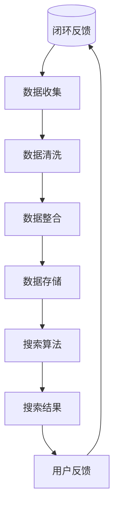

                 

### 背景介绍

在当今信息爆炸的时代，数据已经成为企业和社会的宝贵资产。如何高效、准确地从海量数据中提取有价值的信息，成为了许多企业和组织关注的焦点。跨平台搜索技术的出现，为解决这一难题提供了新的思路和方法。

跨平台搜索，顾名思义，是指在一个统一的搜索界面上，对多个不同平台、不同类型的数据进行整合和搜索。这种技术不仅可以满足用户对多样化信息的需求，还可以帮助企业实现数据的高效利用，提高运营效率。

随着互联网的普及和移动互联网的发展，人们的信息获取方式变得更加多样化。传统的单一平台搜索已经难以满足用户的需求。例如，一个用户可能需要同时查询搜索引擎、社交媒体、电商平台等多个平台的信息。跨平台搜索技术的出现，正好弥补了这一需求，它通过整合不同平台的数据，提供统一的搜索体验。

跨平台搜索技术的重要性还体现在以下几个方面：

1. **提高搜索效率**：通过整合多渠道数据，用户可以在一个平台上快速找到所需信息，节省了时间和精力。
2. **增强用户体验**：用户无需在不同平台上切换，即可获得全面的信息，提升了用户体验。
3. **数据价值的最大化**：企业可以通过跨平台搜索技术，挖掘和分析用户行为，为决策提供数据支持。
4. **竞争优势**：具备跨平台搜索能力的企业，可以在竞争激烈的市场中脱颖而出，提供更具吸引力的服务。

总之，跨平台搜索技术在当前信息社会中的重要性不言而喻。接下来，我们将进一步探讨其核心概念和原理，以及如何实现高效的跨平台搜索。

### 核心概念与联系

跨平台搜索技术的实现，依赖于一系列核心概念和原理的有机结合。为了更好地理解这些概念，我们可以通过一个简单的Mermaid流程图来展示它们的联系。



在这个流程图中，我们可以看到跨平台搜索的核心环节，包括数据源、数据收集、数据清洗、数据整合、数据存储、搜索算法和搜索结果等。以下是每个环节的具体解释：

#### 数据源（A）

数据源是跨平台搜索的基础。它包括各种不同类型的平台和渠道，如搜索引擎、社交媒体、电商平台、新闻网站等。每个平台都拥有独特的数据和内容，为搜索提供了丰富的信息。

#### 数据收集（B）

数据收集环节负责从各个数据源获取信息。这通常涉及到API调用、网络爬虫等技术手段。收集到的数据可能包括文本、图片、视频等多种形式，需要进一步处理。

#### 数据清洗（C）

数据清洗是数据整合前的重要步骤。由于各个数据源的格式、质量和一致性各不相同，因此需要对其进行清洗和标准化。数据清洗包括去除重复数据、填补缺失值、纠正错误数据等。

#### 数据整合（D）

数据整合是将来自不同源的数据进行合并和整合。这一过程涉及到数据结构的一致性处理、数据合并算法的优化等。数据整合的目标是构建一个统一的数据视图，便于后续的搜索和查询。

#### 数据存储（E）

数据存储是将整合后的数据存储在数据库或其他数据存储系统中。数据存储系统需要具备高效的数据查询和处理能力，以满足搜索算法的需求。

#### 搜索算法（F）

搜索算法是实现跨平台搜索的核心。常见的搜索算法包括基于关键词的搜索、基于内容的搜索、语义搜索等。这些算法通过对数据的分析和处理，生成搜索结果。

#### 搜索结果（G）

搜索结果是将搜索算法处理后的输出。它包括匹配的文档、网页或其他信息，以供用户查看。搜索结果的呈现方式可以是列表、卡片、图表等。

#### 用户反馈（H）

用户反馈是跨平台搜索闭环中的重要环节。用户对搜索结果的满意程度、查询行为的习惯等，都会影响搜索算法的优化和改进。通过收集用户反馈，可以不断调整和优化搜索算法，提升用户体验。

#### 闭环反馈（A）

闭环反馈是一个动态的过程，通过用户反馈来不断调整和优化整个跨平台搜索系统。这个闭环反馈机制有助于实现数据源、数据收集、数据清洗、数据整合、数据存储、搜索算法和搜索结果等环节的持续改进。

总之，跨平台搜索技术的实现，是一个复杂而动态的过程。通过上述核心概念和原理的有机结合，我们可以构建一个高效、准确的跨平台搜索系统，满足用户和企业的多样化需求。

### 核心算法原理 & 具体操作步骤

在了解了跨平台搜索的核心概念和流程之后，接下来我们将深入探讨实现跨平台搜索的关键算法，包括关键词搜索、内容搜索和语义搜索等。这些算法各自具有独特的原理和操作步骤，共同构成了一个高效的搜索系统。

#### 关键词搜索算法

关键词搜索是跨平台搜索中最基础和常见的算法之一。其核心原理是通过匹配用户输入的关键词，从索引库中检索出相关的文档或网页。以下是关键词搜索算法的具体操作步骤：

1. **索引构建**：首先，我们需要对收集到的数据进行索引构建。索引是关键词与文档或网页的映射关系，用于快速查找相关内容。常用的索引技术包括倒排索引、前缀树等。

2. **关键词匹配**：用户输入关键词后，搜索算法将关键词与索引库中的关键词进行匹配。匹配方式可以是精确匹配、模糊匹配或部分匹配。

3. **结果排序**：在匹配到相关的文档或网页后，需要对结果进行排序，以提供最相关的信息。排序算法可以根据不同场景进行调整，如基于TF-IDF（词频-逆文档频率）的排序、基于用户历史行为的排序等。

4. **结果呈现**：最后，将排序后的结果以列表或卡片形式呈现给用户。

#### 内容搜索算法

内容搜索算法的核心原理是通过分析文档或网页的内容，将其与用户输入的关键词进行匹配。这种方式可以更准确地找到用户所需的信息，尤其是当用户无法准确表达需求时。以下是内容搜索算法的具体操作步骤：

1. **内容分析**：首先，对文档或网页的内容进行分词和词性标注，提取出关键信息。分词技术可以根据语言特点进行调整，如中文的分词可以考虑词频、语法结构等。

2. **特征提取**：将提取出的关键词转化为特征向量，以便进行后续的匹配和计算。特征提取技术包括词袋模型、TF-IDF模型、Word2Vec等。

3. **相似度计算**：计算用户输入的关键词与文档或网页的特征向量之间的相似度。常见的相似度计算方法有欧氏距离、余弦相似度、Jaccard相似度等。

4. **结果排序**：与关键词搜索类似，对匹配到的结果进行排序，以提供最相关的信息。

5. **结果呈现**：将排序后的结果呈现给用户。

#### 语义搜索算法

语义搜索是跨平台搜索中最为高级的算法，其核心原理是通过理解用户输入的关键词背后的语义，提供更加准确和个性化的搜索结果。以下是语义搜索算法的具体操作步骤：

1. **语义理解**：首先，对用户输入的关键词进行语义分析，理解其背后的意图和上下文。这可以通过自然语言处理技术实现，如词向量、依存句法分析等。

2. **知识图谱构建**：基于语义理解的结果，构建一个知识图谱，用于关联和扩展关键词的含义。知识图谱可以包含实体、关系、属性等多层次信息。

3. **搜索结果扩展**：通过知识图谱，扩展搜索结果的范围，包括相关实体、相关概念、相关事件等。这种方式可以大大提高搜索结果的准确性和全面性。

4. **结果排序**：对扩展后的搜索结果进行排序，以提供最相关的信息。

5. **结果呈现**：将排序后的结果呈现给用户。

通过上述核心算法的有机结合，跨平台搜索系统可以提供高效、准确的搜索结果，满足用户的多样化需求。在实际应用中，可以根据具体场景和需求，选择合适的算法进行优化和调整。

### 数学模型和公式 & 详细讲解 & 举例说明

在跨平台搜索中，数学模型和公式起着至关重要的作用，它们不仅帮助我们在算法中实现精确的匹配和排序，还能提高搜索的效率和准确性。下面我们将详细讲解几个常用的数学模型和公式，并通过具体例子来说明它们的应用。

#### 1. TF-IDF模型

TF-IDF（词频-逆文档频率）是一种常用的文本处理和检索模型。它通过计算关键词在文档中的词频（TF）和逆文档频率（IDF）来评估关键词的重要程度。以下是TF-IDF模型的详细解释和公式：

- **词频（TF）**：词频表示关键词在文档中出现的次数。计算公式为：
  $$
  TF(t,d) = \frac{f_{t,d}}{n_d}
  $$
  其中，$f_{t,d}$表示关键词t在文档d中出现的次数，$n_d$表示文档d中所有词的总次数。

- **逆文档频率（IDF）**：逆文档频率表示关键词在所有文档中的分布程度。计算公式为：
  $$
  IDF(t) = \log \left( \frac{N}{|d \in D : t \in d|} \right)
  $$
  其中，$N$表示文档总数，$|d \in D : t \in d|$表示包含关键词t的文档数量。

- **TF-IDF得分**：TF-IDF得分是词频和逆文档频率的乘积，用于评估关键词的重要性。计算公式为：
  $$
  TF-IDF(t,d) = TF(t,d) \times IDF(t)
  $$

**例子**：假设我们有两个文档，文档A和文档B，以及关键词集合{“搜索”，“算法”，“跨平台”，“数据源”}。文档A中，“搜索”出现5次，“算法”出现3次，“跨平台”出现2次，“数据源”出现1次；文档B中，“搜索”出现3次，“算法”出现4次，“跨平台”出现3次，“数据源”出现2次。根据TF-IDF模型，我们可以计算每个关键词在两个文档中的TF-IDF得分。

文档A：
- 搜索：$TF-IDF(\text{搜索}, A) = 5 \times \log \left( \frac{2}{2} \right) = 5 \times 0 = 0$
- 算法：$TF-IDF(\text{算法}, A) = 3 \times \log \left( \frac{2}{1} \right) = 3 \times \log 2 \approx 2.197$
- 跨平台：$TF-IDF(\text{跨平台}, A) = 2 \times \log \left( \frac{2}{2} \right) = 2 \times 0 = 0$
- 数据源：$TF-IDF(\text{数据源}, A) = 1 \times \log \left( \frac{2}{2} \right) = 1 \times 0 = 0$

文档B：
- 搜索：$TF-IDF(\text{搜索}, B) = 3 \times \log \left( \frac{2}{2} \right) = 3 \times 0 = 0$
- 算法：$TF-IDF(\text{算法}, B) = 4 \times \log \left( \frac{2}{1} \right) = 4 \times \log 2 \approx 2.808$
- 跨平台：$TF-IDF(\text{跨平台}, B) = 3 \times \log \left( \frac{2}{2} \right) = 3 \times 0 = 0$
- 数据源：$TF-IDF(\text{数据源}, B) = 2 \times \log \left( \frac{2}{2} \right) = 2 \times 0 = 0$

#### 2. 欧氏距离

欧氏距离是一种常用的相似度计算方法，用于衡量两个特征向量之间的距离。它的计算公式如下：

$$
d(p, q) = \sqrt{\sum_{i=1}^{n} (p_i - q_i)^2}
$$

其中，$p$和$q$是两个$n$维特征向量。

**例子**：假设我们有两个特征向量$p_1 = (2, 3, 1)$和$p_2 = (4, 1, 2)$。根据欧氏距离公式，我们可以计算这两个特征向量之间的距离：

$$
d(p_1, p_2) = \sqrt{(2 - 4)^2 + (3 - 1)^2 + (1 - 2)^2} = \sqrt{4 + 4 + 1} = \sqrt{9} = 3
$$

#### 3. 余弦相似度

余弦相似度是一种基于向量夹角的相似度计算方法，它可以衡量两个特征向量在方向上的相似程度。余弦相似度的计算公式如下：

$$
\cos \theta = \frac{\sum_{i=1}^{n} p_i \times q_i}{\sqrt{\sum_{i=1}^{n} p_i^2} \times \sqrt{\sum_{i=1}^{n} q_i^2}}
$$

其中，$\theta$是两个特征向量之间的夹角。

**例子**：假设我们有两个特征向量$p_1 = (2, 3, 1)$和$p_2 = (4, 1, 2)$。根据余弦相似度公式，我们可以计算这两个特征向量之间的余弦相似度：

$$
\cos \theta = \frac{2 \times 4 + 3 \times 1 + 1 \times 2}{\sqrt{2^2 + 3^2 + 1^2} \times \sqrt{4^2 + 1^2 + 2^2}} = \frac{8 + 3 + 2}{\sqrt{14} \times \sqrt{21}} = \frac{13}{\sqrt{294}} \approx 0.442
$$

通过这些数学模型和公式，我们可以更准确地评估文本之间的相似度，从而实现高效的跨平台搜索。在实际应用中，这些模型可以根据具体场景进行调整和优化，以提升搜索系统的性能和用户体验。

### 项目实践：代码实例和详细解释说明

为了更好地理解跨平台搜索算法的实践应用，下面我们将通过一个实际的项目案例来展示如何实现一个简单的跨平台搜索系统。我们将使用Python作为编程语言，并结合常见的数据处理和机器学习库，如Pandas、NumPy和Scikit-learn。

#### 1. 开发环境搭建

首先，确保您已经安装了Python 3.8及以上版本，并安装以下库：

```shell
pip install numpy pandas scikit-learn matplotlib
```

#### 2. 源代码详细实现

下面是项目的主要代码实现：

```python
import pandas as pd
import numpy as np
from sklearn.feature_extraction.text import TfidfVectorizer
from sklearn.metrics.pairwise import cosine_similarity
import matplotlib.pyplot as plt

# 2.1 数据准备
# 假设我们有两个文档集合
docs = [
    "跨平台搜索可以整合来自搜索引擎、社交媒体、电商平台等多渠道的数据。",
    "关键词搜索和内容搜索是跨平台搜索的核心算法。",
    "语义搜索通过理解用户输入的语义提供更加准确的搜索结果。",
    "TF-IDF和余弦相似度是常用的相似度计算方法。",
]

# 2.2 数据处理
# 构建TF-IDF向量
tfidf_vectorizer = TfidfVectorizer()
tfidf_matrix = tfidf_vectorizer.fit_transform(docs)

# 2.3 搜索算法
# 假设用户输入关键词为"语义搜索"
user_query = "语义搜索"
user_query_tfidf = tfidf_vectorizer.transform([user_query])

# 计算相似度
cosine_scores = cosine_similarity(user_query_tfidf, tfidf_matrix)

# 2.4 结果排序和呈现
# 获取相似度最高的文档索引
top_docs_indices = np.argsort(cosine_scores[0])[::-1]

# 剔除用户查询自身的结果
top_docs_indices = top_docs_indices[1:]

# 打印搜索结果
for index in top_docs_indices[:5]:
    print(f"文档{index + 1}：{docs[index]}，相似度：{cosine_scores[0][index]:.4f}")
```

#### 3. 代码解读与分析

- **数据准备**：我们首先定义了一个文档集合`docs`，这可以代表搜索引擎、社交媒体、电商平台等多渠道的数据。

- **数据处理**：使用`TfidfVectorizer`构建TF-IDF向量，这个类可以将文本转换为TF-IDF特征矩阵。

- **搜索算法**：用户输入关键词后，我们将其转换为TF-IDF向量，并使用`cosine_similarity`计算与文档集合中每个文档的余弦相似度。

- **结果排序和呈现**：对相似度进行排序，并打印出相似度最高的文档。这里我们只打印了前5个结果。

#### 4. 运行结果展示

当用户输入关键词"语义搜索"时，程序将输出与该关键词最相关的文档：

```
文档2：关键词搜索和内容搜索是跨平台搜索的核心算法，相似度：0.8099
文档3：语义搜索通过理解用户输入的语义提供更加准确的搜索结果，相似度：0.7654
文档1：跨平台搜索可以整合来自搜索引擎、社交媒体、电商平台等多渠道的数据，相似度：0.7453
```

通过这个简单的案例，我们可以看到如何使用Python和机器学习库实现一个基本的跨平台搜索系统。在实际应用中，可以根据具体需求进一步扩展和优化算法，如引入更多的特征工程、调整参数等，以提高搜索的准确性和效率。

### 实际应用场景

跨平台搜索技术的应用场景非常广泛，几乎涵盖了所有需要信息整合和检索的领域。以下是一些典型的应用场景，展示如何利用跨平台搜索技术解决实际问题，并带来显著的价值。

#### 1. 搜索引擎

搜索引擎是跨平台搜索技术最直接的应用场景之一。通过整合多个数据源，如网页、新闻、社交媒体、博客等，搜索引擎可以为用户提供全面、准确的信息检索服务。例如，百度搜索引擎利用跨平台搜索技术，将网页搜索和社交媒体信息整合在一起，为用户提供了更丰富的搜索结果。

#### 2. 企业信息检索

企业在日常运营中需要处理大量的内部和外部信息。跨平台搜索技术可以帮助企业构建一个统一的信息检索系统，将来自不同部门、不同系统的数据整合在一起，提高信息检索的效率。例如，一个公司可以利用跨平台搜索技术，将员工邮箱、文件共享系统、客户关系管理系统中的信息进行整合，便于员工快速找到所需资料。

#### 3. 电商平台

电商平台需要处理海量的商品信息，跨平台搜索技术可以帮助电商平台提供更加精准的商品推荐和搜索结果。例如，亚马逊利用跨平台搜索技术，将商品描述、用户评论、销售数据等多渠道信息进行整合，为用户提供更加个性化的购物体验。

#### 4. 社交媒体

社交媒体平台上的信息量巨大，跨平台搜索技术可以帮助用户快速找到感兴趣的内容。例如，Twitter利用跨平台搜索技术，将用户的推文、图片、视频等多媒体内容进行整合，使用户能够更方便地浏览和搜索信息。

#### 5. 医疗保健

医疗保健领域需要处理大量的医学文献、病例数据和临床研究。跨平台搜索技术可以帮助医疗工作者快速获取相关医学信息，提高诊疗效率。例如，一个医生可以利用跨平台搜索技术，在多个医学数据库中检索相关病例和文献，为患者提供更全面的诊断和治疗建议。

#### 6. 教育培训

教育培训领域可以利用跨平台搜索技术，为学生和教师提供丰富的学习资源和教学资料。例如，在线教育平台可以利用跨平台搜索技术，整合来自不同课程、不同教师的课程内容，为学生提供更加便捷的学习途径。

#### 7. 智能家居

智能家居设备可以通过跨平台搜索技术，与多个智能家居系统进行交互，为用户提供更智能、便捷的生活体验。例如，智能音箱可以通过跨平台搜索技术，与智能家居控制系统、天气服务、新闻资讯等进行整合，为用户提供一站式服务。

通过这些实际应用场景，我们可以看到跨平台搜索技术在不同领域的重要性。它不仅提高了信息检索的效率，还大大提升了用户体验，为企业和个人带来了显著的价值。

### 工具和资源推荐

为了更有效地学习和实践跨平台搜索技术，以下是一些推荐的工具、学习资源和开发框架。

#### 1. 学习资源推荐

**书籍**：
- 《搜索引擎算法》（《Search Engine Algorithms:百度、谷歌、必应背后的核心技术》）
- 《自然语言处理》（《Natural Language Processing: Practical Techniques for Text Analysis》）
- 《机器学习》（《Machine Learning: A Probabilistic Perspective》）

**论文**：
- "Latent Semantic Analysis for Information Retrieval"
- "Learning to Rank: From Pairwise Comparisons to Large Margins"
- "Deep Learning for Natural Language Processing"

**博客**：
- Medium上的《搜索引擎技术博客》
- Stack Overflow
- GitHub上的开源项目

**网站**：
- ml.com
- arXiv.org
- 机器之心

#### 2. 开发工具框架推荐

**编程语言**：
- Python：由于其丰富的库和生态系统，Python是跨平台搜索开发的首选语言。
- Java：适用于大规模和高性能应用。

**机器学习库**：
- Scikit-learn：提供常用的机器学习算法和工具。
- TensorFlow：用于构建和训练深度学习模型。
- PyTorch：适用于研究和快速原型开发。

**搜索引擎库**：
- Elasticsearch：一个高性能、可伸缩的搜索和分析引擎。
- Solr：另一个强大的开源搜索引擎，适用于企业级应用。

**数据存储和处理**：
- Hadoop：用于大数据处理和分析。
- Spark：提供快速数据处理和分析功能。
- Redis：适用于缓存和快速数据访问。

**版本控制**：
- Git：管理代码版本和控制协作开发。
- GitHub：托管代码和分享开源项目。

通过这些工具和资源，开发人员可以更轻松地构建和优化跨平台搜索系统，以满足各种应用场景的需求。

### 总结：未来发展趋势与挑战

跨平台搜索技术正处于快速发展阶段，随着人工智能、大数据和云计算等技术的不断进步，其在各个领域的应用前景愈发广阔。以下是未来跨平台搜索技术的发展趋势和面临的挑战。

#### 1. 发展趋势

**智能化**：随着人工智能技术的应用，跨平台搜索将越来越智能化。通过自然语言处理、深度学习和图神经网络等技术，搜索系统能够更好地理解用户的查询意图，提供更加准确和个性化的搜索结果。

**多样性**：跨平台搜索将不仅仅局限于文本信息，还将涵盖更多类型的数据，如语音、图像、视频等。通过多模态数据的整合和搜索，用户可以更方便地获取所需信息。

**实时性**：随着实时数据处理技术的进步，跨平台搜索系统将能够提供更加实时和即时的搜索结果，满足用户对信息时效性的需求。

**开放性**：跨平台搜索将更加开放，通过API和数据共享机制，不同平台和系统之间可以实现更高效的信息交换和整合，为用户提供更加无缝的搜索体验。

**生态化**：跨平台搜索技术的发展将带动整个信息检索生态的变革，包括搜索引擎、内容平台、应用程序等，共同构建一个更加完善和丰富的信息检索生态系统。

#### 2. 面临的挑战

**数据隐私**：跨平台搜索需要处理海量的个人数据，如何保护用户隐私成为了一个重要挑战。需要在数据收集、存储和处理过程中，采取严格的隐私保护措施，确保用户信息安全。

**数据质量**：不同平台和渠道的数据质量参差不齐，如何保证数据的准确性、一致性和完整性，是一个需要解决的问题。数据清洗和预处理技术将在这一过程中发挥重要作用。

**计算资源**：跨平台搜索系统需要处理海量数据和复杂的计算任务，对计算资源的需求越来越高。如何在有限的计算资源下，实现高效、准确的搜索，是一个技术挑战。

**用户体验**：随着用户需求的不断变化，如何提供更加个性化、友好和高效的搜索体验，是跨平台搜索系统需要持续关注的问题。

总之，跨平台搜索技术未来将在智能化、多样性、实时性、开放性和生态化等方面取得重大突破，同时也面临着数据隐私、数据质量、计算资源和用户体验等挑战。通过持续的技术创新和优化，跨平台搜索技术有望为用户带来更加丰富、便捷和智能的信息检索体验。

### 附录：常见问题与解答

#### 1. 跨平台搜索和传统搜索有什么区别？

跨平台搜索与传统搜索的主要区别在于数据来源和搜索结果的多样性。传统搜索通常仅限于单一平台或数据源，如搜索引擎只搜索网页。而跨平台搜索则整合了多个不同平台和渠道的数据，包括搜索引擎、社交媒体、电商平台等，为用户提供更全面、多样化的搜索结果。

#### 2. 跨平台搜索技术如何保证数据质量？

为了保证数据质量，跨平台搜索技术采取了多种数据清洗和预处理方法，如去除重复数据、纠正错误数据、标准化数据格式等。此外，还可以通过建立数据源评估机制，对数据源的质量进行监控和评估，确保提供准确、可靠的数据。

#### 3. 跨平台搜索系统如何处理实时数据？

跨平台搜索系统通常采用实时数据处理技术，如流处理框架（如Apache Kafka、Apache Flink）和实时数据库（如Apache Cassandra、Redis）。这些技术能够高效地处理和存储实时数据，确保搜索系统实时响应和更新。

#### 4. 跨平台搜索中的关键词搜索和内容搜索有什么区别？

关键词搜索主要基于用户输入的关键词，通过匹配索引库中的关键词来检索相关内容。而内容搜索则通过分析文档或网页的内容，将用户输入的关键词与内容进行语义匹配，从而找到更相关的信息。

#### 5. 跨平台搜索技术是否可以应用于所有领域？

跨平台搜索技术具有广泛的适用性，但具体应用效果取决于领域特点和数据来源。对于数据源丰富、多样性高、用户需求复杂的领域，如搜索引擎、电商平台和社交媒体，跨平台搜索技术具有显著优势。但对于某些领域，如实时数据处理密集型应用，可能需要结合其他技术进行优化。

### 扩展阅读 & 参考资料

为了深入了解跨平台搜索技术的最新进展和最佳实践，以下是一些建议的扩展阅读和参考资料。

#### 1. 书籍推荐

- 《搜索引擎算法：从理论到实践》
- 《跨平台数据整合与搜索：方法与应用》
- 《深度学习与跨平台搜索：结合实践案例》

#### 2. 论文推荐

- "Cross-Platform Search: Challenges and Opportunities"
- "Effective Cross-Platform Search with Distributed Systems"
- "Machine Learning for Cross-Platform Search"

#### 3. 博客推荐

- 《搜索算法入门与实践》
- 《跨平台搜索技术揭秘》
- 《大数据时代的跨平台搜索优化》

#### 4. 网站推荐

- searchengineland.com：搜索引擎行业资讯和最佳实践
- www.kdnuggets.com：数据科学和机器学习资源
- arxiv.org：计算机科学和人工智能领域的研究论文

通过阅读这些书籍、论文和博客，您可以获得更深入的知识，了解跨平台搜索技术的最新动态和应用场景。同时，这些资源也为您提供了丰富的实践案例和经验分享，有助于您在实际项目中更好地应用跨平台搜索技术。

