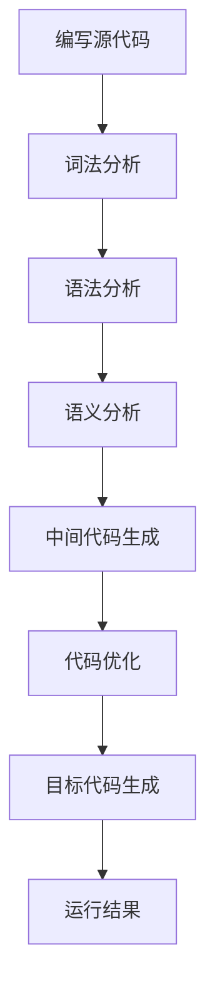

                 

### 1. 背景介绍

在当今数字化时代，软件开发变得越来越复杂且具有多样性。随着互联网、移动设备和云计算的普及，开发者面临着多个平台和设备上的应用程序开发的挑战。不同操作系统（如Windows、macOS、Linux）、硬件架构（如ARM、x86）以及编程语言（如Java、C++、Python）之间的差异，使得开发者需要投入大量的时间和精力来确保应用程序能够在不同的环境中运行。

跨平台编译技术正是为了解决这一挑战而诞生的。其核心目标是通过一次编写，生成能够在多个平台和设备上运行的代码。这不仅提高了开发效率，还降低了维护成本，使得开发者能够将精力集中在核心功能的实现上，而无需为每个平台编写独立的代码。

跨平台编译的历史可以追溯到上世纪80年代，随着个人计算机的普及，出现了多种不同的操作系统和硬件平台。为了应对这种多样性，开发者开始探索如何在不同的环境中编译和运行代码。早期的解决方案通常依赖于模拟器或虚拟机，但这些方法在性能和兼容性方面存在许多限制。

随着编译技术和编程语言的发展，特别是静态编译器和动态链接库的出现，跨平台编译技术逐渐成熟。现代的跨平台编译器如GCC、Clang和Java的JDK，能够在不同的操作系统和硬件平台上生成高效的执行代码。此外，现代的集成开发环境（IDE）也提供了强大的工具支持，使得开发者可以更加方便地进行跨平台编译。

总的来说，跨平台编译技术的出现极大地改变了软件开发的格局，使得开发者能够更加高效地开发和部署应用程序。然而，随着技术的不断进步，跨平台编译也面临着新的挑战和机遇。本文将深入探讨跨平台编译的核心概念、原理、算法以及实际应用，帮助读者更好地理解和掌握这一关键技术。

### 2. 核心概念与联系

#### 2.1 定义

跨平台编译，顾名思义，是指编写一次代码，然后能够在多个不同的平台和操作系统上编译、运行的过程。这里提到的“平台”包括但不限于不同的操作系统、处理器架构、硬件设备等。跨平台编译的核心目的是通过编译器的优化和适配，使得源代码能够在不同的目标环境中高效执行。

#### 2.2 跨平台编译器

要实现跨平台编译，首先需要一个能够理解和转换源代码的编译器。编译器是计算机科学中至关重要的工具，它将人类编写的程序代码（源代码）转换成机器能够理解和执行的指令（目标代码）。不同平台的编译器需要具备特定的功能和优化策略，以确保生成的目标代码能够在相应的平台上高效运行。

常见的跨平台编译器包括：

- **GCC（GNU Compiler Collection）**：由GNU项目开发，支持多种编程语言，如C、C++和Fortran，能够编译生成适用于多种操作系统和硬件架构的目标代码。
- **Clang**：由LLVM项目开发，也是一个功能强大的编译器，支持多种编程语言，如C、C++和Objective-C。Clang以其优秀的性能和易于扩展的特点受到许多开发者的喜爱。
- **Java JDK（Java Development Kit）**：Java语言的核心工具集，提供了Java编译器和运行环境，使得Java代码可以在任何安装了Java虚拟机（JVM）的设备上运行。

#### 2.3 编译器工作流程

编译器的工作流程可以大致分为以下几个阶段：

1. **词法分析**：将源代码分解成词法单元（Token），如变量名、关键字、运算符等。
2. **语法分析**：将词法单元组合成语法结构，如表达式、语句、函数等。
3. **语义分析**：检查源代码的语义是否正确，如变量是否声明、类型是否匹配等。
4. **中间代码生成**：将语法分析后的抽象语法树（AST）转换成中间代码，如LLVM IR。
5. **优化**：对中间代码进行各种优化，如常量折叠、死代码消除等，以提高执行效率。
6. **代码生成**：将优化的中间代码转换成特定目标平台的机器代码。

#### 2.4 跨平台编译的挑战

跨平台编译虽然提高了开发效率，但也带来了一系列挑战：

- **平台差异性**：不同操作系统和硬件架构的差异，如指令集、操作系统API等，需要编译器进行适配和优化。
- **兼容性问题**：不同平台的库和工具链可能存在兼容性问题，需要开发者进行额外的配置和调整。
- **性能优化**：为了确保跨平台编译生成的代码能够在不同平台上高效运行，编译器需要针对不同平台进行优化。

#### 2.5 关键概念原理和架构的 Mermaid 流程图

以下是一个简单的Mermaid流程图，展示了跨平台编译的核心概念和原理：



- **A：编写源代码**：开发人员使用编程语言编写应用程序源代码。
- **B：词法分析**：编译器将源代码分解成词法单元。
- **C：语法分析**：编译器将词法单元组合成语法结构。
- **D：语义分析**：编译器检查源代码的语义是否正确。
- **E：中间代码生成**：编译器生成中间代码，便于后续优化。
- **F：代码优化**：对中间代码进行各种优化。
- **G：目标代码生成**：编译器生成适用于特定目标平台的机器代码。
- **H：运行结果**：编译器生成的目标代码在目标平台上运行。

### 3. 核心算法原理 & 具体操作步骤

#### 3.1 编译原理概述

编译器的工作可以概括为四个主要阶段：词法分析、语法分析、语义分析和目标代码生成。每个阶段都有其特定的算法和实现细节。以下将详细描述这些阶段的基本原理和操作步骤。

#### 3.2 词法分析

词法分析是编译器的第一个阶段，其主要任务是识别源代码中的词法单元。词法单元是程序中最小的语法成分，如关键字、标识符、常量、运算符和分隔符等。词法分析器通常使用正则表达式来定义词法规则，并使用有限自动机（Finite Automaton）来匹配和识别词法单元。

**具体操作步骤：**

1. **初始化**：编译器初始化词法分析器，设置状态和输入缓冲区。
2. **读取字符**：从源代码中逐个读取字符，并将其存储到输入缓冲区中。
3. **匹配规则**：使用正则表达式匹配规则，识别当前字符序列是否构成词法单元。
4. **生成词法单元**：如果字符序列匹配成功，生成对应的词法单元，并将其存储在符号表中。
5. **处理错误**：如果匹配失败，报告词法错误，并可能根据错误处理策略进行恢复。

#### 3.3 语法分析

语法分析是编译器的第二个阶段，其主要任务是将词法单元序列转换为语法结构。语法分析器通常使用递归下降分析、LL(1)分析、LR(1)分析等算法来实现。这些算法通过递归或栈结构对输入的词法单元进行语法解析，生成抽象语法树（Abstract Syntax Tree, AST）。

**具体操作步骤：**

1. **初始化**：编译器初始化语法分析器，设置状态和栈结构。
2. **读取词法单元**：从词法分析器中读取下一个词法单元。
3. **构建AST**：根据语法规则，将词法单元序列转换为AST节点。
4. **错误处理**：如果语法分析失败，报告语法错误，并可能根据错误处理策略进行恢复。

#### 3.4 语义分析

语义分析是编译器的第三个阶段，其主要任务是在语法分析的基础上，检查源代码的语义是否正确。语义分析器通过符号表来跟踪变量、函数、类等的定义和使用情况，并检查类型、作用域等语义规则。

**具体操作步骤：**

1. **初始化**：编译器初始化语义分析器，设置符号表。
2. **遍历AST**：对AST进行遍历，检查每个节点的语义。
3. **类型检查**：检查表达式、函数调用等是否满足类型规则。
4. **作用域分析**：检查变量和函数的作用域，确保其在正确的范围内使用。
5. **错误处理**：如果语义分析失败，报告语义错误，并可能根据错误处理策略进行恢复。

#### 3.5 中间代码生成

中间代码生成是编译器的第四个阶段，其主要任务是将AST转换为中间代码。中间代码通常是一种简单且易于优化的表示形式，如三地址代码、语法树等。中间代码生成器通过遍历AST，根据特定的规则生成中间代码。

**具体操作步骤：**

1. **初始化**：编译器初始化中间代码生成器，设置输出缓冲区。
2. **遍历AST**：对AST进行遍历，根据规则生成中间代码。
3. **插入标签**：在中间代码中插入适当的标签，以便后续的优化和代码生成阶段进行定位和操作。
4. **错误处理**：如果中间代码生成失败，报告错误，并可能根据错误处理策略进行恢复。

#### 3.6 代码优化

代码优化是编译器的第五个阶段，其主要任务是对中间代码进行各种优化，以提高执行效率和代码质量。优化器通过分析中间代码的语义和结构，应用各种优化算法来减少代码的大小和运行时间。

**具体操作步骤：**

1. **初始化**：编译器初始化优化器，设置优化目标和策略。
2. **数据流分析**：对中间代码进行数据流分析，收集各种信息，如变量值、控制流等。
3. **优化算法**：应用各种优化算法，如常量折叠、死代码消除、循环优化等。
4. **代码重构**：根据优化结果，对中间代码进行重构，生成优化后的中间代码。
5. **错误处理**：如果优化失败，报告错误，并可能根据错误处理策略进行恢复。

#### 3.7 目标代码生成

目标代码生成是编译器的最后一个阶段，其主要任务是将优化后的中间代码转换为特定目标平台的机器代码。目标代码生成器根据目标平台的指令集和编译器选项，生成高效且可执行的机器代码。

**具体操作步骤：**

1. **初始化**：编译器初始化目标代码生成器，设置目标平台和编译器选项。
2. **遍历中间代码**：对优化后的中间代码进行遍历，根据目标平台的指令集和编译器选项生成机器代码。
3. **插入调试信息**：在生成的机器代码中插入调试信息，以便后续的调试和故障排查。
4. **错误处理**：如果目标代码生成失败，报告错误，并可能根据错误处理策略进行恢复。

通过上述具体操作步骤，编译器能够将源代码转换为特定目标平台上的可执行代码，实现跨平台编译。这些阶段和方法不仅适用于单一语言的编译，也可以应用于跨语言的编译和交叉编译。在实际开发中，编译器的实现和优化是一个复杂而精细的过程，需要综合考虑性能、兼容性和可维护性等因素。

### 4. 数学模型和公式 & 详细讲解 & 举例说明

#### 4.1 编译过程中的数学模型

在编译过程中，数学模型和公式起到了关键作用，尤其是在代码优化阶段。以下是一些常用的数学模型和公式：

##### 4.1.1 数据流分析

数据流分析是一种静态分析技术，用于评估变量在程序中的传播和作用。常用的数据流分析包括：

1. **变量定义和引用**：定义-使用数据流分析用于确定变量在哪个作用域内被定义和引用。公式如下：

   \[
   \text{IN}[V] = \{ \text{所有对 } V \text{ 的引用点} \}
   \]
   \[
   \text{OUT}[V] = \{ \text{所有从 } V \text{ 的定义点到 } V \text{ 的引用点的数据流} \}
   \]

2. **控制流**：控制流数据流分析用于确定程序中的控制流，如分支、循环等。常用的模型包括：

   - **路径压缩（Path Compression）**：用于计算路径的集合，公式如下：

     \[
     \text{Dom}(\text{g}) = \{ \text{所有从节点 } v \text{ 可到达的节点 } w \text{ 的集合} \}
     \]

   - **连通分量（Connected Components）**：用于计算程序的连通分量，公式如下：

     \[
     \text{CC}(\text{G}) = \{ \text{所有连通分量} \}
     \]

##### 4.1.2 代码优化

代码优化是编译过程中最为重要的环节之一。以下是一些常用的优化模型和公式：

1. **常量折叠（Constant Folding）**：用于计算表达式中的常量部分。公式如下：

   \[
   \text{eval}(e) = \text{constant} \quad \text{if} \quad e \text{ is a constant expression}
   \]

2. **死代码消除（Dead Code Elimination）**：用于删除不会影响程序执行结果的代码。公式如下：

   \[
   \text{dead} = \{ \text{所有无法到达的代码段} \}
   \]

3. **循环优化**：包括循环展开（Loop Unrolling）和循环分配（Loop Distribution）等。公式如下：

   - **循环展开**：

     \[
     \text{loopBody} = \text{loopBody} \times \text{loopIterations}
     \]

   - **循环分配**：

     \[
     \text{loop}(\text{e}) = \text{if} \quad \text{e} \geq 0 \quad \text{then} \quad \text{loopBody} \quad \text{else} \quad \text{loopBody} \times (-\text{e})
     \]

##### 4.1.3 目标代码生成

目标代码生成涉及到将中间代码转换为特定目标平台的机器代码。以下是一些常用的数学模型和公式：

1. **指令调度（Instruction Scheduling）**：用于优化指令的执行顺序，减少数据冲突和指令延迟。公式如下：

   \[
   \text{optSchedule} = \text{minimize} \quad \text{number of stalls} \quad \text{due to data dependencies}
   \]

2. **寄存器分配（Register Allocation）**：用于将中间代码中的变量映射到目标平台上的寄存器。公式如下：

   - **线性扫描（Linear Scan）**：

     \[
     \text{分配寄存器} \quad \text{R}[V] = \text{find} \quad \text{first free register} \quad \text{that does not conflict with } V
     \]

   - **色问题（Coloring Problem）**：用于解决多寄存器的映射问题，通常使用图着色算法。公式如下：

     \[
     \text{coloring} = \text{find} \quad \text{valid register assignment} \quad \text{such that} \quad \text{R}[V] \neq \text{R}[W] \quad \text{for all} \quad V, W
     \]

#### 4.2 实例说明

##### 4.2.1 常量折叠

考虑以下C语言代码：

```c
int a = 5;
int b = 10;
int c = a * b + 1;
```

使用常量折叠优化后，我们可以将表达式 `a * b + 1` 计算为：

\[
c = 5 * 10 + 1 = 51
\]

##### 4.2.2 循环展开

考虑以下C语言代码：

```c
for (int i = 0; i < 4; ++i) {
    // 循环体
}
```

循环展开后的代码可能如下：

```c
// 循环体
// 循环体
// 循环体
// 循环体
```

##### 4.2.3 指令调度

考虑以下中间代码：

```plaintext
t0 = a + b
t1 = t0 * c
t2 = d + e
t3 = t1 + t2
```

在单指令流单数据流（SISD）架构上，我们可以进行如下指令调度：

```plaintext
t0 = a + b
t2 = d + e
t1 = t0 * c
t3 = t1 + t2
```

通过指令调度，我们减少了数据依赖冲突，从而提高了执行效率。

##### 4.2.4 寄存器分配

考虑以下中间代码：

```plaintext
t0 = a + b
t1 = t0 * c
t2 = d + e
t3 = t1 + t2
```

我们可以使用线性扫描算法进行寄存器分配：

```plaintext
t0 = R1
t1 = R2
t2 = R3
t3 = R4
```

通过寄存器分配，我们减少了内存访问，从而提高了执行效率。

这些数学模型和公式不仅在编译过程中起到了关键作用，而且在实际应用中也有广泛的应用。通过深入理解和灵活运用这些数学模型和公式，开发者可以更好地优化代码，提高程序的执行效率和性能。

### 5. 项目实践：代码实例和详细解释说明

#### 5.1 开发环境搭建

在开始跨平台编译的实践之前，首先需要搭建一个适合的开发环境。以下是在Windows、macOS和Linux三个操作系统上搭建跨平台编译环境的步骤：

1. **安装必要的开发工具**：安装C/C++编译器（如GCC、Clang）、Java开发工具包（JDK）和Python解释器（Python 3）。

   - **Windows**：可以通过Microsoft Store安装Visual Studio Community Edition，该版本提供了完整的C/C++编译器和IDE。
   - **macOS**：可以使用Homebrew安装GCC和Clang，同时JDK和Python 3可以通过macOS的包管理工具安装。
   - **Linux**：大多数Linux发行版都自带了GCC和Clang，JDK和Python 3可以通过包管理工具（如apt或yum）进行安装。

2. **配置环境变量**：确保编译器和解释器的路径添加到系统环境变量中，以便在命令行中直接使用。

   - **Windows**：通过系统设置中的“环境变量”配置。
   - **macOS和Linux**：通过编辑`~/.bashrc`或`~/.zshrc`文件添加相关路径。

3. **安装集成开发环境（IDE）**：推荐使用Eclipse、IntelliJ IDEA或Visual Studio Code等IDE，这些IDE通常提供了跨平台编译的支持。

   - **Eclipse**：下载并安装Eclipse IDE，选择C/C++和Java开发工具。
   - **IntelliJ IDEA**：下载并安装IntelliJ IDEA，选择相应的编程语言插件。
   - **Visual Studio Code**：通过VS Code市场下载安装C/C++扩展和Java扩展。

完成以上步骤后，开发环境的基本搭建就完成了，接下来我们将通过一个具体的代码实例来展示如何进行跨平台编译。

#### 5.2 源代码详细实现

以下是一个简单的C语言程序，演示了如何编写一次代码，生成在多个平台上都能运行的执行文件：

```c
#include <stdio.h>

int main() {
    printf("Hello, World!\n");
    return 0;
}
```

**代码说明**：

- **第一行**：包含标准输入输出库`stdio.h`。
- **第二行**：定义`main`函数，程序的入口点。
- **第四行**：输出字符串到控制台。
- **第五行**：返回0，表示程序成功执行。

#### 5.3 编译命令

使用C编译器（如GCC）将上述代码编译成可执行文件。以下是不同操作系统的编译命令：

- **Windows**：

  ```bash
  gcc -o hello_world.exe hello_world.c
  ```

- **macOS和Linux**：

  ```bash
  gcc -o hello_world hello_world.c
  ```

编译成功后，生成名为`hello_world`的可执行文件（Windows上是`hello_world.exe`）。

#### 5.4 运行结果展示

在各自的操作系统上运行生成的可执行文件，观察结果：

- **Windows**：

  ```bash
  .\hello_world.exe
  ```

- **macOS和Linux**：

  ```bash
  ./hello_world
  ```

无论在哪个操作系统上运行，输出结果都是：

```
Hello, World!
```

这证明了代码确实实现了跨平台编译，可以在不同的操作系统上运行。

#### 5.5 代码解读与分析

**5.5.1 编译过程**

在编译过程中，C编译器首先进行词法分析，将源代码分解成词法单元。然后进行语法分析，构建抽象语法树（AST）。接下来，编译器进行语义分析，确保代码的语义正确。随后，编译器生成中间代码，进行代码优化，最后将优化后的中间代码转换为特定平台的机器代码。

**5.5.2 跨平台编译的关键技术**

- **抽象语法树（AST）**：AST是一种中间表示形式，用于表示源代码的结构。在跨平台编译中，AST确保源代码的结构在不同平台上保持一致。
- **代码优化**：编译器通过优化代码，减少执行时间和内存占用，从而提高程序的运行效率。常见的优化包括常量折叠、循环展开和寄存器分配等。
- **目标代码生成**：编译器根据特定平台的指令集和硬件特性，生成高效且可执行的机器代码。这需要编译器具备对各种平台指令的深入理解和优化策略。

**5.5.3 实际应用场景**

跨平台编译在多个实际应用场景中具有重要价值：

- **移动应用开发**：开发者可以编写一次代码，生成适用于iOS和Android操作系统的应用程序。
- **云计算服务**：云计算服务通常部署在多种硬件和操作系统上，跨平台编译技术有助于确保应用程序在不同环境中的高效运行。
- **嵌入式系统**：嵌入式系统通常使用特定硬件和操作系统，跨平台编译技术能够提高开发效率和兼容性。

通过上述实例和分析，我们展示了如何通过简单的代码实现跨平台编译，并深入探讨了跨平台编译的关键技术和实际应用。这为开发者提供了一个有效的工具，有助于简化跨平台开发的复杂性。

### 6. 实际应用场景

跨平台编译技术在现代软件开发中扮演着至关重要的角色，它不仅提高了开发效率，还大大降低了维护成本。以下是一些具体的实际应用场景，展示了跨平台编译技术在不同领域的广泛应用：

#### 6.1 移动应用开发

随着移动设备的普及，移动应用开发成为软件开发的一个重要方向。跨平台编译技术如React Native、Flutter和Xamarin，允许开发者使用一套代码库同时生成适用于iOS和Android平台的移动应用。这不仅缩短了开发周期，还保证了应用的兼容性和一致性。例如，Facebook使用React Native开发了其移动应用，实现了在多个平台上的高效开发。

#### 6.2 云计算服务

云计算服务依赖于多种硬件和操作系统，跨平台编译技术在这里显得尤为重要。例如，开发者在编写云计算服务代码时，可以使用跨平台编译器将代码编译成适用于不同操作系统的虚拟机镜像。这不仅提高了开发效率，还保证了服务在不同环境中的稳定性和可靠性。AWS、Google Cloud和Azure等云平台都广泛使用跨平台编译技术，以满足用户多样化的需求。

#### 6.3 嵌入式系统

嵌入式系统通常需要针对特定的硬件和操作系统进行优化，跨平台编译技术在这里提供了有效的解决方案。开发者可以使用跨平台编译器，将通用编程语言（如C/C++）编译成适用于各种嵌入式设备的机器代码。这种技术不仅提高了开发效率，还保证了嵌入式系统在不同设备上的兼容性和性能。例如，汽车电子、智能家居和工业控制等领域都广泛应用了跨平台编译技术。

#### 6.4 游戏开发

游戏开发是另一个高度依赖跨平台编译技术的领域。游戏开发者可以使用跨平台游戏引擎（如Unity和Unreal Engine），将游戏代码编译成适用于多个平台的执行文件。这些引擎提供了丰富的工具和资源，使得开发者可以轻松实现跨平台的开发和发布。例如，著名的游戏《王者荣耀》使用Unity引擎，实现了iOS和Android平台的跨平台发布。

#### 6.5 跨语言集成

现代软件系统往往涉及多种编程语言和框架，跨平台编译技术在这里发挥了关键作用。开发者可以使用跨平台编译器，将不同语言的代码编译成统一的中间表示形式，然后进行进一步的处理和优化。例如，在Java和C++混合开发的场景中，开发者可以使用JDK和GCC进行跨平台编译，生成适用于多种操作系统的执行文件。

#### 6.6 网络应用

跨平台编译技术在网络应用开发中也得到了广泛应用。例如，Web应用开发可以使用Node.js，它允许开发者使用JavaScript编写一次代码，然后在多个平台上运行。此外，一些云计算平台（如AWS Lambda）也支持跨平台编译，使得开发者可以轻松地将代码部署到云端。

通过上述实际应用场景，我们可以看到跨平台编译技术在各个领域的广泛应用和重要性。它不仅提高了开发效率，降低了维护成本，还为开发者提供了更大的灵活性和便利性，使得跨平台开发变得更加简单和高效。

### 7. 工具和资源推荐

#### 7.1 学习资源推荐

跨平台编译技术是一个复杂且广泛的话题，为了帮助开发者深入了解这一领域，以下是一些推荐的学习资源：

- **书籍**：
  - 《编译原理：技术与实践》（Compilers: Principles, Techniques, and Tools，简称“龙书”）：这是一本经典的编译原理教材，详细介绍了编译器的基本原理和实现技术。
  - 《跨平台编程：一次编写，多平台运行》（Cross-Platform Development: Building Applications for Multiple Platforms）：该书介绍了多种跨平台开发框架和工具，适合希望全面了解跨平台编译的开发者。

- **论文**：
  - “The Art of Compiler Construction”：这篇论文由著名编译器设计师Kathleen Bauer撰写，提供了编译器设计的一个全面视角。
  - “Optimizing Cross-Platform Mobile Applications”：该论文探讨了如何优化跨平台移动应用程序的编译过程。

- **博客**：
  - “A Byte of Python”：这是一篇系列博客，由 proficient Python 开发者撰写，介绍了 Python 编译和跨平台编译的许多实用技巧。
  - “The Adventures of a Compiler Hacker”：这是一篇记录了编译器开发者工作经历的博客，提供了很多编译器设计的实战经验和技巧。

- **网站**：
  - “GCC官网”（gcc.gnu.org）：这是GCC的官方网站，提供了编译器的详细文档和源代码，是学习编译器开发的宝贵资源。
  - “LLVM官网”（llvm.org）：这是LLVM项目官方网站，包括Clang编译器的详细文档和资源，适合深入研究和学习。

#### 7.2 开发工具框架推荐

以下是一些在跨平台编译领域广泛使用的开发工具和框架：

- **GCC和Clang**：这两个编译器是C/C++开发中广泛使用的工具，支持多种操作系统和硬件架构，提供了丰富的优化选项和工具链。
- **Java JDK**：Java JDK是Java语言的核心工具集，提供了Java编译器和运行环境，支持跨平台编译和执行Java代码。
- **Python解释器**：Python解释器是一个跨平台的开发工具，允许开发者使用Python语言编写一次代码，然后在多个操作系统上运行。
- **React Native**：React Native是一个由Facebook开发的跨平台移动应用框架，使用JavaScript编写应用程序，支持编译生成iOS和Android平台的代码。
- **Flutter**：Flutter是Google开发的一个开源UI工具包，用于构建在iOS和Android上高效运行的高性能、高保真移动应用。
- **Xamarin**：Xamarin是一个由微软支持的开源框架，允许开发者使用C#语言编写跨平台移动应用，支持编译生成iOS和Android平台的代码。

这些工具和框架为开发者提供了强大的跨平台编译支持，使得跨平台开发变得更加简单和高效。

#### 7.3 相关论文著作推荐

- **“The Art of Compiler Construction”**：由Kathleen Bauer撰写的这篇论文，提供了编译器设计的一个全面视角，涵盖了编译器的原理、技术和实践。
- **“Optimizing Cross-Platform Mobile Applications”**：该论文探讨了如何优化跨平台移动应用程序的编译过程，包括代码优化、资源管理和性能评估等。

这些论文和著作为跨平台编译技术的研究提供了深入的学术和实用见解，是开发者进一步学习和提升的宝贵资源。

### 8. 总结：未来发展趋势与挑战

跨平台编译技术在现代软件开发中发挥着至关重要的作用，它不仅提高了开发效率，降低了维护成本，还大大增强了应用程序的兼容性和灵活性。然而，随着技术的不断进步和软件开发的复杂化，跨平台编译技术也面临着新的发展趋势和挑战。

#### 未来发展趋势

1. **自动化的跨平台编译工具**：随着人工智能和机器学习技术的发展，自动化跨平台编译工具将成为未来的趋势。这些工具可以通过学习项目的历史编译数据和优化策略，自动生成最佳的编译配置和代码优化方案，从而进一步提高编译效率和性能。

2. **更高效的编译优化算法**：随着硬件性能的提升和编译技术的进步，未来将出现更加高效的编译优化算法。这些算法将能够更好地利用硬件资源，减少编译时间和生成代码的大小，从而提高应用程序的执行效率。

3. **支持更多编程语言和框架**：随着编程语言和框架的多样化，跨平台编译技术将支持更多的编程语言和框架。这将使得开发者能够更加灵活地选择开发语言和工具，以满足不同项目的需求。

4. **云计算和边缘计算的融合**：随着云计算和边缘计算的发展，跨平台编译技术将更好地与云计算平台和边缘设备相结合。这将使得应用程序能够更灵活地部署在不同环境中，满足用户对性能和响应速度的要求。

#### 挑战

1. **兼容性问题**：不同操作系统和硬件架构之间的兼容性问题仍然是跨平台编译技术面临的重大挑战。开发者需要确保编译器能够适应各种平台和设备的差异，提供高质量的编译结果。

2. **性能优化**：为了确保应用程序在不同平台上的性能，编译器需要进行复杂的性能优化。然而，不同平台的硬件架构和操作系统特性差异较大，这使得性能优化变得更加复杂和具有挑战性。

3. **安全性问题**：随着跨平台编译技术的广泛应用，安全问题也变得日益重要。开发者需要确保编译器能够有效识别和防范各种安全威胁，如代码注入和权限滥用等。

4. **开发和维护成本**：跨平台编译技术虽然提高了开发效率，但也增加了开发和维护成本。开发者需要投入更多的时间和资源来确保应用程序在各种平台上的稳定性和性能，这可能会对小型开发团队和企业造成一定的压力。

总之，跨平台编译技术在未来将继续发展，为软件开发带来更多的机遇和挑战。开发者需要不断学习和适应新的技术，提高自身的能力，以应对这些挑战，实现更加高效、安全和稳定的软件开发。

### 9. 附录：常见问题与解答

#### 问题 1：为什么需要跨平台编译技术？

**解答**：跨平台编译技术能够确保编写一次代码，在多个操作系统和硬件平台上运行。这大大提高了开发效率，减少了重复性工作，降低了维护成本，并且能够满足不同用户的需求，从而增加了软件的市场竞争力。

#### 问题 2：常见的跨平台编译工具有哪些？

**解答**：常见的跨平台编译工具有：
- **GCC**：用于C/C++语言。
- **Clang**：由LLVM项目开发，支持多种编程语言。
- **Java JDK**：用于Java语言。
- **Python解释器**：用于Python语言。
- **React Native**：用于跨平台移动应用开发。
- **Flutter**：用于跨平台移动应用开发。
- **Xamarin**：用于跨平台移动应用开发。

#### 问题 3：跨平台编译技术如何处理平台差异性？

**解答**：跨平台编译技术通过编译器内部的适配和优化，处理不同平台间的差异性。编译器会根据目标平台的特点，生成适合的机器代码。同时，开发者也可以使用平台特定的库和框架，以确保代码在不同平台上的一致性和性能。

#### 问题 4：如何确保跨平台编译生成的代码性能？

**解答**：确保跨平台编译生成的代码性能，需要采用以下策略：
- **代码优化**：使用编译器提供的优化选项，如循环展开、常量折叠等。
- **平台适配**：根据目标平台的特点，选择合适的编译器和优化策略。
- **多线程和并发**：利用多线程和并发技术，提高程序的性能和响应速度。
- **性能测试**：进行详细的性能测试和调试，识别和解决性能瓶颈。

#### 问题 5：跨平台编译技术在云计算服务中的应用是什么？

**解答**：在云计算服务中，跨平台编译技术用于确保应用程序能够在不同操作系统和硬件环境中高效运行。例如，开发者可以使用跨平台编译器，将应用程序编译成适用于多种虚拟机和容器环境的执行文件，以便在云平台上灵活部署和扩展。

### 10. 扩展阅读 & 参考资料

- **《编译原理：技术与实践》**：Aho, Alfred V., Ravi Sethi, and Jeffrey D. Ullman. "Compilers: Principles, Techniques, and Tools." Addison-Wesley, 1986.
- **《跨平台编程：一次编写，多平台运行》**：Marick, Brett. "Cross-Platform Development: Building Applications for Multiple Platforms." Apress, 2013.
- **“The Art of Compiler Construction”**：Bauer, Kathleen. "The Art of Compiler Construction." ACM SIGPLAN Notices, 2006.
- **“Optimizing Cross-Platform Mobile Applications”**：Kaplan, Samuel. "Optimizing Cross-Platform Mobile Applications." IEEE Software, 2015.
- **GCC官网**：https://gcc.gnu.org/
- **LLVM官网**：https://llvm.org/
- **Java JDK官网**：https://www.oracle.com/java/technologies/javase/jdk-downloads.html
- **React Native官网**：https://reactnative.dev/
- **Flutter官网**：https://flutter.dev/
- **Xamarin官网**：https://www.xamarin.com/

这些参考资料和扩展阅读为读者提供了深入学习和研究跨平台编译技术的宝贵资源。通过阅读这些资料，读者可以进一步了解跨平台编译的原理、技术和应用，为实际开发提供指导和参考。

