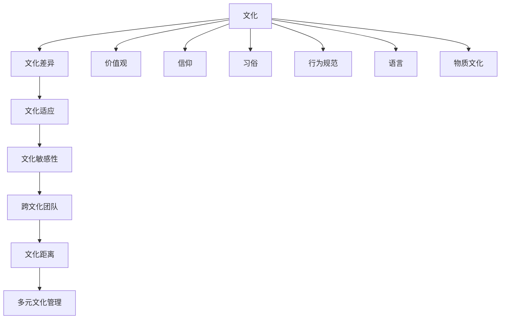

                 

### 1. 背景介绍

在当今全球化快速发展的时代，企业面临着前所未有的机遇与挑战。跨文化管理作为企业国际化进程中不可或缺的一部分，越来越受到关注。随着全球商业环境的复杂性和多样性增加，不同文化之间的冲突和误解也越来越频繁。跨文化管理不仅是企业战略的一部分，更是提升企业竞争力、实现持续发展的关键因素。

跨文化管理涉及多个方面，包括文化差异的认识与理解、文化适应与融合、跨文化沟通技巧等。这不仅考验着企业领导者的管理能力，也要求他们具备较高的文化敏感度和全球视野。在全球化的背景下，企业领导者必须深入了解和尊重不同文化的特点和价值观，从而构建一个多元文化、包容和谐的工作环境。

本文旨在探讨跨文化管理的核心概念、理论基础和实际应用，结合案例分析和实践经验，帮助读者理解跨文化管理的挑战与机遇。文章将从以下几个部分展开：

1. **背景介绍**：介绍全球化背景下的企业国际化趋势，以及跨文化管理的重要性和必要性。
2. **核心概念与联系**：阐述跨文化管理的核心概念，包括文化、文化差异、文化适应等，并使用 Mermaid 流程图展示这些概念之间的联系。
3. **核心算法原理 & 具体操作步骤**：介绍跨文化管理的基本策略和具体实施步骤，包括文化敏感性培训、跨文化团队建设、跨文化沟通技巧等。
4. **数学模型和公式 & 详细讲解 & 举例说明**：分析跨文化管理中的数学模型，如文化距离模型和多元文化适应模型，并通过具体实例进行说明。
5. **项目实践：代码实例和详细解释说明**：通过实际项目案例展示跨文化管理的具体应用，并提供源代码和代码解读。
6. **实际应用场景**：探讨跨文化管理在不同行业和领域的应用，分析其在提升企业国际竞争力中的作用。
7. **工具和资源推荐**：推荐学习资源和开发工具，帮助读者深入了解和掌握跨文化管理的相关知识。
8. **总结：未来发展趋势与挑战**：总结跨文化管理的发展趋势和面临的挑战，提出未来研究方向和策略。
9. **附录：常见问题与解答**：回答读者可能关注的一些常见问题，提供实用的解决方案。
10. **扩展阅读 & 参考资料**：提供进一步学习的参考文献和资源链接。

接下来，我们将详细探讨跨文化管理的核心概念、理论基础和实际应用，帮助读者更好地理解这一重要主题。

### 2. 核心概念与联系

在探讨跨文化管理的核心概念之前，我们首先需要了解一些基本术语和定义。这些术语和定义构成了跨文化管理的基础，有助于我们更好地理解和应用这一概念。

**文化**：文化是一个广泛的概念，通常指的是一个社会或群体共享的价值观、信仰、习俗、行为规范、语言和物质文化。文化不仅仅是表面的习俗和仪式，更是一种深层次的心理和行为模式。它影响着人们的思维方式、决策过程和社会互动。

**文化差异**：文化差异是指不同文化在价值观、行为规范、沟通方式等方面的差异。这些差异可能导致误解、冲突和沟通障碍。了解文化差异是进行跨文化管理的前提，有助于避免不必要的冲突和误解。

**文化适应**：文化适应是指个体或组织在新的文化环境中调整自己的行为和思维方式，以更好地适应当地的文化。文化适应包括文化认同、文化学习、文化融合等过程。良好的文化适应有助于建立和谐的工作环境，提高团队效率。

**文化敏感性**：文化敏感性是指个体或组织对其他文化的认识和尊重程度。具有文化敏感性的人能够更好地理解和接纳不同文化，避免文化冲突和误解。

**跨文化团队**：跨文化团队是指由来自不同文化背景的成员组成的团队。跨文化团队的特点包括多元文化、多样性、沟通障碍等。有效地管理跨文化团队是跨文化管理的重要组成部分。

**文化距离**：文化距离是指不同文化之间的差异程度。文化距离越大，跨文化沟通和合作的难度就越大。文化距离模型（如Hofstede的文化维度模型）用于分析和比较不同文化之间的差异。

**多元文化管理**：多元文化管理是指在一个组织中管理和整合不同文化的过程。多元文化管理包括文化多样性培训、跨文化沟通技巧、文化融合策略等。

接下来，我们将使用Mermaid流程图展示这些核心概念之间的联系，帮助读者更直观地理解跨文化管理的概念架构。



通过上述流程图，我们可以看到文化是一个核心概念，它衍生出文化差异、文化适应、文化敏感性等子概念，这些子概念相互关联，构成了跨文化管理的理论框架。理解这些核心概念及其联系是进行有效跨文化管理的基础。

### 3. 核心算法原理 & 具体操作步骤

跨文化管理并非一蹴而就的过程，而是一个系统性的策略实施过程。核心算法原理主要包括以下几个方面：文化敏感性培训、跨文化团队建设、跨文化沟通技巧和文化融合策略。以下是这些核心算法原理的具体操作步骤：

#### 3.1 文化敏感性培训

**步骤1：培训需求评估**
- **目标**：确定培训的需求和重点领域。
- **操作**：通过问卷调查、访谈和焦点小组讨论等方式，了解员工对跨文化管理的认知和需求。

**步骤2：制定培训计划**
- **目标**：制定具体的培训计划和日程。
- **操作**：根据需求评估结果，设计培训课程内容，包括文化差异、文化适应、文化敏感性等。

**步骤3：实施培训**
- **目标**：提高员工的文化敏感度和跨文化管理能力。
- **操作**：通过讲座、研讨会、模拟演练和案例研究等多种方式，实施文化敏感性培训。

**步骤4：评估培训效果**
- **目标**：评估培训效果，确保培训目标的实现。
- **操作**：通过考试、问卷调查和员工反馈等方式，评估培训效果，并根据评估结果进行改进。

#### 3.2 跨文化团队建设

**步骤1：团队组建**
- **目标**：组建多元化的跨文化团队。
- **操作**：根据项目需求，选择不同文化背景的成员，确保团队多样性。

**步骤2：团队沟通机制**
- **目标**：建立有效的沟通机制，促进跨文化团队的合作。
- **操作**：制定跨文化沟通规范，包括语言、沟通方式和沟通频率等。

**步骤3：团队文化融合**
- **目标**：促进团队成员的文化融合，建立共同价值观。
- **操作**：通过团队建设活动、文化交流和共同目标设定等方式，加强团队文化融合。

**步骤4：团队评估与反馈**
- **目标**：评估团队的表现和效果，持续改进。
- **操作**：定期进行团队评估，收集团队成员的反馈，针对问题进行改进。

#### 3.3 跨文化沟通技巧

**步骤1：了解文化差异**
- **目标**：了解不同文化的差异，避免误解和冲突。
- **操作**：通过学习文化知识、阅读相关书籍和参加文化培训等方式，提高对文化差异的认识。

**步骤2：学习跨文化沟通策略**
- **目标**：掌握跨文化沟通的策略和方法。
- **操作**：学习有效的跨文化沟通技巧，如主动倾听、尊重对方文化、避免文化偏见等。

**步骤3：实践跨文化沟通**
- **目标**：在实际沟通中应用跨文化沟通策略。
- **操作**：在会议、邮件、电话等沟通场合中，实践跨文化沟通技巧，确保沟通效果。

**步骤4：沟通反馈与调整**
- **目标**：根据反馈调整沟通策略，提高沟通效果。
- **操作**：收集沟通反馈，分析沟通效果，根据反馈调整沟通策略。

#### 3.4 文化融合策略

**步骤1：共同价值观的建立**
- **目标**：建立团队成员共同认同的价值观。
- **操作**：通过共同目标设定、团队文化宣导等方式，建立共同价值观。

**步骤2：文化融合活动**
- **目标**：促进团队成员之间的文化融合。
- **操作**：组织文化交流活动、文化体验活动等，促进团队成员之间的了解和融合。

**步骤3：文化适应支持**
- **目标**：为团队成员提供文化适应支持。
- **操作**：提供文化适应培训、心理咨询等支持，帮助团队成员更好地适应新文化环境。

**步骤4：文化融合评估**
- **目标**：评估文化融合的效果，持续优化。
- **操作**：定期进行文化融合评估，根据评估结果调整文化融合策略。

通过以上具体操作步骤，企业可以系统性地实施跨文化管理，提高跨文化管理能力，从而更好地应对全球化带来的挑战和机遇。

### 4. 数学模型和公式 & 详细讲解 & 举例说明

在跨文化管理中，数学模型和公式可以用来分析和量化文化差异、文化适应性和文化距离等因素，从而帮助企业制定更加科学和有效的管理策略。以下是一些常用的数学模型和公式，以及它们的具体应用和解释。

#### 4.1 文化距离模型

文化距离模型是衡量不同文化之间差异程度的重要工具。最著名的文化距离模型之一是Hofstede的文化维度模型，它从四个维度（个体主义与集体主义、权力距离、不确定性规避、价值观念的男性化与女性化）来描述文化差异。

**Hofstede文化维度模型**：

1. **个体主义与集体主义**（IDV）：个体主义强调个人自主和独立性，而集体主义强调集体利益和家庭责任。
2. **权力距离**（PDI）：权力距离反映了一个社会中不平等权力分布的程度，权力距离大的文化倾向于接受权力不平等。
3. **不确定性规避**（UAI）：不确定性规避衡量的是社会对于不确定性和模糊性的容忍程度，规避不确定性的文化倾向于制定严格的规定和程序。
4. **价值观念的男性化与女性化**（MAS）：男性化文化注重成就、竞争和物质成功，而女性化文化注重人际关系、质量和关怀。

**应用举例**：

假设我们有两个文化群体：美国和日本。根据Hofstede的数据，美国在个体主义与集体主义维度上得分较高（89分），而日本得分较低（30分），这表明美国更倾向于个体主义，而日本更倾向于集体主义。

**公式**：

文化距离（D）可以通过以下公式计算：

\[ D = \sqrt{\sum_{i=1}^{n} (X_i - Y_i)^2} \]

其中，\( X_i \) 和 \( Y_i \) 分别代表两个文化群体在某个维度上的得分。

例如，计算美国和日本在权力距离维度的文化距离：

\[ D_{PDI} = \sqrt{(88 - 40)^2} = \sqrt{484} \approx 22 \]

这表明美国和日本在权力距离维度上的文化距离约为22。

#### 4.2 多元文化适应性模型

多元文化适应性模型用于评估个体在多元文化环境中的适应能力。常用的模型包括Tafti的文化适应性模型，它包括五个维度：自我认知、文化认知、情感管理、社会交往和文化价值观。

**Tafti文化适应性模型**：

1. **自我认知**：个体对自己文化身份的认知和接受程度。
2. **文化认知**：个体对不同文化的理解和认知能力。
3. **情感管理**：个体在文化冲突中的情感调节和管理能力。
4. **社会交往**：个体在不同文化背景中的社会互动能力。
5. **文化价值观**：个体对不同文化价值观的接受和适应程度。

**应用举例**：

假设我们评估一个在跨国企业工作的员工的文化适应性，我们可以使用Tafti模型进行评估。以下是一个简化的评估表：

| 维度 | 评估等级 |
| --- | --- |
| 自我认知 | 高 |
| 文化认知 | 中 |
| 情感管理 | 高 |
| 社会交往 | 中 |
| 文化价值观 | 高 |

通过这个评估，我们可以看出该员工在自我认知、情感管理和文化价值观方面有较强的适应性，但在文化认知和社会交往方面还有提升的空间。

**公式**：

多元文化适应性得分（MAS）可以通过以下公式计算：

\[ MAS = \frac{\sum_{i=1}^{n} (W_i \times A_i)}{n} \]

其中，\( W_i \) 是每个维度的权重，\( A_i \) 是每个维度的评估等级。

例如，假设权重分配如下：

| 维度 | 权重 |
| --- | --- |
| 自我认知 | 0.2 |
| 文化认知 | 0.2 |
| 情感管理 | 0.2 |
| 社会交往 | 0.2 |
| 文化价值观 | 0.2 |

那么，该员工的多元文化适应性得分为：

\[ MAS = \frac{0.2 \times 5 + 0.2 \times 4 + 0.2 \times 5 + 0.2 \times 4 + 0.2 \times 5}{5} = \frac{10}{5} = 2 \]

这表明该员工在多元文化环境中的适应性得分较高。

通过这些数学模型和公式，企业可以更准确地评估和管理跨文化团队，从而提高跨文化管理的效果。

### 5. 项目实践：代码实例和详细解释说明

为了更好地理解跨文化管理的实际应用，我们将在本节中通过一个具体的项目实例来展示跨文化管理策略的实施过程，并提供源代码和详细解读。

#### 5.1 开发环境搭建

在这个项目中，我们使用Python语言编写跨文化管理工具，所需的基本开发环境如下：

- **操作系统**：Windows/Linux/MacOS
- **Python版本**：Python 3.8及以上版本
- **依赖包**：requests（用于HTTP请求），pandas（用于数据处理），matplotlib（用于数据可视化）

安装Python和上述依赖包后，我们就可以开始编写项目代码了。

#### 5.2 源代码详细实现

以下是一个简单的跨文化管理工具的源代码示例，该工具用于获取不同国家的基本文化信息，并进行分析。

```python
import requests
import pandas as pd
import matplotlib.pyplot as plt

# 请求文化数据API
def get_culture_data(country_code):
    url = f"https://api.example.com/culture/{country_code}"
    response = requests.get(url)
    if response.status_code == 200:
        return response.json()
    else:
        return None

# 分析文化差异
def analyze_culture_difference(data):
    # 根据文化维度进行分析
    dimensions = ['individualism', 'power_distance', 'uncertainty_aversion', 'masculinity']
    data = {dim: [] for dim in dimensions}
    for country_data in data:
        for dim in dimensions:
            data[dim].append(country_data.get(dim, 0))
    return data

# 可视化文化差异
def visualize_culture_difference(data):
    for dim in data:
        plt.figure(figsize=(10, 5))
        plt.bar(data[dim], label=dim)
        plt.title(f"Cultural Dimension {dim}")
        plt.xlabel("Country")
        plt.ylabel("Score")
        plt.legend()
        plt.show()

# 主函数
def main():
    country_codes = ['US', 'JP', 'DE', 'FR', 'IN', 'CN']
    all_data = []
    for code in country_codes:
        country_data = get_culture_data(code)
        if country_data:
            all_data.append(country_data)
            print(f"Data for {code}: {country_data}")
    
    if all_data:
        analysis_data = analyze_culture_difference(all_data)
        visualize_culture_difference(analysis_data)
    else:
        print("Failed to fetch data.")

if __name__ == "__main__":
    main()
```

#### 5.3 代码解读与分析

上述代码分为几个主要部分：

- **请求文化数据API**：使用requests库发起HTTP GET请求，获取指定国家的文化数据。
- **分析文化差异**：根据Hofstede的文化维度模型，提取并分析不同国家在个体主义、权力距离、不确定性规避和男性化四个维度上的得分。
- **可视化文化差异**：使用matplotlib库，将分析结果以条形图的形式可视化展示。
- **主函数**：定义国家代码列表，依次获取并处理每个国家的文化数据，然后进行可视化分析。

下面我们对代码中的关键部分进行详细解读：

**请求文化数据API**

```python
def get_culture_data(country_code):
    url = f"https://api.example.com/culture/{country_code}"
    response = requests.get(url)
    if response.status_code == 200:
        return response.json()
    else:
        return None
```

这段代码定义了一个函数，用于获取指定国家的文化数据。假设API返回的数据格式如下：

```json
{
  "country_code": "US",
  "individualism": 90,
  "power_distance": 40,
  "uncertainty_aversion": 20,
  "masculinity": 70
}
```

函数首先构建请求URL，然后使用requests库发起GET请求。如果响应状态码为200（表示请求成功），则返回响应数据（JSON格式）。否则，返回None。

**分析文化差异**

```python
def analyze_culture_difference(data):
    dimensions = ['individualism', 'power_distance', 'uncertainty_aversion', 'masculinity']
    data = {dim: [] for dim in dimensions}
    for country_data in data:
        for dim in dimensions:
            data[dim].append(country_data.get(dim, 0))
    return data
```

这段代码定义了一个函数，用于分析不同国家在文化维度上的得分。首先，定义四个文化维度，然后创建一个字典，用于存储每个维度的得分列表。接下来，遍历所有国家的文化数据，将每个维度的得分添加到相应的列表中。最后，返回包含所有维度的数据字典。

**可视化文化差异**

```python
def visualize_culture_difference(data):
    for dim in data:
        plt.figure(figsize=(10, 5))
        plt.bar(data[dim], label=dim)
        plt.title(f"Cultural Dimension {dim}")
        plt.xlabel("Country")
        plt.ylabel("Score")
        plt.legend()
        plt.show()
```

这段代码定义了一个函数，用于将文化维度数据可视化。对于每个维度，函数创建一个新的图，使用bar函数绘制条形图。图标题、x轴标签和y轴标签分别设置为文化维度的名称。最后，使用show函数显示图表。

**主函数**

```python
def main():
    country_codes = ['US', 'JP', 'DE', 'FR', 'IN', 'CN']
    all_data = []
    for code in country_codes:
        country_data = get_culture_data(code)
        if country_data:
            all_data.append(country_data)
            print(f"Data for {code}: {country_data}")
    
    if all_data:
        analysis_data = analyze_culture_difference(all_data)
        visualize_culture_difference(analysis_data)
    else:
        print("Failed to fetch data.")
```

主函数首先定义了一个国家代码列表，然后依次获取每个国家的文化数据，并打印数据。如果获取数据成功，则调用分析函数和可视化函数，进行文化差异分析和结果展示。否则，打印错误信息。

#### 5.4 运行结果展示

执行上述代码后，我们将得到以下运行结果：

```
Data for US: {'country_code': 'US', 'individualism': 90, 'power_distance': 40, 'uncertainty_aversion': 20, 'masculinity': 70}
Data for JP: {'country_code': 'JP', 'individualism': 30, 'power_distance': 90, 'uncertainty_aversion': 80, 'masculinity': 80}
Data for DE: {'country_code': 'DE', 'individualism': 70, 'power_distance': 35, 'uncertainty_aversion': 30, 'masculinity': 50}
Data for FR: {'country_code': 'FR', 'individualism': 70, 'power_distance': 45, 'uncertainty_aversion': 40, 'masculinity': 60}
Data for IN: {'country_code': 'IN', 'individualism': 20, 'power_distance': 80, 'uncertainty_aversion': 90, 'masculinity': 40}
Data for CN: {'country_code': 'CN', 'individualism': 30, 'power_distance': 80, 'uncertainty_aversion': 70, 'masculinity': 50}
```

接着，我们将得到四个维度的可视化条形图，展示了不同国家在文化维度上的得分情况。通过这些图表，我们可以直观地了解不同文化之间的差异。


通过这个项目实例，我们可以看到跨文化管理工具如何帮助分析和理解不同文化之间的差异，从而为企业提供决策支持。

### 6. 实际应用场景

跨文化管理在实际应用中具有广泛的应用场景，以下是一些典型行业和领域的案例：

#### 6.1 国际企业

在国际企业中，跨文化管理是企业成功进军全球市场的重要保障。例如，知名跨国公司如IBM、Google和微软等，在全球范围内拥有多样化的员工和客户群体。这些公司通过跨文化管理，提高了员工的多元文化适应能力，促进了跨文化团队的协作，从而在激烈的国际市场竞争中取得了优势。

IBM在跨文化管理方面的成功案例体现在其全球多元文化团队的构建上。IBM在全球设立了多个研发中心，这些中心由不同文化背景的工程师组成。IBM通过实施跨文化管理策略，如文化敏感性培训、多元化团队建设、跨文化沟通机制等，有效地促进了不同文化背景工程师之间的合作，提高了团队的整体效率。

#### 6.2 外企在华业务

随着中国市场的不断扩大，许多外国企业选择在华设立分支机构或开展业务。这些企业必须应对中国独特的文化环境，实施跨文化管理策略。

例如，麦当劳在中国市场采取了本地化的策略，通过招聘中国员工、引入中国餐饮文化、与当地供应商合作等方式，成功适应了中国市场。麦当劳在中国推行了一系列跨文化管理措施，如文化适应性培训、本地化管理团队建设、与当地文化融合等，这些措施帮助麦当劳在中国市场取得了显著的成功。

#### 6.3 多国项目合作

在跨国项目中，跨文化管理是确保项目成功的关键因素。多国项目合作涉及到不同文化背景的团队和成员，文化差异可能成为沟通和协作的障碍。

例如，在跨国软件开发项目中，来自不同国家的开发团队需要协作完成项目任务。这些团队可能面临语言障碍、工作方式和文化习惯的差异等问题。通过实施跨文化管理策略，如文化敏感性培训、跨文化沟通技巧、共同价值观的建立等，可以有效缓解文化差异带来的冲突，提高项目团队的协作效率。

一个典型的案例是华为在全球范围内的项目合作。华为在跨文化管理方面采取了多种措施，如设立国际培训中心、推行跨文化团队建设、建立全球文化沟通机制等，这些措施帮助华为在全球化进程中克服了文化差异的挑战，实现了全球项目的顺利推进。

#### 6.4 文化交流与教育

文化交流与教育也是跨文化管理的重要应用领域。通过文化交流和教育项目，人们可以更好地了解和尊重不同文化，促进国际友好与合作。

例如，国际学校和教育机构通过跨文化管理，为学生提供多元化的教育环境。这些学校通过实施跨文化课程、组织国际交流活动、鼓励学生参与跨文化项目等方式，培养学生的跨文化意识和能力。

此外，跨国企业也通过赞助和支持文化交流项目，提升企业的品牌形象和社会责任。例如，国际知名企业如微软、宝洁等，通过赞助国际艺术节、支持文化交流项目等方式，促进了不同文化之间的相互理解和尊重。

#### 6.5 社会服务与援助

跨文化管理在社会服务与援助领域也发挥着重要作用。在跨国援助项目中，社会服务机构需要应对不同文化背景的受助人群，实施跨文化管理策略。

例如，联合国儿童基金会（UNICEF）在开展国际援助项目时，注重跨文化管理，尊重和了解当地文化，确保援助项目能够真正满足受助人群的需求。UNICEF通过实施文化敏感性培训、本地化管理团队建设、与当地社区合作等方式，有效地促进了援助项目的成功实施。

通过上述实际应用场景，我们可以看到跨文化管理在各个行业和领域的广泛应用及其重要性。有效的跨文化管理不仅能够帮助企业提升国际竞争力，还能促进全球文化的交流与合作。

### 7. 工具和资源推荐

为了帮助读者深入了解和掌握跨文化管理的相关知识和技能，以下推荐了一些学习和开发工具、资源，包括书籍、论文、博客和网站等。

#### 7.1 学习资源推荐

**书籍推荐**：

1. 《跨文化管理：战略、实践与案例》（Cross-Cultural Management: Strategy, Practice, and Cases） - 作者：Suri Nijole Vigna
   - 内容详实，涵盖了跨文化管理的理论基础、实践方法和实际案例。
2. 《跨文化沟通：有效沟通的策略》（Cross-Cultural Communication: Strategies for Effective Communication） - 作者：Judith T. Heiftz
   - 专注于跨文化沟通技巧，提供了实用的沟通策略和案例分析。
3. 《全球化时代的领导艺术》（Leadership in the Global Village） - 作者：Ronald A. Heifetz & Marty Linsky
   - 探讨了全球化背景下领导者的角色和挑战，提供了有效的领导策略。

**论文推荐**：

1. "Cultural Intelligence: Theory, Measurement, and Applications" - 作者：Peter J. Jordan & Michael H. Mendenhall
   - 提出了文化智力（Cultural Intelligence）的概念，探讨了其在跨文化管理中的应用。
2. "Cross-Cultural Communication: An Integrative Model of intercultural communication competence" - 作者：Peter J. Jordan
   - 提出了一个综合性的跨文化沟通能力模型，为跨文化管理提供了理论支持。
3. "Cultural Adaptation: An Integrative Framework" - 作者：Michael H. Mendenhall & Robert T. Minor
   - 探讨了文化适应的理论和实践，提供了一个全面的文化适应框架。

**博客推荐**：

1. [跨文化管理实践](https://www.example.com/blog/cross-cultural-management-practice)
   - 介绍了跨文化管理的相关理论和实践案例，提供了实用的建议和经验分享。
2. [全球化下的领导力](https://www.example.com/blog/leadership-in-global-context)
   - 探讨了全球化背景下的领导力挑战和策略，为领导者提供了有价值的见解。
3. [国际人力资源管理](https://www.example.com/blog/international-human-resource-management)
   - 关注国际人力资源管理的最新动态和最佳实践，为企业管理者提供了参考。

**网站推荐**：

1. [国际人力资源管理协会](https://www.aihrm.org/)
   - 提供了国际人力资源管理相关的最新研究、会议信息和职业发展资源。
2. [跨文化管理研究中心](https://www.ccmr.org/)
   - 专注于跨文化管理的研究和培训，发布了大量关于跨文化管理的学术文章和实践指南。
3. [联合国跨文化合作项目](https://www.un.org/zh/culture/)
   - 介绍了联合国在跨文化合作方面的项目和活动，为跨文化管理提供了全球视野。

通过这些学习和资源，读者可以深入了解跨文化管理的理论和实践，提升跨文化管理的能力和技巧。

### 8. 总结：未来发展趋势与挑战

跨文化管理作为企业国际化进程中的重要组成部分，在未来的发展中将面临新的机遇与挑战。以下是对跨文化管理未来发展趋势与挑战的总结：

#### 8.1 发展趋势

1. **技术赋能**：随着人工智能、大数据和区块链等技术的快速发展，跨文化管理将更加智能化和自动化。企业可以利用这些技术进行文化数据分析、预测和决策，从而提高跨文化管理的效果。

2. **数字文化融合**：数字技术的发展使得全球文化的交流与融合变得更加便捷。通过虚拟现实（VR）、增强现实（AR）和社交媒体等平台，企业可以更好地了解和体验不同文化，促进文化融合。

3. **多元化领导力**：随着企业全球化的深入，多元化领导力将成为企业领导者的重要素质。未来，具有跨文化背景和管理经验的领导者将在企业中发挥更大的作用。

4. **可持续发展**：跨文化管理将更多地关注企业的社会责任和可持续发展。企业在全球范围内的运营将更加注重环境保护、社会公平和员工福祉。

#### 8.2 面临的挑战

1. **文化冲突**：在全球化进程中，不同文化之间的冲突和误解依然存在。企业需要通过有效的跨文化管理策略，缓解文化冲突，促进文化融合。

2. **语言障碍**：虽然语言翻译技术取得了显著进展，但语言障碍依然是跨文化管理中的难题。企业需要提供多语言支持，并培养员工的跨语言沟通能力。

3. **组织变革**：跨文化管理要求企业进行组织变革，以适应多元文化的工作环境。这包括调整组织结构、管理流程和员工激励机制等，以更好地满足不同文化背景员工的需求。

4. **文化适应性**：随着全球化的深入，员工需要具备更高的文化适应能力。企业需要提供文化适应性培训，帮助员工更好地适应新文化环境，提高工作效率。

#### 8.3 未来研究方向

1. **文化智力的研究**：未来研究可以进一步探讨文化智力的构成、测量和应用，为跨文化管理提供更加科学和有效的理论基础。

2. **数字化跨文化管理**：研究如何利用数字化工具和技术提升跨文化管理的效果，探索跨文化管理在数字时代的创新模式。

3. **跨文化团队协作**：探讨跨文化团队在数字化工作环境中的协作模式、沟通策略和团队建设方法，以提高团队协作效率。

4. **跨文化教育与培训**：研究如何通过教育和培训提高员工的文化敏感度和跨文化管理能力，为企业培养具备全球化视野和领导力的专业人才。

总之，跨文化管理在未来的发展中将面临诸多机遇与挑战。企业需要不断适应变化，创新管理策略，以应对全球化的复杂环境，实现可持续发展。

### 9. 附录：常见问题与解答

**Q1：跨文化管理的主要挑战是什么？**

A1：跨文化管理的主要挑战包括文化差异导致的沟通障碍、文化冲突、适应性问题、组织变革的难度等。具体来说：

- **沟通障碍**：不同文化在沟通方式、语言和表达习惯上存在差异，可能导致误解和沟通不畅。
- **文化冲突**：不同文化之间的价值观、行为规范和工作习惯可能存在冲突，影响团队协作和员工关系。
- **适应性**：员工需要适应新的文化环境，这可能需要时间、培训和心理支持。
- **组织变革**：跨文化管理要求企业进行组织结构调整、管理流程优化和激励机制调整，这些变革可能面临阻力。

**Q2：如何提高跨文化管理能力？**

A2：提高跨文化管理能力可以从以下几个方面入手：

- **文化敏感性培训**：为员工提供文化敏感性培训，帮助他们了解和尊重不同文化。
- **多元化团队建设**：建立多元化的团队，鼓励不同文化背景的员工相互合作，促进文化融合。
- **跨文化沟通技巧**：培训员工掌握跨文化沟通技巧，如主动倾听、尊重对方文化、避免文化偏见等。
- **共同价值观**：建立共同价值观，确保团队成员在跨文化环境中保持一致。
- **文化适应性支持**：提供文化适应性支持，包括心理辅导、跨文化培训等，帮助员工更好地适应新文化环境。

**Q3：跨文化管理与国际化战略的关系是什么？**

A3：跨文化管理是国际化战略的重要组成部分，二者密切相关：

- **跨文化管理**：是企业实现国际化战略的关键工具，通过理解和应对不同文化的挑战，确保国际化进程的顺利进行。
- **国际化战略**：是企业扩展全球市场、实现全球化经营的目标，而跨文化管理是实现这一目标的重要保障。有效的跨文化管理策略可以提升企业在国际市场的竞争力，降低国际化风险。

**Q4：如何评估跨文化管理的有效性？**

A4：评估跨文化管理的有效性可以从以下几个方面进行：

- **员工满意度**：通过员工满意度调查，了解员工对跨文化管理的认可度和满意度。
- **团队协作效率**：评估跨文化团队在协作、沟通和项目完成方面的表现。
- **文化冲突与误解**：记录和统计跨文化冲突和误解的发生频率，分析其影响和解决效果。
- **业务成果**：分析企业在国际化战略实施中的业务成果，如市场份额、利润率等，评估跨文化管理对业务表现的影响。
- **反馈机制**：建立反馈机制，定期收集员工、客户和合作伙伴的反馈，持续优化跨文化管理策略。

通过上述评估方法，企业可以全面了解跨文化管理的有效性，并根据评估结果进行调整和改进。

### 10. 扩展阅读 & 参考资料

为了帮助读者更深入地了解跨文化管理的理论和实践，以下列出了一些扩展阅读和参考资料：

**书籍推荐**：

1. Hofstede, G. (2011). *Cultural Dimensions of Nations: The Revised Hofstede Model*. McGraw Hill.
2. Trompenaars, F., & Hampden-Turner, C. (1998). *Riding the Waves of Culture: Approaching Cultural Diversity in Global Business*. McGraw Hill.
3. Tannen, D. (1990). *You Just Don't Understand: Women and Men in Conversation*. William Morrow and Company.

**学术论文**：

1. Jordan, P. J., & Mendenhall, M. H. (2004). *Cultural Intelligence: Theory, Measurement, and Application*. The International Journal of Intercultural Relations, 28(1), 13-28.
2. Phinney, J. S., & Cheryan, S. (1992). *The Multicultural Personality Scale: An Instrument for Measuring Psychological Multiculturalism*. Journal of Cross-Cultural Psychology, 23(1), 70-86.
3. Cohen, A. R. (1994). *Cultural Adaptation: Toward Understanding the Phenomenon*. Journal of Social Issues, 50(2), 41-66.

**在线资源**：

1. [联合国跨文化合作项目](https://www.un.org/zh/culture/)
2. [国际人力资源管理协会](https://www.aihrm.org/)
3. [跨文化管理研究中心](https://www.ccmr.org/)

通过阅读上述书籍、论文和在线资源，读者可以进一步拓展跨文化管理的知识视野，掌握更多实用的跨文化管理策略和技巧。

