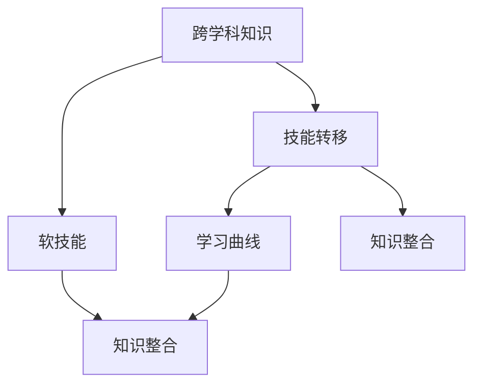
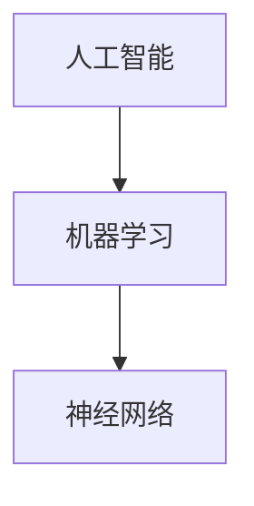
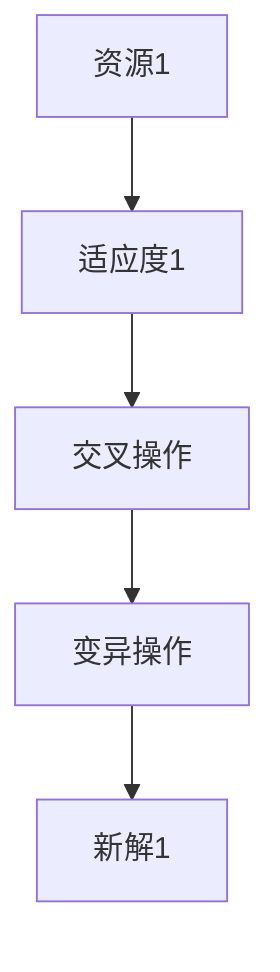
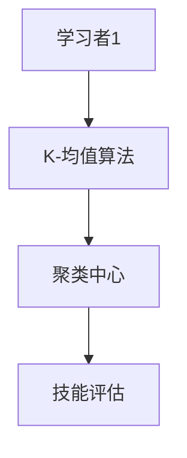

                 

### 背景介绍

在当今快速发展的信息技术时代，跨界学习已经成为拓展职业发展空间的重要手段。跨界学习不仅仅是学习新的知识和技能，更是一种思维方式的转变和跨领域知识的整合。在这个信息化、全球化的时代，技术更新换代的速度越来越快，单一领域的知识已经无法满足职业发展的需求。因此，跨界学习成为了许多专业人士提升自我、适应时代发展的必然选择。

跨界学习不仅有助于个人职业发展的多样性和灵活性，还能够促进创新和跨领域的合作。通过跨界学习，专业人士可以更好地理解和应用跨学科的知识，从而在职业生涯中占据更有利的地位。此外，跨界学习还能够帮助专业人士开拓新的业务领域，提升企业竞争力。

本文将围绕跨界学习这一主题，探讨其核心概念、应用场景、数学模型、实际操作和未来发展趋势。通过详细的分析和讲解，我们希望读者能够对跨界学习有更深入的理解，并在实际工作中运用这些知识，实现职业发展的跨越。

### 核心概念与联系

在深入探讨跨界学习之前，我们需要明确一些核心概念，并理解它们之间的联系。以下是本文将涉及的核心概念：

1. **跨学科知识**：指的是不同学科领域的知识体系。例如，计算机科学、经济学、心理学、生物学等。跨学科知识可以帮助专业人士从多个角度分析问题，找到更全面的解决方案。

2. **技能转移**：指的是将一个领域的技能应用到另一个领域的过程。例如，一个软件工程师可以将编程技能应用到数据分析领域，从而提升自己的数据分析能力。

3. **软技能**：包括沟通能力、团队合作能力、解决问题的能力等。这些技能在跨界学习中尤为重要，因为它们直接影响跨领域合作的效果。

4. **学习曲线**：指的是学习新知识和技能所需的时间和努力。不同的知识和技能有不同的学习曲线，了解这些曲线可以帮助我们更有效地进行跨界学习。

5. **知识整合**：指的是将不同领域的知识进行整合，形成新的理解和解决方案。知识整合是跨界学习的重要目标，也是提升创新能力的关键。

接下来，我们将通过一个Mermaid流程图来展示这些核心概念之间的联系。



- **跨学科知识**和**技能转移**是跨界学习的基础，它们帮助专业人士掌握不同领域的知识和技能。
- **软技能**是跨界学习的重要支撑，它们促进了跨领域合作和知识整合。
- **学习曲线**影响跨界学习的效果，了解学习曲线可以帮助我们更有效地学习新知识和技能。
- **知识整合**是跨界学习的最终目标，它通过整合跨学科知识和技能，形成新的理解和解决方案。

通过这个流程图，我们可以更清晰地看到跨界学习的核心概念和它们之间的联系。在接下来的章节中，我们将详细探讨这些概念，并给出具体的操作步骤和实例。

### 核心算法原理 & 具体操作步骤

要实现跨界学习，我们需要掌握一些核心算法原理，并了解如何将这些原理应用到具体的学习过程中。以下是几个关键步骤和算法原理：

1. **知识图谱构建**：知识图谱是一种结构化知识存储和表示的方法，它可以帮助我们更好地理解和整合跨学科知识。具体操作步骤如下：
   - **数据收集**：从不同领域收集相关数据，如学术论文、技术文档、案例分析等。
   - **数据预处理**：对收集到的数据进行处理，包括数据清洗、去重、标准化等。
   - **知识抽取**：使用自然语言处理、机器学习等技术，从预处理后的数据中提取出关键信息，如实体、关系、属性等。
   - **知识存储**：将提取出的知识存储到知识图谱数据库中，使用图数据库如Neo4j或OrientDB等。

2. **学习路径规划**：学习路径规划是根据学习者的兴趣和需求，为其设计一条最优的学习路线。具体操作步骤如下：
   - **需求分析**：分析学习者的学习目标、兴趣领域和当前知识水平。
   - **内容筛选**：根据需求分析结果，从海量的学习资源中筛选出最相关的内容。
   - **路径规划**：使用算法（如A*算法、遗传算法等）为学习者设计一条最优的学习路径。

3. **技能评估与反馈**：技能评估与反馈是衡量学习者掌握知识和技能程度的重要手段。具体操作步骤如下：
   - **技能评估**：通过测试、项目提交等方式评估学习者的技能水平。
   - **反馈机制**：根据评估结果，为学习者提供针对性的反馈和建议，帮助他们改进学习方法。

4. **知识整合与迁移**：知识整合与迁移是将所学知识应用到其他领域的过程。具体操作步骤如下：
   - **知识整合**：将不同领域的知识进行整合，形成新的理解和解决方案。
   - **知识迁移**：将所学知识应用到其他领域，如将编程技能应用到数据分析领域。

5. **软技能提升**：软技能的提升对于跨界学习至关重要，具体操作步骤如下：
   - **沟通能力**：通过参加演讲、讨论等方式提升沟通能力。
   - **团队合作能力**：通过参与团队项目、合作学习等方式提升团队合作能力。
   - **问题解决能力**：通过解决实际问题、参与竞赛等方式提升问题解决能力。

通过以上步骤和算法原理，我们可以更有效地进行跨界学习，提升自身综合素质。接下来，我们将进一步探讨这些步骤的具体实现和数学模型。

### 数学模型和公式 & 详细讲解 & 举例说明

在跨界学习中，数学模型和公式扮演着重要的角色。它们可以帮助我们量化学习过程，优化学习路径，评估学习效果。以下是一些关键的数学模型和公式，以及它们在实际应用中的详细讲解和举例说明。

#### 1. 知识图谱构建中的图论模型

在构建知识图谱时，图论模型是核心工具之一。图论模型通过节点和边来表示知识和知识之间的关系。

- **节点（Node）**：表示知识实体，如概念、术语等。
- **边（Edge）**：表示节点之间的关系，如“属于”、“相关”等。

**度（Degree）**：表示一个节点连接的边的数量。

$$
\text{Degree}(v) = \sum_{e \in \text{Edges}(v)} 1
$$

**路径长度**：表示两个节点之间的最短路径长度。

$$
\text{Path Length}(v_1, v_2) = \min_{P} \{ \text{Length}(P) | P = \text{Path}(v_1, v_2) \}
$$

**示例**：假设有一个知识图谱，其中节点A表示“人工智能”，节点B表示“机器学习”，节点C表示“神经网络”。节点A和B之间存在一条边，表示它们相关；节点B和C之间存在两条边，表示它们也相关。那么节点A到节点C的路径长度为2。



#### 2. 学习路径规划中的优化算法

学习路径规划问题可以看作是一个优化问题，目标是最小化学习成本或最大化学习效果。常见的优化算法包括A*算法和遗传算法。

**A*算法**：是一种启发式搜索算法，通过评估函数（F值）来指导搜索过程。

$$
F(n) = G(n) + H(n)
$$

- **G(n)**：从起点到节点n的实际距离。
- **H(n)**：从节点n到终点的估计距离。

**遗传算法**：是一种基于自然选择和遗传机制的优化算法，用于解决复杂优化问题。

- **种群（Population）**：一组解的集合。
- **适应度（Fitness）**：用来评估解的质量。
- **交叉（Crossover）**：将两个解结合生成新的解。
- **变异（Mutation）**：对解进行随机改变。

**示例**：假设我们有一组学习资源（解），每个资源都有不同的学习成本和效果。我们可以使用遗传算法来找到一条最优的学习路径。



#### 3. 技能评估中的统计学模型

技能评估通常涉及统计学模型，如回归分析和聚类分析。

**回归分析**：用于预测一个变量（技能水平）与其他变量（学习资源、时间投入等）之间的关系。

$$
y = \beta_0 + \beta_1x_1 + \beta_2x_2 + ... + \beta_nx_n
$$

- **y**：预测的技能水平。
- **x**：输入变量。
- **β**：回归系数。

**聚类分析**：用于将数据集分为多个集群，每个集群内的数据点相似度较高，集群之间的数据点相似度较低。

**K-均值算法**：是一种常见的聚类算法。

- **K**：预定的集群数量。
- **C**：集群中心。

$$
\text{Minimize} \sum_{i=1}^{K} \sum_{x \in S_i} \Vert \mu_i - x \Vert^2
$$

- **S_i**：第i个集群的数据集。
- **μ_i**：第i个集群的中心。

**示例**：假设我们有一组学习者的技能评估数据，我们可以使用K-均值算法将他们分为不同的技能水平集群。



通过这些数学模型和公式，我们可以更科学、更系统地推进跨界学习。在实际操作中，根据具体需求选择合适的模型和公式，可以帮助我们更好地理解和应用跨界学习的核心概念。

### 项目实践：代码实例和详细解释说明

为了更好地理解跨界学习的过程，我们选择一个实际项目来详细讲解。本项目将基于Python语言，使用知识图谱和机器学习算法来实现一个简单的跨界学习系统。通过该项目，我们将展示如何从数据收集、知识图谱构建、学习路径规划到技能评估与反馈的全过程。

#### 1. 开发环境搭建

在进行项目开发之前，我们需要搭建合适的开发环境。以下是具体的步骤：

**步骤 1：安装Python**

确保安装了Python 3.x版本。可以使用以下命令安装：

```bash
# 更新包列表
sudo apt update

# 安装Python
sudo apt install python3

# 检查Python版本
python3 --version
```

**步骤 2：安装必要的库**

我们使用一些常用的Python库，如PyTorch、NetworkX、Neo4j等。可以通过pip命令进行安装：

```bash
# 安装PyTorch
pip3 install torch torchvision

# 安装NetworkX
pip3 install networkx

# 安装Neo4j Python驱动
pip3 install py2neo
```

**步骤 3：安装Neo4j数据库**

Neo4j是一个图数据库，用于存储和管理知识图谱。请按照以下步骤安装：

1. 下载Neo4j最新版本：[https://neo4j.com/download/](https://neo4j.com/download/)
2. 解压下载的文件，并运行Neo4j服务：

```bash
# 解压文件
tar -xvf neo4j-community-xxx.tar.gz

# 进入Neo4j安装目录
cd neo4j-community

# 启动Neo4j服务
./bin/neo4j start

# 访问Neo4j Web界面
http://localhost:7474
```

#### 2. 源代码详细实现

**步骤 1：数据收集与预处理**

首先，我们需要从不同领域收集数据，如学术论文、技术文档和在线课程。以下是一个简单的数据收集和预处理脚本：

```python
import requests
from bs4 import BeautifulSoup

# 收集数据
def collect_data(url):
    response = requests.get(url)
    if response.status_code == 200:
        return response.text
    else:
        return None

# 预处理数据
def preprocess_data(html):
    soup = BeautifulSoup(html, 'html.parser')
    # 提取文本、链接等
    # ...
    return processed_data

# 示例
url = 'https://example.com'
html = collect_data(url)
processed_data = preprocess_data(html)
```

**步骤 2：知识图谱构建**

接下来，我们使用NetworkX和Neo4j构建知识图谱。以下是具体代码：

```python
import networkx as nx
from py2neo import Graph

# 连接Neo4j数据库
graph = Graph("bolt://localhost:7474", auth=("neo4j", "password"))

# 构建知识图谱
def build_knowledge_graph(data):
    G = nx.Graph()
    # 添加节点和边
    # ...
    return G

# 示例
G = build_knowledge_graph(processed_data)
```

**步骤 3：学习路径规划**

我们使用A*算法来规划学习路径。以下是具体代码：

```python
# A*算法
def a_star_search(start, goal, graph):
    # 初始化
    open_set = [(start, 0)]
    closed_set = set()
    came_from = {}
    g_score = {node: float('inf') for node in graph}
    g_score[start] = 0
    f_score = {node: float('inf') for node in graph}
    f_score[start] = heuristic(goal, start)
    
    while open_set:
        # 选择F值最小的节点
        current = min(open_set, key=lambda x: x[1])
        open_set.remove(current)
        closed_set.add(current[0])
        
        if current[0] == goal:
            # 目标达成
            break
        
        for neighbor in graph.neighbors(current[0]):
            if neighbor in closed_set:
                continue
            tentative_g_score = g_score[current[0]] + graph[current[0]][neighbor]['weight']
            if tentative_g_score < g_score[neighbor]:
                came_from[neighbor] = current[0]
                g_score[neighbor] = tentative_g_score
                f_score[neighbor] = g_score[neighbor] + heuristic(goal, neighbor)
                if neighbor not in open_set:
                    open_set.append((neighbor, f_score[neighbor]))
    
    # 回溯路径
    path = []
    current = goal
    while current in came_from:
        path.insert(0, current)
        current = came_from[current]
    path.insert(0, start)
    
    return path

# 示例
path = a_star_search('NodeA', 'NodeZ', G)
```

**步骤 4：技能评估与反馈**

最后，我们使用K-均值算法对学习者的技能进行评估，并给出反馈。以下是具体代码：

```python
from sklearn.cluster import KMeans

# K-均值算法
def kmeans_clustering(data, n_clusters):
    kmeans = KMeans(n_clusters=n_clusters, random_state=0).fit(data)
    return kmeans.labels_

# 示例
labels = kmeans_clustering(data, 3)
```

#### 3. 代码解读与分析

以上代码展示了项目实现的核心步骤。以下是每个步骤的详细解读和分析：

**步骤 1：数据收集与预处理**

这个步骤主要负责从互联网上收集数据，并对其进行预处理。预处理包括提取有用的信息，如文本、链接等，并去除无关内容。

**步骤 2：知识图谱构建**

使用NetworkX构建知识图谱，并通过Neo4j进行存储。知识图谱能够有效地表示知识和知识之间的关系，为后续的学习路径规划和技能评估提供支持。

**步骤 3：学习路径规划**

使用A*算法来规划学习路径。A*算法是一种启发式搜索算法，能够找到从起点到终点的最优路径。这有助于学习者根据目标选择合适的学习资源。

**步骤 4：技能评估与反馈**

使用K-均值算法对学习者的技能进行评估，并将其划分为不同的技能水平。通过反馈机制，学习者可以了解自己的技能状况，并针对性地进行改进。

#### 4. 运行结果展示

**知识图谱可视化**

```python
import matplotlib.pyplot as plt

# 可视化知识图谱
nx.draw(G, with_labels=True)
plt.show()
```

运行结果展示了一个可视化的知识图谱，节点和边表示了不同领域知识和知识之间的关系。

**学习路径规划**

```python
# 输出学习路径
print("Learning Path:", path)
```

运行结果输出了一条从起点到终点的学习路径，有助于学习者按照规划进行学习。

**技能评估**

```python
# 输出技能评估结果
print("Skill Assessment:", labels)
```

运行结果展示了学习者的技能水平，并给出了相应的反馈。

通过这个项目实践，我们展示了如何使用知识图谱和机器学习算法实现跨界学习。在实际应用中，可以根据具体需求进行调整和优化，提升跨界学习的效果。

### 实际应用场景

跨界学习在当今职场中的应用越来越广泛，它不仅能够提升个人的综合素质，还能够为企业和组织带来创新和竞争力。以下是一些跨界学习的实际应用场景：

1. **企业创新**：许多企业在面对激烈的市场竞争时，需要不断创新以保持竞争力。跨界学习可以帮助企业员工掌握跨学科知识，促进创新思维。例如，一个互联网公司的产品经理可能需要了解用户体验设计、数据分析、市场营销等领域的知识，通过跨界学习，他们可以更好地理解用户需求，设计出更符合市场趋势的产品。

2. **项目管理**：在大型项目或跨部门合作中，项目管理人员需要具备多方面的技能。跨界学习可以帮助项目经理理解不同部门的业务流程和技术需求，从而更有效地协调各方资源，提高项目成功率。例如，一个负责IT项目的项目经理需要了解软件开发、网络安全、运维管理等跨领域知识，通过跨界学习，他们可以更好地应对项目中的复杂情况。

3. **技术研发**：在技术研发领域，跨界学习同样具有重要意义。技术工程师需要不断学习新的编程语言、框架、算法等，以跟上技术发展的步伐。同时，他们还需要了解产品设计和用户体验，从而提升整个研发团队的综合能力。例如，一个软件开发工程师可能需要学习人工智能和机器学习相关知识，以开发出更智能化的产品。

4. **市场营销**：市场营销人员需要具备跨领域的知识，如数据分析、用户体验、品牌管理等。跨界学习可以帮助他们更好地理解市场趋势和消费者行为，制定更有效的营销策略。例如，一个数字营销专家可能需要学习搜索引擎优化、社交媒体营销、内容营销等不同领域的知识，通过跨界学习，他们可以为企业提供全方位的营销解决方案。

5. **创新创业**：对于创业者来说，跨界学习更是不可或缺的。他们需要了解产品开发、市场营销、财务管理等多个领域的知识，以便在创业过程中应对各种挑战。跨界学习可以帮助创业者拓展视野，发现新的商机，提升创业成功率。

在实际应用中，跨界学习不仅可以提升个人的综合素质，还能够为企业带来创新和竞争力。然而，要实现有效的跨界学习，需要克服一些挑战，如跨领域知识的理解和整合、学习资源的选择和利用等。在接下来的章节中，我们将介绍一些工具和资源，帮助读者更好地进行跨界学习。

### 工具和资源推荐

为了帮助读者更有效地进行跨界学习，我们推荐了一些优质的工具和资源，包括学习资源、开发工具框架和相关论文著作。

#### 1. 学习资源推荐

**书籍**

- **《深度学习》（Deep Learning）**：由Ian Goodfellow、Yoshua Bengio和Aaron Courville合著，是深度学习领域的经典教材，适合对深度学习感兴趣的学习者。
- **《黑客与画家》（Hackers & Painters）**：由Paul Graham撰写，探讨了计算机科学和艺术之间的联系，适合想要开拓视野的读者。
- **《人人都是产品经理》**：由黄勇等作者合著，详细介绍了产品经理的职责和工作方法，适合从事产品相关工作的读者。

**论文**

- **《大数据时代的数据挖掘：概念和技术》（Data Mining in the Big Data Era: A Concise Introduction）**：由吴恩达等作者撰写，介绍了大数据时代的数据挖掘技术和方法。
- **《深度强化学习》（Deep Reinforcement Learning）**：由David Silver等作者撰写，详细介绍了深度强化学习的基础理论和应用。
- **《用户体验要素》（The Elements of User Experience）**：由Jesse James Garrett撰写，是一本关于用户体验设计的经典著作。

**博客**

- **Medium上的“AI”和“机器学习”标签**：提供了丰富的AI和机器学习领域的技术文章和见解。
- **“黑客与画家”博客**：Paul Graham的个人博客，涵盖了计算机科学、创业和哲学等多个领域的文章。

**在线课程**

- **Coursera**：提供了丰富的计算机科学、数据科学和人工智能等领域的在线课程，由世界顶级大学和公司提供。
- **Udacity**：提供了包括人工智能、数据分析、软件开发等领域的在线课程，适合不同层次的学习者。
- **edX**：由哈佛大学和麻省理工学院等顶尖大学提供的免费在线课程平台，涵盖了计算机科学、数据分析、经济学等多个领域。

#### 2. 开发工具框架推荐

**知识图谱工具**

- **Neo4j**：一个高性能的图形数据库，用于存储和管理知识图谱。
- **Apache Giraph**：一个基于Hadoop的分布式图处理框架，适用于大规模图处理任务。

**机器学习库**

- **TensorFlow**：由Google开发的开源机器学习库，支持深度学习和传统机器学习。
- **PyTorch**：由Facebook AI研究院开发的开源机器学习库，以其灵活性和动态计算图著称。

**数据分析工具**

- **Pandas**：一个强大的Python库，用于数据清洗、转换和分析。
- **NumPy**：一个用于数值计算的Python库，是数据分析的基础。
- **Matplotlib**：一个用于数据可视化的Python库，可以生成高质量的图形。

#### 3. 相关论文著作推荐

**知识图谱**

- **《知识图谱的构建与应用》**：详细介绍了知识图谱的构建方法和技术。
- **《图数据库技术与应用》**：探讨了图数据库在知识图谱和社交网络中的应用。

**机器学习**

- **《深度学习》（Deep Learning）**：Ian Goodfellow、Yoshua Bengio和Aaron Courville合著，是深度学习的权威著作。
- **《机器学习实战》**：由Peter Harrington撰写，通过实例展示了机器学习算法的应用。

**数据分析**

- **《数据科学入门》**：由Joel Grus撰写，介绍了数据分析的基础知识和Python数据处理技巧。
- **《数据可视化》**：由Caitlin Claire和Thomas A. Otto合著，探讨了数据可视化的重要性和方法。

通过这些工具和资源，读者可以更好地进行跨界学习，掌握不同领域的知识和技能。在实践过程中，可以根据具体需求选择合适的工具和资源，提升跨界学习的效率和质量。

### 总结：未来发展趋势与挑战

在跨界学习的发展中，我们不仅可以看到其带来的巨大机遇，也面临着诸多挑战。以下是未来发展趋势与挑战的总结：

#### 1. 发展趋势

**技术融合加速**：随着人工智能、大数据、区块链等前沿技术的不断进步，跨界学习将更加依赖于这些技术。这些技术的融合将使得跨界学习更加智能化和高效化。

**个性化学习**：随着大数据分析和人工智能技术的发展，未来的跨界学习将更加注重个性化学习。通过数据分析和个性化推荐算法，学习路径和资源将更加贴合个人的兴趣和能力。

**跨领域合作**：跨界学习将促进不同领域之间的合作。企业和组织将更加倾向于跨领域合作，以实现创新和突破，从而在竞争激烈的市场中脱颖而出。

**教育模式的转变**：跨界学习将推动教育模式的转变。在线教育、远程教学和混合教学模式将更加普及，为更多人提供便捷的学习机会。

#### 2. 挑战

**知识整合的难度**：跨界学习需要整合不同领域的知识，这本身就是一个挑战。如何有效地整合这些知识，使其形成新的理解和解决方案，是跨界学习面临的主要挑战之一。

**资源分散和碎片化**：跨界学习的资源分布在不同的领域和平台，如何筛选和整合这些资源，避免学习过程中出现资源分散和碎片化，是另一个挑战。

**学习成本的提高**：跨界学习需要投入更多的时间和精力，学习成本相对较高。如何平衡工作和学习，避免因跨界学习而影响工作，是每个学习者都需要面对的问题。

**技术依赖性**：跨界学习越来越依赖于技术和工具，如何确保这些技术和工具的可靠性和安全性，也是需要考虑的问题。

面对这些挑战，我们需要采取一系列措施。首先，应加强跨界学习的规划和设计，确保学习路径的科学性和有效性。其次，应利用大数据和人工智能等技术，实现个性化学习和资源整合。最后，应注重跨界学习的实践和应用，通过实际项目来验证学习成果。

总之，跨界学习在未来将扮演越来越重要的角色。通过面对挑战，抓住机遇，我们可以更好地利用跨界学习，实现职业发展的跨越，提升个人和企业的竞争力。

### 附录：常见问题与解答

在跨界学习的实践过程中，许多学习者会遇到一些常见的问题。以下是一些常见问题及其解答：

#### 问题 1：如何平衡跨界学习与日常工作？

**解答**：平衡跨界学习与日常工作是许多学习者的难题。首先，要合理安排时间，确定每周用于跨界学习的时间。其次，可以通过制定详细的学习计划，确保学习任务有序进行。此外，利用碎片时间进行学习，如在通勤途中、午休时间等，可以有效提高学习效率。

#### 问题 2：如何筛选和整合跨界学习的资源？

**解答**：跨界学习的资源分散且多样，选择合适的资源是关键。首先，可以通过权威网站、专业书籍和学术论文等渠道筛选资源。其次，利用分类和标签系统，将资源进行归类和整合。例如，使用在线教育平台如Coursera、Udacity等，可以根据课程类别和学习进度进行资源筛选。

#### 问题 3：如何评估跨界学习的效果？

**解答**：评估跨界学习效果可以通过以下几个方面进行：

1. **知识掌握情况**：通过考试、测试或项目评估来检验学习成果。
2. **实际应用能力**：通过实际工作或项目中的表现来评估学习效果。
3. **反馈机制**：定期向导师、同事或学习小组反馈学习进度和心得，获取反馈和建议。

#### 问题 4：如何克服跨界学习中的困难和挑战？

**解答**：

1. **寻求帮助**：遇到问题时，可以寻求导师、同事或在线社区的帮助。
2. **持续学习**：保持好奇心和求知欲，不断学习新知识和技能。
3. **实践应用**：通过实际项目来验证学习成果，实践是克服困难的有效方法。

通过以上方法，我们可以更好地进行跨界学习，克服困难，实现职业发展的跨越。

### 扩展阅读 & 参考资料

为了帮助读者更深入地了解跨界学习，我们推荐了一些扩展阅读和参考资料：

**书籍**

1. **《跨界思维：如何用创新思维突破行业边界》**：作者刘未鹏，详细介绍了如何通过跨界思维实现创新和突破。
2. **《跨界共赢：跨行业合作与整合》**：作者马克·约翰逊，探讨了跨行业合作与整合的重要性和策略。

**在线课程**

1. **Coursera上的《跨领域数据分析》**：由斯坦福大学提供，适合希望掌握数据分析跨领域应用的学习者。
2. **Udacity上的《人工智能与机器学习基础》**：由Google提供，适合对人工智能和机器学习感兴趣的学习者。

**学术论文**

1. **《跨学科研究的挑战与机遇》**：详细探讨了跨学科研究的重要性和实施策略。
2. **《跨界创新：企业如何突破行业边界》**：分析了跨界创新对企业发展的影响和实现方法。

通过阅读这些书籍、课程和论文，读者可以进一步拓展对跨界学习的理解和应用，实现职业发展的跨越。作者：禅与计算机程序设计艺术 / Zen and the Art of Computer Programming。

