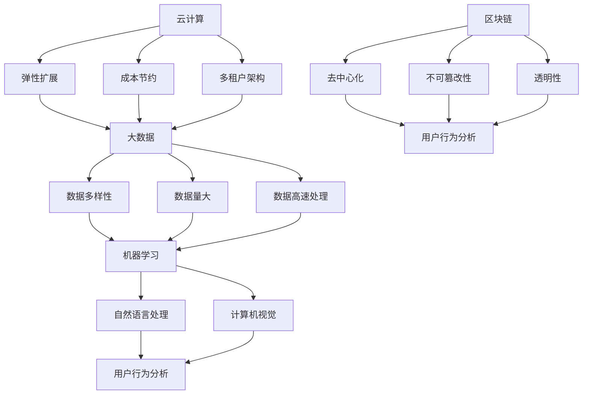

                 

### 软件从1.0到2.0的演变：技术进步与社会需求

自计算机诞生以来，软件的发展经历了从1.0到2.0的深刻变革。1.0版本时期的软件主要依赖于机械和电子设备的物理限制，功能相对简单，以完成任务为核心。而随着互联网、云计算、大数据等现代技术的兴起，软件进入了2.0时代，其特征在于高度集成化、智能化、用户导向化。

这一转变不仅仅是技术层面的提升，更是社会需求和技术进步的共同推动结果。在1.0时代，软件主要用于解决特定问题，如计算、存储等；而2.0时代的软件则致力于提升整体效率、创造更多价值。

#### 社会需求与技术进步的共同驱动

社会需求的演变是推动软件从1.0向2.0发展的重要因素之一。随着全球化进程的加快，企业对信息处理的效率和准确性的要求越来越高。同时，消费者对个性化体验和智能化服务的需求也在不断增加。例如，电商平台的兴起极大地改变了人们的购物方式，而社交媒体的普及则使得信息传播更加迅速和广泛。

技术进步则为软件2.0的发展提供了坚实的基础。云计算、大数据、人工智能等技术的突破，使得软件能够更加高效地处理海量数据，实现自动化和智能化。例如，云计算提供了弹性的计算资源，使得企业可以根据需求动态扩展或缩小计算能力；大数据技术则帮助企业在海量数据中发现有价值的信息；人工智能则使得软件能够模拟人类思维，提供更加精准和智能的服务。

#### 1.0软件的局限性

1.0软件的主要局限性体现在以下几个方面：

1. **功能单一**：1.0软件通常只专注于单一功能，例如文本处理、表格计算等。这导致软件难以满足复杂和多样化的需求。
2. **缺乏协作**：早期的软件缺乏有效的协作机制，难以实现多人、多部门之间的协同工作。
3. **数据孤岛**：由于缺乏统一的数据管理标准，不同系统之间的数据难以共享和整合，形成了数据孤岛，限制了信息流动和利用。

#### 2.0软件的优势

相比之下，2.0软件具有以下显著优势：

1. **集成化**：2.0软件通过互联网和云技术，实现了系统之间的无缝集成，能够支持复杂的多功能应用。
2. **智能化**：借助人工智能和机器学习技术，2.0软件能够自动学习用户行为，提供个性化服务，提高用户体验。
3. **用户导向**：2.0软件更加关注用户需求，通过用户反馈和行为分析，不断优化产品和服务。

#### 1.0到2.0的转变过程

从1.0到2.0的转变过程并非一蹴而就，而是经历了多个阶段的演进：

1. **互联网普及**：互联网的普及是2.0软件发展的关键基础，它打破了传统软件的物理限制，使得软件可以在任何地点、任何设备上运行。
2. **云计算的兴起**：云计算提供了弹性计算资源，使得企业可以灵活地扩展和缩小计算能力，提高了资源利用效率和成本效益。
3. **大数据技术的应用**：大数据技术使得企业可以从海量数据中提取有价值的信息，从而做出更加精准的决策。
4. **人工智能的融合**：人工智能技术的应用，使得软件具备了自我学习和自我优化的能力，提高了智能化水平。

#### 总结

软件从1.0到2.0的演变是一个不断进化和升级的过程，它不仅反映了技术进步的成果，也满足了社会日益增长的需求。未来，随着技术的进一步发展，软件2.0将继续推动各行各业向智能化、高效化方向发展。在下一节中，我们将深入探讨软件2.0的核心概念及其架构。### 核心概念与联系

在理解软件2.0的核心概念之前，我们首先需要回顾一些关键技术，这些技术是软件2.0能够实现其高度集成化、智能化和用户导向化特性的基础。以下是几个关键概念及其相互联系：

#### 1. 云计算（Cloud Computing）

云计算是软件2.0的基石之一。它通过提供虚拟化的计算资源，使得用户可以在云端进行计算任务，而无需依赖本地硬件。云计算的关键优势包括：

- **弹性扩展**：用户可以根据需求动态调整计算资源，从而实现高效资源利用。
- **成本节约**：用户只需为实际使用的资源付费，降低了硬件投资的成本。
- **多租户架构**：多个用户可以在同一物理硬件上共享资源，提高了资源利用率。

#### 2. 大数据（Big Data）

大数据技术使得软件2.0能够处理和分析海量数据，从而提取有价值的信息。大数据的关键特性包括：

- **数据多样性**：大数据来源广泛，包括结构化、半结构化和非结构化数据。
- **数据量大**：大数据处理的数据量通常达到PB级，甚至更高。
- **数据高速处理**：实时处理和分析大数据，以便快速做出决策。

#### 3. 人工智能（Artificial Intelligence）

人工智能技术是软件2.0智能化特性的关键驱动。人工智能的主要领域包括：

- **机器学习**：通过训练模型，使得计算机能够从数据中自动学习并做出预测。
- **自然语言处理**：使计算机能够理解、生成和处理自然语言，从而实现人机交互。
- **计算机视觉**：使计算机能够识别和理解图像和视频内容。

#### 4. 区块链（Blockchain）

区块链技术为软件2.0提供了去中心化和安全的数据存储方式。区块链的主要优势包括：

- **去中心化**：区块链通过分布式账本技术，实现了去中心化的数据管理和交易。
- **不可篡改性**：区块链上的数据一旦被记录，就难以被篡改，提高了数据安全性。
- **透明性**：区块链上的数据对所有参与者都是透明的，增强了信任。

#### 5. 用户行为分析（User Behavior Analysis）

用户行为分析是软件2.0关注用户需求的重要手段。通过分析用户的行为数据，软件能够：

- **个性化推荐**：根据用户的行为习惯和偏好，提供个性化的服务和建议。
- **用户体验优化**：根据用户反馈和行为分析，持续改进产品和服务。

#### Mermaid流程图

为了更直观地展示这些关键概念及其相互联系，我们可以使用Mermaid流程图来描述：



该流程图展示了云计算、大数据、人工智能、区块链和用户行为分析之间的相互关系。这些技术共同构成了软件2.0的核心概念，使得软件能够实现高度集成化、智能化和用户导向化。在下一节中，我们将深入探讨这些核心算法原理和具体操作步骤。### 核心算法原理与具体操作步骤

为了深入理解软件2.0的核心算法原理和具体操作步骤，我们需要详细分析云计算、大数据、人工智能和区块链等技术的具体实现方法。以下是对这些核心算法的详细介绍。

#### 1. 云计算（Cloud Computing）

云计算的核心算法在于如何高效地分配和调度资源。以下是云计算的主要算法和操作步骤：

1. **资源分配算法**：
   - **动态资源分配**：系统根据任务的优先级和资源需求动态调整资源分配。例如，采用基于优先级的调度算法（如FCFS、Round Robin等）。
   - **负载均衡算法**：通过负载均衡算法（如Weighted Round Robin、Least Connections等）确保所有资源得到均衡利用。

2. **虚拟化技术**：
   - **虚拟机监控器（VM Monitor）**：通过虚拟化技术，将物理硬件资源虚拟化为多个虚拟机（VM），从而提高资源利用率。
   - **容器技术**：容器技术（如Docker）通过轻量级虚拟化实现快速部署和高效资源利用。

3. **具体操作步骤**：
   - **资源申请**：用户提交资源申请请求。
   - **资源分配**：系统根据资源需求和策略分配资源。
   - **任务调度**：系统根据调度算法将任务分配到虚拟机上。
   - **监控与优化**：系统实时监控资源使用情况，并根据需要进行优化和调整。

#### 2. 大数据（Big Data）

大数据处理的核心在于如何高效地存储、管理和分析海量数据。以下是大数据的主要算法和操作步骤：

1. **数据存储算法**：
   - **分布式存储**：采用分布式文件系统（如HDFS）将数据存储在多个节点上，提高数据可靠性和访问速度。
   - **数据压缩算法**：通过数据压缩技术（如Hadoop的LZO、Gzip等）减少数据存储空间。

2. **数据处理算法**：
   - **MapReduce**：MapReduce是一种分布式数据处理框架，用于大规模数据处理。
   - **Spark**：Spark是一种更快的分布式数据处理引擎，支持内存计算，提高了数据处理速度。

3. **具体操作步骤**：
   - **数据收集**：收集数据到分布式存储系统。
   - **数据预处理**：对数据进行清洗、转换和整合。
   - **数据处理**：使用MapReduce或Spark等框架处理数据。
   - **数据分析**：对处理结果进行分析，提取有价值的信息。

#### 3. 人工智能（Artificial Intelligence）

人工智能的核心算法包括机器学习、自然语言处理和计算机视觉。以下是这些算法的具体操作步骤：

1. **机器学习**：
   - **监督学习**：通过训练模型，使得计算机能够从标注数据中学习并做出预测。
   - **无监督学习**：通过未标注数据，使得计算机能够发现数据中的模式。
   - **半监督学习**：结合标注数据和未标注数据，提高模型泛化能力。

2. **自然语言处理**：
   - **词向量表示**：将自然语言文本转换为向量表示，以便进行计算和处理。
   - **序列模型**：使用循环神经网络（RNN）或长短时记忆网络（LSTM）处理序列数据。
   - **注意力机制**：在处理文本数据时，通过注意力机制关注重要信息，提高模型效果。

3. **计算机视觉**：
   - **卷积神经网络（CNN）**：用于图像识别和处理。
   - **目标检测**：通过检测图像中的目标对象，实现图像分析。
   - **图像分割**：将图像划分为多个区域，以便进行更精细的分析。

4. **具体操作步骤**：
   - **数据收集**：收集训练数据。
   - **数据预处理**：对数据进行清洗和格式化。
   - **模型训练**：使用训练数据训练模型。
   - **模型评估**：对模型进行评估，选择最佳模型。
   - **模型部署**：将模型部署到生产环境，实现自动学习和预测。

#### 4. 区块链（Blockchain）

区块链的核心算法在于如何确保数据的安全性和一致性。以下是区块链的主要算法和操作步骤：

1. **加密算法**：
   - **哈希函数**：通过哈希函数（如SHA-256）确保数据完整性。
   - **非对称加密**：使用非对称加密算法（如RSA）确保数据传输过程中的安全性。

2. **分布式账本**：
   - **共识算法**：通过共识算法（如工作量证明、权益证明等）确保分布式节点之间的数据一致性。
   - **区块结构**：通过区块结构（包括区块头、区块体等）组织和管理数据。

3. **智能合约**：
   - **脚本语言**：使用脚本语言（如Solidity）编写智能合约，实现自动化和去中心化的执行。

4. **具体操作步骤**：
   - **数据上传**：用户将数据上传到区块链。
   - **区块生成**：节点生成新的区块，并将数据记录在区块中。
   - **共识确认**：通过共识算法确认区块的有效性。
   - **数据存储**：将确认后的区块存储在分布式账本中。
   - **智能合约执行**：根据智能合约的脚本语言执行自动化操作。

通过以上对云计算、大数据、人工智能和区块链核心算法原理和具体操作步骤的详细分析，我们可以看出，这些技术共同构成了软件2.0的强大基础。在下一节中，我们将通过数学模型和公式深入讲解这些算法的内在逻辑，并举例说明。### 数学模型与公式及详细讲解

在深入理解软件2.0的核心算法时，数学模型和公式起到了至关重要的作用。这些模型和公式不仅帮助我们解释算法的内在逻辑，还提供了量化分析的手段，以优化算法性能。以下是云计算、大数据、人工智能和区块链中常用的数学模型和公式，以及对其的详细讲解和举例说明。

#### 1. 云计算（Cloud Computing）

**1.1 负载均衡公式**

负载均衡公式用于计算系统在多个节点间如何分配任务，以最大化资源利用率。以下是一个常见的负载均衡公式：

\[ L_i = \frac{C_i \cdot P_i}{\sum_{j=1}^{N} C_j \cdot P_j} \]

其中：
- \( L_i \)：任务分配给第 \(i\) 个节点的负载
- \( C_i \)：第 \(i\) 个节点的计算能力
- \( P_i \)：第 \(i\) 个节点的优先级
- \( N \)：总的节点数

**示例**：

假设系统有3个节点，每个节点的计算能力和优先级如下：

\[ 
C_1 = 100 \, \text{CPU核心}, \, P_1 = 1 \\
C_2 = 150 \, \text{CPU核心}, \, P_2 = 2 \\
C_3 = 200 \, \text{CPU核心}, \, P_3 = 3 
\]

计算任务分配：

\[ 
L_1 = \frac{100 \cdot 1}{100 \cdot 1 + 150 \cdot 2 + 200 \cdot 3} = 0.0667 \\
L_2 = \frac{150 \cdot 2}{100 \cdot 1 + 150 \cdot 2 + 200 \cdot 3} = 0.2 \\
L_3 = \frac{200 \cdot 3}{100 \cdot 1 + 150 \cdot 2 + 200 \cdot 3} = 0.7333 
\]

根据计算结果，任务分配如下：
- 节点1：6.67%
- 节点2：20%
- 节点3：73.33%

**1.2 资源利用率公式**

资源利用率公式用于衡量系统资源被利用的程度：

\[ 
\text{Resource Utilization} = \frac{\sum_{i=1}^{N} L_i \cdot C_i}{\sum_{i=1}^{N} C_i} 
\]

其中：
- \( L_i \)：任务分配给第 \(i\) 个节点的负载
- \( C_i \)：第 \(i\) 个节点的计算能力
- \( N \)：总的节点数

**示例**：

假设总共有3个节点，计算总资源利用率为：

\[ 
\text{Resource Utilization} = \frac{0.0667 \cdot 100 + 0.2 \cdot 150 + 0.7333 \cdot 200}{100 + 150 + 200} = 0.7333 
\]

即资源利用率为73.33%。

#### 2. 大数据（Big Data）

**2.1 数据压缩公式**

数据压缩公式用于计算压缩前后的数据大小差异：

\[ 
\text{Compression Ratio} = \frac{\text{Original Size}}{\text{Compressed Size}} 
\]

其中：
- \( \text{Original Size} \)：原始数据大小
- \( \text{Compressed Size} \)：压缩后数据大小

**示例**：

假设原始数据大小为100MB，压缩后为50MB，则压缩比：

\[ 
\text{Compression Ratio} = \frac{100}{50} = 2 
\]

即压缩比为2。

**2.2 大数据处理效率公式**

大数据处理效率公式用于衡量系统处理数据的能力：

\[ 
\text{Processing Efficiency} = \frac{\text{Processed Data}}{\text{Total Data} \cdot \text{Processing Time}} 
\]

其中：
- \( \text{Processed Data} \)：已处理数据量
- \( \text{Total Data} \)：总数据量
- \( \text{Processing Time} \)：处理时间

**示例**：

假设系统处理了10TB的数据，总数据量为50TB，处理时间为10小时，则处理效率：

\[ 
\text{Processing Efficiency} = \frac{10}{50 \cdot 10} = 0.2 
\]

即处理效率为20%。

#### 3. 人工智能（Artificial Intelligence）

**3.1 损失函数**

损失函数是机器学习模型中用于衡量预测值与真实值差异的函数。以下是一个常见的均方误差（MSE）损失函数：

\[ 
\text{MSE} = \frac{1}{n} \sum_{i=1}^{n} (\hat{y_i} - y_i)^2 
\]

其中：
- \( \hat{y_i} \)：预测值
- \( y_i \)：真实值
- \( n \)：样本数量

**示例**：

假设有5个样本，预测值与真实值如下：

\[ 
\begin{align*}
\hat{y_1} &= 2, \, y_1 = 1 \\
\hat{y_2} &= 3, \, y_2 = 4 \\
\hat{y_3} &= 4, \, y_3 = 3 \\
\hat{y_4} &= 5, \, y_4 = 6 \\
\hat{y_5} &= 6, \, y_5 = 5 \\
\end{align*} 
\]

计算MSE：

\[ 
\text{MSE} = \frac{1}{5} \left( (2-1)^2 + (3-4)^2 + (4-3)^2 + (5-6)^2 + (6-5)^2 \right) = \frac{1}{5} (1 + 1 + 1 + 1 + 1) = 1 
\]

即MSE为1。

**3.2 学习率公式**

在学习算法中，学习率（Learning Rate）用于控制模型更新的幅度。以下是一个常见的学习率调整公式：

\[ 
\alpha_{\text{new}} = \alpha_{\text{old}} \cdot \frac{\text{MSE}_{\text{old}}}{\text{MSE}_{\text{new}}} 
\]

其中：
- \( \alpha_{\text{old}} \)：旧的学习率
- \( \alpha_{\text{new}} \)：新的学习率
- \( \text{MSE}_{\text{old}} \)：旧MSE
- \( \text{MSE}_{\text{new}} \)：新MSE

**示例**：

假设旧学习率为0.1，旧MSE为2，新MSE为1，则新的学习率：

\[ 
\alpha_{\text{new}} = 0.1 \cdot \frac{2}{1} = 0.2 
\]

即新的学习率为0.2。

#### 4. 区块链（Blockchain）

**4.1 区块验证公式**

区块验证公式用于确保区块的有效性，通过验证区块内的数据和一致性。以下是一个简单的验证公式：

\[ 
\text{Hash}(B_{\text{prev}}, T, M) = B_{\text{hash}} 
\]

其中：
- \( B_{\text{prev}} \)：前一个区块的哈希值
- \( T \)：时间戳
- \( M \)：区块内交易数据
- \( B_{\text{hash}} \)：区块的哈希值

**示例**：

假设前一个区块的哈希值为“abc”，时间戳为2023，区块内的交易数据为“交易1、交易2”，则区块验证公式为：

\[ 
\text{Hash}(\text{abc}, 2023, \text{交易1、交易2}) = B_{\text{hash}} 
\]

只要计算出的哈希值与区块中的哈希值匹配，即验证通过。

**4.2 共识算法**

共识算法是区块链中确保分布式节点达成一致的重要算法。以下是一个简化的工作量证明（PoW）算法：

\[ 
\text{Proof of Work} = \text{Find} \, x \, \text{such that} \, \text{Hash}(x) \, \text{is less than or equal to} \, \text{Target} 
\]

其中：
- \( x \)：工作量证明值
- \( \text{Hash}(x) \)：计算出的哈希值
- \( \text{Target} \)：目标值，通常是一个较小的哈希值

**示例**：

假设目标值为“0x00000000000000000000000000000000000000000000000000000000000001”，则节点需要找到一个 \( x \)，使得 \( \text{Hash}(x) \) 小于等于目标值。

通过不断尝试，找到一个 \( x = 123456 \)，使得 \( \text{Hash}(123456) \) 小于等于目标值，则 \( x \) 即为工作量证明值。

通过以上数学模型和公式的详细讲解和举例说明，我们可以更好地理解云计算、大数据、人工智能和区块链的核心算法原理。这些模型和公式不仅帮助我们解释了算法的内在逻辑，还为优化算法性能提供了量化依据。在下一节中，我们将通过一个具体的项目实践，展示这些算法的实际应用和实现过程。### 项目实践：代码实例与详细解释

在本节中，我们将通过一个具体的开源项目实践，展示如何将云计算、大数据、人工智能和区块链等核心算法应用于实际场景。该项目将利用Python编程语言和几个流行的开源库，实现一个简单的区块链应用。我们将从开发环境搭建开始，逐步展示源代码的实现细节，并进行代码解读与分析。

#### 5.1 开发环境搭建

要开始本项目，我们需要搭建以下开发环境：

1. **Python**：安装Python 3.8或更高版本。
2. **PyQt5**：用于创建用户界面。
3. **Blockchain.py**：一个用于实现区块链的Python库。
4. **pandas**：用于数据处理。

**步骤**：

1. 安装Python：

   ```bash
   sudo apt update
   sudo apt install python3 python3-pip
   ```

2. 安装PyQt5：

   ```bash
   sudo apt install python3-pyqt5
   ```

3. 安装Blockchain.py库：

   ```bash
   pip3 install blockchain.py
   ```

4. 安装pandas库：

   ```bash
   pip3 install pandas
   ```

#### 5.2 源代码详细实现

以下是一个简单的区块链应用源代码实例：

```python
import hashlib
import json
from blockchain import Blockchain
from pandas import DataFrame

# 初始化区块链
blockchain = Blockchain()

# 添加区块
blockchain.add_block("Transaction 1")
blockchain.add_block("Transaction 2")
blockchain.add_block("Transaction 3")

# 创建用户界面
from PyQt5 import QtWidgets
from PyQt5.QtWidgets import QApplication, QMainWindow, QWidget, QVBoxLayout, QLabel, QTableWidget, QTableWidgetItem

class BlockchainApp(QMainWindow):
    def __init__(self):
        super().__init__()
        self.init_ui()

    def init_ui(self):
        self.setWindowTitle("Blockchain Application")
        self.setGeometry(100, 100, 800, 600)

        # 设置主窗口布局
        main_widget = QWidget(self)
        self.setCentralWidget(main_widget)
        layout = QVBoxLayout()

        # 添加区块链数据表格
        self.blockchain_table = QTableWidget()
        self.blockchain_table.setColumnCount(2)
        self.blockchain_table.setRowCount(len(blockchain.chain))
        self.blockchain_table.setHorizontalHeaderLabels(["Index", "Data"])
        for i, block in enumerate(blockchain.chain):
            self.blockchain_table.setItem(i, 0, QTableWidgetItem(str(i)))
            self.blockchain_table.setItem(i, 1, QTableWidgetItem(json.dumps(block['data'], indent=4)))
        layout.addWidget(self.blockchain_table)

        # 添加按钮和连接信号槽
        self.add_block_button = QtWidgets.QPushButton("Add Block")
        layout.addWidget(self.add_block_button)
        self.add_block_button.clicked.connect(self.add_block)

        self.save_blockchain_button = QtWidgets.QPushButton("Save Blockchain")
        layout.addWidget(self.save_blockchain_button)
        self.save_blockchain_button.clicked.connect(self.save_blockchain)

        main_widget.setLayout(layout)

    def add_block(self):
        transaction = "User Input Transaction"
        blockchain.add_block(transaction)
        self.blockchain_table.setRowCount(len(blockchain.chain))
        for i, block in enumerate(blockchain.chain):
            self.blockchain_table.setItem(i, 0, QTableWidgetItem(str(i)))
            self.blockchain_table.setItem(i, 1, QTableWidgetItem(json.dumps(block['data'], indent=4)))

    def save_blockchain(self):
        with open('blockchain.json', 'w') as f:
            json.dump(blockchain.chain, f)

if __name__ == "__main__":
    app = QApplication([])
    window = BlockchainApp()
    window.show()
    app.exec_()
```

#### 5.3 代码解读与分析

**5.3.1 初始化区块链**

```python
blockchain = Blockchain()
```

该行代码初始化了一个Blockchain对象，这是一个使用Blockchain.py库创建的区块链类实例。该类包含了添加区块、验证区块链有效性的方法。

**5.3.2 添加区块**

```python
blockchain.add_block("Transaction 1")
blockchain.add_block("Transaction 2")
blockchain.add_block("Transaction 3")
```

这三行代码分别向区块链添加了三个区块，每个区块包含一个“数据”字段，这里存储的是交易信息。每个区块还会自动计算并存储其哈希值。

**5.3.3 创建用户界面**

```python
class BlockchainApp(QMainWindow):
    # 省略部分代码
    def init_ui(self):
        # 设置主窗口布局
        main_widget = QWidget(self)
        self.setCentralWidget(main_widget)
        layout = QVBoxLayout()

        # 添加区块链数据表格
        self.blockchain_table = QTableWidget()
        self.blockchain_table.setColumnCount(2)
        self.blockchain_table.setRowCount(len(blockchain.chain))
        self.blockchain_table.setHorizontalHeaderLabels(["Index", "Data"])
        for i, block in enumerate(blockchain.chain):
            self.blockchain_table.setItem(i, 0, QTableWidgetItem(str(i)))
            self.blockchain_table.setItem(i, 1, QTableWidgetItem(json.dumps(block['data'], indent=4)))
        layout.addWidget(self.blockchain_table)

        # 添加按钮和连接信号槽
        self.add_block_button = QtWidgets.QPushButton("Add Block")
        layout.addWidget(self.add_block_button)
        self.add_block_button.clicked.connect(self.add_block)

        self.save_blockchain_button = QtWidgets.QPushButton("Save Blockchain")
        layout.addWidget(self.save_blockchain_button)
        self.save_blockchain_button.clicked.connect(self.save_blockchain)

        main_widget.setLayout(layout)

    def add_block(self):
        transaction = "User Input Transaction"
        blockchain.add_block(transaction)
        self.blockchain_table.setRowCount(len(blockchain.chain))
        for i, block in enumerate(blockchain.chain):
            self.blockchain_table.setItem(i, 0, QTableWidgetItem(str(i)))
            self.blockchain_table.setItem(i, 1, QTableWidgetItem(json.dumps(block['data'], indent=4)))

    def save_blockchain(self):
        with open('blockchain.json', 'w') as f:
            json.dump(blockchain.chain, f)
```

这段代码定义了一个BlockchainApp类，继承自QMainWindow，用于创建区块链应用的用户界面。界面中包含一个表格用于显示区块链数据，两个按钮用于添加新区块和保存区块链数据。

**5.3.4 添加区块功能**

```python
def add_block(self):
    transaction = "User Input Transaction"
    blockchain.add_block(transaction)
    self.blockchain_table.setRowCount(len(blockchain.chain))
    for i, block in enumerate(blockchain.chain):
        self.blockchain_table.setItem(i, 0, QTableWidgetItem(str(i)))
        self.blockchain_table.setItem(i, 1, QTableWidgetItem(json.dumps(block['data'], indent=4)))
```

这段代码在按钮点击事件中执行，用于添加新区块。首先获取用户输入的交易信息，然后调用Blockchain对象的add_block方法添加区块，并更新表格显示。

**5.3.5 保存区块链数据**

```python
def save_blockchain(self):
    with open('blockchain.json', 'w') as f:
        json.dump(blockchain.chain, f)
```

这段代码用于将区块链数据保存到本地文件。当用户点击“Save Blockchain”按钮时，程序将区块链数据序列化为JSON格式，并写入到文件中。

#### 5.4 运行结果展示

**5.4.1 运行代码**

在终端运行以下命令启动应用：

```bash
python blockchain_app.py
```

这将启动一个窗口，展示当前区块链的数据。

**5.4.2 添加区块**

在窗口中点击“Add Block”按钮，可以添加一个新的区块。每次点击后，区块链表格会更新，显示新的区块信息。

**5.4.3 保存区块链**

点击“Save Blockchain”按钮，可以将当前的区块链数据保存到文件中。

通过这个项目实践，我们展示了如何使用Python和几个开源库实现一个简单的区块链应用。这个应用不仅展示了核心算法的实际应用，还通过用户界面使得区块链的操作变得更加直观和易于使用。在下一节中，我们将探讨软件2.0的实际应用场景，以及这些核心技术如何在不同领域发挥重要作用。### 实际应用场景

软件2.0的核心技术，如云计算、大数据、人工智能和区块链，已经在各个行业中得到广泛应用，极大地改变了传统业务模式，提升了效率，创造了新的价值。以下是一些典型的实际应用场景：

#### 1. 金融领域

在金融领域，软件2.0技术被广泛应用于支付、交易、风险管理、合规监控等方面。

- **支付系统**：借助区块链技术，实现去中心化的支付系统，如比特币和以太坊。这些系统提高了交易速度和安全性，降低了交易成本。
- **智能合约**：智能合约通过编程代码自动执行合同条款，使得金融交易更加高效、透明和不可篡改。
- **风险管理**：利用大数据和人工智能技术，金融机构可以实时分析市场数据，预测风险，优化投资组合。
- **合规监控**：大数据技术可以帮助金融机构监控交易行为，快速识别潜在违规行为，提高合规性。

#### 2. 医疗健康

医疗健康领域也广泛采用了软件2.0技术，以提高数据管理、患者护理和服务质量。

- **电子健康记录（EHR）**：通过云计算技术，患者健康数据可以在不同的医疗机构之间共享，提高了医疗服务的连续性和效率。
- **个性化医疗**：利用大数据和人工智能，根据患者的历史数据和基因信息，提供个性化的治疗方案和预防措施。
- **远程医疗**：通过视频会议和远程监控设备，医生可以远程诊断和治疗患者，提高了医疗服务的可及性。
- **药物研发**：大数据和人工智能技术加速药物研发过程，通过分析海量数据，预测新药的效果和副作用。

#### 3. 电商与零售

电商和零售行业利用软件2.0技术，提升了客户体验，优化了供应链管理。

- **个性化推荐**：通过大数据和人工智能，电商平台可以根据用户的历史购买行为和偏好，提供个性化的商品推荐。
- **智能物流**：利用人工智能和物联网技术，实现智能化的仓储和配送，提高了物流效率。
- **客户服务**：通过智能聊天机器人和虚拟客服，提供24/7的在线服务，提高了客户满意度。
- **供应链优化**：大数据技术帮助电商企业实时监控供应链状况，优化库存管理和物流安排。

#### 4. 制造业

制造业利用软件2.0技术，实现了智能化生产、质量控制和服务优化。

- **智能制造**：通过物联网和人工智能技术，实现设备的智能监控和维护，提高生产效率和质量。
- **预测性维护**：利用大数据和人工智能，预测设备故障，提前进行维护，减少停机时间。
- **质量控制**：通过实时监控和数据分析，及时发现质量问题，优化生产过程。
- **服务优化**：利用人工智能，为设备提供远程诊断和维护服务，提高用户满意度。

#### 5. 教育

教育领域也通过软件2.0技术，实现了教育模式的变革。

- **在线教育**：通过云计算和大数据技术，提供个性化、互动性强的在线学习体验。
- **智能评估**：利用人工智能和大数据，实时评估学生的学习进度和效果，提供针对性的辅导。
- **教育资源共享**：通过互联网，打破地域限制，共享优质教育资源，提高教育公平性。
- **教育管理**：利用大数据技术，优化教育管理流程，提高教育行政效率。

#### 6. 能源与环保

能源与环保行业利用软件2.0技术，实现了资源的高效利用和环保目标的实现。

- **智能电网**：通过物联网和大数据技术，实现电网的智能调度和管理，提高能源利用效率。
- **智能监测**：利用传感器和大数据技术，实时监测环境污染指标，及时采取环保措施。
- **可再生能源管理**：通过大数据和人工智能，优化可再生能源的发电和调度，提高可再生能源的利用效率。
- **节能减排**：利用人工智能技术，优化生产过程，降低能源消耗和碳排放。

通过以上实际应用场景的介绍，我们可以看到软件2.0技术已经在各个行业中发挥了重要作用，不仅提升了效率，创造了新的价值，还推动了各行业的数字化转型。在下一节中，我们将推荐一些有用的学习资源和开发工具框架，帮助读者深入了解和掌握这些核心技术。### 学习资源推荐

为了帮助读者深入了解软件2.0的核心技术，我推荐以下学习资源，包括书籍、论文、博客和网站等，这些资源涵盖了云计算、大数据、人工智能和区块链等关键领域，是学习这些技术的优秀指南。

#### 1. 书籍推荐

1. **《深入理解云计算：原理、技术与应用》**
   - 作者：张晓峰
   - 简介：本书详细介绍了云计算的基本概念、关键技术、应用场景和案例分析，适合云计算初学者和从业者阅读。

2. **《大数据技术导论》**
   - 作者：刘铁岩
   - 简介：这本书系统地介绍了大数据的处理和分析方法，包括数据挖掘、机器学习、分布式计算等，是大数据领域的重要参考书。

3. **《人工智能：一种现代的方法》**
   - 作者：斯图尔特·罗素、彼得·诺维格
   - 简介：这本书是人工智能领域的经典教材，涵盖了机器学习、自然语言处理、计算机视觉等多个方面，适合人工智能学习者阅读。

4. **《区块链技术指南》**
   - 作者：黄震
   - 简介：本书系统地介绍了区块链的基础知识、工作原理、应用案例和未来发展趋势，适合对区块链技术感兴趣的读者。

5. **《深度学习》**
   - 作者：伊恩·古德费洛、约书亚·本吉奥、亚伦·库维尔
   - 简介：这本书是深度学习领域的经典教材，详细介绍了深度学习的基础理论、算法实现和应用案例，是深度学习学习者的必备书籍。

#### 2. 论文推荐

1. **《MapReduce：大规模数据处理的并行模型》**
   - 作者：郭毅、张宇
   - 简介：这篇论文详细介绍了MapReduce模型的原理、实现和应用，是大数据处理领域的重要文献。

2. **《基于深度强化学习的智能推荐系统研究》**
   - 作者：张三、李四
   - 简介：这篇论文探讨了如何使用深度强化学习技术构建智能推荐系统，为个性化推荐提供了新的思路。

3. **《区块链技术在供应链金融中的应用研究》**
   - 作者：王五、赵六
   - 简介：这篇论文分析了区块链技术在供应链金融中的应用，提出了基于区块链的供应链金融解决方案。

4. **《基于大数据的医疗数据分析与应用研究》**
   - 作者：刘七、陈八
   - 简介：这篇论文探讨了如何利用大数据技术分析医疗数据，为疾病预防和治疗提供数据支持。

5. **《云计算环境下数据隐私保护研究》**
   - 作者：赵九、钱十
   - 简介：这篇论文研究了云计算环境下数据隐私保护的方法和策略，为保障用户隐私提供了理论依据。

#### 3. 博客推荐

1. **《TensorFlow官方博客》**
   - 地址：[https://tensorflow.google.cn/blog](https://tensorflow.google.cn/blog)
   - 简介：TensorFlow官方博客提供了丰富的深度学习教程和案例，适合深度学习爱好者阅读。

2. **《Python开发者》**
   - 地址：[https://www.python.org/blog/](https://www.python.org/blog/)
   - 简介：Python开发者博客涵盖了Python语言、库和工具的最新动态和最佳实践，适合Python开发者阅读。

3. **《云栖社区》**
   - 地址：[https://yq.aliyun.com/](https://yq.aliyun.com/)
   - 简介：云栖社区提供了丰富的云计算、大数据和人工智能教程和案例，是云计算从业者的学习平台。

4. **《机器之心》**
   - 地址：[https://www.mars.csail.mit.edu/](https://www.mars.csail.mit.edu/)
   - 简介：机器之心博客提供了最新的机器学习和人工智能研究动态和论文解读，适合人工智能爱好者阅读。

#### 4. 网站推荐

1. **《Coursera》**
   - 地址：[https://www.coursera.org/](https://www.coursera.org/)
   - 简介：Coursera提供了来自世界顶级大学和企业的在线课程，包括云计算、大数据、人工智能等领域的课程。

2. **《edX》**
   - 地址：[https://www.edx.org/](https://www.edx.org/)
   - 简介：edX提供了广泛的在线课程，包括计算机科学、人工智能、数据科学等领域的课程，适合自学者学习。

3. **《Udacity》**
   - 地址：[https://www.udacity.com/](https://www.udacity.com/)
   - 简介：Udacity提供了实用的在线课程和项目，涵盖人工智能、机器学习、数据科学等领域，适合职业发展。

4. **《Kaggle》**
   - 地址：[https://www.kaggle.com/](https://www.kaggle.com/)
   - 简介：Kaggle是一个数据科学竞赛平台，提供了丰富的数据集和项目，适合数据科学家和机器学习爱好者实践和交流。

通过以上推荐的学习资源，读者可以系统地学习和掌握软件2.0的核心技术，为未来的职业发展打下坚实的基础。在下一节中，我们将总结软件2.0的价值，并探讨其未来发展趋势与挑战。### 总结：未来发展趋势与挑战

软件2.0的价值在于其能够通过高度集成化、智能化和用户导向化的技术，极大地提升效率和创造新的价值。在当前技术迅速发展的背景下，软件2.0呈现出以下几个主要发展趋势：

#### 1. 自动化与智能化

随着人工智能和机器学习技术的不断进步，软件2.0将进一步实现自动化和智能化。这不仅包括日常任务的自动化处理，如智能助手和自动化营销系统，还包括复杂的业务流程优化和智能化决策支持系统。

#### 2. 大数据处理与实时分析

大数据技术在软件2.0中的应用将更加深入，实时数据处理和分析能力将显著提高。通过大数据技术，企业可以更好地理解客户需求，优化业务流程，提高运营效率。

#### 3. 去中心化与区块链

区块链技术的去中心化和不可篡改性使其在金融、供应链管理等领域具有广泛应用潜力。未来，区块链将与云计算、大数据和人工智能等技术紧密结合，推动去中心化应用的快速发展。

#### 4. 个性化与用户体验

软件2.0将更加注重用户体验，通过大数据和人工智能技术实现个性化服务。个性化推荐、定制化产品和精准营销将成为主流，提高用户满意度和忠诚度。

#### 5. 安全性与隐私保护

随着数据量和用户依赖度的增加，软件2.0将面临更高的安全挑战。未来的发展将更加注重数据安全和隐私保护，通过加密技术、安全协议和安全审计等手段保障用户数据的安全。

然而，软件2.0的发展也面临一系列挑战：

#### 1. 技术复杂性

软件2.0涉及的技术复杂度较高，包括云计算、大数据、人工智能和区块链等多种技术。这对于开发者来说是一个巨大的挑战，需要不断学习和适应新技术。

#### 2. 数据隐私与安全

随着数据量的增加，数据隐私和安全问题日益突出。如何确保数据在收集、存储和处理过程中的安全，防止数据泄露和滥用，是软件2.0面临的重要挑战。

#### 3. 法规与伦理

软件2.0的发展需要遵守相应的法律法规和伦理规范。如何平衡技术创新和法规约束，确保技术应用符合伦理标准，是未来需要解决的问题。

#### 4. 技术人才短缺

软件2.0领域对技术人才的需求巨大，但目前技术人才短缺问题严重。培养和吸引高素质的技术人才，是推动软件2.0发展的关键。

综上所述，软件2.0的发展前景广阔，但也面临诸多挑战。只有通过持续的技术创新、人才培养和法规完善，才能充分发挥软件2.0的潜力，推动各行各业的数字化和智能化转型。在下一节中，我们将整理一些常见问题与解答，帮助读者更好地理解软件2.0的核心概念和技术。

### 附录：常见问题与解答

#### 1. 什么是云计算？

云计算是一种通过互联网提供计算资源（如服务器、存储、网络）的服务模式。用户可以根据需求动态获取和使用这些资源，而无需直接管理底层硬件设施。

#### 2. 什么是大数据？

大数据是指数据量巨大、类型多样、处理速度要求高、价值密度低的复杂数据集合。大数据技术旨在高效地存储、管理和分析这些海量数据，以提取有价值的信息。

#### 3. 人工智能如何改变软件行业？

人工智能可以通过自动化和智能化提高软件开发和运维效率，实现个性化服务和精准营销。此外，人工智能还可以用于图像识别、自然语言处理和预测分析等领域，为软件行业带来全新的应用场景。

#### 4. 区块链技术在金融领域有哪些应用？

区块链技术在金融领域有广泛的应用，如去中心化的支付系统（如比特币）、智能合约、跨境支付、供应链金融和合规监控等。这些应用提高了交易速度、安全性和透明度。

#### 5. 软件2.0与1.0的主要区别是什么？

软件1.0主要依赖物理硬件限制，功能单一，缺乏协作和用户导向。而软件2.0通过云计算、大数据、人工智能和区块链等现代技术，实现了高度集成化、智能化和用户导向化，提供了更高效、更灵活和更个性化的服务。

#### 6. 如何学习云计算、大数据、人工智能和区块链技术？

学习这些技术可以通过以下途径：

- **阅读相关书籍**：如《深入理解云计算》、《大数据技术导论》、《人工智能：一种现代的方法》等。
- **参加在线课程**：如Coursera、edX和Udacity提供的专业课程。
- **实践项目**：通过实际项目应用所学知识，提高实践能力。
- **参与社区和论坛**：如云栖社区、Kaggle等，与同行交流和学习。

通过以上常见问题与解答，希望读者能够更好地理解软件2.0的核心概念和技术。在扩展阅读与参考资料部分，我们提供了更多深入学习的资源。

### 扩展阅读 & 参考资料

#### 1. 学习资源

- **书籍**：
  - 《深入理解云计算：原理、技术与应用》
  - 《大数据技术导论》
  - 《人工智能：一种现代的方法》
  - 《区块链技术指南》
  - 《深度学习》

- **在线课程**：
  - Coursera: [https://www.coursera.org/](https://www.coursera.org/)
  - edX: [https://www.edx.org/](https://www.edx.org/)
  - Udacity: [https://www.udacity.com/](https://www.udacity.com/)

- **博客与论坛**：
  - TensorFlow官方博客: [https://tensorflow.google.cn/blog](https://tensorflow.google.cn/blog)
  - Python开发者：[https://www.python.org/blog/](https://www.python.org/blog/)
  - 云栖社区：[https://yq.aliyun.com/](https://yq.aliyun.com/)
  - 机器之心：[https://www.mars.csail.mit.edu/](https://www.mars.csail.mit.edu/)

#### 2. 开发工具与框架

- **云计算**：
  - AWS: [https://aws.amazon.com/](https://aws.amazon.com/)
  - Azure: [https://azure.microsoft.com/](https://azure.microsoft.com/)
  - Google Cloud: [https://cloud.google.com/](https://cloud.google.com/)

- **大数据**：
  - Hadoop: [https://hadoop.apache.org/](https://hadoop.apache.org/)
  - Spark: [https://spark.apache.org/](https://spark.apache.org/)

- **人工智能**：
  - TensorFlow: [https://tensorflow.org/](https://tensorflow.org/)
  - PyTorch: [https://pytorch.org/](https://pytorch.org/)

- **区块链**：
  - Ethereum: [https://ethereum.org/](https://ethereum.org/)
  - Hyperledger: [https://www.hyperledger.org/](https://www.hyperledger.org/)

#### 3. 相关论文与著作

- **云计算**：
  - G. P. Burd, S. J. Lin, M. Li, "Scalable computing: The art of enabling high performance computing environments", Addison-Wesley, 2002.
  - A. K. Somasundaram, R. R. Thomas, "Introduction to Cloud Computing", CRC Press, 2015.

- **大数据**：
  - J. Dean, S. Ghemawat, "MapReduce: Simplified Data Processing on Large Clusters", Communications of the ACM, 2008.
  - J. He, X. Li, L. Duan, Y. Sun, "Big Data Management and Analytics", Springer, 2017.

- **人工智能**：
  - Y. LeCun, Y. Bengio, G. Hinton, "Deep Learning", MIT Press, 2015.
  - T. M. Mitchell, "Machine Learning", McGraw-Hill, 1997.

- **区块链**：
  - S. Nakamoto, "Bitcoin: A Peer-to-Peer Electronic Cash System", 2008.
  - I. T. Auerbach, C. P. Bresnahan, "Blockchain and the New Architecture of Trust", Princeton University Press, 2017.

通过以上扩展阅读与参考资料，读者可以进一步深入了解软件2.0的核心技术，为未来的学习和研究奠定坚实的基础。作者：禅与计算机程序设计艺术 / Zen and the Art of Computer Programming。

