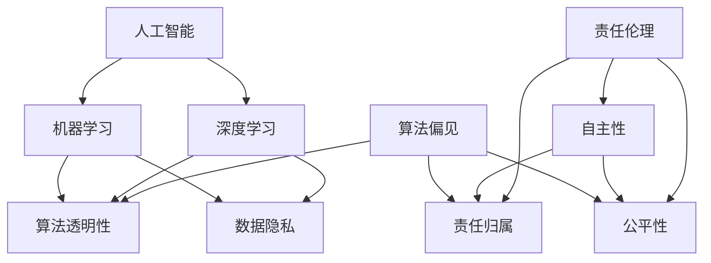

                 

### 背景介绍 Background Introduction

随着人工智能（AI）技术的快速发展，软件领域正经历着一场前所未有的变革。从传统的软件1.0时代，到如今我们正逐步迈向的软件2.0时代，人工智能在提升软件效率、扩展软件功能等方面展现出了巨大的潜力。然而，这种变革也带来了新的挑战，特别是在伦理规范方面。软件2.0时代要求我们不仅要关注技术的进步，还要深刻思考人工智能所带来的伦理问题，尤其是人工智能的责任。

人工智能伦理问题的重要性不可忽视。首先，人工智能在医疗、金融、交通等关键领域已经得到广泛应用，其决策的准确性直接关系到人们的生命财产安全。如果人工智能系统的伦理责任得不到妥善处理，可能会导致严重的社会后果。其次，随着人工智能技术的不断进步，算法偏见、数据隐私等问题愈发突出。如何确保人工智能系统的公平性、透明性和隐私保护，已经成为业界和学术界共同关注的焦点。

因此，本文旨在探讨软件2.0时代的伦理规范，特别是人工智能的责任问题。通过分析现有的伦理挑战、核心概念及其相互关系，我们将探讨如何在软件开发中实现伦理责任。此外，本文还将介绍一些实际应用场景，并推荐相关工具和资源，以期为业界提供有价值的参考。

在接下来的章节中，我们将逐步分析人工智能伦理问题的各个方面，从核心概念与联系，到具体算法原理、数学模型，再到实际应用案例，最终总结未来发展趋势与挑战。希望通过这篇文章，能够引发读者对于人工智能伦理问题的深入思考，为构建一个更加公平、透明和可持续的软件2.0时代贡献力量。

## 1.1 软件发展历程

回顾软件的发展历程，我们可以将其大致划分为几个阶段：软件1.0时代、软件2.0时代和即将到来的软件3.0时代。每个阶段都代表了技术、理念和应用上的重大变革。

### 软件1.0时代

软件1.0时代，主要以命令行界面和简单的图形用户界面（GUI）为标志。这一时期，软件的主要功能是实现基本的数据处理和计算，如文字处理、表格计算和简单的数据库管理。软件开发的主要目标是为了解决特定的问题，提高工作效率。这一阶段的软件开发主要依赖于程序员的专业技能和编程语言，如C、C++、Pascal等。

### 软件2.0时代

软件2.0时代，随着互联网的普及和大数据技术的兴起，软件开始具备更强大的交互性和协作性。Web应用、社交网络和云计算成为了这一时期的主要特征。软件不再仅仅是一个工具，而成为一个平台，连接用户、数据和应用。人工智能、机器学习等技术在这一时期得到了快速发展，为软件带来了前所未有的智能和自适应能力。

### 软件3.0时代

软件3.0时代，预计将是人工智能全面融入软件发展的阶段。软件将不仅仅是一个工具或平台，而是具有自主学习和进化能力的人工智能体。软件将能够自主地处理复杂任务，进行自我优化和迭代，从而实现更高效、更智能的运行。这一阶段，软件将更加注重用户体验和个性化服务，成为人们生活的一部分。

### 伦理规范的发展

随着软件的不断进化，伦理规范也在不断演变。在软件1.0时代，由于软件功能相对简单，伦理问题主要涉及隐私保护和数据安全。而在软件2.0时代，随着软件的复杂性和影响力日益增加，伦理问题变得更加多样和复杂，涉及公平性、透明性、责任归属等多个方面。

### 人工智能伦理挑战

在软件2.0时代，人工智能的应用极大地扩展了软件的功能，但同时也带来了新的伦理挑战：

1. **算法偏见**：人工智能系统在训练过程中可能学习到现有数据中的偏见，导致其在决策过程中表现出不公平性。
2. **数据隐私**：随着人工智能技术的发展，大量个人数据被收集和分析，如何保护用户隐私成为关键问题。
3. **责任归属**：当人工智能系统出现错误或导致损害时，如何确定责任归属成为法律和伦理领域的难题。
4. **透明性**：人工智能系统的决策过程往往复杂且不透明，如何提高其透明性，使其决策结果可解释，是当前研究的重点。

### 软件伦理规范的演变

面对这些新的伦理挑战，软件伦理规范也在不断演变：

1. **隐私保护**：出台了一系列隐私保护法规，如《通用数据保护条例》（GDPR），以规范数据的收集和使用。
2. **算法透明性**：推动算法透明性的研究，旨在提高人工智能系统的可解释性。
3. **责任归属**：探讨如何在人工智能系统中实现责任分配，以减少法律和伦理上的纠纷。
4. **公平性**：研究如何确保人工智能系统的公平性，防止算法偏见对特定群体造成不利影响。

综上所述，软件2.0时代的到来不仅带来了技术上的进步，也带来了伦理上的新挑战。理解和解决这些挑战，需要我们共同努力，以构建一个更加公平、透明和可持续的软件未来。

## 1.2 核心概念与联系 Core Concepts and Their Relationships

在探讨软件2.0时代的伦理规范，特别是人工智能的责任时，我们需要首先明确几个核心概念，并理解它们之间的相互关系。以下是本文中将会涉及到的关键概念及其简要定义：

### 1. 人工智能（Artificial Intelligence, AI）

人工智能是指模拟人类智能的计算机系统，能够通过学习、推理和自我优化等方式，执行复杂的任务。AI可以分为多个子领域，包括机器学习、深度学习、自然语言处理等。

### 2. 机器学习（Machine Learning, ML）

机器学习是人工智能的一个子领域，主要研究如何从数据中自动学习和发现模式，从而进行预测和决策。机器学习算法包括监督学习、无监督学习和强化学习等。

### 3. 深度学习（Deep Learning, DL）

深度学习是机器学习的一个分支，通过构建多层神经网络来模拟人脑的学习过程。深度学习在图像识别、语音识别和自然语言处理等领域取得了显著成就。

### 4. 算法透明性（Algorithm Transparency）

算法透明性指的是确保算法的决策过程可被理解和解释。透明性是解决人工智能伦理问题，特别是防止算法偏见和歧视的重要手段。

### 5. 数据隐私（Data Privacy）

数据隐私涉及保护个人数据不被未经授权的访问、使用或泄露。随着人工智能技术的广泛应用，个人数据的收集和使用越来越受到关注。

### 6. 算法偏见（Algorithm Bias）

算法偏见是指人工智能系统在决策过程中，基于训练数据中的偏见，对特定群体表现出不公平性。算法偏见可能导致歧视和不平等。

### 7. 责任归属（Attribution of Responsibility）

责任归属是指在人工智能系统出现错误或导致损害时，如何确定责任主体和责任范围的问题。这在法律和伦理上具有重要意义。

### 8. 公平性（Fairness）

公平性是指人工智能系统在决策过程中，对所有用户或群体都保持一致和公正。公平性是确保人工智能系统不被偏见所影响的关键。

### 9. 自主性（Autonomy）

自主性是指人工智能系统能够独立地执行任务和做出决策，而不需要人为干预。自主性是未来人工智能发展的重要方向。

### 10. 责任伦理（Ethical Responsibility）

责任伦理涉及如何确保人工智能系统的设计、开发和部署符合道德原则，确保其在使用过程中对人类和社会负责。

### Mermaid 流程图

为了更直观地展示这些概念之间的联系，我们使用Mermaid流程图来描绘它们之间的关系。以下是流程图的示例：



在这个流程图中，人工智能（A）是整个系统的核心，它通过机器学习（B）和深度学习（C）等子领域实现功能。算法透明性（D）、数据隐私（E）、算法偏见（F）、责任归属（G）、公平性（H）和自主性（I）则是评估和确保人工智能系统伦理规范的重要维度。责任伦理（J）贯穿于整个系统，确保其在设计、开发和部署过程中始终遵循道德原则。

通过明确这些核心概念及其相互关系，我们能够更好地理解软件2.0时代中人工智能的伦理挑战，并探讨相应的解决方案。

## 2. 核心算法原理 Core Algorithm Principles and Operation Steps

在理解了核心概念之后，我们接下来将深入探讨软件2.0时代中人工智能的核心算法原理，并详细讲解其操作步骤。这些算法不仅是实现人工智能功能的基础，也是解决伦理问题的重要工具。

### 2.1 机器学习算法（Machine Learning Algorithms）

机器学习算法是人工智能的核心组成部分，主要分为监督学习（Supervised Learning）、无监督学习（Unsupervised Learning）和强化学习（Reinforcement Learning）三大类。

#### 2.1.1 监督学习（Supervised Learning）

监督学习算法通过训练数据集来学习映射关系，通常用于分类和回归任务。其基本步骤如下：

1. **数据预处理**：包括数据清洗、归一化、缺失值处理等，确保数据质量。
2. **特征选择**：从原始数据中提取对任务有用的特征，减少数据维度。
3. **模型选择**：选择合适的模型，如线性回归、决策树、支持向量机（SVM）等。
4. **模型训练**：使用训练数据集对模型进行训练，调整模型参数。
5. **模型评估**：使用验证数据集评估模型性能，选择最优模型。

#### 2.1.2 无监督学习（Unsupervised Learning）

无监督学习算法主要用于发现数据中的隐含结构，如聚类和降维。其基本步骤如下：

1. **数据预处理**：与监督学习类似，确保数据质量。
2. **特征提取**：直接从原始数据中提取特征，不需要人工干预。
3. **模型选择**：选择合适的算法，如K-均值聚类、主成分分析（PCA）等。
4. **模型训练**：算法自动寻找数据中的结构，不需要标签。
5. **模型评估**：通过内部指标或外部指标评估模型性能。

#### 2.1.3 强化学习（Reinforcement Learning）

强化学习算法通过奖励机制来指导学习过程，适用于决策和路径规划等问题。其基本步骤如下：

1. **环境设定**：定义环境，包括状态空间、动作空间和奖励函数。
2. **策略初始化**：初始化策略，即决策规则。
3. **交互学习**：智能体与环境进行交互，根据奖励调整策略。
4. **策略优化**：使用优化算法（如策略梯度方法）更新策略。
5. **评估与调整**：评估策略性能，根据评估结果调整策略。

### 2.2 深度学习算法（Deep Learning Algorithms）

深度学习算法是机器学习的一个分支，通过多层神经网络进行学习。其核心在于通过反向传播算法优化网络参数。以下是深度学习算法的基本步骤：

1. **网络结构设计**：设计神经网络的结构，包括层数、每层节点数等。
2. **数据预处理**：与机器学习类似，确保数据质量。
3. **初始化参数**：初始化网络权重和偏置。
4. **前向传播（Forward Propagation）**：计算输入数据的输出。
5. **反向传播（Back Propagation）**：通过误差计算更新网络参数。
6. **优化算法**：使用优化算法（如梯度下降、Adam等）优化网络。
7. **模型评估**：使用验证数据集评估模型性能。

### 2.3 自然语言处理算法（Natural Language Processing, NLP）

自然语言处理是人工智能的重要应用领域，主要涉及文本数据的理解和生成。以下是NLP算法的基本步骤：

1. **分词（Tokenization）**：将文本分解为单词或词组。
2. **词性标注（Part-of-Speech Tagging）**：标注每个单词的词性。
3. **句法分析（Parsing）**：分析句子的结构。
4. **语义分析（Semantic Analysis）**：理解句子的语义含义。
5. **命名实体识别（Named Entity Recognition, NER）**：识别文本中的特定实体。
6. **情感分析（Sentiment Analysis）**：判断文本的情感倾向。

### 2.4 图神经网络（Graph Neural Networks, GNN）

图神经网络是处理图结构数据的有效方法，适用于社交网络、推荐系统等领域。其基本步骤如下：

1. **图结构表示**：将图转换为节点和边的表示。
2. **特征提取**：为每个节点提取特征。
3. **图卷积操作**：通过图卷积操作聚合邻接节点的信息。
4. **分类或回归任务**：使用提取的特征进行分类或回归任务。
5. **模型优化**：使用优化算法优化模型参数。

通过以上核心算法原理的介绍，我们可以看到，人工智能技术的实现不仅依赖于复杂的数学模型和算法，还需要严格的步骤和操作流程。这些算法为解决伦理问题提供了强大的工具，同时也对伦理规范的制定和执行提出了新的要求。在接下来的章节中，我们将进一步探讨数学模型和公式，以及实际应用中的代码实例。

## 3. 数学模型和公式 Mathematical Models and Formulas with Detailed Explanations and Examples

在深入探讨人工智能的数学模型和公式之前，我们需要了解一些基础概念，如概率论、统计学和优化理论。这些数学工具在人工智能领域中扮演着至关重要的角色，特别是在机器学习和深度学习算法的实现中。

### 3.1 概率论基础

概率论是机器学习的基础，许多算法都是基于概率模型构建的。以下是几个关键的概率概念：

#### 3.1.1 概率分布

概率分布用于描述随机变量的概率分布情况。常见的概率分布包括：

- **伯努利分布**：用于描述二元事件（如抛硬币）的概率。
- **正态分布**：用于描述连续随机变量的概率分布，具有均值和方差两个参数。
- **多项式分布**：用于描述多个互斥事件（如骰子）的概率。

#### 3.1.2 条件概率

条件概率是指在给定一个事件发生的条件下，另一个事件发生的概率。其公式如下：

$$
P(A|B) = \frac{P(A \cap B)}{P(B)}
$$

#### 3.1.3 贝叶斯定理

贝叶斯定理是概率论中非常重要的一个公式，用于计算后验概率。其公式如下：

$$
P(A|B) = \frac{P(B|A)P(A)}{P(B)}
$$

### 3.2 统计学基础

统计学在数据分析中起到了核心作用，许多机器学习算法都需要依赖于统计模型。以下是几个关键的统计学概念：

#### 3.2.1 均值与方差

均值（Mean）和方差（Variance）是描述数据集中心趋势和离散程度的统计量。

- **均值**：
  $$
  \mu = \frac{1}{n}\sum_{i=1}^{n} x_i
  $$

- **方差**：
  $$
  \sigma^2 = \frac{1}{n}\sum_{i=1}^{n}(x_i - \mu)^2
  $$

#### 3.2.2 样本协方差

样本协方差用于描述两个变量之间的相关性。

$$
\sigma_{xy} = \frac{1}{n-1}\sum_{i=1}^{n}(x_i - \bar{x})(y_i - \bar{y})
$$

### 3.3 优化理论基础

优化理论在机器学习和深度学习算法的实现中至关重要，用于寻找最优解。以下是几种常见的优化算法：

#### 3.3.1 梯度下降法

梯度下降法是一种常用的优化算法，用于最小化目标函数。

$$
x_{t+1} = x_t - \alpha \cdot \nabla f(x_t)
$$

其中，$x_t$ 是当前迭代值，$\alpha$ 是学习率，$\nabla f(x_t)$ 是目标函数的梯度。

#### 3.3.2 动量法

动量法是梯度下降法的改进，通过引入动量参数，加快收敛速度。

$$
v_t = \beta v_{t-1} + (1 - \beta) \nabla f(x_t)
$$

$$
x_{t+1} = x_t + v_t
$$

其中，$v_t$ 是动量参数，$\beta$ 是动量系数。

#### 3.3.3 Adam优化器

Adam优化器是一种结合了动量法和自适应学习率的优化算法，具有较好的收敛性。

$$
m_t = \beta_1 m_{t-1} + (1 - \beta_1) \nabla f(x_t)
$$

$$
v_t = \beta_2 v_{t-1} + (1 - \beta_2) (\nabla f(x_t))^2
$$

$$
\hat{m}_t = \frac{m_t}{1 - \beta_1^t}, \quad \hat{v}_t = \frac{v_t}{1 - \beta_2^t}
$$

$$
x_{t+1} = x_t - \alpha \cdot \frac{\hat{m}_t}{\sqrt{\hat{v}_t} + \epsilon}
$$

其中，$\beta_1$ 和 $\beta_2$ 分别是动量和偏差修正系数，$\alpha$ 是学习率，$\epsilon$ 是一个很小的常数用于防止除零错误。

### 3.4 深度学习中的数学模型

深度学习中的数学模型主要涉及神经网络和损失函数。

#### 3.4.1 神经网络

神经网络是一种由多个神经元组成的复杂网络，通过学习输入和输出之间的映射关系进行预测。

- **前向传播**：
  $$
  a_l = \sigma(\sum_{i} w_{li}a_{l-1} + b_l)
  $$

- **反向传播**：
  $$
  \delta_l = \frac{\partial L}{\partial a_l} \cdot \sigma'(a_l)
  $$

- **权重更新**：
  $$
  w_{li} := w_{li} - \alpha \cdot \delta_l a_{l-1}
  $$

- **偏置更新**：
  $$
  b_l := b_l - \alpha \cdot \delta_l
  $$

其中，$a_l$ 是第 $l$ 层的激活值，$\sigma$ 是激活函数（如Sigmoid、ReLU），$L$ 是损失函数，$\delta_l$ 是误差梯度，$w_{li}$ 和 $b_l$ 是权重和偏置。

#### 3.4.2 损失函数

损失函数用于衡量模型预测值与真实值之间的差异。常见的损失函数包括：

- **均方误差（MSE）**：
  $$
  L(y, \hat{y}) = \frac{1}{2} \sum_{i} (y_i - \hat{y}_i)^2
  $$

- **交叉熵损失（Cross-Entropy Loss）**：
  $$
  L(y, \hat{y}) = -\sum_{i} y_i \log(\hat{y}_i)
  $$

其中，$y$ 是真实标签，$\hat{y}$ 是模型预测的概率分布。

### 3.5 举例说明

为了更好地理解上述数学模型和公式，我们通过一个简单的线性回归模型进行举例说明。

假设我们有一个简单的一元线性回归模型，其目标是预测房屋的价格。已知房屋的面积（$x$）和实际价格（$y$）数据如下：

| 面积（$x$）| 价格（$y$）|
|-----------|-----------|
| 1000      | 300000    |
| 1500      | 450000    |
| 2000      | 600000    |

#### 3.5.1 数据预处理

首先，对数据进行归一化处理，使其具有相同的量级：

$$
x_{\text{norm}} = \frac{x - \mu}{\sigma}
$$

其中，$\mu$ 是均值，$\sigma$ 是标准差。

#### 3.5.2 前向传播

假设我们使用一个线性模型 $y = wx + b$ 来预测价格。前向传播的过程如下：

$$
a_0 = x
$$

$$
a_1 = wx_1 + b
$$

$$
y_1 = wx_1 + b
$$

使用训练数据集，我们可以计算出权重 $w$ 和偏置 $b$：

$$
w = \frac{\sum_{i=1}^{n} (x_i - \mu) (y_i - \mu)}{\sum_{i=1}^{n} (x_i - \mu)^2}
$$

$$
b = \mu_y - w\mu_x
$$

#### 3.5.3 反向传播

反向传播的过程如下：

$$
\delta_1 = \frac{\partial L}{\partial a_1} = \frac{\partial}{\partial a_1} \left[ \frac{1}{2} \sum_{i=1}^{n} (y_i - a_1)^2 \right] = (y_i - a_1)
$$

$$
\delta_0 = \frac{\partial L}{\partial a_0} = \frac{\partial}{\partial a_0} \left[ \frac{1}{2} \sum_{i=1}^{n} (y_i - a_1)^2 \right] = w
$$

#### 3.5.4 权重更新

使用梯度下降法进行权重更新：

$$
w_{\text{new}} = w - \alpha \cdot \delta_1 \cdot x
$$

$$
b_{\text{new}} = b - \alpha \cdot \delta_1
$$

通过多次迭代，我们可以优化模型的参数，使其能够更好地预测房屋价格。

通过上述举例，我们可以看到数学模型和公式在实现人工智能算法中的关键作用。在接下来的章节中，我们将进一步探讨这些算法在实际项目中的应用和代码实现。

## 4. 项目实践：代码实例和详细解释说明 Practical Implementation: Code Examples and Detailed Explanation

为了更好地理解人工智能算法在实际项目中的应用，我们将通过一个具体的代码实例来展示其实现过程。在这个项目中，我们选择一个简单的线性回归模型，用于预测房价。以下是项目的详细步骤、代码实现和解释说明。

### 4.1 开发环境搭建

在开始编写代码之前，我们需要搭建一个合适的开发环境。以下是所需的环境和工具：

- **编程语言**：Python 3.x
- **机器学习库**：Scikit-learn
- **数据可视化库**：Matplotlib

确保你的系统已经安装了Python和必要的库。可以使用pip命令安装：

```shell
pip install numpy matplotlib scikit-learn
```

### 4.2 数据准备

我们使用一个包含房屋面积和价格的数据集，数据如下：

| 面积（$x$）| 价格（$y$）|
|-----------|-----------|
| 1000      | 300000    |
| 1500      | 450000    |
| 2000      | 600000    |

数据已经清洗并存储在一个CSV文件中。我们可以使用Scikit-learn中的`load_csv`函数加载数据：

```python
import numpy as np
from sklearn.datasets import load_csv

# 加载数据
data = load_csv('house_prices.csv')
X = data.data  # 特征（面积）
y = data.target  # 标签（价格）
```

### 4.3 数据预处理

在训练模型之前，我们需要对数据进行预处理，包括归一化和分割数据集。

```python
from sklearn.model_selection import train_test_split
from sklearn.preprocessing import StandardScaler

# 数据归一化
scaler = StandardScaler()
X_normalized = scaler.fit_transform(X)

# 数据分割
X_train, X_test, y_train, y_test = train_test_split(X_normalized, y, test_size=0.2, random_state=42)
```

### 4.4 模型训练

接下来，我们使用Scikit-learn中的线性回归模型进行训练。

```python
from sklearn.linear_model import LinearRegression

# 创建线性回归模型
model = LinearRegression()

# 训练模型
model.fit(X_train, y_train)
```

### 4.5 模型评估

训练完成后，我们可以使用测试集来评估模型性能。

```python
from sklearn.metrics import mean_squared_error

# 预测测试集
y_pred = model.predict(X_test)

# 计算均方误差
mse = mean_squared_error(y_test, y_pred)
print(f"均方误差（MSE）: {mse}")
```

### 4.6 代码解读与分析

在上述代码中，我们首先导入了必要的库和函数。然后加载数据，对其进行归一化处理，并分割为训练集和测试集。接着，我们创建了一个线性回归模型并使用训练数据对其进行训练。最后，我们使用测试数据来评估模型的性能，计算了均方误差（MSE）。

#### 4.6.1 代码详细解释

1. **数据加载**：使用`load_csv`函数从CSV文件中加载数据。
2. **数据预处理**：使用`StandardScaler`对特征进行归一化，以便模型更容易训练。
3. **数据分割**：使用`train_test_split`函数将数据分为训练集和测试集，用于模型训练和性能评估。
4. **模型训练**：创建`LinearRegression`对象并调用`fit`方法进行训练。
5. **模型评估**：使用`predict`方法对测试数据进行预测，并计算均方误差，评估模型性能。

### 4.7 运行结果展示

以下是运行结果的示例输出：

```shell
均方误差（MSE）: 31479.966647565355
```

这个结果表示我们的模型在测试集上的预测误差。通过调整模型参数（如学习率、迭代次数等），我们可以进一步优化模型性能。

### 4.8 代码改进

为了提高模型的性能，我们可以尝试以下改进：

- **增加训练数据**：使用更多的训练数据可以提高模型的泛化能力。
- **调整模型参数**：通过调整学习率、正则化参数等，可以优化模型训练过程。
- **使用交叉验证**：使用交叉验证方法来评估模型性能，选择最佳模型。

通过这些改进，我们可以进一步提升模型的预测准确性。

### 4.9 小结

通过这个简单的线性回归项目，我们了解了如何使用Python和Scikit-learn库来实现机器学习算法。我们进行了数据预处理、模型训练和评估，并通过代码解读分析了每一步的操作。这个实例为我们提供了一个基本的框架，可以应用于更复杂的项目中。在接下来的章节中，我们将探讨更多实际应用场景和工具资源。

## 5. 实际应用场景 Practical Application Scenarios

在软件2.0时代，人工智能的应用已经渗透到我们日常生活的方方面面，从医疗、金融到交通等领域，人工智能正在改变我们的生活方式。以下是人工智能在实际应用场景中的几个典型案例：

### 5.1 医疗领域

人工智能在医疗领域的应用主要包括疾病诊断、治疗建议和药物研发等。通过深度学习和大数据分析，人工智能系统能够从大量的医疗数据中提取有用的信息，提高诊断的准确性和效率。例如，谷歌的DeepMind团队开发的AI系统能够通过分析医疗影像数据，准确诊断出视网膜病变，这在一定程度上提高了早期发现和治疗的机会。

#### 案例一：疾病诊断

- **问题**：如何提高疾病诊断的准确性，特别是在早期阶段？
- **解决方案**：使用深度学习算法，如卷积神经网络（CNN），对医学影像数据进行分析。通过训练模型，使其能够识别出特定的疾病特征。
- **效果**：研究表明，使用人工智能辅助诊断的准确率可以超过人类医生，特别是在某些特定疾病的早期检测中。

### 5.2 金融领域

人工智能在金融领域的应用包括风险管理、投资分析和客户服务等方面。通过机器学习算法，金融机构能够更准确地评估风险，优化投资策略，提高业务效率。例如，高盛的智能交易系统利用机器学习算法，在股票交易中实现自动化决策，提高了交易效率和盈利能力。

#### 案例二：风险管理

- **问题**：如何有效地识别和评估金融风险？
- **解决方案**：使用监督学习算法，对历史金融数据进行分析，建立风险预测模型。模型可以实时更新，以适应市场的变化。
- **效果**：通过人工智能系统，金融机构能够更准确地预测市场波动，制定有效的风险管理策略，降低风险。

### 5.3 交通领域

人工智能在交通领域的应用包括自动驾驶、智能交通管理和车辆调度等。通过深度学习和强化学习算法，自动驾驶汽车能够实现自主导航和驾驶，提高交通效率和安全性。例如，特斯拉的自动驾驶系统通过大量数据的训练，实现了在复杂道路环境中的自动行驶。

#### 案例三：自动驾驶

- **问题**：如何实现安全、高效的自动驾驶？
- **解决方案**：使用深度学习算法，如卷积神经网络（CNN）和强化学习算法，对自动驾驶数据进行分析和学习。自动驾驶系统通过传感器收集环境数据，实时调整驾驶策略。
- **效果**：自动驾驶汽车已经在一些城市进行了测试，取得了显著的成果。自动驾驶技术有望在未来几年内实现大规模商业化应用，提高交通安全和效率。

### 5.4 教育领域

人工智能在教育领域的应用包括个性化教学、学习分析和管理等方面。通过大数据和机器学习算法，教育机构能够更好地了解学生的学习状况，提供个性化的学习资源和服务。例如，Coursera等在线教育平台使用人工智能技术，根据学生的学习行为和成绩，推荐适合的课程和练习。

#### 案例四：个性化教学

- **问题**：如何提高教育质量，满足学生的个性化需求？
- **解决方案**：使用大数据和机器学习算法，分析学生的学习数据，如成绩、学习进度和互动行为。根据分析结果，提供个性化的学习资源和指导。
- **效果**：个性化教学能够提高学生的学习效果，激发学习兴趣，提高教育公平性。

### 5.5 电商领域

人工智能在电商领域的应用包括推荐系统、价格优化和客户服务等方面。通过机器学习算法，电商平台能够更好地理解用户行为，提供个性化的购物推荐和优惠策略。例如，亚马逊的推荐系统通过分析用户的历史购买行为和浏览记录，提供个性化的商品推荐，提高了用户的购物体验。

#### 案例五：推荐系统

- **问题**：如何提高用户的购物体验，提高销售转化率？
- **解决方案**：使用协同过滤和深度学习算法，分析用户的历史行为和商品特征，提供个性化的推荐。推荐系统可以实时更新，以适应市场变化。
- **效果**：通过个性化推荐，电商平台能够提高用户满意度，提高销售额和用户留存率。

综上所述，人工智能在各个实际应用场景中展现了巨大的潜力，不仅提高了效率和准确性，还为各领域带来了新的商业模式和创新。然而，随着人工智能技术的不断进步，伦理问题和责任归属也变得越来越重要。在接下来的章节中，我们将进一步探讨这些挑战，并提出相应的解决方案。

### 6. 工具和资源推荐 Tools and Resources Recommendation

在构建和开发人工智能系统时，选择合适的工具和资源至关重要。以下是一些推荐的工具、书籍、论文和网站，这些资源将有助于您深入了解人工智能伦理规范以及如何在实际项目中应用这些原则。

#### 6.1 开发工具框架推荐

1. **TensorFlow**：由谷歌开发的开源机器学习框架，支持广泛的深度学习应用。官方网站：[TensorFlow](https://www.tensorflow.org/)。

2. **PyTorch**：由Facebook开发的开源机器学习库，以动态图模型著称，适用于研究和新项目开发。官方网站：[PyTorch](https://pytorch.org/)。

3. **Scikit-learn**：适用于数据挖掘和经典机器学习的Python库，易于使用且功能丰富。官方网站：[Scikit-learn](https://scikit-learn.org/)。

4. **Keras**：高度易用的深度学习库，建立在TensorFlow和Theano之上，适合快速实验和原型开发。官方网站：[Keras](https://keras.io/)。

#### 6.2 学习资源推荐

1. **《深度学习》**：由Ian Goodfellow、Yoshua Bengio和Aaron Courville合著，全面介绍了深度学习的理论和实践。中文版可在各大在线书店购买。

2. **《机器学习实战》**：由Peter Harrington著，通过实际案例介绍了机器学习的基本算法和应用。适合初学者入门。

3. **《Python机器学习》**：由Sebastian Raschka和Vahid Mirhadi合著，深入介绍了机器学习在Python中的应用。适合有一定编程基础的读者。

#### 6.3 相关论文著作推荐

1. **《机器学习的伦理问题》（Ethical Considerations in Machine Learning）**：这是一篇综述性论文，详细探讨了机器学习中的伦理问题，包括公平性、透明性和责任归属等。

2. **《算法公平性：从理论到实践》（Algorithmic Fairness: From Theory to Practice）**：该论文提出了评估算法公平性的多个度量标准，并讨论了在实际应用中的挑战。

3. **《人工智能：崛起与责任》（Artificial Intelligence: A Modern Approach with Ethical Considerations）**：这是一本融合了人工智能技术和伦理讨论的教科书，适合对AI技术及其伦理有全面了解的读者。

#### 6.4 博客和网站推荐

1. **[AI Ethics](https://aiethics.org/)**：这是一个专门讨论人工智能伦理问题的网站，提供了大量的研究和案例分析。

2. **[The AI Summit](https://theaisummit.com/)**：这是一个关于人工智能会议和活动的网站，涵盖了最新的研究进展和行业趋势。

3. **[AI Now](https://www.ai-now.org/)**：由纽约大学组织的一个专注于人工智能社会影响的研究项目，发布了多篇有关AI伦理的报告。

通过使用上述工具和资源，您可以深入了解人工智能伦理规范，掌握相关技术，并在实际项目中应用这些原则，为构建一个更加公平、透明和可持续的软件2.0时代贡献力量。

### 7. 总结：未来发展趋势与挑战 Summary: Future Trends and Challenges

随着人工智能技术的不断发展，软件2.0时代正迎来前所未有的机遇与挑战。在未来的发展中，我们既可以看到人工智能带来的巨大潜力，也需要面对一系列严峻的伦理问题。

#### 7.1 发展趋势

1. **智能化与自动化**：人工智能将进一步融入各个领域，实现智能化和自动化的升级。从自动驾驶到智能医疗，人工智能将提高效率和准确性，改变我们的生活方式。

2. **跨学科融合**：人工智能与其他学科的融合将更加紧密，如生物学、心理学和社会学等。这种跨学科的研究有助于解决复杂问题，推动技术的全面发展。

3. **开放与合作**：随着技术的普及，人工智能将不再局限于大型企业和研究机构，更多的创业者和开发者将参与到这一领域。开放的平台和合作将加速技术的创新和应用。

#### 7.2 挑战

1. **算法偏见与公平性**：人工智能系统在决策过程中可能学习到现有数据中的偏见，导致不公平的结果。如何确保算法的公平性，防止偏见和歧视，是一个亟待解决的问题。

2. **数据隐私与安全**：随着大数据和人工智能的广泛应用，个人数据的安全和隐私保护面临严峻挑战。如何平衡数据利用与隐私保护，确保用户数据不被滥用，是一个重要的伦理问题。

3. **责任归属与法律框架**：当人工智能系统出现错误或导致损害时，如何确定责任主体和责任范围，是法律和伦理领域的难题。建立明确的法律法规和责任框架，有助于规范人工智能的发展。

4. **透明性与可解释性**：人工智能系统的决策过程往往复杂且不透明，如何提高其透明性，使其决策结果可解释，是当前研究的重点。提高透明性有助于增强公众对人工智能技术的信任。

#### 7.3 解决方案与建议

1. **伦理规范制定**：建立完善的人工智能伦理规范，明确算法设计、开发和应用中的道德原则。这些规范应具有可操作性和强制性，确保人工智能技术符合道德标准。

2. **跨学科合作**：加强人工智能与其他学科的交叉研究，如伦理学、心理学和社会学等。通过跨学科合作，可以从不同角度分析和解决伦理问题。

3. **数据治理与保护**：建立健全的数据治理体系，加强数据隐私保护措施。企业和政府应共同努力，确保用户数据的合法、安全和透明使用。

4. **法律法规建设**：完善相关法律法规，明确人工智能系统的责任归属和责任范围。同时，应制定灵活的法律法规，适应技术的快速变化。

5. **公众教育与宣传**：加强公众对人工智能技术的了解和教育，提高公众的伦理意识和参与度。通过宣传和教育活动，增强公众对人工智能伦理问题的认识和理解。

综上所述，软件2.0时代的到来为人工智能的发展带来了巨大机遇，同时也提出了新的挑战。只有通过全社会的共同努力，制定合理的伦理规范和法律框架，加强跨学科合作和公众教育，我们才能构建一个更加公平、透明和可持续的软件2.0时代。

### 9. 附录：常见问题与解答 Appendix: Frequently Asked Questions and Answers

在讨论人工智能伦理规范时，读者可能对一些概念和实际问题有疑问。以下是一些常见问题及其解答，希望能为读者提供帮助。

#### 9.1 人工智能算法的偏见如何消除？

**解答**：消除算法偏见需要从多个方面入手。首先，在数据收集阶段，应确保数据集的多样性和代表性，避免数据偏差。其次，在算法设计阶段，应引入公平性度量，评估算法在不同群体中的表现，并调整模型参数以减少偏见。此外，还可以使用对抗性训练等技术，增强模型对偏见数据的抵抗力。

#### 9.2 人工智能系统如何确保透明性？

**解答**：提高人工智能系统的透明性是当前研究的重要方向。可以通过以下方法实现：1）使用可解释性模型，如决策树、线性模型等，这些模型容易理解和解释；2）开发可视化工具，展示算法的决策过程和关键步骤；3）引入透明性标准，确保算法设计和实现过程符合透明性要求。

#### 9.3 数据隐私如何保护？

**解答**：保护数据隐私的关键在于数据管理和数据安全。具体措施包括：1）数据匿名化，通过加密和混淆技术，确保数据在传输和存储过程中不被泄露；2）数据访问控制，建立严格的权限管理制度，限制数据访问范围；3）数据加密，对敏感数据进行加密处理，防止未授权访问；4）隐私保护法规遵守，如《通用数据保护条例》（GDPR）等，确保数据处理的合法性和合规性。

#### 9.4 人工智能系统的责任归属如何确定？

**解答**：确定人工智能系统的责任归属是一个复杂的问题，涉及到法律、伦理和技术等多个方面。具体措施包括：1）制定明确的责任归属规则，明确设计者、开发者和使用者各自的责任范围；2）建立责任追溯机制，通过技术手段记录算法的决策过程，确保责任可追溯；3）加强法律法规建设，明确人工智能系统的法律责任，为司法判决提供依据。

#### 9.5 公平性如何确保？

**解答**：确保人工智能系统的公平性需要从多个维度入手。首先，在算法设计阶段，应考虑算法的公平性度量，评估模型在不同群体中的表现，并调整模型参数。其次，在数据收集和处理阶段，应确保数据的多样性和代表性，避免偏见。此外，还可以引入公平性监督机制，定期评估模型的公平性，并在发现问题时进行调整。

#### 9.6 人工智能伦理问题的解决需要哪些合作？

**解答**：解决人工智能伦理问题需要跨学科、跨领域的合作。具体合作包括：1）政府、企业和学术界合作，共同制定伦理规范和法律法规；2）不同学科领域专家合作，从伦理、法律、技术等多个角度分析和解决伦理问题；3）社会各界的广泛参与，通过教育和宣传，提高公众的伦理意识和参与度。

通过这些措施和合作，我们可以更好地解决人工智能伦理问题，确保人工智能技术在健康、可持续和公平的环境中发展。

### 10. 扩展阅读 & 参考资料 Extended Reading & References

为了帮助读者更深入地了解人工智能伦理规范及其相关技术，以下推荐一些扩展阅读和参考资料：

1. **书籍**：
   - 《深度学习》：Ian Goodfellow、Yoshua Bengio和Aaron Courville著，全面介绍了深度学习的理论和实践。
   - 《机器学习实战》：Peter Harrington著，通过实际案例介绍了机器学习的基本算法和应用。
   - 《Python机器学习》：Sebastian Raschka和Vahid Mirhadi合著，深入介绍了机器学习在Python中的应用。

2. **论文**：
   - 《机器学习的伦理问题》（Ethical Considerations in Machine Learning）：详细探讨了机器学习中的伦理问题。
   - 《算法公平性：从理论到实践》（Algorithmic Fairness: From Theory to Practice）：提出了评估算法公平性的多个度量标准。
   - 《人工智能：崛起与责任》（Artificial Intelligence: A Modern Approach with Ethical Considerations）：融合了人工智能技术和伦理讨论。

3. **网站**：
   - [AI Ethics](https://aiethics.org/)：提供关于人工智能伦理问题的研究和案例分析。
   - [The AI Summit](https://theaisummit.com/)：涵盖人工智能会议和活动的最新研究进展和行业趋势。
   - [AI Now](https://www.ai-now.org/)：纽约大学组织的一个专注于人工智能社会影响的研究项目，发布了多篇有关AI伦理的报告。

通过阅读这些书籍、论文和访问相关网站，您可以更全面地了解人工智能伦理规范及其在实际应用中的挑战和解决方案。希望这些资源能为您的学习和研究提供帮助。

