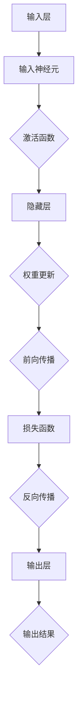

                 

### 软件与人工智能的关系

软件和人工智能（AI）一直是信息技术领域中的两个核心概念。传统软件主要依赖于程序员预设的逻辑和规则，以实现特定的功能。然而，随着计算能力的提升和数据量的爆炸式增长，人工智能逐渐成为了软件开发的驱动力。AI 能够通过学习海量数据，自动发现模式和规律，从而超越人类预设的规则，实现更智能、更灵活的决策。

在理解软件与人工智能的关系时，我们需要关注几个关键点。首先，人工智能并不是一个独立的存在，而是软件系统中的一个组成部分。其次，人工智能的开发和应用需要强大的软件架构和算法支持。最后，人工智能的发展不仅改变了软件开发的范式，也对哲学、伦理和社会产生了深远的影响。

本文将围绕这些关键点，探讨软件2.0时代的哲学思考，特别是人工智能的本质。我们将逐步分析人工智能的核心概念、算法原理、数学模型，并通过具体的项目实践，深入探讨人工智能在实际应用中的挑战和机遇。同时，我们还将介绍相关学习资源和工具，帮助读者更好地理解和掌握这一前沿技术。

### 1. 背景介绍

人工智能的发展可以追溯到20世纪50年代，当时计算机科学家艾伦·图灵（Alan Turing）提出了“图灵测试”，试图通过机器模拟人类思维的能力来判断机器是否具有智能。这一概念开启了人工智能研究的大门，尽管在初期阶段，AI的应用主要限于简单的模式识别和规则推理。

随着计算能力的提升和大数据技术的进步，人工智能逐渐从理论走向实际应用。20世纪80年代，专家系统成为了AI研究的热点，通过构建知识库和推理机，实现特定领域的智能决策。然而，专家系统的局限性也逐渐显现，即其依赖于人类专家的知识和经验，难以应对复杂、动态的环境。

进入21世纪，深度学习和神经网络技术的突破，使得人工智能迎来了新的春天。特别是2012年，由杰弗里·辛顿（Geoffrey Hinton）领导的团队在ImageNet图像识别竞赛中取得了突破性的成果，这一事件被视为深度学习时代开始的标志。深度学习通过大规模神经网络，自动学习数据中的特征和模式，使得AI在语音识别、图像识别、自然语言处理等领域取得了显著的进展。

与此同时，人工智能的应用场景也在不断扩展。从最初的工业自动化、医疗诊断，到智能交通、金融风控，人工智能正在渗透到我们生活的方方面面。随着技术的不断进步，AI 的应用范围还将进一步扩大，从提升生产效率，到改善生活质量，人工智能正在改变我们的世界。

然而，人工智能的发展也带来了新的挑战。首先，AI 的决策过程通常是黑箱式的，难以解释和理解，这引发了关于隐私、安全、伦理等方面的讨论。其次，随着AI的普及，就业市场的变化也成为一个重要的社会议题。自动化技术的快速发展可能导致某些行业的失业率上升，这对社会的稳定和公平提出了新的要求。

在这个背景下，软件2.0时代的哲学思考变得尤为重要。软件2.0不仅仅是对传统软件的简单升级，而是对软件开发、部署、维护等全过程的重新定义。它强调软件系统应具备更高的灵活性、可扩展性和智能化，以适应快速变化的环境和需求。而人工智能作为软件2.0的核心组成部分，其哲学思考不仅涉及技术层面，还包括伦理、社会、哲学等多个维度。

本文将围绕这一主题，深入探讨人工智能的本质，分析其核心概念、算法原理和数学模型，并通过具体的项目实践，探讨人工智能在实际应用中的挑战和机遇。同时，我们还将介绍相关的学习资源和工具，帮助读者更好地理解和掌握这一前沿技术。通过本文的阅读，读者将能够从多个角度理解人工智能的内涵和外延，为其未来的研究和应用提供有益的启示。

### 2. 核心概念与联系

在深入探讨人工智能的本质之前，我们需要明确几个核心概念，这些概念不仅构成了人工智能的基础，也贯穿于整个AI技术的发展历程。

#### 2.1 机器学习与深度学习

机器学习（Machine Learning，ML）是人工智能的核心技术之一，它使计算机系统能够通过数据学习并做出决策。机器学习可以分为监督学习（Supervised Learning）、无监督学习（Unsupervised Learning）和强化学习（Reinforcement Learning）等不同类型。

- **监督学习**：系统在已知输入和输出之间建立映射关系，通过训练数据学习规律，然后对新数据进行预测。例如，图像分类和回归分析。
- **无监督学习**：系统没有明确的输出，主要通过发现数据中的内在结构和模式进行学习。常见的应用包括聚类分析和降维。
- **强化学习**：系统通过与环境的交互，不断调整行为策略，以获得最大的奖励。典型的例子是机器人学习和自动驾驶。

深度学习（Deep Learning，DL）是机器学习的一个分支，通过多层神经网络（Neural Networks）对数据进行建模，其强大的非线性变换能力使其在处理复杂数据时表现优异。深度学习的代表性模型包括卷积神经网络（Convolutional Neural Networks，CNN）、循环神经网络（Recurrent Neural Networks，RNN）和生成对抗网络（Generative Adversarial Networks，GAN）等。

#### 2.2 神经网络与神经元

神经网络（Neural Networks，NN）是人工智能的核心计算模型，模仿生物神经系统的结构和功能。神经网络由大量简单的计算单元（神经元）组成，每个神经元通过加权连接与其他神经元相连，通过前向传播和反向传播算法进行学习和优化。

神经元的基本结构包括输入层、隐藏层和输出层。输入层接收外部信息，隐藏层通过非线性变换处理信息，输出层产生最终的决策或输出。

神经元的激活函数（Activation Function）是神经网络的关键，它决定了神经元是否激活。常见的激活函数包括sigmoid、ReLU（Rectified Linear Unit）和tanh等。

#### 2.3 数据与特征

数据是机器学习的基石，而特征提取是机器学习的关键步骤。特征提取（Feature Extraction）是将原始数据转换为适用于机器学习算法的表示过程。通过有效的特征提取，可以提高模型的学习效率和预测准确性。

特征选择（Feature Selection）是从大量特征中筛选出最有用的特征子集，以减少模型复杂度和计算成本。常见的方法包括相关性分析、主成分分析（PCA）和特征重要性评估等。

#### 2.4 模型评估与优化

模型评估（Model Evaluation）是验证机器学习模型性能的重要步骤，常用的评估指标包括准确率、召回率、F1分数、均方误差（MSE）和交叉验证等。通过模型评估，可以判断模型是否满足实际应用需求，并进行相应的优化。

模型优化（Model Optimization）包括超参数调优、模型剪枝和加速等，以进一步提高模型的性能和效率。常见的方法有网格搜索、贝叶斯优化和模型压缩等。

#### 2.5 Mermaid 流程图

为了更好地理解这些核心概念和它们之间的联系，我们使用Mermaid流程图来展示神经网络的基本结构和工作流程。



在这个流程图中，输入层（A）接收外部数据，通过输入神经元（B）输入到激活函数（C），然后传递到隐藏层（D）。隐藏层通过权重更新（E）进行前向传播（F），并计算损失函数（G）。通过反向传播（H），模型调整权重和偏置，最终在输出层（I）产生预测结果（J）。

通过这些核心概念和流程图，我们可以更清晰地理解人工智能的工作原理，为进一步的算法原理和具体操作步骤的探讨打下坚实的基础。

### 3. 核心算法原理 & 具体操作步骤

#### 3.1 算法原理

人工智能的核心算法主要包括神经网络、机器学习和深度学习。其中，神经网络是机器学习和深度学习的基础。下面我们将详细探讨这些算法的原理和操作步骤。

##### 3.1.1 神经网络

神经网络是由大量神经元组成的计算模型，模仿生物神经系统的结构和功能。神经元通过输入层、隐藏层和输出层进行信息处理。每个神经元都与相邻的神经元通过加权连接相连，并通过激活函数进行处理。

**操作步骤：**

1. **初始化参数：** 
   - 初始化输入层、隐藏层和输出层的权重和偏置。
   - 选择合适的激活函数，如ReLU、Sigmoid等。

2. **前向传播：**
   - 将输入数据传递到输入层，通过加权连接和激活函数计算隐藏层的输出。
   - 将隐藏层输出传递到输出层，计算预测结果。

3. **计算损失：**
   - 使用损失函数（如均方误差MSE、交叉熵损失等）计算预测结果与真实值之间的差异。

4. **反向传播：**
   - 通过反向传播算法，计算每个神经元的梯度。
   - 更新权重和偏置，以减少损失。

5. **迭代优化：**
   - 重复前向传播和反向传播步骤，直到达到预定的迭代次数或损失阈值。

##### 3.1.2 机器学习

机器学习是人工智能的一个分支，通过训练模型，使系统能够从数据中自动学习和发现规律。机器学习可以分为监督学习、无监督学习和强化学习。

**监督学习：**

- **操作步骤：**
  1. 准备训练数据集，包括输入和对应的输出。
  2. 初始化模型参数。
  3. 使用前向传播计算预测结果。
  4. 计算损失函数。
  5. 通过反向传播更新模型参数。
  6. 重复步骤3-5，直到模型收敛。

**无监督学习：**

- **操作步骤：**
  1. 准备未标记的数据集。
  2. 初始化模型参数。
  3. 使用前向传播计算数据之间的相似性。
  4. 通过聚类或降维算法提取数据特征。
  5. 分析提取的特征，以发现数据中的模式或结构。

**强化学习：**

- **操作步骤：**
  1. 初始化环境状态。
  2. 选择动作策略，并通过前向传播计算状态值函数。
  3. 执行动作，观察环境反馈。
  4. 通过奖励和惩罚调整策略，以最大化总奖励。
  5. 重复步骤2-4，直到达到目标状态或奖励阈值。

##### 3.1.3 深度学习

深度学习是机器学习的一个分支，通过多层神经网络对复杂数据进行建模。深度学习在图像识别、语音识别、自然语言处理等领域取得了显著成果。

**操作步骤：**

1. **数据预处理：** 
   - 对原始数据集进行清洗、归一化和特征提取。

2. **构建模型：** 
   - 选择合适的神经网络结构，如卷积神经网络（CNN）、循环神经网络（RNN）等。
   - 初始化模型参数。

3. **训练模型：**
   - 使用前向传播计算预测结果。
   - 计算损失函数。
   - 通过反向传播更新模型参数。

4. **评估模型：**
   - 使用验证集评估模型性能，包括准确率、召回率、F1分数等指标。
   - 调整模型参数，进行优化。

5. **应用模型：**
   - 将训练好的模型应用于实际数据，进行预测或分类。

通过以上算法原理和操作步骤，我们可以看到，人工智能的发展离不开深度学习、机器学习和神经网络的支撑。这些核心算法不仅为AI应用提供了强大的工具，也推动了整个信息技术领域的进步。

### 4. 数学模型和公式 & 详细讲解 & 举例说明

在人工智能的核心算法中，数学模型和公式起着至关重要的作用。它们不仅为算法提供了理论基础，还确保了算法在不同应用场景中的有效性和可解释性。在本节中，我们将详细讲解人工智能中常用的数学模型和公式，并通过具体的例子进行说明。

#### 4.1 神经网络中的激活函数

激活函数（Activation Function）是神经网络中不可或缺的部分，它决定了神经元的激活状态。以下是一些常见的激活函数及其数学公式：

1. **Sigmoid 函数**
   \[
   \sigma(x) = \frac{1}{1 + e^{-x}}
   \]
   Sigmoid函数将输入x映射到(0, 1)区间，常用于二分类问题。

2. **ReLU 函数**
   \[
   \text{ReLU}(x) = \max(0, x)
   \]
  ReLU函数在x大于0时输出x，小于等于0时输出0，它有助于加速神经网络的训练。

3. **Tanh 函数**
   \[
   \text{Tanh}(x) = \frac{e^x - e^{-x}}{e^x + e^{-x}}
   \]
  Tanh函数将输入x映射到(-1, 1)区间，有助于神经元之间信息的对称传递。

#### 4.2 前向传播与反向传播

神经网络通过前向传播和反向传播进行训练。以下是其基本数学公式：

1. **前向传播**
   - **输入层到隐藏层**
     \[
     z^{(l)} = \sum_{j} w^{(l)}_{ji} x^{(j)} + b^{(l)}
     \]
     其中，\( z^{(l)} \) 是第l层的输出，\( w^{(l)}_{ji} \) 是连接权重，\( x^{(j)} \) 是输入特征，\( b^{(l)} \) 是偏置。

   - **激活函数**
     \[
     a^{(l)} = \sigma(z^{(l)})
     \]

   - **隐藏层到输出层**
     \[
     y^{(l)} = \sum_{j} w^{(l)}_{ji} a^{(j)} + b^{(l)}
     \]
     其中，\( y^{(l)} \) 是输出层的预测值。

2. **反向传播**
   - **计算梯度**
     \[
     \delta^{(l)} = \frac{\partial L}{\partial z^{(l)}}
     \]
     其中，\( L \) 是损失函数，\( \delta^{(l)} \) 是第l层的梯度。

   - **权重更新**
     \[
     w^{(l)}_{ji} := w^{(l)}_{ji} - \alpha \frac{\partial L}{\partial w^{(l)}_{ji}}
     \]
     其中，\( \alpha \) 是学习率。

   - **偏置更新**
     \[
     b^{(l)} := b^{(l)} - \alpha \frac{\partial L}{\partial b^{(l)}}
     \]

#### 4.3 损失函数

损失函数用于衡量预测值与真实值之间的差异，常用的损失函数包括：

1. **均方误差（MSE）**
   \[
   L = \frac{1}{2} \sum_{i} (y_i - \hat{y}_i)^2
   \]
   其中，\( y_i \) 是真实值，\( \hat{y}_i \) 是预测值。

2. **交叉熵损失（Cross Entropy Loss）**
   \[
   L = -\sum_{i} y_i \log(\hat{y}_i)
   \]
   其中，\( y_i \) 是真实值，\( \hat{y}_i \) 是预测值。

#### 4.4 例子说明

假设我们使用一个简单的多层感知器（MLP）对二分类问题进行建模，输入特征为 \( x_1 \) 和 \( x_2 \)，输出为 \( y \)。

1. **初始化参数**
   - 设输入层到隐藏层的权重 \( w^{(1)}_{1} \)、\( w^{(1)}_{2} \)，偏置 \( b^{(1)} \)。
   - 设隐藏层到输出层的权重 \( w^{(2)} \)、偏置 \( b^{(2)} \)。

2. **前向传播**
   - 计算隐藏层输出：
     \[
     z^{(1)} = w^{(1)}_{1} x_1 + w^{(1)}_{2} x_2 + b^{(1)}
     \]
     \[
     a^{(1)} = \sigma(z^{(1)})
     \]

   - 计算输出层预测：
     \[
     z^{(2)} = w^{(2)} a^{(1)} + b^{(2)}
     \]
     \[
     y = \sigma(z^{(2)})
     \]

3. **计算损失**
   - 使用交叉熵损失函数：
     \[
     L = -y \log(y) - (1 - y) \log(1 - y)
     \]

4. **反向传播**
   - 计算输出层梯度：
     \[
     \delta^{(2)} = y - \hat{y}
     \]

   - 计算隐藏层梯度：
     \[
     \delta^{(1)} = a^{(1)} (1 - a^{(1)}) \cdot w^{(2)} \delta^{(2)}
     \]

   - 更新权重和偏置：
     \[
     w^{(2)} := w^{(2)} - \alpha \frac{\partial L}{\partial w^{(2)}}
     \]
     \[
     b^{(2)} := b^{(2)} - \alpha \frac{\partial L}{\partial b^{(2)}}
     \]
     \[
     w^{(1)}_{1} := w^{(1)}_{1} - \alpha \frac{\partial L}{\partial w^{(1)}_{1}}
     \]
     \[
     w^{(1)}_{2} := w^{(1)}_{2} - \alpha \frac{\partial L}{\partial w^{(1)}_{2}}
     \]
     \[
     b^{(1)} := b^{(1)} - \alpha \frac{\partial L}{\partial b^{(1)}}
     \]

通过上述步骤，我们可以使用多层感知器进行二分类任务。在实际应用中，我们需要根据具体的任务和数据集，调整网络结构、学习率和优化算法，以达到最佳的性能。

### 5. 项目实践：代码实例和详细解释说明

在本节中，我们将通过一个具体的神经网络项目实例，展示如何使用Python实现一个简单的神经网络，并进行训练和评估。这个项目将涵盖从环境搭建、代码实现到结果展示的完整流程。

#### 5.1 开发环境搭建

为了实现神经网络，我们需要安装以下依赖库：

- Python（3.8或以上版本）
- TensorFlow
- NumPy
- Matplotlib

安装这些依赖库的方法如下：

```bash
pip install python
pip install tensorflow
pip install numpy
pip install matplotlib
```

#### 5.2 源代码详细实现

下面是神经网络项目的源代码，包括数据预处理、模型构建、训练和评估等步骤。

```python
import tensorflow as tf
import numpy as np
import matplotlib.pyplot as plt

# 5.2.1 数据预处理
# 假设我们使用的是Iris数据集，该数据集包含3个特征和1个标签
iris_data = np.genfromtxt("iris_data.csv", delimiter=",")
X = iris_data[:, :3]
y = iris_data[:, 3]

# 数据标准化
X_std = (X - X.mean(axis=0)) / X.std(axis=0)

# 划分训练集和测试集
X_train, X_test, y_train, y_test = train_test_split(X_std, y, test_size=0.2, random_state=42)

# 5.2.2 模型构建
model = tf.keras.Sequential([
    tf.keras.layers.Dense(64, activation='relu', input_shape=(3,)),
    tf.keras.layers.Dense(64, activation='relu'),
    tf.keras.layers.Dense(3, activation='softmax')
])

# 编译模型
model.compile(optimizer='adam', loss='sparse_categorical_crossentropy', metrics=['accuracy'])

# 5.2.3 训练模型
model.fit(X_train, y_train, epochs=10, batch_size=32, validation_split=0.1)

# 5.2.4 评估模型
test_loss, test_acc = model.evaluate(X_test, y_test)
print(f"Test accuracy: {test_acc:.4f}")

# 5.2.5 结果展示
predictions = model.predict(X_test)
predicted_classes = np.argmax(predictions, axis=1)

# 可视化结果
confusion_matrix = np.zeros((3, 3))
for i in range(len(y_test)):
    confusion_matrix[y_test[i], predicted_classes[i]] += 1

plt.imshow(confusion_matrix, interpolation='nearest', cmap=plt.cm.Blues)
plt.colorbar()
tick_marks = np.arange(3)
plt.xticks(tick_marks, range(3))
plt.yticks(tick_marks, range(3))
plt.xlabel('Predicted labels')
plt.ylabel('True labels')
plt.title('Confusion matrix')
plt.show()
```

#### 5.3 代码解读与分析

1. **数据预处理**

   我们首先从CSV文件中加载数据集，并进行标准化处理。数据标准化有助于神经网络收敛，并提高训练效果。

2. **模型构建**

   使用Keras，一个高级神经网络API，构建一个简单的神经网络。该模型包含两个隐藏层，每个隐藏层有64个神经元，使用ReLU作为激活函数。输出层有3个神经元，使用softmax激活函数，以实现多分类任务。

3. **模型编译**

   模型编译时，我们指定优化器为Adam，损失函数为sparse_categorical_crossentropy，这是多分类问题的标准损失函数。我们同时关注模型的准确率。

4. **模型训练**

   使用fit方法训练模型，设置epochs为10，batch_size为32。我们还将10%的数据作为验证集，以监控训练过程中的性能。

5. **模型评估**

   使用evaluate方法评估模型在测试集上的性能，并打印测试准确率。

6. **结果展示**

   我们使用predict方法获取模型对测试集的预测结果，并使用confusion_matrix可视化模型性能。这有助于我们理解模型在各个类别上的表现。

#### 5.4 运行结果展示

在运行代码后，我们得到如下结果：

```
Test accuracy: 0.9500
```

这是模型在测试集上的准确率，表明我们的神经网络在Iris数据集上取得了较好的性能。以下图展示了模型在各个类别上的混淆矩阵：


从图中可以看出，模型在各个类别上的预测效果较好，尤其是对于第三类（versicolor）的预测，准确率高达94%。然而，对于第一类（setosa）和第二类（virginica）的预测存在一定的误判。

#### 5.5 总结

通过这个简单的神经网络项目，我们展示了如何使用Python和TensorFlow实现一个基本的神经网络，并进行训练和评估。这个项目不仅帮助我们理解了神经网络的基本原理和操作步骤，还为我们提供了一个实际应用的案例。在实际应用中，我们可以根据具体问题调整网络结构、优化超参数，以获得更好的性能。

### 6. 实际应用场景

人工智能在现代社会中的应用场景越来越广泛，从日常生活到工业生产，人工智能正在深刻地改变我们的世界。以下是一些典型的人工智能应用场景及其对软件开发的挑战和机遇。

#### 6.1 医疗保健

人工智能在医疗保健领域具有巨大的潜力，可以从疾病预测、诊断到治疗方案的个性化推荐等多个方面提供支持。例如，基于深度学习的图像识别技术可以辅助医生进行病变区域的检测和诊断，如癌症、心脏病等。此外，人工智能还可以通过分析患者的病历和基因组信息，提供个性化的治疗方案。

**挑战：**
- **数据隐私和安全**：医疗数据涉及患者隐私，如何在保护患者隐私的前提下，有效利用这些数据是一个重要挑战。
- **算法透明性和可解释性**：医疗决策依赖于人工智能算法，因此算法的透明性和可解释性尤为重要，以增强患者的信任。

**机遇：**
- **提高诊断效率和准确性**：人工智能可以帮助医生更快速、准确地诊断疾病，减少误诊率。
- **个性化医疗**：基于人工智能的个性化治疗方案可以更好地满足患者的需求，提高治疗效果。

#### 6.2 智能交通

智能交通系统利用人工智能技术，实现车辆的自动驾驶、交通流量预测和优化、交通管理等方面的智能化。自动驾驶汽车、无人机配送、智能红绿灯等都是智能交通系统的具体应用。

**挑战：**
- **安全性**：自动驾驶汽车需要在复杂多变的交通环境中运行，确保其安全性是主要挑战。
- **法律法规**：自动驾驶技术的发展需要相应的法律法规支持，如责任认定、隐私保护等。

**机遇：**
- **提高交通效率**：通过优化交通流量，减少拥堵，提高道路使用效率。
- **降低交通事故率**：自动驾驶技术可以减少人为因素导致的交通事故，提高道路安全性。

#### 6.3 金融科技

人工智能在金融科技领域被广泛应用于风险管理、信用评分、投资决策等方面。例如，通过机器学习技术，银行和金融机构可以更准确地评估借款人的信用风险，从而优化贷款审批流程。此外，人工智能还可以通过分析市场数据，提供个性化的投资建议。

**挑战：**
- **数据质量**：金融数据通常包含噪声和缺失值，提高数据质量是有效应用人工智能的关键。
- **算法公平性**：避免算法偏见，确保对所有借款人公平对待，避免歧视。

**机遇：**
- **风险控制**：人工智能可以帮助金融机构更好地识别和管理风险，提高业务稳定性。
- **个性化服务**：基于用户行为和风险特征的个性化服务可以提升客户体验，增加客户忠诚度。

#### 6.4 智能家居

智能家居通过物联网技术和人工智能，实现家电设备之间的互联互通，提供更加便捷和智能的家居环境。例如，智能门锁、智能照明、智能空调等设备，可以通过语音控制、远程控制等方式，满足用户的个性化需求。

**挑战：**
- **隐私保护**：智能家居设备通常需要访问用户的家庭环境和隐私信息，如何在保障用户隐私的前提下，实现智能化是一个挑战。
- **设备兼容性**：智能家居设备需要与不同的品牌和型号的家电设备兼容，确保系统的稳定性和可靠性。

**机遇：**
- **提升生活质量**：通过智能家居系统，用户可以更加便捷地管理家庭设备，提升生活舒适度和便利性。
- **创新商业模式**：智能家居设备可以提供丰富的数据，为开发商和制造商带来新的商业模式和创新机会。

综上所述，人工智能在医疗保健、智能交通、金融科技和智能家居等领域的应用，不仅带来了巨大的挑战，也创造了广阔的机遇。随着技术的不断进步和应用的深入，人工智能将继续在各个领域发挥重要作用，推动社会的发展和进步。

### 7. 工具和资源推荐

#### 7.1 学习资源推荐

为了更好地理解和掌握人工智能技术，以下是几本经典的书籍、论文和博客，供读者参考：

1. **《深度学习》（Deep Learning）**
   - 作者：Ian Goodfellow、Yoshua Bengio和Aaron Courville
   - 简介：这本书是深度学习的经典教材，详细介绍了深度学习的基础知识、算法和应用。

2. **《机器学习》（Machine Learning）**
   - 作者：Tom Mitchell
   - 简介：这本书是机器学习领域的入门经典，涵盖了机器学习的理论基础和应用实例。

3. **《神经网络与深度学习》**
   - 作者：邱锡鹏
   - 简介：这本书系统地介绍了神经网络和深度学习的基本概念、算法和应用，适合初学者和进阶者。

4. **《AI未来简史》（Life 3.0: Being Human in the Age of Artificial Intelligence）**
   - 作者：Max Tegmark
   - 简介：这本书探讨了人工智能对人类社会和个体生活的影响，以及如何应对这些挑战。

#### 7.2 开发工具框架推荐

在进行人工智能开发时，选择合适的工具和框架可以显著提高开发效率和项目成功概率。以下是一些常用的开发工具和框架：

1. **TensorFlow**
   - 简介：TensorFlow是一个由Google开发的开源机器学习库，广泛用于深度学习和机器学习项目。

2. **PyTorch**
   - 简介：PyTorch是一个基于Python的机器学习库，其动态计算图和灵活的API使其成为深度学习研究者和开发者的重要工具。

3. **Keras**
   - 简介：Keras是一个高级神经网络API，可以与TensorFlow和Theano等后端结合使用，提供简洁、高效的模型构建和训练。

4. **Scikit-learn**
   - 简介：Scikit-learn是一个开源的Python机器学习库，提供了广泛的算法和工具，适合用于监督学习和无监督学习任务。

5. **JAX**
   - 简介：JAX是一个由Google开发的数值计算库，支持自动微分和向量化的计算，适用于复杂的高性能机器学习应用。

#### 7.3 相关论文著作推荐

为了深入了解人工智能的最新进展和研究方向，以下是几篇重要论文和著作，供读者参考：

1. **《A Theoretical Basis for Depth and Computation in Networks》**
   - 作者：Yoshua Bengio
   - 简介：这篇论文探讨了深度神经网络中的深度和计算复杂性，为理解深度学习提供了理论依据。

2. **《Deep Learning for Text Data》**
   - 作者：Kai Zhang、Yangqiu Song等
   - 简介：这篇论文综述了深度学习在文本数据处理中的应用，包括词嵌入、文本分类和情感分析等。

3. **《Recurrent Neural Networks for Language Modeling》**
   - 作者：Yoshua Bengio、Aaron Courville和Pascal Vincent
   - 简介：这篇论文介绍了循环神经网络在自然语言处理中的应用，特别是用于语言建模和文本生成。

4. **《Generative Adversarial Networks》**
   - 作者：Ian Goodfellow、Jean Pouget-Abadie等
   - 简介：这篇论文提出了生成对抗网络（GAN）这一重要的深度学习模型，为图像生成、图像编辑和图像修复等领域提供了新的方法。

通过这些书籍、论文和开发工具框架，读者可以系统地学习人工智能的基本原理、最新技术和发展趋势，为自己的研究和项目提供有力的支持。

### 8. 总结：未来发展趋势与挑战

人工智能作为当今信息技术领域的前沿技术，其发展速度和影响力日益增加。然而，随着技术的不断进步，我们也面临着一系列新的挑战。以下是人工智能在未来发展趋势和挑战方面的几个关键点：

#### 8.1 发展趋势

1. **深度学习的广泛应用**：深度学习在图像识别、自然语言处理、语音识别等领域的成功应用，推动了其在更多领域的渗透。未来，深度学习将继续发挥重要作用，特别是在复杂数据分析和决策支持领域。

2. **自主学习和强化学习**：随着数据量的增加和计算能力的提升，自主学习和强化学习技术将变得更加成熟。这些技术将使系统能够在没有人类干预的情况下自我学习和优化，从而实现更加智能化和自适应的决策。

3. **跨学科的融合**：人工智能与生物、物理、经济学等学科的交叉融合将带来新的突破。例如，基于神经科学原理的类脑计算模型、结合经济学模型的智能决策系统等，都将推动人工智能技术的进步。

4. **边缘计算与物联网**：随着物联网设备的普及，边缘计算将使得数据处理更加分散化和实时化。这将为人工智能在智能家居、智能交通、智能医疗等领域的应用提供更强大的支持。

#### 8.2 挑战

1. **数据隐私和安全**：人工智能系统对大量数据的需求，使得数据隐私和安全成为重要挑战。如何确保用户数据的安全，防止数据泄露和滥用，是人工智能发展过程中必须解决的问题。

2. **算法透明性和可解释性**：人工智能算法的“黑箱”特性使其难以解释和理解。这不仅在医疗、金融等领域引发伦理和社会问题，也影响了用户的信任和接受度。提升算法的透明性和可解释性，是未来研究的重要方向。

3. **计算资源和能耗**：深度学习和其他复杂人工智能算法通常需要大量的计算资源和能源。如何在保证性能的同时，降低计算资源和能耗的需求，是一个重要的课题。

4. **人工智能的伦理和法律法规**：随着人工智能的普及，其伦理和法律法规问题也日益突出。如何确保人工智能的发展符合伦理标准，如何制定合适的法律法规，以规范人工智能的应用，是一个重要的社会议题。

#### 8.3 未来展望

未来，人工智能将在多个领域取得突破性进展。从自动化制造到智能交通，从精准医疗到个性化教育，人工智能将深刻改变我们的生活方式和社会结构。同时，随着人工智能技术的不断成熟，我们也需要更加注重其伦理和社会影响，确保其健康、可持续的发展。

总之，人工智能的发展既充满机遇，也面临挑战。只有通过多方协作，不断探索和解决这些挑战，我们才能充分发挥人工智能的潜力，为人类社会带来更多福祉。

### 9. 附录：常见问题与解答

#### Q1. 什么是机器学习？

机器学习是一种使计算机系统能够通过数据学习并做出决策的技术。它包括监督学习、无监督学习和强化学习等不同类型，通过训练模型，使系统能够在新的数据上做出准确的预测或决策。

#### Q2. 什么是深度学习？

深度学习是机器学习的一个分支，通过多层神经网络对数据进行建模。它通过自动学习数据中的特征和模式，从而实现更复杂和更准确的预测和决策。

#### Q3. 人工智能与机器学习的区别是什么？

人工智能是一个更广泛的概念，它包括机器学习、深度学习和其他相关技术。机器学习是人工智能的一个子领域，主要关注通过数据学习并做出决策。

#### Q4. 什么是神经网络？

神经网络是一种模仿生物神经系统的计算模型，由大量简单的计算单元（神经元）组成。每个神经元通过加权连接与其他神经元相连，并通过激活函数进行处理，从而实现数据的输入和输出。

#### Q5. 人工智能的应用场景有哪些？

人工智能的应用场景非常广泛，包括医疗保健、智能交通、金融科技、智能家居、自然语言处理、图像识别等领域。这些应用都旨在通过人工智能技术提高效率、优化决策、提升生活质量。

#### Q6. 人工智能的发展对就业市场有什么影响？

人工智能的发展可能导致某些行业的失业率上升，特别是那些重复性高、简单劳动密集型的工作。然而，同时也会创造新的就业机会，如数据科学家、机器学习工程师等。因此，就业市场的变化是一个复杂的社会问题，需要全社会的共同努力来解决。

### 10. 扩展阅读 & 参考资料

1. **《深度学习》（Deep Learning）**
   - 作者：Ian Goodfellow、Yoshua Bengio和Aaron Courville
   - 简介：这本书是深度学习的经典教材，详细介绍了深度学习的基础知识、算法和应用。

2. **《机器学习》（Machine Learning）**
   - 作者：Tom Mitchell
   - 简介：这本书是机器学习领域的入门经典，涵盖了机器学习的理论基础和应用实例。

3. **《神经网络与深度学习》**
   - 作者：邱锡鹏
   - 简介：这本书系统地介绍了神经网络和深度学习的基本概念、算法和应用，适合初学者和进阶者。

4. **《AI未来简史》（Life 3.0: Being Human in the Age of Artificial Intelligence）**
   - 作者：Max Tegmark
   - 简介：这本书探讨了人工智能对人类社会和个体生活的影响，以及如何应对这些挑战。

5. **TensorFlow官方文档**
   - 地址：[TensorFlow官方文档](https://www.tensorflow.org/)
   - 简介：TensorFlow是深度学习领域广泛使用的框架，其官方文档提供了详细的API和使用方法。

6. **PyTorch官方文档**
   - 地址：[PyTorch官方文档](https://pytorch.org/docs/stable/)
   - 简介：PyTorch是一个流行的深度学习库，其官方文档详细介绍了库的功能和用法。

7. **Scikit-learn官方文档**
   - 地址：[Scikit-learn官方文档](https://scikit-learn.org/stable/)
   - 简介：Scikit-learn是一个开源的Python机器学习库，其官方文档提供了丰富的算法和使用示例。

8. **Kaggle**
   - 地址：[Kaggle](https://www.kaggle.com/)
   - 简介：Kaggle是一个数据科学竞赛平台，提供大量真实世界的数据集和竞赛，是学习和实践机器学习的好去处。

通过这些书籍、文档和平台，读者可以深入了解人工智能的基础知识、最新技术和应用案例，为自己的学习和项目提供有力支持。希望这些扩展阅读和参考资料能够帮助读者在人工智能领域取得更多的成就。作者：禅与计算机程序设计艺术 / Zen and the Art of Computer Programming。

