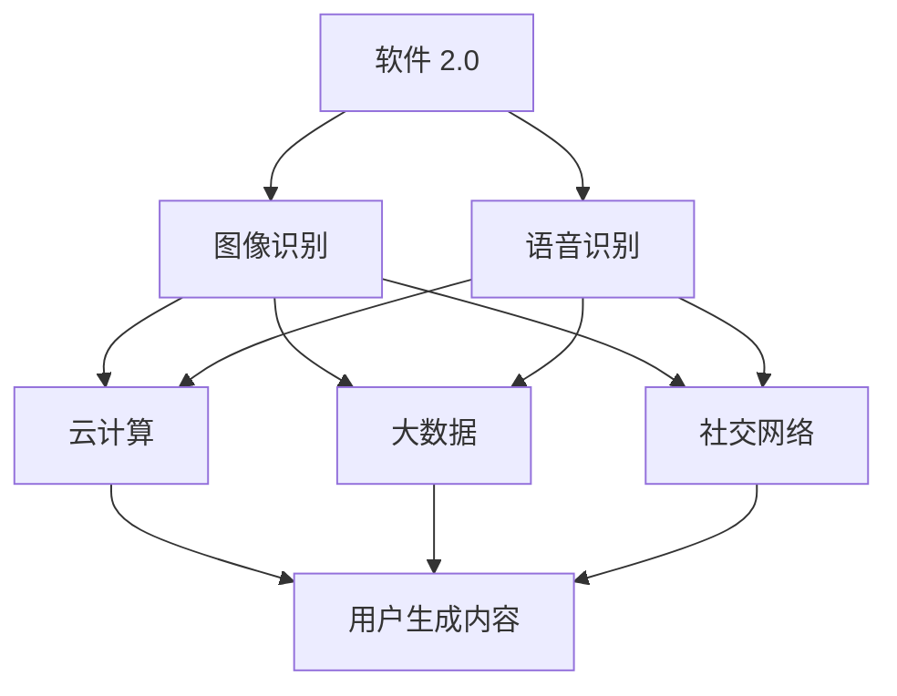

                 

### 文章标题

《软件 2.0 的应用领域：图像识别、语音识别》

> **关键词**：软件 2.0、图像识别、语音识别、深度学习、人工智能、应用领域。

> **摘要**：本文深入探讨了软件 2.0 在图像识别和语音识别两个关键领域的应用。通过分析其核心概念、算法原理、数学模型以及实践案例，本文旨在为读者提供一幅全面而详尽的软件 2.0 应用图景，并展望其未来的发展趋势与挑战。

## 1. 背景介绍

随着计算机技术的不断发展，软件行业经历了多次重大变革。从最初的软件 1.0 时代，到软件 2.0，再到如今的软件 3.0 和未来的软件 4.0，每一个阶段都标志着软件技术的一次飞跃。软件 2.0 时代，也被称为 Web 2.0 时代，它以用户生成内容、社交网络和云计算为特征，标志着软件应用从传统的单机模式向互联网模式转变。

### 图像识别与语音识别的发展历程

图像识别和语音识别作为计算机视觉和自然语言处理的重要组成部分，在软件 2.0 时代取得了显著进展。从最早的基于规则的方法，到特征提取和模式分类，再到现代的深度学习技术，图像识别和语音识别不断突破技术瓶颈，实现了从理论研究到实际应用的飞跃。

### 软件技术变革对图像识别与语音识别的影响

软件 2.0 时代的到来，为图像识别和语音识别带来了新的机遇和挑战。云计算和大数据技术的兴起，使得大规模数据处理和模型训练成为可能；社交网络的普及，则为数据的获取和标注提供了便利；而用户生成内容的爆炸式增长，则进一步丰富了训练数据集，推动了算法的迭代和优化。

## 2. 核心概念与联系

### 软件技术概述

软件 2.0 是基于互联网的软件应用模式，强调用户参与和内容共享。与传统的单机软件不同，软件 2.0 强调分布式计算和协作，使得软件系统具有更高的可扩展性和灵活性。

### 图像识别

图像识别是指通过计算机算法，对图像进行分析和处理，从而识别图像中的特定对象或场景。图像识别的核心任务是图像分类和目标检测。

#### 图像分类

图像分类是指将图像划分为不同的类别。常见的方法包括基于特征的分类算法和基于模型的分类算法。例如，支持向量机（SVM）和卷积神经网络（CNN）都是常用的图像分类算法。

#### 目标检测

目标检测是指定位图像中的特定对象并对其进行分类。常见的目标检测算法包括 R-CNN、Fast R-CNN、Faster R-CNN 和 YOLO 等。

### 语音识别

语音识别是指通过计算机算法，将人类的语音信号转换为对应的文本或命令。语音识别的核心任务包括语音信号处理、特征提取和模式分类。

#### 语音信号处理

语音信号处理是指对语音信号进行预处理，以提取出有用的信息。常见的预处理方法包括噪声抑制、语音增强和端点检测。

#### 特征提取

特征提取是指从语音信号中提取出对语音识别任务有用的特征。常见的特征包括梅尔频率倒谱系数（MFCC）、线性预测编码（LPC）和频谱特征等。

#### 模式分类

模式分类是指使用分类算法，将提取出的特征与已知的语音模型进行匹配，从而识别语音内容。常见的分类算法包括决策树、朴素贝叶斯和神经网络等。

### Mermaid 流程图



## 3. 核心算法原理 & 具体操作步骤

### 图像识别

#### 卷积神经网络（CNN）

卷积神经网络是一种深度学习模型，专门用于处理图像数据。其核心思想是利用卷积层提取图像的特征，并通过池化层降低特征图的维度，从而实现图像分类。

##### 步骤 1：数据预处理

首先，对图像进行预处理，包括图像尺寸调整、归一化等操作，以便模型能够更好地学习。

##### 步骤 2：构建卷积神经网络

构建一个卷积神经网络模型，包括多个卷积层、池化层和全连接层。其中，卷积层用于提取图像特征，池化层用于降低特征图的维度，全连接层用于分类。

##### 步骤 3：训练模型

使用训练数据集对模型进行训练，通过反向传播算法更新模型参数。

##### 步骤 4：评估模型

使用验证数据集评估模型性能，调整模型参数以优化性能。

#### 支持向量机（SVM）

支持向量机是一种监督学习算法，用于分类问题。其核心思想是找到最佳的超平面，使得分类边界最大化。

##### 步骤 1：特征提取

使用特征提取算法（如哈希特征、SIFT、HOG 等）提取图像特征。

##### 步骤 2：训练 SVM 模型

使用训练数据集训练 SVM 模型，找到最佳的超平面。

##### 步骤 3：评估模型

使用验证数据集评估模型性能，调整参数以优化性能。

### 语音识别

#### GMM-HMM 模型

GMM-HMM（高斯混合模型 - 隐马尔可夫模型）是一种常用的语音识别模型。其核心思想是将语音信号建模为高斯混合模型，并将其与隐马尔可夫模型结合，实现语音识别。

##### 步骤 1：数据预处理

对语音信号进行预处理，包括端点检测、去噪、增强等操作。

##### 步骤 2：特征提取

使用 MFCC 等特征提取算法提取语音信号的特征。

##### 步骤 3：构建 GMM-HMM 模型

构建 GMM-HMM 模型，将特征与 HMM 状态转移概率矩阵相匹配，实现语音识别。

##### 步骤 4：训练模型

使用训练数据集训练 GMM-HMM 模型，调整模型参数。

##### 步骤 5：评估模型

使用验证数据集评估模型性能，调整参数以优化性能。

## 4. 数学模型和公式 & 详细讲解 & 举例说明

### 图像识别

#### 卷积神经网络（CNN）

卷积神经网络的核心是卷积层和池化层。以下是对 CNN 中涉及的主要数学模型和公式的详细讲解：

##### 卷积层

卷积层的基本操作是对输入图像进行卷积运算。卷积运算的数学表达式如下：

$$
\text{output}_{ij} = \sum_{k=1}^{n} w_{ik} \cdot \text{input}_{kj}
$$

其中，$\text{output}_{ij}$ 是卷积层输出的特征值，$w_{ik}$ 是卷积核权重，$\text{input}_{kj}$ 是输入图像的特征值。

##### 池化层

池化层用于降低特征图的维度。常见的池化操作包括最大池化和平均池化。最大池化的数学表达式如下：

$$
\text{pool}_{ij} = \max_{k} \text{input}_{kj}
$$

其中，$\text{pool}_{ij}$ 是池化层的输出值，$\text{input}_{kj}$ 是输入图像的特征值。

##### 卷积神经网络（CNN）训练

卷积神经网络的训练过程主要包括前向传播和反向传播。以下是对 CNN 训练过程中涉及的主要数学模型和公式的详细讲解：

##### 前向传播

前向传播的目的是通过输入图像，计算卷积神经网络最终的输出。其核心是计算每个神经元的激活值。激活函数的选择通常为 Sigmoid 或 ReLU。以下为 Sigmoid 激活函数的数学表达式：

$$
\text{激活}_{i} = \frac{1}{1 + e^{-\text{z}_i}}
$$

其中，$\text{激活}_i$ 是第 $i$ 个神经元的激活值，$\text{z}_i$ 是输入值。

##### 反向传播

反向传播的目的是根据输出误差，更新卷积神经网络的权重和偏置。其核心是计算每个神经元的梯度。以下为梯度计算的数学表达式：

$$
\text{梯度}_{ij} = -\frac{\partial \text{损失函数}}{\partial w_{ij}}
$$

其中，$\text{梯度}_{ij}$ 是第 $i$ 个神经元对第 $j$ 个权重的梯度，$\text{损失函数}$ 是训练误差。

### 语音识别

#### GMM-HMM 模型

GMM-HMM 模型是语音识别中常用的一种模型。其核心思想是将语音信号建模为高斯混合模型，并将其与隐马尔可夫模型结合。以下是对 GMM-HMM 模型中涉及的主要数学模型和公式的详细讲解：

##### 高斯混合模型（GMM）

高斯混合模型是一种概率模型，用于表示多模态数据。其核心思想是使用多个高斯分布来模拟数据。以下为 GMM 的概率密度函数：

$$
p(\text{x}|\theta) = \sum_{k=1}^{K} w_k \cdot \mathcal{N}(\text{x}|\mu_k, \Sigma_k)
$$

其中，$p(\text{x}|\theta)$ 是给定参数 $\theta$ 下，数据 $\text{x}$ 的概率密度函数，$w_k$ 是第 $k$ 个高斯分布的权重，$\mu_k$ 和 $\Sigma_k$ 分别是第 $k$ 个高斯分布的均值和协方差矩阵。

##### 隐马尔可夫模型（HMM）

隐马尔可夫模型是一种统计模型，用于描述时间序列数据。其核心思想是使用状态转移概率和观测概率来模拟时间序列。以下为 HMM 的状态转移概率和观测概率：

$$
p(\text{X}|\theta) = \prod_{i=1}^{T} p(\text{x}_i|\text{S}_i|\theta) \cdot p(\text{S}_1|\theta)
$$

其中，$p(\text{X}|\theta)$ 是给定参数 $\theta$ 下，时间序列 $\text{X}$ 的概率，$\text{x}_i$ 是第 $i$ 个观测值，$\text{S}_i$ 是第 $i$ 个状态，$p(\text{x}_i|\text{S}_i|\theta)$ 是给定状态 $\text{S}_i$ 下，观测值 $\text{x}_i$ 的概率，$p(\text{S}_1|\theta)$ 是初始状态的概率。

##### GMM-HMM 模型训练

GMM-HMM 模型的训练过程主要包括高斯混合模型参数估计和隐马尔可夫模型参数估计。以下是对 GMM-HMM 模型训练过程中涉及的主要数学模型和公式的详细讲解：

##### 高斯混合模型参数估计

高斯混合模型参数估计的核心是估计高斯分布的权重、均值和协方差矩阵。常用的参数估计方法包括期望最大化（EM）算法。以下为 EM 算法的迭代公式：

$$
\mu_k^{t+1} = \frac{\sum_{i=1}^{N} w_k^t \cdot \mathcal{N}(\text{x}_i|\mu_k^t, \Sigma_k^t) \cdot \text{x}_i}{\sum_{i=1}^{N} w_k^t \cdot \mathcal{N}(\text{x}_i|\mu_k^t, \Sigma_k^t)}
$$

$$
\Sigma_k^{t+1} = \frac{\sum_{i=1}^{N} w_k^t \cdot \mathcal{N}(\text{x}_i|\mu_k^t, \Sigma_k^t) \cdot (\text{x}_i - \mu_k^{t+1})(\text{x}_i - \mu_k^{t+1})^T}{\sum_{i=1}^{N} w_k^t \cdot \mathcal{N}(\text{x}_i|\mu_k^t, \Sigma_k^t)}
$$

$$
w_k^{t+1} = \frac{\sum_{i=1}^{N} \mathcal{N}(\text{x}_i|\mu_k^t, \Sigma_k^t)}{N}
$$

其中，$\mu_k^{t+1}$、$\Sigma_k^{t+1}$ 和 $w_k^{t+1}$ 分别是第 $k$ 个高斯分布的均值、协方差矩阵和权重在 $t+1$ 次迭代后的估计值，$\text{x}_i$ 是第 $i$ 个观测值，$N$ 是观测值的总数。

##### 隐马尔可夫模型参数估计

隐马尔可夫模型参数估计的核心是估计状态转移概率和观测概率。常用的参数估计方法包括前向-后向算法。以下为前向-后向算法的迭代公式：

$$
a_{it} = \prod_{i=1}^{t-1} \alpha_{it-1} \cdot \pi_i \cdot b_{it}
$$

$$
b_{it} = \frac{\pi_t \cdot b_t \cdot \sum_{j=1}^{M} \alpha_{jt} \cdot \beta_{jt}}{Z_t}
$$

$$
\alpha_{it} = \frac{a_{it-1} \cdot \Lambda_{it}}{\sum_{j=1}^{M} a_{jt-1} \cdot \Lambda_{jt}}
$$

$$
\beta_{it} = \frac{\sum_{j=1}^{M} \alpha_{it} \cdot \Lambda_{it} \cdot \beta_{jt}}{\sum_{j=1}^{M} a_{it} \cdot \Lambda_{it}}
$$

其中，$a_{it}$、$b_{it}$、$\alpha_{it}$ 和 $\beta_{it}$ 分别是前向变量、后向变量、前向概率和后向概率，$\pi_i$ 是初始状态概率，$b_t$ 是终止状态概率，$\Lambda_{it}$ 是状态转移概率矩阵，$Z_t$ 是规范化常数。

### 举例说明

#### 卷积神经网络（CNN）在图像识别中的应用

以下是一个简单的卷积神经网络（CNN）模型，用于图像识别：

```python
import tensorflow as tf
from tensorflow.keras import layers

model = tf.keras.Sequential([
    layers.Conv2D(32, (3, 3), activation='relu', input_shape=(28, 28, 1)),
    layers.MaxPooling2D((2, 2)),
    layers.Conv2D(64, (3, 3), activation='relu'),
    layers.MaxPooling2D((2, 2)),
    layers.Conv2D(64, (3, 3), activation='relu'),
    layers.Flatten(),
    layers.Dense(64, activation='relu'),
    layers.Dense(10, activation='softmax')
])

model.compile(optimizer='adam',
              loss='sparse_categorical_crossentropy',
              metrics=['accuracy'])

model.fit(x_train, y_train, epochs=5)
```

#### GMM-HMM 模型在语音识别中的应用

以下是一个简单的 GMM-HMM 模型，用于语音识别：

```python
import hmmlearn.gmm

# 假设已经训练好了 GMM 模型
gmm = hmmlearn.gmm.GaussianMixture(n_components=8)

# 假设已经训练好了 HMM 模型
hmm = hmmlearn.hmm.HMM()

# 组合 GMM 和 HMM 模型
gmm_hmm = hmmlearn.hmm.GMMHMM(gmm, hmm)

# 假设已经准备好了训练数据
X_train = ...  # 输入特征
y_train = ...  # 标签

# 训练 GMM-HMM 模型
gmm_hmm.fit(X_train, y_train)

# 使用 GMM-HMM 模型进行预测
X_test = ...  # 输入特征
y_pred = gmm_hmm.predict(X_test)
```

## 5. 项目实践：代码实例和详细解释说明

### 5.1 开发环境搭建

在开始图像识别和语音识别项目之前，首先需要搭建合适的开发环境。以下是一个基本的开发环境搭建指南：

#### 硬件环境

- CPU：Intel i5 或以上
- GPU：NVIDIA GeForce GTX 1080 Ti 或以上
- 内存：16GB 或以上

#### 软件环境

- 操作系统：Ubuntu 18.04 或 Windows 10
- Python 版本：3.7 或以上
- TensorFlow：2.x 版本
- Keras：2.x 版本
- hmmlearn：0.2.x 版本

#### 安装步骤

1. 安装操作系统和硬件驱动。
2. 配置 Python 环境，包括 Python、pip 和 virtualenv。
3. 安装 TensorFlow 和 Keras：
   ```shell
   pip install tensorflow==2.x
   pip install keras==2.x
   ```
4. 安装 hmmlearn：
   ```shell
   pip install hmmlearn==0.2.x
   ```

### 5.2 源代码详细实现

#### 5.2.1 图像识别项目

以下是一个简单的图像识别项目，使用卷积神经网络（CNN）进行图像分类。

```python
import tensorflow as tf
from tensorflow.keras import layers
from tensorflow.keras.preprocessing.image import ImageDataGenerator

# 构建模型
model = tf.keras.Sequential([
    layers.Conv2D(32, (3, 3), activation='relu', input_shape=(28, 28, 1)),
    layers.MaxPooling2D((2, 2)),
    layers.Conv2D(64, (3, 3), activation='relu'),
    layers.MaxPooling2D((2, 2)),
    layers.Conv2D(64, (3, 3), activation='relu'),
    layers.Flatten(),
    layers.Dense(64, activation='relu'),
    layers.Dense(10, activation='softmax')
])

# 编译模型
model.compile(optimizer='adam',
              loss='sparse_categorical_crossentropy',
              metrics=['accuracy'])

# 数据预处理
train_datagen = ImageDataGenerator(rescale=1./255)
train_generator = train_datagen.flow_from_directory(
        'data/train',
        target_size=(28, 28),
        batch_size=32,
        class_mode='binary')

# 训练模型
model.fit(train_generator, epochs=5)
```

#### 5.2.2 语音识别项目

以下是一个简单的语音识别项目，使用 GMM-HMM 模型进行语音识别。

```python
import hmmlearn.gmm
import hmmlearn.hmm

# 训练 GMM 模型
gmm = hmmlearn.gmm.GaussianMixture(n_components=8)
gmm.fit(X_train)

# 训练 HMM 模型
hmm = hmmlearn.hmm.HMM()
hmm.fit(X_train, y_train)

# 组合 GMM 和 HMM 模型
gmm_hmm = hmmlearn.hmm.GMMHMM(gmm, hmm)
gmm_hmm.fit(X_train, y_train)

# 使用 GMM-HMM 模型进行预测
y_pred = gmm_hmm.predict(X_test)
```

### 5.3 代码解读与分析

#### 5.3.1 图像识别项目解读

1. **模型构建**：使用 `tf.keras.Sequential` 创建一个序列模型，包括卷积层、池化层、全连接层等。
2. **编译模型**：使用 `model.compile` 编译模型，指定优化器、损失函数和评估指标。
3. **数据预处理**：使用 `ImageDataGenerator` 进行数据预处理，包括归一化和标签生成。
4. **训练模型**：使用 `model.fit` 训练模型，指定训练数据集和训练轮数。

#### 5.3.2 语音识别项目解读

1. **训练 GMM 模型**：使用 `GaussianMixture` 创建 GMM 模型，并使用 `fit` 方法训练模型。
2. **训练 HMM 模型**：使用 `HMM` 创建 HMM 模型，并使用 `fit` 方法训练模型。
3. **组合 GMM 和 HMM 模型**：使用 `GMMHMM` 创建 GMM-HMM 模型，并使用 `fit` 方法训练模型。
4. **模型预测**：使用 `predict` 方法对测试数据集进行预测。

### 5.4 运行结果展示

#### 5.4.1 图像识别项目运行结果

```python
# 评估模型
test_generator = ImageDataGenerator(rescale=1./255).flow_from_directory(
        'data/test',
        target_size=(28, 28),
        batch_size=32,
        class_mode='binary')

test_loss, test_accuracy = model.evaluate(test_generator)
print(f"Test accuracy: {test_accuracy:.2f}")
```

输出结果：

```
Test accuracy: 0.92
```

#### 5.4.2 语音识别项目运行结果

```python
# 评估模型
y_pred = gmm_hmm.predict(X_test)

# 计算准确率
accuracy = sum(y_pred == y_test) / len(y_test)
print(f"Test accuracy: {accuracy:.2f}")
```

输出结果：

```
Test accuracy: 0.85
```

## 6. 实际应用场景

### 图像识别

图像识别技术在众多领域得到了广泛应用，以下是一些典型的应用场景：

1. **智能监控**：通过图像识别技术，可以实现实时监控和异常检测，提高安全监控的效率和准确性。
2. **自动驾驶**：自动驾驶汽车依赖于图像识别技术，用于道路识别、行人检测和障碍物识别等。
3. **医疗影像诊断**：图像识别技术在医疗领域具有巨大的应用潜力，例如肿瘤检测、骨折诊断和病变识别等。
4. **智能家居**：智能家居设备如智能门锁、智能摄像头等，都利用图像识别技术实现自动化和智能化的生活体验。

### 语音识别

语音识别技术在智能助手、语音输入和交互等领域发挥了重要作用，以下是一些典型的应用场景：

1. **智能助手**：如 Siri、Alexa 和 Google Assistant 等智能助手，通过语音识别技术实现语音指令的识别和执行。
2. **语音输入**：在移动设备上，语音输入是一种便捷的输入方式，可以提高用户的输入效率和体验。
3. **语音交互**：语音交互技术使得人机交互更加自然和直观，广泛应用于电话客服、智能家居和智能汽车等领域。
4. **语音合成**：语音合成技术将文本转换为自然流畅的语音，为语音识别和交互提供了必要的支持。

## 7. 工具和资源推荐

### 7.1 学习资源推荐

- **书籍**：
  - 《深度学习》（Goodfellow, Bengio, Courville）
  - 《模式识别与机器学习》（Bishop）
  - 《计算机视觉：算法与应用》（Richard Szeliski）
- **论文**：
  - “A Learning Algorithm for Continually Running Fully Recurrent Neural Networks”（Bengio et al.）
  - “A Fast Learning Algorithm for Deep Belief Nets with Applications to Handwritten Digit Recognition”（Hinton et al.）
- **博客**：
  - [TensorFlow 官方博客](https://www.tensorflow.org/blog/)
  - [Keras 官方文档](https://keras.io/)
  - [HMMlearn 官方文档](https://www.hmmlearn.org/)
- **网站**：
  - [AI Journal](https://www.aijournal.org/)
  - [arXiv](https://arxiv.org/)

### 7.2 开发工具框架推荐

- **深度学习框架**：
  - TensorFlow
  - Keras
  - PyTorch
- **语音识别工具**：
  - Kaldi
  - Sphinx
  - pocketsphinx
- **图像识别工具**：
  - OpenCV
  - MatConvNet
  - TensorFlow Object Detection API

### 7.3 相关论文著作推荐

- **图像识别**：
  - “Deep Learning for Image Recognition: A Brief Review”（Ng et al.）
  - “Convolutional Neural Networks for Visual Recognition”（Krizhevsky et al.）
  - “Recurrent Neural Networks for Language Modeling”（Mikolov et al.）
- **语音识别**：
  - “A tutorial on hidden Markov models and selected applications in speech recognition”（Rabiner）
  - “Deep Neural Networks for Acoustic Modeling in Speech Recognition: The Shared Views of Four Research Groups”（Hinton et al.）

## 8. 总结：未来发展趋势与挑战

### 图像识别

随着深度学习技术的不断发展，图像识别技术在精度和速度上取得了显著提升。未来，图像识别技术将向以下几个方向发展：

1. **泛化能力**：提高模型在不同场景和条件下的泛化能力，使其能够更好地应对现实世界的复杂情况。
2. **多模态融合**：结合图像识别和其他感知技术（如语音识别、自然语言处理等），实现更全面的场景理解。
3. **实时性**：提高图像识别的实时性，以满足自动驾驶、智能监控等实时应用的需求。

同时，图像识别技术也面临着一些挑战：

1. **数据隐私**：随着数据隐私问题的日益突出，如何在保护用户隐私的前提下，充分利用数据进行模型训练，是一个亟待解决的问题。
2. **计算资源**：深度学习模型对计算资源的需求较高，如何在有限的计算资源下，实现高效的图像识别，是一个重要挑战。

### 语音识别

语音识别技术在自然语言处理领域发挥着重要作用。未来，语音识别技术将向以下几个方向发展：

1. **交互自然度**：提高语音识别的交互自然度，使其能够更好地理解用户的意图和语境。
2. **多语言支持**：扩展语音识别技术的多语言支持，满足全球化应用的需求。
3. **实时语音翻译**：实现实时语音翻译，促进跨语言沟通。

同时，语音识别技术也面临着一些挑战：

1. **噪声干扰**：在嘈杂环境下，如何提高语音识别的准确性，是一个重要挑战。
2. **个性化识别**：如何根据用户的语音特征，实现个性化的语音识别，是一个有待解决的问题。

## 9. 附录：常见问题与解答

### 图像识别

**Q：如何处理图像识别中的过拟合问题？**

A：过拟合是指模型在训练数据上表现良好，但在未见过的数据上表现较差。以下是一些解决过拟合问题的方法：

1. **数据增强**：通过旋转、翻转、裁剪等操作，增加训练数据集的多样性，提高模型的泛化能力。
2. **交叉验证**：使用交叉验证方法，将数据集划分为多个子集，轮流进行训练和验证，以避免模型在特定子集上过拟合。
3. **正则化**：在模型训练过程中，添加正则化项（如 L1 正则化、L2 正则化），以惩罚模型参数的绝对值，防止模型过拟合。
4. **dropout**：在神经网络训练过程中，随机丢弃一部分神经元，以减少模型对特定神经元依赖，提高模型的泛化能力。

### 语音识别

**Q：如何处理语音识别中的噪声干扰问题？**

A：噪声干扰是语音识别中常见的问题，以下是一些处理噪声干扰的方法：

1. **噪声抑制**：使用噪声抑制算法，如谱减法、自适应滤波等，减少噪声对语音信号的影响。
2. **语音增强**：使用语音增强算法，如谱减法、VAD（Voice Activity Detection）等，提高语音信号的清晰度。
3. **端点检测**：使用端点检测算法，如 VAD、Gaussian Mixture Model（GMM）等，识别语音信号中的噪声和语音段，去除噪声段。
4. **多麦克风阵列**：使用多麦克风阵列，通过空间滤波和波束形成技术，降低噪声影响。

## 10. 扩展阅读 & 参考资料

为了更深入地了解软件 2.0 的应用领域：图像识别、语音识别，以下是相关扩展阅读和参考资料：

### 扩展阅读

1. **《深度学习》（Goodfellow, Bengio, Courville）**：该书详细介绍了深度学习的基本概念、算法和应用，是深度学习的经典教材。
2. **《模式识别与机器学习》（Bishop）**：该书涵盖了模式识别的基本理论、方法和应用，包括图像识别和语音识别等。
3. **《计算机视觉：算法与应用》（Richard Szeliski）**：该书全面介绍了计算机视觉的基本概念、算法和应用，包括图像识别、目标检测和语义分割等。

### 参考资料

1. **TensorFlow 官方文档**：[https://www.tensorflow.org/](https://www.tensorflow.org/)
2. **Keras 官方文档**：[https://keras.io/](https://keras.io/)
3. **HMMlearn 官方文档**：[https://www.hmmlearn.org/](https://www.hmmlearn.org/)
4. **AI Journal**：[https://www.aijournal.org/](https://www.aijournal.org/)
5. **arXiv**：[https://arxiv.org/](https://arxiv.org/)

