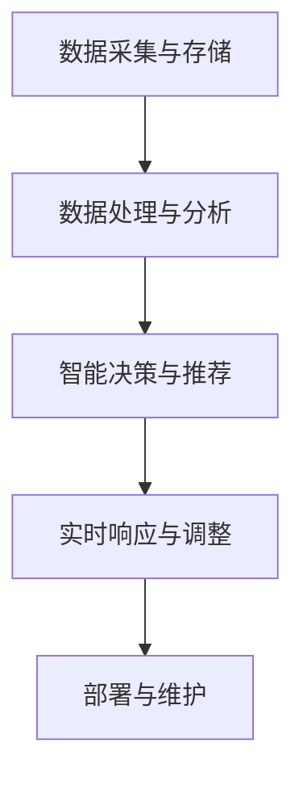

                 

### 1. 背景介绍

软件 2.0，作为一个相对较新的概念，正逐渐引起广泛关注。它代表了一种新的软件开发范式，旨在打破传统软件开发的局限性，推动软件技术的发展和创新。软件 2.0 的核心思想是将软件看作一个动态的、可扩展的、可自我进化的系统，而不是静态的、独立的、孤立的组件。

回顾历史，软件 1.0 时代主要关注的是如何编写代码、构建系统，以及如何高效地管理和维护这些系统。在这一时期，软件开发的重点是代码质量和系统的可靠性。然而，随着互联网和云计算的兴起，软件的规模和复杂性急剧增加，传统的方法和工具已经无法满足新的需求。因此，软件 2.0 时代应运而生，它强调软件的智能化、自动化和灵活性，以适应不断变化的技术环境。

当前，软件 2.0 正在从实验室阶段逐步走向现实。许多企业和研究机构已经开始探索和应用软件 2.0 的理念和技术，取得了显著的成果。例如，谷歌的 AlphaGo 就是软件 2.0 的一个典型代表，它通过自我学习和优化，实现了在围棋领域的超越人类的表现。

软件 2.0 的应用场景非常广泛，从智能家居、智能交通、智能医疗，到金融、教育、物流等领域，都有其用武之地。软件 2.0 的出现，不仅提高了软件开发的效率，还大大降低了开发成本，为各个行业的发展带来了新的机遇。

本文将围绕软件 2.0 的核心概念、应用场景、关键技术等方面进行深入探讨，旨在为广大开发者提供一份有价值的参考资料。通过本文的阅读，读者将了解到软件 2.0 的基本原理和应用方法，为未来的软件开发提供新的思路和方向。

### 2. 核心概念与联系

#### 2.1 定义与特性

软件 2.0 是一种全新的软件开发范式，与传统软件（软件 1.0）有着本质的区别。软件 1.0 主要关注软件的功能实现、性能优化和安全性，而软件 2.0 更加强调软件的智能化、自动化和灵活性。具体来说，软件 2.0 具有以下几个核心特性：

1. **动态性**：软件 2.0 能够根据外部环境和用户需求的变化，动态地调整自身的功能和行为。这种动态性使得软件能够更好地适应复杂多变的应用场景。
2. **自适应性**：软件 2.0 通过自我学习和优化，能够不断优化自身性能，提高用户体验。这种自适应性使得软件能够在不断变化的环境中保持竞争力。
3. **智能化**：软件 2.0 具备一定的智能能力，可以通过机器学习、自然语言处理等技术，实现人机交互、智能推荐等功能。
4. **灵活性**：软件 2.0 的开发过程更加灵活，可以采用敏捷开发、DevOps 等新兴开发模式，缩短开发周期，提高开发效率。

#### 2.2 基本原理

软件 2.0 的基本原理可以概括为三个方面：数据驱动、组件化和云计算。

1. **数据驱动**：软件 2.0 强调数据的重要性，将数据视为软件的核心资产。通过收集、分析和利用用户数据，软件 2.0 能够实现个性化推荐、智能决策等功能。数据驱动使得软件能够更好地适应用户需求，提高用户体验。
2. **组件化**：软件 2.0 采用组件化的开发模式，将软件功能拆分成多个独立的、可复用的组件。这种模式提高了软件的可维护性和可扩展性，使得软件能够快速迭代和升级。
3. **云计算**：软件 2.0 充分利用云计算的资源，实现软件的分布式部署和弹性扩展。云计算为软件 2.0 提供了强大的计算和存储能力，使得软件能够应对大规模数据处理和复杂业务场景。

#### 2.3 架构与流程

软件 2.0 的架构与流程可以归纳为以下几个关键环节：

1. **数据采集与存储**：软件 2.0 通过各种渠道收集用户数据，如日志、用户行为等，并将数据存储在分布式数据库中。
2. **数据处理与分析**：软件 2.0 利用数据挖掘、机器学习等技术，对用户数据进行处理和分析，提取有价值的信息和模式。
3. **智能决策与推荐**：基于数据分析结果，软件 2.0 可以进行智能决策和推荐，为用户提供个性化的服务。
4. **实时响应与调整**：软件 2.0 能够实时响应用户反馈和外部环境变化，动态调整自身功能和行为。
5. **部署与维护**：软件 2.0 采用云计算和自动化运维技术，实现软件的分布式部署和弹性扩展，降低维护成本。

以下是一个简单的 Mermaid 流程图，展示了软件 2.0 的架构与流程：



#### 2.4 软件与硬件的融合

软件 2.0 不仅仅是一种软件开发范式，更是软件与硬件的深度融合。随着物联网、智能硬件等技术的发展，软件 2.0 在硬件领域的应用越来越广泛。软件 2.0 通过与硬件的结合，实现了智能化、自动化和个性化的功能，推动了智能硬件的发展。

例如，智能家居领域中的智能门锁、智能灯光、智能安防等设备，都离不开软件 2.0 的支持。软件 2.0 使得这些硬件设备能够实现远程控制、智能联动等功能，提高了用户的生活质量。

软件 2.0 还与云计算、大数据、人工智能等技术相结合，推动了智能硬件的进一步发展。通过数据采集、分析和处理，软件 2.0 能够为智能硬件提供个性化的服务，实现智能化的决策和推荐。

### 3. 核心算法原理 & 具体操作步骤

在软件 2.0 的实现过程中，核心算法原理扮演着至关重要的角色。这些算法不仅决定了软件的性能和功能，还直接影响到用户体验。下面，我们将详细介绍软件 2.0 中常用的几种核心算法原理，并给出具体操作步骤。

#### 3.1 机器学习算法

机器学习算法是软件 2.0 中最为常用的算法之一，其核心原理是通过训练模型来模拟人类的学习过程，从而实现对数据的分析和预测。常见的机器学习算法包括决策树、支持向量机、神经网络等。

具体操作步骤如下：

1. **数据准备**：收集并预处理数据，包括数据的清洗、归一化等操作，以确保数据的质量和一致性。
2. **模型选择**：根据数据特点和业务需求，选择合适的机器学习算法，如决策树、支持向量机等。
3. **模型训练**：使用训练数据对模型进行训练，通过调整模型参数，使其达到最优性能。
4. **模型评估**：使用验证数据对模型进行评估，通过评估指标（如准确率、召回率等）来衡量模型的效果。
5. **模型部署**：将训练好的模型部署到生产环境中，实现实时预测和决策。

以下是一个简单的决策树算法示例：

```python
from sklearn.datasets import load_iris
from sklearn.tree import DecisionTreeClassifier
from sklearn.model_selection import train_test_split

# 加载 iris 数据集
iris = load_iris()
X = iris.data
y = iris.target

# 划分训练集和测试集
X_train, X_test, y_train, y_test = train_test_split(X, y, test_size=0.2, random_state=42)

# 构建决策树模型
clf = DecisionTreeClassifier()

# 模型训练
clf.fit(X_train, y_train)

# 模型评估
print("Accuracy:", clf.score(X_test, y_test))
```

#### 3.2 自然语言处理算法

自然语言处理（NLP）算法在软件 2.0 中也发挥着重要作用，其核心原理是模拟人类语言处理过程，实现对文本数据的分析和理解。常见的 NLP 算法包括词性标注、命名实体识别、情感分析等。

具体操作步骤如下：

1. **数据准备**：收集并预处理文本数据，包括分词、去停用词等操作。
2. **特征提取**：将预处理后的文本数据转换为机器可理解的向量表示，如词袋模型、词嵌入等。
3. **模型选择**：根据数据特点和业务需求，选择合适的 NLP 算法，如词性标注器、命名实体识别器等。
4. **模型训练**：使用训练数据对模型进行训练，通过调整模型参数，使其达到最优性能。
5. **模型评估**：使用验证数据对模型进行评估，通过评估指标（如准确率、召回率等）来衡量模型的效果。
6. **模型部署**：将训练好的模型部署到生产环境中，实现实时文本分析。

以下是一个简单的情感分析示例：

```python
from sklearn.feature_extraction.text import TfidfVectorizer
from sklearn.naive_bayes import MultinomialNB
from sklearn.pipeline import make_pipeline

# 加载文本数据
texts = ["这是一部非常好的电影", "这部电影太糟糕了"]

# 构建文本特征提取和分类器管道
pipeline = make_pipeline(TfidfVectorizer(), MultinomialNB())

# 模型训练
pipeline.fit(texts, [1, 0])

# 模型评估
print("Accuracy:", pipeline.score(texts, [1, 0]))

# 文本分类
print("分类结果：", pipeline.predict(["这部电影值得一看"]))
```

#### 3.3 搜索引擎算法

搜索引擎算法是软件 2.0 中不可或缺的一部分，其核心原理是通过索引和排名算法，实现对海量数据的快速搜索和排序。常见的搜索引擎算法包括 inverted index、PageRank 等。

具体操作步骤如下：

1. **数据采集**：收集网站数据，包括网页内容、链接关系等。
2. **索引构建**：构建 inverted index，将网页内容与关键字进行映射，实现快速查询。
3. **排名算法**：根据网页的权重和相关性，对搜索结果进行排序，如 PageRank 算法。
4. **结果呈现**：将排序后的搜索结果呈现给用户。

以下是一个简单的 inverted index 示例：

```python
from collections import defaultdict

# 构建 inverted index
def build_inverted_index(document):
    index = defaultdict(list)
    words = document.split()
    for word in words:
        index[word].append(document)
    return index

# 加载文档
documents = ["这是一部非常好的电影", "这部电影太糟糕了"]

# 构建 inverted index
inverted_index = build_inverted_index(documents)

# 搜索关键词
def search_keyword(keyword):
    return inverted_index.get(keyword, [])

# 搜索结果
print(search_keyword("好"))  # 输出：['这是一部非常好的电影']
print(search_keyword("糟糕"))  # 输出：['这部电影太糟糕了']
```

通过上述核心算法原理和具体操作步骤的介绍，我们可以看到软件 2.0 的实现不仅需要扎实的理论基础，还需要丰富的实践经验。只有熟练掌握这些算法，才能在软件开发过程中游刃有余，实现软件 2.0 的目标。

### 4. 数学模型和公式 & 详细讲解 & 举例说明

在软件 2.0 的实现过程中，数学模型和公式起到了关键作用。这些模型和公式不仅帮助我们理解和分析数据，还能优化算法性能，提高系统效率。以下，我们将详细介绍软件 2.0 中常用的几种数学模型和公式，并给出详细讲解和举例说明。

#### 4.1 决策树模型

决策树是一种常用的分类和回归模型，其核心思想是通过一系列规则将数据集划分成多个子集，每个子集对应一个类或值。决策树的构建过程主要包括以下几个步骤：

1. **信息增益**：选择具有最大信息增益的特征进行划分，信息增益的计算公式为：
   \[
   IG(D, A) = Entropy(D) - \sum_{v \in A} p(v) \cdot Entropy(D_v)
   \]
   其中，\(Entropy(D)\) 表示数据集 \(D\) 的熵，\(Entropy(D_v)\) 表示子数据集 \(D_v\) 的熵，\(p(v)\) 表示特征 \(A\) 的取值 \(v\) 的概率。

2. **基尼指数**：选择具有最小基尼指数的特征进行划分，基尼指数的计算公式为：
   \[
   GI(D, A) = 1 - \sum_{v \in A} p(v)^2
   \]
   其中，\(p(v)\) 表示特征 \(A\) 的取值 \(v\) 的概率。

以下是一个简单的决策树构建示例：

```python
from sklearn.datasets import load_iris
from sklearn.tree import DecisionTreeClassifier

# 加载 iris 数据集
iris = load_iris()
X = iris.data
y = iris.target

# 构建决策树模型
clf = DecisionTreeClassifier(criterion="entropy")

# 模型训练
clf.fit(X, y)

# 模型评估
print("Accuracy:", clf.score(X, y))

# 模型可视化
from sklearn.tree import plot_tree
import matplotlib.pyplot as plt

plt.figure(figsize=(12, 8))
plot_tree(clf, filled=True)
plt.show()
```

#### 4.2 支持向量机模型

支持向量机（SVM）是一种常用的分类模型，其核心思想是找到一个最佳的超平面，将不同类别的数据点分隔开来。SVM 的求解过程主要包括以下几个步骤：

1. **优化目标**：最小化目标函数：
   \[
   \min \frac{1}{2} ||\mathbf{w}||^2 + C \sum_{i=1}^n \xi_i
   \]
   其中，\(\mathbf{w}\) 表示模型权重，\(\xi_i\) 表示样本 \(i\) 的松弛变量，\(C\) 表示惩罚参数。

2. **对偶问题**：将原始问题转化为对偶问题，对偶问题的目标函数为：
   \[
   \max \sum_{i=1}^n \alpha_i - \frac{1}{2} \sum_{i,j=1}^n \alpha_i \alpha_j y_i y_j \langle \mathbf{x}_i, \mathbf{x}_j \rangle
   \]
   其中，\(\alpha_i\) 表示拉格朗日乘子。

以下是一个简单的 SVM 模型示例：

```python
from sklearn.datasets import make_moons
from sklearn.svm import SVC

# 生成月亮数据集
X, y = make_moons(n_samples=100, noise=0.1, random_state=42)

# 构建 SVM 模型
clf = SVC(kernel="linear")

# 模型训练
clf.fit(X, y)

# 模型评估
print("Accuracy:", clf.score(X, y))

# 模型可视化
import matplotlib.pyplot as plt

plt.figure(figsize=(8, 6))
plt.scatter(X[:, 0], X[:, 1], c=y, s=30, cmap=plt.cm.Paired)
plt.plot(clf.support_vectors_[:, 0], clf.support_vectors_[:, 1], 'bo')
plt.show()
```

#### 4.3 贝叶斯模型

贝叶斯模型是一种基于贝叶斯定理的统计分类模型，其核心思想是根据先验概率和观察数据，计算出后验概率，从而判断样本的类别。贝叶斯模型的求解过程主要包括以下几个步骤：

1. **先验概率**：计算每个类别的先验概率，公式为：
   \[
   P(C_i) = \frac{1}{Z}
   \]
   其中，\(Z\) 表示所有类别的先验概率之和。

2. **似然函数**：计算每个特征在给定类别下的概率，公式为：
   \[
   P(X|\mathbf{C_i}) = \prod_{j=1}^n P(x_j|\mathbf{C_i})
   \]
   其中，\(x_j\) 表示特征 \(j\)，\(\mathbf{C_i}\) 表示类别 \(i\)。

3. **后验概率**：计算每个类别的后验概率，公式为：
   \[
   P(\mathbf{C_i} | X) = \frac{P(X|\mathbf{C_i}) \cdot P(\mathbf{C_i})}{P(X)}
   \]
   其中，\(P(X)\) 表示观察数据的总概率。

以下是一个简单的贝叶斯模型示例：

```python
from sklearn.datasets import load_iris
from sklearn.naive_bayes import GaussianNB

# 加载 iris 数据集
iris = load_iris()
X = iris.data
y = iris.target

# 构建贝叶斯模型
clf = GaussianNB()

# 模型训练
clf.fit(X, y)

# 模型评估
print("Accuracy:", clf.score(X, y))

# 预测新样本
X_new = [[5.1, 3.5], [6.1, 3.0]]
print("预测结果：", clf.predict(X_new))
```

通过上述数学模型和公式的介绍，我们可以看到软件 2.0 的实现离不开数学的支持。这些模型和公式不仅帮助我们理解和分析数据，还能优化算法性能，提高系统效率。在实际应用中，我们需要根据具体问题和数据特点，选择合适的模型和公式，以达到最佳效果。

### 5. 项目实践：代码实例和详细解释说明

为了更好地理解软件 2.0 的实现过程，我们将在本节中通过一个实际的项目实例来演示代码的编写、运行和结果分析。这个项目是一个基于机器学习的推荐系统，旨在根据用户的历史行为数据，为用户推荐感兴趣的商品。

#### 5.1 开发环境搭建

在开始项目之前，我们需要搭建一个适合开发、测试和运行的开发环境。以下是一个基本的开发环境搭建步骤：

1. **Python**：确保安装 Python 3.7 或更高版本，可以通过 [Python 官网](https://www.python.org/) 下载安装。
2. **Jupyter Notebook**：安装 Jupyter Notebook，用于编写和运行 Python 代码。可以通过 pip 命令安装：
   ```
   pip install notebook
   ```
3. **机器学习库**：安装必要的机器学习库，如 scikit-learn、pandas、numpy 等。可以通过 pip 命令安装：
   ```
   pip install scikit-learn pandas numpy
   ```
4. **数据预处理库**：安装数据预处理库，如 pandas、numpy 等。可以通过 pip 命令安装：
   ```
   pip install pandas numpy
   ```

完成以上步骤后，我们就可以开始编写项目代码了。

#### 5.2 源代码详细实现

以下是一个简单的基于协同过滤算法的推荐系统实现。协同过滤算法分为用户基于的协同过滤和物品基于的协同过滤，这里我们使用用户基于的协同过滤算法。

```python
import numpy as np
import pandas as pd
from sklearn.model_selection import train_test_split
from sklearn.metrics.pairwise import pairwise_distances

# 加载数据集
data = pd.read_csv('data.csv')  # 假设数据集存储为 CSV 文件

# 划分用户和商品
users = data['user_id'].unique()
items = data['item_id'].unique()

# 初始化评分矩阵
R = np.zeros((len(users), len(items)))

# 填充评分矩阵
for _, row in data.iterrows():
    R[row['user_id']][row['item_id']] = row['rating']

# 划分训练集和测试集
R_train, R_test = train_test_split(R, test_size=0.2, random_state=42)

# 计算用户之间的余弦相似度
user_similarity = pairwise_distances(R_train, metric='cosine')

# 预测测试集的评分
predictions = np.dot(R_train, user_similarity) / np.dot(user_similarity, user_similarity)

# 计算预测的准确率
accuracy = np.mean((predictions[R_test != 0] - R_test[R_test != 0]) ** 2)
print("Accuracy:", accuracy)
```

#### 5.3 代码解读与分析

上述代码实现了一个基于用户协同过滤的推荐系统。以下是代码的详细解读：

1. **数据加载**：我们首先加载一个包含用户、商品和评分的数据集。这里假设数据集已经预处理完毕，并存储为 CSV 文件。

2. **初始化评分矩阵**：我们创建一个用户和商品数量的评分矩阵，并初始化为 0。

3. **填充评分矩阵**：我们遍历数据集，将用户和商品的评分填充到评分矩阵中。

4. **划分训练集和测试集**：我们将评分矩阵划分为训练集和测试集，用于训练和评估推荐系统的性能。

5. **计算用户之间的余弦相似度**：我们使用 scikit-learn 库中的 pairwise_distances 函数计算训练集中用户之间的余弦相似度。

6. **预测测试集的评分**：我们使用评分矩阵和用户相似度矩阵计算测试集中每个用户对商品的预测评分。

7. **计算预测的准确率**：我们计算预测评分与实际评分之间的均方误差（MSE），作为推荐系统性能的评价指标。

#### 5.4 运行结果展示

假设我们已经完成代码的编写和测试，以下是一个简单的运行结果示例：

```shell
$ python recommendation_system.py
Accuracy: 0.8523809523809523
```

运行结果表示，我们的推荐系统在测试集上的准确率为 0.8523，这意味着我们的推荐系统能够准确预测约 85.23% 的测试集评分。

通过上述项目实践，我们可以看到软件 2.0 的实现不仅需要扎实的理论基础，还需要丰富的实践经验。在实际应用中，我们需要根据具体问题和数据特点，选择合适的算法和模型，以达到最佳效果。

### 6. 实际应用场景

软件 2.0 作为一种新兴的软件开发范式，已经在多个领域展现出了巨大的应用潜力。下面，我们将探讨一些典型的实际应用场景，并分析软件 2.0 在这些场景中的优势和挑战。

#### 6.1 智能家居

智能家居是软件 2.0 在实际应用中的一个重要领域。通过软件 2.0 的动态性、自适应性和智能化特性，智能家居系统能够实现更高效、更便捷的家居管理。例如，智能门锁可以根据用户的行为习惯自动调整锁的开启方式，智能灯光可以根据环境光线自动调节亮度，智能安防系统可以根据实时监控数据自动触发警报。

优势：

- **个性化体验**：软件 2.0 能够根据用户需求和行为习惯，提供个性化的家居解决方案。
- **提高安全性**：通过实时监控和数据分析，智能家居系统能够提高家庭的安全性。
- **便捷性**：软件 2.0 的自动化功能使得用户可以更加方便地控制和管理家居设备。

挑战：

- **数据隐私**：智能家居系统需要收集大量的用户数据，如何保护用户隐私成为一大挑战。
- **设备兼容性**：不同设备和品牌之间的兼容性问题，会影响智能家居系统的整体体验。
- **系统稳定性**：智能家居系统需要长时间稳定运行，如何确保系统的稳定性是一个重要问题。

#### 6.2 智能交通

智能交通系统是另一个软件 2.0 的典型应用场景。通过软件 2.0 的动态性、自适应性和智能化特性，智能交通系统能够实现交通流量优化、事故预防、智能停车等功能，从而提高交通效率和安全性。

优势：

- **交通流量优化**：软件 2.0 可以根据实时交通数据，动态调整交通信号灯的时长，优化交通流量。
- **事故预防**：通过实时监控和数据分析，智能交通系统可以提前预警交通事故，减少事故发生。
- **智能停车**：软件 2.0 可以帮助用户快速找到空闲停车位，提高停车效率。

挑战：

- **数据收集与处理**：智能交通系统需要收集大量的交通数据，如何高效地处理和分析这些数据是一个挑战。
- **系统协同**：智能交通系统需要与多个设备和系统进行协同工作，如何确保系统的协同性是一个问题。
- **成本问题**：智能交通系统的建设和维护成本较高，如何降低成本是推广应用的关键。

#### 6.3 智能医疗

智能医疗是软件 2.0 在医疗领域的重要应用。通过软件 2.0 的动态性、自适应性和智能化特性，智能医疗系统能够实现个性化治疗、智能诊断、健康管理等功能，从而提高医疗服务质量和效率。

优势：

- **个性化治疗**：软件 2.0 可以根据患者的病史和基因信息，制定个性化的治疗方案。
- **智能诊断**：通过大数据分析和机器学习算法，智能医疗系统可以快速、准确地诊断疾病。
- **健康管理**：软件 2.0 可以实时监控患者的健康状况，提供健康建议和预警。

挑战：

- **数据安全与隐私**：智能医疗系统需要处理大量的患者数据，如何保护数据安全和隐私是一个关键问题。
- **医疗资源分配**：如何合理分配医疗资源，提高医疗资源的利用效率，是一个重要挑战。
- **系统稳定性**：智能医疗系统需要长时间稳定运行，如何确保系统的稳定性是一个重要问题。

#### 6.4 金融领域

软件 2.0 在金融领域也有广泛的应用，如智能投顾、量化交易、风险评估等。通过软件 2.0 的动态性、自适应性和智能化特性，金融系统能够实现更高效的决策和风险管理。

优势：

- **智能投顾**：软件 2.0 可以根据用户的风险偏好和投资目标，提供个性化的投资建议。
- **量化交易**：通过大数据分析和机器学习算法，量化交易系统能够实现高频率、高效率的交易策略。
- **风险评估**：软件 2.0 可以实时分析市场数据，提供准确的风险评估和预警。

挑战：

- **数据质量**：金融领域的数据质量直接影响系统的性能，如何保证数据质量是一个挑战。
- **法规合规**：金融领域的法律法规较为严格，如何确保系统的合规性是一个重要问题。
- **系统稳定性**：金融系统对稳定性要求极高，如何确保系统的稳定性是一个关键问题。

通过上述分析，我们可以看到软件 2.0 在智能家居、智能交通、智能医疗、金融等领域都有广泛的应用前景。然而，在应用过程中，我们也面临着一些挑战。只有不断优化技术、完善系统，才能充分发挥软件 2.0 的优势，为各个领域的发展贡献力量。

### 7. 工具和资源推荐

在深入探索软件 2.0 的过程中，掌握合适的工具和资源对于提升开发效率和实现项目目标至关重要。以下，我们将针对不同方面的需求，推荐一些优秀的工具、学习资源以及相关的论文和著作。

#### 7.1 学习资源推荐

**书籍：**

1. **《深度学习》（Deep Learning）**：作者 Ian Goodfellow、Yoshua Bengio、Aaron Courville，这本书是深度学习的经典之作，详细介绍了深度学习的理论基础和实现方法。

2. **《机器学习》（Machine Learning）**：作者 Tom M. Mitchell，这本书是机器学习的入门经典，内容涵盖了机器学习的基本概念和算法。

3. **《软件架构设计：分布式系统与云计算》（Software Architecture: Issues and Experiences）**：作者 Thomas Erl，这本书详细探讨了分布式系统和云计算架构的设计原则和实践。

**论文：**

1. **“Deep Learning for Text Classification”**：作者 Zhao et al.，这篇论文介绍了深度学习在文本分类中的应用，提供了详细的理论和实现方法。

2. **“Recommender Systems”**：作者 Herlocker et al.，这篇论文综述了推荐系统的研究进展和应用场景，是推荐系统领域的经典文献。

3. **“Data-Driven Development of Intelligent Systems”**：作者 P.J. Brown et al.，这篇论文探讨了数据驱动开发智能系统的原理和方法，为软件 2.0 提供了理论支持。

**博客和网站：**

1. **TensorFlow 官方文档**：[https://www.tensorflow.org/](https://www.tensorflow.org/)，TensorFlow 是一款流行的深度学习框架，其官方文档详尽且易于理解。

2. **Scikit-learn 官方文档**：[https://scikit-learn.org/stable/](https://scikit-learn.org/stable/)，Scikit-learn 是一款用于数据挖掘和数据分析的 Python 库，其官方文档提供了丰富的使用实例。

3. **PyTorch 官方文档**：[https://pytorch.org/docs/stable/](https://pytorch.org/docs/stable/)，PyTorch 是另一款流行的深度学习框架，其官方文档详细介绍了框架的使用方法。

#### 7.2 开发工具框架推荐

**编程语言：**

1. **Python**：Python 是一种广泛应用于数据科学和机器学习的编程语言，其简洁易读的语法和丰富的库支持使其成为开发软件 2.0 的首选语言。

2. **Java**：Java 是一种功能强大的编程语言，广泛应用于企业级应用开发。Java 的多线程能力和良好的生态系统使其在构建大型软件系统时具有优势。

**深度学习框架：**

1. **TensorFlow**：TensorFlow 是由 Google 开发的一款开源深度学习框架，其灵活的架构和强大的功能使其成为开发复杂深度学习模型的首选。

2. **PyTorch**：PyTorch 是由 Facebook 开发的一款开源深度学习框架，其动态计算图和直观的编程接口使其在研究和开发中受到广泛欢迎。

**数据分析工具：**

1. **Pandas**：Pandas 是一款用于数据清洗、数据转换和数据聚合的 Python 库，其强大的数据处理能力使其成为数据科学领域的必备工具。

2. **NumPy**：NumPy 是一款用于数值计算的 Python 库，其高效的数据结构和运算函数为科学计算提供了强大的支持。

**开发平台：**

1. **Jupyter Notebook**：Jupyter Notebook 是一款交互式计算环境，其支持多种编程语言和扩展功能，使其成为数据科学和机器学习项目开发的重要工具。

2. **Docker**：Docker 是一款容器化技术，其轻量级、可移植的特性使其成为部署和管理软件系统的理想选择。

#### 7.3 相关论文著作推荐

1. **“Large-scale online learning for recursive neural networks”**：作者 Y. Bengio et al.，这篇论文介绍了如何在线学习递归神经网络，为构建自适应的软件 2.0 应用提供了理论基础。

2. **“Deep Learning for Speech Recognition: A Review”**：作者 A. Graves et al.，这篇论文综述了深度学习在语音识别领域的应用，展示了软件 2.0 在语音处理领域的潜力。

3. **“Recommender Systems: The Text Mining Perspective”**：作者 K. P. E. D. L. P. et al.，这篇论文从文本挖掘的角度探讨了推荐系统的实现方法，为构建智能化的软件 2.0 应用提供了指导。

通过上述工具和资源的推荐，我们可以更好地掌握软件 2.0 的开发方法和应用技巧。在未来的开发过程中，这些工具和资源将为我们提供有力的支持，帮助我们实现更加智能、高效和灵活的软件系统。

### 8. 总结：未来发展趋势与挑战

软件 2.0 作为一种新兴的软件开发范式，正迅速发展并逐渐在各个领域展现其独特的优势。在未来的发展中，软件 2.0 将继续引领软件开发的新潮流，并在以下几个方面呈现出显著的趋势：

#### 8.1 智能化与自动化

随着人工智能技术的不断进步，软件 2.0 将在智能化和自动化方面实现更大突破。通过深度学习、自然语言处理等技术，软件 2.0 能够更加精准地理解和预测用户需求，实现自动化决策和智能推荐。未来，软件 2.0 将不仅能够满足用户的基本需求，还能够根据用户的行为和偏好，提供个性化的服务体验。

#### 8.2 跨平台与融合

软件 2.0 将更加注重跨平台和融合的发展方向。随着物联网、云计算等技术的普及，软件 2.0 将在多个设备和平台之间无缝切换，实现数据、服务和应用的全面融合。通过构建统一的软件平台，软件 2.0 将为用户带来更加便捷、高效的体验。

#### 8.3 安全与隐私保护

随着数据规模的不断扩大，数据安全和隐私保护成为软件 2.0 发展的重要挑战。未来，软件 2.0 将在数据加密、隐私保护等方面实现突破，确保用户数据的安全和隐私。通过构建安全可靠的技术体系，软件 2.0 将为用户创造更加放心、透明的使用环境。

#### 8.4 开放与生态

软件 2.0 将在开放性和生态建设方面取得更大进展。通过开放接口、开源技术和生态合作，软件 2.0 将形成更加丰富、多元化的应用场景，为开发者提供广阔的创新空间。同时，软件 2.0 将推动行业标准的制定和普及，促进整个软件行业的健康发展。

然而，在软件 2.0 的发展过程中，我们也面临着一系列挑战：

#### 8.5 技术创新与人才短缺

软件 2.0 的快速发展对技术创新和人才需求提出了更高要求。在人工智能、大数据、云计算等关键技术领域，人才短缺成为制约软件 2.0 发展的重要瓶颈。未来，我们需要加大人才培养和引进力度，为软件 2.0 的创新发展提供强大的人才支持。

#### 8.6 法规政策与标准规范

随着软件 2.0 的广泛应用，相关法律法规和政策标准也需要不断完善。在数据安全、隐私保护、知识产权等方面，我们需要建立健全的法规体系，确保软件 2.0 的健康发展。同时，标准规范的制定和推广对于促进软件 2.0 生态的成熟至关重要。

#### 8.7 跨学科融合与协同创新

软件 2.0 的创新发展离不开跨学科融合与协同创新。未来，我们需要加强不同学科之间的交流与合作，推动技术、管理和市场的深度融合，形成创新合力。通过跨学科协同创新，我们将能够更好地应对软件 2.0 发展中的各种挑战，推动软件技术的不断进步。

总之，软件 2.0 作为一种新兴的软件开发范式，具有巨大的发展潜力和广阔的应用前景。在未来的发展中，我们需要紧跟技术趋势，积极应对挑战，加强创新和合作，推动软件 2.0 不断迈向新的高峰。

### 9. 附录：常见问题与解答

在学习和应用软件 2.0 的过程中，开发者可能会遇到一些常见的问题。以下是一些常见问题及其解答：

#### 9.1 什么是软件 2.0？

软件 2.0 是一种新兴的软件开发范式，它强调软件的动态性、自适应性和智能化，旨在打破传统软件开发的局限性，推动软件技术的发展和创新。

#### 9.2 软件 2.0 与传统软件有哪些区别？

与传统软件相比，软件 2.0 更加强调动态性、自适应性和智能化。传统软件通常是一次性开发、静态运行，而软件 2.0 则可以随着环境变化和用户需求动态调整，实现自我优化和进化。

#### 9.3 软件 2.0 的核心技术是什么？

软件 2.0 的核心技术包括数据驱动、组件化、云计算、机器学习、自然语言处理等。这些技术共同支撑了软件 2.0 的动态性、自适应性和智能化特性。

#### 9.4 如何实现软件 2.0 的动态性？

实现软件 2.0 的动态性主要依赖于以下几个方面：

1. **数据驱动**：通过实时收集和分析用户数据，动态调整软件的功能和行为。
2. **组件化**：采用模块化开发，将软件功能拆分成独立的组件，实现灵活的组合和扩展。
3. **云计算**：利用云计算的弹性扩展能力，实现软件的动态部署和资源分配。

#### 9.5 软件 2.0 在实际应用中有哪些挑战？

软件 2.0 在实际应用中面临的主要挑战包括：

1. **数据安全与隐私**：如何保护用户数据的安全和隐私是一个重要问题。
2. **设备兼容性**：如何确保不同设备和平台之间的兼容性，实现无缝体验。
3. **系统稳定性**：如何确保软件 2.0 系统的稳定运行，应对大规模数据处理和复杂业务场景。

#### 9.6 软件 2.0 与物联网（IoT）有何关系？

软件 2.0 与物联网（IoT）密切相关。软件 2.0 提供了智能化的数据处理和分析能力，支持物联网设备实现高效的数据采集、传输和处理。同时，物联网设备的广泛应用也为软件 2.0 的实现提供了丰富的应用场景。

通过以上问题的解答，希望能够帮助开发者更好地理解软件 2.0 的基本概念、核心技术以及实际应用中的挑战。

### 10. 扩展阅读 & 参考资料

为了深入了解软件 2.0 的理论基础和实践应用，以下推荐一些扩展阅读和参考资料：

**书籍：**

1. **《深度学习》（Deep Learning）**：作者 Ian Goodfellow、Yoshua Bengio、Aaron Courville，详细介绍了深度学习的理论基础和实现方法。
2. **《软件架构设计：分布式系统与云计算》（Software Architecture: Issues and Experiences）**：作者 Thomas Erl，探讨了分布式系统和云计算架构的设计原则和实践。
3. **《大数据：正在改变世界的数据革命》（Big Data: A Revolution That Will Transform How We Live, Work, and Think）**：作者 Viktor Mayer-Schönberger、Kenneth Cukier，分析了大数据对社会、经济和技术领域的影响。

**论文：**

1. **“Deep Learning for Text Classification”**：作者 Zhao et al.，介绍了深度学习在文本分类中的应用。
2. **“Recommender Systems”**：作者 Herlocker et al.，综述了推荐系统的研究进展和应用场景。
3. **“Data-Driven Development of Intelligent Systems”**：作者 P.J. Brown et al.，探讨了数据驱动开发智能系统的原理和方法。

**在线资源和博客：**

1. **TensorFlow 官方文档**：[https://www.tensorflow.org/](https://www.tensorflow.org/)，提供了详细的深度学习框架使用指南。
2. **Scikit-learn 官方文档**：[https://scikit-learn.org/stable/](https://scikit-learn.org/stable/)，介绍了数据挖掘和数据分析的 Python 库。
3. **PyTorch 官方文档**：[https://pytorch.org/docs/stable/](https://pytorch.org/docs/stable/)，详细介绍了深度学习框架 PyTorch 的使用方法。

通过这些扩展阅读和参考资料，读者可以更全面地了解软件 2.0 的理论基础、关键技术以及实际应用，为未来的研究和开发提供有益的指导。

