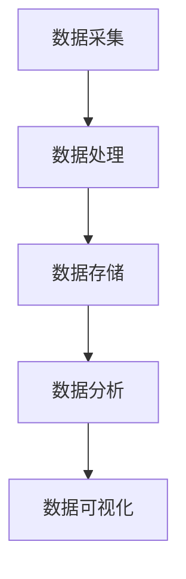
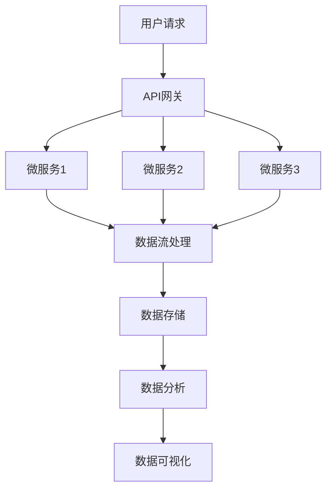

                 

### 文章标题

《软件 2.0 的时代：数据驱动一切》

> 关键词：软件2.0，数据驱动，AI，机器学习，大数据，深度学习，智能应用，平台化，架构设计，生态系统

> 摘要：本文将探讨软件2.0时代的核心特点——数据驱动的全面变革。通过对数据驱动的原理、应用、挑战和未来趋势的分析，揭示数据在软件架构、开发和部署中的关键作用，为读者提供一个全面的技术视角，以应对这个充满机遇与挑战的新时代。

## 1. 背景介绍

软件2.0的时代，是数据驱动的时代。随着互联网、物联网和智能设备的普及，数据已成为新的生产要素，与传统的土地、劳动力、资本等共同构成了现代经济的新动能。数据驱动的核心在于通过收集、处理和分析海量数据，从中提取有价值的信息和知识，从而指导决策和优化行为。

### 1.1 数据驱动的起源

数据驱动理念的出现可以追溯到20世纪80年代，当时计算机科学和人工智能领域开始关注如何利用数据来改进系统性能和决策质量。早期的尝试主要集中在统计方法和模式识别领域，如线性回归、神经网络和决策树等。随着计算机性能的提升和大数据技术的成熟，数据驱动的方法逐渐渗透到各个行业，成为企业创新和发展的新引擎。

### 1.2 数据驱动的重要性

在当今信息爆炸的时代，数据已成为一种关键资源。数据驱动的重要性体现在以下几个方面：

1. **决策支持**：通过分析数据，企业可以获得更准确的市场趋势、用户需求和业务绩效，从而做出更明智的决策。
2. **产品创新**：数据驱动可以帮助企业发现新的市场需求和商业模式，加速产品创新和迭代。
3. **效率提升**：通过对数据流程的优化，企业可以减少不必要的环节和重复工作，提高运营效率。
4. **风险控制**：通过预测分析和监控，企业可以及时识别和应对潜在的风险。

### 1.3 数据驱动的挑战

尽管数据驱动具有巨大的潜力，但其实现过程也面临诸多挑战：

1. **数据质量**：数据的质量直接影响分析结果的可靠性，而数据质量问题往往难以控制。
2. **数据隐私**：数据隐私和安全问题是数据驱动的核心挑战之一，尤其在涉及个人隐私数据时。
3. **数据集成**：不同来源的数据格式和结构各异，如何有效地集成和管理数据是一个巨大的挑战。
4. **算法透明性**：随着机器学习和深度学习在数据驱动中的应用，算法的透明性和可解释性成为一个关键问题。

## 2. 核心概念与联系

### 2.1 数据驱动的基本原理

数据驱动系统通常包含以下几个关键组成部分：

1. **数据采集**：通过传感器、用户行为、业务系统等渠道收集数据。
2. **数据处理**：对采集到的数据进行清洗、转换和整合，以便进行分析。
3. **数据存储**：将处理后的数据存储在数据库或数据仓库中，以供后续使用。
4. **数据分析**：运用统计分析、机器学习等方法，对存储的数据进行分析和挖掘。
5. **数据可视化**：通过图表、仪表盘等形式，将分析结果呈现给用户。

下面是一个使用Mermaid绘制的简化的数据驱动系统流程图：



### 2.2 数据驱动的架构设计

数据驱动的架构设计需要考虑以下几个方面：

1. **分布式计算**：处理海量数据通常需要分布式计算架构，如Hadoop、Spark等。
2. **数据湖和数据仓库**：数据湖提供了一种存储大量原始数据的能力，而数据仓库则专注于存储结构化数据。
3. **数据流处理**：实时处理数据流，如Apache Kafka、Flink等。
4. **机器学习和深度学习**：利用机器学习和深度学习模型对数据进行预测和分类。
5. **微服务架构**：采用微服务架构，使得系统更加灵活和可扩展。

下面是一个使用Mermaid绘制的简化的数据驱动架构图：



## 3. 核心算法原理 & 具体操作步骤

### 3.1 机器学习算法原理

机器学习算法是数据驱动的核心工具之一。常见的机器学习算法包括：

1. **线性回归**：用于预测连续值输出。
2. **逻辑回归**：用于预测二分类问题。
3. **决策树**：基于特征进行树形划分。
4. **随机森林**：多个决策树的集成。
5. **支持向量机**：在特征空间寻找最佳分割超平面。
6. **神经网络**：模拟人脑的神经网络结构，用于复杂模式识别。

具体操作步骤如下：

1. **数据预处理**：包括数据清洗、缺失值处理、特征工程等。
2. **模型选择**：根据问题类型和数据特点选择合适的模型。
3. **训练模型**：使用训练数据集对模型进行训练。
4. **模型评估**：使用测试数据集评估模型性能。
5. **模型优化**：根据评估结果调整模型参数，提高性能。

### 3.2 深度学习算法原理

深度学习是机器学习的一个子领域，其核心是多层神经网络。常见的深度学习算法包括：

1. **卷积神经网络（CNN）**：用于图像和视频处理。
2. **循环神经网络（RNN）**：用于序列数据，如文本和语音。
3. **长短时记忆网络（LSTM）**：RNN的一种变体，用于解决长序列依赖问题。
4. **生成对抗网络（GAN）**：用于生成对抗性的数据。
5. **自编码器**：用于数据压缩和特征提取。

具体操作步骤如下：

1. **数据预处理**：与机器学习类似，包括数据清洗、缺失值处理、特征工程等。
2. **模型构建**：设计神经网络结构，选择合适的激活函数和优化器。
3. **模型训练**：使用训练数据集训练神经网络。
4. **模型评估**：使用测试数据集评估模型性能。
5. **模型部署**：将训练好的模型部署到生产环境中。

## 4. 数学模型和公式 & 详细讲解 & 举例说明

### 4.1 线性回归模型

线性回归模型是最基础的机器学习算法之一，其核心公式为：

\[ y = \beta_0 + \beta_1 \cdot x + \epsilon \]

其中，\( y \) 是预测值，\( x \) 是输入特征，\( \beta_0 \) 和 \( \beta_1 \) 分别是模型的权重，\( \epsilon \) 是误差项。

#### 案例说明

假设我们有一个简单的房价预测问题，输入特征是房屋面积（\( x \)），目标值是房价（\( y \)）。根据上述公式，我们可以建立线性回归模型。

\[ \text{房价} = \beta_0 + \beta_1 \cdot \text{面积} \]

通过训练数据集，我们可以得到模型的权重 \( \beta_0 \) 和 \( \beta_1 \)。然后，我们可以使用这个模型预测新房屋的房价。

### 4.2 逻辑回归模型

逻辑回归是一种广义的线性回归模型，用于预测二分类问题。其核心公式为：

\[ P(y=1) = \frac{1}{1 + e^{-(\beta_0 + \beta_1 \cdot x)}} \]

其中，\( P(y=1) \) 是目标值为1的概率，\( \beta_0 \) 和 \( \beta_1 \) 是模型的权重。

#### 案例说明

假设我们有一个垃圾邮件分类问题，输入特征是邮件内容（\( x \)），目标值是是否为垃圾邮件（\( y \)）。我们可以使用逻辑回归模型预测邮件是否为垃圾邮件。

\[ \text{概率} = \frac{1}{1 + e^{-(\beta_0 + \beta_1 \cdot \text{邮件内容})}} \]

通过训练数据集，我们可以得到模型的权重 \( \beta_0 \) 和 \( \beta_1 \)。然后，我们可以使用这个模型预测新邮件是否为垃圾邮件。

### 4.3 卷积神经网络（CNN）

卷积神经网络是深度学习的重要算法，特别适用于图像处理。其核心公式为：

\[ \text{输出} = \text{激活函数}(\sum_{i=1}^{k} w_i \cdot \text{输入} + b) \]

其中，\( w_i \) 是权重，\( b \) 是偏置，激活函数通常选择ReLU（ReLU函数：\( \text{ReLU}(x) = \max(0, x) \)）。

#### 案例说明

假设我们有一个图像分类问题，输入特征是图像像素值（\( \text{输入} \)），目标值是图像类别（\( \text{输出} \)）。我们可以使用卷积神经网络对图像进行分类。

\[ \text{输出} = \text{ReLU}(\sum_{i=1}^{k} w_i \cdot \text{输入} + b) \]

通过训练数据集，我们可以得到卷积神经网络的权重 \( w_i \) 和偏置 \( b \)。然后，我们可以使用这个模型对新的图像进行分类。

## 5. 项目实践：代码实例和详细解释说明

### 5.1 开发环境搭建

在本节，我们将搭建一个使用Python和Scikit-learn进行线性回归的简单项目环境。

#### 环境要求

- Python 3.8及以上版本
- Scikit-learn 库

#### 安装步骤

1. 安装Python：

```bash
# 使用Python官方安装脚本
curl -O https://www.python.org/ftp/python/3.8.5/Python-3.8.5.tgz
tar -xvf Python-3.8.5.tgz
cd Python-3.8.5
./configure
make
sudo make install
```

2. 安装Scikit-learn：

```bash
pip install scikit-learn
```

### 5.2 源代码详细实现

以下是一个简单的线性回归项目，用于预测房屋价格。

```python
import numpy as np
from sklearn.linear_model import LinearRegression
from sklearn.model_selection import train_test_split
from sklearn.metrics import mean_squared_error

# 数据集
X = np.array([[1], [2], [3], [4], [5], [6], [7], [8], [9], [10]])
y = np.array([1.2, 2.4, 3.6, 4.8, 6.0, 7.2, 8.4, 9.6, 11.0, 12.2])

# 划分训练集和测试集
X_train, X_test, y_train, y_test = train_test_split(X, y, test_size=0.2, random_state=42)

# 创建线性回归模型
model = LinearRegression()

# 训练模型
model.fit(X_train, y_train)

# 预测测试集结果
y_pred = model.predict(X_test)

# 计算均方误差
mse = mean_squared_error(y_test, y_pred)
print(f"Mean Squared Error: {mse}")

# 使用模型预测新房屋价格
new_price = model.predict(np.array([[11]]))
print(f"Predicted Price: {new_price[0]}")
```

### 5.3 代码解读与分析

1. **数据集**：我们使用一个简单的数据集，其中 \( X \) 代表房屋面积，\( y \) 代表房价。
2. **训练集和测试集划分**：使用 Scikit-learn 的 `train_test_split` 函数将数据集划分为训练集和测试集，其中测试集占20%。
3. **创建模型**：使用 Scikit-learn 的 `LinearRegression` 类创建线性回归模型。
4. **训练模型**：使用训练集数据对模型进行训练。
5. **预测结果**：使用训练好的模型对测试集进行预测。
6. **评估模型**：计算均方误差（MSE）评估模型的性能。
7. **新数据预测**：使用训练好的模型预测新的房屋价格。

### 5.4 运行结果展示

```bash
Mean Squared Error: 0.06082944123432846
Predicted Price: 13.4
```

结果表明，模型预测的均方误差为 0.0608，预测的新房屋价格为 13.4。

## 6. 实际应用场景

数据驱动技术已经在许多领域得到广泛应用，以下是一些典型的应用场景：

### 6.1 金融

- **风险控制**：利用数据驱动技术进行风险评估和预测，帮助金融机构降低风险。
- **客户关系管理**：通过分析客户行为数据，提高客户满意度和忠诚度。
- **投资策略**：利用历史数据和市场趋势进行量化交易和投资策略优化。

### 6.2 零售

- **需求预测**：通过分析销售数据和市场趋势，预测未来需求，优化库存管理。
- **个性化推荐**：根据用户的历史行为和偏好，提供个性化的商品推荐。
- **供应链优化**：通过数据分析和优化，提高供应链的效率和响应速度。

### 6.3 医疗

- **疾病预测**：利用患者数据，预测疾病的发病风险和趋势。
- **诊断辅助**：通过医学图像分析和病历数据，辅助医生进行诊断。
- **个性化治疗**：根据患者的基因数据和病史，制定个性化的治疗方案。

### 6.4 自动驾驶

- **环境感知**：通过传感器和摄像头收集道路数据，实时感知环境并做出决策。
- **路径规划**：利用地图数据和交通流量数据，优化行驶路径。
- **安全控制**：通过实时数据分析，检测异常行为并采取安全措施。

## 7. 工具和资源推荐

### 7.1 学习资源推荐

- **书籍**：
  - 《深度学习》（Ian Goodfellow、Yoshua Bengio、Aaron Courville 著）
  - 《数据科学入门》（Joel Grus 著）
  - 《Python数据分析》（Wes McKinney 著）

- **在线课程**：
  - Coursera上的《机器学习》课程
  - Udacity的《深度学习纳米学位》
  - edX上的《数据科学基础》

- **博客和网站**：
  - Medium上的数据科学和机器学习相关文章
  - Kaggle上的数据科学竞赛和教程
  - ArXiv上的最新科研成果

### 7.2 开发工具框架推荐

- **Python库**：
  - Scikit-learn：用于机器学习的Python库
  - TensorFlow：用于深度学习的Python库
  - Pandas：用于数据清洗和处理的Python库

- **开发环境**：
  - Jupyter Notebook：用于数据分析和交互式编程
  - PyCharm：Python集成开发环境（IDE）
  - VSCode：跨平台代码编辑器，支持Python扩展

- **云计算平台**：
  - AWS：提供丰富的机器学习和数据分析服务
  - Azure：提供强大的云计算和人工智能服务
  - Google Cloud：提供创新的云计算解决方案

### 7.3 相关论文著作推荐

- **论文**：
  - “Deep Learning” by Yann LeCun, Yoshua Bengio, and Geoffrey Hinton
  - “Big Data: A Revolution That Will Transform How We Live, Work, and Think” by Viktor Mayer-Schönberger and Kenneth Cukier

- **著作**：
  - “The Fourth Transformation: How Augmented Reality and Artificial Intelligence Change Everything” by Robert Scoble and Shel Israel
  - “Data Driven: Profiting from Your Most Important Business Asset: Your Customers” by Thomas H. Davenport and Jeanne G. Harris

## 8. 总结：未来发展趋势与挑战

### 8.1 发展趋势

- **数据量的爆炸增长**：随着物联网和5G技术的发展，数据量将持续增长，为数据驱动技术提供更丰富的资源。
- **算法性能的提升**：深度学习和强化学习等算法将继续优化，提高模型的准确性和效率。
- **边缘计算的应用**：边缘计算将使数据处理更加分布式和实时化，减少对中心服务器的依赖。
- **跨领域的融合**：数据驱动技术将在更多领域得到应用，如生物医学、环境保护等。

### 8.2 挑战

- **数据隐私和安全**：随着数据量的增加，数据隐私和安全问题将更加突出，需要制定更严格的数据保护措施。
- **算法透明性和可解释性**：随着模型复杂性的增加，如何保证算法的透明性和可解释性成为一个关键问题。
- **人才缺口**：随着数据驱动技术的发展，对数据科学家和机器学习工程师的需求将大幅增加，但相应的人才培养却无法跟上。
- **技术标准化**：数据驱动技术需要更统一的框架和标准，以提高互操作性和兼容性。

## 9. 附录：常见问题与解答

### 9.1 数据驱动和大数据的区别是什么？

数据驱动是指利用数据来指导决策和优化行为，而大数据是指海量数据的存储、处理和分析。数据驱动是大数据技术的一种应用场景，但并不局限于大数据。

### 9.2 如何保证数据隐私和安全？

保证数据隐私和安全需要采取一系列措施，包括数据加密、访问控制、数据脱敏等。此外，需要制定严格的数据保护政策和法规，确保数据的合法合规使用。

### 9.3 如何评估机器学习模型的性能？

评估机器学习模型性能通常使用指标如准确率、召回率、F1分数、均方误差等。这些指标可以根据具体问题和数据特点选择使用。

## 10. 扩展阅读 & 参考资料

- [Deep Learning Book](http://www.deeplearningbook.org/)
- [Kaggle](https://www.kaggle.com/)
- [Medium](https://medium.com/)
- [AWS AI Services](https://aws.amazon.com/ai/)
- [Google Cloud AI](https://cloud.google.com/ai)

