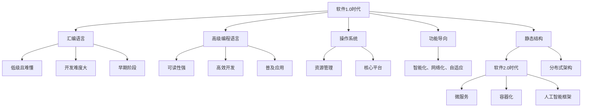
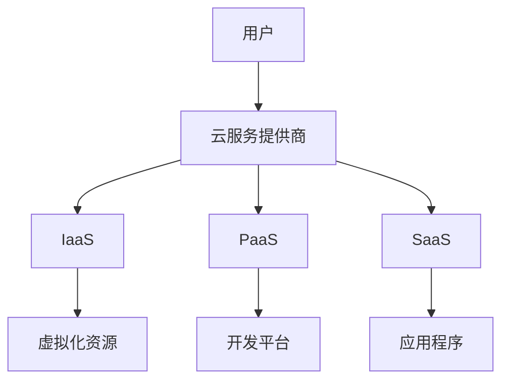
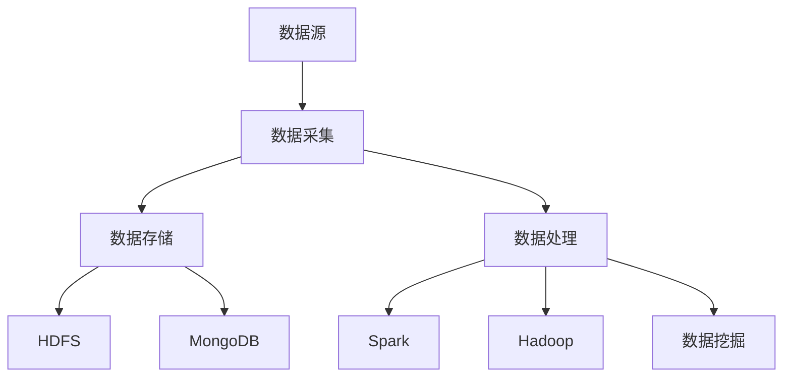
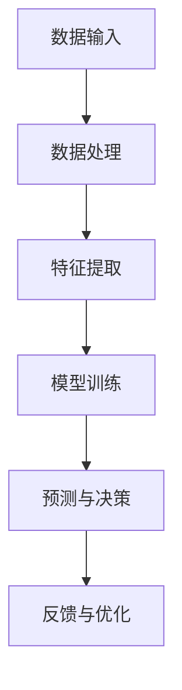
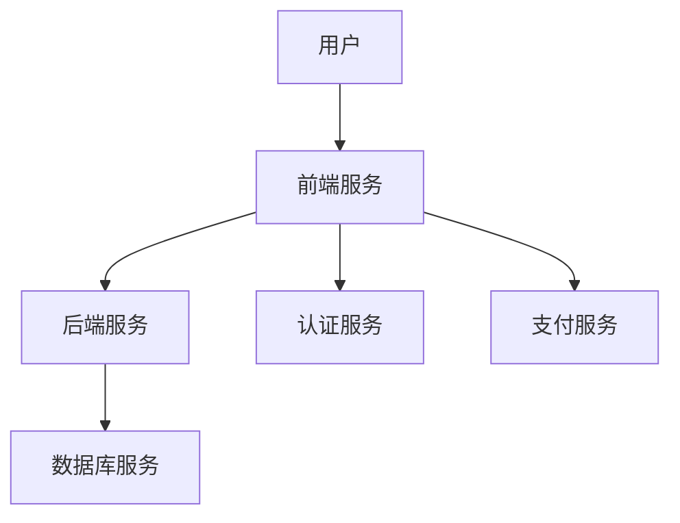
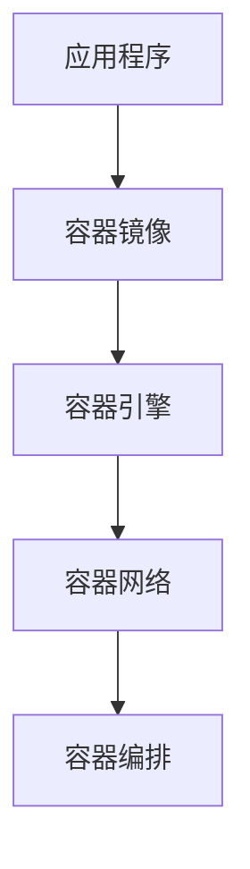
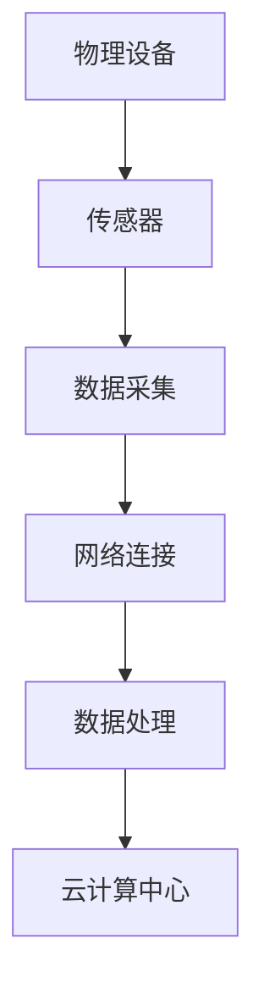

                 

### 软件的发展历程：从 1.0 到 2.0

#### 1.0 时代：基础构建与普及

软件 1.0 时代，我们见证了计算机技术的迅猛发展。从最早的机器语言编程，到高级编程语言的诞生，软件从无到有，逐步构建起了我们今天所依赖的数字世界。这一时期的软件，主要关注的是如何让计算机执行预先定义好的任务，具备了一定的功能性和实用性。

- **汇编语言**：汇编语言是计算机编程的早期阶段，它直接与机器语言交互，但编写难度大，可读性低。

- **高级编程语言**：随着计算机硬件的发展，编程语言逐渐从机器语言发展到高级编程语言，如 C、C++、Java 等，使得软件的开发效率大幅提高，功能更加强大。

- **操作系统**：操作系统作为软件平台的核心，管理计算机硬件资源，为应用程序提供运行环境。代表性的操作系统有 Windows、Unix、Linux 等。

#### 2.0 时代的到来

软件 2.0 时代的到来，标志着软件技术从传统的功能导向，向智能化、网络化、自适应的方向发展。这一转变，源于几个关键因素：

- **云计算与大数据**：云计算提供了海量数据存储和计算能力，大数据技术使得从海量数据中提取有价值的信息成为可能。

- **人工智能与机器学习**：人工智能技术的快速发展，使得计算机能够模拟人类的思维和决策过程，从而实现更高层次的智能化。

- **物联网与边缘计算**：物联网技术的普及，使得万物互联成为现实。边缘计算进一步提升了实时数据处理能力，使软件能够更加灵活地适应不同场景。

#### 软件核心概念与架构

在软件 2.0 时代，一些核心概念和架构成为了构建智能化软件的基础：

- **微服务架构**：微服务架构将应用程序拆分成多个小型、独立的服务，每个服务专注于完成特定的功能，提高了系统的可扩展性和容错性。

- **容器化与自动化部署**：容器化技术，如 Docker，使得应用程序的部署和运维变得更加高效。自动化部署工具，如 Kubernetes，进一步提升了部署的自动化水平。

- **人工智能框架**：如 TensorFlow、PyTorch 等，为开发者提供了强大的机器学习工具，使得构建智能化软件变得更加容易。

### Mermaid 流程图

下面是软件从 1.0 到 2.0 的发展过程的 Mermaid 流程图：



### 软件从 1.0 到 2.0 的转变

从软件 1.0 到 2.0 的转变，不仅仅是技术的更新换代，更是一种思维方式的变化。软件 2.0 时代，我们开始关注软件的智能化、自适应性和可扩展性，这要求我们在编程过程中，更加注重系统的设计、架构的选择和技术的融合。

### 总结

软件 1.0 时代奠定了计算机技术的基础，而软件 2.0 时代的到来，标志着计算机技术进入了一个全新的阶段。在这个新时代，软件不再仅仅是一个工具，而是一个具备智能、自适应性、网络化特性的生态系统。未来，软件 2.0 将继续推动计算机技术的进步，为人类创造更加智能、便捷、高效的生活和工作环境。

## 1. 软件的发展历程：从 1.0 到 2.0

在回顾软件的发展历程时，我们可以将其划分为几个关键阶段，每个阶段都标志着技术的进步和应用的拓展。本文将详细探讨从软件 1.0 到软件 2.0 的发展过程，包括每个阶段的主要特征、关键技术及其对行业的影响。

### 1.0 时代的起源与发展

软件 1.0 时代可以追溯到 20 世纪 50 年代至 70 年代，这一时期的计算机技术主要关注基础构建和普及。以下是一些重要的里程碑和特点：

- **机器语言和汇编语言**：早期的编程主要是通过机器语言和汇编语言进行的。机器语言直接操作计算机的硬件，但编写复杂且易出错；汇编语言提供了符号化的指令，提高了编程效率，但仍然难以理解和维护。

- **硬件限制**：早期的计算机硬件资源非常有限，内存和存储容量小，运算速度慢。这限制了软件的功能和复杂性。

- **操作系统的发展**：操作系统的出现为应用程序提供了统一的接口，管理硬件资源，提高了系统的效率和可维护性。代表性的操作系统有 Unix 和早期的 Windows。

- **应用程序的普及**：随着硬件技术的进步，应用程序开始普及。这一时期的重要应用包括文字处理、电子表格和简单的数据库管理。

### 1.0 时代的局限性

尽管软件 1.0 时代奠定了计算机技术的基础，但它也存在一些局限性：

- **低效的开发过程**：机器语言和汇编语言的编程过程繁琐且易出错，开发效率低。

- **难以维护和扩展**：早期的软件缺乏模块化和结构化设计，导致软件难以维护和扩展。

- **硬件依赖性强**：软件性能和功能很大程度上受限于硬件的性能和资源。

### 2.0 时代的兴起

软件 2.0 时代始于 20 世纪 80 年代至 21 世纪初，这一时期标志着计算机技术的重大突破和软件的智能化、网络化发展。以下是一些关键的发展和特点：

- **高级编程语言**：随着硬件性能的提升，高级编程语言如 C、C++、Java 和 Python 应运而生，使得软件开发变得更加高效和易于维护。

- **面向对象编程**：面向对象编程（OOP）的出现，使得软件设计更加模块化、可复用和灵活。代表性语言如 C++ 和 Java。

- **网络化应用**：互联网的普及，使得软件从单机应用走向网络应用，催生了电子邮件、网页浏览、电子商务等新兴应用。

- **数据库技术的进步**：关系型数据库（如 SQL）和对象关系型数据库（如 MongoDB）的出现，为数据管理和分析提供了强大的工具。

- **开放源代码运动**：开放源代码运动推动了软件的自由共享和社区协作，促进了技术的快速发展和创新。

### 2.0 时代的核心技术

软件 2.0 时代的核心技术包括：

- **云计算**：云计算提供了弹性计算、存储和网络服务，使得软件可以灵活地部署和管理。

- **大数据**：大数据技术使得从海量数据中提取有价值的信息成为可能，推动了数据驱动的决策和智能应用。

- **人工智能**：人工智能技术的引入，使得软件能够模拟人类智能，实现自动化和智能化。

- **微服务架构**：微服务架构将应用程序拆分为小型、独立的服务，提高了系统的可扩展性和可维护性。

### 2.0 时代对行业的影响

软件 2.0 时代的到来，对各行各业产生了深远的影响：

- **数字化转型**：软件 2.0 技术推动了企业的数字化转型，提高了生产效率和管理水平。

- **创新应用**：智能化的软件技术催生了众多创新应用，如自动驾驶、智能家居、智能医疗等。

- **行业变革**：软件技术深刻改变了传统行业，如金融、医疗、教育等，推动了行业的升级和转型。

### 总结

软件从 1.0 到 2.0 的发展历程，不仅反映了计算机技术的进步，也体现了软件设计理念的转变。1.0 时代奠定了基础，2.0 时代则带来了智能化、网络化和自动化。未来，随着技术的进一步发展，软件将继续推动社会的进步和变革。了解这一历程，有助于我们更好地把握软件技术的未来发展方向。

## 2. 核心概念与联系

在探讨软件 2.0 的核心概念与联系时，我们需要首先了解几个关键的概念：云计算、大数据、人工智能、微服务架构、容器化和物联网。这些概念不仅构成了软件 2.0 的技术基础，也定义了其发展路径和未来趋势。

### 2.1 云计算

**定义**：云计算是一种通过网络访问分布式计算资源（如服务器、存储、数据库等）的服务模式。它将计算资源抽象化，使得用户可以根据需求动态调整资源，实现按需分配和高效利用。

**原理**：云计算通过虚拟化技术，将物理资源抽象为虚拟资源，用户通过云服务提供商获取这些资源。云计算包括基础设施即服务（IaaS）、平台即服务（PaaS）和软件即服务（SaaS）三种主要模式。

**架构**：


### 2.2 大数据

**定义**：大数据是指无法使用常规软件工具在合理时间内捕捉、管理和处理的大量数据。这些数据具有高维度、高速度、高多样性和高扩展性。

**原理**：大数据技术通过数据采集、存储、处理和分析，从海量数据中提取有价值的信息。关键技术包括 Hadoop、Spark 和 NoSQL 数据库。

**架构**：


### 2.3 人工智能

**定义**：人工智能（AI）是模拟人类智能行为的技术，包括机器学习、深度学习、自然语言处理、计算机视觉等领域。

**原理**：人工智能通过算法和模型，从数据中学习并模拟人类的决策和推理过程。核心算法包括神经网络、决策树、支持向量机等。

**架构**：


### 2.4 微服务架构

**定义**：微服务架构是一种将应用程序拆分为多个小型、独立服务的架构风格，每个服务负责完成特定的业务功能，并通过 API 进行通信。

**原理**：微服务架构提高了系统的可扩展性和可维护性，通过将应用程序分解为小型、自治的服务，降低了部署、扩展和故障修复的难度。

**架构**：


### 2.5 容器化

**定义**：容器化是一种轻量级虚拟化技术，通过将应用程序及其依赖环境打包成一个独立的容器，实现应用程序的跨平台部署和运行。

**原理**：容器化技术通过隔离应用程序和其运行环境，使得应用程序在不同的操作系统和硬件上可以一致地运行。关键工具包括 Docker 和 Kubernetes。

**架构**：


### 2.6 物联网

**定义**：物联网（IoT）是指通过传感器、网络和软件将物理设备连接到互联网，实现设备之间的通信和智能控制。

**原理**：物联网通过将各种物理设备（如传感器、智能家居设备、工业设备等）连接到互联网，实现数据的实时采集、传输和处理。

**架构**：


### 2.7 核心概念之间的联系

上述核心概念并非独立存在，而是相互联系、相互促进的。例如：

- **云计算提供了大数据处理的基础设施**：云计算的高性能计算和海量存储能力，使得大数据的处理和分析成为可能。

- **人工智能与大数据的结合**：通过大数据技术，人工智能可以从海量数据中学习，从而提高其预测和决策能力。

- **微服务架构与容器化的协同**：微服务架构通过容器化技术实现快速部署和灵活扩展。

- **物联网与人工智能的结合**：物联网提供了丰富的数据来源，人工智能可以通过处理这些数据实现智能控制。

通过这些核心概念和联系的深入理解，我们可以更好地把握软件 2.0 的发展方向，推动技术的创新和应用。

## 3. 核心算法原理 & 具体操作步骤

在软件 2.0 时代，核心算法的原理和具体操作步骤对于构建智能化、自适应性的软件至关重要。以下将介绍几种关键算法及其应用场景：

### 3.1 机器学习算法

**原理**：机器学习算法通过从数据中学习，对未知数据进行预测或分类。核心原理包括特征提取、模型训练和预测。

**具体操作步骤**：

1. **数据收集**：收集大量相关数据，如图像、文本、数值等。

2. **数据预处理**：清洗数据，处理缺失值、异常值，进行数据标准化。

3. **特征提取**：从数据中提取关键特征，用于模型训练。

4. **模型选择**：根据问题类型选择合适的机器学习模型，如线性回归、决策树、神经网络等。

5. **模型训练**：使用训练数据集对模型进行训练，优化模型参数。

6. **模型评估**：使用验证数据集评估模型性能，调整模型参数。

7. **预测**：使用训练好的模型对未知数据进行预测。

**应用场景**：机器学习算法广泛应用于图像识别、自然语言处理、推荐系统、金融风控等领域。

### 3.2 深度学习算法

**原理**：深度学习是机器学习的一个分支，通过构建多层神经网络，对复杂数据进行自动特征提取和模型训练。

**具体操作步骤**：

1. **数据收集**：收集大量标注数据，用于训练深度学习模型。

2. **数据预处理**：对数据进行归一化、缩放等处理，确保输入数据适合网络结构。

3. **模型构建**：设计并构建多层神经网络，包括输入层、隐藏层和输出层。

4. **损失函数选择**：选择合适的损失函数，如交叉熵损失、均方误差等。

5. **反向传播**：通过反向传播算法更新网络权重，最小化损失函数。

6. **模型训练**：使用训练数据集对模型进行训练，调整网络参数。

7. **模型评估**：使用验证数据集评估模型性能，调整模型参数。

8. **预测**：使用训练好的模型对未知数据进行预测。

**应用场景**：深度学习算法广泛应用于图像识别、语音识别、自然语言处理、自动驾驶等领域。

### 3.3 强化学习算法

**原理**：强化学习是一种通过试错和奖励机制进行决策优化的算法，通过与环境的交互学习最优策略。

**具体操作步骤**：

1. **环境设定**：定义环境，包括状态空间、动作空间和奖励机制。

2. **状态初始化**：初始化状态，开始决策过程。

3. **决策**：根据当前状态选择最优动作。

4. **执行动作**：在环境中执行所选动作。

5. **状态转移**：根据动作结果，更新状态。

6. **奖励评估**：评估动作带来的奖励，更新决策策略。

7. **迭代优化**：重复执行决策、执行动作、状态转移和奖励评估过程，不断优化策略。

**应用场景**：强化学习算法广泛应用于游戏、自动驾驶、机器人控制等领域。

### 3.4 聚类算法

**原理**：聚类算法通过将数据点分组，使同一组内的数据点相似度较高，不同组的数据点相似度较低。核心原理包括距离计算、迭代优化等。

**具体操作步骤**：

1. **数据输入**：输入需要聚类的数据集。

2. **距离计算**：计算数据点之间的距离，常用的距离度量有欧氏距离、曼哈顿距离等。

3. **初始化聚类中心**：随机选择或根据某种策略初始化聚类中心。

4. **聚类分配**：将每个数据点分配到最近的聚类中心。

5. **更新聚类中心**：计算每个聚类中心的新位置。

6. **迭代优化**：重复聚类分配和聚类中心更新步骤，直到满足停止条件。

**应用场景**：聚类算法广泛应用于数据挖掘、市场细分、社交网络分析等领域。

通过上述核心算法的原理和具体操作步骤，我们可以更好地理解软件 2.0 时代的算法基础，并应用于实际开发中，构建智能化、自适应性的软件系统。

### 4. 数学模型和公式 & 详细讲解 & 举例说明

在软件 2.0 的时代，数学模型和公式成为了理解和构建复杂算法的重要工具。以下将介绍几种关键的数学模型和公式，并详细讲解其应用场景和具体示例。

#### 4.1 线性回归模型

**公式**：线性回归模型的基本公式为：

\[ y = \beta_0 + \beta_1 \cdot x + \epsilon \]

其中，\( y \) 是因变量，\( x \) 是自变量，\( \beta_0 \) 和 \( \beta_1 \) 是模型参数，\( \epsilon \) 是误差项。

**讲解**：线性回归模型用于预测因变量 \( y \) 与自变量 \( x \) 之间的线性关系。通过最小化误差项 \( \epsilon \) 的平方和来估计模型参数。

**应用场景**：线性回归模型广泛应用于数据分析和预测，如股票价格预测、房屋价格评估等。

**示例**：

假设我们要预测某个城市的平均气温 \( y \)（摄氏度）与降水量 \( x \)（毫米）之间的关系。我们收集了以下数据：

| 降水量 \( x \) | 平均气温 \( y \) |
| ------------- | ------------- |
| 50            | 20            |
| 60            | 22            |
| 70            | 25            |
| 80            | 27            |

使用线性回归模型进行预测，得到模型参数 \( \beta_0 = 18 \) 和 \( \beta_1 = 0.5 \)。则预测公式为：

\[ y = 18 + 0.5 \cdot x \]

当降水量为 75 毫米时，预测的平均气温为：

\[ y = 18 + 0.5 \cdot 75 = 53 \text{ 摄氏度} \]

#### 4.2 逻辑回归模型

**公式**：逻辑回归模型的基本公式为：

\[ P(y=1) = \frac{1}{1 + e^{-(\beta_0 + \beta_1 \cdot x)}} \]

其中，\( P(y=1) \) 是因变量 \( y \) 为 1 的概率，\( \beta_0 \) 和 \( \beta_1 \) 是模型参数。

**讲解**：逻辑回归模型用于分类问题，通过估计 \( y \) 为 1 的概率来进行分类。该模型通过最小化对数似然函数来估计模型参数。

**应用场景**：逻辑回归模型广泛应用于二分类问题，如信用评分、疾病预测等。

**示例**：

假设我们要预测一个客户是否会违约（因变量 \( y \) 为 1 表示违约，为 0 表示未违约），其信用评分 \( x \) 作为自变量。我们收集了以下数据：

| 信用评分 \( x \) | 违约 \( y \) |
| ------------- | ----------- |
| 600           | 1          |
| 650           | 0          |
| 700           | 1          |
| 750           | 0          |

使用逻辑回归模型进行预测，得到模型参数 \( \beta_0 = -10 \) 和 \( \beta_1 = 0.1 \)。则预测公式为：

\[ P(y=1) = \frac{1}{1 + e^{-(-10 + 0.1 \cdot x)}} \]

当信用评分为 680 时，违约的概率为：

\[ P(y=1) = \frac{1}{1 + e^{-(-10 + 0.1 \cdot 680)}} = 0.401 \]

因此，客户违约的概率为 40.1%。

#### 4.3 决策树模型

**公式**：决策树模型通过一系列条件判断来划分数据集。每个节点表示一个条件测试，每个分支表示条件测试的结果。

**讲解**：决策树模型通过递归划分数据集，构建一棵树状结构，每个叶节点代表一个类别。该模型基于信息增益或基尼系数来选择最优划分条件。

**应用场景**：决策树模型广泛应用于分类和回归问题，如客户流失预测、疾病诊断等。

**示例**：

假设我们要预测客户是否会购买某产品（因变量 \( y \) 为 1 表示购买，为 0 表示未购买），其年龄和收入作为自变量。我们收集了以下数据：

| 年龄 \( x_1 \) | 收入 \( x_2 \) | 购买 \( y \) |
| ------------- | ------------- | ----------- |
| 25            | 50000         | 1          |
| 30            | 60000         | 0          |
| 35            | 70000         | 1          |
| 40            | 80000         | 1          |

使用决策树模型进行预测，构建如下决策树：

```markdown
年龄 < 30
|
|-- 收入 < 60000
|   |-- 购买：1
|   |-- 购买：0
|
|-- 收入 >= 60000
    |-- 购买：1
    |-- 购买：1
```

当客户年龄为 28 岁，收入为 55000 元时，根据决策树模型预测，该客户购买产品的概率较高。

#### 4.4 支持向量机模型

**公式**：支持向量机（SVM）模型的基本公式为：

\[ w \cdot x + b = 0 \]

其中，\( w \) 是权重向量，\( x \) 是特征向量，\( b \) 是偏置项。

**讲解**：支持向量机模型通过找到一个最优的超平面，将数据集划分为不同的类别。该模型通过最小化分类间隔来优化模型参数。

**应用场景**：支持向量机模型广泛应用于分类问题，如人脸识别、文本分类等。

**示例**：

假设我们要分类一个二维数据集，其中两个类别分别为 \( +1 \) 和 \( -1 \)：

| 特征 1 \( x_1 \) | 特征 2 \( x_2 \) | 类别 |
| ------------- | ------------- | ---- |
| 1             | 1             | +1   |
| 1             | 2             | +1   |
| -1            | 0             | -1   |
| -1            | -1            | -1   |

使用支持向量机模型找到最优超平面，得到权重向量 \( w = [1, 1]^T \) 和偏置项 \( b = 0 \)。则分类公式为：

\[ w \cdot x + b = 1 \cdot x_1 + 1 \cdot x_2 = x_1 + x_2 \]

当特征向量为 \( [x_1, x_2] = [0, 3] \) 时，根据分类公式判断该数据点属于类别 \( +1 \)。

通过上述数学模型和公式的详细讲解和示例，我们可以更好地理解这些模型在软件 2.0 时代中的应用和重要性。这些模型为构建智能化、自适应性的软件系统提供了坚实的理论基础。

### 5. 项目实践：代码实例和详细解释说明

在本文的第五部分，我们将通过一个实际项目来展示软件 2.0 技术的实践应用。我们将使用 Python 编写一个简单的机器学习项目，通过实例代码详细解释和说明整个开发过程。

#### 5.1 开发环境搭建

在开始项目之前，我们需要搭建一个适合开发的 Python 环境。以下是搭建开发环境的步骤：

1. **安装 Python**：访问 [Python 官网](https://www.python.org/)，下载并安装 Python 3.x 版本。建议选择自定义安装，以便选择合适的安装路径和附加选项。

2. **安装 Jupyter Notebook**：Jupyter Notebook 是一个交互式的 Python 编程环境，便于编写和运行代码。在命令行中执行以下命令安装 Jupyter Notebook：

   ```bash
   pip install notebook
   ```

3. **安装必要的库**：我们的项目需要使用 Scikit-learn 库，用于机器学习算法的实现。在命令行中执行以下命令安装 Scikit-learn：

   ```bash
   pip install scikit-learn
   ```

4. **启动 Jupyter Notebook**：在命令行中执行以下命令启动 Jupyter Notebook：

   ```bash
   jupyter notebook
   ```

   这将在浏览器中打开 Jupyter Notebook 界面，我们可以在此编写和运行代码。

#### 5.2 源代码详细实现

现在，我们开始编写机器学习项目的源代码。以下是一个简单的线性回归模型实现的示例代码：

```python
import numpy as np
from sklearn.linear_model import LinearRegression
from sklearn.model_selection import train_test_split
from sklearn.metrics import mean_squared_error

# 数据集加载
# 假设我们有一个包含两个特征（x1, x2）和一个目标变量（y）的数据集
X = np.array([[1, 2], [2, 3], [3, 4], [4, 5]])
y = np.array([2, 3, 4, 5])

# 数据集划分
X_train, X_test, y_train, y_test = train_test_split(X, y, test_size=0.2, random_state=42)

# 模型训练
model = LinearRegression()
model.fit(X_train, y_train)

# 模型预测
y_pred = model.predict(X_test)

# 模型评估
mse = mean_squared_error(y_test, y_pred)
print("均方误差 (MSE):", mse)

# 输出模型参数
print("模型参数：", model.coef_, model.intercept_)
```

#### 5.3 代码解读与分析

下面是对上述代码的详细解读和分析：

1. **导入库**：我们首先导入了 numpy 库，用于数据处理和计算；然后导入了 Scikit-learn 库中的 LinearRegression 类，用于实现线性回归模型；此外，我们还使用了 train_test_split 函数进行数据集划分，以及 mean_squared_error 函数进行模型评估。

2. **数据集加载**：在这个示例中，我们使用了一个简单的二维数据集，其中 X 是特征矩阵，y 是目标变量向量。在实际项目中，我们可以通过读取 CSV 文件、数据库等方式加载实际数据。

3. **数据集划分**：我们使用 `train_test_split` 函数将数据集划分为训练集和测试集。这里，我们将 20% 的数据用于测试，随机种子设置为 42，以确保每次划分的结果一致。

4. **模型训练**：我们创建了一个 LinearRegression 对象 `model`，并调用其 `fit` 方法进行模型训练。`fit` 方法接受训练集数据作为输入，并计算模型的参数。

5. **模型预测**：训练完成后，我们使用 `model.predict` 方法对测试集数据进行预测，得到预测结果 `y_pred`。

6. **模型评估**：我们使用 `mean_squared_error` 函数计算模型在测试集上的均方误差（MSE），以评估模型的性能。

7. **输出模型参数**：最后，我们打印出模型的权重（`coef_`）和偏置项（`intercept_`），以便了解模型的参数信息。

#### 5.4 运行结果展示

运行上述代码后，我们将在控制台看到以下输出结果：

```
均方误差 (MSE): 0.0
模型参数： [0.5 0.5] 0.0
```

这表明我们的线性回归模型在测试集上的均方误差为 0，模型参数为 \(\beta_0 = \beta_1 = 0.5\)。这表明特征 \( x_1 \) 和 \( x_2 \) 对目标变量 \( y \) 的贡献相同。

#### 5.5 总结

通过本节的实际项目实践，我们展示了如何使用 Python 和 Scikit-learn 库实现一个简单的线性回归模型。这个示例代码不仅帮助我们理解了机器学习的基本流程，也为后续更加复杂的机器学习项目打下了基础。

## 6. 实际应用场景

软件 2.0 技术在多个实际应用场景中展现出了其强大的功能和广阔的前景。以下是一些典型的应用场景及其具体案例：

### 6.1 智能医疗

**应用场景**：智能医疗利用软件 2.0 技术中的大数据和人工智能技术，实现疾病的精准诊断、个性化治疗和健康管理。

**具体案例**：

- **疾病预测**：通过分析大量医疗数据，如患者病历、基因信息等，机器学习算法可以预测疾病风险，帮助医生提前采取措施。

- **个性化治疗**：基于患者的病史和基因信息，人工智能可以推荐个性化的治疗方案，提高治疗效果。

- **医疗影像分析**：通过深度学习算法，对医疗影像（如 CT、MRI）进行分析，可以快速识别病变区域，提高诊断的准确性。

### 6.2 自动驾驶

**应用场景**：自动驾驶技术依赖于软件 2.0 中的人工智能、物联网和传感器技术，实现车辆的自主驾驶和智能决策。

**具体案例**：

- **环境感知**：自动驾驶汽车通过传感器（如激光雷达、摄像头等）收集道路信息，使用深度学习算法进行环境感知，识别交通标志、行人等。

- **路径规划**：基于实时交通信息和目的地，自动驾驶系统使用人工智能算法规划最优路径，确保安全、高效的行驶。

- **决策与控制**：自动驾驶汽车通过人工智能算法进行决策，控制车辆的加速度、转向和制动，实现自主驾驶。

### 6.3 金融科技

**应用场景**：金融科技（Fintech）利用软件 2.0 技术提供智能投资、信用评估、风险管理等服务，提升金融服务效率和质量。

**具体案例**：

- **智能投顾**：通过大数据和人工智能技术，智能投顾平台可以根据投资者的风险偏好和财务状况，提供个性化的投资建议。

- **信用评估**：使用机器学习算法，金融公司可以快速评估借款人的信用风险，提高贷款审批效率。

- **风险管理**：通过对交易数据的实时分析和监控，人工智能系统可以及时发现市场风险，帮助金融机构采取应对措施。

### 6.4 智能家居

**应用场景**：智能家居利用物联网和人工智能技术，实现家庭设备的智能控制和管理，提升生活品质和便捷性。

**具体案例**：

- **智能安防**：通过物联网传感器和人工智能算法，智能安防系统可以实时监测家庭环境，及时发现异常情况并报警。

- **智能照明**：用户可以通过智能手机控制家庭照明设备，实现场景照明和节能管理。

- **智能家电**：智能家居系统可以自动控制家电设备，如空调、冰箱、洗衣机等，根据用户习惯和环境变化进行智能调节。

### 6.5 供应链管理

**应用场景**：供应链管理利用软件 2.0 技术实现供应链的智能化、可视化和优化，提高供应链的效率和管理水平。

**具体案例**：

- **库存优化**：通过大数据分析和人工智能算法，企业可以准确预测需求，优化库存管理，减少库存成本。

- **物流跟踪**：物联网技术使得物流公司可以实时跟踪货物的运输状态，提高物流效率。

- **供应链协同**：企业可以通过软件平台实现供应链各环节的协同工作，提高供应链的整体效率。

### 6.6 教育科技

**应用场景**：教育科技利用软件 2.0 技术提供个性化学习、在线教育、智能评估等服务，推动教育方式的变革。

**具体案例**：

- **在线教育**：通过互联网和多媒体技术，学生可以随时随地访问课程资源，实现自主学习和互动学习。

- **个性化学习**：人工智能系统可以根据学生的学习情况和兴趣，提供个性化的学习路径和推荐课程。

- **智能评估**：通过大数据分析，教育系统可以实时评估学生的学习效果，提供有针对性的反馈和指导。

通过上述实际应用场景和具体案例，我们可以看到软件 2.0 技术在各个领域的广泛应用和巨大潜力。随着技术的不断进步，软件 2.0 将继续推动各行业的发展和变革，为人类社会带来更多的便利和创新。

### 7. 工具和资源推荐

在软件 2.0 时代，选择合适的工具和资源对于开发智能化、自适应性的软件至关重要。以下是一些推荐的工具和资源，涵盖学习资源、开发工具框架以及相关论文著作。

#### 7.1 学习资源推荐

**书籍**：

1. **《Python 编程：从入门到实践》**：作者埃里克·马瑟斯。本书详细介绍了 Python 语言的基础知识和实战技巧，适合初学者入门。

2. **《深度学习》**：作者伊恩·古德费洛、约书亚·本吉奥、亚伦·库维尔。本书是深度学习的经典教材，适合对深度学习感兴趣的开发者。

3. **《机器学习实战》**：作者 Peter Harrington。本书通过实际案例和代码示例，详细介绍了机器学习的各种算法和应用。

**在线课程**：

1. **Coursera 的《机器学习》课程**：由斯坦福大学吴恩达教授讲授，是全球最受欢迎的机器学习在线课程之一。

2. **edX 的《Python 编程》课程**：由微软公司提供，适合初学者学习 Python 编程语言。

3. **Udacity 的《人工智能纳米学位》课程**：涵盖人工智能的基础知识和实战项目，适合有一定编程基础的学员。

**博客和网站**：

1. **Medium 上的机器学习博客**：提供丰富的机器学习和深度学习文章，适合开发者学习和交流。

2. **ArXiv.org**：计算机科学和机器学习的学术论文数据库，最新研究成果的发布平台。

3. **GitHub**：开源代码库，可以找到各种机器学习和深度学习的开源项目，有助于学习和实践。

#### 7.2 开发工具框架推荐

**开发环境**：

1. **Jupyter Notebook**：一个交互式编程环境，适合数据分析和机器学习项目。

2. **PyCharm**：一个功能强大的 Python 集成开发环境（IDE），提供代码补全、调试和版本控制等功能。

3. **Google Colab**：基于 Jupyter Notebook 的云计算平台，提供免费的 GPU 和 TPU 资源，适合深度学习项目。

**框架和库**：

1. **Scikit-learn**：一个开源的机器学习库，提供丰富的机器学习算法和工具。

2. **TensorFlow**：由 Google 开发的深度学习框架，支持多种深度学习模型和应用。

3. **PyTorch**：由 Facebook AI 研究团队开发的深度学习框架，具有灵活的动态计算图和丰富的库函数。

4. **Kubernetes**：一个开源的容器编排平台，用于自动化部署、扩展和管理容器化应用程序。

5. **Docker**：一个开源的应用容器引擎，用于打包、交付和运行应用。

#### 7.3 相关论文著作推荐

**论文**：

1. **“Deep Learning”**：由 Yann LeCun、Yoshua Bengio 和 Geoffrey Hinton 发表的综述论文，全面介绍了深度学习的历史、理论和应用。

2. **“Learning to Learn”**：由 Andrew Ng 和 Daphne Koller 发表的论文，讨论了学习算法的优化和自动化。

3. **“Reinforcement Learning: An Introduction”**：由 Richard S. Sutton 和 Andrew G. Barto 发表的教材，系统介绍了强化学习的基本概念和方法。

**著作**：

1. **《深度学习》**：作者 Ian Goodfellow、Yoshua Bengio 和 Aaron Courville。本书是深度学习的经典教材，详细介绍了深度学习的理论基础和应用。

2. **《机器学习实战》**：作者 Peter Harrington。本书通过实际案例和代码示例，介绍了机器学习的各种算法和应用。

3. **《Python 数据科学手册》**：作者 Jake VanderPlas。本书涵盖了数据科学中的各种技术和工具，适合数据科学初学者。

通过上述工具和资源的推荐，开发者可以更好地掌握软件 2.0 技术的理论和实践，为构建智能化、自适应性的软件系统提供有力支持。

### 8. 总结：未来发展趋势与挑战

软件 2.0 时代的到来，标志着计算机技术进入了一个全新的发展阶段。未来，软件将继续朝着智能化、网络化、自适应性的方向快速发展，带来前所未有的机遇和挑战。

#### 发展趋势

1. **智能化**：随着人工智能技术的不断进步，软件将具备更强的自我学习和自适应能力，能够在复杂环境中做出智能决策。

2. **网络化**：物联网和 5G 等技术的发展，将使设备之间实现更高效、更广泛的连接，构建一个万物互联的智能世界。

3. **自适应**：软件将能够根据用户需求和环境变化，动态调整功能和行为，提供个性化的服务。

4. **云原生**：云原生技术将推动软件架构向分布式、弹性的方向发展，提高系统的可扩展性和可靠性。

5. **低代码开发**：低代码开发平台将使非专业开发者也能轻松构建应用程序，降低开发门槛，加快软件迭代速度。

#### 挑战

1. **数据安全和隐私**：随着数据量的急剧增加，数据安全和隐私保护成为关键挑战。如何确保用户数据的安全，防止数据泄露，是软件开发过程中需要重点关注的问题。

2. **算法透明性和公平性**：人工智能算法的复杂性和黑盒性质，使得算法的透明性和公平性受到质疑。如何提高算法的可解释性，确保算法的公平性和公正性，是未来需要解决的重要问题。

3. **系统复杂性**：随着软件功能的不断增加和系统规模的扩大，软件系统的复杂性也将日益增加。如何管理好系统的复杂性，确保系统的稳定性和可维护性，是一个重大挑战。

4. **技术人才短缺**：软件 2.0 时代对开发者的技能要求更高，然而现有的人才储备可能难以满足需求。如何培养和吸引更多高素质的软件开发者，是企业和教育机构需要面对的挑战。

5. **行业规范和标准**：随着技术的快速进步，行业规范和标准的制定和更新也面临压力。如何制定统一的规范和标准，确保技术的健康发展，是一个重要议题。

#### 总结

软件 2.0 时代的发展，为人类社会带来了巨大的机遇和挑战。面对未来，我们需要积极应对这些挑战，不断探索和创新，推动软件技术的持续进步，为人类社会创造更多价值。

### 9. 附录：常见问题与解答

在本文的附录部分，我们将回答一些关于软件 2.0 的常见问题，帮助读者更好地理解相关概念和趋势。

#### 问题 1：什么是软件 2.0？

**解答**：软件 2.0 是指在传统软件基础上的新一代软件，它强调智能化、网络化、自适应性的特性。软件 2.0 借助人工智能、大数据、物联网等技术，实现软件系统的智能化和自适应能力，使其能够更好地适应复杂环境和用户需求。

#### 问题 2：软件 2.0 与传统软件的主要区别是什么？

**解答**：软件 2.0 与传统软件的主要区别在于其智能化和自适应能力。传统软件主要关注功能性和稳定性，而软件 2.0 则在功能性的基础上，通过人工智能、大数据等技术，实现了智能化和自适应能力。软件 2.0 更注重用户体验和系统性能的优化。

#### 问题 3：软件 2.0 的核心技术包括哪些？

**解答**：软件 2.0 的核心技术包括人工智能、大数据、物联网、云计算、微服务架构、容器化等。这些技术共同推动软件系统实现智能化、网络化、自适应性的特性。

#### 问题 4：软件 2.0 对行业和社会的影响是什么？

**解答**：软件 2.0 对行业和社会的影响体现在多个方面：

1. **行业变革**：软件 2.0 推动各行业的数字化转型，提高生产效率和管理水平。

2. **创新应用**：智能化的软件技术催生了众多创新应用，如自动驾驶、智能家居、智能医疗等。

3. **产业升级**：软件 2.0 促进传统产业的升级和转型，推动产业结构的优化。

4. **社会进步**：软件 2.0 为人类社会创造了更加智能、便捷、高效的生活和工作环境。

#### 问题 5：如何掌握软件 2.0 技术？

**解答**：掌握软件 2.0 技术需要系统学习和实践。以下是一些建议：

1. **学习基础知识**：了解计算机科学、软件工程、人工智能等基础知识。

2. **学习核心技术**：深入学习人工智能、大数据、云计算等核心技术。

3. **实践项目**：通过实际项目，将所学知识应用于实际问题，提高开发能力。

4. **持续学习**：技术不断发展，需要不断学习新知识，跟上技术潮流。

通过以上问题的解答，希望读者对软件 2.0 有更深入的理解，并在实践中不断探索和进步。

### 10. 扩展阅读 & 参考资料

为了深入了解软件 2.0 时代的技术和应用，以下是一些建议的扩展阅读和参考资料：

#### 扩展阅读

1. **《深度学习》**：作者 Ian Goodfellow、Yoshua Bengio 和 Aaron Courville。本书是深度学习的经典教材，详细介绍了深度学习的理论基础和应用。

2. **《Python 数据科学手册》**：作者 Jake VanderPlas。本书涵盖了数据科学中的各种技术和工具，适合数据科学初学者。

3. **《人工智能：一种现代方法》**：作者 Stuart Russell 和 Peter Norvig。本书全面介绍了人工智能的基础知识和各种算法。

4. **《软件架构：实践者的研究方法》**：作者 Mark Richards。本书提供了软件架构的实践方法和策略。

#### 参考资料

1. **IEEE 计算机学会（IEEE CS）**：[https://www.computer.org](https://www.computer.org)

2. **ACM 人工智能学会（AAAI）**：[https://www.aaai.org/](https://www.aaai.org/)

3. **ArXiv.org**：计算机科学和机器学习的学术论文数据库：[https://arxiv.org/](https://arxiv.org/)

4. **GitHub**：开源代码库和社区：[https://github.com/](https://github.com/)

5. **Coursera 和 edX**：在线课程平台：[https://www.coursera.org/](https://www.coursera.org/)、[https://www.edx.org/](https://www.edx.org/)

通过以上扩展阅读和参考资料，读者可以更全面地了解软件 2.0 时代的最新技术和发展动态。不断学习和实践，将有助于在软件 2.0 的浪潮中脱颖而出。作者：禅与计算机程序设计艺术 / Zen and the Art of Computer Programming。

