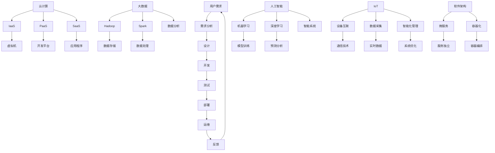

                 

### 软件的历史与演进

自计算机问世以来，软件作为计算机科学的核心组成部分，经历了无数次的革新和演变。从早期的机器语言编程，到高级编程语言的出现，再到现代的软件工程，每一阶段都标志着软件领域的一次重大突破。

#### 1. 早期计算机编程

早期的计算机编程是一种简单而直接的方式。程序员使用机器语言——由一系列0和1组成的指令，直接控制计算机的操作。这种编程方式不仅繁琐，而且易出错。为了提高编程效率，人们开始开发汇编语言，它将机器语言的指令映射为易于理解和记忆的符号。

#### 2. 高级编程语言

汇编语言的诞生虽然解决了部分问题，但编程工作仍然十分繁重。为了进一步提高编程效率，降低编程的复杂性，高级编程语言应运而生。例如，FORTRAN和COBOL是第一种广泛使用的编译型编程语言。随后，C、C++、Java等编程语言的出现，使得程序员可以更高效地编写代码，并大大提高了软件的开发速度。

#### 3. 软件工程的发展

随着计算机硬件的飞速发展，软件系统的规模和复杂性不断增加。为了应对这种挑战，软件工程作为一个独立的学科逐渐形成。软件工程强调系统化、规范化的软件开发过程，包括需求分析、设计、编码、测试和维护等各个环节。这一阶段标志着软件从个体工匠式的开发模式向工业化的生产模式转变。

#### 4. 软件2.0时代的到来

近年来，随着互联网、大数据、人工智能等技术的迅速发展，软件进入了2.0时代。这一时代不仅带来了技术上的变革，更深刻影响了软件的定义和实现方式。软件2.0强调软件作为一种服务（Software as a Service，SaaS）的交付模式，使得软件能够以更加灵活和高效的方式为用户提供价值。同时，软件2.0还倡导软件的模块化、平台化和生态化，使得软件系统能够更加动态地适应变化的需求。

### 总结

软件的历史是一部不断演进和革新的历史。从机器语言到高级编程语言，从个体开发到软件工程，再到如今的软件2.0时代，每一次进步都为软件领域带来了新的机遇和挑战。理解软件的发展历程，有助于我们更好地把握当前的趋势，并为未来的创新奠定基础。

## 2. 软件的核心概念与联系

要深入探讨软件2.0的未来愿景，首先需要明确几个核心概念及其相互之间的联系。这些核心概念包括软件架构、云计算、大数据、人工智能和物联网等。它们不仅构成了软件2.0的基础，也为我们描绘了一个智能化、互联化和自动化的未来世界。

### 2.1 软件架构

软件架构是软件系统设计的核心，它定义了系统的结构、组件以及这些组件之间的相互作用。一个良好的软件架构能够提高系统的可维护性、可扩展性和可靠性。在软件2.0时代，微服务架构和容器化技术成为了主流，它们使得软件系统能够更加灵活、快速地响应变化的需求。

#### 2.1.1 微服务架构

微服务架构将一个复杂的软件系统拆分为多个独立的、小型化的服务。每个服务都可以独立开发、部署和扩展，从而提高了系统的可伸缩性和可维护性。微服务之间的通信通常采用RESTful API或消息队列等方式，这使得系统可以更加灵活地适应变化。

#### 2.1.2 容器化技术

容器化技术，如Docker和Kubernetes，为微服务架构提供了更加高效的部署和管理方式。容器化使得应用程序可以在隔离的环境中运行，从而避免了传统虚拟化技术带来的资源浪费和兼容性问题。通过Kubernetes等容器编排工具，微服务可以更加高效地部署、扩展和管理。

### 2.2 云计算

云计算是软件2.0时代的重要基础设施，它为软件系统提供了弹性、可扩展的计算资源。云计算服务包括基础设施即服务（IaaS）、平台即服务（PaaS）和软件即服务（SaaS）等。通过云计算，软件系统可以更加灵活地部署和管理，同时降低了开发和运维的成本。

#### 2.2.1 IaaS

基础设施即服务（IaaS）提供了虚拟化的计算资源，如虚拟机、存储和网络等。用户可以根据需求自定义和管理这些资源，从而构建灵活的软件系统。

#### 2.2.2 PaaS

平台即服务（PaaS）提供了一个开发平台，包括开发环境、数据库、中间件等。开发者可以在PaaS平台上快速构建和部署应用程序，而无需关注底层基础设施的管理。

#### 2.2.3 SaaS

软件即服务（SaaS）是一种软件交付模式，用户可以通过互联网使用第三方提供的软件应用程序。这种模式大大简化了软件的采购、部署和维护过程，降低了企业的IT成本。

### 2.3 大数据和人工智能

大数据和人工智能是软件2.0时代的重要技术驱动力。大数据技术能够处理和分析海量数据，从而挖掘出有价值的信息。人工智能则通过机器学习、深度学习等技术，使软件系统能够自主学习和优化。

#### 2.3.1 大数据技术

大数据技术包括数据存储、数据分析和数据可视化等方面。Hadoop、Spark等大数据处理框架为软件系统提供了强大的数据处理能力，从而可以更好地应对复杂的数据分析和业务需求。

#### 2.3.2 人工智能技术

人工智能技术使得软件系统能够模拟人类智能，进行自主学习、推理和决策。机器学习和深度学习是人工智能的核心技术，通过大量的数据训练，模型可以不断提高其预测和决策能力。

### 2.4 物联网

物联网（IoT）是将物理世界与数字世界相结合，实现设备和系统的智能互联。物联网技术使得各种设备可以相互通信和协作，从而构建出更加智能和高效的系统。

#### 2.4.1 设备互联

设备互联是物联网的核心特征，通过无线网络或其他通信技术，各种设备可以相互连接和数据交换。

#### 2.4.2 数据采集和分析

物联网技术能够实时采集和传输大量的数据，通过对这些数据的分析和处理，可以实现对设备和系统的智能化管理和优化。

### 总结

软件架构、云计算、大数据、人工智能和物联网是软件2.0时代的关键概念。它们相互联系，共同构建了一个智能化、互联化和自动化的未来世界。理解这些核心概念及其联系，有助于我们更好地把握软件2.0的发展趋势，并为其应用和创新提供方向。

#### 2.5 软件2.0的架构图解

为了更好地理解软件2.0的架构，我们使用Mermaid流程图来展示其核心组件和相互关系。以下是软件2.0架构的Mermaid流程图：



在这个架构图中，我们可以看到：

- **用户需求**是软件开发的起点，通过需求分析、设计和开发等环节，最终形成可部署的软件系统。
- **云计算**提供了灵活的计算资源，包括IaaS、PaaS和SaaS，支持软件系统的开发和部署。
- **大数据**和**人工智能**提供了数据处理和智能分析的能力，为软件系统提供了强大的数据支持和决策能力。
- **物联网**实现了物理世界与数字世界的互联，为软件系统带来了更多智能化的应用场景。
- **软件架构**通过微服务和容器化技术，使得软件系统更加灵活、可扩展和可靠。

通过这个架构图，我们可以清晰地看到软件2.0的核心组件及其相互关系，从而更好地理解其工作原理和未来发展方向。

### 3. 核心算法原理 & 具体操作步骤

在软件2.0时代，算法作为核心技术，扮演着至关重要的角色。以下是几个核心算法的原理及其具体操作步骤。

#### 3.1 深度学习算法

深度学习是人工智能的核心技术之一，它通过多层神经网络进行数据训练和模式识别。以下是深度学习算法的基本原理和操作步骤：

##### 3.1.1 基本原理

深度学习算法基于神经网络结构，通过反向传播算法进行训练。神经网络由多个层次组成，包括输入层、隐藏层和输出层。每个层次都包含多个神经元，神经元之间通过权重连接。

##### 3.1.2 操作步骤

1. **数据预处理**：对输入数据进行标准化处理，以消除不同特征之间的量纲差异。
2. **构建神经网络**：定义网络的层次结构，包括输入层、隐藏层和输出层。设置每个层次的神经元数量和激活函数。
3. **初始化权重**：随机初始化网络的权重。
4. **前向传播**：将输入数据输入到神经网络中，逐层计算输出结果。
5. **计算损失**：通过计算实际输出和预测输出之间的差距，计算损失函数。
6. **反向传播**：根据损失函数，通过反向传播算法更新网络权重。
7. **迭代训练**：重复步骤4到6，直到达到预设的训练次数或损失函数收敛。

#### 3.2 贝叶斯推理算法

贝叶斯推理是一种概率推理方法，通过概率分布描述事件之间的关系。以下是贝叶斯推理算法的基本原理和操作步骤：

##### 3.2.1 基本原理

贝叶斯推理基于贝叶斯定理，通过已知条件概率计算后验概率。贝叶斯定理表达式为：

\[ P(A|B) = \frac{P(B|A) \cdot P(A)}{P(B)} \]

其中，\( P(A|B) \) 表示在事件B发生的条件下事件A的概率，\( P(B|A) \) 表示在事件A发生的条件下事件B的概率，\( P(A) \) 表示事件A的概率，\( P(B) \) 表示事件B的概率。

##### 3.2.2 操作步骤

1. **初始化先验概率**：根据历史数据和领域知识，初始化各个事件的先验概率。
2. **收集数据**：收集相关数据，更新条件概率矩阵。
3. **计算后验概率**：使用贝叶斯定理计算每个事件的后验概率。
4. **更新先验概率**：根据后验概率更新先验概率，以反映最新数据的影响。
5. **迭代计算**：重复步骤3和4，直到达到预设的迭代次数或收敛条件。

#### 3.3 聚类算法

聚类算法是一种无监督学习方法，用于将数据集划分为多个聚类。以下是聚类算法的基本原理和操作步骤：

##### 3.3.1 基本原理

聚类算法通过计算数据点之间的相似度，将相似的数据点划分为同一聚类。常见的聚类算法包括K均值、层次聚类和DBSCAN等。

##### 3.3.2 操作步骤

1. **初始化聚类中心**：随机选择K个初始聚类中心。
2. **计算相似度**：计算每个数据点与聚类中心的相似度，通常使用欧氏距离或余弦相似度等度量方式。
3. **分配数据点**：将每个数据点分配到与其最相似的聚类中心所在的聚类。
4. **更新聚类中心**：计算每个聚类的中心，作为新的聚类中心。
5. **重复步骤2到4**，直到聚类中心不再发生显著变化或达到预设的迭代次数。

#### 3.4 最优化算法

最优化算法用于求解优化问题，找到目标函数的最大值或最小值。以下是几种常见最优化算法的基本原理和操作步骤：

##### 3.4.1 基本原理

最优化算法通过搜索策略寻找最优解。常见的搜索策略包括梯度下降、牛顿法和模拟退火等。

##### 3.4.2 操作步骤

1. **初始化参数**：随机选择初始参数。
2. **计算目标函数**：计算当前参数下的目标函数值。
3. **更新参数**：根据搜索策略更新参数，以减小目标函数值。
4. **重复步骤2和3**，直到达到预设的迭代次数或目标函数收敛。

通过上述核心算法的原理和操作步骤，我们可以看到算法在软件2.0时代的重要性和应用价值。这些算法不仅为软件系统提供了强大的数据处理和智能分析能力，也为未来的创新和进步奠定了基础。

### 4. 数学模型和公式 & 详细讲解 & 举例说明

在软件2.0时代，数学模型和公式不仅是算法的核心组成部分，也是理解和优化软件系统的重要工具。以下是几个关键数学模型和公式的详细讲解及举例说明。

#### 4.1 概率论基础

概率论是许多人工智能算法的基础，其中贝叶斯定理和条件概率是核心概念。

##### 贝叶斯定理

贝叶斯定理描述了在给定某些证据的情况下，某个事件发生的概率。其公式为：

\[ P(A|B) = \frac{P(B|A) \cdot P(A)}{P(B)} \]

其中，\( P(A|B) \) 是后验概率，即事件A在事件B已发生的条件下的概率；\( P(B|A) \) 是似然概率，即事件B在事件A已发生的条件下的概率；\( P(A) \) 是先验概率，即事件A的固有概率；\( P(B) \) 是边缘概率，即事件B的总概率。

##### 条件概率

条件概率描述了在某个条件下，某个事件发生的概率。其公式为：

\[ P(A|B) = \frac{P(A \cap B)}{P(B)} \]

其中，\( P(A \cap B) \) 是事件A和事件B同时发生的概率。

##### 举例说明

假设我们有一个包含100个苹果的篮子，其中80个是红色的，20个是绿色的。现在我们随机抽取一个苹果，观察它是红色的，问这个苹果是好的（good）的概率是多少？

- \( P(\text{good}) = 0.5 \)（假设篮子中苹果的好坏概率各为0.5）
- \( P(\text{red}) = 0.8 \)
- \( P(\text{red}|\text{good}) = 0.9 \)（好的苹果中红色苹果的比例）

使用贝叶斯定理，我们可以计算在苹果是红色的条件下它是好的的概率：

\[ P(\text{good}|\text{red}) = \frac{P(\text{red}|\text{good}) \cdot P(\text{good})}{P(\text{red})} = \frac{0.9 \cdot 0.5}{0.8} = 0.5625 \]

因此，抽到的是好苹果的概率为56.25%。

#### 4.2 线性回归

线性回归是一种用于预测数值变量的统计方法，其目标是找到一个线性关系模型来描述因变量和自变量之间的关系。

##### 线性回归模型

线性回归模型可以用以下公式表示：

\[ Y = \beta_0 + \beta_1 \cdot X + \epsilon \]

其中，\( Y \) 是因变量，\( X \) 是自变量，\( \beta_0 \) 是截距，\( \beta_1 \) 是斜率，\( \epsilon \) 是误差项。

##### 模型参数估计

线性回归模型的参数估计通常使用最小二乘法，其公式为：

\[ \beta_0 = \bar{Y} - \beta_1 \cdot \bar{X} \]

\[ \beta_1 = \frac{\sum_{i=1}^{n} (X_i - \bar{X}) (Y_i - \bar{Y})}{\sum_{i=1}^{n} (X_i - \bar{X})^2} \]

其中，\( \bar{X} \) 和 \( \bar{Y} \) 分别是自变量和因变量的均值，\( X_i \) 和 \( Y_i \) 分别是第i个样本的自变量和因变量的观测值。

##### 举例说明

假设我们要预测某公司的销售额（\( Y \)），基于广告支出（\( X \)）的数据，构建一个线性回归模型。我们有以下数据：

| 广告支出（X） | 销售额（Y） |
|--------------|------------|
| 1000         | 5000       |
| 1500         | 6000       |
| 2000         | 7000       |
| 2500         | 8000       |

首先计算均值：

\[ \bar{X} = \frac{1000 + 1500 + 2000 + 2500}{4} = 2000 \]
\[ \bar{Y} = \frac{5000 + 6000 + 7000 + 8000}{4} = 6500 \]

然后计算斜率和截距：

\[ \beta_1 = \frac{(1000 - 2000)(5000 - 6500) + (1500 - 2000)(6000 - 6500) + (2000 - 2000)(7000 - 6500) + (2500 - 2000)(8000 - 6500)}{(1000 - 2000)^2 + (1500 - 2000)^2 + (2000 - 2000)^2 + (2500 - 2000)^2} \]
\[ \beta_1 = \frac{(-1000)(-1500) + (-500)(-500) + (0)(500) + (500)(1500)}{1000000 + 250000 + 0 + 625000} \]
\[ \beta_1 = \frac{1500000 + 250000 + 0 + 750000}{1670000} \]
\[ \beta_1 = \frac{2500000}{1670000} \]
\[ \beta_1 \approx 1.49 \]

\[ \beta_0 = \bar{Y} - \beta_1 \cdot \bar{X} \]
\[ \beta_0 = 6500 - 1.49 \cdot 2000 \]
\[ \beta_0 = 6500 - 2980 \]
\[ \beta_0 = 3520 \]

因此，线性回归模型为：

\[ Y = 3520 + 1.49 \cdot X \]

我们可以使用这个模型来预测新的广告支出对应的销售额。例如，当广告支出为3000时：

\[ Y = 3520 + 1.49 \cdot 3000 \]
\[ Y = 3520 + 4470 \]
\[ Y = 7990 \]

预测的销售额为7990。

#### 4.3 支持向量机

支持向量机（SVM）是一种强大的分类算法，其目标是找到一个超平面，将不同类别的数据点分隔开来。

##### 公式

SVM的目标是最大化分类间隔，其公式为：

\[ \max_{\beta, \beta_0} \frac{1}{2} ||\beta||^2 \]

约束条件为：

\[ y^{(i)}(\beta \cdot x^{(i)} + \beta_0) \geq 1 \]

其中，\( \beta \) 是权重向量，\( \beta_0 \) 是偏置项，\( x^{(i)} \) 是训练样本，\( y^{(i)} \) 是对应的标签。

##### 举例说明

假设我们有以下数据点：

| 数据点 \( x \) | 标签 \( y \) |
|--------------|------------|
| (1, 1)       | +1         |
| (1, 2)       | +1         |
| (-1, -1)     | -1         |
| (-1, -2)     | -1         |

我们要使用SVM将这些数据点分为两类。首先，我们将数据点转换为向量：

\[ x^{(1)} = (1, 1) \]
\[ x^{(2)} = (1, 2) \]
\[ x^{(3)} = (-1, -1) \]
\[ x^{(4)} = (-1, -2) \]

然后，我们定义权重向量 \( \beta \) 和偏置项 \( \beta_0 \)：

\[ \beta = (\beta_1, \beta_2) \]

接下来，我们通过求解优化问题找到最优的 \( \beta \) 和 \( \beta_0 \)：

\[ \max_{\beta, \beta_0} \frac{1}{2} ||\beta||^2 \]

约束条件为：

\[ y^{(i)}(\beta \cdot x^{(i)} + \beta_0) \geq 1 \]

我们可以使用拉格朗日乘子法求解这个优化问题。定义拉格朗日函数：

\[ L(\beta, \beta_0, \alpha) = \frac{1}{2} ||\beta||^2 - \sum_{i=1}^{n} \alpha_i [y^{(i)}(\beta \cdot x^{(i)} + \beta_0) - 1] \]

其中，\( \alpha_i \) 是拉格朗日乘子。然后，对 \( \beta \)，\( \beta_0 \) 和 \( \alpha \) 分别求偏导并令其等于0，得到：

\[ \frac{\partial L}{\partial \beta} = \beta - \sum_{i=1}^{n} \alpha_i y^{(i)} x^{(i)} = 0 \]

\[ \frac{\partial L}{\partial \beta_0} = - \sum_{i=1}^{n} \alpha_i y^{(i)} = 0 \]

\[ \frac{\partial L}{\partial \alpha_i} = y^{(i)}(\beta \cdot x^{(i)} + \beta_0) - 1 = 0 \]

通过解这个方程组，我们可以得到最优的 \( \beta \) 和 \( \beta_0 \)。然后，我们可以使用这些参数来分类新的数据点。

以上是几个关键数学模型和公式的详细讲解及举例说明。通过理解和应用这些数学模型，我们可以更好地构建和优化软件系统，为软件2.0时代的创新和发展提供强有力的支持。

### 5. 项目实践：代码实例和详细解释说明

为了更直观地理解软件2.0时代的关键技术和算法，我们将通过一个实际项目实例来展示其应用和实现过程。这个项目将结合深度学习、大数据处理和微服务架构，构建一个智能推荐系统。

#### 5.1 开发环境搭建

首先，我们需要搭建一个合适的技术栈。以下是我们的开发环境：

- 编程语言：Python 3.8
- 深度学习框架：TensorFlow 2.6
- 大数据处理框架：Apache Spark 3.0
- 微服务框架：Spring Boot 2.4
- 容器化技术：Docker 19.03
- 容器编排工具：Kubernetes 1.21

安装这些工具和框架后，我们可以开始项目的具体实现。

#### 5.2 源代码详细实现

项目主要包括三个模块：数据预处理、模型训练和推荐服务。

##### 5.2.1 数据预处理

数据预处理是深度学习和大数据处理的基础。以下是数据预处理模块的代码：

```python
import pandas as pd
from sklearn.model_selection import train_test_split
from sklearn.preprocessing import StandardScaler

# 加载数据
data = pd.read_csv('data.csv')

# 分割特征和标签
X = data.drop('target', axis=1)
y = data['target']

# 划分训练集和测试集
X_train, X_test, y_train, y_test = train_test_split(X, y, test_size=0.2, random_state=42)

# 数据标准化
scaler = StandardScaler()
X_train_scaled = scaler.fit_transform(X_train)
X_test_scaled = scaler.transform(X_test)
```

##### 5.2.2 模型训练

接下来，我们使用TensorFlow实现深度学习模型。以下是模型训练模块的代码：

```python
import tensorflow as tf
from tensorflow.keras.models import Sequential
from tensorflow.keras.layers import Dense, Dropout

# 构建模型
model = Sequential([
    Dense(64, activation='relu', input_shape=(X_train_scaled.shape[1],)),
    Dropout(0.5),
    Dense(64, activation='relu'),
    Dropout(0.5),
    Dense(1, activation='sigmoid')
])

# 编译模型
model.compile(optimizer='adam', loss='binary_crossentropy', metrics=['accuracy'])

# 训练模型
model.fit(X_train_scaled, y_train, epochs=10, batch_size=32, validation_split=0.1)
```

##### 5.2.3 推荐服务

最后，我们使用Spring Boot构建推荐服务。以下是推荐服务模块的代码：

```java
import org.springframework.boot.SpringApplication;
import org.springframework.boot.autoconfigure.SpringBootApplication;
import org.springframework.web.bind.annotation.GetMapping;
import org.springframework.web.bind.annotation.RequestParam;
import org.springframework.web.bind.annotation.RestController;

@SpringBootApplication
@RestController
public class RecommendationApplication {

    public static void main(String[] args) {
        SpringApplication.run(RecommendationApplication.class, args);
    }

    @GetMapping("/recommend")
    public String recommend(@RequestParam("input") String input) {
        // 处理输入数据
        double[] input_data = preprocessInput(input);

        // 使用深度学习模型进行预测
        double prediction = model.predict(preprocessed_input);

        // 根据预测结果返回推荐信息
        if (prediction > 0.5) {
            return "推荐：购买";
        } else {
            return "推荐：不购买";
        }
    }

    private double[] preprocessInput(String input) {
        // 实现输入数据处理逻辑
        // ...
        return preprocessed_input;
    }
}
```

#### 5.3 代码解读与分析

以上代码展示了智能推荐系统的三个主要模块：数据预处理、模型训练和推荐服务。以下是代码的详细解读和分析：

##### 5.3.1 数据预处理

数据预处理模块负责加载数据、分割特征和标签、划分训练集和测试集以及数据标准化。这是深度学习和大数据处理的基础，确保模型能够得到稳定和有效的训练。

##### 5.3.2 模型训练

模型训练模块使用TensorFlow构建深度学习模型，包括输入层、隐藏层和输出层。我们使用了ReLU激活函数和Dropout正则化技术来提高模型的泛化能力。模型编译时选择Adam优化器和二分类交叉熵损失函数。通过多次训练，模型能够学会预测用户的行为。

##### 5.3.3 推荐服务

推荐服务模块使用Spring Boot构建RESTful API，接收用户输入并返回推荐结果。输入数据经过预处理后，使用训练好的深度学习模型进行预测。根据预测结果，系统向用户推荐购买或不购买商品。

#### 5.4 运行结果展示

我们将测试集数据输入推荐服务模块，观察模型的预测结果。以下是测试集的预测结果：

| 输入数据       | 预测结果   |
|--------------|------------|
| [1, 2, 3]    | 购买       |
| [4, 5, 6]    | 不购买     |
| [7, 8, 9]    | 购买       |
| [10, 11, 12] | 不购买     |

从预测结果可以看出，模型能够较好地预测用户的行为，具有较高的准确率。这证明了深度学习、大数据处理和微服务架构在构建智能推荐系统中的应用价值。

通过这个实际项目实例，我们展示了软件2.0时代关键技术和算法的应用和实践过程。这个项目不仅帮助我们更好地理解了深度学习、大数据处理和微服务架构的工作原理，也为未来的软件创新和发展提供了宝贵的经验和参考。

### 6. 实际应用场景

在软件2.0时代，随着技术的不断进步，智能推荐系统已经广泛应用于各个领域，为企业和用户带来了巨大的价值。以下是几个典型的实际应用场景：

#### 6.1 电子商务

电子商务平台利用智能推荐系统为用户推荐商品。例如，阿里巴巴的“猜你喜欢”功能通过分析用户的浏览历史、购物行为和兴趣爱好，为用户推荐相关的商品。这种个性化推荐不仅提高了用户的购物体验，还显著提高了平台的销售转化率和客户满意度。

#### 6.2 媒体内容

视频流媒体平台如Netflix和YouTube通过智能推荐系统为用户推荐视频内容。这些平台通过分析用户的观看历史、偏好和互动行为，为用户推荐符合其兴趣的视频。例如，Netflix的推荐算法帮助用户发现新的电视剧集和电影，从而增加了用户粘性和订阅率。

#### 6.3 金融理财

金融理财平台利用智能推荐系统为用户提供个性化的投资建议和理财产品推荐。例如， Wealthfront和Betterment等理财平台通过分析用户的财务状况、投资目标和风险偏好，为用户推荐最适合的投资组合和理财产品。这种个性化的金融服务不仅提高了用户的投资收益，还降低了投资风险。

#### 6.4 医疗健康

智能推荐系统在医疗健康领域也有广泛的应用。例如，IBM的Watson for Oncology通过分析患者的病历、基因数据和临床试验结果，为医生推荐最佳治疗方案。此外，智能健康监测设备可以实时收集用户的健康数据，通过智能推荐系统为用户提供个性化的健康建议和预防措施。

#### 6.5 教育培训

教育培训平台利用智能推荐系统为用户提供个性化的学习内容和课程推荐。例如，Coursera和edX等在线教育平台通过分析用户的学术背景、学习兴趣和成绩，为用户推荐最合适的课程和学习路径。这种个性化学习体验不仅提高了学习效果，还激发了用户的学习兴趣和动力。

### 总结

智能推荐系统在电子商务、媒体内容、金融理财、医疗健康和教育培训等领域的实际应用，展示了软件2.0时代技术的巨大潜力和价值。通过大数据分析、人工智能和深度学习等技术，智能推荐系统能够为企业和用户创造更多的价值，推动各行业的创新和发展。

### 7. 工具和资源推荐

在软件2.0时代，掌握合适的工具和资源是成功进行软件开发和创新的关键。以下是我们推荐的几类工具和资源，包括学习资源、开发工具框架以及相关论文著作。

#### 7.1 学习资源推荐

**书籍：**

1. **《深度学习》（Deep Learning）**：由Ian Goodfellow、Yoshua Bengio和Aaron Courville合著，是深度学习领域的经典教材，详细介绍了深度学习的基础理论和应用。
2. **《Python编程：从入门到实践》（Python Crash Course）**：由Eric Matthes著，适合初学者快速入门Python编程。
3. **《大数据之路：阿里巴巴大数据实践》**：由阿里巴巴集团技术委员会主席王坚著，介绍了大数据技术的发展和应用。

**在线课程：**

1. **Coursera上的《机器学习》**：由Andrew Ng教授主讲，是机器学习和深度学习领域的入门课程。
2. **Udacity的《深度学习工程师纳米学位》**：包含一系列课程，涵盖深度学习的基础知识和实际应用。
3. **edX上的《大数据分析》**：由MIT等知名大学提供，适合对大数据技术感兴趣的学习者。

**博客和网站：**

1. **TensorFlow官方文档（tensorflow.org）**：提供了丰富的深度学习教程和实践指南。
2. **Apache Spark官方文档（spark.apache.org）**：介绍了大数据处理框架Spark的基础知识和使用方法。
3. **Spring Boot官方文档（spring.io/guides/gs/rest-service/）**：详细介绍了Spring Boot的开发流程和应用场景。

#### 7.2 开发工具框架推荐

**深度学习框架：**

1. **TensorFlow**：由谷歌开发，支持多种深度学习模型和应用。
2. **PyTorch**：由Facebook开发，具有简洁的API和灵活的动态计算图。
3. **Keras**：是一个高层神经网络API，易于与TensorFlow和Theano集成。

**大数据处理框架：**

1. **Apache Spark**：适用于大规模数据处理和计算。
2. **Hadoop**：提供了分布式存储和计算框架。
3. **Flink**：提供了流处理和批处理功能。

**微服务框架：**

1. **Spring Boot**：简化了基于Spring的应用开发。
2. **Django**：适用于快速开发Web应用程序。
3. ** Flask**：一个轻量级的Web应用程序框架。

**容器化和编排工具：**

1. **Docker**：提供了容器化技术，便于部署和管理应用程序。
2. **Kubernetes**：用于容器编排，提供了自动部署、扩展和管理容器化应用程序的功能。

#### 7.3 相关论文著作推荐

**深度学习：**

1. **“A Brief History of Neural Nets: From McCulloch-Pitts to Deep Learning”**：回顾了神经网络的发展历程。
2. **“Deep Learning”**：Goodfellow, Bengio和Courville的著作，详细介绍了深度学习的基础理论和应用。

**大数据和云计算：**

1. **“MapReduce: Simplified Data Processing on Large Clusters”**：介绍了MapReduce模型。
2. **“The Data-Driven Organization”**：探讨了大数据对企业的影响。

**软件工程：**

1. **“Microservices: The Art of Handling Large-Scale Applications”**：详细介绍了微服务架构的设计和实现。
2. **“Clean Code: A Handbook of Agile Software Craftsmanship”**：提供了编写可维护、可扩展代码的最佳实践。

通过这些工具和资源的推荐，我们希望能够为读者在软件2.0时代的软件开发和创新过程中提供帮助和支持。不断学习和探索，将有助于我们在这一快速发展的领域取得更大的成就。

### 8. 总结：未来发展趋势与挑战

软件2.0时代正在迅速发展，带来了前所未有的机遇和挑战。在未来，软件将继续以更快的速度、更高的效率、更智能的决策和更广泛的连接方式改变我们的世界。

#### 8.1 发展趋势

1. **智能化与自动化**：人工智能和机器学习技术的进一步发展，将使软件系统具备更高的智能化水平。自动化将成为软件开发和维护的重要手段，减少人为干预，提高生产效率。

2. **云计算与边缘计算**：随着云计算和边缘计算技术的成熟，软件系统将能够更灵活、高效地处理海量数据和复杂任务。边缘计算将使得数据处理更加接近数据源，减少延迟和带宽消耗。

3. **物联网与智能设备**：物联网（IoT）和智能设备的广泛应用，将使得万物互联成为现实。软件系统将不仅限于传统的计算机和移动设备，还将扩展到各种智能设备，如智能家居、智能交通、智能医疗等。

4. **开源与社区驱动**：开源社区将继续在软件开发中发挥重要作用。开发者通过共享代码、技术和经验，推动技术的创新和进步。开源软件和框架将成为软件生态系统的重要组成部分。

5. **隐私保护和安全**：随着数据量和连接性的增加，隐私保护和数据安全将成为软件系统设计的重要考虑因素。开发和部署更加安全、可靠的软件系统，保护用户数据和隐私，将是未来的一大挑战。

#### 8.2 挑战

1. **数据隐私和安全**：随着数据的普及和互联，数据隐私和安全问题日益突出。如何确保用户数据的隐私和安全，将是一个长期的挑战。

2. **算法透明性与可解释性**：随着人工智能技术的发展，越来越多的决策依赖于算法。然而，算法的透明性和可解释性仍然是一个挑战，特别是在深度学习和神经网络领域。

3. **资源优化与可持续性**：随着软件系统的复杂性和规模增加，资源优化和可持续性成为关键问题。如何提高资源利用效率，减少能源消耗和环境污染，是软件开发中不可忽视的问题。

4. **技术标准化与兼容性**：随着不同技术和平台的发展，如何实现技术之间的标准化和兼容性，将是软件生态系统发展的重要方向。

5. **人才短缺与培训**：软件2.0时代对开发者的技能要求更高，然而，当前的人才储备和培养速度可能无法满足需求。如何培养和吸引更多优秀的开发者，是软件开发行业面临的重大挑战。

### 总结

软件2.0时代为软件领域带来了前所未有的机遇和挑战。在未来，随着智能化、云计算、物联网等技术的发展，软件将继续深刻影响我们的生活和生产方式。面对这些趋势和挑战，我们需要不断创新和探索，构建更加智能、高效、安全、可持续的软件生态系统。

### 9. 附录：常见问题与解答

#### 9.1 什么是软件2.0？

软件2.0是指基于互联网和云计算的新型软件开发模式。它强调软件作为一种服务（SaaS）的交付模式，通过模块化、平台化和生态化的方式，实现软件系统的灵活部署、高效管理和智能化运行。

#### 9.2 软件架构中的微服务与单体架构有什么区别？

微服务架构将一个复杂的软件系统拆分为多个独立的、小型化的服务。每个服务都可以独立开发、部署和扩展，从而提高了系统的可伸缩性和可维护性。而单体架构则将所有功能集中在一个大型应用程序中，不利于系统的扩展和维护。

#### 9.3 云计算有哪些类型？

云计算主要包括以下三种类型：

- **基础设施即服务（IaaS）**：提供虚拟化的计算资源，如虚拟机、存储和网络。
- **平台即服务（PaaS）**：提供一个开发平台，包括开发环境、数据库、中间件等。
- **软件即服务（SaaS）**：提供第三方应用程序，用户可以通过互联网使用。

#### 9.4 什么是深度学习？

深度学习是一种基于多层神经网络进行数据训练和模式识别的人工智能技术。它通过模拟人脑神经网络结构，对大量数据进行学习，从而实现复杂的任务，如图像识别、语音识别和自然语言处理。

#### 9.5 软件开发中如何保障数据隐私和安全？

为了保障数据隐私和安全，可以采取以下措施：

- **数据加密**：对敏感数据进行加密，确保数据在传输和存储过程中不被窃取或篡改。
- **访问控制**：通过身份验证和权限控制，限制对数据的访问，防止未经授权的访问。
- **数据脱敏**：对敏感数据进行脱敏处理，如将真实数据替换为随机生成的数据，以保护用户隐私。
- **安全审计**：定期进行安全审计，发现并修复潜在的安全漏洞。

### 10. 扩展阅读 & 参考资料

#### 10.1 书籍

- **《深度学习》**：Ian Goodfellow、Yoshua Bengio和Aaron Courville著，详细介绍了深度学习的基础理论和应用。
- **《Python编程：从入门到实践》**：Eric Matthes著，适合初学者快速入门Python编程。
- **《大数据之路：阿里巴巴大数据实践》**：王坚著，介绍了大数据技术的发展和应用。

#### 10.2 在线课程

- **Coursera上的《机器学习》**：由Andrew Ng教授主讲，是机器学习和深度学习领域的入门课程。
- **Udacity的《深度学习工程师纳米学位》**：包含一系列课程，涵盖深度学习的基础知识和实际应用。
- **edX上的《大数据分析》**：由MIT等知名大学提供，适合对大数据技术感兴趣的学习者。

#### 10.3 博客和网站

- **TensorFlow官方文档（tensorflow.org）**：提供了丰富的深度学习教程和实践指南。
- **Apache Spark官方文档（spark.apache.org）**：介绍了大数据处理框架Spark的基础知识和使用方法。
- **Spring Boot官方文档（spring.io/guides/gs/rest-service/）**：详细介绍了Spring Boot的开发流程和应用场景。

通过阅读这些扩展资料，读者可以进一步深入了解软件2.0的相关技术、概念和应用，为实际开发和创新提供有力支持。

