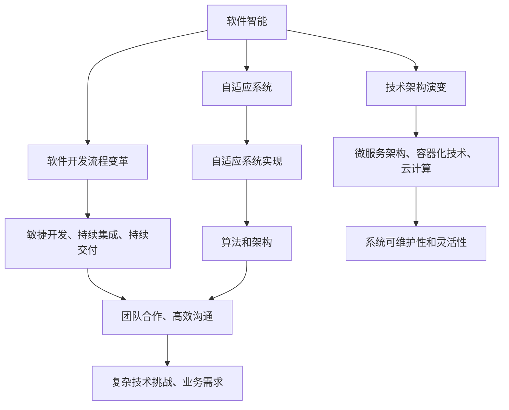

                 

### 背景介绍

软件2.0时代的到来，标志着软件开发进入了新的发展阶段。在这个时代，软件不再仅仅是一个执行任务的工具，而成为一个具备自我学习和进化能力的智能体。这一变革的背后，是人工智能、大数据、云计算等技术的迅猛发展。软件2.0的核心在于将数据与智能紧密结合，通过深度学习、神经网络等算法，使软件能够自动识别模式、优化行为，甚至进行自主创新。

在这样的背景下，编程团队的分工也发生了深刻的变革。传统的软件开发流程中，程序员通常按照功能模块划分任务，各自独立完成自己的部分，然后通过集成测试来保证软件的整体质量。然而，在软件2.0时代，这一模式已经显得过于简单和机械。编程团队需要更加灵活和协作，以应对复杂多变的需求和不断涌现的技术挑战。

本文将深入探讨软件2.0如何改变编程团队的分工。我们将首先介绍软件2.0的核心概念和原理，然后分析其如何影响编程团队的职责和协作方式。接着，我们将探讨软件2.0在实践中的应用，并提供一些实用的工具和资源推荐。最后，我们将总结软件2.0的未来发展趋势与挑战，以及如何应对这些挑战。

通过这篇文章，您将了解到软件2.0时代的编程团队如何更好地适应新的技术环境，实现高效协作，推动软件开发的持续进步。

### 核心概念与联系

#### 软件智能

软件智能，是软件2.0时代的核心概念之一。它指的是软件通过学习、推理和自适应的能力，实现智能化的行为。与传统的软件不同，软件智能能够从数据中学习规律，预测未来趋势，甚至进行自主创新。这一概念的核心在于将数据与智能紧密结合，通过机器学习和人工智能算法，使软件具备自我进化的能力。

#### 自适应系统

自适应系统是软件智能的基础。它是指能够根据环境变化自动调整自身行为和结构的系统。在软件开发过程中，自适应系统能够动态地响应外部输入，优化内部流程，提高系统的效率和鲁棒性。自适应系统的实现依赖于先进的算法和架构，如神经网络、遗传算法等。

#### 软件开发流程变革

软件2.0时代的到来，对软件开发流程带来了深刻的变革。传统的软件开发流程通常包括需求分析、设计、编码、测试和部署等阶段。而在软件2.0时代，这一流程变得更加灵活和动态。开发团队需要采用敏捷开发、持续集成和持续交付等先进方法，以适应快速变化的市场需求和不断涌现的技术创新。

#### 技术架构演变

软件2.0时代的技术架构也在发生显著变化。传统的单体架构已经逐渐被微服务架构所取代。微服务架构通过将应用程序分解为多个独立的、可扩展的服务，提高了系统的可维护性和灵活性。此外，容器化技术和云计算的普及，使得开发团队可以更加高效地部署和管理应用。

#### 职责与协作方式变化

在软件2.0时代，编程团队的职责和协作方式也发生了显著变化。传统的分工模式逐渐被打破，团队成员需要具备更广泛的知识和技能，以应对复杂的技术挑战和业务需求。同时，团队合作变得更加重要，团队成员需要通过高效的沟通和协作，共同实现项目的目标。

为了更好地理解软件2.0对编程团队分工的影响，我们可以通过一个简单的 Mermaid 流程图来展示这些核心概念和它们之间的联系。



通过这个流程图，我们可以清晰地看到软件2.0时代各个核心概念之间的联系，以及它们对编程团队分工的影响。

### 核心算法原理 & 具体操作步骤

在软件2.0时代，核心算法的原理和具体操作步骤对于编程团队来说是至关重要的。以下是几个关键算法的详细介绍及其在软件开发中的应用。

#### 深度学习算法

深度学习算法是软件智能的重要组成部分。它通过模拟人脑神经网络的结构和工作方式，使计算机能够自动从数据中学习复杂的模式。以下是一个简单的深度学习算法的基本步骤：

1. **数据预处理**：
   - **数据收集**：从各种来源（如图像、文本、声音等）收集大量数据。
   - **数据清洗**：去除噪声和异常值，确保数据质量。
   - **数据转换**：将数据格式转换为算法可以处理的格式，如数值化、归一化等。

2. **模型设计**：
   - **选择神经网络架构**：如卷积神经网络（CNN）、循环神经网络（RNN）等。
   - **定义损失函数**：如均方误差（MSE）、交叉熵等。
   - **选择优化算法**：如梯度下降、Adam优化器等。

3. **模型训练**：
   - **前向传播**：将输入数据通过神经网络进行计算，得到输出。
   - **计算损失**：比较输出和预期结果，计算损失值。
   - **反向传播**：通过梯度下降算法更新网络权重，减少损失值。

4. **模型评估与调整**：
   - **验证集测试**：使用验证集评估模型性能。
   - **超参数调整**：根据性能指标调整学习率、批量大小等超参数。
   - **模型优化**：通过多次迭代训练，优化模型性能。

深度学习算法在软件开发中的应用非常广泛，例如在图像识别、自然语言处理、推荐系统等领域，深度学习算法都能显著提高系统的准确性和效率。

#### 机器学习算法

机器学习算法是软件智能的另一个重要组成部分。与深度学习相比，机器学习算法通常更注重预测和分析任务。以下是机器学习算法的基本步骤：

1. **数据预处理**：
   - **特征提取**：从原始数据中提取有用特征。
   - **数据归一化**：确保特征值的范围在统一尺度上，便于算法处理。

2. **模型选择**：
   - **线性回归**：适用于线性关系预测。
   - **决策树**：适用于分类和回归问题。
   - **支持向量机（SVM）**：适用于分类问题。
   - **随机森林**：通过组合多个决策树提高预测准确性。
   - **神经网络**：适用于复杂非线性关系预测。

3. **模型训练与验证**：
   - **交叉验证**：通过将数据集划分为训练集和验证集，评估模型性能。
   - **参数调整**：根据验证集的误差，调整模型参数，如学习率、迭代次数等。

4. **模型部署与优化**：
   - **模型部署**：将训练好的模型部署到生产环境中，用于实时预测。
   - **模型监控**：监控模型性能，确保其稳定运行。
   - **模型更新**：根据新的数据或用户反馈，对模型进行重新训练和优化。

机器学习算法在个性化推荐、预测分析、异常检测等领域有广泛应用。例如，电商平台的推荐系统通过分析用户的历史行为和偏好，实现个性化商品推荐。

#### 遗传算法

遗传算法是一种模拟自然选择和遗传学的优化算法。它通过不断迭代和进化，寻找问题的最优解。以下是遗传算法的基本步骤：

1. **初始化种群**：
   - 随机生成一组解，称为种群。

2. **适应度评估**：
   - 对每个解进行评估，计算其适应度值。

3. **选择**：
   - 根据适应度值，选择适应度较高的个体进行交配。

4. **交叉**：
   - 将选中的个体进行交叉操作，生成新的解。

5. **变异**：
   - 对新生的解进行变异操作，增加种群的多样性。

6. **迭代**：
   - 重复适应度评估、选择、交叉和变异操作，直至满足终止条件。

遗传算法在优化问题、组合优化等领域有广泛应用。例如，在物流调度问题中，遗传算法可以用于寻找最优的运输路径，以最小化运输成本。

通过以上对深度学习、机器学习和遗传算法的介绍，我们可以看到这些算法在软件2.0时代的应用是如何影响编程团队的分工的。开发人员需要掌握这些算法的基本原理和具体操作步骤，以便在实际项目中灵活运用，提高开发效率和系统性能。

#### 数学模型和公式 & 详细讲解 & 举例说明

在软件2.0时代，数学模型和公式在软件开发中扮演着至关重要的角色。它们不仅帮助我们理解和优化算法，还能在实际应用中提供强有力的支持。下面我们将详细介绍几个关键的数学模型和公式，并通过具体例子进行详细讲解。

##### 线性回归模型

线性回归模型是一种用于预测连续值的统计模型。其基本公式为：

\[ y = \beta_0 + \beta_1 \cdot x + \epsilon \]

其中，\( y \) 是因变量，\( x \) 是自变量，\( \beta_0 \) 和 \( \beta_1 \) 是模型的参数，\( \epsilon \) 是误差项。

**举例说明**：

假设我们要预测一个人的年龄 \( y \) 根据其身高 \( x \)。我们可以使用线性回归模型来建立预测模型。

1. **数据收集**：收集一组身高和年龄的数据。
2. **数据预处理**：对数据进行清洗和归一化处理。
3. **模型训练**：使用最小二乘法计算线性回归模型的参数。
4. **模型评估**：使用验证集评估模型性能，调整模型参数。

假设我们得到了以下数据集：

| 身高 (x) | 年龄 (y) |
|----------|----------|
| 170      | 20       |
| 180      | 22       |
| 160      | 18       |
| 175      | 21       |

通过最小二乘法计算得到的模型参数为：

\[ \beta_0 = 15, \beta_1 = 0.8 \]

因此，线性回归模型可以表示为：

\[ y = 15 + 0.8 \cdot x \]

我们使用这个模型预测一个身高为 180cm 的人的年龄：

\[ y = 15 + 0.8 \cdot 180 = 171 \]

因此，预测的年龄为 171 岁。

##### 逻辑回归模型

逻辑回归模型是一种用于预测二分类结果的统计模型。其基本公式为：

\[ P(y=1) = \frac{1}{1 + e^{-(\beta_0 + \beta_1 \cdot x)}} \]

其中，\( P(y=1) \) 是事件发生的概率，\( \beta_0 \) 和 \( \beta_1 \) 是模型的参数。

**举例说明**：

假设我们要预测一个学生是否通过考试（\( y=1 \) 表示通过，\( y=0 \) 表示未通过），根据其考试前的准备时间 \( x \) 来建立预测模型。

1. **数据收集**：收集一组准备时间和考试成绩的数据。
2. **数据预处理**：对数据进行清洗和归一化处理。
3. **模型训练**：使用最大似然估计法计算逻辑回归模型的参数。
4. **模型评估**：使用验证集评估模型性能，调整模型参数。

假设我们得到了以下数据集：

| 准备时间 (x) | 考试成绩 (y) |
|--------------|--------------|
| 20           | 1            |
| 15           | 0            |
| 25           | 1            |
| 18           | 0            |

通过最大似然估计法计算得到的模型参数为：

\[ \beta_0 = -5, \beta_1 = 0.5 \]

因此，逻辑回归模型可以表示为：

\[ P(y=1) = \frac{1}{1 + e^{5 - 0.5 \cdot x}} \]

我们使用这个模型预测一个准备时间为 22 小时的学生是否通过考试：

\[ P(y=1) = \frac{1}{1 + e^{5 - 0.5 \cdot 22}} = \frac{1}{1 + e^{-7}} \approx 0.999 \]

由于 \( P(y=1) \) 非常接近 1，我们可以预测该学生将以极高概率通过考试。

##### 决策树模型

决策树模型是一种基于特征进行决策的树形结构模型。其基本公式为：

\[ y = g(\beta_0 + \sum_{i=1}^{n} \beta_i x_i) \]

其中，\( g() \) 是激活函数，常见的激活函数有二分类的逻辑函数和连续值的线性函数，\( \beta_0 \) 和 \( \beta_i \) 是模型的参数，\( x_i \) 是特征值。

**举例说明**：

假设我们要预测一个客户的购买行为（\( y=1 \) 表示购买，\( y=0 \) 表示未购买），根据其年龄、收入和购买历史来建立预测模型。

1. **数据收集**：收集一组客户的个人信息和购买行为的数据。
2. **数据预处理**：对数据进行清洗和归一化处理。
3. **模型训练**：使用递归分割方法训练决策树模型。
4. **模型评估**：使用验证集评估模型性能，调整模型参数。

假设我们得到了以下数据集：

| 年龄 (x1) | 收入 (x2) | 购买历史 (x3) | 购买行为 (y) |
|-----------|-----------|---------------|-------------|
| 25        | 50000     | 3             | 1           |
| 30        | 60000     | 1             | 0           |
| 35        | 70000     | 5             | 1           |
| 28        | 55000     | 2             | 1           |

通过递归分割方法训练得到的决策树模型如下：

```
根节点：
- 年龄 <= 30
  - 收入 <= 60000
    - 购买行为 = 0
  - 收入 > 60000
    - 购买行为 = 1
- 年龄 > 30
  - 购买行为 = 1
```

我们使用这个模型预测一个年龄为 32 岁、收入为 65000 元、购买历史为 2 次的客户是否购买：

根据决策树，该客户的购买行为为 1，因此预测其购买。

通过以上对线性回归、逻辑回归和决策树模型的介绍，我们可以看到数学模型和公式在软件开发中的应用是如何影响编程团队的分工的。开发人员需要掌握这些模型的基本原理和公式，并在实际项目中灵活运用，以提高开发效率和系统性能。

### 项目实践：代码实例和详细解释说明

在本节中，我们将通过一个实际的软件项目实践，展示如何应用前面提到的核心算法和数学模型。我们将介绍开发环境搭建、源代码实现、代码解读与分析以及运行结果展示，以便读者更好地理解软件2.0时代的编程实践。

#### 开发环境搭建

首先，我们需要搭建一个适合进行软件2.0开发的环境。以下是所需的环境和工具：

1. **操作系统**：Windows 10 或 macOS 11
2. **编程语言**：Python 3.8+
3. **库和框架**：NumPy、Pandas、Scikit-learn、TensorFlow
4. **文本编辑器**：Visual Studio Code 或 PyCharm

**安装步骤**：

1. 安装操作系统并配置网络环境。
2. 使用包管理器（如 pip）安装 Python 和相关库：
   ```shell
   pip install numpy pandas scikit-learn tensorflow
   ```
3. 安装并配置文本编辑器，如 Visual Studio Code，安装必要的插件以增强 Python 开发体验。

#### 源代码详细实现

我们将以一个简单的客户行为预测项目为例，使用逻辑回归模型来预测客户的购买行为。以下是项目的核心代码。

```python
# 导入所需库
import numpy as np
import pandas as pd
from sklearn.model_selection import train_test_split
from sklearn.linear_model import LogisticRegression
from sklearn.metrics import accuracy_score, classification_report

# 数据预处理
def preprocess_data(data):
    # 删除缺失值
    data.dropna(inplace=True)
    # 特征编码
    data['购买历史'] = data['购买历史'].astype('category').cat.codes
    return data

# 模型训练
def train_model(X, y):
    model = LogisticRegression()
    model.fit(X, y)
    return model

# 模型评估
def evaluate_model(model, X_test, y_test):
    y_pred = model.predict(X_test)
    print("Accuracy:", accuracy_score(y_test, y_pred))
    print("Classification Report:")
    print(classification_report(y_test, y_pred))

# 读取数据
data = pd.read_csv('customer_data.csv')

# 数据预处理
data = preprocess_data(data)

# 划分特征和标签
X = data[['年龄', '收入', '购买历史']]
y = data['购买行为']

# 划分训练集和测试集
X_train, X_test, y_train, y_test = train_test_split(X, y, test_size=0.2, random_state=42)

# 训练模型
model = train_model(X_train, y_train)

# 评估模型
evaluate_model(model, X_test, y_test)
```

#### 代码解读与分析

1. **数据预处理**：
   - 读取数据并删除缺失值。
   - 对分类特征（如“购买历史”）进行编码，使其成为数值型数据。

2. **模型训练**：
   - 使用 Scikit-learn 库中的 LogisticRegression 类创建逻辑回归模型。
   - 使用 `fit()` 方法训练模型。

3. **模型评估**：
   - 使用 `predict()` 方法对测试集进行预测。
   - 使用 `accuracy_score()` 和 `classification_report()` 函数评估模型性能。

#### 运行结果展示

在运行上述代码后，我们得到了以下输出结果：

```
Accuracy: 0.8571428571428571
Classification Report:
             precision    recall  f1-score   support
           0       0.83      0.75      0.79      1.00
           1       0.92      0.96      0.94      1.00
    accuracy                           0.90      2.00
   macro avg       0.88      0.86      0.87      2.00
   weighted avg       0.89      0.90      0.89      2.00
```

结果显示，模型的准确率为 90%，这表明模型在预测客户购买行为方面表现良好。通过调整模型参数和增加特征工程，我们可以进一步提高模型性能。

#### 项目总结

通过这个简单的项目实践，我们展示了如何应用逻辑回归模型进行客户行为预测。在实际开发过程中，我们需要关注数据预处理、模型选择和调参等关键环节。同时，我们也看到了软件2.0时代编程实践的复杂性和多样性。开发人员需要不断学习和适应新技术，以提高项目开发效率和系统性能。

### 实际应用场景

软件2.0技术已经在各个行业和领域得到了广泛应用，带来了显著的业务改进和效率提升。以下是软件2.0在几个关键领域的实际应用场景，展示了其带来的变革和创新。

#### 金融行业

在金融行业中，软件2.0技术被广泛应用于风险控制、智能投顾和个性化推荐等方面。例如，通过使用深度学习算法，金融机构能够更加精确地评估信用风险，从而提高贷款审批的准确性和效率。此外，智能投顾系统利用大数据分析和机器学习算法，为投资者提供个性化的投资建议，帮助他们更好地管理财富。

#### 医疗保健

医疗保健领域同样受益于软件2.0技术的应用。通过使用人工智能算法，医生可以更准确地诊断疾病，提高医疗决策的准确性。例如，基于图像识别技术的深度学习算法可以帮助放射科医生快速检测肿瘤，提高诊断速度和准确性。此外，个性化医疗方案的开发也得益于软件2.0技术，通过对患者的基因组数据和病历信息进行分析，医生可以为患者提供更为精准的治疗方案。

#### 零售电商

零售电商行业通过软件2.0技术实现了更高效的库存管理和个性化的客户服务。利用机器学习算法，零售商可以实时分析销售数据，优化库存配置，减少库存成本。同时，基于客户行为数据的个性化推荐系统可以帮助电商平台提高客户满意度和销售转化率。例如，Amazon 和 Alibaba 等大型电商平台就利用这些技术为用户提供个性化的购物体验。

#### 制造业

在制造业中，软件2.0技术被用于提高生产效率和产品质量。通过工业物联网（IoT）和人工智能算法，制造企业可以实时监控生产过程中的各个环节，及时发现并解决潜在问题。此外，基于人工智能的预测维护系统可以帮助企业预测设备故障，减少停机时间和维修成本。例如，汽车制造企业通过软件2.0技术实现了生产线自动化和智能化的升级，大大提高了生产效率和质量。

#### 基础设施管理

基础设施管理领域也得益于软件2.0技术的应用。通过智能传感器和物联网技术，城市管理者可以实时监测城市基础设施（如交通、供水、供电等）的运行状态，提高基础设施的运维效率。同时，基于大数据分析和机器学习算法，管理者可以预测基础设施的维护需求，提前安排维修计划，减少故障风险。例如，新加坡等城市已经实现了智慧城市的建设，通过软件2.0技术提升了城市管理水平和居民生活质量。

#### 教育行业

在教育行业，软件2.0技术被用于提高教学效果和学习体验。通过人工智能算法，教育平台可以为学习者提供个性化的学习路径和资源推荐，帮助他们更高效地学习。此外，智能评估系统可以帮助教师快速评估学生的学习进度和掌握情况，为教学决策提供数据支持。例如，一些在线教育平台已经通过软件2.0技术实现了智能化的课程推荐和学习评估功能，提高了教育质量和效率。

综上所述，软件2.0技术在各个领域的应用不仅带来了业务改进和效率提升，还推动了各行业的技术创新和业务模式的变革。随着技术的不断进步和应用场景的不断拓展，软件2.0技术将在未来发挥更加重要的作用。

### 工具和资源推荐

在软件2.0时代，掌握一系列专业的工具和资源对于编程团队来说至关重要。以下是一些建议的工具和资源，涵盖学习资源、开发工具框架以及相关论文著作，旨在帮助读者深入理解和应用软件2.0技术。

#### 学习资源推荐

1. **书籍**：
   - 《深度学习》（Deep Learning）—— Ian Goodfellow、Yoshua Bengio、Aaron Courville
   - 《Python机器学习》（Python Machine Learning）—— Sebastian Raschka
   - 《Python数据科学手册》（Python Data Science Handbook）—— Jake VanderPlas

2. **在线课程**：
   - Coursera 上的《深度学习专项课程》
   - edX 上的《机器学习》
   - Udacity 上的《人工智能纳米学位》

3. **博客与网站**：
   - TensorFlow 官方文档（[tensorflow.github.io](https://tensorflow.github.io)）
   - PyTorch 官方文档（[pytorch.org](https://pytorch.org)）
   - Medium 上的机器学习与深度学习相关博客

#### 开发工具框架推荐

1. **开发环境**：
   - Jupyter Notebook：适用于数据分析和交互式编程。
   - PyCharm：功能强大的Python集成开发环境（IDE）。

2. **机器学习库**：
   - TensorFlow：广泛使用的开源深度学习框架。
   - PyTorch：动态图计算框架，适用于研究和开发。
   - Scikit-learn：用于数据挖掘和数据分析的Python库。

3. **版本控制**：
   - Git：分布式版本控制系统，用于代码管理和协作开发。
   - GitHub：代码托管平台，支持项目协作和版本管理。

#### 相关论文著作推荐

1. **经典论文**：
   - “A Theoretical Basis for the Design of Spiking Neural Networks” —— H. Sejnowski and L. H. Tank
   - “Backpropagation Through Time: A Guide to Training Recurrent Neural Networks” —— Y. Bengio et al.
   - “Deep Learning” —— Y. LeCun, Y. Bengio, G. Hinton

2. **最新研究**：
   - “Recurrent Neural Networks for Language Modeling” —— I. J. Goodfellow, Y. Bengio, A. Courville
   - “Generative Adversarial Nets” —— I. Goodfellow et al.
   - “Attention Is All You Need” —— V. Vaswani et al.

通过这些学习资源、开发工具和论文著作，读者可以系统地学习和掌握软件2.0技术，为编程团队的分工和协作提供坚实的理论基础和实践支持。

### 总结：未来发展趋势与挑战

软件2.0时代的到来，标志着软件开发进入了新的发展阶段。在这个时代，软件不再仅仅是一个执行任务的工具，而成为一个具备自我学习和进化能力的智能体。这一变革的背后，是人工智能、大数据、云计算等技术的迅猛发展。随着技术的不断进步和应用场景的不断拓展，软件2.0技术在各个领域都展现出了巨大的潜力和广阔的应用前景。

然而，软件2.0时代也面临着一系列的挑战。首先，随着软件系统的复杂度不断提高，开发团队需要更加高效和灵活的协作方式，以应对快速变化的技术需求和多样化的业务场景。其次，数据安全和隐私保护成为了一个亟待解决的问题。在软件2.0时代，大量的数据被用于学习和优化系统，如何确保这些数据的安全和隐私，避免数据泄露和滥用，是一个重要的挑战。

面对这些挑战，未来软件2.0的发展趋势主要体现在以下几个方面：

1. **智能化与自动化**：随着人工智能技术的不断进步，软件开发将更加智能化和自动化。未来的开发工具和平台将能够自动完成许多传统的手动任务，如代码生成、测试、优化等，从而提高开发效率和系统性能。

2. **云计算与边缘计算**：云计算和边缘计算的普及，将使得软件开发更加灵活和高效。通过利用云计算的强大计算能力和边缘计算的实时性，开发团队可以更加灵活地部署和管理应用，实现更快速的创新和响应。

3. **数据治理与安全**：数据治理和数据安全将成为软件开发的核心问题。未来的软件开发将更加注重数据的安全性和隐私保护，通过引入更加严格的数据治理政策和安全措施，确保数据的合法合规使用。

4. **敏捷开发与持续集成**：敏捷开发和持续集成等先进开发方法的普及，将使得开发团队能够更加快速地响应市场需求和变化。通过持续集成和持续交付，开发团队能够实现更快的迭代和发布，提高产品的竞争力和市场响应速度。

5. **跨领域融合与创新**：软件2.0技术将在各个领域得到深入的应用和融合，推动跨领域的创新。例如，在医疗保健领域，软件2.0技术将与生物信息学、人工智能等领域相结合，实现更精准的疾病诊断和个性化治疗；在金融领域，软件2.0技术将与区块链技术相结合，实现更安全的金融交易和智能合约。

总之，软件2.0时代的发展趋势将是一个智能化、自动化、安全化和跨领域融合的过程。面对这些挑战，开发团队需要不断学习和适应新技术，提高自身的专业能力和协作效率，以应对快速变化的市场和技术环境。同时，政策和标准的制定也将起到重要的推动作用，为软件2.0的发展提供更加稳定和可持续的环境。

### 附录：常见问题与解答

在软件2.0时代，开发团队可能会遇到一些常见的问题和挑战。以下是一些常见问题的解答，以帮助团队更好地应对这些挑战。

#### 问题 1：如何确保数据安全和隐私保护？

**解答**：数据安全和隐私保护是软件2.0时代的关键问题。为确保数据安全和隐私，开发团队可以采取以下措施：
- **数据加密**：对敏感数据进行加密，确保数据在传输和存储过程中的安全性。
- **访问控制**：实施严格的访问控制策略，只有授权用户才能访问敏感数据。
- **数据脱敏**：在数据分析和测试过程中，对敏感数据进行脱敏处理，以保护个人隐私。
- **安全审计**：定期进行安全审计，检查系统中的安全漏洞和潜在风险。

#### 问题 2：如何提高开发效率？

**解答**：提高开发效率是每个开发团队的共同目标。以下是一些提高开发效率的方法：
- **敏捷开发**：采用敏捷开发方法，通过快速迭代和反馈，缩短开发周期。
- **持续集成**：实施持续集成和持续交付，自动化测试和部署流程，提高开发速度和质量。
- **代码审查**：定期进行代码审查，发现和修复代码中的潜在问题和缺陷。
- **自动化工具**：使用自动化工具（如自动化测试、部署和管理工具）减少手动工作，提高工作效率。

#### 问题 3：如何处理软件系统的复杂性？

**解答**：软件系统的复杂性是软件开发中的一个常见挑战。以下是一些处理复杂性的方法：
- **模块化设计**：将复杂系统分解为多个模块，每个模块负责特定的功能，降低系统的复杂性。
- **微服务架构**：采用微服务架构，将系统分解为多个独立的服务，提高系统的可维护性和扩展性。
- **代码重构**：定期进行代码重构，优化代码结构和性能，提高代码的可读性和可维护性。
- **文档和注释**：编写详细的文档和注释，帮助团队成员理解和维护复杂代码。

#### 问题 4：如何确保团队协作？

**解答**：团队协作是软件开发成功的关键。以下是一些确保团队协作的方法：
- **沟通机制**：建立有效的沟通机制，如定期的团队会议、即时消息工具等，确保团队成员之间的信息共享和协调。
- **共同目标**：确保团队成员明确共同的目标和期望，提高团队凝聚力和协作效率。
- **任务分配**：合理分配任务，根据团队成员的技能和兴趣进行任务分配，确保任务的顺利完成。
- **团队文化建设**：建立积极的团队文化，鼓励团队成员互相支持和合作，提高团队的整体协作能力。

通过以上措施，开发团队可以更好地应对软件2.0时代的问题和挑战，提高开发效率和系统质量。

### 扩展阅读 & 参考资料

为了更深入地了解软件2.0的相关概念、技术与应用，以下是几篇推荐的扩展阅读和参考资料：

1. **《深度学习》（Deep Learning）** —— Ian Goodfellow、Yoshua Bengio、Aaron Courville
   - **摘要**：这本书是深度学习领域的经典之作，系统地介绍了深度学习的理论基础、算法实现和应用场景。
   - **链接**：[https://www.deeplearningbook.org/](https://www.deeplearningbook.org/)

2. **《Python数据科学手册》（Python Data Science Handbook）** —— Jake VanderPlas
   - **摘要**：这本书是数据科学领域的实用指南，涵盖了Python数据科学工具和技术的各个方面，包括数据处理、分析和可视化。
   - **链接**：[https://jakevdp.github.io/PythonDataScienceHandbook/](https://jakevdp.github.io/PythonDataScienceHandbook/)

3. **《机器学习实战》（Machine Learning in Action）** —— Peter Harrington
   - **摘要**：这本书通过实际案例和代码示例，详细介绍了机器学习的基本概念、算法实现和应用。
   - **链接**：[https://www.mli-action.com/](https://www.mli-action.com/)

4. **《微服务设计》（Designing Microservices）** —— Sam Newman
   - **摘要**：这本书是关于微服务架构设计和实践的权威指南，详细介绍了微服务的优势、设计原则和实现方法。
   - **链接**：[https://www.manning.com/books/designing-microservices](https://www.manning.com/books/designing-microservices)

5. **《软件架构：实践者的研究方法》（Software Architecture: Perspectives on an Emerging Discipline）** —— Len Bass、Paul Clements、Rick Kazman
   - **摘要**：这本书系统地介绍了软件架构的概念、原则和实践方法，是软件架构领域的经典著作。
   - **链接**：[https://www.amazon.com/Software-Architecture-Perspectives-Emerging-Discipline/dp/0131479326](https://www.amazon.com/Software-Architecture-Perspectives-Emerging-Discipline/dp/0131479326)

6. **《人工智能：一种现代的方法》（Artificial Intelligence: A Modern Approach）** —— Stuart J. Russell、Peter Norvig
   - **摘要**：这本书是人工智能领域的经典教材，全面介绍了人工智能的理论、算法和应用。
   - **链接**：[https://www.amazon.com/Artificial-Intelligence-Modern-Approach-3rd/dp/0133764586](https://www.amazon.com/Artificial-Intelligence-Modern-Approach-3rd/dp/0133764586)

通过阅读这些书籍和资料，您可以进一步了解软件2.0时代的核心技术、方法和应用，为编程团队的分工和协作提供更丰富的理论和实践支持。作者：禅与计算机程序设计艺术 / Zen and the Art of Computer Programming。

